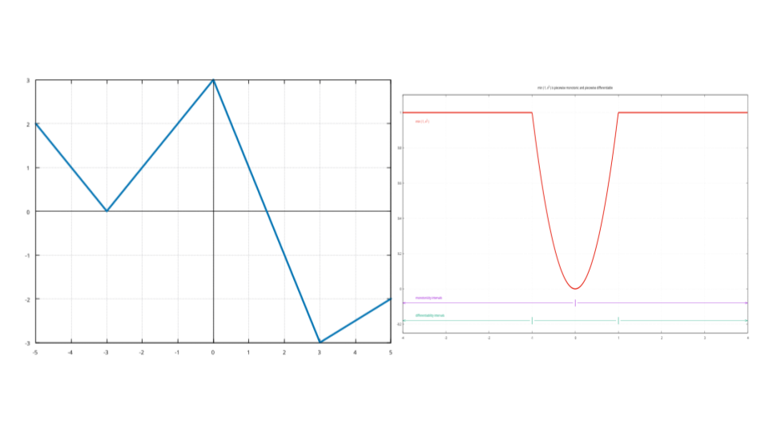
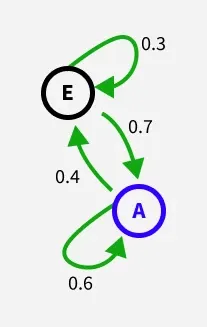
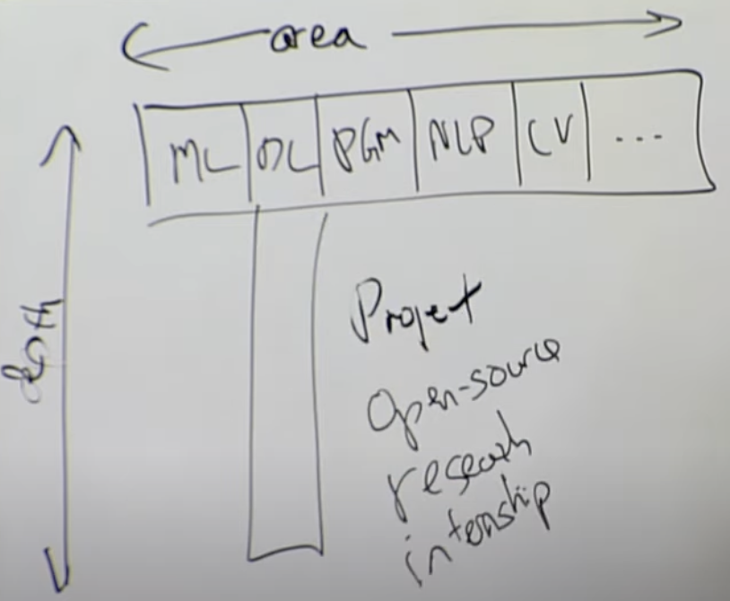

# Stub

## General Terminology
### Variables vs Parameters
- Variables : values that are input to a model.
  - i.e. input features in a neural network. ( = x)
- Parameters : values that are learned by the model during training.
  - i.e. weights, biases in a neural network. ( = W, b) 
  - theta : set of parameters in a model.

### ArgNax / ArgMin
- Arguments of maxima / minima.
- input points at which the function output value is maximized / minimized.

### Indicator function (Characteristic function)
 - Characteristic Function in Convex Analysis is a convex function that indicates the membership (or non-membership) of a given element in that set. Let $X$ be a set, and let $A$ be a subset of $X$. The characteristic function of $A$ is, 
 $$
 \chi_A(x) :=
\begin{cases} 
0, & x \in A; \\
+\infty, & x \notin A.
\end{cases}
$$
 - Indicator Function is a function that maps elements of the subset to one, and all other elements to zero. That is, if $A$ is a subset of some set $X$, then, 
 $$
 1_A : X \to \{0, 1\}
 $$

### Coordinate Vector
coordinate vector is a representation of a vector as an ordered list of numbers (a tuple) that describes the vector in terms of a particular ordered basis.  e.g.  
$
B = \{b_1, b_2, \dots, b_n\} \\
v = \alpha_1 b_1 + \alpha_2 b_2 + \dots + \alpha_n b_n \\
[v]_B = (\alpha_1, \alpha_2, \dots, \alpha_n)
$
coordinate vector of $v$ relative to B is $[v]_B$

### Soft vs Hard Constraints (Constrained Optimization)
- Soft Constraints
Some variable values that are penalized in the objective function if, and based on the extent that, the conditions on the variables are not satisfied.
- Hard constraints
Set conditions for the variables that are required to be satisfied.

### Necessity and Sufficiency
In logic and mathematics, necessity and sufficiency are terms used to describe a conditional or implicational relationship between two statements.  
For example, when conditional sentence "If $P$ then $Q$", 
$$P \Rightarrow Q"$$
 $Q$ is necessity for $P$ because the truth of $Q$ is guranteed by $P$.  
Similarly $P$ is sufficient for $Q$, because $P$ being true always implies that $Q$ is true. (But $P$ not being true does not always imply that $Q$ is not true)

### Polynomial
In mathematics, a polynomial is a mathematical expression consisting of indeterminates (also called variables) and coefficients, that involves only the operations of addition, subtraction, multiplication and exponentiation to nonnegative integer powers, and has a finite number of terms.

### Coefficient
In mathematics, a coefficient is a multiplicative factor involved in some term of a polynomial, a series, or any other type of expression. It may be a number without units, in which case it is known as a numerical factor.[1] It may also be a constant with units of measurement, in which it is known as a constant multiplier.

### Variable
In mathematics, a variable is a symbol, typically a letter, that holds a place for constants, often numbers. One say colloquially that the variable represents or denotes the object, and that the object is the value of the variable.  
A variable may represent a unspecified number that remains fixed during the resolution of a problem; in which case, it is often called a parameter. A variable may denote an unknown number that has to be determined

### Math Symbols
 - Logical NOT: It negates the condition that follows.
$$
\neg
$$
 - There exists: There exists hypothesis $h$ in the hypothesis class $\mathcal{{H}}$.
$$
\exists h \in \mathcal{H}
$$
 - For all : For all hypothesis $h$ in the hypothesis class $\mathcal{{H}}$.
$$
\forall h \in \mathcal{H}
$$
 -  there does not exist: the probability that there does not exist some element or condition satisfying a particular property. 
 $$
 \neg \exists
 $$

### Coefficient and Variable in Polynomial
$$
2X^2 - 3X + 2
$$
From above polynomial, coefficients are $2$, $-3$, $2$, and variable is $X$.

$$
aX^2 + bX + c = 0
$$
From above polynomial, parameters are $a,b,c$ and variable is $X$.

### Radon's theorem
### Convex Hull
### Additive Structure
In Machine Learning, additive structure refers to a functional form where the output is the sum of contributions from individual components, 
often represented as:  
$$
f(x) = \sum_{i=1}^{k} f_i(x_i).
$$
Each feature $x_i$ contributes independently to the output $f(x)$.  
Common examples include linear models and generalized additive models (GAMs).
It emphasizes how the model combines inputs additively, focusing on simplicity and interpretability.

In Mathematics, additive structure can describe systems where addition (or an analogous operation) plays a defining role, such as vector spaces, rings, or groups. It highlights how elements interact under the operation of addition.

### Interchanging the Order of Summation
$$
\text{If } \sum_{j=1}^\infty \sum_{k=1}^\infty |a_{jk}| < \infty, \text{ then } \sum_{j=1}^\infty \sum_{k=1}^\infty a_{jk} = \sum_{k=1}^\infty \sum_{j=1}^\infty a_{jk}.
$$

### Orientation
The orientation also knwon as attitude, bearing, direction, or angular position of an object – such as a line, plane or rigid body – is part of the description of how it is placed in the space it occupies. It refers to the imaginary rotation that is needed to move the object from a reference placement to its current placement.  

A rotation may not be enough to reach the current placement, in which case it may be necessary to add an imaginary translation to change the object's position (or linear position). The position and orientation together fully describe how the object is placed in space. 

### Angular Orientation
Angular Orientation($\displaystyle {\vec {\omega }}$) is a pseudovector representation of how the angular position or orientation of an object changes with time.  
For example, how quickly an object rotates (spins or revolves) around an axis of rotation and how fast the axis itself changes direction.

### Piece-Wise Function
In mathematics, a piecewise function (also called a hybrid function, or a function defined by cases) is a function whose domain is partitioned into several intervals ("subdomains") on which the function may be defined differently. As an example, consider the piecewise definition of the absolute value function,
$$
\displaystyle |x|={\begin{cases}-x,&{\text{if }}x<0\\+x,&{\text{if }}x\geq 0.\end{cases}}
$$
(Piece-Wise: with respect to a number of discrete intervals, sets, or pieces)

See also below two examples.
   
The left piece-wise linear function is defined as below.
$$
{\displaystyle f(x)=\left\{{\begin{array}{lll}-3-x&{\text{if}}&x\leq -3\\x+3&{\text{if}}&-3\leq x\leq 0\\3-2x&{\text{if}}&0\leq x\leq 3\\0.5x-4.5&{\text{if}}&3\leq x\\\end{array}}\right.}
$$
The right function is defined as below.
$$
{\displaystyle f(x)=\min(1,x^{2})} 
$$

### Euclidean Distance
The Euclidean distance between two points in Euclidean space is the length of the line segment between them. It can be calculated from the Cartesian coordinates of the points using the Pythagorean theorem, and therefore is occasionally called the Pythagorean distance.
$$
d(p,q)={\sqrt {(p_{1}-q_{1})^{2}+(p_{2}-q_{2})^{2}}}
$$

### Hot Storage vs Cold Storage
Hot storage is for data you need fast or access frequently. Cold storage is typically used for data you rarely need.  
To achieve the necessary rapid data access, hot storage is often housed in hybrid or tiered storage environments. The hotter the service, the more it embraces cutting-edge technologies, including the latest drives, fastest transport protocols, and geographical proximity to clients or multiple regions. However, the resource-intensive nature of hot storage warrants a premium, and leading cloud data storage providers like Microsoft’s Azure Hot Blobs and AWS S3 reflect this reality.  
Cold cloud storage systems prioritize durability and cost-effectiveness over real-time data manipulation capabilities. Services like Amazon Glacier and Google Coldline take this approach, offering slower retrieval and response times than their hot storage counterparts. Lower performing and less expensive storage environments, both on-premises and in the cloud, commonly host cold data. 

### Throttling
Throttling is a process that is used to control the usage of APIs by consumers during a given period. You can define throttling at the application level and API level. Throttling limit is considered as cumulative at API level. 

<b> Hard Throttling </b>  
Hard throttling enforces strict limits. Once a client reaches its quota, any additional requests are immediately rejected.

<b> Soft Throttling </b>  
Soft throttling provides a more generous approach. Instead of outright rejecting requests, soft throttling may:
- Allow a certain percentage of excess requests to pass through.
- Queue excess requests for processing once traffic subsides.

### Envy-Freeness
Envy-freeness is a criterion for fair division. When resources are allocated among people with equal rights, each person should receive a share that is, in their eyes, at least as good as the share received by any other agent. In other words, no person should feel envy.

### Oversampling and Undersampling
#### Oversampling
Oversampling make a dataset more balanced when one group has a lot fewer examples than the other. The way it works is by making more copies of the examples from the smaller group. This helps the dataset represent both groups more equally.

#### Undersampling
On the other hand, undersampling works by deleting some of the examples from the bigger group until it’s almost the same in size to the smaller group. In the end, the dataset is smaller, sure, but both groups will have a more similar number of examples.

### Structural Causal Model (SCM)
In metaphysics and statistics, SCM is a conceptual model that represents the causal mechanisms of a system. Causal models often employ formal causal notation, such as structural equation modeling or causal directed acyclic graphs (DAGs), to describe relationships among variables and to guide inference.


## A.I Related Terminology
### Supervised Learning
Supervised learning (SL) is a paradigm in machine learning where input objects (for example, a vector of predictor variables) and a desired output value (also known as a human-labeled supervisory signal) train a model.  
The training data is processed, building a function that maps new data to expected output values.  
An optimal scenario will allow for the algorithm to correctly determine output values for unseen instances.
#### Algorithms
The most widely used learning algorithms are:
- Support-vector machines
- Linear regression
- Logistic regression
- Naive Bayes
- Linear discriminant analysis
- Decision trees
- K-nearest neighbor algorithm
- Neural networks (Multilayer perceptron)
- Similarity learning

### Deep Learning vs Reinforcement Learning
Deep learning and reinforcement learning are both systems that learn autonomously.  
The difference between them is that deep learning is learning from a training set and then applying that learning to a new data set, while reinforcement learning is dynamically learning by adjusting actions based in continuous feedback to maximize a reward.

### LLM
A large language model (LLM) is a computational model notable for its ability to achieve general-purpose language generation and other natural language processing tasks such as classification. 
Based on language models, LLMs acquire these abilities by learning statistical relationships from vast amounts of text during a computationally intensive self-supervised and semi-supervised training process.
LLMs can be used for text generation, a form of generative AI, by taking an input text and repeatedly predicting the next token or word.
LLMs are artificial neural networks that utilize the transformer architecture, invented in 2017. The largest and most capable LLMs, as of June 2024, are built with a decoder-only transformer-based architecture, which enables efficient processing and generation of large-scale text data.

### Parametic vs Non-Parametic Learning Algorithm
- Parametic : fixed finite number of parameters ($\theta$) for fitting to the data. So After fitting theta, trainning data is no more needed to make prediction.    
e.g. linear regression
- Non-Parametic : the amount of stuff we need to keep in order to represent the hypothesis $h$ grows linearly with the size of the training set. Also need to have entire training set to make prediction.  
e.g. locally weighted linear regression

### Supervised Learning
As in supervised learning problems, first pick a representation for our hypothesis class (what we are trying to learn) and after that pick a loss function that we will minimize.

### Model and Regression
- Model is a broader concept and encompasses any algorithm that can make predictions.
- Regression specifically refers to a family of methods/models focused on predicting continuous outcome.

#### Linear Model and Regression
Linear model is a broad term that includes any model with a linear relationship between variables, while Linear Regression specifically refers to the task of predicting a continuous outcome using a linear relationship.

#### Logistic Model and Regression
Logistic model is a broader term that refers to any model using a logistic function for classification or other purposes. Logistic regression is a specific statistical method that uses a logistic model to perform binary classification.

### Calibration
Calibration is the degree to which the probabilities predicted by a classification model match the true frequencies of the target classes in a dataset.  
(모형의 예측값이, 실제 확률을 반영하는 것. 예를 들어, X 의 Y1 에 대한 모형의 출력이 0.8이 나왔을 때, 80 % 확률로 Y1 일 것라는 의미를 갖도록 만드는 것입니다.)  
For example, if we make a lot of predictions with a perfectly calibrated binary classification model, and then consider only those for which the model predicted a 70% probability of the positive class, then the model should be correct 70% of the time.  
Similarly, if we only consider the examples for which our model predicted a 10% probability of the positive class, the ground truth will turn out to indeed be positive in one-tenth of the cases.  
A well-calibrated model produces predictions that are closely aligned with the actual outcomes on aggregate.

Calibration cannot be evaluated with a single prediction.
You need many predictions to see whether actual accuracy matches predicted confidence.

#### Binning
Binning is a data pre-processing technique used to reduce the effects of minor observation errors. The original data values which fall into a given small interval, a bin, are replaced by a value representative of that interval, often a central value (mean or median).  

<b> Uniform Binning </b>  
Splitting the interval into $n$ bins of equal width. It is great if you would like to equally assess the calibration throughout the entire interval, but it does not take into account that there might be some bins in which no or few samples will fall, making these bins statistically less significant than those in which plenty of data is contained.

<b> Quantile Binning </b>  
Generating $n$ bins by splitting the entire samples into $n$ quantiles. It guarantees that all the bins that you create are of similar size.  

#### Accuracy vs Confidence vs Calibration 
- Accuracy measures the percentage of correct predictions made by the model. 
  - "How many predictions were correct"
- Confidence is the model’s average predicted probability. (in the bin)
  - "How strongly the model believed its predictions" 
- Calibration measures the alignment between the predicted probabilities and the actual likelihood of the predicted events. In other words, calibration is the comparison of measurement values delivered by a device under test(model) with those of a calibration standard of known accuracy.
  - "Whether accuracy = confidence" 

#### Expected Calibration Error (ECE) vs Maximum Calibration Error(MCE)
$$
\mathrm{ECE} = \sum_{i=0}^{M} \frac{|B_i|}{N} \left| \,\overline{y}(B_i) - \overline{p}(B_i)\, \right|
$$
- $\overline{y}(B_i)$: the fraction of true positives inside the bin.
- $\overline{p}(B_i)$: mean predicted scores inside the bin.
- $|B_i|$: the number of samples inside the bin.
- $n$: the number of total samples.
- $M$: the number of bins.

ECE is the weighted average of the distance of the calibration curve of your model to the diagonal.

$$
\mathrm{MCE} = \max_{i \in (1,\ldots,M)} \left|\, \overline{y}(B_i) - \overline{p}(B_i)\, \right|
$$
MCE is the maximum distance between the calibration curve of the model and the diagonal.

#### Scoring Rules
ECE and MCE cannot be used as a metric to be minimised in the training process of a classifier. This is because it could cause the model to output trivial, useless scores, such as giving a score of 0.5 to each of the samples on a balanced data set. 

Thus, in order to train a model it is more useful to consider proper scoring rules, which are calculated at the sample level rather than by binning the scores. The advantage of score rules is that their value depends both on how well the model is calibrated and how good it is at distinguishing classes, so obtaining low values for a proper scoring rule means that a model is good at discriminating and is also well-calibrated.  

Unfortunately, due to this very same nature, proper scoring rules might not be sufficient to evaluate if a model is calibrated, so the best thing to do is to combine them with ECE and MCE.
##### Brier Score
$$
{\displaystyle BS={\frac {1}{N}}\sum \limits _{t=1}^{N}(f_{t}-o_{t})^{2}\,\!}
$$
- $f_{t}$ is the probability that was forecast at instance $t$
- $o_{t}$ is the actual outcome of the event at instance $t$
Check the differences between ECE.  

| Metric    | Compares                                  | Meaning                   |
| --------- | ----------------------------------------- | ------------------------- |
| **ECE**   | probability vs probability (bin accuracy) | Calibration only          |
| **Brier** | probability vs actual label (0/1)         | Calibration + Discrimination |

##### Log-loss
$$
\mathrm{LL} = -\, y \log(\hat{p}) \;-\; (1 - y)\,\log(1 - \hat{p})
$$

##### Example of Using Score Rules
| Prediction | True y | Brier Score         | Log-Loss             | ECE Meaning                          |
| ---------- | ------ | ------------------- | -------------------- | ------------------------------------ |
| **0.9**    | 1      | **0.01 (great)**    | **0.105 (great)**    | Good calibration if many 1s          |
| **0.9**    | 0      | **0.81 (very bad)** | **2.302 (very bad)** | Overconfident & wrong                |
| **0.5**    | 1      | **0.25 (medium bad)**       | **0.693 (medium bad)**       | Good calibration if balanced dataset |
| **0.5**    | 0      | **0.25 (medium bad)**       | **0.693 (medium bad)**       | Good calibration if balanced dataset |

#### Calibration Methods
##### Platt Scaling
##### Isotonic Regression
##### Beta calibration

### Prior Probability & Posterior Probability
#### Prior Probability
A prior probability distribution of an uncertain quantity, often simply called the prior, is its assumed probability distribution before some evidence is taken into account.  
In Bayesian statistics, Bayes' rule prescribes how to update the prior with new information to obtain the posterior probability distribution, which is the conditional distribution of the uncertain quantity given new data. 
#### Posterior Probability
A type of conditional probability that results from updating the prior probability with information summarized by the likelihood via an application of Bayes' rule.  
In the context of Bayesian statistics, it is a conditional distribution over the unobserved random variables, conditioned on the observed random variables. e.g., $p(\theta \mid x,y)$

### Error 
Errors refer to the discrepancies between the predicted output of a neural network model and the actual or desired output. These errors are used to compute the loss or cost function, which measures how well the model is performing on a given task. The goal of training a deep learning model is to minimize these errors or the associated loss function.

### Training error(Empirical error) vs Generalization error
Training error is measured on training data - the data used to construct the model.  
Generalization error is the error expected on new cases, and is usually estimated by measuring the error on a test data set, which is not used during model construction.

### Affine Layer
An affine layer, also called a fully connected layer or dense layer, is a layer in which the input signal of the neuron is multiplied by the weight, summed, and biased. An affine layer can be a layer of an artificial neural network in which all contained nodes connect to all nodes of the subsequent layer.  
It is a type of layer where each input is connected to each output by a learnable weight. Affine layers are commonly used in both traditional neural networks and deep learning models to transform input features into outputs that the network can use for prediction or classification tasks.  

### Covariate Shift
Covariate shift is a specific type of dataset shift often encountered in machine learning. It is when the distribution of input data shifts between the training environment and live environment. Although the input distribution may change, the output distribution or labels remain the same. Covariate shift is also known as covariate drift, and is a very common issue encountered in machine learning. Models are usually trained in offline or local environments on a sample of labelled training data. It’s not unusual for the distribution of inputs in a live and dynamic environment to be different from the controlled training environment.  

### Logit
In machine learning, logit is the vector of raw (non-normalized) predictions that a classification model generates, which is ordinarily then passed to a normalization function.  
If the model is solving a multi-class classification problem, logits typically become an input to the softmax function. The softmax function then generates a vector of (normalized) probabilities with one value for each possible class.

### Model vs Embedding
<b> Model </b>
- Everything needed to re-create a Keras / TF model:
- Layer graph / architecture
- All trainable weights (including any embedding layer)
- (Optionally) optimizer state, loss, metrics
- .h5, .keras, sometimes .pb
```
model_shakespeare_kiank_350_epoch.h5
└── architecture JSON
└── layer weights  (Embedding, LSTM, Dense …)
└── optimizer state (Adam, SGD … if present)
```
```python
from keras.models import load_model
model = load_model("model_shakespeare.h5", compile=False)
model.compile(optimizer="adam", loss="categorical_crossentropy")
```

<b> Embedding </b>
- Only a lookup table that maps tokens → vectors (e.g. GloVe, word2vec, fastText). No layer definitions, no other weights
- .txt, .vec, .bin, sometimes .npy, .pkl
```
the        0.418 0.249 …  (100 floats)
to         0.680 0.540 …
```
```python
embedding_matrix = np.loadtxt("glove.6B.100d.txt", skiprows=1)
embedding_layer = keras.layers.Embedding(
       input_dim=vocab_size,
       output_dim=100,
       weights=[embedding_matrix],
       trainable=False)
```

### Markov Model
Markov model is a stochastic model used to model pseudo-randomly changing systems. It is assumed that future states depend only on the current state, not on the events that occurred before it. The simplest Markov model is the Markov chain. 

#### Markov Chain
A Markov chain is a way to describe a system that moves between different situations called "states", where the chain assumes the probability of being in a particular state at the next step depends solely on the current state. 

For example, let'x consider two-state Markov chain below.
   

If in state A:
- Stays in A: probability 0.6
- Moves to E: probability 0.4  

If in state E:
- Moves to A: probability 0.7
- Stays in E: probability 0.3

Also note that a Markov chain can be illustrated as a directed graph, where nodes represent the states (A, E), arrows indicate possible transitions and the numbers on arrows show transition probabilities.

### Auto-Regressive Model
Autoregressive modeling is a machine learning technique most commonly used for time series analysis and forecasting that uses one or more values from previous time steps in a time series to create a regression.  
The Auto-Regressive(AR) Model is defined as follws.
$$
{\displaystyle X_{t}=\sum _{i=1}^{p}\varphi _{i}X_{t-i}+\varepsilon _{t}}
$$
where $\varphi _{1},\ldots ,\varphi _{p}$ are the parameters of the model, and $\varepsilon _{t}$ is white noise.

### Model Collapse
Model collapse is a phenomenon where machine learning models gradually degrade due to errors coming from uncurated(선별되지 않은) training on the outputs of another model, such as prior versions of itself.  

<b> Symptoms of Model Collapse </b>
- In early model collapse, the model begins losing information about the tails of the distribution – mostly affecting minority data. Later work highlighted that early model collapse is hard to notice, since overall performance may appear to improve, while the model loses performance on minority data.
- In late model collapse, the model loses a significant proportion of its performance, confusing concepts and losing most of its variance.

<b> Reasons for Model Collapse </b>
- Functional approximation errors
- Sampling errors
- Learning errors

### Embedding Collapse
- Complete Collapse: the representation vectors shrink to a single point in the embedding space (i.e. constant features), meaning that the model creates the same embedding for each input.
- Dimensional Collapse: a less severe, but harder-to-detect collapse pattern where the representation vectors end up occupying a small subspace instead of the full embedding space, i.e. the collapse is along certain dimensions.

Collapsed embeddings tend to occupy a small subspace of the whole embedding space. Generally speaking, this concentration of information in a few dimensions weakens the distinguishability of representations for downstream tasks. It also reduces the model’s generalization ability, as collapse creates a bottleneck preventing learning of complex patterns. This often translates to poor performance on long-tail items. Lastly, when embeddings collapse to a lower dimensional space, they tend to cluster towards a few popular items, leading to popularity bias. 

### Quantizations
<b> Quantization in Machine Signal Processing</b>  
Quantization is a technique to reduce the computational and memory costs of running inference by representing the weights and activations with low-precision data types like 8-bit integer (int8) instead of the usual 32-bit floating point (float32).

<b> Quantization in Machine Learning</b>  
Quantization is the process of constraining an input from a continuous or otherwise large set of values (such as the real numbers) to a discrete set (such as the integers). 
(연속된 변화량을 유한개의 레벨로 구분하고, 각 레벨에 대해 특정 값을 부여하는 것)  

### Vector Quantizations
Mapping continuous latent representations into discrete embeddings. It works by dividing a large set of points (vectors) into groups having approximately the same number of points closest to them. Each group is represented by its centroid point, as in k-means and some other clustering algorithms. In simpler terms, vector quantization chooses a set of points to represent a larger set of points.

https://en.wikipedia.org/wiki/Vector_quantization
code book?, code embedding?

### Downstream Task
Downstream task is the task that you actually want to solve.  
You first learn representations of the data, then you can transfer these learned representations to solve a task that you actually want to solve, and you can do this by fine-tuning the neural network that contains the learned representations on a labeled.

### Membership Inference Attacks (MIAs in Machine Learning)
Membership inference attacks occur when an attacker manipulates the model’s training data in order to cause it to behave in a way that exposes sensitive information.

<b>User-level MIA</b>  
- 공격 단위: 사용자 전체
- 질문: “이 사용자가 학습에 포함됐나?”
- 정보 노출 위험: 사용자가 존재했다는 사실  

<b>Interaction-level MIA</b>  
- 공격 단위: 사용자–아이템 쌍
- 질문: “이 사용자의 특정 행동이 학습에 포함됐나?”
- 정보 노출 위험: 특정 행동(구매, 클릭 등)이 존재했다는 사실

https://arxiv.org/pdf/1610.05820

### Shadow Model vs Surrogate Model
둘 다 공격자가 target 모델(공격 대상 모델) 을 흉내내기 위해 사용하는 replicated or mimicked model.  

<b> Shadow Model </b>  
공격자가 target 모델과 동일한 구조·하이퍼파라미터 를 가정하거나 알고 있다고 전제하고, 자신이 가진 별도의 데이터(shadow dataset) 로 target 모델을 “흉내내어” 학습한 모델.  

<b> Surrogate Model </b>  
Surrogate model is an interpretable model that is trained to approximate the predictions of a black box model.  
공격자가 target 모델의 내부 구조나 학습 데이터에 접근할 수 없을 때, 단지 black-box 쿼리(입력 → 출력) 만으로 target의 행동(behavior) 을 모방하도록 학습한 모델.

### Knowledge Distillation
A machine learning technique that aims to transfer the learnings of a large pre-trained model, the “teacher model,” to a smaller “student model.” It’s used in deep learning as a form of model compression and knowledge transfer, particularly for massive deep neural networks.  
https://arxiv.org/pdf/1503.02531

### Multi-Armed Bandit vs Contextual Bandit
In the multi-armed bandit problem, decisions are made without context. Every action’s outcome depends only on prior attempts. 

In a contextual bandit, the model considers the context of the current scenario, making its decisions more relevant to individual users or situations.  

Think of it this way: if a multi-armed bandit is like a static online ad shown to every user regardless of their preferences, a contextual bandit is like a dynamic online ad that changes based on the user’s browsing history, location, or even the time of day.

#### Multi-Armed Bandit Problem
It is a problem in which a decision maker iteratively selects one of multiple fixed choices (i.e., arms or actions) when the properties of each choice are only partially known at the time of allocation, and may become better understood as time passes

### Maximum Marginal Relevance
최대 한계 관련성(Maximum Marginal Relevance, MMR) 검색 방식은 유사성과 다양성의 균형을 맞추어 검색 결과의 품질을 향상시키는 알고리즘입니다. 이 방식은 검색 쿼리에 대한 문서들의 관련성을 최대화하는 동시에, 검색된 문서들 사이의 중복성을 최소화하여, 사용자에게 다양하고 풍부한 정보를 제공하는 것을 목표.
$$
\operatorname*{Arg\,max}_{D_i \in R \setminus S}
\left[
\lambda \, \text{Sim}_1(D_i, Q) 
- (1 - \lambda) \, \max_{D_j \in S} \text{Sim}_2(D_i, D_j)
\right]
$$
- $R$: The ranked list of documents retrieved by an IR system.
- $S$: The subset of documents in R already selected.
- $R/S$: The set of as yet unselected documents in R.
- $\text{Sim}_1(D_i, Q)$: 문서(d)와 쿼리(Q) 사이의 유사성을 나타냅니다.
- $\text{Sim}_2(D_i, D_j)$: 문서(d)와 이미 선택된 문서 집합(D') 중 가장 유사한 문서와의 유사성을 나타냅니다.
- $\lambda$: 유사성과 다양성의 상대적 중요도를 조절하는 매개변수.

To simplyfy, it can be considered as following.
```
MMR Score = λ × relevance - (1 - λ) × max_similarity_to_selected
```

Reference: https://www.cs.cmu.edu/~jgc/publication/The_Use_MMR_Diversity_Based_LTMIR_1998.pdf

### Model Agnostic Method
Model-Agnostic 방법은 모델의 구조나 알고리즘에 상관없이 모든 머신러닝 모델에 적용할 수 있는 접근법을 말합니다. 이때 "Agnostic"이라는 용어는 특정 모델에 의존하지 않는다는 의미로 사용됩니다. 해당 방법은 모델을 블랙박스처럼 취급하며, '입력과 출력'에만 초점을 맞춰 예측을 해석합니다. 이러한 보편성 덕분에 Model-Agnostic 방법은 단순한 선형 모델에서부터 복잡한 신경망에 이르기까지 모든 모델에서 사용할 수 있습니다.

### Tips for reading papers
Compile list of paper (including blogs and medium posts) and skipping around the list.
Steady learning, Not short burst.

<b> Reading 1 Paper</b>
1. Title, Abstract, Figures
2. Intro, Conclusition and skim rest (skip related works)
3. Read but skip the math
4. Whole things but skip parts that don't make sense.

<b> To have good understanding of paper </b>
Make sure you can have answer to questions below.
- What did authors try to accomplish?
- What were the key elements of the approach?
- What can you use yourself?
- What other references do you want to follow?

<b> Sources of papers </b>
- Twitter
- Reddit - ML Subreddit
- NIPS/ICMC/ICLR

<b> Math and Code </b>
- Try to rederive the math or code from the scratch.

<b> Machine Learning Engineer </b>


- Have broad understanding of many different topics in AI Machine Learning. While also have very deep understanding in at least one area. 
- To deepen the understanding, work on project, open-source contribution, research or job.