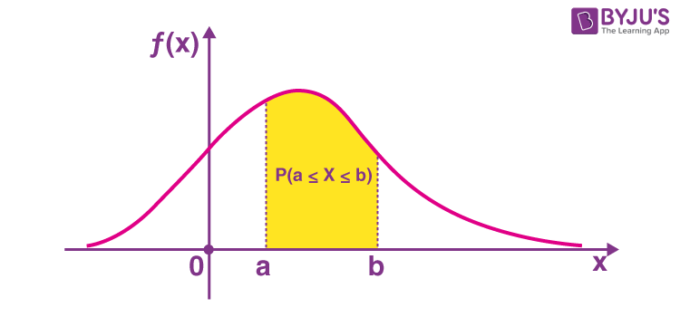

# Stub

## Terminology
### Variables vs Parameters
- Variables : values that are input to a model.
  - i.e. input features in a neural network. ( = x)
- Parameters : values that are learned by the model during training.
  - i.e. weights, biases in a neural network. ( = W, b) 
  - theta : set of parameters in a model.

### Train, Dev, Test Set
train on the training set, evaluate results on the dev set, and test on the test set.
so do not test your model on the test set until you have finished handling overfitting.

### ArgNax / ArgMin
- Arguments of maxima / minima.
- input points at which the function output value is maximized / minimized.

## Math
### Vertical Bars
- $|x|$ if $x$ is a number, it denotes abolute value.  
- $|A|$  if $A$ is a matrix, it denotes determinant.  
- $|S|$ if $S$ is a set, it denotes its cardinality(the number of elements of the set).

### Statistics
#### L2 Norm
#### Gaussian Distribution (= Normal Distribution)
#### Joint Probability
- P(A, B) = p(A ∩ B) : likelihood of events occurring together at the same point in time.
#### Probability vs Likelihood
- In Deep Learning
  - same function can be interpreted in two ways: as a function of data given parameters, or as a function of parameters given data. 
  - probability : function of data given parameters. (parameters are fixed and data is varying)
  - likelihood : function of parameters given data. (data is fixed and parameters are varying)
- In Statistics
  - probability : chance that a particular outcome occurs based on the values of parameters in a model. 
    - (확률 분포가 고정된 상태에서, 관측되는 사건이 변화될 때 확률)
  - likelihood : how probable a particular set of observations is, given a set of model parameters. = likelihood is used to estimate the parameters of a model given a set of observations.
    - (관측된 사건이 고정된 상태에서, 확률 분포가 변화될 때(=확률 분포를 모를 때 = 가정할 때) 확률)
    - maximum likelihood estimation (MLE) = method of estimating the parameters of a statistical model given observations, by finding the parameter values that maximize the likelihood of observing the data.
  - In discrete case : probability = likelihood
  - In PDF
    - probability = area under the curve.
    - likelihood = y-axis value.

#### Cumulative Distribution Function(CDF) vs Probability Density Function(PDF) vs Probability Mass Function(PMF)
- PDF: continuous random variable

 - $\Pr[a \leq X \leq b] = \int_a^b f_X(x) \, dx$
 - E(X) = = mu(mean) = integral(x * f(x) dx) 
 - Var(X) = integral((x - E(X))^2 * f(x) dx)  
 - if $F_X$ is thecumulative distribution function of $X$,  
$F_X(x) = \int_{-\infty}^x f_X(u) \, du,$
and (if $f_X$ is continuous at $x$) $f_X(x) = \frac{d}{dx} F_X(x)$.

#### Expected Value vs Mean vs Average
 - average and mean : mathematically, average and mean are same. So basic formulas used to calculate average and mean are also the same. But the difference between them lies in context in which they are use. The term average is used to estimate an approximate value of a given data in general purpose. However, the use of word in “mean” is specifically used in the context of statistics. In other words, mean is specifically used to represent the average of the statististical data.
(average == mean)
 - mean vs expected value : mean is typically used when we want to calculate the average value of a given sample. This represents the average value of raw data that we’ve already collected. However, expected value is used when we want to calculate the mean of a probability distribution. This represents the average value we expect to occur before collecting any data. 
 In other words, expected value is generalization of the weighted average. Informally, the expected value is the arithmetic mean of the possible values a random variable can take, weighted by the probability of those outcomes. 

### Calculus
#### Chain Rule
#### Jacobian vs Gradients vs Hessian vs Laplacian
https://darkpgmr.tistory.com/132

#### Differential vs Derivative vs Gradient
#### Epsilon in Calculus
- Epsilon is a small positive number, often used in numerical computation to avoid division by zero or taking the logarithm of zero.
#### Epsilon-Delta Definition of Limit

### Linear Algebra
#### Feasible Point/Region
 - point : A point x that satisfies all the constraints is called a feasible point and thus is a feasible solution to the problem. 
 - region : A set of all possible points (sets of values of the choice variables) of an optimization problem that satisfy the problem's constraints, potentially including inequalities, equalities, and integer constraints.
#### Convex and Concave Function
Convex function : function is convex if the line segment between any two distinct points on the graph of the function lies above the graph between the two points. (볼록 함수 - 아래로 볼록)
Concave function : function is concave if the line segment between any two distinct points on the graph of the function lies below the graph between the two points. (오목 함수 - 아래로 오목)
#### Convex Optimization
- Convex optimization problems : subfield of mathematical optimization that studies the problem of minimizing convex functions over convex sets (or, equivalently, maximizing concave functions over convex sets).
- Convex set : given any two points in the subset, the subset contains the whole line segment that joins them. 
  Equivalently, a convex set or a convex region is a subset that intersects every line into a single line segment.
- Optima in Convex Optimization : local optima are global optima.

#### Domain of a Function
- the set of inputs accepted by the function. It is sometimes denoted by dom(f) or dom f,  where f is the function. 
- in layman's term, "what x can be".
- e.g. ``f(X) -> y, dom(f) = X``
#### Vector and Matrix
##### Row Vector vs Column Vector
##### Span, Range, Rank and Null Space
##### Vector Multiplication
https://rfriend.tistory.com/145
https://rfriend.tistory.com/146
- Dot Product
- Inner Product
- Outer Product
##### Matrix Multiplication

#### Affine Function
An affine function is a function composed of a linear function + a constant and its graph is a straight line. (즉 가중치 합(=Weighted Sum)에 bias(b)를 더해준 것)
#### Affine hull
smallest affine set containing S, in other words, the intersection of all affine sets containing S.

#### Bounded/Unbounded
A set is called bounded if all of its points are within a certain distance of each other. 
Conversely, a set which is not bounded is called unbounded. 

#### Bounded Above/Below, Upper/Lower Bound and Least Upper/Greast Lower Bound (Supremum, Infimum) 
- A set $E \subseteq \mathbb{R}$ is bounded above(or below) if there is a real number M, called an upper(or lower) bound of E, such that $x <= M$ (or $x >= M$), for all $x \in \mathbb{R}$

- A real number M is the least upper(or greast lower) bound, or supremum(or infimum), of a set  $E \subseteq \mathbb{R}$ if,
1. M is an upper(or lower) bound of E
2. each M' < M is not an upper bound of E. In this case, we write M = supE.  
(or each M' > M is not an lower bound of E. In this case, we write M = infE.)
- 쉽게 말하면, 상계(upper bound)에 속하는 값들 중에서 가장 작은 값이 상한(supremum)이 되고 하계(lower bound)에 속하는 값들 중에서 가장 큰 값이 하한(infimum)이 된다.

#### Indicator function (Characteristic function)
https://en.wikipedia.org/wiki/Characteristic_function_(convex_analysis)

#### Soft vs Hard Constraints

#### Coordinate Vector
coordinate vector is a representation of a vector as an ordered list of numbers (a tuple) that describes the vector in terms of a particular ordered basis.  e.g.  
$
B = \{b_1, b_2, \dots, b_n\} \\
v = \alpha_1 b_1 + \alpha_2 b_2 + \dots + \alpha_n b_n \\
[v]_B = (\alpha_1, \alpha_2, \dots, \alpha_n)
$
coordinate vector of $v$ relative to B is $[v]_B$
 