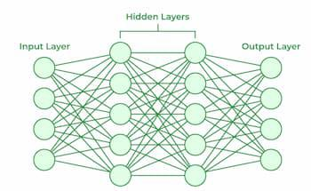
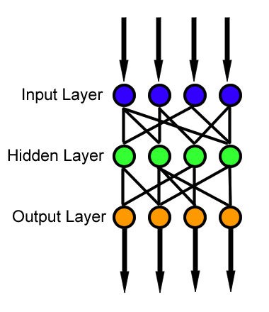
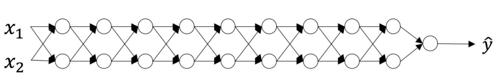

# Neural Networks
  
An ANN(Artificial Neural Network) consists of connected units or nodes called artificial neurons, which loosely model the neurons in the brain.  
Part of the magic of a neural network is that all you need are the
input features $x$ and the output $y$ while the neural network will figure out everything in the middle by itself. 
This is why some people refer to neural networks as a black box, as it can be dicult to understand the features it has invented.

These networks are built from several key components:

 - Neurons: The basic units that receive inputs, each neuron is governed by a threshold and an activation function.
 - Connections: Links between neurons that carry information, regulated by weights and biases.
 - Weights and Biases: These parameters determine the strength and influence of connections.
 - Propagation Functions: Mechanisms that help process and transfer data across layers of neurons.
 - Learning Rule: The method that adjusts weights and biases over time to improve accuracy. (such as supervised learning, unsupervised learning and reinforcement learning)

## Logistic Regression as a specific case of a Neural Network
Mathematically a certain neural network architecture trained with a certain loss coincides exactly with logistic regression at the optimal parameters.  
$$
\hat{y} = \sigma(X\beta + \beta_0)
$$

A binary logistic regression makes predictions $\hat{y}$ is above where $X$ is a $n \times p$ matrix of features (predictors, independent variables) and vector $\beta$ is the vector of $p$ coefficients and $\beta_0$ is the intercept and $\sigma(z) = \frac{1}{1+e^{-z}}$.  

On the other hand, a neural network with no hidden layers and one output neuron with a sigmoid activation makes predictions using the equation is same as above. 

A logistic regression has the Bernoulli likelihood as its objective function, or, equivalently, the Bernoulli log-likelihood function as below.
$$
\arg\max_{\beta, \beta_0} \sum_i \left[ y_i \log(\hat{y}_i) + (1 - y_i) \log(1 - \hat{y}_i) \right]
$$
In neural network, you use any loss function you like. So itt might use the so-called "cross-entropy" function in which case the model minimizes this loss function as below.
$$
\arg\min_{\beta, \beta_0} -\sum_i \left[ y_i \log(\hat{y}_i) + (1 - y_i) \log(1 - \hat{y}_i) \right]
$$
In both cases, these objective functions are strictly convex (concave) when certain conditions are met. Strict convexity implies that there is a single minimum and that this minimum is a global. Moreover, the objective functions are identical, since minimizing a strictly convex function $f$ is same as maximizing $-f$.

Therefore, in architecture perspective, logistic regression is a special case of neural net. A logistic regression model can be constructed via neural network libraries. In the end, both have neurons having the same computations if the same activation and loss is chosen. 

## Neuron

### Linear Function
Each neuron in a layer receives inputs, which are multiplied by the weights associated with the connections. These products are summed together, and a bias is added to the sum. This can be represented mathematically as:
$$
z = w_1x_1 + w_2x_2 + \ldots + w_nx_n + b
$$
Where $w$ represent weight, $x$ represent input and $b$ represent bias.

### Active Function
The result of the linear transformation($z$) is then passed through an activation function. The activation function is crucial because it introduces non-linearity into the system, enabling the network to learn more complex patterns.  
Popular activation functions include ReLU, sigmoid, and tanh.

## Feed-Forward Neural Network
  
A Feedforward Neural Network (FNN) is a type of artificial neural network where connections between the nodes do not form cycles. This characteristic differentiates it from recurrent neural networks (RNNs). Recurrent neural networks, or neural networks with loops allow information from later processing stages to earlier stages for sequence processing.  
However, at every stage of inference a feedforward multiplication remains the core, essential for backpropagation. Thus neural networks cannot contain feedback where the outputs feed back to the very same inputs and modify them, because this forms an infinite loop which is not possible to rewind in time to generate an error signal through backpropagation. 

## Forward Propagation
When data is input into the network, it passes through the network in the forward direction, from the input layer through the hidden layers to the output layer. This process is known as forward propagation. 

## Backpropagation
In machine learning, backpropagation is a gradient estimation method commonly used for training a neural network to computes the gradient in weight space of a feedforward neural network, with respect to a loss function.  
Backpropagation computes the gradient of a loss function with respect to the weights and bias of the network for a single input–output example, computing the gradient one layer at a time, iterating backward from the last layer to avoid redundant calculations of intermediate terms in the chain rule.  
For example consider below gradient of loss with respect to weight $W^{[3]}$, 
$$
\frac{\partial \mathcal{L}}{\partial W^{[3]}} = \left( a^{[3]} - y \right) a^{[2]}
$$
By applying chain rule to above gradient $\frac{\partial \mathcal{L}}{\partial W^{[3]}}$, you can compute $\frac{\partial \mathcal{L}}{\partial W^{[2]}}$ as well like below.
$$
\frac{\partial \mathcal{L}}{\partial W^{[2]}} =
\frac{\partial \mathcal{L}}{\partial a^{[3]}}
\frac{\partial a^{[3]}}{\partial z^{[3]}}
\frac{\partial z^{[3]}}{\partial a^{[2]}}
\frac{\partial a^{[2]}}{\partial z^{[2]}}
\frac{\partial z^{[2]}}{\partial W^{[2]}}
=
\underbrace{(a^{[3]} - y)}_{\frac{\partial \mathcal{L}}{\partial a^{[3]}}}
\underbrace{W^{[3]}}_{\frac{\partial z^{[3]}}{\partial a^{[2]}}}
\underbrace{g'(z^{[2]})}_{\frac{\partial a^{[2]}}{\partial z^{[2]}}}
\underbrace{a^{[1]}}_{\frac{\partial z^{[2]}}{\partial W^{[2]}}}.
$$

### Why element wise multiplication?
From above equation, the shapes of therms do not align properly.
$$
\underbrace{\frac{\partial \mathcal{L}}{\partial W^{[2]}}}_{2 \times 3} =
\underbrace{(a^{[3]} - y)}_{1 \times 1}
\underbrace{W^{[3]}}_{1 \times 2}
\underbrace{g'(z^{[2]})}_{2 \times 1}
\underbrace{a^{[1]}}_{3 \times 1}
$$
So must rearrange the terms by using properties of matrix algebra such that the matrix operations produce a result with the correct output shape.
$$
\underbrace{\frac{\partial \mathcal{L}}{\partial W^{[2]}}}_{2 \times 3} =
\underbrace{W^{[3] \top}}_{2 \times 1}
\circ
\underbrace{g'(z^{[2]})}_{2 \times 1}
\underbrace{(a^{[3]} - y)}_{1 \times 1}
\underbrace{a^{[1] \top}}_{1 \times 3}
$$

## delta

## Initialization Techniques
The initialization step can be critical to the model’s ultimate performance, and it requires the right method. Initializing all the weights with zeros leads the neurons to learn the same features during training.  
In fact, any constant initialization scheme will perform very poorly. Consider a neural network with two hidden units, and assume we initialize all the biases to 0 and the weights with some constant $\alpha$. If we forward propagate an input $(x_1, x_2)$ in this network, the output of both hidden units will be $\text{relu}({\alpha x_1 + \alpha x_2})$.  
Thus, both hidden units will have identical influence on the cost, which will lead to identical gradients. Thus, both neurons will evolve symmetrically throughout training, effectively preventing different neurons from learning different things.

### Vanishing / Exploding Gradient

At every iteration of the optimization loop (forward, cost, backward, update), we observe that backpropagated gradients are either amplified or minimized as you move from the output layer towards the input layer.

Assume all the activation functions are linear (identity function). Then the output activation is:
$$
\hat{y} = a^{[L]} = W^{[L]} W^{[L-1]} W^{[L-2]} \cdots W^{[3]} W^{[2]} W^{[1]} x
$$
Then, we can conclude $\hat{y} = W^{[L]} W^{L-1} x$ where $W^{[L]}$ denotes the $L$-th matrix and $W^{L-1}$ is the matrix $W$ with the power of $L-1$.

#### A too-large initialization leads to exploding gradients
$$
W^{[1]} = W^{[2]} = \cdots = W^{[L-1]} = 
\begin{bmatrix}
1.5 & 0 \\
0 & 1.5
\end{bmatrix}
$$
Consider the case where every weight is initialized slightly larger than the identity matrix. Then $\hat{y} = W^{[L]} {1.5}^{L-1} x$ and the value of $\hat{y}$ increase exponentially with $l$. When these activations are used in backward propagation, this leads to the exploding gradient problem.  
That is, since the gradients of the cost with the respect to the parameters are too big, the cost oscillates around its minimum value.

#### A too-small initialization leads to vanishing gradients
$$
W^{[1]} = W^{[2]} = \cdots = W^{[L-1]} = 
\begin{bmatrix}
0.5 & 0 \\
0 & 0.5
\end{bmatrix}
$$

Similarly, consider the case where every weight is initialized slightly smaller than the identity matrix. Then $\hat{y} = W^{[L]} {0.5}^{L-1} x$ and the value of $\hat{y}$ decrease exponentially with $l$. When these activations are used in backward propagation, this leads to the vanishing gradient problem.  
The gradients of the cost with respect to the parameters are too small, leading to convergence of the cost before it has reached the minimum value.

#### Finding appropriate initialization values
To prevent the gradients of the network’s activations from vanishing or exploding, we will stick to the following rules of thumb:

1. The mean of the activations should be zero.
2. The variance of the activations should stay the same across every layer.

Under these two assumptions, the backpropagated gradient signal should not be multiplied by values too small or too large in any layer. 

More precisely, if forward propagation is below,
$$
a^{[l-1]} = g^{[l-1]}(z^{[l-1]}) \\
z^{[l]} = W^{[l]}a^{[l-1]} + b^{[l]} \\
a^{[l]} = g^{[l]}(z^{[l]})
$$
We would like the following to hold.
$$
\mathbb{E}[a^{[l-1]}] = \mathbb{E}[a^{[l]}] \\
\text{Var}(a^{[l-1]}) = \text{Var}(a^{[l]})
$$
Therefore, ensuring zero-mean and maintaining the value of the variance of the input of every layer guarantees no exploding/vanishing signal, we want this method applies both to the forward propagation (for activations) and backward propagation (for gradients of the cost with respect to activations).

#### Xavier Initialization (Glorot Initialization) and He Initialization (Kaiming Initialization)
Xavier Initialization 혹은 Glorot Initialization라고도 불리는 초기화 방법은 이전 노드와 다음 노드의 개수에 의존하는 방법이다. Uniform 분포를 따르는 방법과 Normal분포를 따르는 두가지 방법이 사용된다.  
(우리는 Normal Distribution 경우만 확인한다.)  
The recommended initialization method for finding appropriate initialization values is Xavier initialization (or one of its derived methods), for every layer $l$,
$$
W^{[l]} \sim \mathcal{N}(\mu = 0, \sigma^2 = \frac{1}{n^{[l-1]}}) \text{ or } \mathcal{N}\left(0, \frac{2}{n^{[l-1]} + n^{[l]}}\right)
 \\
$$

Xavier initialization is designed to work well with tanh or sigmoid activation functions(linear activation function).  

For ReLU activations(non-linear), look into He initialization, which follows a very similar derivation. (Xavier with 2 in numerator)
$$
W \sim \mathcal{N}\left(0, \sqrt{\frac{2}{n^{[l]}}}\right)
$$

#### Justification for Xavier initialization (and He initialization)
https://www.deeplearning.ai/ai-notes/initialization/index.html#III

### Normalization and Regularization
 - Normalization: A data preprocessing technique that adjusts the values of features to a common scale, typically between 0 and 1, without distorting the differences in the range of values. 
 - Regularization: A technique used to prevent overfitting in a model by adding a penalty term to the loss function. Regularization helps the model generalize better by preventing it from becoming too complex.  
 There are two common types of regularization: L1-norm (Lasso) and L2-norm (Ridge Regression). Both of these methods add a penalty term to the loss function, which encourages the model to use simpler fitting functions and reduces the magnitude of the model parameters.

### Optimizations
Gradient Descent

