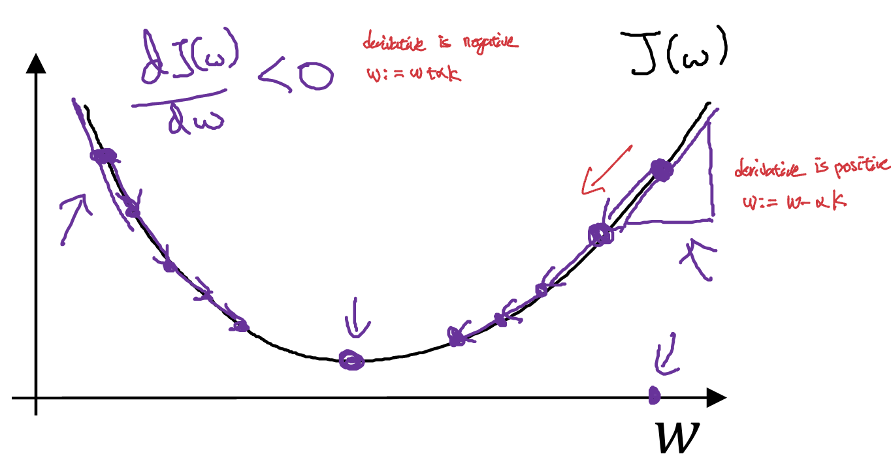
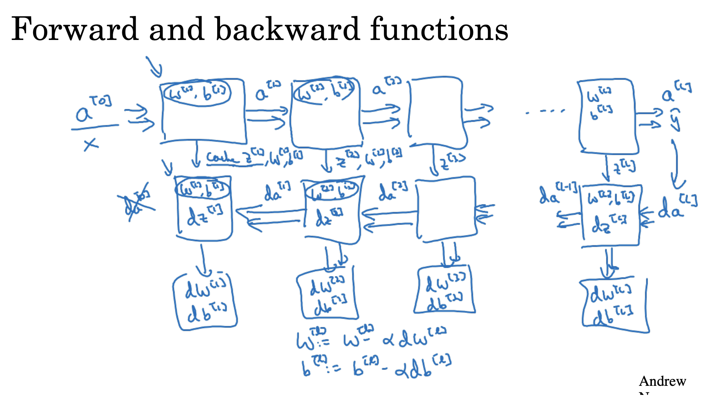

# Neural Networks
  
An ANN(Artificial Neural Network) consists of connected units or nodes called artificial neurons, which loosely model the neurons in the brain.  
Part of the magic of a neural network is that all you need are the
input features $x$ and the output $y$ while the neural network will figure out everything in the middle by itself. 
This is why some people refer to neural networks as a black box, as it can be dicult to understand the features it has invented.

These networks are built from several key components:

 - Neurons: The basic units that receive inputs, each neuron is governed by a threshold and an activation function.
 - Connections: Links between neurons that carry information, regulated by weights and biases.
 - Weights and Biases: These parameters determine the strength and influence of connections.
 - Propagation Functions: Mechanisms that help process and transfer data across layers of neurons.
 - Learning Rule: The method that adjusts weights and biases over time to improve accuracy. (such as supervised learning, unsupervised learning and reinforcement learning)

## Encoding
The encoding refers to transforming data into a format suitable for processing by the network. This technique whitens the real-valued input data delivered to the first hidden layer of a network.  
Encoding helps you capture the important features or patterns in the input data.

## Logistic Regression as a specific case of a Neural Network
Mathematically a certain neural network architecture trained with a certain loss coincides exactly with logistic regression at the optimal parameters.  
$$
\hat{y} = \sigma(X\beta + \beta_0)
$$

A binary logistic regression makes predictions $\hat{y}$ is above where $X$ is a $n \times p$ matrix of features (predictors, independent variables) and vector $\beta$ is the vector of $p$ coefficients and $\beta_0$ is the intercept and $\sigma(z) = \frac{1}{1+e^{-z}}$.  

On the other hand, a neural network with no hidden layers and one output neuron with a sigmoid activation makes predictions using the equation is same as above. 

A logistic regression has the Bernoulli likelihood as its objective function, or, equivalently, the Bernoulli log-likelihood function as below.
$$
\arg\max_{\beta, \beta_0} \sum_i \left[ y_i \log(\hat{y}_i) + (1 - y_i) \log(1 - \hat{y}_i) \right]
$$
In neural network, you use any loss function you like. So itt might use the so-called "cross-entropy" function in which case the model minimizes this loss function as below.
$$
\arg\min_{\beta, \beta_0} -\sum_i \left[ y_i \log(\hat{y}_i) + (1 - y_i) \log(1 - \hat{y}_i) \right]
$$
In both cases, these objective functions are strictly convex (concave) when certain conditions are met. Strict convexity implies that there is a single minimum and that this minimum is a global. Moreover, the objective functions are identical, since minimizing a strictly convex function $f$ is same as maximizing $-f$.

Therefore, in architecture perspective, logistic regression is a special case of neural net. A logistic regression model can be constructed via neural network libraries. In the end, both have neurons having the same computations if the same activation and loss is chosen. 

## Neuron

### Linear Function
Each neuron in a layer receives inputs, which are multiplied by the weights associated with the connections. These products are summed together, and a bias is added to the sum. This can be represented mathematically as:
$$
z = w_1x_1 + w_2x_2 + \ldots + w_nx_n + b \\
y = f(z)
$$

Where $w$ represent weight, $x$ represent input and $b$ represent bias.

## Active Function
The result of the linear transformation($z$) is then passed through an activation function. The activation function is crucial because it introduces non-linearity into the system, enabling the network to learn more complex patterns.  
Popular activation functions include ReLU, sigmoid, and tanh.

### Why Activation Function Shouldn't be linear
 - It’s not possible to use backpropagation as the derivative of the function is a constant and has no relation to the input $x$. 
 - All layers of the neural network will collapse into one if a linear activation function is used. No matter the number of layers in the neural network, the last layer will still be a linear function of the first layer. So, essentially, a linear activation function turns the neural network into just one layer.  
 For example, 
 $$
 o = \sigma\bigl(z^{[2]}\bigr)
 = \sigma\bigl(W^{[2]}h + W_0^{[2]}\bigr)
 = \sigma\Bigl(W^{[2]}\bigl(W^{[1]}x + W_0^{[1]}\bigr) + W_0^{[2]}\Bigr)
 = \sigma\bigl(W^{[2]}W^{[1]}x + W^{[2]}W_0^{[1]} + W_0^{[2]}\bigr)
 = \sigma\bigl(\widetilde{W}x + \widetilde{W}_0\bigr),
 $$ 

 where 

 $$
 \widetilde{W} = W^{[2]} W^{[1]}, 
 \quad
 \widetilde{W}_0 = W^{[2]} W_0^{[1]} + W_0^{[2]}.
 $$
 Therefore linear function can't capture the complex non-linearity pattern of the dataset. Because a linear combination of linear functions is still a linear function. 

### Perceptron and Step Function
The perceptron is an algorithm for learning a binary classifier called a threshold function. Which is a function that maps its input $x$ (a real-valued vector) to an output value $f(x)$ (a single binary value):
$$
f(x)= h((w \cdot x) +b)
$$
where $h$ is the Heaviside step-function(below described).
$$
h(x) = 
\begin{cases}
1, & x \ge 0, \\
0, & x < 0.
\end{cases}
$$
Back to perceptron, in function $f(x)$, $w$ is a vector of real-valued weights, and $w \cdot x$ is the dot product $\sum _{i=1}^{m}w_{i}x_{i}$, where $m$ is the number of inputs to the perceptron, and $b$ is the bias.

Using Step function, you can capture the non-linearity. This is because the neurons applied step function as activation function can be treated as three independent linear classifiers. Therefore their decision boundaries
form a non linear shape and it can classify the outside and the inside class of dataset.  
For example, Let's consider below data set $X$(left) and simple neural network with one hidden layer(right).
  
If each hidden layer $h_1, h_2, h_3$ use step function, these three neurons can be treated as three independent linear classifiers.   
Therefore the three decision boundaries form a triangle that classifies the outside data into class 1, and the inside ones into class 0.

### Multi-Layer Perceptron (MLP)
이름은 “perceptron”이지만, 현대 MLP는 step function을 쓰지 않는다.
대신 non-linear activation function(예: sigmoid, tanh, ReLU 등)을 사용, 즉, 다층 fully-connected 신경망(FCNN) 을 의미함.

역사적으로 초기에 “Perceptron”이라는 이름이 인공 뉴런 구조 전체를 지칭했으나 나중에 backpropagation과 non-linear activation이 도입되면서
다층 구조로 확장된 버전을 “Multi-Layer Perceptron(MLP)”이라고 부르게 되었음. 하지만 미분 불가능해서 back propagation이 불가능한 “step function”은 이미 사라지고, 실제로는 “Fully Connected Neural Network (FCNN)”과 거의 동일한 의미로 사용된다.

### Non-linearity of Neural Network
As soon as you stack activations like ReLU, tanh, GELU, etc., in neural network, the loss function is no longer “single-bowl” convex. Plateaus, ridges, saddle points, and many minima appear.
Therefore, this nonlinearity of a neural network causes most interesting loss functions to become non-convex.

Since the standard convergence proofs for SGD assume convexity, without it, the algorithm can settle in one of the many equivalent global minima or land in a good-but-not-optimal local basin. Therefore, when you apply gradient descent to this non-linear loss function, you can't gurantee the convergence to global optima.

### Popular Active Functions
Let's see some popular active functions. 

First, sigmoid function and its derivative.
$$
g(z) = a = \frac{1}{1 + e^{-z}}  \\[5pt]
g'(z) = \frac{d}{dz}\,g(z) = a\,(1 - a).
$$

Second, tanh function and its derivative.
$$
g(z) = a = \tanh(z) 
= \frac{e^z - e^{-z}}{\,e^z + e^{-z}\,} \\[5pt]
g'(z) = 1 - a^{2}
$$

Third, Relu function and its derivative.
$$
g(z) 
= \max(0,\,z) \\[5pt]
g'(z)
= \begin{cases}
0 & z < 0\\[3pt]
1 & z \ge 0
\end{cases}
$$

Lastly, leaky Relu function and its derivative.
$$
g(z)
= \max\bigl(0.01\cdot z,\;z\bigr) \\[5pt]
g'(z)
= \begin{cases}
0.01, & z < 0 \\[3pt]
1 & z \ge 0
\end{cases}
$$

## Feed-Forward Neural Network
  
A Feedforward Neural Network (FNN) is a type of artificial neural network where connections between the nodes do not form cycles. This characteristic differentiates it from recurrent neural networks (RNNs). Recurrent neural networks, or neural networks with loops allow information from later processing stages to earlier stages for sequence processing.  
However, at every stage of inference a feedforward multiplication remains the core, essential for backpropagation. Thus neural networks cannot contain feedback where the outputs feed back to the very same inputs and modify them, because this forms an infinite loop which is not possible to rewind in time to generate an error signal through backpropagation. 

## Forward Propagation
When data is input into the network, it passes through the network in the forward direction, from the input layer through the hidden layers to the output layer. This process is known as forward propagation. 

### Math in Forward Propagation

Let's see more detail of neuron mathmatically. Single neuron receives multiple input $x$, which is vector of $[x_1, x_2,  x_3, \cdots , x_n]$ are multipliled by the weight $w$, which is also vector of $[w_1, w_2,  w_3, \cdots ,wx_n]$ and bias $b_1$ is added. This result can be represented as $z$
$$z = w^{T} x + b = w_1x_1 + w_2x_2 + \ldots + w_nx_n + b_1 $$

Then $z$ is input of activation function (in this picture, sigmoid function $\sigma$), and the output $a$ comes from activation function.

Now, based on our knowledges from single neuron, let's consider the neural network with one hidden layer which is composed of multiple neurons.  

Please note that from the notation as $a_1^{[1]}$, number from upper part "[1]" represents the layer (in this case since there is only one hidden layer, this number is fixed to 1), and the number from lower part "1" indicates the node in layer. So $a_1^{[1]}$ means first neuron node in the first layer of the network.

The first thing you should notice is that (of course) input $x$ are consistent. In other words, inputs $[x_1, x_2, \cdots x_n]$ from one neuron is identical to the inputs of any other neuron. The second thing to note is that however parameters $w,b$ are different among the neurons.  
For your understanding, the first neuron which results $a_1^{[1]}$ can be expanded as below.
$$
z_1^{[1]} = w_{1}^{[1]T}\,x + b_{1}^{[1]} \\
z_1^{[1]}
= w_{1,1}^{[1]}\,x_1
  + w_{1,2}^{[1]}\,x_2
  + w_{1,3}^{[1]}\,x_3
  + b_{1}^{[1]}, \quad a_1^{[1]} = \sigma(z_1^{[1]}) 
$$
Where vector $x = [x_1, x_2, x_3]$ and vector $w = [w_1, w_2,  w_3]$.  
Combining other neurons together, we can get expanding form like following.
$$
\underbrace{
\begin{pmatrix}
w_{1,1}^{[1]} & w_{1,2}^{[1]} & w_{1,3}^{[1]}\\
w_{2,1}^{[1]} & w_{2,2}^{[1]} & w_{2,3}^{[1]}\\
w_{3,1}^{[1]} & w_{3,2}^{[1]} & w_{3,3}^{[1]}\\
w_{4,1}^{[1]} & w_{4,2}^{[1]} & w_{4,3}^{[1]}
\end{pmatrix}
}_{\displaystyle W^{[1]}}
\,
\underbrace{
\begin{pmatrix}
x_1\\
x_2\\
x_3
\end{pmatrix}
}_{\displaystyle x}
\;+\;
\underbrace{
\begin{pmatrix}
b_{1}^{[1]}\\
b_{2}^{[1]}\\
b_{3}^{[1]}\\
b_{4}^{[1]}
\end{pmatrix}
}_{\displaystyle b^{[1]}}
=
\underbrace{
\begin{pmatrix}
z_1^{[1]}\\
z_2^{[1]}\\
z_3^{[1]}\\
z_4^{[1]}
\end{pmatrix}
}_{\displaystyle z^{[1]}}
$$
Where each neuron is calculated as:
$$
z_1^{[1]}
= w_{1,1}^{[1]}\,x_1
  + w_{1,2}^{[1]}\,x_2
  + w_{1,3}^{[1]}\,x_3
  + b_{1}^{[1]} \\
z_2^{[1]}
= w_{2,1}^{[1]}\,x_1
  + w_{2,2}^{[1]}\,x_2
  + w_{2,3}^{[1]}\,x_3
  + b_{2}^{[1]} \\
z_3^{[1]}
= w_{3,1}^{[1]}\,x_1
  + w_{3,2}^{[1]}\,x_2
  + w_{3,3}^{[1]}\,x_3
  + b_{3}^{[1]} \\
z_4^{[1]}
= w_{4,1}^{[1]}\,x_1
  + w_{4,2}^{[1]}\,x_2
  + w_{4,3}^{[1]}\,x_3
  + b_{4}^{[1]}
$$

Now applying element wise activation function to each $z$.
$$
a_i^{[1]} = \sigma\Bigl(z_i^{[1]}\Bigr), 
\quad i=1,2,3,4. \\
a^{[1]}
= \begin{pmatrix}
a_1^{[1]}\\
a_2^{[1]}\\
a_3^{[1]}\\
a_4^{[1]}
\end{pmatrix}
= \sigma\Bigl(W^{[1]} x + b^{[1]}\Bigr).
$$

### Vectorization across examples
When there are $m$ training examples, $a^{[1](i)}$ is the result from $i$-th example. For the whole examples,
$$
\text{For } i = 1 \text{ to } m:
\quad
\begin{cases}
z^{[1](i)} = W^{[1]}\,x^{(i)} + b^{[1]},\\[5pt]
a^{[1](i)} = \sigma\!\bigl(z^{[1](i)}\bigr)
\end{cases}
$$

To vectorize, you can consider matrix $x$, $z^{[1]}$ and $a^{[1]}$ as following. 
$$
x =
\begin{pmatrix}
\left[\begin{array}{c}
x_1^{(1)}\\[4pt]
x_2^{(1)}\\[4pt]
\vdots\\[4pt]
x_n^{(1)}
\end{array}\right]
&
\left[\begin{array}{c}
x_1^{(2)}\\[4pt]
x_2^{(2)}\\[4pt]
\vdots\\[4pt]
x_n^{(2)}
\end{array}\right]
&
\cdots
&
\left[\begin{array}{c}
x_1^{(m)}\\[4pt]
x_2^{(m)}\\[4pt]
\vdots\\[4pt]
x_n^{(m)}
\end{array}\right]
\end{pmatrix}
\in \mathbb{R}^{n\times m} \\[5pt]

z^{[1]} =
\begin{pmatrix}
\left[\begin{array}{c}
z_1^{[1](1)}\\[4pt]
z_2^{[1](1)}\\[4pt]
\vdots\\[4pt]
z_n^{[1](1)}
\end{array}\right]
&
\left[\begin{array}{c}
z_1^{[1](2)}\\[4pt]
z_2^{[1](2)}\\[4pt]
\vdots\\[4pt]
z_n^{[1](2)}
\end{array}\right]
&
\cdots
&
\left[\begin{array}{c}
z_1^{[1](m)}\\[4pt]
z_2^{[1](m)}\\[4pt]
\vdots\\[4pt]
z_n^{[1](m)}
\end{array}\right]
\end{pmatrix}
\in \mathbb{R}^{n\times m} \\[5pt]

a^{[1]} =
\begin{pmatrix}
\left[\begin{array}{c}
a_1^{[1](1)}\\[4pt]
a_2^{[1](1)}\\[4pt]
\vdots\\[4pt]
a_n^{[1](1)}
\end{array}\right]
&
\left[\begin{array}{c}
a_1^{[1](2)}\\[4pt]
a_2^{[1](2)}\\[4pt]
\vdots\\[4pt]
a_n^{[1](2)}
\end{array}\right]
&
\cdots
&
\left[\begin{array}{c}
a_1^{[1](m)}\\[4pt]
a_2^{[1](m)}\\[4pt]
\vdots\\[4pt]
a_n^{[1](m)}
\end{array}\right]
\end{pmatrix}
\in \mathbb{R}^{n\times m}
$$
Where row $m$ indicates the examples and the column $n$ represents the dimension. From above we know that these matrices can be simplified as following. 
$$
X = 
\begin{pmatrix}
x^{(1)} \quad x^{(2)}  \quad x^{(3)} \quad   \cdots \quad x^{(m)} 
\end{pmatrix} \\[5pt]
Z^{[1]} = 
\begin{pmatrix}
z^{[1](1)} \quad z^{[1](2)}  \quad z^{[1](3)} \quad   \cdots \quad z^{[1](m)} 
\end{pmatrix} \\[5pt]
A^{[1]} = 
\begin{pmatrix}
a^{[1](1)} \quad a^{[1](2)}  \quad a^{[1](3)} \quad   \cdots \quad a^{[1](m)} 
\end{pmatrix} \\[5pt]
$$
Finally combining with the parameters $W, b$ that we defined from earlier,
$$
\begin{aligned}
Z^{[1]} &= W^{[1]} \, X+ b^{[1]},\\
A^{[1]} &= \sigma\bigl(Z^{[1]}\bigr)\\
\end{aligned}
$$
So to wrap up, the whole process can be describe as below image.  
(when bias $b$ is $0$ just for simplication)

## Back propagation
In machine learning, backpropagation is a gradient estimation method commonly used for training a neural network to computes the gradient in weight space of a feedforward neural network, with respect to a loss function.  
Backpropagation computes the gradient of a loss function with respect to the weights and bias of the network for a single input–output example, computing the gradient one layer at a time, iterating backward from the last layer to avoid redundant calculations of intermediate terms in the chain rule.  
For example consider below gradient of loss with respect to weight $W^{[3]}$, 
$$
\frac{\partial \mathcal{L}}{\partial W^{[3]}} = \left( a^{[3]} - y \right) a^{[2]}
$$
By applying chain rule to above gradient $\frac{\partial \mathcal{L}}{\partial W^{[3]}}$, you can compute $\frac{\partial \mathcal{L}}{\partial W^{[2]}}$ as well like below.
$$
\frac{\partial \mathcal{L}}{\partial W^{[2]}} =
\frac{\partial \mathcal{L}}{\partial a^{[3]}}
\frac{\partial a^{[3]}}{\partial z^{[3]}}
\frac{\partial z^{[3]}}{\partial a^{[2]}}
\frac{\partial a^{[2]}}{\partial z^{[2]}}
\frac{\partial z^{[2]}}{\partial W^{[2]}}
=
\underbrace{(a^{[3]} - y)}_{\frac{\partial \mathcal{L}}{\partial a^{[3]}}}
\underbrace{W^{[3]}}_{\frac{\partial z^{[3]}}{\partial a^{[2]}}}
\underbrace{g'(z^{[2]})}_{\frac{\partial a^{[2]}}{\partial z^{[2]}}}
\underbrace{a^{[1]}}_{\frac{\partial z^{[2]}}{\partial W^{[2]}}}.
$$

## Math in Back Propagation
Let's consider simple neural network with 2 layers(1 hidden + 1output).

There are 4 parameters, $W^{[1]}, W^{[2]}, b^{[1]},  b^{[2]}$.  
Consider $X$ as the input matrix with $m$ examples(row) and $n$ dimension(column).
$$
\begin{aligned}
Z^{[1]} &= W^{[1]} X + b^{[1]} \\[5pt]
A^{[1]} &= g^{[1]}\!\bigl(Z^{[1]}\bigr), \\[5pt]
Z^{[2]} &= W^{[2]} A^{[1]} + b^{[2]} \\[5pt]
A^{[2]} &= g^{[2]}\!\bigl(Z^{[2]}\bigr) \;=\; \sigma\!\bigl(Z^{[2]}\bigr) = \hat{y}
\end{aligned}
$$
Cost function $J$ is as below and we want to use derivative of the cost function w.r.t each parameters to use gradient descent algorithm to find the predict $\hat{y}$ that has the least loss difference with ground true $y$.
$$
\mathcal{J} \bigl(W^{[1]}, b^{[1]}, W^{[2]}, b^{[2]}\bigr)
= \frac{1}{m} \sum_{i=1}^m 
\mathcal{L}\!\bigl(\hat{y}^{(i)},\,y^{(i)}\bigr) = -\frac{1}{m}\sum_{i=1}^m 
\Bigl[
\,y^{(i)} \log\!\bigl(\hat{y}^{(i)}\bigr)
\;+\;
\bigl(1-y^{(i)}\bigr)\,\log\!\bigl(1-\hat{y}^{(i)}\bigr)
\Bigr]
$$
Now, Let's see the derivative of cost function $J$ w.r.t each parameters.
(Recap from logistic regression part)  
Recall the loss function, 
$$
\mathcal{L}(a=\hat{y}, y)
   = -\Bigl[y \,\log(a) + \bigl(1 - y\bigr)\,\log(1 - a)]
$$
Using chain rule, $\frac{d\mathcal{L}}{da} \;\cdot\;\frac{da}{dz}$, each term is as below. 
$$
\frac{d\mathcal{L}}{da}
= -\frac{y}{a} + \frac{1-y}{1-a}
= \frac{-y(1-a) + a(1-y)}{a(1-a)} = \frac{a - y}{a\,(1 - a)}\\[5pt]
\frac{da}{dz}
= a\,(1 - a)
$$
Combining both term together we get,
$$
\frac{d\mathcal{L}}{dz}
= \Bigl(\frac{a - y}{a\,(1 - a)}\Bigr)\,\cdot\,\bigl(a\,(1 - a)\bigr)
= a - y
$$
Using $\frac{d\mathcal{L}}{dz}$, we can do gradient descent w.r.t $w$ and $b$.  
$$
\frac{\partial L}{\partial w} = \frac{d\mathcal{L}}{dz} \cdot \frac{d\mathcal{z}}{dw} =  (a-y) \cdot x
$$
$$
\frac{\partial L}{\partial b} = \frac{d\mathcal{L}}{dz} \cdot \frac{d\mathcal{z}}{db} =  (a-y) \cdot 1
$$
Now use vectorization to apply for the whole examples.

$$
\frac{d\mathcal{L}}{dZ}
= \bigl[\;\ \frac{d\mathcal{L}}{dz_1},\;\frac{d\mathcal{L}}{dz_2},\;\dots,\;\frac{d\mathcal{L}}{dz_m}\bigr]
\quad\in\;\mathbb{R}^{1\times m}, \\[3pt]
A = \bigl[a^{(1)},\;a^{(2)},\;\dots,\;a^{(m)}\bigr] \\[3pt]
Y = \bigl[y^{(1)},\;y^{(2)},\;\dots,\;y^{(m)}\bigr] \\[3pt]
\frac{d\mathcal{L}}{dZ} = (A - Y)
= \bigl[a^{(1)} - y^{(1)},\;a^{(2)} - y^{(2)},\;\dots,\;a^{(m)} - y^{(m)}\bigr]
$$
You can see that it is vector of the result from each iteration. Now use these intermediate values from each iteration, we will get the parameters $w$ and $b$. Since the parameters are shared across all samples, when differentiating, we use the average of the gradients over all samples.

$$
\frac{d\mathcal{J}}{dZ^{[2]}} 
= A^{[2]} - Y \\[5pt]
\frac{d\mathcal{J}}{dW^{[2]}} 
= \frac{1}{m} \cdot \frac{d\mathcal{J}}{dZ^{[2]}} \bigl(A^{[1]}\bigr)^\top \\[5pt]
\frac{\partial \mathcal{J}}{\partial b^{[2]}} = \frac{1}{m}\,\sum_{i=1}^m 
\frac{d\mathcal{L}}{dz^{[2](i)}} = 
\frac{1}{m}\,\mathrm{np.\,sum}(\frac{d\mathcal{L}}{dZ^{[2]}})
$$
Now Let's see the gradients of the previous layer.
$$
\frac{d\mathcal{J}}{dZ^{[1]}}  = \frac{d\mathcal{J}}{dZ^{[2]}} \frac{dZ^{[2]}}{dA^{[1]}} \frac{dA^{[1]}}{dZ^{[1]}} = \frac{d\mathcal{J}}{dZ^{[2]}} W^{[2]} g'^{[1]}\!\bigl(Z^{[1]}\bigr) = \left(W^{[2]}\right)^\top \cdot \frac{d\mathcal{J}}{dZ^{[2]}} \circ g^{[1]'}(Z^{[1]})
\\[5pt]
\frac{d\mathcal{J}}{dW^{[1]}} = \frac{1}{m} \cdot \frac{d\mathcal{J}}{dZ^{[1]}} \bigl(X\bigr)^\top \\[5pt]
\frac{\partial \mathcal{J}}{\partial b^{[1]}} = \frac{1}{m}\,\sum_{i=1}^m 
\frac{d\mathcal{L}}{dz^{[1](i)}} = 
\frac{1}{m}\,\mathrm{np.\,sum}(\frac{d\mathcal{L}}{dZ^{[1]}})
$$
$\frac{d\mathcal{J}}{dW^{[1]}}$ and $\frac{\partial \mathcal{J}}{\partial b^{[1]}}$ are same calculated as same way as before, but $\frac{d\mathcal{J}}{dZ^{[1]}}$ is somewhat different.  
First, why transpose? This transpose is needed because you want to propagate gradients from $Z^{[2]}$ back to $A^{[1]}$ and the shapes must align.  
Consider the shape of $A^{[1]}$ is $(n_1, m)$, $W^{[2]}$ is $(n_2, n_1)$ and $Z^{[2]}$ is $(n_2, m)$. Shape below is just alligned right.
$$
Z^{[2]} = W^{[2]} A^{[1]}
$$
Then back propagation, you need to make $(n_2, m)$ back to $(n_1, m)$ shape. 
$$
\frac{\partial Z^{[2]}}{\partial A^{[1]}} = W^{[2]}
$$
So transpose the $w$ matrix and apply to chain rule as below.
$$
\frac{\partial \mathcal{J}}{\partial A^{[1]}} = \frac{\partial \mathcal{J}}{\partial Z^{[2]}} \cdot \frac{\partial Z^{[2]}}{\partial A^{[1]}} \Rightarrow \\[5pt]
\frac{\partial \mathcal{J}}{\partial A^{[1]}} = \left( \frac{\partial Z^{[2]}}{\partial A^{[1]}} \right)^\top \cdot \frac{\partial \mathcal{J}}{\partial Z^{[2]}}
$$
Secondly, why element wise product? Consider $A=g(Z)$, it can be represented as following expression.
$$
A_{ij} = g(Z_{ij}) \\[5pt]
A = \begin{bmatrix}
g(Z_{11}) & \cdots & g(Z_{1m}) \\
\vdots & \ddots & \vdots \\
g(Z_{n1}) & \cdots & g(Z_{nm})
\end{bmatrix}
$$
So as you can see, originally $A$ is a vector (or matrix) obtained by applying $g()$ elementwise to each entry of $Z$. So in backprop, the derivative should also be applied elementwise.

### Why element wise multiplication?
From above equation, the shapes of therms do not align properly.
$$
\underbrace{\frac{\partial \mathcal{L}}{\partial W^{[2]}}}_{2 \times 3} =
\underbrace{(a^{[3]} - y)}_{1 \times 1}
\underbrace{W^{[3]}}_{1 \times 2}
\underbrace{g'(z^{[2]})}_{2 \times 1}
\underbrace{a^{[1]}}_{3 \times 1}
$$
So must rearrange the terms by using properties of matrix algebra such that the matrix operations produce a result with the correct output shape.
$$
\underbrace{\frac{\partial \mathcal{L}}{\partial W^{[2]}}}_{2 \times 3} =
\underbrace{W^{[3] \top}}_{2 \times 1}
\circ
\underbrace{g'(z^{[2]})}_{2 \times 1}
\underbrace{(a^{[3]} - y)}_{1 \times 1}
\underbrace{a^{[1] \top}}_{1 \times 3}
$$

## delta

## Initialization Techniques (Symmetery Breaking Problem)
The initialization step can be critical to the model’s ultimate performance, and it requires the right method. Initializing all the weights with zeros leads the neurons to learn the same features during training.  
In fact, any constant initialization scheme will perform very poorly. Consider a neural network with two hidden units, and assume we initialize all the biases to 0 and the weights with some constant $\alpha$. If we forward propagate an input $(x_1, x_2)$ in this network, the output of both hidden units will be $\text{relu}({\alpha x_1 + \alpha x_2})$.  
Thus, both hidden units will have identical influence on the cost, which will lead to identical gradients. Thus, both neurons will evolve symmetrically throughout training, effectively preventing different neurons from learning different things.  
So it makes pointless to have more tehan one hidden unit in the layer.

### Vanishing / Exploding Gradient

At every iteration of the optimization loop (forward, cost, backward, update), we observe that backpropagated gradients are either amplified or minimized as you move from the output layer towards the input layer.

Assume all the activation functions are linear (identity function). Then the output activation is:
$$
\hat{y} = a^{[L]} = W^{[L]} W^{[L-1]} W^{[L-2]} \cdots W^{[3]} W^{[2]} W^{[1]} x
$$
Then, we can conclude $\hat{y} = W^{[L]} W^{L-1} x$ where $W^{[L]}$ denotes the $L$-th matrix and $W^{L-1}$ is the matrix $W$ with the power of $L-1$.

#### A too-large initialization leads to exploding gradients
$$
W^{[1]} = W^{[2]} = \cdots = W^{[L-1]} = 
\begin{bmatrix}
1.5 & 0 \\
0 & 1.5
\end{bmatrix}
$$
Consider the case where every weight is initialized slightly larger than the identity matrix. Then $\hat{y} = W^{[L]} {1.5}^{L-1} x$ and the value of $\hat{y}$ increase exponentially with $l$. When these activations are used in backward propagation, this leads to the exploding gradient problem.  
That is, since the gradients of the cost with the respect to the parameters are too big, the cost oscillates around its minimum value.

#### A too-small initialization leads to vanishing gradients
$$
W^{[1]} = W^{[2]} = \cdots = W^{[L-1]} = 
\begin{bmatrix}
0.5 & 0 \\
0 & 0.5
\end{bmatrix}
$$

Similarly, consider the case where every weight is initialized slightly smaller than the identity matrix. Then $\hat{y} = W^{[L]} {0.5}^{L-1} x$ and the value of $\hat{y}$ decrease exponentially with $l$. When these activations are used in backward propagation, this leads to the vanishing gradient problem.  
The gradients of the cost with respect to the parameters are too small, leading to convergence of the cost before it has reached the minimum value.

#### Finding appropriate initialization values
To prevent the gradients of the network’s activations from vanishing or exploding, we will stick to the following rules of thumb:

1. The mean of the activations should be zero.
2. The variance of the activations should stay the same across every layer.

Under these two assumptions, the backpropagated gradient signal should not be multiplied by values too small or too large in any layer. 

More precisely, if forward propagation is below,
$$
a^{[l-1]} = g^{[l-1]}(z^{[l-1]}) \\
z^{[l]} = W^{[l]}a^{[l-1]} + b^{[l]} \\
a^{[l]} = g^{[l]}(z^{[l]})
$$
We would like the following to hold.
$$
\mathbb{E}[a^{[l-1]}] = \mathbb{E}[a^{[l]}] \\
\text{Var}(a^{[l-1]}) = \text{Var}(a^{[l]})
$$
Therefore, ensuring zero-mean and maintaining the value of the variance of the input of every layer guarantees no exploding/vanishing signal, we want this method applies both to the forward propagation (for activations) and backward propagation (for gradients of the cost with respect to activations).

### Random Initialization
When initializing, weights should be small random values in order to avoid "Symmetry Breaking Problem". Also, let's see the reason why values should be small.  
Consider activation function $a^{[1]}$ below.
$$
z^{[1]} = W^{[1]} x + b^{[1]} \\
a^{[1]} = g^{[1]}(z^{[1]})
$$ 
In this case, if $W^{[1]}$ is too big, $z^{[1]}$ will be also very big or very small.

In that case, the value of activation function might end up at the either flat parts. This leads to the slope of gradient very small, then graidnet descent will be very slow, then learning will be very slow.  

Biases can be zero. Since bias are additive constants, not multiplier, symmetry doesn’t hurt as long as weights are randomly initialized.

#### What happens if you initialize weights of neuron to zero in neural network?
If you initialize all weights to zero, then all neurons in the same layer receive identical gradients during training. So all updates of neurion happend in exactly the same way and they all compute the same output.  
Therefore, model never learns anything meaningful. This is called "Symmetry Breaking Problem".

#### Initialization for Relu

### Xavier Initialization (Glorot Initialization) and He Initialization (Kaiming Initialization)
Xavier Initialization 혹은 Glorot Initialization라고도 불리는 초기화 방법은 이전 노드와 다음 노드의 개수에 의존하는 방법이다. Uniform 분포를 따르는 방법과 Normal분포를 따르는 두가지 방법이 사용된다.  
(우리는 Normal Distribution 경우만 확인한다.)  
The recommended initialization method for finding appropriate initialization values is Xavier initialization (or one of its derived methods), for every layer $l$,
$$
W^{[l]} \sim \mathcal{N}(\mu = 0, \sigma^2 = \frac{1}{n^{[l-1]}}) \text{ or } \mathcal{N}\left(0, \frac{2}{n^{[l-1]} + n^{[l]}}\right)
 \\
$$

Xavier initialization is designed to work well with tanh or sigmoid activation functions(linear activation function).  

For ReLU activations(non-linear), look into He initialization, which follows a very similar derivation. (Xavier with 2 in numerator)
$$
W \sim \mathcal{N}\left(0, \sqrt{\frac{2}{n^{[l]}}}\right)
$$

#### Justification for Xavier initialization (and He initialization)
https://www.deeplearning.ai/ai-notes/initialization/index.html#III

## Optimizations
Gradient Descent
### How Gradient Descent works in optimization?
Let's recap from logistic regression. 

The starting point is just an arbitrary point for us to evaluate the performance. From that starting point, we will find the derivative(= slope), and from there, we can use a tangent line to observe the steepness of the slope.  The slope will inform the updates to the parameters(the weights and bias).  
The slope at the starting point will be steeper, but as new parameters are generated, the steepness should gradually reduce until it reaches the lowest point on the curve, known as the point of convergence.
$$
\text{Repeat:}
\quad
w \;:=\; w \;-\; \alpha\,\frac{dJ(w)}{dw},
$$
It is important to consider derivative as slope of the point. So if the slope $\frac{dJ(w)}{dw}$ is positive, point $w$ is moved to left. On the contrary, if the slope is negative in ceratin point, according to the above expression, $w$ will be moved to the right. So the sequence converges to the global minimum eventually.

### Parameter Sharing
Parameter sharing is a well-known approach for controlling the complexity of Deep Neural Networks by forcing certain weights to share the same value.

Consider above example with $64 \times 64 \times 3$ pixels. So we will have input $x = (x_1, \dots, x_n)$, and parameter $\theta = (\theta_1, \dots, \theta_n)$. In this case $\theta_1$ will always looks at the top left pixel of the image no matter what. However, we know that a soccer ball might appear in any region of the image and not always the center. It is possible that $\theta_1$ could never trained on a soccer ball in the top left of the image. As a result, during
test time, if an image of a soccer ball in the top left appears, the logistic regression will likely predict no soccer ball.  
With parameter sharing, we suppose $\theta \in \mathbb{R}^{4 \times 4}$, We now take our matrix of parameters $\theta$ and slide it over the image. In other words, we compute
the element-wise product between $\theta$ and $x_{1:4,1:4}$, instead of calculationg product of whole $n$ between $\theta$ and $x$, we do below calcuation then move the window slightly to the right in the image repeatly.
process.
$$
a = \sum_{i=1}^{4} \sum_{j=1}^{4} \theta_{ij} x_{ij}
$$

Once we have reached the end of the image, the parameters $\theta$ have "seen" all pixels of the image. So $\theta_1$ is no longer related to only the top left pixel. As a result, whether the soccer ball appears in the bottom right or top left of the image, the neural network will successfully detect the soccer ball.
This technique is comonly used in convolutional neural network.

## Deep Neural Networks
### Intuition of Deep Neural Networks

In deep neural network, earlier layers is detecting simpler functions like "edges". Then, composing these functions("edges") in the later layers so that model can learn more and more complex functions("part of  faces" and "types of faces").

Also, (informally) the functions to compute are relatively small(number of hidden units are small) in deep neural networks. But if you try to compute the same functions with shallow network, you might need exponentially more hidden units.

Consider above parity function example. Given a binary vector input $x \in \{0, 1\}^n$, the parity function outputs $1$ if the number of $1$ s in $x$ is even and outputs $0$ if the number of $1$ s in $x$ is odd.  
If shallow network, it requires exponentially many neurons to represent all patterns of parity. ($2^{n-1}$)  
However, using deep neural network, You only needs $O(n)$ neurons and $O(\log n)$ depth.

### Forward and Backward Propagation in Deep Neural Network

In forward function, input is $a^{[\ell-1]}$ and output is $a^{[\ell]}$. Check below equation for help understanding.
$$
z^{[l]} = W^{[l]} a^{[l-1]} + b^{[l]} \\
a^{[l]} = g^{[l]}(z^{[l]})
$$
In backward function, input is $\frac{d\mathcal{L}}{da^{[l]}}$ and output is $\frac{d\mathcal{L}}{da^{[l-1]}}$

Now, putting together all layers, the whole picture can be expressed as below.

For Forward Propagation, 
$$
Z^{[1]} = W^{[1]} X + b^{[1]} \\
A^{[1]} = g^{[1]}(Z^{[1]}) \\
Z^{[2]} = W^{[2]} A^{[1]} + b^{[2]} \\
A^{[2]} = g^{[2]}(Z^{[2]}) \\
\vdots \\
A^{[L]} = g^{[L]}(Z^{[L]}) = \hat{Y}
$$

For Backward Propagation,
$$
dZ^{[L]} = A^{[L]} - Y \\
dW^{[L]} = \frac{1}{m} dZ^{[L]} A^{[L-1] \top} \\
db^{[L]} = \frac{1}{m} \, \text{np.sum}(dZ^{[L]}, \text{axis} = 1, \text{keepdims} = \text{True}) \\
dZ^{[L-1]} = W^{[L] \top} dZ^{[L]} \circ g^{[L-1]'}(Z^{[L-1]}) \\
\vdots \\
dZ^{[1]} = W^{[2] \top} dZ^{[2]} \circ g^{[1]'}(Z^{[1]}) \\
dW^{[1]} = \frac{1}{m} dZ^{[1]} X^\top \\
db^{[1]} = \frac{1}{m} \, \text{np.sum}(dZ^{[1]}, \text{axis} = 1, \text{keepdims} = \text{True})

$$

## Adversarial Attacks
   
The adversarial attack is a deceiving technique that is “fooling” machine learning models using a defective input. Adversarial machine learning is aimed to cause a malfunction of an ML model.

- https://arxiv.org/pdf/1412.6572
### Generative Adversarial Networks (GANs)
- https://arxiv.org/pdf/1406.2661