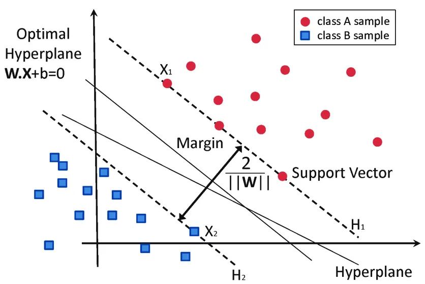
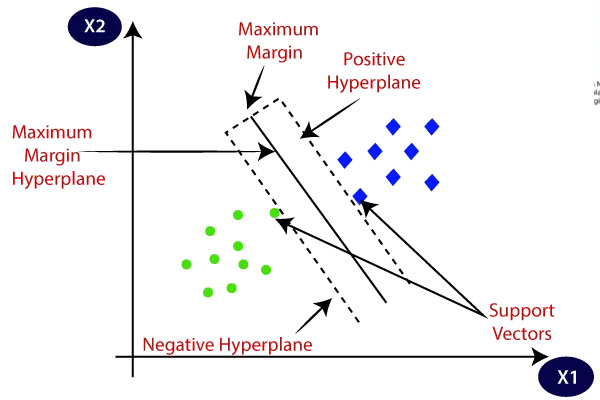
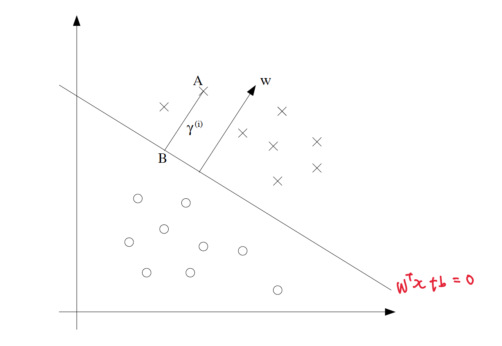

# Support Vector Machines (SVM)

## Unit Vector
In mathematics, a unit vector in a normed vector space is a vector (often a spatial vector) of length 1.
$$
\hat{\mathbf{u}} = \frac{\mathbf{u}}{\|\mathbf{u}\|}
$$ 
where $\|\mathbf{u}\|$ is the norm (or length) of $u$.  
The term normalized vector is sometimes used as a synonym for unit vector.  
A unit vector is often used to represent direction.

If $ || u || = 1$, $u$ is a unit vector.
Conversely, if $u$ is a unit vector, then by definition, $ || u || = 1$,

## Support Vector
Support Vectors are datapoints that are closest to the hyperplane.

## Margin
Margin is defined as the gap between two lines on the closet data points of different classes. It can be calculated as the perpendicular distance from the line to the support vectors. 

## Hyperplane
p차원 공간에서, 초평면은 p-1 차원인 평평한 affine 부분 공간 입니다. 예를 들어, 2차원 공간에서 초평면은 평평한 1차원 부분공간 입니다. 즉, 선 입니다. 3차원에서 초평면은 평평한 2차원 부분공간이며 이는 평면입니다.  
In geometry, a hyperplane is a generalization of a 2-D plane in 3-D space to mathematical spaces of arbitrary dimension.  
Like a plane in space, a hyperplane is a flat hypersurface, a subspace whose dimension is one less than that of the ambient space. Two lower-dimensional examples of hyperplanes are one-dimensional lines in a plane and zero-dimensional points on a line.

Most commonly, the ambient space is n-dimensional Euclidean space, in which case the hyperplanes are the (n − 1)-dimensional "flats", each of which separates the space into two half spaces.

In ML, hyperplanes are essentially a boundary which classifies the data set (classifies Spam email from the ham ones). It could be lines, 2D planes, or even n-dimensional planes that are beyond our imagination.

### Kinds of Hyperplanes in SVM
#### Optimal Hyperplane
This is the main decision boundary that separates the two classes of data points. The goal of SVM is to find the hyperplane that maximizes the margin between two classes.
#### Positive Hyperplane:
The positive hyperplane is the boundary on one side of the margin where the support vectors of the positive class (let’s say class +1) lie.  
Data points from the positive class lie either on or beyond this boundary.
#### Negative Hyperplane:
The negative hyperplane is the boundary on the opposite side of the margin where the support vectors of the negative class (let’s say class -1) lie.  
Data points from the negative class lie either on or beyond this boundary.

### Relationship of Support Vector, Margin and Hyperplane
#### 1

#### 2

Where optimal hyperplane is,
$$
w^T x + b = 0 
$$
$w$ is weight vector, $b$ is bias, $x$ is feature vector.

For the positive hyperplane,
$$
w^T x + b = +1
$$
For the negative hyperplane.
$$
w^T x + b = -1
$$

## Functional Margin and Geometric Margin
The functional margin is the distance between the hyperplane (decision boundary) that separates the classes and the nearest training examples and it does not depend on the magnitude.
The functional margin is a measure of the generalization ability of the classifier. A larger functional margin indicates confident and a correct prediction.
$$
\hat{\gamma}^{(i)} = y^{(i)} (w^T x + b).
$$
The geometric margin is just a scaled version of the functional margin.
$$
\gamma^{(i)} = \frac{\hat{\gamma}^{(i)}}{\| \mathbf{w} \|}.
$$

When A is $x^{(i)}$ and $\frac{w}{\|w\|}$ is a unit-length vector pointing in the same direction as $w$, B is $x^{(i)} - \gamma^{(i)} \frac{w}{\|w\|}$.  
Since point B lies on the hyperplane which is $w^T x + b$,
$$
w^T \left( x^{(i)} - \gamma^{(i)} \frac{w}{\|w\|} \right) + b = 0.
$$
Solving for $\gamma^{(i)}$, 
$$
\quad \gamma^{(i)} = \frac{w^T x^{(i)} + b}{\|w\|} = \left( \frac{w}{\|w\|} \right)^T x^{(i)} + \frac{b}{\|w\|}.
$$
Remind that,
$$
\hat{\gamma}^{(i)} = y^{(i)} (w^T x + b).
$$
Therefore we can find out that geometric margin is scaled version of functonal margin.
$$
\gamma^{(i)} = y^{(i)} \left( \left( \frac{w}{\|w\|} \right)^T x^{(i)} + \frac{b}{\|w\|} \right) = \frac{\hat{\gamma}^{(i)}}{\| \mathbf{w} \|}
$$.
In other words, the geometric margin is invariant to the rescaling of the parameter, which is the only difference between geometric margin and functional margin.

## Optimal Margin Classifier
A margin classifier is a type of classification model which is able to give an associated distance from the decision boundary for each data sample.  
For instance, if a linear classifier is used, the distance (typically Euclidean, though others may be used) of a sample from the separating hyperplane is the margin of that sample.  
The Optimal margin classifier is the classifier that maximizes the margin between two classes. 

### Optimization Problem  

$$
\min_x \quad f_0(x) \\
\text{subject to :} \quad f_i(x) \leq b_i, \quad i = 1, \ldots, m. 
$$

making the best possible choice of a vector from a set of candidate choices.
- The variable x represents the choice made.
- the constraints fi(x) ≤ bi represent firm requirements or specifications that limit the possible choices.
- the objective value f0(x) represents the cost of choosing x. (or value of choosing x)

#### Convex Optimization Problem
$$
f_i(\alpha x + \beta y) \leq \alpha f_i(x) + \beta f_i(y) \\

\text{for all} \ \ x, y \in \mathbb{R}^n \quad \text{and all} \ \ \alpha, \beta \in \mathbb{R}, \quad \alpha + \beta = 1, \ \ \alpha \geq 0, \beta \geq 0 
$$

A convex optimization problem is optimization problem in which the objective and
constraint functions are convex, which means they satisfy the inequality above.

$$
\min_x \quad f(x) \\ 
\begin{align*}
\text{Subject to :} \quad f_i(x) \leq 0, \quad i = 1, \ldots, m \\
h_j(x) = 0, \quad j = 1, \ldots, p \\
\end{align*} \\

\begin{align}
f: \mathbb{R}^n \rightarrow \mathbb{R} \ \ \  \text{is the objective function to be minimized over the n-variable vector x.} \\ 
f_i(x) \leq 0 \quad \text{are called inequality constraints.} \\
h_j(x) = 0  \quad \text{are called equality constraints.} \\
m \geq 0 \quad \text{and} \quad p \geq 0 \\ 
\end{align}
$$
- The inequalities fi(x) ≤ 0 are called inequality constraints, and the
corresponding functions fi : Rn → R are called the inequality constraint functions.
- The equations hi(x) = 0 are called the equality constraints, and the functions
hj : Rn → R are the equality constraint functions.
- If there are no constraints (i.e.,m = p = 0) we say the problem is unconstrained.

### Primal Optimization Problem vs Dual Optimization Problem
duality is the principle that optimization problems may be viewed from either of two perspectives, the primal problem or the dual problem. If the primal is a minimization problem then the dual is a maximization problem (and vice versa). so lower bound of primal problem is upper bound of dual problem.

 - Primal Optimization Problem

$$
\min_x \quad \mathbf{c}^T \mathbf{x} \\

\begin{align*}
\text{subject to} \quad Ax=b, \\
Gx \leq h
\end{align*}
$$

 - Dual Optimization Problem

$$
\text{from Primal Optimzation Problem, applying vector } u \ \text{and } v, \quad v \geq 0 \\

u^T Ax = u^T b \\
u^T Gx \leq u^T h \\
\text{summing up above two equations} \\ 
u^T Ax + u^T Gx \leq u^T b + u^T h \\
(u^T A + u^T G)x \leq u^T b + u^T h \\
(A^T u + G^T u)^T x \leq u^T b + u^T h \\
(-A^T u - G^T u)^T x \geq -u^T b - u^T h \\
\therefore c^T x \geq -u^T b - u^T h \\

\text{Primal Optimization Problem turns into Dual Optimization Problem, } \\
\max_{u,v} \quad -b^T u - h^T v \\
\text{subject to} \quad -A^T u - G^T v = c \\
v \geq 0
$$
primal problem에서는 주어진 식을 만족하는 벡터 𝑥 를 찾는 것이었으나 dual problem에서는 벡터 𝑢,𝑣 를 찾는 문제로 바뀌었다.

## Support Vector
the points that are closest to the hyperplane.
- coefficients of support vectors($\alpha$) are the only ones that are non zero.
this is because margin of the support vectors is 1. which can be derived from the formulars from "Optimal Margin Classifier".

## Kernels
### Terminology
 - (input) attributes : original input value of problem. ($=x$)  
 - (input) features : new set of quantities. ($=\phi(x)$, e.g. [$x, x^2, x^3 ...$])

When $ K(x, z) = (x^T z + c)^d $ is kernel function, it corresponds to a feature mapping to an $\binom{n + d}{d}$ feature spaces. For example when $n=3$ and $d=2$, 
$$
\begin{equation}
\binom{3+2}{2} = \binom{5}{2} = \frac{5 \cdot 4}{2} = 10.
\end{equation}
$$
$$
\phi(x) =
\begin{bmatrix}
x_1^2 \\
x_2^2 \\
x_3^2 \\
x_1 x_2 \\
x_1 x_3 \\
x_2 x_3 \\
x_1 x_2 \\
x_1 x_3 \\
x_2 x_3 \\
x_1 x_2 x_3
\end{bmatrix}.
$$

### Basics
#### kernel function
A function that takes as its inputs vectors in the original space and returns the dot product of the vectors in the feature space.  
loosely speaking, kernel function is dot product of the transformed vectors by considering that each coordinate of the transformed vector ϕ(x) is just some function of the coordinates in the corresponding lower dimensional vector x.  
For example,   
$$
\phi: X \rightarrow \mathbb{R}^N, k(\mathbf{x}, \mathbf{z}) = \langle \phi(\mathbf{x}), \phi(\mathbf{z}) \rangle
$$ 

$k(\mathbf{x}, \mathbf{z})$ is kernel function.   
It is an algorithms for pattern analysis, whose best known member is the support-vector machine (SVM). These methods involve using linear classifiers to solve nonlinear problems

#### kernel trick
Enable kernel functions to operate in a high-dimensional, implicit feature space without ever computing the coordinates of the data in that space, but rather by simply computing the inner products between the images of all pairs of data in the feature space. This operation is often computationally cheaper than the explicit computation of the coordinates.  
In other words, $K(x, y)$ may be very inexpensive to cacluate, even $\phi(x)$ and $\phi(z)$ may be very expensive to calculate. Thus, we can get SVMs to learn the high dimensional feature space given by $\phi$ but without ever having to explicitly find or represent vecotr $\phi(x)$.  

#### example of using polynomial kernel with kernel trick
For example, below takes $O(N)$.
$$
K(x, z) = (x^T z)^2
$$
Because when $n=3$, 
$$
(x_1 z_1 + x_2 z_2 + x_3 z_3)^2
$$
However, $K(x, z)$ can also intrepreted as below,
$$
\begin{aligned}
K(x, z) &= \left( \sum_{i=1}^n x_i z_i \right) \left( \sum_{j=1}^n x_j z_j \right) \\
&= \sum_{i=1}^n \sum_{j=1}^n x_i x_j z_i z_j \\
&= \sum_{i, j = 1}^n (x_i x_j)(z_i z_j).
\end{aligned}
$$
Similary, when $n=3$,
$$
(x_1 x_1)(z_1 z_1) + (x_1 x_2)(z_1 z_2) \dots (x_3 x_2)(z_3 z_2) + (x_3 x_3)(z_3 z_3)
$$
When consider $\phi(x) = \sum_{i= 1}^n (x_i x_j)$ and $\phi(z) = \sum_{j= 1}^n (z_i z_j)$,
$$ 
\phi(x) =
\begin{bmatrix}
x_1 x_1 \\
x_1 x_2 \\
x_1 x_3 \\
x_2 x_1 \\
x_2 x_2 \\
x_2 x_3 \\
x_3 x_1 \\
x_3 x_2 \\
x_3 x_3
\end{bmatrix}, 
\phi(z) =
\begin{bmatrix}
z_1 z_1 \\
z_1 z_2 \\
z_1 z_3 \\
z_2 z_1 \\
z_2 z_2 \\
z_2 z_3 \\
z_3 z_1 \\
z_3 z_2 \\
z_3 z_3
\end{bmatrix}.
$$
As you can see $K(x, z) = \phi(x) \phi(z)$ and above calculation takes $O(N^2)$.
So kernel trick makes expensive calculation($O(N^2)$) into inexpensive calculation($O(N)$).

### Types of Kernels
 - polynomial kernel  
 $$
 K(x, y) = \langle \phi(x), \phi(y) \rangle = (x^\top y + c)^d
 $$
 - Gaussian kernel 

### Kernel Matrix
A square m-by-m matrix whose (i,j) entriy is given $K_{ij} = K(x^{(i)}, x^{(j)})$ is kernel matrix.  
Since $K$ is now represented as a kernel matrix, and the summation involves data points $x^{(i)}$ and  $x^{(j)}$ from a dataset. ($x^{(i)}$ is $i$-thata point from the dataset and $x^{(j)}$ is $j$-thata point from the dataset.)  
A kernel function $K(x, z)$ and the kernel matrix $K$ have obvious close relationship. If $K$ is a valid Kernel, then matrix $K$ must be symmetric. 
$$
K_{ij} = K(x^{(i)}, x^{(j)}) = \phi(x^{(i)})^T \phi(x^{(j)}) =  \\ 
\phi(x^{(j)})^T \phi(x^{(i)}) = K(x^{(j)}, x^{(i)}) = K_{ji}
$$
Moreover if $\phi_k(x^{(i)})$ denotes the $k$-th coordinate, for any vector $z$, 
$$
z^T K z = \sum_i \sum_j z_i K_{ij} z_j \\
= \sum_i \sum_j z_i \phi(x^{(i)})^T \phi(x^{(j)}) z_j \\
= \sum_i \sum_j z_i \sum_k \phi_k(x^{(i)}) \phi_k(x^{(j)}) z_j \\
= \sum_k \sum_i \sum_j z_i \phi_k(x^{(i)}) \phi_k(x^{(j)}) z_j \\
= \sum_k \left( \sum_i z_i \phi_k(x^{(i)}) \right)^2 \\
\geq 0.
$$
as above you can see that K-is also positive semi-definite.
Hence, if $K$ is a valid kerne, then the corresponding Kernel matrix $K$ ($K \in \mathbb{R}^{m \times m}$) is symmetric positive semidefinite.  
More generally, this turns out to be not only a necessary, but also a sufficient, condition for $K $to be a valid kernel
(also called a Mercer kernel).  
The following result is due to Mercer.

#### Theorem (Mercer)
For kernel $K : \mathbb{R}^n \times \mathbb{R}^n \to \mathbb{R}$ to be valid(mercer) kernel, it is necessary and sufficient that for any $\{ x^{(1)}, \ldots, x^{(m)} \}, \quad (m < \infty)$, the corresponding kernel matrix is symmetric
positive semi-definite.

## Basics of SVM
 - https://www.ibm.com/topics/support-vector-machine
 - https://en.wikipedia.org/wiki/Support_vector_machine

A support vector machine (SVM) is a supervised machine learning algorithm that classifies data by finding an optimal line or hyperplane that maximizes the distance between each class in an N-dimensional space.

SVMs are commonly used within classification problems. They distinguish between two classes by finding the optimal hyperplane that maximizes the margin between the closest data points of opposite classes. The number of features in the input data determine if the hyperplane is a line in a 2-D space or a plane in a n-dimensional space. Since multiple hyperplanes can be found to differentiate classes, maximizing the margin between points enables the algorithm to find the best decision boundary between classes. This, in turn, enables it to generalize well to new data and make accurate classification predictions. The lines that are adjacent to the optimal hyperplane are known as support vectors as these vectors run through the data points that determine the maximal margin.

The SVM algorithm is widely used in machine learning as it can handle both linear and nonlinear classification tasks. However, when the data is not linearly separable, kernel functions are used to transform the data higher-dimensional space to enable linear separation. This application of kernel functions can be known as the “kernel trick”, and the choice of kernel function, such as linear kernels, polynomial kernels, radial basis function (RBF) kernels, or sigmoid kernels, depends on data characteristics and the specific use case.

### Cartesian Product
In mathematics, specifically set theory, the Cartesian product of two sets A and B, denoted $A \times B$ is the set of all ordered pairs $(a, b)$ where $a$ is in $A$ and $b$ is in $B$
$$
A \times B = \{(a, b) \mid a \in A \text{ and } b \in B\}.
$$
Applying to vector, $\mathbb{R}^n$ is the set of all $n$-dimensional vector, $\mathbb{R}^n \times \mathbb{R}^n$ is the Cartesian product of two vector.
$$
\mathbb{R}^n \times \mathbb{R}^n = \{(x, z) \mid x \in \mathbb{R}^n, z \in \mathbb{R}^n\},
$$
For example,
$$
(x_1 z_1 + x_2 z_2 + x_3 z_3 \dots + x_n z_n)
$$

## Types of SVM classifiers
### Linear SVMs
Linear SVMs are used with linearly separable data; this means that the data do not need to undergo any transformations to separate the data into different classes.
We are given a training dataset of 
$n$ points of the form $(\mathbf{x}_1, y_1), \dots, (\mathbf{x}_n, y_n)$.
Where the $y_i$ are either 1 or −1, each indicating the class to which the point $x_i$ belongs. 
Each $x_i$ is a $p$-dimensional real vector. We want to find the "maximum-margin hyperplane" that divides the group of points $x_i$ for which $y_i = 1$ from the group of points for which $y_i = -1$ which is defined so that the distance between the hyperplane and the nearest point $x_i$ from either group is maximized.  
Mathematically, this separating hyperplane can be represented as
$$
w^T x - b = 0 \\
\text{or,} \\
w^T x + b = 0
$$
where w is the weight vector, x is the input vector, and b is the bias term. The parameter $\frac{b}{\|\mathbf{w}\|}$ determines the offset of the hyperplane from the origin along the normal vector $w$.

#### Hard magin:
#### Soft margin: 

### Nonlinear SVMs

## Applying Kernel and Regularization to SVM

## Sequential Minimal Optimization (SMO)
Sequential minimal optimization (SMO) is an algorithm for solving the quadratic programming (QP) problem that arises during the training of support-vector machines (SVM). It was invented by John Platt.   
- https://www.microsoft.com/en-us/research/uploads/prod/1998/04/sequential-minimal-optimization.pdf
 - https://dsmilab.github.io/Yuh-Jye-Lee/assets/file/teaching/2017_machine_learning/SMO_algorithm.pdf
 - https://en.wikipedia.org/wiki/Sequential_minimal_optimization 

### Basics
let's solve optimation problem from svm,
$$
\begin{align*}
\max_{\alpha} \quad & W(\alpha) = \sum_{i=1}^m \alpha_i - \frac{1}{2} \sum_{i=1}^m \sum_{j=1}^m y^{(i)} y^{(j)} \alpha_i \alpha_j K(x^{(i)}, x^{(j)}) \\
\text{s.t.} \quad & 0 \leq \alpha_i \leq C, \quad i = 1, \ldots, m, \\
& \sum_{i=1}^m \alpha_i y^{(i)} = 0,
\end{align*}
$$
repeat till convergence
1. Select some pair $a_i$ and $a_j$ to update next (using a heuristic that tries to pick the two that will allow us to make the biggest progress towards the global maximum).  
2. Reoptimize W(α) with respect to αi and αj, while holding all the other $a_k$’s (k= i,j) fixed.

## Coordinate Ascent(Descent)
Coordinate descent is an optimization algorithm that successively minimizes along coordinate directions to find the minimum of a function. At each iteration, the algorithm determines a coordinate or coordinate block via a coordinate selection rule, then minimizes over the corresponding coordinate hyperplane while fixing all other coordinates or coordinate blocks.  
Coordinate descent is based on the idea that the minimization of a multivariable function $F(x)$ can be achieved by minimizing it along one direction at a time, i.e., solving univariate optimization problems in a loop. In the simplest case of cyclic coordinate descent, one cyclically iterates through the directions, one at a time, minimizing the objective function with respect to each coordinate direction at a time.  
For example, let's suppose vector $x$ in round 0 as below.
$$
\mathbf{x}^0 = \left(x_1^0, \dots, x_n^0\right),
$$
The ound $k+1$ stands $x^k$ from $x^{k+1}$ by iteratively solving the single variable optimization problems.  
$$
x_i^{k+1} = \arg\min_{y \in \mathbb{R}} f\left(x_1^{k+1}, \dots, x_{i-1}^{k+1}, y, x_{i+1}^k, \dots, x_n^k\right),
$$
For each variable $x_i$ of $\mathbf{x}$, for $i$ from $1$ to $n$.  
Thus, one begins with an initial guess $\mathbf {x}^{0}$ for a local minimum and gets a sequence $\mathbf {x} ^{0},\mathbf {x} ^{1},\mathbf {x} ^{2},\dots$ iteratively.  
By doing line search in each iteration, you can get the result as below.
$$
F(\mathbf{x}^0) \geq F(\mathbf{x}^1) \geq F(\mathbf{x}^2) \geq \dots
$$
In easier way to describe is,  
$$
\text{Loop until convergence: } \\
\left\{
\begin{aligned}
    &\text{For } i = 1, \dots, m, \\
    &\quad \alpha_i := \arg\max_{\hat{\alpha}_i} W\left(\alpha_1, \dots, \alpha_{i-1}, \hat{\alpha}_i, \alpha_{i+1}, \dots, \alpha_m\right).
\end{aligned}
\right.
$$
For $i$ from $1$ to $m$, hold all the variables except for some ${\alpha}_i$ fixed, and reoptimize $W$ with respect to just the parameter ${\alpha}_i$.

 - https://en.wikipedia.org/wiki/Coordinate_descent
 - https://convex-optimization-for-all.github.io/contents/chapter23/

### SVM vs SMO
 - https://cs.stackexchange.com/questions/99705/what-is-the-difference-in-smo-algorithm-for-svm-and-smo-for-one-class
 - https://stats.stackexchange.com/questions/130293/svm-and-smo-main-differences
 