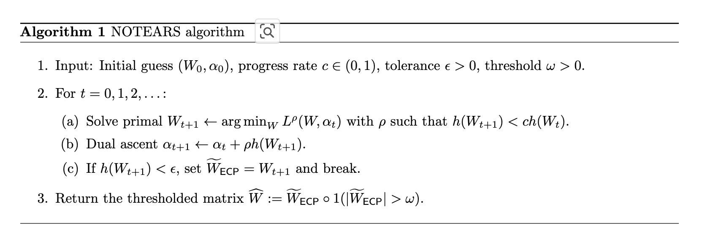

# Lagrange Duality

$$
\begin{align*}
& \text{minimize} & & f_0(x) \\
& \text{subject to} & & f_i(x) \leq 0, & & i = 1, \ldots, m, \\
& & & h_i(x) = 0, & & i = 1, \ldots, p,
\end{align*}
$$
considering above optimization problem, 
$$
L(x, \lambda, \nu) = f_0(x) + \sum_{i=1}^{m} \lambda_i f_i(x) + \sum_{i=1}^{p} \nu_i h_i(x), \\

\text{when, Lagrangian } L : \mathbb{R}^n \times \mathbb{R}^m \times \mathbb{R}^p \rightarrow \mathbb{R}
$$

the basic idea in Lagrangian duality is to take the constraints into
account by augmenting the objective function with a weighted sum of the constraint
functions.

## Lagrange multiplier Vector
$\lambda$, $\nu$ are called the dual variables or lagrange multiplier vectors.
  - $\lambda_i$ : lagrange multiplier associated with the $i$ th inequality constraint,  $f_i(x) \leq 0$
  - $\nu_i$ : lagrange multiplier associated with the $i$ th equality constraint, $h_i(x) = 0$

## Lagrange dual function
Lagrange dual function $g(\lambda, \nu)$ is defined as below,
$$
g(\lambda, \nu) = \inf_{x \in D} L(x, \lambda, \nu) = \inf_{x \in D} \left( f_0(x) + \sum_{i=1}^{m} \lambda_i f_i(x) + \sum_{i=1}^{p} \nu_i h_i(x) \right). \\
p^* \text{ is optimal value from primal problem.}
$$

for any $\lambda \geq 0$  and any $\nu $ we have, $g(\lambda, \nu) \leq p^*$.  
for each pair $(\lambda, \nu)$ with $\lambda \geq 0$, the Lagrange dual function gives us a lower bound on the optimal value $ p⋆ $ of the optimization problem.  
thus have a lower bound that depends on some parameters $\lambda$, $\nu$.

## lower value on optimal value
for feasible $\hat{x}$ which satisfy constraints,  
$$
g(\lambda, \nu) = \inf_{x \in D} L(x, \lambda, \nu) \leq L(\hat{x}, \lambda, \nu) \leq f_0(\hat{x}).
$$ 
this is because if Lagrangian is unbounded below in x(e.g. $\inf_{x \in D} L(x, \lambda, \nu)$),  
the dual function takes on the value $-\infty$.

## Lagrange Dual Problem
$$
\begin{align*}
& \text{maximize} & & g(\lambda, \nu) \\
& \text{subject to} & & \lambda \geq 0.
\end{align*}
$$
- optimization problem to find the best lower bound that can be obtained from the Lagrange dual function.
- the Lagrange dual problem is a convex optimization problem, since the
objective to be maximized is concave and the constraint is convex.(This is the case
whether or not the primal problem is convex.)

## Example 1 - Linear Programming
for the primal problem,
$$
\begin{align*}
& \text{minimize} & & c^T x \\
& \text{subject to} & & Ax = b, \\
& & & Gx \leq h.
\end{align*}
$$
using lagrange multiplier vector $u$ and $v$, make Lagrangian $L$,
$$
L(x, u, v) = c^T x + u^T (Ax - b) + v^T (Gx - h) \leq c^T x \\
\text{when vector} \quad v \geq 0 
$$ 
this is because $u^T (Ax - b)$ is always zero and $v^T (Gx - h)$ is always zero or negative. ($Ax = b, \ Gx \leq h$)
when lagrange optinal function is $g(\lambda, \nu) = \min_{x} L(x, u, v)$, 
$$
p^* \geq \min_{x \in C} L(x, u, v) \geq \min_{x} L(x, u, v) \\
\text{when C is feasible region that meets constraints, } \\
p^* \text{is optimal value that we are looking for.}
$$
this is because you can better minimize when constraints is not set. (=lower value on optimal value)
let's partial differentiate $g(\lambda)=\min_{x} L(x, u, v)$ w.r.t $x$,
$$
\frac{\partial L}{\partial x} = c^T + u^T A + v^T G = 0 \\
\therefore c = -A^T u - G^T v
$$

using this equation, Lagrangian $L$ is,
$$
L(x, u, v) = c^T x + u^T (Ax - b) + v^T (Gx - h) \\
\implies (-A^T u - G^T v) x + u^T (Ax - b) + v^T (Gx - h) \\
= -u^T Ax - v^T Gx + u^T Ax - u^T b + v^T Gx - v^T h \\
= -u^T b - v^T h \\
= g(u, v)
$$

so original primal problem is same as maximizing $g(u, v) =  L(x, u, v)$ since, $ p^* \geq L(x, u, v)$.

## Example 2 - General Case
consider the primal problem,
$$
\begin{align*}
& \text{minimize} & & f(x) \\
& \text{subject to} & & h_i(x) \leq 0, & & i = 1, \ldots, m, \\
& & & l_j(x) = 0, & & j = 1, \ldots, r.
\end{align*}
$$
let's define Lagrangian $L$ and Lagrangian dual problem $g$ as below,
$$
L(x, u, v) = f(x) + \sum_{i=1}^{m} u_i h_i(x) + \sum_{i=1}^{r} v_i l_i(x) \\
g(u, v) = \min_{x} L(x, u, v) \\
\text{when vector} \quad u \geq 0
$$
since  $p^* \geq L(x, u, v)$, prime problem which is looking for only vector $x$ can be changed into dual problem as below which is looking for vector $v$, $u$.
$$
\begin{align*}
& \text{maximize} & & g(u, v) \\
& \text{subject to} & & u \geq 0.
\end{align*}
$$
you can also see that dual problem is maximizing problem while prime problem was minimizaing problem.

## Weak Duality, Strong Duality and Duality Gap
The optimal value of the Lagrange dual problem, which we denote $d^⋆$, is, by definition,
the best lower bound on $p^⋆$ that can be obtained from the Lagrange dual
function. It can be described as below,
$$
d^*\leq p^*
$$
above inequality property is called weak duality.
$$
d^* = p^*
$$
above equality property is called strong duality.  
duality gap is basically the gap between the optimal value of the primal problem ($p^*$)
and the best (i.e., greatest) lower bound on it($d^*$) that can be obtained from the
Lagrange dual function. It can be described as below,
$$
p^* - d^*
$$

## Constraint Qualifications for Strong Duality
there are various ways to guarantee 'strong duality"' in optimization problems, even when the problem isn't necessarily convex. and these conditions are called 'constraint qualifications'.  
for example, 
$$
\begin{align*}
& \text{minimize} & & f(x) \\
& \text{subject to} & & h_i(x) \leq 0, & & i = 1, \ldots, m, \\
& & & l_j(x) = 0, & & j = 1, \ldots, r. \\
& \text{when f(x) is convex}
\end{align*}
$$
above form is one example of constraint. another simple constraint qualification is 'Slater’s condition'.

## Slater’s condition
a sufficient condition for strong duality to hold for a convex optimization problem.  
There exists an $x \in \text{relint}\, D$ such that,
$$
f_i(x) < 0, \quad i = 1, \ldots, m, \quad Ax = b.
$$

## Karush-Kuhn-Tucker(KKT) Conditions
### KKT conditions for nonconvex problems
let $x^⋆$ and $(\lambda^*, v^*)$ be any primal and dual optimal points with zero duality gap (strong duality).  
since $x^*$ minimizes $L(x^*, \lambda^*, v^*)$ over x, it follows that its gradient must vanish at $x^*$. In other words,
$$
\nabla f_0(x^*) + \sum_{i=1}^{m} \lambda_i^* \nabla f_i(x^*) + \sum_{i=1}^{p} \nu_i^* \nabla h_i(x^*) = 0.
$$
then any pair of primal and dual optimal point must satisfy KKT conditons below.
$$
\begin{align*}
&\nabla f_0(x^*) + \sum_{i=1}^{m} \lambda_i^* \nabla f_i(x^*) + \sum_{i=1}^{p} \nu_i^* \nabla h_i(x^*) = 0, \\
&\lambda_i^* f_i(x^*) = 0, \quad i = 1, \ldots, m, \\ 
&f_i(x^*) \leq 0, \quad i = 1, \ldots, m, \\
&h_i(x^*) = 0, \quad i = 1, \ldots, p, \\
&\lambda_i^* \geq 0, \quad i = 1, \ldots, m.
\end{align*}
$$
to sum up, for any optimization problem with differentiable objective and
constraint functions for which strong duality obtains, any pair of primal and dual
optimal points must satisfy the KKT conditions.

### KKT conditions for convex problems
When the primal problem is convex, the KKT conditions are also sufficient for the
points to be primal and dual optimal.  
In other words, if $f_i$ are convex and $h_i$ are
affine, and $\hat{x}$, $\hat{\lambda}$ and $\hat{v}$ are any points that satisfy the KKT conditions,
$$
\begin{align*}
&\nabla f_0(\hat{x}) + \sum_{i=1}^{m} \hat{\lambda}_i \nabla f_i(\hat{x}) + \sum_{i=1}^{p} \hat{\nu}_i \nabla h_i(\hat{x}) = 0, \\
&\hat{\lambda}_i f_i(\hat{x}) = 0, \quad i = 1, \ldots, m, \\ 
&f_i(\hat{x}) \leq 0, \quad i = 1, \ldots, m, \\
&h_i(\hat{x}) = 0, \quad i = 1, \ldots, p, \\
&\hat{\lambda}_i \geq 0, \quad i = 1, \ldots, m.
\end{align*}
$$

### Necessity
Necessity will show that ,
If $x^*$ and $u^*, v^*$ are primal and dual solutions, with zero duality gap,  
$\implies$ $x^*, u^*, v^*$ satisfy the KKT conditions.

remind that, 
$$
g(\lambda, \nu) = \inf_{x \in D} L(x, \lambda, \nu) = \min_{x} L(x, \lambda,\nu)
$$
and primal solution is $x^*$ and dual solution are $\lambda^*$, $\nu^*$.  
under strong duality,
$$
f_0(x^*) = g(\lambda^*, \nu^*)
$$
since $\inf_{x \in D} L(x, \lambda^*, \nu^*)$ is lower than $L(x, \lambda^*, \nu^*)$ with any other x, it is also lower than $L$ with primal solution $x^*$. 
$$
\inf_{x \in D} L(x, \lambda^*, \nu^*) \leq L(x^*, \lambda^*, \nu^*), \\ 
$$
therefore, 
$$
f_0(x^*) = g(\lambda^*, \nu^*) = \inf_{x \in D} L(x, \lambda^*, \nu^*) \leq L(x^*, \lambda^*, \nu^*) =  f_0(x^*) + \sum_{i=1}^{m} \lambda_i f_i(x^*) + \sum_{i=1}^{p} \nu_i h_i(x^*)

$$
since $x^*$ is primal optimal, it satisfies primal constraints $f_i(x^*) \leq 0$ and $h_i(x^*) = 0$.  
also, considering inequality of primal problem $f_0(x^*)$, Lagrangian $L$ and Lagrange dual problem $g(\lambda^*, \nu^*)$, ('lower value on optimal value')
$$
f_0(x^*) = g(\lambda^*, \nu^*) = \inf_{x \in D} L(x, \lambda^*, \nu^*) \leq L(x^*, \lambda^*, \nu^*) = f_0(x^*) + \sum_{i=1}^{m} \lambda_i f_i(x^*) + \sum_{i=1}^{p} \nu_i h_i(x^*) \leq f_0(x^*)
$$
equality('=') works for above. this shows that 
$$
\text{1.} \inf_{x \in D} L(x, \lambda^*, \nu^*) = L(x^*, \lambda^*, \nu^*) \\
\text{2.} \sum_{i=1}^{p} \lambda_i f_i(x^*) =0
$$ 
'1.' shows that $L(x, \lambda^*, \nu^*)$ has the minimum when $x=x^*$ and it implies that its gradient must vanish at $x^*$, 
$$
\nabla f_0(x^*) + \sum_{i=1}^{m} \lambda_i^* \nabla f_i(x^*) + \sum_{i=1}^{p} \nu_i^* \nabla h_i(x^*) = 0, \\
$$
this shows that it satisfies KKT's first condition which is called 'stationarity'.  
'2.' satisfies KKT's last condition which is called 'complementary slackness' (i.e. 'KKT dual complementarity condition')

since primal solution is $x^*$ and dual solution are $\lambda^*$, $\nu^*$, it satisfies all other conditions of KKT. (primal condition : line3,4)

### Sufficiency
if $x^*, \lambda^*, \nu^*$ satisfies KKT conditions $\implies$ $x^*, \lambda^*, \nu^*$ are primal and dual solution with string duality.

since first KKT condition states that its gradient with respect to $x$ vanishes at $x=x^*$, so it follows that $x^*$ minimizes $L(x, \lambda^*, \nu^*)$ which means,
$$
\inf_{x \in D} L(x, \lambda^*, \nu^*) = L(x^*, \lambda^*, \nu^*)
$$
and it implies that,
$$
f_0(x^*) = g(\lambda^*, \nu^*) = \inf_{x \in D} L(x, \lambda^*, \nu^*)
$$
using the condition $\sum_{i=1}^{p} \lambda_i f_i(x)=0$ and $h_i(x^*) = 0$, 
$$
g(\lambda^*, \nu^*) = f_0(x^*) + \sum_{i=1}^{m} \lambda_i f_i(x^*) + \sum_{i=1}^{p} \nu_i h_i(x^*) = f_0(x^*) \\ 
\therefore g(\lambda^*, \nu^*) = f_0(x^*)
$$
this implies the strong duality. in other words, it shows that $x^*, \lambda^*, \nu^*$ are optimal solutions.

### Conclusion
If $x^*$ and $u^*, v^*$ are primal and dual solutions, with zero duality gap $\Leftrightarrow$
$x^*, \lambda^*, \nu^*$ satisfies KKT conditions.

## Reference
- https://web.stanford.edu/~boyd/cvxbook/bv_cvxbook.pdf
- https://www.stat.cmu.edu/~ryantibs/convexopt/lectures/kkt.pdf
- https://ratsgo.github.io/convex%20optimization/2018/01/25/duality/
- https://ratsgo.github.io/convex%20optimization/2018/01/26/KKT/
- https://lee-jaejoon.github.io/optimization-lagrange-kkt/

## Related Theorories
### Penalty Method
In mathematical optimization, penalty methods are a certain class of algorithms for solving constrained optimization problems. A penalty method replaces a constrained optimization problem by a series of unconstrained problems whose solutions ideally converge to the solution of the original constrained problem. 

### Augmented Lagrangian Method
Augmented Lagrangian methods are a certain class of algorithms for solving constrained optimization problems. They have similarities to penalty methods in that they replace a constrained optimization problem by a series of unconstrained problems and add a penalty term to the objective, but the augmented Lagrangian method adds yet another term designed to mimic a Lagrange multiplier.

### Penalty Method vs Lagransian Method vs Augmented Lagrangian Method

| Method                                | Core idea                                                                              | Mathematical form                                   | Conceptual description                                                                      |
| :------------------------------------ | :------------------------------------------------------------------------------------- | :-------------------------------------------------- | :------------------------------------------------------------------------------------------ |
| **Penalty Method**                    | Add a **fixed penalty term** to discourage constraint violations.                      | $f(x) + \dfrac{\rho}{2} \mid\mid g(x)\mid\mid^{2} $                  | Constraints are *softly enforced* — larger ( $\rho$ ) ⇒ stronger penalty.                     |
| **Lagrangian Method**                 | Add a **variable penalty** (Lagrange multiplier) that adapts to constraint violations. | $( f(x) + \lambda^T g(x) )$                           | Constraint enforcement is *learned* via adaptive weights ( $\lambda$ ).                       |
| **Augmented Lagrangian Method (ALM)** | Combine both: Lagrange multipliers + quadratic penalty term.                           | $f(x) + \lambda^T g(x) + \dfrac{\rho}{2} \mid \mid g(x) \mid \mid^{2}$ | Uses **λ** for adaptive enforcement and **ρ** for numerical stability & faster feasibility. |

### NOTEARS (Non-combinational Combinational Optimization via Trace Exponential and Augmented lagRangian for Structure learning)
NOTEARS의 핵심 아이디어는,비순환성(Acyclicity)을 수치적으로 표현해, 딥러닝에서 사용하는 GradientDescent 방식으로 인과 구조(Structural Equation Model) 의 adjacency matrix $W$ 를 학습할 수있도록 만든 것입니다. 쉽게 말하면,  
<b>“그래프가 DAG이려면 사이클(cycle) 이 없어야 하는데,
이 ‘사이클 없음’ 조건을 수학적으로 연속적인 형태(미분가능한)로 바꿔서 gradient descent로 풀자.”</b>  

아래 알고리즘을 통해 관측된 데이터로부터 DAG(Directed Acyclic Graph) 형태의 인과 구조를 학습합니다.
   

NOTEARS는 다음 최적화 문제를 풉니다. 
$$
\min_W \; L(W) 
\quad \text{s.t.} \quad h(W) = 0 \\[5pt]
h(W) = \operatorname{tr}\!\left(e^{W \circ W}\right) - d = 0
$$
- $L(W)$: 손실 함수
- $h(W)$: 제약 조건(사이클이 없음)
- $\epsilon$: 허용 오차 (DAG 제약이 얼마나 만족되면 끝낼지)
- $c$: 진행률 (0~1 사이, 제약 완화 속도)
- $w$: 마지막에 작은 값들을 0으로 만드는 임계치 (threshold)

NOTEARS는 Augmented Lagrangian Method (ALM) 를 사용합니다. 아래 손실함수를 반복적으로 최소화하면서 $W$(primal variable)과 $\alpha$ (dual variable, 즉 라그랑주 승수)를 번갈아 업데이트합니다. (그림의 (a), (b))
$$
L^{\rho}(W, \alpha) 
= L(W) + \alpha \, h(W) + \frac{\rho}{2} h(W)^2
$$

그리고 (c)에서 보듯이, DAG 제약 위반이 충분히 작아지면 (즉, 거의 DAG이면) 반복 종료하고 $\tilde{W}_{ECP} = W_{t+1}$로 둡니다. 그리고 3번에서 $|\tilde{W}_{ECP}| > w$ 로 절대값이 임계값($w$)보다 작은 간선 가중치는 0으로 만든 후 element-wise 곱을 하여 임계값보다 작은 간선은 0으로 만듭니다. 

여기서 주목해야 할 것은 $h(W)$ 인데, 제약조건을 매끄러운 함수 $h(W)$ 로 바꿔서 gradient descent로 풀 수 있게 되는 것이 핵심입니다. 즉, DAG $W$를  미분 가능한 형태로 풀 수 있게 됩니다. $h(W)$를 이해하기 전에 아래 행렬의 지수함수와 trace 개념을 알고 가시면 좋습니다.
먼저 지수함수의 정의에 따라 exp(W)는 아래와 같이 테일러 급수로 풀어 쓸 수 있습니다. 

$$
\exp(W) = I + W + \frac{1}{2!}W^2 + \frac{1}{3!}W^3 + \cdots
$$
$W^{k}_{ij}​$ 는 노드 $i$에서 $j$까지 길이 $k$인 경로의 수 또는 가중치를 뜻하므로, 아래 $\exp(W)$는 “모든 길이의 경로를 합친 것” 이 됩니다. 각 항은 길이 1, 2, 3, … 인 경로들의 기여도를 모두 담고 있죠.

그리고 trace는 노드 $i$에서 시작해서 $i$로 다시 돌아오는 (길이 $k$) 닫힌 경로(closed path) 들의 가중치 합을 뜻합니다. 
$$
\operatorname{tr}(W^k) = \sum_i (W^k)_{ii}
$$
- 사이클이 있으면 어떤 $k$에 대하여 $W^k_{ii} > 0$
- 사이클이 없으면 모든 $k \geq 1$ 에 대하여 $W^k_{ii} > 0$

다시 원래 $h(W)$를 보면,
$$
h(W) = \operatorname{tr}\!\left(e^{W \circ W}\right) - d = 0
$$
1. $W \circ W$: (원소별 제곱)은 간선 가중치의 부호를 없애고, “연결이 있으면 양수”로 만들어줌.
2. $e^{W \circ W} = I + W^{1} + \frac{1}{2!}W^{2} + \frac{1}{3!}$
3. $\operatorname{tr}\!\left(e^{W \circ W}\right) $ : 모든 닫힌 경로(시작점과 끝점이 같은 경로)의 기여도가 전부 더해짐.

따라서, 아래의 두 조건부 명제가 성립합니다.
- $h(W) > 0$: 싸이클 존재 하는 그래프
- $h(W) = 0$: DAG

<b>NOTEARS는 그래프 매트릭스를 아다마르 제곱한 거에 ALM을 적용해 만든 제약함수 $h(W)$를 이용해서 W를 학습시켜서 최종적으로 $h(W) < \epsilon$ 이 되는 시점까지 학습을 해서 그래프 매트릭스 $W$가 cycle이 없도록 한다. </b>   

하나 더, 여기서 $h(W)$가 아주 작다는 건 사이클이 존재하더라도, 그 가중치가 거의 0이다. (즉, 사이클의 영향력이 무시 가능한 수준 = 거의 DAG처럼 동작한다.) 그래서 마지막 (3)에서 가중치가 아주 작은 간선들은 ($|\tilde{W}_{ECP}| < \epsilon $) 강제로 0으로 만들어서 DAG로 만들어버립니다.