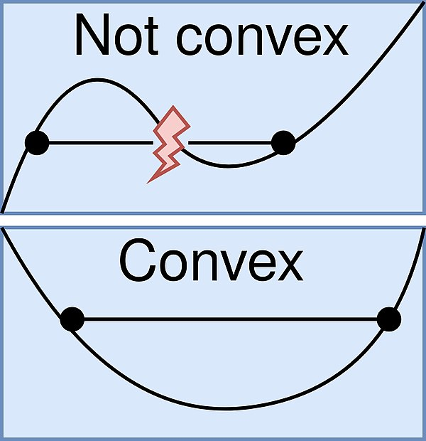
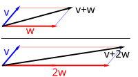
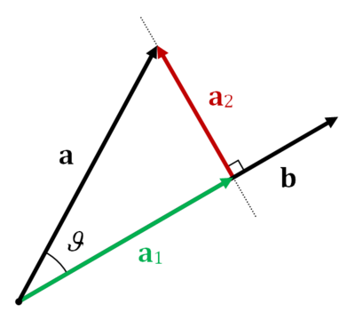
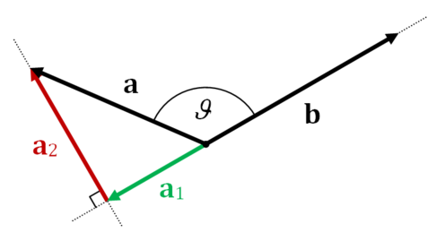

# Linear Algebra
## Feasible Point/Region
 - point : A point x that satisfies all the constraints is called a feasible point and thus is a feasible solution to the problem. 
 - region : A set of all possible points (sets of values of the choice variables) of an optimization problem that satisfy the problem's constraints, potentially including inequalities, equalities, and integer constraints.
## Convex and Concave Function

Convex function : function is convex if the line segment between any two distinct points on the graph of the function lies above the graph between the two points. (볼록 함수 - 아래로 볼록)
Concave function : function is concave if the line segment between any two distinct points on the graph of the function lies below the graph between the two points. (오목 함수 - 아래로 오목)

### Mathmatic Definition of Convex(Concave) Function
In mathematics, a real-valued function is called convex if the line segment between any two distinct points on the graph of the function lies above or on the graph between the two points. 

For all ${\displaystyle 0\leq t\leq 1}$ and all ${\displaystyle x_{1},x_{2}\in X}$:
$$
f\left(tx_{1}+(1-t)x_{2}\right)\leq tf\left(x_{1}\right)+(1-t)f\left(x_{2}\right)
$$
The right hand side, $tf\left(x_{1}\right)+(1-t)f\left(x_{2}\right)$ represents the straight line between ${\displaystyle \left(x_{1},f\left(x_{1}\right)\right)}$ and ${\displaystyle \left(x_{2},f\left(x_{2}\right)\right)}$ in the graph of $f$ as a function of $t$.  
Similarly, the argument of the function $f$ in the left hand side, $tx_{1}+(1-t)x_{2}$ represents the straight line between ${\displaystyle x_{1}}$ and ${\displaystyle x_{2}}$ in the $x$-axis of the graph of $f$.  
Simply speaking, $tA_1 + (1-t)A_2$ is weighted average (or often called convex combination) of two points $A_1$ and $A_2$. Therefore left hand side $tx_{1}+(1-t)x_{2}$ is weighted sum of $x_1$ and $x_2$. While, right hand side is weighted sum of $f(x_1)$ and $f(x_2)$. 

### Strictly Convex(Concave)
Explicitly, the function $f$ is called strictly convex if and only if for all real $0<t<1$ and all $x_{1},x_{2}\in X$ such that $x_{1}\neq x_{2}$, 
$$
f\left(tx_{1}+(1-t)x_{2}\right)<tf\left(x_{1}\right)+(1-t)f\left(x_{2}\right)
$$
It is a function that the straight line between any pair of points on the curve $f$ is above the curve $f$ except for the intersection points between the straight line and the curve.

## Convex Optimization
- Convex optimization problems : subfield of mathematical optimization that studies the problem of minimizing convex functions over convex sets (or, equivalently, maximizing concave functions over convex sets).
- Convex set : given any two points in the subset, the subset contains the whole line segment that joins them. 
  Equivalently, a convex set or a convex region is a subset that intersects every line into a single line segment.
- Optima in Convex Optimization : local optima are global optima.

## Domain of a Function
- the set of inputs accepted by the function. It is sometimes denoted by dom(f) or dom f,  where f is the function. 
- in layman's term, "what x can be".
- e.g. ``f(X) -> y, dom(f) = X``

## Vertical Bars
- $|x|$ if $x$ is a number, it denotes abolute value.  
- $|A|$  if $A$ is a matrix, it denotes determinant.  
- $|S|$ if $S$ is a set, it denotes its cardinality(the number of elements of the set).

## Vector and Matrix
### Row Vector vs Column Vector
Row Vector is a $1 \times n$ matrix for some $n$, consisting of a single row of $n$ entries,
$$
\mathbf{a} = \begin{bmatrix} a_1 & a_2 & \dots & a_n \end{bmatrix}.  
$$

Column Vector is a $ m \times 1$ matrix for some $m$ consisting of a single column of ⁠$m$ entries,
$$
\mathbf{x} = \begin{bmatrix} 
x_1 \\ 
x_2 \\ 
\vdots \\ 
x_m 
\end{bmatrix}.
$$

### Vector Double Summation
$$
\begin{align*}
\left( \sum_{i=1}^n x_i \right)^2 &= \left( \sum_{i=1}^n x_i \right) \left( \sum_{j=1}^n x_j \right) = \sum_{i=1}^n \sum_{j=1}^n x_i x_j
\end{align*}
$$

### Trace
The trace of a square matrix $A$, denoted $\text{tr}(A)$, is defined to be the sum of elements on the main diagonal (from the upper left to the lower right) of matrix $A$.  
The trace is only defined for a square matrix $(n \times n)$.  
$
\text{tr}(A) = \sum_{i=1}^{n} a_{ii} = a_{11} + a_{22} + \cdots + a_{nn}
$  

### Vector and Identity Matrix
When $z$ is a vector of dimension of $n \times 1$ and matrix $H=a⋅I$, where $I$ is identity matrix of $n \times n$ dimension and $a$ is scalar.
$$
z \cdot (a \cdot I) \cdot z^T = a \cdot (z \cdot I \cdot z^T) = a \cdot (z \cdot z^T)
$$
It is shwon that multiplying by the identity matrix $I$ does not change the vector.  
Also, it can be presented as below:  
$$
\quad z \cdot H \cdot z^T = a \cdot \|z\|^2,
\quad \text{where} \quad \|z\|^2 = z \cdot z^T = \sum_{i=1}^{n} z_i^2.
$$

### Basis
A set $B$ of vectors in a vector space $V$ is called a basis if every element of $V$ may be written in a unique way as a finite linear combination of elements of B. The elements of a basis are called basis vectors.
Equivalently, a set $B$ is a basis if its elements are linearly independent and every element of $V$ is a linear combination of elements of B. In other words, a basis is a linearly independent spanning set.

A vector space can have several bases; however all the bases have the same number of elements, called the dimension of the vector space.

### Dimension
In mathematics, the dimension of a vector space V is the cardinality (i.e., the number of vectors) of a basis of V over its base field.  
For every vector space there exists a basis, all bases of a vector space have equal cardinality. As a result, the dimension of a vector space is uniquely defined. We say $V$ is finite-dimensional if the dimension of $V$ is finite, and infinite-dimensional if its dimension is infinite.

### Vector Space (Linear Space)
A vector space is a set whose vectors can be added together and multiplied ("scaled") by numbers called scalars.  
The operations of vector addition and scalar multiplication must satisfy certain requirements, called vector axioms.
  
For example, above image show the vector addition and scalar multiplication.
 - 1) a vector $v$ (blue) is added to another vector $w$ (red, upper illustration). 
 - 3) $w$ is stretched by a factor of $2$, yielding the sum $v + 2w$.

### Row and column spaces
The column space (also called the range or image) of a matrix $A$ is the span (set of all possible linear combinations) of its column vectors.  
Whil the row space of this matrix is the vector space spanned by the row vectors.


### Vector Projection
  
Projection of $a$ on $b$ ($a_1$), and rejection of $a$ from $b ($a2$).
 

When $90^\circ < \theta \leq 180^\circ
$, $a_1$ has an opposite direction with respect to $b$.

The vector projection of a vector $a$ on onto a nonzero vector $b$ is the orthogonal projection of $a$ onto a straight line parallel to $b$.  
The projection of a onto b is often written as $\displaystyle \operatorname {proj} _{\mathbf {b} }\mathbf {a} $ or a∥b.

The projection of a onto b can be decomposed into a direction and a scalar magnitude by writing it as 
$$
{a} _{1}=a_{1}\mathbf {\hat {b}}
$$
Where $a_1$ is a scalar, called the scalar projection of $a$ onto $b$, and $\hat{b} is the unit vector in the direction of $b$. 

#### Definitions based on angle $\theta$
The scalar projection of $a$ on $b$ is a scalar equal to, 
$$
a_1=\left\|\mathbf {a} \right\|\cos \theta 
$$
Where $\theta$ is the angle between $a$ and $b$.
A scalar projection can be used as a scale factor to compute the corresponding vector projection.

The vector projection of a on b is a vector whose magnitude is the scalar projection of a on b with the same direction as b. Namely, it is defined as
$$
 a_{1}=a_{1}\hat {b} =(\left\|a \right\|\cos \theta )\hat {b} 
$$
Where $a_{1}$ is the corresponding scalar projection, as defined above, and $\hat {b}$ is the unit vector with the same direction as $b$.
($\hat {b} ={\frac {b }{\left\|b \right\|}}$)

#### Definitions in terms of vector $a$ and $b$
Remind the definition of dot product that,
When $\theta$ is not known, the cosine of θ can be computed in terms of $a$ and $b$, by the following property of the dot product $a \cdot b$,
$$
\displaystyle a \cdot b =\left\| a \right\|\left\|b\right\|\cos \theta 
$$

Using the property of the dot product mentioned above, the definition of the scalar projection becomes,
$$
{a_{1}=\left\|a \right\|\cos \theta ={\frac {a \cdot b }{\left\|b \right\|}}}
$$

In two dimensions, this becomes,
$$
a_{1}={\frac {a_{x}b _{x}+a _{y}b _{y}}{\left\|b \right\|}}
$$

Similarly, the definition of the vector projection of $a$ onto $b$ becomes,
$$
{\displaystyle a_{1}=a_{1} \hat {b} ={\frac {a \cdot b}{\left\| b  \right\|}}{\frac {b}{\left\|b \right\|}},}
$$
With the property of unit vectgor($\hat{b}$) Above can be equivalent to 
$$
a_{1}=\left(a \cdot \hat {b} \right){\hat {b}}
$$

#### Scalar Projection, Vector Projection and Length of Projection
 - Scalar projection gives the magnitude of one vector along the direction of another and can be positive or negative.
- Vector projection not only considers the magnitude but also gives the direction of the projection as a vector
 - Length of the projection is always positive and represents the magnitude of the projection.

So absolute value of scalar projection can be the length of the projection.

$$
\text{Scalar projection} = \frac{\mathbf{a}^T \mathbf{b}}{\|\mathbf{b}\|} \\
\text{Length of projection} = \left| \frac{\mathbf{a}^T \mathbf{b}}{\|\mathbf{b}\|} \right|
$$
### Null Space (Kernel)
In mathematics, the kernel of a linear map, also known as the null space or nullspace, is the part of the domain which is mapped to the zero vector of the co-domain.  
The kernel is always a linear subspace of the domain. That is, given a linear map $L : V \to W$ between two vector spaces $V$ and $W$, the kernel of $L$ is the vector space of all elements $v$ of $V$ such that $L(v) = 0$, where $0$ denotes the zero vector in $W$.

### Span (Linear Span)
The linear span of a set $S$ of elements of a vector space $V$ is the smallest linear subspace of 
$V$ that contains $S$.  
It is the set of all finite linear combinations of the elements of $S$, and the intersection of all linear subspaces that contain $S$.  
It follows from this definition that the span of $S$ is the set of all finite linear combinations of elements (vectors) of $S$, and can be defined as following,
$$
\text{span}(S) = \left\{ \lambda_1 \mathbf{v}_1 + \lambda_2 \mathbf{v}_2 + \cdots + \lambda_n \mathbf{v}_n \mid n \in \mathbb{N}, \mathbf{v}_1, \dots, \mathbf{v}_n \in S, \lambda_1, \dots, \lambda_n \in K \right\}
$$
For example, suppose there is vectore space $\mathbb{R}^{3}$,
$$
{(1, 0, 0), (0, 1, 0), (1, 1, 0)} 
$$
However, its spanning set is not ${(1, 0, 0), (0, 1, 0), (1, 1, 0)}$. Instead, its spanning set is, 
$$
{(1, 0, 0), (0, 1, 0)} 
$$
This is because last component $(1, 1, 0)$ is a linear combination of $(1, 0, 0)$ and $(0, 1, 0)$. Thus, the spanned space is not $\mathbb{R}^{3}$.

### Order
The order of a matrix refers to its dimensions, i.e., the number of rows and columns. If a matrix has $m$ rows and $n$ columns, its order is denoted as $(m \times n)$.

### Rank
The rank of a matrix $A$ is the dimension of the vector space generated (or spanned) by its columns.  
This corresponds to the maximal number of linearly independent columns of $A$. This, in turn, is identical to the dimension of the vector space spanned by its rows. In other words,  
$\text{Row Rank} = \text{Column Rank} = \text{Rank of the Matrix}$

For example, below matrix has rank 2.
$$
(1, 0, 1) \\ (0, 1, 1)\\(0, 1, 1)
$$
 - Column Rank: first two column vectors are linearly independable, but third column can be attained by lienar combination of the first two($1+2$). So rank is 2.
 - Row Rank: second and third row vectors are identical, so rank is 2.

#### Property of Matrix Rank
 - Sylvester’s rank inequality: if $A$ is an $m \times n$ matrix and $B$ is $n \times k$, then,
 $$ \operatorname {rank} (A)+\operatorname {rank} (B)-n\leq \operatorname {rank} (AB) $$
 - Subadditivity: $$ \operatorname {rank} (A+B)\leq \operatorname {rank} (A)+\operatorname {rank} (B) $$

### Inner Product (Dot Product)
Inner Product also called as a scalar product is an algebraic operation that takes two equal-length sequences of numbers (usually coordinate vectors), and returns a single number.

#### Coordinate Definition
The dot product of two vectors $\mathbf {a} =[a_{1},a_{2},\cdots ,a_{n}]$ and $ \mathbf {b} =[b_{1},b_{2},\cdots ,b_{n}]$, specified with respect to an orthonormal basis, is defined as
$$
\mathbf{a} \cdot \mathbf{b} = \sum_{i=1}^{n} a_i b_i = a_1 b_1 + a_2 b_2 + \dots + a_n b_n.
$$

For example, when there are two vectors, inner product of these vectors is,
$$
[1,3,-5] \cdot [4,-2,-1] = (1 \times 4) + (3 \times -2) + (-5 \times -1)
= 4 - 6 + 5 = 3
$$

#### Geometric Definition
In Euclidean space, a Euclidean vector is a geometric object that possesses both a magnitude(length of vector) and a direction. A vector can be pictured as an arrow.  
The dot product of two Euclidean vectors $\mathbf {a}$ and $\mathbf {b}$ is defined by,
$$
\mathbf{a} \cdot \mathbf{b} = \|\mathbf{a}\| \|\mathbf{b}\| \cos \theta,
$$
When $\|\mathbf{a}\|$ denotes for magnitude(lenght) of vecdtor.  
If vecdtor $\mathbf{a}$ and $\mathbf{b}$ are orthogonal, (the angle is $ 90^\circ$, which mneans $\theta = \pi / 2$).  
Since $\cos \pi / 2 = 0$, 
$$
\mathbf{a} \cdot \mathbf{b} = 0
$$


### Outer Product
Outer product of two coordinate vectors is the matrix whose entries are all products of an element in the first vector with an element in the second vector.  
If the two coordinate vectors have dimensions $n$ and $m$, then their outer product is an $n \times m$ matrix. 

#### Definition
Given two vectors of size $m\times 1$ and $n\times 1$ respectively,
$$
\mathbf{u} =
\begin{bmatrix}
    u_1 \\
    u_2 \\
    \vdots \\
    u_m
\end{bmatrix}, \quad
\mathbf{v} =
\begin{bmatrix}
    v_1 \\
    v_2 \\
    \vdots \\
    v_n
\end{bmatrix}
$$
The outer product of these two vectors is $m \times n$ matrix $\mathbf{A}$, obtained by multiplying each element of each vector.
$$
\mathbf{u} \otimes \mathbf{v} = \mathbf{A} =
\begin{bmatrix}
    u_1 v_1 & u_1 v_2 & \cdots & u_1 v_n \\
    u_2 v_1 & u_2 v_2 & \cdots & u_2 v_n \\
    \vdots & \vdots & \ddots & \vdots \\
    u_m v_1 & u_m v_2 & \cdots & u_m v_n
\end{bmatrix}
$$
As you can see from above equation, outer product generates the matrix whose first row is $u_1(v_1, v_2, \cdots, v_n)$ and the $i$-th row is $u_i(v_1, v_2, \cdots, v_n)$.  
So the rows are the vector $(v_1, v_2, \cdots, v_n)$ multiplied by scalars. Since this itself is the basis, the rank of the result matrix is always 1(or a zero matrix if the vector is zero).


#### Summing the result matrix from outer product.
Consider following sum of matrices of outer product of vectors.
$$
X = (X_1 + X_2 + \cdots + X_N) = u_1 v_1^T + u_2 v_2^T + \dots + u_N v_N^T 
$$
When $(u_1, u_2, \dots, u_N)$ are linearly independent and also $(v_1, v_2, \dots, v_N)$ is linearly independent.  
In this summation, rank of matrix $X$ is equal to $N$.
Let's use 2 properties of matrix rank, Subadditivity and Sylvester’s rank inequality to prove it.  
First, using Subadditivity, we can assure that $\operatorname {rank} (X) \leq N$.
$$ \operatorname {rank} (X) = \operatorname {rank} (X_1 + X_2 + \cdots + X_N) \leq (1 + 1 + \cdots + 1) = N $$
Second, consider $X$ as multiplication of two matrices and apply Sylvester’s rank inequality.
$$
X = U \cdot V = \begin{pmatrix} u_1 & \dots & u_N \end{pmatrix} 
\begin{pmatrix} v_1^T \\ \vdots \\ v_N^T \end{pmatrix} 
$$
$\operatorname{rank}(U)$ and $\operatorname{rank}(U)$ are both $N$ because they are composed of $N$'s linearly independent vectors from the first place.
$$
N(N + N - N) = \operatorname{rank}(U) + \operatorname{rank}(V) - N \leq \operatorname{rank}(X).
$$

Therefore, combining the two derivation above, we can conclude that the rank of sum of $N$ rank-1 matrices are $N$.

### Diagonal Matrix
In linear algebra, a diagonal matrix is a matrix in which the entries outside the main diagonal are all zero; the term usually refers to square matrices. Elements of the main diagonal can either be zero or nonzero.  
In geometry, a diagonal matrix may be used as a scaling matrix, since matrix multiplication with it results in changing scale (size) and possibly also shape; only a scalar matrix results in uniform change in scale.
#### Identity Matrix
An identity matrix of size $n$ is  $n\times n$ square matrix with ones on the main diagonal and zeros elsewhere. 
#### Scaling Matrix
To scale an object by a vector $\mathbf{v} = (v_x, v_y, v_z)$, each point $\mathbf{p} = (p_x, p_y, p_z)$ would need to be multiplied with this scaling matrix:

$
S_v = \begin{bmatrix}
v_x & 0 & 0 \\
0 & v_y & 0 \\
0 & 0 & v_z
\end{bmatrix}.
$

$
S_v p = \begin{bmatrix}
v_x & 0 & 0 \\
0 & v_y & 0 \\
0 & 0 & v_z
\end{bmatrix}
\begin{bmatrix}
p_x \\
p_y \\
p_z
\end{bmatrix}
= \begin{bmatrix}
v_x p_x \\
v_y p_y \\
v_z p_z
\end{bmatrix}.
$
#### Singular Matrix
A singular matrix is a square matrix whose determinant is zero. In other words, it’s a square matrix (where the number of rows and columns are equal) that has no inverse. 
In a singular matrix, some rows and columns are linearly dependent. Therefore, the rank of a singular matrix will be less than the order of the matrix, i.e., Rank (A) < Order of A.

### Matrix Multiplication
#### 3-d matrix multiplication
A 3D matrix is nothing but a collection (or a stack) of many 2D matrices, just like how a 2D matrix is a collection/stack of many 1D vectors.  
So, matrix multiplication of 3D matrices involves multiple multiplications of 2D matrices, which eventually boils down to a dot product between their row/column vectors.

```
Matrix A:
[[[1 2]
  [3 4]] // a_1

 [[5 6]
  [7 8]]] // a_2

Matrix B:
[[[9 8]
  [7 6]] // b_1

 [[5 4]
  [3 2]]] // b_2

Matrix C (A @ B):
[[[23 20] 
  [55 48]] // a_1 @ b_1

 [[47 36]
  [83 64]]] // a_2 @ b_2
```
## Affine Function
An affine function is a function composed of a linear function + a constant and its graph is a straight line.  
(즉 가중치 합(=Weighted Sum)에 bias(b)를 더해준 것)

## Affine Hull
The smallest affine set containing S, in other words, the intersection of all affine sets containing S.

## Affine Space
This is the set of points $x$ that satisfying,
$$
x = \sum_{i=1}^{m} \alpha_i x^{(i)}
$$
For some $\alpha_i$’s so that $\sum_{i=1}^{m} \alpha_i x^{(i)} = 1$

## Bounded/Unbounded
A set is called bounded if all of its points are within a certain distance of each other. 
Conversely, a set which is not bounded is called unbounded. 

## Bounded Above/Below, Upper/Lower Bound and Least Upper/Greast Lower Bound (Supremum, Infimum) 
- A set $E \subseteq \mathbb{R}$ is bounded above(or below) if there is a real number M, called an upper(or lower) bound of E, such that $x <= M$ (or $x >= M$), for all $x \in \mathbb{R}$

- A real number M is the least upper(or greast lower) bound, or supremum(or infimum), of a set  $E \subseteq \mathbb{R}$ if,
1. M is an upper(or lower) bound of E
2. each M' < M is not an upper bound of E. In this case, we write M = supE.  
(or each M' > M is not an lower bound of E. In this case, we write M = infE.)
- 쉽게 말하면, 상계(upper bound)에 속하는 값들 중에서 가장 작은 값이 상한(supremum)이 되고 하계(lower bound)에 속하는 값들 중에서 가장 큰 값이 하한(infimum)이 된다.

### Definite matrix
For real matrix and $n \times n$ symmetric matrix $\mathbf{M}$.  
An $n \times n$ symmetric real matrix $\mathbf{M}$ is said to be positive-definite if,
$$
\mathbf{x}^\top M \mathbf{x} > 0 \quad \text{for all non-zero } \mathbf{x} \in \mathbb{R}^n.
$$

Formally,
$$
M \text{ positive-definite } \iff \mathbf{x}^\top M \mathbf{x} > 0 \quad \text{for all } \mathbf{x} \in \mathbb{R}^n.
$$

An $n \times n$ symmetric real matrix $\mathbf{M}$ is said to be positive-semi definite if,
$$
\mathbf{x}^\top M \mathbf{x} \geq 0 \quad \text{for all } \mathbf{x} \in \mathbb{R}^n.
$$
Formally,
$$
M \text{ positive-semidefinite } \iff \mathbf{x}^\top M \mathbf{x} \geq 0 \quad \text{for all } \mathbf{x} \in \mathbb{R}^n.
$$

An $n \times n$ symmetric real matrix $\mathbf{M}$ is said to be negative-definite if,
$$
\mathbf{x}^\top M \mathbf{x} < 0 \quad \text{for all non-zero } \mathbf{x} \in \mathbb{R}^n.
$$
Formally,
$$
M \text{ negative-definite } \iff \mathbf{x}^\top M \mathbf{x} < 0 \quad \text{for all } \mathbf{x} \in \mathbb{R}^n.
$$

An $n \times n$ symmetric real matrix $\mathbf{M}$ is said to be negative-semidefinite if,
$$
\mathbf{x}^\top M \mathbf{x} \leq 0 \quad \text{for all } \mathbf{x} \in \mathbb{R}^n.
$$
Formally,
$$
M \text{ negative-semidefinite } \iff \mathbf{x}^\top M \mathbf{x} \leq 0 \quad \text{for all } \mathbf{x} \in \mathbb{R}^n.
$$

### Symmetric Matrix
A symmetric matrix is a square matrix that is equal to its transpose. Formally,
$$ A = A^T $$  
The entries of a symmetric matrix are symmetric with respect to the main diagonal. So if $\displaystyle a_{ij}$ denotes the entry in the $i$ th row and $j$ th column then, 
$$
A \text{ is symmetric} <=> \text{for every } i,j \quad a_{ij} = a_{ji}
$$

Moreover, since ${A^{T}}^{-1} = {A^{-1}}^{T}$, If $A$ is symmetric and invertible, then $A^{-1}$ is also symmetric.
$$
{A^{-1}}= {A^{-1}}^{T}
$$

#### Using Symmetric Matrix
 1. If Matrix $W$ is symmetric, $AWA^T$ is also symmetric because $(AWA^T)^T = AW^TA^T$, and since $W=W^T$, in result, $(AWA^T)^T = AWA^T$.

 2. If $p_1$, $p_2$ is vector and $A$ is symmetric matrix, following formula is true.
$$
p_1^\top A p_2 = \left(p_2^\top A p_1\right)^\top = p_2^\top A^\top p_1 = p_2^\top A p_1
$$

## Linear Combination
In mathematics, a linear combination is an expression constructed from a set of terms by multiplying each term by a constant and adding the results. (e.g. a linear combination of $x$ and $y$ would be any expression of the form $ax + by$, where a and b are constants).  
Let $V$ be a vector space over the field $K$. As usual, we call elements of $V$ vectors and call elements of $K$ scalars. If $v_1, \cdots, v_n$ are vectors and $a_1, \cdots, a_n$ are scalars, then the linear combination of those vectors with those scalars as coefficients is as below.
$$
a_1 \mathbf{v}_1 + a_2 \mathbf{v}_2 + a_3 \mathbf{v}_3 + \cdots + a_n \mathbf{v}_n.
$$

## Linear Independence
In the theory of vector spaces, a set of vectors is said to be linearly independent if there exists no linear combination of the vectors that equals the zero vector. If such a linear combination exists, then the vectors are said to be linearly dependent.
For example, A sequence of vectors $\mathbf {v} _{1},\mathbf {v} _{2},\dots ,\mathbf {v} _{k}$ from a vector space $V$ is said to be linearly dependent, if there exist scalars $a_{1},a_{2},\dots ,a_{k}$ not all zero.
$$
a_1 \mathbf{v}_1 + a_2 \mathbf{v}_2 + \cdots + a_k \mathbf{v}_k = \mathbf{0},
$$
Where $\mathbf{0}$ denotes the zero vector.