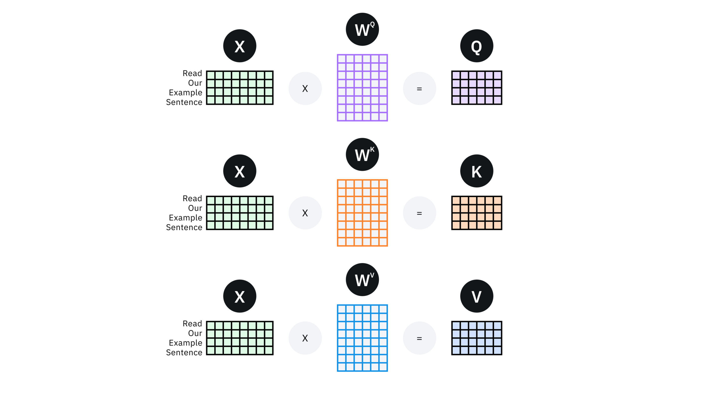
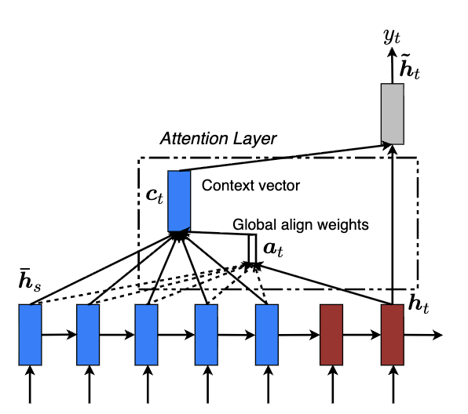
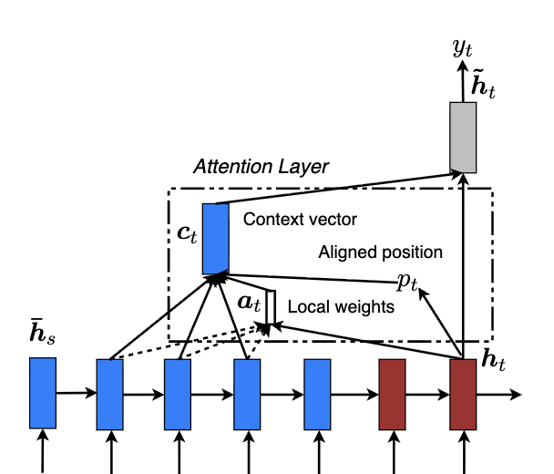

# Transformers
## Motivation
Seq2seq model is fundamentally RNN based sequential model which means the model has to ingest the input one token(word) at a time. 
So each unit was like a bottleneck to the flow of information. Simply speaking, in order to compute the final unit (of encoder, for example), you first have to compute the outputs of all of the units that come before. Plus, with GRU/LSTM applied to cope with vanishing gradient problem, the complexity of model increased. 

Transformers architecture allow you to to run a lot more of computation of units for an entire sequence in parallel. In fact in ingests an entire input sentence all at the same time rather than processing then one at a time. Also, transformer have the advantage of having no recurrent units, therefore requiring less training time than earlier recurrent neural architectures (RNNs) such as long short-term memory (LSTM), because there are less parameters to train. 

## Intuition
The major innovation of transformers architecture is combining the use of attention-based representation and convolutional neural network (CNN) style of processing.
  
As you can see from the above spicture, unlike RNN based seq2seq models, attransformers take input of a lot of words(pixels) and compute representation for them in parallel.  
Also note that there are two key ideas in transformers, which are <b> Self-Attention </b> and 
<b> Multi-Head Attention </b>.

## Preliminary
### Self-Attention (Intra-attention)
Self-attention is an attention mechanism relating different positions of a single sequence in order to compute a representation of the sequence. Check LSTMN for further understanding of self-attention alogirhtm, it is one of early implementation form of self-attention (based on RNN). 

In self-attention, because queries, keys, and values all originate from the same input sequence $X$, we get each (Q,K,V) matrices from embedding multiplied by the weight matrices.
$$
Q = K = V = X, \\[5pt]
\text{head}_i = \text{Attention}(Q W_i^Q, \; K W_i^K, \; V W_i^V)
= \text{Attention}(X W_i^Q, \; X W_i^K, \; X W_i^V)
$$

    

Above image shows that original vector embeddings for the tokens of an input sentence are multiplied by $Q$, $K$ and $V$ weight matrices to yield their respective $Q$, $K$ and $V$ vectors.

#### Query, Key and Value (Q,K,V) concept of Attention
One implementation of self-attention was from “Attention is All You Need” paper. The paper articulated its attention mechanism by using the terminology of a relational database: queries, keys and values. 
- Query: The query vector represents the information a given token is seeking.
- Key: The key vectors represent the information that each token contains. Alignment between query and key is used to compute attention weights.
- Value: The value vector applies the attention-weighted information from the key vectors. 
  - Contributions from keys that are strongly aligned with a query are weighted more heavily.
  - Contributions from keys that are not relevant to a query will be weighted closer to zero.

##### Key and Value
<b> Before Transformers(Bahdanau, Luong attention)</b>  
The encoder hidden states served both as keys and values. So key = value = encoder hidden state.

<b> Transformers </b>
- key: used only to compute attention scores (acts like an “index” or address).
- value: contains the content that actually gets combined and passed forward.

#### Attention vs Self-Attention
<b>Attention</b>  
Across different sequences (e.g.,encoder–decoder). So the encoder hidden states from the source sentence is one sequence(Keys/Values) and the decoder state while generating is another sequence(Query).

<b>Self-Attention</b>  
In self-attention (e.g. Transformer encoder), queries, keys, and values all come from the same sequence.

In summary, 
- (general) Attention
  - cross-sequence (decoder ↔ encoder).
- Self-attention
  - within-sequence (tokens ↔ tokens in the same sentence).

### Addictive Attention and Dot Product Attention
https://www.ibm.com/think/topics/attention-mechanism

#### Addictive Attention
  

Above image shows the Badhanau’s attention mechanism, which is one of addictive attention model implementing. It is trying to generate the $t$-th target word $y_t$ given a source sentence $(x_1, x_2, \cdots, x_T)$. In this context, applying $(Q,K,V)$ terminology, the decoder hidden state at each timestep of the translated sentence($s_t$) is the equivalent of a query vector(Q) and the encoder hidden state at each step in the source sentence($h_t$) is the equivalent of a key vector (and also value vector). (K,V)  
Alignment scores are then determined by a simple feedforward neural network, the attention layer, jointly trained with the rest of the model. This attention layer comprises up to three subsets of learnable model weights: query weights for the hidden decoder states ($W_q$), key weights for hidden encoder states ($W_k$) and value weights to scale the final output ($W_v$).

##### Details of Addictive Attention
Let's see how additive attention works with the formula from Badhanau’s attention mechanism. (also why it is 'addictive' attention)  
$$
e_{ij} = a(s_{i-1}, h_j) =  v_a^{\top} \tanh \left( W_a s_{i-1} + U_a h_j \right), \\[5pt]
\alpha_{ij} = \frac{\exp(e_{ij})}{\sum_{k=1}^{T_x} \exp(e_{ik})}, \\[5pt]
c_i = \sum_{j=1}^{T_x} \alpha_{ij} h_j, \quad
$$
- $h$: the hidden state of encoder. It is key vector (also value vector).
- $s$: the hidden state of deocder. It is query vector.
- $W_a$: query weight ($= W_q$).
- $U_a$: key weight ($= W_k$).
- $v_a$: value weight ($=w_v$). 
- $e = a$: alignment model.
- $\alpha$: weight. So $\alpha_{ij}$ be a probability that the target word $y_i$ is aligned to, or translated from, a source word $x_j$.

Above equation is how alignment model of Badhanau’s attention mechanism. 
1. The query vector (multiplied by $W_q$) is <b>added</b> to a key vector (multiplied by $W_k$).  
<b>If they are aligned, adding them together will yield a large value. If they’re irrelevant to one another, adding them together will yield a small value or negative value.</b>
2. The resulting number is input to a $\tanh$ activation function, then the output of the function is multiplied by the value weights $W_v$.
3. The output of $ v_a^{\top} \tanh \left( W_a s_{i-1} + U_a h_j \right)$ yields the alignment score between the query vector and that key vector.
4. The alignment score is then input to a softmax function, which yields an attention weight for that key vector, $h$.

Then, the context vector from alignment model is used to implement the hidden state $s_i$ of the decoder
$$
s_i = f(s_{i-1}, y_{i-1}, c_i) = (1 - z_i) \circ s_{i-1} + z_i \circ \tilde{s}_i,
$$

#### Dot Product Attention
  
    

Dot product attention has a new alignment score function that used multiplication instead of addition. It also skips $\tanh$ function and calculate the similarity between hidden state vectors by using their dot product. The left one is global dot product attention and the right one is local dot product attention mechanism. Let's check the terminology used in the picture.
- $\tilde{\boldsymbol{h}}_t $: attention vector that fed through the softmax layer to produce the predictive distribution. It is the final hidden state that contains all the information to predict the next word.  
(현재 타겟 단어 예측을 위해 사용되는 '어텐션이 적용된' 새로운 히든 스테이트)
- $\mathbf{h}_t$: the current targeting hidden state.  
(디코더 LSTM의 현재시간 $t$ 때 상위 레이어 히든 스테이트. 이전까지의 타겟 단어 정보와 디코더의 내부 상태를 담고 있다.)
- $\bar{\mathbf{h}}_s$: each source hidden states.
- $\mathbf{c_t}$: the source-side context vector. (소스 문장의 정보를 요약)
- $\mathbf{a}_t$: a variable-length alignment vector(also called weight vector), whose size equals the number of time steps on the source side. 

Luong attention suggest various alignment functions, but we will lookt at just the 'dot' function.
$$
\mathrm{score}(\mathbf{h}_t, \bar{\mathbf{h}}_s) =
\begin{cases}
    \mathbf{h}_t^\top \bar{\mathbf{h}}_s \qquad \text{(dot)} \\
    \mathbf{h}_t^\top \mathbf{W}_a \bar{\mathbf{h}}_s \qquad \text{(general)} \\
    \mathbf{v}_a^\top \tanh \left( \mathbf{W}_a \left[ \mathbf{h}_t; \bar{\mathbf{h}}_s \right] \right) \qquad \text{(concat)}
\end{cases}
$$

This alignment(score) function is used to make wegiht vector $\mathbf{a}_t$ as follows.
$$
\mathbf{a}_t(s) = \operatorname{align}(\mathbf{h}_t, \bar{\mathbf{h}}_s)
= \frac{\exp(\text{score}(\mathbf{h}_t, \bar{\mathbf{h}}_s))}{\sum_{s'} \exp(\text{score}(\mathbf{h}_t, \bar{\mathbf{h}}_{s'}))}
$$
Then, a global context vector $\mathbf{c_t}$ is computed as the weighted average, according to $\mathbf{a}_t(s)$, over all the source states.
$$
\mathbf{c_t} = \sum^{N} \mathbf{a}_t(s) \, \bar{\mathbf{h}}_s
$$
Finally, using context vector and targetting hidden state, make the attention vector and fed through the softmax layer to produce the predictive distribution.
$$
\tilde{\boldsymbol{h}}_t = \tanh(\mathbf{W}_c[\boldsymbol{c}_t; \boldsymbol{h}_t]) \\[5pt]
p(y_t | y_{<t}, x) = \operatorname{softmax}(\mathbf{W}_s \tilde{h}_t)
$$

Applying (Q,K,V) terminology, 
1. Q vector is $\mathbf{h}_t$ and K vector is $\bar{\mathbf{h}}_s$. 
2. They are aligned and the similarity between hidden state vectors is calculated by using their dot product($\mathbf{h}_t^\top \bar{\mathbf{h}}_s $). That is, <b>if a query and key are similar in meaning to one another, multiplying them will yield a large value. If they are not well aligned, their dot product will be small or negative, and the subsequent softmax function will result in a small attention weight.</b>
3. In practice, multiplication is much faster and more computationally efficient for neural networks than additive operations, as it can implemented in fewer steps by using matrix multiplication.

Similar to addictive attention model, the context from alignment model is used to implement the hidden state of the decoder $\mathbf{h}_t$. 

##### Local Dot Proudct Attention
Local attention is little modified as it  selectively focuses on a small window of context. First generates an aligned position $p_t$ for each target word at time $t$. The context vector $c_t$ is then derived as a weighted average over the set of source hidden states within the window
$[pt−D, pt+D]$ where $D$ is empirically selected. So the local alignment vector $\mathbf{a}_t$ is now fixed-dimensional, $\in \mathbb{R}^{2D+1}$.

There are two variants of the mechanism in original Luong paper.  

<b> local-m </b>  
Set $pt = t$ assuming that source and target sequences are roughly monotonically aligned. It is the same as the global model except that the
vector at is fixed-length and shorter.

<b> local-p </b>
It is similar to the local-m model except that dynamically compute $p_t$ and use a truncated Gaussian distribution to modify the original alignment weights align as shown below.
$$
p_t = S \cdot \operatorname{sigmoid}(v_p^\top \tanh(\mathbf{W_p h_t})), \\[5pt]
\mathbf{a}_t(s) = \operatorname{align}(\mathbf{h}_t, \bar{\mathbf{h}}_s) \exp \left( - \frac{(s - p_t)^2}{2\sigma^2} \right)
$$

### Long Short Term Memory Networks (LSTMN)
The LSTMN model is network that to modified the standard LSTM structure by replacing the memory cell with a memory network. For comparison, LSTMs maintain a hidden vector and a memory vector; memory networks have a set of key vectors and a set of value vectors. This design enables the <b>LSTM to reason about relations between tokens with a neural attention layer and then perform non-Markov state updates</b>, which means update its states using information from the whole history, not just the last hidden state. In other words, a key idea behind the LSTMN is to <b>use attention for inducing relations between tokens</b>. 

#### Detail of LSTMN
Let $x_t$ denote the current input, $C_{t-1} = (c_1, \cdots, c_{t-1})$ denotes
the memory tape, and $H_{t-1} = (h_1, \cdots, h_{t-1})$ is the hidden tape. At time step $t$, <b>the model computes the relation between $x_t$ and $x_1, \cdots, x_{t-1}$
through $H_{t-1}$ with an attention layer</b> as follows.
$$
a_i^t = v^\top \tanh \big( W_h h_i + W_x x_t + W_{\tilde{h}} \tilde{h}_{t-1} \big), \\[5pt]
s_i^t = \operatorname{softmax}(a_i^t), \\[5pt]
\tilde{h}_t = \sum_{i=1}^{t-1} s_i^t \, h_i, 
\quad 
\tilde{c}_t = \sum_{i=1}^{t-1} s_i^t \, c_i
$$
Where for the previous hidden tape and memory tape denoted by $\tilde{c}_t$ and $\tilde{h}_t$, respectively as above. And when $\sigma$ is sigmoid function, the rest is very similar to original LSTM. 
$$
i_t = \sigma \!\left( W_i [\tilde{h}_t, x_t] \right), \quad
f_t = \sigma \!\left( W_f [\tilde{h}_t, x_t] \right), \quad
o_t = \sigma \!\left( W_o [\tilde{h}_t, x_t] \right), \quad
\hat{c}_t = \tanh \!\left( W_c [\tilde{h}_t, x_t] \right), \\[5pt]
c_t = f_t \odot \tilde{c}_t + i_t \odot \hat{c}_t, \\[5pt]
h_t = o_t \odot \tanh(c_t)
$$

So in summary, instead of just keeping the last cell vector $c_{t-1}$ as LSTM, the LSTMN stores a memory tape for every past token as follows,
$$
C_{t-1} = (c_1, c_2, \dots, c_{t-1}), 
\quad 
H_{t-1} = (h_1, h_2, \dots, h_{t-1})
$$
And apply self-attention to compute a weighted summary.
$$
\tilde{h}_t, \tilde{c}_t 
= \sum_{i=1}^{t-1} s_i^t \cdot (h_i, c_i)
$$
As the result, instead of only relying on $(h_{t-1}, c_{t-1})$, the update uses $\tilde{h}_t, \tilde{c}_t$ which come from all past states.

### LSTM vs LSTMN
- LSTM: keeps one memory vector $c_t$, updated recursively.(Markovian only depends on previous state $c_{t-1}$.)
- LSTMN: keeps a growing memory tape (all past hidden + cell states). At each step, it uses attention to select from that memory.(Non-Markovian, because $h_t$ depends on all previous $c_{t-1}, h_{t-1}$ states, not just the last one.)

### Memory Network
### End-to-End Memory

## Architecture
  

The transformer architecture consists of stacked self-attention and point-wise, fully-connected layers for both the encoder and decoder.

## Scale Dot Product Self Attention
## Multi-Head Attention
## Weight Tying Embedding
https://arxiv.org/pdf/1608.05859

## Positional Encoding
## Transformer Network
