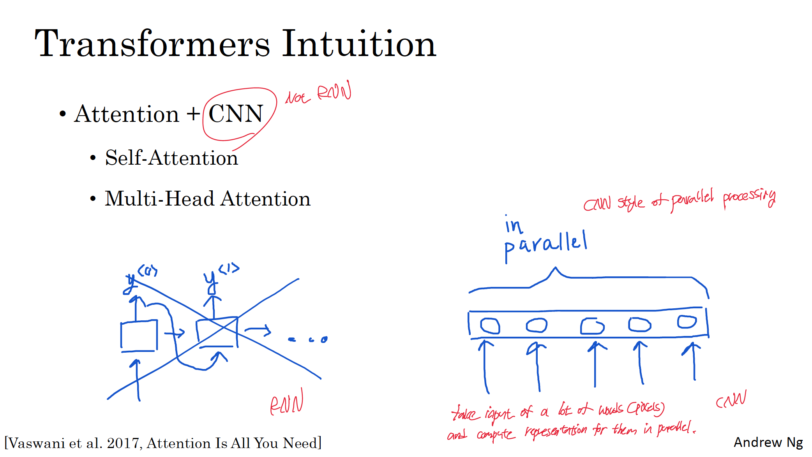
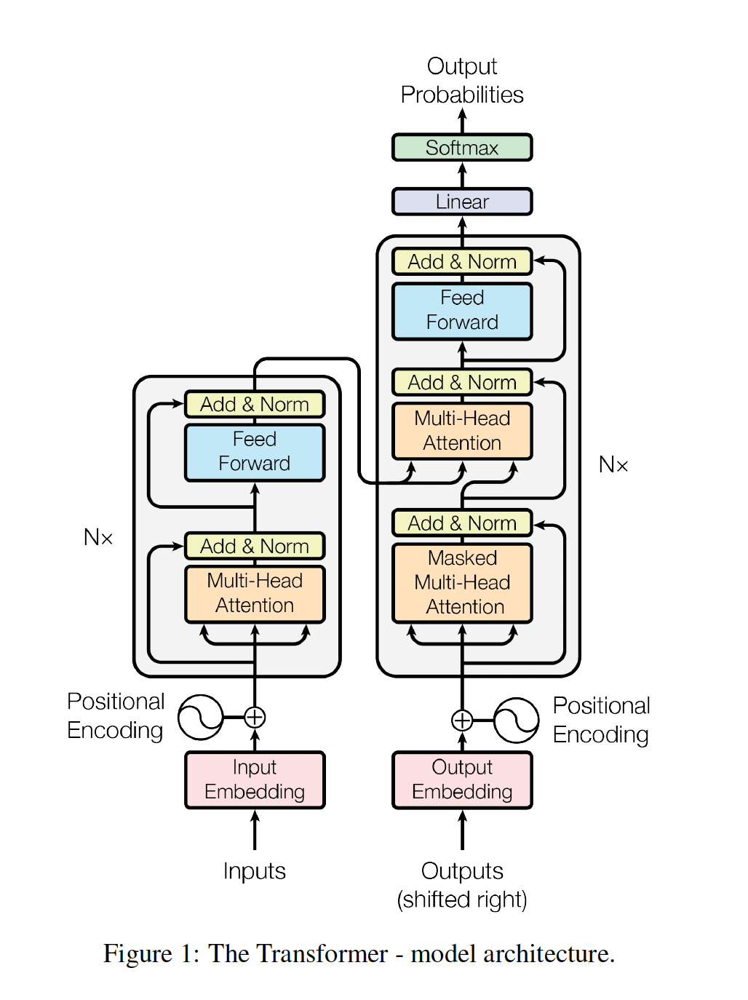

# Transformers
## Motivation
Seq2seq model is fundamentally RNN based sequential model which means the model has to ingest the input one token(word) at a time. 
So each unit was like a bottleneck to the flow of information. Simply speaking, in order to compute the final unit (of encoder, for example), you first have to compute the outputs of all of the units that come before. Plus, with GRU/LSTM applied to cope with vanishing gradient problem, the complexity of model increased. 

Transformers architecture allow you to to run a lot more of computation of units for an entire sequence in parallel. In fact in ingests an entire input sentence all at the same time rather than processing then one at a time. Also, transformer have the advantage of having no recurrent units, therefore requiring less training time than earlier recurrent neural architectures (RNNs) such as long short-term memory (LSTM), because there are less parameters to train. 

## Intuition
The major innovation of transformers architecture is combining the use of attention-based representation and convolutional neural network (CNN) style of processing.
  
As you can see from the above spicture, unlike RNN based seq2seq models, attransformers take input of a lot of words(pixels) and compute representation for them in parallel.  
Also note that there are two key ideas in transformers, which are <b> Self-Attention </b> and 
<b> Multi-Head Attention </b>.

## End-to-End Memory
## Architecture
  

## Self-Attention
## Multi-Head Attention
## Positional Encoding
## Transformer Network
