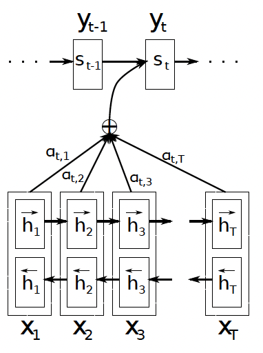

# Transformers
## Motivation
Seq2seq model is fundamentally RNN based sequential model which means the model has to ingest the input one token(word) at a time. 
So each unit was like a bottleneck to the flow of information. Simply speaking, in order to compute the final unit (of encoder, for example), you first have to compute the outputs of all of the units that come before. Plus, with GRU/LSTM applied to cope with vanishing gradient problem, the complexity of model increased. 

Transformers architecture allow you to to run a lot more of computation of units for an entire sequence in parallel. In fact in ingests an entire input sentence all at the same time rather than processing then one at a time. Also, transformer have the advantage of having no recurrent units, therefore requiring less training time than earlier recurrent neural architectures (RNNs) such as long short-term memory (LSTM), because there are less parameters to train. 

## Intuition
The major innovation of transformers architecture is combining the use of attention-based representation and convolutional neural network (CNN) style of processing.
  
As you can see from the above spicture, unlike RNN based seq2seq models, attransformers take input of a lot of words(pixels) and compute representation for them in parallel.  
Also note that there are two key ideas in transformers, which are <b> Self-Attention </b> and 
<b> Multi-Head Attention </b>.

## Preliminary
### Addictive Attention and Dot Product Attention
https://www.ibm.com/think/topics/attention-mechanism

#### Addictive Attention
The attention model's architecture consists of a bidirectional RNN as an encoder and a decoder that emulates searching through a source sentence during decoding a translation.
  

Above image shows the new model trying to generate the $t$-th target
word $y_t$ given a source sentence $(x_1, x_2, \cdots, x_T)$.

#### Dot Product Attention

### Long Short Term Memory Networks (LSTMN)
The LSTMN model is network that to modified the standard LSTM structure by replacing the memory cell with a memory network. For comparison, LSTMs maintain a hidden vector and a memory vector; memory networks have a set of key vectors and a set of value vectors. This design enables the <b>LSTM to reason about relations between tokens with a neural attention layer and then perform non-Markov state updates</b>, which means update its states using information from the whole history, not just the last hidden state. In other words, a key idea behind the LSTMN is to <b>use attention for inducing relations between tokens</b>. 

#### Detail of LSTMN
Let $x_t$ denote the current input, $C_{t-1} = (c_1, \cdots, c_{t-1})$ denotes
the memory tape, and $H_{t-1} = (h_1, \cdots, h_{t-1})$ is the hidden tape. At time step $t$, <b>the model computes the relation between $x_t$ and $x_1, \cdots, x_{t-1}$
through $H_{t-1}$ with an attention layer</b> as follows.
$$
a_i^t = v^\top \tanh \big( W_h h_i + W_x x_t + W_{\tilde{h}} \tilde{h}_{t-1} \big), \\[5pt]
s_i^t = \operatorname{softmax}(a_i^t), \\[5pt]
\tilde{h}_t = \sum_{i=1}^{t-1} s_i^t \, h_i, 
\quad 
\tilde{c}_t = \sum_{i=1}^{t-1} s_i^t \, c_i
$$
Where for the previous hidden tape and memory tape denoted by $\tilde{c}_t$ and $\tilde{h}_t$, respectively as above. And when $\sigma$ is sigmoid function, the rest is very similar to original LSTM. 
$$
i_t = \sigma \!\left( W_i [\tilde{h}_t, x_t] \right), \quad
f_t = \sigma \!\left( W_f [\tilde{h}_t, x_t] \right), \quad
o_t = \sigma \!\left( W_o [\tilde{h}_t, x_t] \right), \quad
\hat{c}_t = \tanh \!\left( W_c [\tilde{h}_t, x_t] \right), \\[5pt]
c_t = f_t \odot \tilde{c}_t + i_t \odot \hat{c}_t, \\[5pt]
h_t = o_t \odot \tanh(c_t)
$$

So in summary, instead of just keeping the last cell vector $c_{t-1}$ as LSTM, the LSTMN stores a memory tape for every past token as follows,
$$
C_{t-1} = (c_1, c_2, \dots, c_{t-1}), 
\quad 
H_{t-1} = (h_1, h_2, \dots, h_{t-1})
$$
And apply self-attention to compute a weighted summary.
$$
\tilde{h}_t, \tilde{c}_t 
= \sum_{i=1}^{t-1} s_i^t \cdot (h_i, c_i)
$$
As the result, instead of only relying on $(h_{t-1}, c_{t-1})$, the update uses $\tilde{h}_t, \tilde{c}_t$ which come from all past states.

### LSTM vs LSTMN
- LSTM: keeps one memory vector $c_t$, updated recursively.(Markovian only depends on previous state $c_{t-1}$.)
- LSTMN: keeps a growing memory tape (all past hidden + cell states). At each step, it uses attention to select from that memory.(Non-Markovian, because $h_t$ depends on all previous $c_{t-1}, h_{t-1}$ states, not just the last one.)

### Memory Network
### End-to-End Memory

## Architecture
  

The transformer architecture consists of stacked self-attention and point-wise, fully-connected layers for both the encoder and decoder.

## Self-Attention (Intra-attention)
Self-attention is an attention mechanism relating different positions of a single sequence in order to compute a representation of the sequence. Check LSTMN for further understanding of self-attention alogirhtm, it is one of early implementation form of self-attention (based on RNN). 

### Attention vs Self-Attention
<b>Attention</b>  
Across different sequences (e.g.,encoder–decoder). So the encoder hidden states from the source sentence is one sequence(Keys/Values) and the decoder state while generating is another sequence(Query).

<b>Self-Attention</b>  
In self-attention (e.g. Transformer encoder), queries, keys, and values all come from the same sequence.

In summary, 
- (general) Attention
  - cross-sequence (decoder ↔ encoder).
- Self-attention
  - within-sequence (tokens ↔ tokens in the same sentence).

## Multi-Head Attention
## Positional Encoding
## Transformer Network
