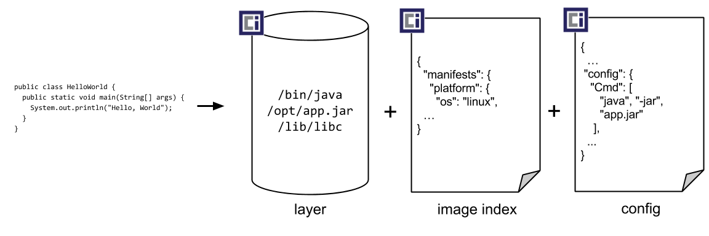

# Containe Runtime

## 목적 및 명세
소프트웨어 구성 요소와 모든 종속성을 캡슐화하여 모든 호환 런타임이 실행 환경과 컨테이너의 내용에 관계없이 다른 추가 종속성 없이 실행할 수 있도록 하는 것
표준 컨테이너의 명세는 아래를 정의해야 한다.
1. 파일 포맷.
2. 표준 작업의 집합.
3. 실행 환경.

## 5가지 원칙
1. 표준 작업 : 표준 컨테이너 도구를 사용하여 생성, 시작 및 중지할 수 있으며, 표준 파일 시스템 도구를 사용하여 복사 및 스냅샷을 생성할 수 있으며, 표준 네트워크 도구를 사용하여 다운로드 및 업로드할 수 있습니다
2. 콘텐츠 구애받지 않음 : 모든 표준 작업은 콘텐츠에 관계없이 동일한 효과를 갖습니다.
3. 인프라 구애받지 않음 : OCI가 지원하는 모든 인프라에서 실행할 수 있습니다.
4. 자동화를 위한 설계 : 콘텐츠와 인프라에 관계없이 동일한 표준 작업을 제공하기 때문에 표준 컨테이너는 자동화에 매우 적합. 
5. 산업 레벨 딜리버리 : 위에 나열된 모든 속성을 활용하여 Standard Containers는 대기업과 중소기업이 소프트웨어 제공 파이프라인을 간소화하고 자동화할 수 있도록 지원합니다. 

# OCI (Open Container Initiative)
## 배경
2015년 6월 도커, 코어OS, AWS, 구글, 마이크로소프트, IBM 등 주요 플랫폼 벤더들은 애플리케이션의 이식성(Portability) 관점에 컨테이너 형식과 런타임을 중심으로 개방형 산업 표준을 만드는 명확한 목적을 가지고 시작된 프로젝트이다.
### 컨테이너 런타임
“컨테이너”란 개념을 호스트에서 동작 시킬수 있도록 하는 소프트웨어. 컨테이너의 라이프 사이클, 이미지 레지스트리, Pull/Push 등의 기능을 관장한다.
e.g) Docker, Containerd, CRI-O

## 3가지 핵심(3 Specifications)
### 런타임 사양(runtime-spec)
컨테이너의 구성, 실행 환경 및 라이프 사이클을 지정하는 것을 목표로 한다.
MAC? ([https://unrealcontainers.com/docs/concepts/macos-containers#:~:text=The macOS Containers initiative is,to the operating system itself](https://unrealcontainers.com/docs/concepts/macos-containers#:~:text=The%20macOS%20Containers%20initiative%20is,to%20the%20operating%20system%20itself).)

**파일 시스템 번들**
특정 방식으로 구성된 파일 집합이며, 모든 표준 작업을 수행하는 모든 호환 런타임에 필요한 모든 데이터와 메타데이터를 포함합니다. 
컨테이너와 해당 구성 데이터가 로컬 파일 시스템에 저장되어 규정을 준수하는 런타임에서 사용될 수 있는 방법들이 정의되어 있어서 컨테이너를 로드하고 실행하는 데 필요한 모든 정보가 들어 있습니다. 
- config.json : 구성 정보가 저장된 json
- 컨테이너의 root 파일 시스템 : 루트 디렉토리가 config.json에 명시되어 있어야 한다.

**런타임 라이프 사이클**
https://github.com/opencontainers/runtime-spec/blob/main/runtime.md

**Config.json**
컨테이너에 대한 표준 작업을 구현하는 데 필요한 메타데이터가 들어 있습니다 . 여기에는 실행할 프로세스, 주입할 환경 변수, 사용할 샌드박싱 기능 등이 포함됩니다.

버전 : Open Container Initiative Runtime Specification의 버전
```python
"ociVersion": "0.1.0”
```

루트 :  컨테이너의 루트 파일 시스템
```python
"root": {
    "path": "rootfs",
    "readonly": true
}
```

마운트 : 루트 디렉토리에 마운트할 path 지정. destination, source 등으로 이루어짐.
```python
"mounts": [
    {
        "destination": "/tmp",
        "type": "tmpfs",
        "source": "tmpfs",
        "options": ["nosuid","strictatime","mode=755","size=65536k"]
    },
    {
        "destination": "/data",
        "type": "none",
        "source": "/volumes/testing",
        "options": ["rbind","rw"]
    }
]
```

프로세스 : 유저 정보 및 컨테이너에서 동작할 작업 관련 정의
```python
"process": {
    "terminal": true,
    "consoleSize": {
        "height": 25,
        "width": 80
    },
    "user": {
        "uid": 1,
        "gid": 1,
        "umask": 63,
        "additionalGids": [5, 6]
    },
    "env": [
        "PATH=/usr/local/sbin:/usr/local/bin:/usr/sbin:/usr/bin:/sbin:/bin",
        "TERM=xterm"
    ],
    "cwd": "/root",
    "args": [
        "sh"
    ],
    ...
  }
```

훅 : POSIX 플랫폼의 경우 컨테이너 라이프사이클에 맞추어 커스텀한 액션을 수행 할 수 있다.
```python
"hooks": {
    "prestart": [
        {
            "path": "/usr/bin/fix-mounts",
            "args": ["fix-mounts", "arg1", "arg2"],
            "env":  [ "key1=value1"]
        },
        {
            "path": "/usr/bin/setup-network"
        }
    ],
    "createRuntime": [
        {
            "path": "/usr/bin/fix-mounts",
            "args": ["fix-mounts", "arg1", "arg2"],
            "env":  [ "key1=value1"]
        },
        {
            "path": "/usr/bin/setup-network"
        }
    ],
    "createContainer": [
        {
            "path": "/usr/bin/mount-hook",
            "args": ["-mount", "arg1", "arg2"],
            "env":  [ "key1=value1"]
        }
    ],
    "startContainer": [
        {
            "path": "/usr/bin/refresh-ldcache"
        }
    ],
    "poststart": [
        {
            "path": "/usr/bin/notify-start",
            "timeout": 5
        }
    ],
    "poststop": [
        {
            "path": "/usr/sbin/cleanup.sh",
            "args": ["cleanup.sh", "-f"]
        }
    ]
}
```

어노테이션 : 추가적인 메타데이터 정보 기입
```python
"annotations": {
    "com.example.gpu-cores": "2"
}
```

**호스트 네임 : 컨테이너 안에서 동작하는 프로세스가 보는 컨테이너의 호스트이름**

**도메인 이름 : 컨테이너 안에서 동작하는 프로세스가 보는 컨테이너의 도메인 이름**

참고 : https://github.com/opencontainers/runtime-spec/blob/main/config.md

**Feature Structure : Container Runtime Caller(도커)에게 Runtime이 제공하는 기술들을 명세해놓은 것.**
e.g.) 버전 및 사용가능한 훅 명세
```python
{
  "ociVersionMin": "1.0.0",
  "ociVersionMax": "1.1.0"
}

"hooks": [
  "prestart",
  "createRuntime",
  "createContainer",
  "startContainer",
  "poststart",
  "poststop"
]
```

### 이미지 사양(image-spec)

OCI 이미지의 목적은 컨테이너 이미지를 빌드, 전송 및 준비하여 실행하기 위한 상호 운용 가능한 도구를 만드는 것입니다.
빌드, 전송 및 실행하기 위한 이미지의 콘텐츠 및 종속성에 대한 메타데이터와 최종 실행 가능한 파일 시스템을 구성하기 위해 압축된 파일 시스템 레이어의 ID가 포함합니다.
이미지 사양의 상위 수준 구성 요소

**이미지 매니페스트 : 특정 아키텍처와 운영 체제에 대한 단일 컨테이너 이미지에 대한 구성과 레이어 세트를 제공**
1. 이미지의 구성을 해시하여 이미지와 해당 구성 요소에 대한 고유 ID를 생성할 수 있도록 합니다.
2.  플랫폼별 이미지 버전에 대한 이미지 매니페스트를 참조하는 "fat 매니페스트"를 통해 다중 아키텍처 이미지를 허용하는 것입니다. 
3. OCI 런타임 사양 으로 변환할 수 있는 것입니다 .
```python
{
  "schemaVersion": 2,
  "mediaType": "application/vnd.oci.image.manifest.v1+json",
  "config": {
    "mediaType": "application/vnd.oci.image.config.v1+json",
    "digest": "sha256:b5b2b2c507a0944348e0303114d8d93aaaa081732b86451d9bce1f432a537bc7",
    "size": 7023
  },
  "layers": [
    {
      "mediaType": "application/vnd.oci.image.layer.v1.tar+gzip",
      "digest": "sha256:9834876dcfb05cb167a5c24953eba58c4ac89b1adf57f28f2f9d09af107ee8f0",
      "size": 32654
    },
    {
      "mediaType": "application/vnd.oci.image.layer.v1.tar+gzip",
      "digest": "sha256:3c3a4604a545cdc127456d94e421cd355bca5b528f4a9c1905b15da2eb4a4c6b",
      "size": 16724
    },
    {
      "mediaType": "application/vnd.oci.image.layer.v1.tar+gzip",
      "digest": "sha256:ec4b8955958665577945c89419d1af06b5f7636b4ac3da7f12184802ad867736",
      "size": 73109
    }
  ],
  "subject": {
    "mediaType": "application/vnd.oci.image.manifest.v1+json",
    "digest": "sha256:5b0bcabd1ed22e9fb1310cf6c2dec7cdef19f0ad69efa1f392e94a4333501270",
    "size": 7682
  },
  "annotations": {
    "com.example.key1": "value1",
    "com.example.key2": "value2"
  }
}
```

- [이미지 인덱스](https://github.com/opencontainers/image-spec/blob/main/image-index.md) : 주석이 달린 매니페스트 목록
- [이미지 레이아웃](https://github.com/opencontainers/image-spec/blob/main/image-layout.md) : 이미지의 내용을 나타내는 파일 시스템 레이아웃
- [파일 시스템 계층](https://github.com/opencontainers/image-spec/blob/main/layer.md) : 컨테이너의 파일 시스템을 설명하는 변경 세트
- [이미지 구성 :](https://github.com/opencontainers/image-spec/blob/main/config.md) [런타임 번들](https://github.com/opencontainers/runtime-spec) 로 변환하기에 적합한 이미지의 레이어 순서와 구성을 결정하는 문서
- [변환](https://github.com/opencontainers/image-spec/blob/main/conversion.md) : 이 변환이 어떻게 발생해야 하는지 설명하는 문서
- [아티팩트 지침](https://github.com/opencontainers/image-spec/blob/main/artifacts-guidance.md) : OCI 이미지 이외의 콘텐츠를 패키징하기 위한 사양을 사용하는 방법을 설명하는 문서
- [설명자](https://github.com/opencontainers/image-spec/blob/main/descriptor.md) : 참조된 콘텐츠의 유형, 메타데이터 및 콘텐츠 주소를 설명하는 참조

### 배포 사양(distribution-spec). 

CRI