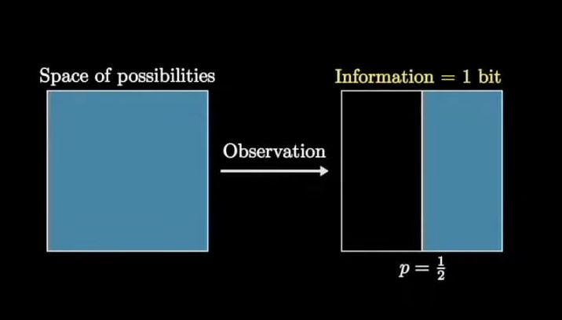
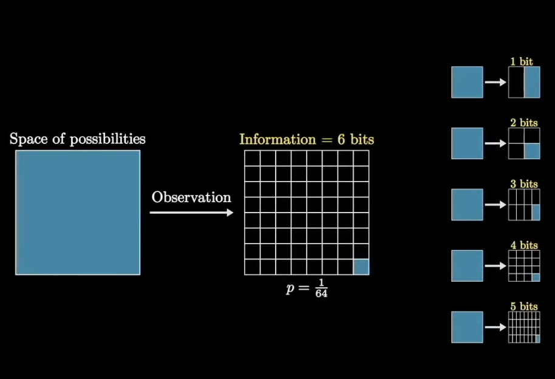

# Information Theory
Information theory is the mathematical study of the quantification, storage, and communication of information.
A key measure in information theory is entropy.  

Information theory is based on probability theory and statistics, where quantified information is usually described in terms of bits.
One of the most important measures is called entropy, which forms the building block of many other measures.  
Entropy allows quantification of measure of information in a single random variable.
Another useful concept is mutual information defined on two random variables, 
which describes the measure of information in common between those variables, which can be used to describe their correlation. 

The choice of logarithmic base in the following formulas determines the unit of information entropy that is used. A common unit of information is the bit(or shannon), based on the binary logarithm($\log_{2}$). 
Note that an expression of the form $p\log p$ is considered by convention to be equal to zero whenever $p = 0$. This is justified because ${\displaystyle \lim _{p\rightarrow 0+}p\log p=0}$ or any logarithmic base.

## Information Content(= Self-Information = Shannon information)
It is a basic quantity derived from the probability of a particular event occurring from a random variable. It can be interpreted as quantifying the level of "surprise" of a particular outcome.   
As it is such a basic quantity, it also appears in several other settings, such as "the length of a message needed to transmit the event" given an optimal source coding of the random variable.

It is closely related to entropy, which is the expected value of Information Content of a random variable, quantifying how surprising the random variable is "on average".  
In other words, entropy is the average amount of self-information an observer would expect to gain about a random variable when measuring it.

## Bit(=Shannon)
The shannon is sort of unit of information named after Claude Shannon, the founder of information theory.
IEC 80000-13 defines the shannon as the information content associated with an event when the probability of the event occurring is ⁠$\frac{1}{2}$. 

If you have one bit, you can specify one of two possibilities, usually written 0 and 1.

Same thing applying to when $n$ outcomes. In general, if you have $b$ bits, you can indicate one of $2^{b} = n$ values.  
For example, suppose you want to store a letter of the alphabet. There are $26$ letters, so how many bits do you need? With $4$ bits, you can specify one of $16$ values, so that’s not enough. With $5$ bits, you can specify up to $32$ values, so that’s enough for all the letters, with a few values left over.  
Let's see another example. If flip a coin and tell you the outcome. I have given you one bit of information. If I roll a six-sided die and tell you the outcome, I have given you  $\log_2{6}$ bits of information.

In general, if the number of outcome is $N$, then the outcome contains  $\log_2{𝑁}$ bits of information.

### Relationship With Self-Information
The Bit is unit of self-information. If you measure self‐information using a base‐$2$ logarithm, then the unit is the “bit.”  
Recall that if the number of outcome is $N$, then the outcome contains $\log_2{𝑁}$ bits of information.  
Equivalently, if the probability of the outcome is $p = \frac{1}{N}$, then the information content is $\log_2{\frac{1}{p}} = - \log_2{p} ( = \log_2{N} )$.  
This quantity is called the self-information of the outcome. It measures how surprising the outcome is, which is why it is also called surprisal. 

For example, if your horse has only one chance in $16$ of winning, and he wins, you get $4$ bits of information (along with the payout). But if the favorite wins $75$% of the time, the news of the win contains only $0.42$ bits.

## Axioms of Information Content
Claude Shannon's definition of self-information has to meet below axioms.

1. An event with probability 100% is perfectly unsurprising and yields no information.
2. The less probable an event is, the more surprising it is and the more information it yields.
3. If two independent events are measured separately, the total amount of information is the sum of the self-informations of the individual events.

## Definition of Information Content
Given a real number $b > 1$ and an event $x$ with probability $P$, the information content is defined as follows:
$$
{\displaystyle \mathrm {I} (x):=-\log _{b}{\left[\Pr {\left(x\right)}\right]}=-\log _{b}{\left(P\right)}.}
$$
Above is a unique function of probability that meets the three axioms, up to a multiplicative scaling factor. 
Note that the base $b$ corresponds to the scaling factor above and different choices of base $b$ correspond to different units of information.  
(e.g., when $b = 2$, the unit is the shannon.)

## Entorpy
Entorpy is the expected information content of measurement of $X$.  
It  measures the expected amount of information earned by identifying the outcome of a random trial.  
In other words, Entropy implies that rolling a die has higher entropy than tossing a coin because each outcome of a die toss has smaller probability $\frac{1}{6}$ than each outcome of a coin toss $\frac{1}{2}$.

### Relationship of Entropy and Information Content
Entropy of the random variable $X$ can be defined as below.
$$
{\displaystyle {\begin{alignedat}{2}\mathrm {H} (X)&=\sum _{x}{-p_{X}{\left(x\right)}\log {p_{X}{\left(x\right)}}}\\&=\sum _{x}{p_{X}{\left(x\right)}\operatorname {I} _{X}(x)}\\&{\overset {\underset {\mathrm {def} }{}}{=}}\ \operatorname {E} {\left[\operatorname {I} _{X}(X)\right]},\end{alignedat}}}
$$
It is equal to the expected information content of measurement of $X$.

## Perplexity
Perplexity is a measure of uncertainty in the value of a sample from a discrete probability distribution. The larger the perplexity, the less likely it is that an observer can guess the value which will be drawn from the distribution.

The perplexity PP of a discrete probability distribution p is a concept widely used in information theory, machine learning, and statistical modeling.
$$
{\displaystyle {\mathit {PP}}(p)=\prod _{x}p(x)^{-p(x)}=b^{-\sum _{x}p(x)\log _{b}p(x)}}
$$
Where $x$ ranges over the events, where $0^{−0}$ is defined to be $1$, and where the value of $b$ does not affect the result. $b$ can be chosen to be $2, 10, e$, or any other positive value other than $1$.

The logarithm $\log PP(p$ is the entropy of the distribution. It is expressed in bits if the base of the logarithm is $2$, and it is expressed in nats if the natural logarithm is used.

Perplexity of a random variable $X$ may be defined as the perplexity of the distribution over its possible values $x$. It can be thought of as a measure of uncertainty or "surprise" related to the outcomes.

For example, the perplexity of a fair coin toss is $2$, and that of a fair die roll is $6$. Generally, for a probability distribution with exactly $N$ outcomes each having a probability of exactly $\frac{1}{N}$, the perplexity is simply $N$.

## Cross Entropy
The cross-entropy between two probability distributions $p$ and $q$, over the same underlying set of events, measures the average number of bits needed to identify an event drawn from the set when the coding scheme used for the set is optimized for an estimated probability distribution $q$, rather than the true distribution $p$.

The cross-entropy of the distribution $q$ relative to a distribution $p$ over a given set is defined as follows:
$$
{\displaystyle H(p,q)=-\operatorname {E} _{p}[\log q],}
$$
Where ${E} _{p}$ is expected value respect to the distribution $p$.

The definition may be formulated using the Kullback–Leibler divergence 
${\displaystyle D_{\mathrm {KL} }(p\parallel q)}$, which represents the divergence of $p$ from $q$ (also known as the relative entropy of 
$p$ with respect to $q$).

$$
{\displaystyle H(p,q)=H(p)+D_{\mathrm {KL} }(p\parallel q)}
$$
Where $H(p)$ is the entropy of $p$.

For discrete probability distributions $p$ and $q$, 
$$
{\displaystyle H(p,q)=-\sum _{x\in {\mathcal {X}}}p(x)\,\log q(x)} 
$$

Similarly, for continuous distributions,
$$
{\displaystyle H(p,q)=-\int _{\mathcal {X}}P(x)\,\log Q(x)\,\mathrm {d} x.} 
$$
Where $P$ and $Q$ be probability density functions of $p$ and $q$.

### Maximum Likeliihood Estimation, KL Divergence and Cross Entropy
https://medium.com/intro-to-artificial-intelligence/the-link-between-maximum-likelihood-estimation-mle-and-cross-entropy-599cc1414753

https://medium.com/@mrthinger/kl-divergence-vs-cross-entropy-exploring-the-differences-and-use-cases-3f3dee58c452

### Cross Entropy Loss vs Negative Log Likelihood
Cross entropy is negative log likelihood.  
It is because minimizing cross entropy is same as maximizing  log likelihood.

### Cross Entropy Loss
https://www.geeksforgeeks.org/what-is-cross-entropy-loss-function/
https://stackoverflow.com/questions/41990250/what-is-cross-entropy
https://jmlb.github.io/ml/2017/12/26/Calculate_Gradient_Softmax/

### Gradient of Cross Entropy Loss

#### Gradient of Cross Entropy Loss w.r.t. input of softmax 
$$
\frac{\partial L}{\partial \mathbf{z}} = \mathbf{a} \odot \left( \mathbf{g} - \mathbf{a}^\top \mathbf{g} \right)
$$

https://hyunw.kim/blog/2017/10/27/KL_divergence.html
https://en.wikipedia.org/wiki/Cross-entropy

## Entropy vs Cross-Entropy vs Cross-Entropy Loss
<b> Entropy </b>  
Entropy is a measure of uncertainty or information content in a probability distribution.
(The uncertainty in the true distribution)
$$
H(p) = - \sum_{x} p(x) \log p(x)
$$
When random variable $X$ follows distribution $p(x)$.

<b> Cross-Entropy </b>  
Cross-entropy measures how well one probability distribution $q(x)$ approximates another distribution $p(x)$.
(mismatch between true distribution $p$ and predicted distribution $q$)
$$
H(p, q) = - \sum_{x} p(x) \log q(x)
$$
When $p(x)$ is the true distribution (e.g., actual labels in classification). $q(x)$ is the estimated distribution (e.g., model’s predicted probabilities).

<b> Cross-Entropy Loss </b>  
In machine learning, we use cross-entropy as a loss function for classification.
(the practical implementation of cross-entropy in ML, usually with one-hot)
$$
L = - \sum_{c=1}^{C} y_{i,c} \log q_{i,c} \\[5pt]
L = - \log q_{i,\text{true}}
$$
The second one is reduced form (when $y_{i,c}=1$ only for the true class).

## Information Gain
Remind that, the KL divergence is a type of statistical distance measure of how much a model probability distribution $Q$ is different from a true probability distribution $P$.  
Mathematically, it is defined as
$$
{\displaystyle D_{\text{KL}}(P\parallel Q)=\sum _{x\in {\mathcal {X}}}P(x)\ \log \left({\frac {\ P(x)\ }{Q(x)}}\right).}
$$

In broader contexts, information gain can be used as a synonym for either Kullback–Leibler divergence or mutual information, but in the narrow meaning, information gain refers to the conditional expected value of the Kullback–Leibler divergence of the univariate probability distribution of one variable from the conditional distribution of this variable given the other one.  
The information gain of a random variable $X$ obtained from an observation of a random variable $A$ taking value $a$ is defined as below.
$$
{\displaystyle {\mathit {IG}}(X,a)=D_{\text{KL}}{\bigl (}P_{X\mid a}\parallel P_{X}{\bigr )}}
$$
In other words, IG is the KL divergence of $\displaystyle P_{X}(x)$ (the prior distribution for $X$) from $\displaystyle P_{X\mid a}(x)$ (the posterior distribution for $X$ given $A=a$).

The expected value of the information gain is the mutual information ($I(X;A)$).
$$
\displaystyle \operatorname {E} _{A}[{\mathit {IG}}(X,A)]=I(X;A)
$$
It can be interpreted as the reduction in the entropy of $X$ achieved by learning the state of the random variable $A$.

<b>Information Gain </b>  
Information gained from one observation. (specific value of $A$)  
“How much information did I gain about $X$ from this specific answer of $A=a$?"

<b> Expected Information Gain </b>  
The average information you expect to gain by knowing $A$.  
"On average, how informative is $A$ about $X$?"

### Expected Information Gain
The expected information gain is the reduction in information entropy Η from a prior state to a state that takes some information as given:
$$
\displaystyle IG(T,a)=\mathrm {H} {(T)}-\mathrm {H} {(T|a)} \\[5pt]
$$
Where $\mathrm {H}(T)$ is entropy as a measure of uncertainty of a random variable $T$ and
$\displaystyle \mathrm {H} {(T|a)}$ is the conditional entropy of $T$ given the value of attribute $a$.  
By learning (or assuming) $a$ about $T$, our uncertainty about $T$ is reduced (= $IG(T,a)$ is positive), unless of course, $T$ is independent of $a$, in which case $\mathrm {H} (T|a)=\mathrm {H} (T)$ meaning $IG(T,a)=0$.

### Usage of Information Gain
IG is used in decision trees to quantify the effectiveness of a feature in splitting the dataset into classes. <b>It calculates the reduction in entropy (uncertainty) of the target variable (class labels) when a particular feature is known.</b>  
In simpler terms, Information Gain helps us understand how much a particular feature contributes to making accurate predictions in a decision tree. <b>Features with higher Information Gain are considered more informative and are preferred for splitting the dataset, as they lead to nodes with more homogenous classes.</b>

### Information Gain Ratio
### Relative Information Gain

## Mutual Information
### Relation to Kullback–Leibler divergence
The mutual information is equal to the total entropy for an attribute if for each of the attribute values a unique classification can be made for the result attribute.  
$$
\displaystyle IG(T,a)=\mathrm {H} {(T)}-\mathrm {H} {(T|a)}
$$
When $IG$ is expected information gain (= mutual information).
Above equiation means that if each value of attribute $a$ perfectly predicts the class, then,
$$
\mathrm {H} {(T|a)} = 0
$$
It is because no uncertainty remains once you know $a$. So the information gain equals the total entropy of the target.