# Learning Theory

## Bias and Variance (Trade Off)
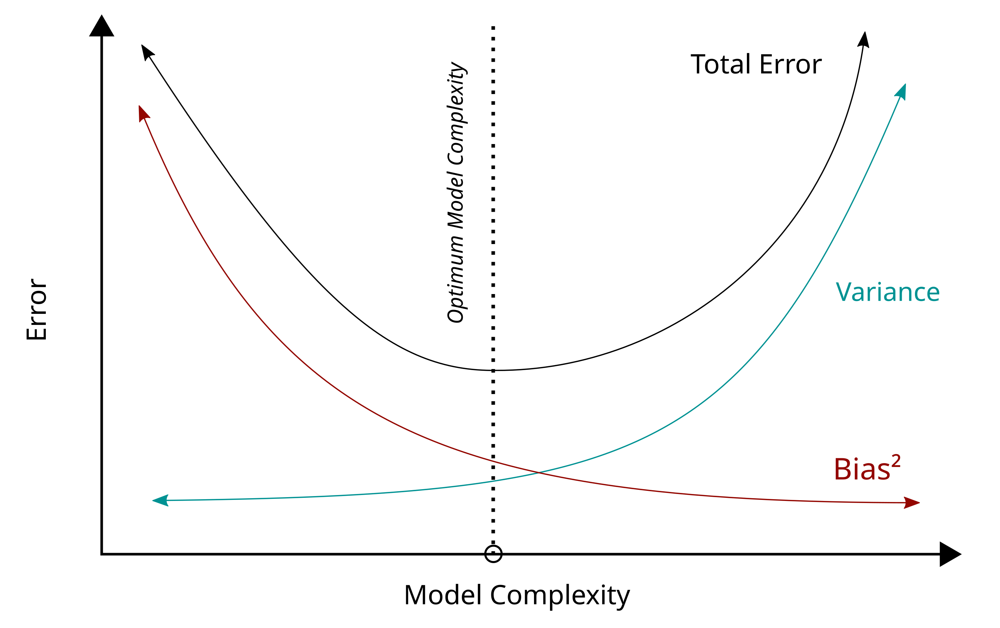
The bias–variance tradeoff describes the relationship between a model's complexity, the accuracy of its predictions, and how well it can make predictions on previously unseen data that were not used to train the model.
As the number of tunable parameters increase in a model, it becomes more flexible, and can better fit a training data set. It is said to have lower error, or $\text{Bias}$.  
However, for more flexible models, there will tend to be greater $\text{Variance}$ to the model fit each time we take a set of samples to create a new training data set.

### Bias
The bias error is an error from erroneous assumptions in the learning algorithm. High bias can cause an algorithm to miss the relevant relations between features and target outputs (underfitting).  
= why is prediction staying away from real data.

### Variance
The variance is an error from sensitivity to small fluctuations in the training set. High variance may result from an algorithm modeling the random noise in the training data (overfitting).

### Recipe
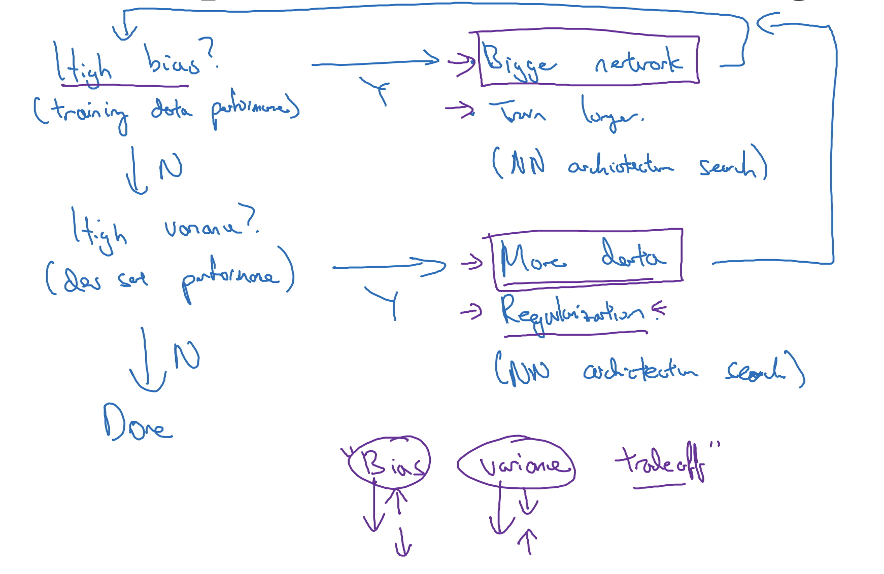

### Benefit of Deep Learning
In modern deep learning big data era, training a bigger network almost always reduce bias without hurting variance much (if regularized properly). Also, getting more data almost always reduce variance without hurting bias much.  
This is the why Deep Learning is so useful in supervised learning.

## Approximation and Estimation
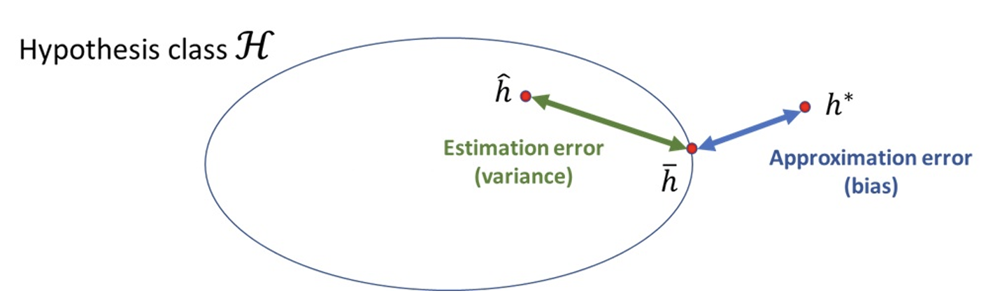

### Bayes Error
$$
\epsilon{(h^*)}
$$
Bayes error rate is the lowest possible error rate for any classifier of a random outcome and is analogous to the irreducible error.

### Estimation Error
$$
\epsilon{(\hat{h})} - \epsilon{(\bar{h})}
$$
The estimation error is the error implied by the fact that the algorithm works with a finite training set that only partially reflects the true distribution of the data.
(limitation do)

### Approximation Error
$$
\epsilon{(h^*)} - \epsilon{(\bar{h})}
$$
The approximation error is the error implied by the choice of function class and is defined as the difference in risk obtained by the best model within the function class and the optimal model.

### Total Error
$$
(\text{Bayes Error})+ (\text{Approximation Error}) + (\text{Estimation Error})
$$

### Relation with Bias and Variance
 - Estimation Error : Estimation Variance + Estimation Bias
 - Variance : Estimation Variance
 - Bais : Estimation Bias + Approximation Error

$$
(\text{Bayes Error})+ (\text{Approximation Error}) + (\text{Estimation Error}) = 
$$
$$
(\text{Bayes Error}) (\text{Bias}) (\text{Variance})
$$

### Fight High Bias & Fight High Variance
 - Increase Hypothesis class $H$ to decrease bias (while increse variance)
 - Increase number of examples to decrease variance. 
 - Regularization to decrease variance.

## Regularization
https://www.geeksforgeeks.org/regularization-in-machine-learning/
https://en.wikipedia.org/wiki/Regularization_(mathematics)

Adding incentive term to make the parameter theta smaller. (when minimizing theta) and make parameter theta bigger when maximizaing theta.


### L1 Regularization
L1 regularization (also called LASSO) leads to sparse models by adding a penalty based on the absolute value of coefficients.
### L2 Regularization
L2 regularization (also called ridge regression) encourages smaller, more evenly distributed weights by adding a penalty based on the square of the coefficients.

### Applying to Logistic Regression
$$
\mathcal{J}(w, b) = \frac{1}{m} \sum_{i=1}^{m} \mathcal{L}(\hat{y}^{(i)}, y^{(i)}) + \frac{\lambda}{2m} \| w \|_2^2 \\[6pt]
\text{Where,} \quad \| w \|_2^2 = \sum_{j=1}^{n_x} w_j^2 = w^\top w
$$
From above, L2 Regularization is applied.  
$\lambda$ is a regularization parameter (hyperparameter).  
Note that you can use L1 Regulariztion, but L2 is more generally used.
$$
\frac{\lambda}{2m} \sum_{j=1}^{n_x} |w_j| = \frac{\lambda}{2m} \| w \|_1
$$

### Applying to Neural Network
$$
\mathcal{J}(W^{[1]}, b^{[1]}, \dots, W^{[L]}, b^{[L]}) =
\frac{1}{m} \sum_{i=1}^{m} \mathcal{L}(\hat{y}^{(i)}, y^{(i)}) +
\frac{\lambda}{2m} \sum_{\ell=1}^{L} \| W^{[\ell]} \|_F^2 \\[6pt]
\| W^{[\ell]} \|_F^2 = \sum_{i=1}^{n^{[\ell]}} \sum_{j=1}^{n^{[\ell-1]}} \left( W_{ij}^{[\ell]} \right)^2, \quad W^{[\ell]} : \left( n^{[\ell]}, \; n^{[\ell - 1]} \right)
$$

From above, Frobenius Norm is applied.  

When $\frac{\partial \mathcal{J}}{\partial W^{[\ell]}} = \frac{1}{m} dZ^{[L]} A^{[L-1] \top}$, regularization on backpropagation is,
$$
\frac{\partial \mathcal{J}}{\partial W^{[\ell]}} = \frac{1}{m} dZ^{[L]} A^{[L-1] \top} + \frac{\lambda}{m} W^{[\ell]}
$$
Therefore, gradient descent is, 
$$
W^{[\ell]} := W^{[\ell]} - \alpha \cdot \frac{\partial \mathcal{J}}{\partial W^{[\ell]}} 
$$

### Weight Decay
$$
W^{[\ell]} := W^{[\ell]} - \alpha \left[ \frac{1}{m} dZ^{[L]} A^{[L-1] \top} + \frac{\lambda}{m} W^{[\ell]} \right] \\
= W^{[\ell]} - \frac{\alpha \lambda}{m} W^{[\ell]} - \alpha \cdot \frac{1}{m} dZ^{[L]} A^{[L-1] \top}\\
= \left( 1 - \frac{\alpha \lambda}{m} \right) W^{[\ell]} - \alpha \cdot \frac{1}{m} dZ^{[L]} A^{[L-1] \top}
$$
When applying graient descent with regularization, $\left( 1 - \frac{\alpha \lambda}{m} \right)$ is less than $1$ and it is keep multiplying to weight. So you can call L2 Regularization as weight decay.


### How regularization prevent overfitting
Recall regulariztion in neural network,
$$
\mathcal{J}(W, b) =
\frac{1}{m} \sum_{i=1}^{m} \mathcal{L}(\hat{y}^{(i)}, y^{(i)}) +
\frac{\lambda}{2m} \sum_{\ell=1}^{L} \| W^{[\ell]} \|_F^2 
$$
Note that increasing regularization parameter $\lambda$ leads to weight $W$ close to $0$. Since $W$ is close to 0, overall impact of hidden units decreases. Therfore, the whole network is not very far from a big linear function when $W \approx 0$. 

For example, consdier tanh function as activate function.
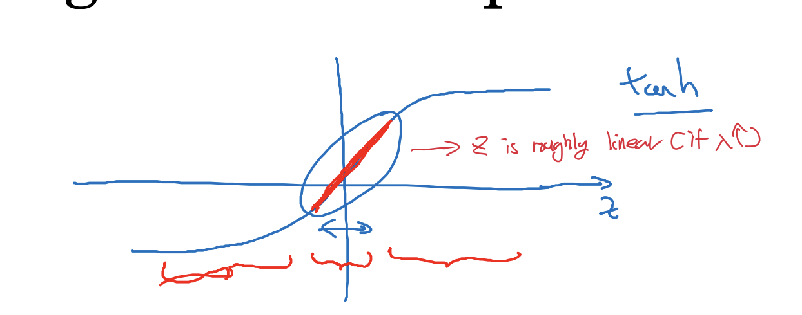  

Consider tanh function above.
$$
g(Z) = \tanh(Z) \\[6pt]
Z = W \cdot A + b
$$

When $\lambda$ is big and $W$ is close to $0$, $Z$ is also close to $0$. Then from the graph above, we can find out that $g(Z)$ is roughly linear. 
Since $W = [W^{[1]}, W^{[1]}, \cdots, W^{[l]}]$, every layer $W^{[k]}$ is linear and the whole network is linear. ("Why Activation Function Shouldn't be linear")
$$
\sigma\bigl(W^{[2]}h + W_0^{[2]}\bigr)
= \sigma\Bigl(W^{[2]}\bigl(W^{[1]}x + W_0^{[1]}\bigr) + W_0^{[2]}) \cdots
$$

#### Why increasing lambda leads to weight close to 0?
Let's see the original gradient descent and the one with regularization applied.
$$
w \leftarrow w - \alpha \cdot \frac{\partial \mathcal{L}}{\partial w} \\[6pt]
\text{When applying regularization,} \quad
w \leftarrow w - \alpha \left( \frac{\partial \mathcal{L}}{\partial w} + \lambda w \right)
$$
The higher $\lambda$, The larger the penalty gradient, $ \lambda w$. This leads to the stronger "shrinkage" in every update step.  
Therefore increasing $\lambda$ cause more aggressive pull toward $0$, smaller final values for $w$ and even some weights effectively going to $0$.

### Dropout
Dropout is a regularization technique used in neural network that randomly shuts down some neurons in each iteration.

#### Inverted Dropout
Inverted dropout modifies the standard dropout technique by scaling the remaining active neurons 
during training to maintain consistent expectations between the training and inference phases.  
This is done by dividing the result of the element-wise multiplication by the keep probability (1 - dropout rate).  
With Inverted Dropout, expected value is not reduced due to scaling(keep probability).
For example, consider inverted dropout in python code below.
```python
d3 = np.random.rand(a3.shape[0], a3.shape[1]) < keep_prob # keep_prob = 0.8
a3 = np.multiply(a3, d3)  # a3 *= d3
```
This "a3" will be used in the next layer. 
$$
z^{[4]} = W^{[4]} \cdot a^{[3]} + b^{[4]}
$$
In this expression, since dropout is applied to "a3", "a3" is redued to 80%.  
So in order to prevent the expected value not to reduce, you need to scale the activations.  
```python
a3 /= keep_prob
```

#### Why Dropout Works?
Dropout makes neurons can’t rely on any one feature, so dropout works as spreading out the weights.  
This leads to the impact of shrinking the squared norm of weights, which is same to L2 regularization (weight decay).  

#### Applying Dropout
 - Usually no dropout in the input layer (or very close to $1$).
 - You can set different dropout ratio on layers. So if you are more worried about some layers overfitting than others,
 you can set higher dropout ratio.
 - Dropout makes cost function $J$ not defined well, because you kill some hidden unit on each iteration. 
 It makes hard to check cost function going down hill on every iteration.

### Data Augmentation
A technique of artificially increasing the training set by creating modified copies of a dataset using existing data. For example, in image processing, applying transformations like rotations, flips, or color adjustments to existing images can help models generalize better.  
It helps machine learning models perform better by making the most of existing data. It prevents overfitting, improves accuracy, and creates diversity in training data, which is crucial when datasets are small or imbalanced.

#### Data Augmentation Advantages
 - To prevent models from overfitting.
 - The initial training set is too small.
 - To improve the model accuracy.
 - To Reduce the operational cost of labeling and cleaning the raw dataset.

### Early Stopping
In ML, the dataset is divided into a training set and a dev set. After each iteration of training, the parameters are updated accordingly after understanding the dataset. Finally, this trained model is applied to the dev set.  
Generally, the training set error will be less compared to the dev set error. This is because of overfitting whereby the algorithm memorizes the training data and produces the right results on the training set. So, the model becomes highly exclusive to the training set and fails to produce accurate results for other datasets including the dev set.  

Regularization techniques are used in such situations to reduce overfitting and increase the model’s performance on any general dataset.  

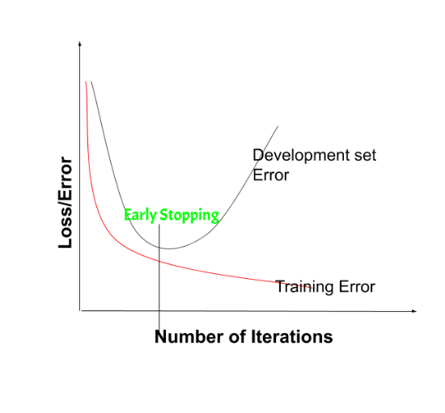  
When Early Stop, we stop training the model when the performance on the dev set is getting worse- increasing loss decreasing accuracy, or poorer scores of the scoring metric.  
By plotting the error on the training dataset and the validation dataset together, both the errors decrease with a number of iterations until the point where the model starts to overfit. After this point, the training error still decreases but the dev set error increases.  

### Standard Normalization
In mathematical statistics, a random variable $$ is standardized by subtracting its expected value $\operatorname {E} [X]$ and dividing the difference by its standard deviation $\sigma (X)={\sqrt {\operatorname {Var} (X)}}$,
$$
Z={X-\operatorname {E} [X] \over \sigma (X)}
$$

### Gradients Checking
The backpropagation step can be a tricky area where mistakes are more likely to happen. Thus, a method to debug this step can be a real lifesaver by fixing mistakes and making our predictions even more accurate. That's when gradient checking comes in!.  

Let's consider all parameters $W^{[1]}, b^{[1]}, \cdots W^{[l]}, b^{[l]}$ as theta.  
$$
J(\theta) = J(W^{[1]}, b^{[1]}, \cdots W^{[l]}, b^{[l]}) = J(\theta_1, \theta_2, \cdots \theta_l)
$$
We want to check if $d \theta$ is gradient of $J(\theta)$. Using the idea that two-side difference of derivation is more accurate, we can consider as below.  
$$
\text{for each } i: \\
\quad d\theta_{\text{approx [i]}} = \frac{\mathcal{J}(\theta_1, \theta_2, \ldots, \theta_i + \varepsilon, \ldots) - \mathcal{J}(\theta_1, \theta_2, \ldots, \theta_i - \varepsilon, \ldots)}{2 \varepsilon} \approx d\theta[i]  = \frac{\partial \mathcal{J}}{\partial \theta_i} \\[1em]
$$
Putting together, what we want to find out ratio below.
$$
\Sigma = \frac{ \left\| d\theta_{\text{approx}} - d\theta \right\|_2 }{ \left\| d\theta_{\text{approx}} \right\|_2 + \left\| d\theta \right\|_2 }
$$
If this ratio is less than $10^{-7}$, great!, bigger than $10^{-3}$, you should be worried.

#### How does Gradients Checking works?
Backpropagation computes the gradients $\frac{\partial J}{\partial \theta}$, where $\theta$ denotes the parameters of the model. $J$ is computed using forward propagation and your loss function.

Because forward propagation is relatively easy to implement, you're confident you got that right, and so you're almost  100% sure that you're computing the cost $J$ correctly. Thus, you can use your code for computing $J$ to verify the code for computing $\frac{\partial J}{\partial \theta}$. 

Let's look back at the definition of a derivative (or gradient):
$$ \frac{\partial J}{\partial \theta} = \lim_{\varepsilon \to 0} \frac{J(\theta + \varepsilon) - J(\theta - \varepsilon)}{2 \varepsilon} \tag{1}$$

We know the following:
- $\frac{\partial J}{\partial \theta}$ is what you want to make sure you're computing correctly. 
- You can compute $J(\theta + \varepsilon)$ and $J(\theta - \varepsilon)$ (in the case that $\theta$ is a real number), since you're confident your implementation for $J$ is correct. 
#### Notes of Gradients Checking
 - Don't use in training. Only Debugging!
 - If gradient checking fails, (above $\Sigma \geq 10^{-3}$) look at each component to try to find the bug($d\theta_{\text{approx [i]}}$ and $d\theta_{[i]}$).
 - Don't forget regularization in backpropagation.  
 ($\mathcal{J}(W^{[1]}, b^{[1]}, \dots, W^{[L]}, b^{[L]}) =
\frac{1}{m} \sum_{i=1}^{m} \mathcal{L}(\hat{y}^{(i)}, y^{(i)}) +
\frac{\lambda}{2m} \sum_{\ell=1}^{L} \| W^{[\ell]} \|_F^2$)
 - Don't use dropout. (turn off dropout first -> gradient check -> check algorithm correct -> turn on dropout)
 - Use random initialization and Run again after some training iteration. (Initially when $W,b$ is close to $0$, there might be no problem. But if training is done and $W,b$ is large, problem might occurs.) 


## Cross Validation
Cross validation is a technique used in machine learning to evaluate the performance of a model on unseen data. It involves dividing the available data into multiple folds or subsets, using one of these folds as a validation set, and training the model on the remaining folds. This process is repeated multiple times, each time using a different fold as the validation set. Finally, the results from each validation step are averaged to produce a more robust estimate of the model’s performance. Cross validation is an important step in the machine learning process and helps to ensure that the model selected for deployment is robust and generalizes well to new data.

### Purpose of Cross Validation
The main purpose of cross validation is to prevent overfitting, which occurs when a model is trained too well on the training data and performs poorly on new, unseen data. By evaluating the model on multiple validation sets, cross validation provides a more realistic estimate of the model’s generalization performance.

### Holdout Cross Validation (Train, Dev and Test Set)
You train on the training set, evaluate results on the dev set, and test on the test set. So do not test your model on the test set until you have finished handling overfitting.  
In short, 
1. Keep on fitting on train sets.
2. Evaluating and Optimizing the performance of your algorithm on dev sets. (Introducing new features, Choosing model size or regularization parameter...)
3. Want to know how well your algorithm is perforing -> evaluate the model on the test sets.

#### Relation between # of datasets and data split
- If you have to find out small differences in algorithm accuracy, you need large test sets. (e.g., 90.01% vs 90.00%)  
- Choose dev/test sets big enough to make meaningful comparion between different algorithm (90% vs 88%). 
- As the # of example increases, data you send to dev and test sets are shrinking.  
(1,000 example : 60%/20%/20%, 100,000,000,000 example : 98%/1%/1%)

### K-fold Cross Validation
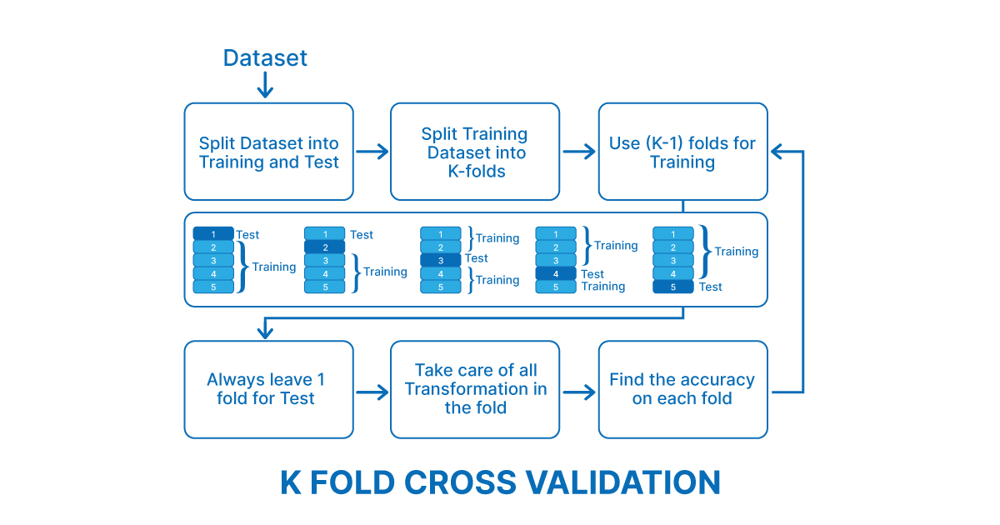
In K-fold cross-validation, the data set is divided into a number of K-folds and used to assess the model’s ability as new data become available. K represents the number of groups into which the data sample is divided. For example, if you find the k value to be 5, you can call it 5-fold cross-validation. Each fold is used as a test set at some point in the process.

1. Randomly shuffle the dataset.
2. Divide the dataset into k folds
3. For each unique group:
4. Use one fold as test data
5-1. Use remaining groups as training dataset
5-2. Fit model on training set and evaluate on test set
Keep Score 
6. Get accuracy score by applying mean to all the accuracies received for all folds.

### Leave-One-Out Cross Validation
LOOCV(Leave One Out Cross-Validation) is a type of cross-validation approach in which each observation is considered as the validation set and the rest (N-1) observations are considered as the training set.  
In LOOCV, fitting of the model is done and predicting using one observation validation set. Furthermore, repeating this for N times for each observation as the validation set.  
This is a special case of K-fold cross-validation in which the number of folds is the same as the number of observations(K = N). 

## Feature Selection
Feature selection is the process of selecting a subset of relevant features (variables, predictors) for use in model construction.  

Keep on adding feature greedly one at a time to which single feature addition helps improve your algorithm the most until adding more features not hurt performance. Then pick whichever feature subsets allows you to have the best possible performance of dev sets.

Advantages:  
 - simplification of models to make them easier to interpret.
 - shorter training times.
 - to avoid the curse of dimensionality.
 - improve the compatibility of the data with a certain learning model class.
 - to encode inherent symmetries present in the input space.
 
## Empirical Risk Minimizer
Empirical risk minimization is a principle in statistical learning theory which defines a family of learning algorithms based on evaluating performance over a known and fixed dataset.  
The core idea is based on an application of the law of large numbers; more specifically, we cannot know exactly how well a predictive algorithm will work in practice (i.e. the true "risk") because we do not know the true distribution of the data.  
But we can instead estimate and optimize the performance of the algorithm on a known set of training data. (i.e. the empirical risk)  
### Background of ERM
When there is a non-negative real-valued loss function ${\displaystyle L({\hat {y}},y)}$ which measures how different the prediction $\hat{y}$ of a hypothesis is from the true outcome $y$.  
A loss function commonly used in theory is the 0-1 loss function: 
$$
L(\hat{y}, y) =
\begin{cases} 
1 & \text{if } \hat{y} \neq y, \\
0 & \text{if } \hat{y} = y.
\end{cases}
$$
For classification tasks these loss functions can be scoring rules.  
The risk associated with hypothesis $h(x)$ is then defined as the expectation of the loss function:
$$
R(h) = \mathbb{E}[L(h(x), y)] = \int L(h(x), y) \, dP(x, y).
$$
The ultimate goal of a learning algorithm is to find a hypothesis $h^{*}$ among a fixed class of functions $\mathcal {H}$ for which the risk $R(h)$ is minimal:
$$
h^* = \arg\min_{h \in \mathcal{H}} R(h).
$$
### Basics of ERM
In general, the risk $R(h)$cannot be computed because the distribution $P(x,y)$ is unknown to the learning algorithm.   
However, given a sample of iid training data points, we can compute an estimate, called the "empirical risk", by computing the average of the loss function over the training set.  
More formally, computing the expectation with respect to the empirical measure:
$$
R_{\text{emp}}(h) = \frac{1}{n} \sum_{i=1}^n L(h(x_i), y_i).
$$
The empirical risk minimization principle states that the learning algorithm should choose a hypothesis $\hat {h}$ which minimizes the empirical risk over the hypothesis class $\mathcal {H}$:
$$
\hat{h} = \arg\min_{h \in \mathcal{H}} R_{\text{emp}}(h).
$$

### Uniform Convergence
A sequence of functions $f_{n}$ converges uniformly to a limiting function $f$ on a set $E$ as the function domain if, given any arbitrarily small positive number $\epsilon$, a number $N$ can be found such that each of the functions $f_{N},f_{N+1},f_{N+2},\ldots$  differs from $f$ by no more than $\epsilon $ at every point $x$ in $E$.  
Informally speaking, if $f_{n}$ converges to $f$ uniformly, then how quickly the functions $f_{n}$ approach $f$ is "uniform" throughout $E$ in the following sense.  
In order to guarantee that $f_{n}(x)$ differs from $f(x)$ by less than a chosen distance $\epsilon$ we only need to make sure that $n$ is larger than or equal to a certain $N$, which we can find without knowing the value of $x \in E$ in advance.  
In other words, there exists a number $N=N(\epsilon )$ that could depend on $\epsilon$ but is independent of $x$ such that choosing $n\geq N$ will ensure that $|f_{n}(x)-f(x)|<\epsilon$ for all $x\in E$.
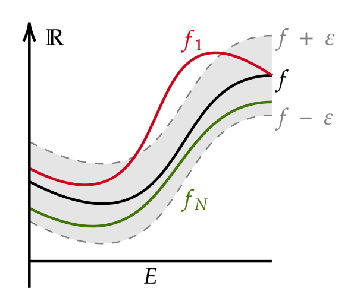
A sequence of functions $f_{n}$ converges uniformly to 
$f$ when for arbitrary small $\epsilon$ there is an index $N$ such that the graph of $f_{n}$ is in the $\epsilon$-tube around $f$ whenever $n\geq N$.

### Union Bound
Union Bound also known as Boole's inequality, says that for any finite or countable set of events, the probability that at least one of the events happens is no greater than the sum of the probabilities of the individual events.  
This inequality provides an upper bound on the probability of occurrence of at least one of a countable number of events in terms of the individual probabilities of the events.
$$
\mathbb{P}\left( \bigcup_{i=1}^\infty A_i \right) \leq \sum_{i=1}^\infty \mathbb{P}(A_i).
$$

### Hoeffding's inequality
Hoeffding's inequality provides an upper bound on the probability that the sum of bounded independent random variables deviates from its expected value by more than a certain amount.

Let $X_{1}+\cdots + X_{n}$ be independent random variables such that $ a_{i}\leq X_{i}\leq b_{i}$ almost surely. Consider the sum of these random variables, $ S_{n}=X_{1}+\cdots + X_{n}$.  
Then Hoeffding's theorem states that, for all $t > 0$ and $\mathbb{E}[S_n]$ is expected value of $S_n$.
$$
\mathbb{P}\left(S_n - \mathbb{E}[S_n] \geq t\right) \leq \exp\left(-\frac{2t^2}{\sum_{i=1}^n (b_i - a_i)^2}\right)
$$
$$
\mathbb{P}\left(|S_n - \mathbb{E}[S_n]| \geq t\right) \leq 2 \exp\left(-\frac{2t^2}{\sum_{i=1}^n (b_i - a_i)^2}\right)
$$
Or equivalently when using average instead of sum,
$$
\mathbb{P}\left(\frac{S_n - \mathbb{E}[S_n]}{n} \geq t\right) \leq \exp(-2nt^2)
$$
$$
\mathbb{P}\left(\left|\frac{S_n - \mathbb{E}[S_n]}{n}\right| \geq t\right) \leq 2 \exp(-2nt^2)
$$

#### Hoeffding's inequality Generalization
Let $Y_{1},\dots ,Y_{n}$ be independent observations such that 
$\operatorname {E} (Y_{i})=0$ and $a_{i}\leq Y_{i}\leq b_{i}$. Let $\epsilon >0$,  Then, for any $t>0$, 
$$
\mathbb{P}\left(\sum_{i=1}^n Y_i \geq \epsilon\right) \leq \exp\left(-t\epsilon + \sum_{i=1}^n \frac{t^2 (b_i - a_i)^2}{8}\right)
$$

#### Hoeffding's inequality Special Case: Bernoulli Random Variables
Suppose $a_{i}=0$ and $b_{i}=1$ for all $i$. This can occur when $X_{i}$ are independent Bernoulli random variables, though they need not be identically distributed. The set $S_n = X_1 + \cdots + X_n$.
Then we get the inequality for all $t \geq 0$.  
$$
\begin{align*}
\mathbb{P}(S_n - \mathbb{E}[S_n] \geq t) &\leq \exp\left(-\frac{2t^2}{n}\right), \\
\mathbb{P}(|S_n - \mathbb{E}[S_n]| \geq t) &\leq 2 \exp\left(-\frac{2t^2}{n}\right),
\end{align*}
$$
or equivalently, 
$$
\begin{align*}
\mathbb{P}\left(\frac{S_n - \mathbb{E}[S_n]}{n} \geq t\right) &\leq \exp(-2nt^2), \\
\mathbb{P}\left(\left|\frac{S_n - \mathbb{E}[S_n]}{n}\right| \geq t\right) &\leq 2 \exp(-2nt^2).
\end{align*}
$$

## Independent and identically distribute (IID)
A collection of random variables is independent and identically distributed(IID) if each random variable has the same probability distribution as the others and all are mutually independent.  
A random sample can be thought of as a set of objects that are chosen randomly.  
More formally, it is "a sequence of independent, identically distributed (IID) random data points.".  
In other words, the terms random sample and IID are synonymous. 
 - Identically distributed means that there are no overall trends — the distribution does not fluctuate and all items in the sample are taken from the same probability distribution.
 - Independent means that the sample items are all independent events. In other words, they are not connected to each other in any way;[2] knowledge of the value of one variable gives no information about the value of the other and vice versa.
 
## Hypothesis(h) and Hypothesis
### Hypothesis Space (H)
Hypothesis space is the set of all the possible legal hypothesis.  
This is the set from which the machine learning algorithm would determine the best possible (only one) which would best describe the target function or the outputs.
 - Finite Hypothesis Class: In this case, the hypothesis class (often denoted as H) is assumed to be finite. A hypothesis class represents the set of possible models or functions that a machine learning algorithm can choose from when trying to learn a relationship between input data and output. When the hypothesis class is finite, it means that there are a limited number of potential models or functions to choose from. Conceptually, a finite hypothesis class H can be represented as a set of distinct hypotheses or models. Suppose H has "m" hypotheses. You can represent it as: $\mathcal{H} = \{h_1, h_2, \cdots h_n \}$
- Infinite Hypothesis Class: Conversely, an "infinite hypothesis class" implies that the set of potential models or functions is not limited and can be infinite. This can be the case when, for example, the algorithm can consider an unbounded number of different models or functions to fit the data. An infinite hypothesis class H typically doesn't have a finite, enumerable list of hypotheses. It can include an infinite number of possible hypotheses. There is no specific equation to represent this class; it's described by the fact that it's unbounded.
### Hypothesis (h)
A hypothesis is a function that best describes the target in supervised machine learning. The hypothesis that an algorithm would come up depends upon the data and also depends upon the restrictions and bias that we have imposed on the data.

## Shatter
Suppose $A$ is a set and $C$ is a class of sets. The class $C$ shatters the set $A$ if for each subset a of $A$, there is some element $c$ of $C$ such that, $a = c \cap A$.  
Simply speaking, an arrangement of points can be shattered if any subset of this arrangement can be isolated and put into one class. Say, you want to test if a certain arrangement (not all possible arrangements but only one particular arrangement) of $n$ points can be shattered by a certain type of classifiers.  
Then you first test if any single point($1$) can be isolated. Then, if any $2$ points can be isolated, then if any $3$ points, etc, till any $n-1$ points of that particular arrangement.  

For example, $f$ is a straight line as a classification model on points in a two-dimensional plane and the line should separate positive data points from negative data points.  
There exist sets of 3 points that can indeed be shattered using this model (any 3 points that are not collinear can be shattered). However, no set of 4 points can be shattered: by Radon's theorem, any four points can be partitioned into two subsets with intersecting convex hulls, so it is not possible to separate one of these two subsets from the other.   
### 3 points in 2 dimension plane that shatter with a straight line classifier
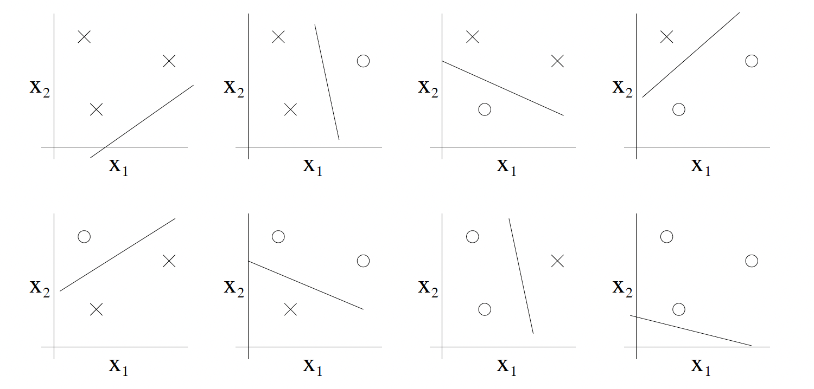
### 3 points in 2 dimension plane that not shatter with a straight line classifier
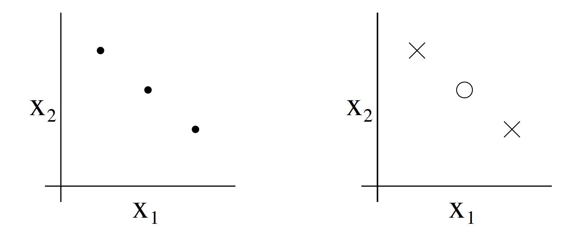

## Vapnik-Chervonenkis Dimension (VC Dimension)
VC Dimension is a measure of the size (capacity, complexity, expressive power, richness, or flexibility) of a class of sets.  
The notion can be extended to classes of binary functions and it is defined as the cardinality of the largest set of points that the algorithm can shatter, which means the algorithm can always learn a perfect classifier for any labeling of at least one configuration of those data points. 

### VC Dimension of a classification model
A binary classification model $f$ with some parameter vector $\theta$ is said to shatter a set of generally positioned data points $ (x_{1},x_{2},\ldots ,x_{n})$. If, for every assignment of labels to those points, there exists a $\theta$ such that the model $f$ makes no errors when evaluating that set of data points.  

The definition of VC Dimension does not say "if any" set of $n$ points can be shattered by the classifier, but "if there exists" a set of $n$ points that can be shattered by the classifier and there is no set of $n+1$ points that can be shattered by the classifier, then the VC dimension of the classifier is $n$.
So if a classifier's VC dimension is $3$, it does not have to shatter all possible arrangements of $3$ points.  
Therefore, if of all arrangements of $3$ points you can find at least one such arrangement that can be shattered by the classifier, and cannot find $4$ points that can be shattered, then VC dimension is $3$.
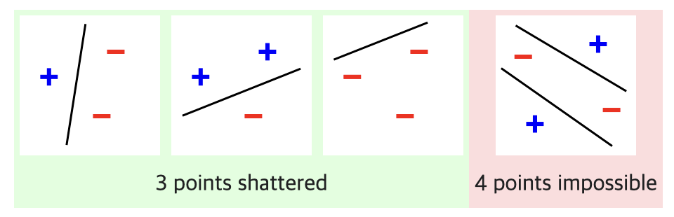

### In statistical learning theory
The VC dimension can predict a probabilistic upper bound on the test error of a classification model.  
It proved that the probability of the test error distancing from an upper bound (on data that is drawn i.i.d. from the same distribution as the training set) as below,
$$
\Pr\left(\text{test error} \leq \text{training error} + \sqrt{\frac{1}{N} \left[ D \left( \log\left(\frac{2N}{D}\right) + 1 \right) - \log\left(\frac{\eta}{4}\right) \right]} \right) = 1 - \delta,
$$
When $D$ is VC Dimension and $0 < \delta < 1$ and $N$ is the size of the training set. Therefore the VC Dimension provides both upper and lower bounds on the number of training examples required to achieve a given level of accuracy. 
## How Uniform Convergence, Union Bound and Hoeffding's inequality related in ERM
### Questions
The Question we want to solve is that.
 1. Can we make formal the bias and variance trade-off.
 2. Even though it's really generalization error that we care about, but most learning algorithms fit their models to the training set. Can we relate error on the training set to generalization error?
 3. Are there conditions under which we can actually prove that learning algorithms will work well?

### Lemmas
 1. Union Bound : The probability of any one of $k$ events happening is at most the sums of the probabilities of the $k$ different events.
 2. Hoeffding Inequality : If we take $\hat{\phi}$ — the average of $m$ Bernoulli($\phi$)random variables — to be our estimate of $\phi$, then the probability of our being far from the true value is small, so long as $m$ is large.

### Preliminaries
We are trying to answer questions using lemmas. Let's assume that
restrict our attention to binary classification in which the labels are $y \in \{0, 1\}$.

$$
S = \left\{ \left(x^{(i)}, y^{(i)}\right); i = 1, \ldots, m \right\}
$$

Given a training set $S$ of size $m$ , where the training examples $(x(i), y(i))$ are drawn iid from some probability distribution $D$. For a hypothesis $h$, we define the training error (also called the empirical risk or empirical error in learning theory) to be below..
$$
\hat{\varepsilon}(h) = \frac{1}{m} \sum_{i=1}^{m} \mathbb{1}\{h(x^{(i)}) \neq y^{(i)}\}.
$$
This is just the fraction of training examples that $h$ misclassifies.  

We also define the generalization error to be
$$
\varepsilon(h) = P_{(x,y) \sim \mathcal{D}}(h(x) \neq y).
$$
I.e. this is the probability that, if we now draw a new example $(x, y)$ from
the distribution $D$, $h$ will misclassify it.

Note that we have assumed that the training data was drawn from the same distribution $D$ with which we’re going to evaluate our hypotheses. This is sometimes also referred to as
one of the PAC assumptions.

Consider the setting of linear classification, and let hypothesis $h$ is $h_{\theta}(x) = \mathbb{1}\{\theta^\top x \geq 0\}$. One reasonable way of fitting the parameters is trying to minimize the training error as below.
$$
\hat{\theta} = \arg \min_{\theta} \hat{\varepsilon}(h_{\theta}).
$$
This process is Empirical Risk Minimization (ERM), and the resulting hypothesis output by the learning algorithm is $\hat{h} = h_{\hat{\theta}}$.  

When $H$ is called hypothesis classs and it is the set of
all classifiers. Empirical Risk Minimization can now be thought of as a minimization over the class of functions $H$. In other words the learning algorithm picks the hypothesis based on the fomular below.
$$
\hat{h} = \arg \min_{h \in \mathcal{H}} \hat{\varepsilon}(h).
$$

## ERM in Finite H
$H$ is just a set of $k$ functions mapping from $X$ to ${0, 1}$, and empirical risk minimization selects $hat{h} to be whichever of these $k$ functions has the smallest training error.  
 -  First, we will show that $\hat{\varepsilon}(h)$ (training error of a hypothesis) is a
reliable estimate of $\varepsilon(h)$(generalization error) for all $h$.
 - Second, we will show that this implies an
upper-bound on the generalization error of $\hat{h}$ (hypothesis from learning algorithm that minimize training error).

When $h_i \in \mathcal{H}$ and sample $(x, y) \sim \mathcal{D}$, let's set $Z = 1\{ h_i(x) \neq y \}$. We can also say that $Z_j = 1\{ h_i(x^{(j)}) \neq y^{(j)} \}$.  
Using above, we can see that  $\varepsilon(h)$ (generalization error = the misclassification probability on a randomly drawn example) is, 
$$
\varepsilon(h) = Z
$$
While  $\hat{\varepsilon}(h)$ (training error) is, 
$$
\hat{\epsilon}(h_i) = \frac{1}{m} \sum_{j=1}^m Z_j.
$$
Thus, $\hat{\epsilon}(h_i)$ is exactly the mean of the $m$ random variables $Z_j$ that are drawn iid from a Bernoulli distribution with mean $\varepsilon{(h_i)}$.  
If apply the Hoeffding inequality in average form, 
$$
\mathbb{P} \left( |\varepsilon(h_i) - \hat{\varepsilon}(h_i)| > \gamma \right) 
\leq 2 \exp(-2 \gamma^2 m).
$$

When $\varepsilon(h_i) = \mathbb{E}[S_n] / n$ and $\hat{\varepsilon}(h_i)= S_N/n$.  

This shows that, for our particular $h_i$, training error will be close to generalization error with high probability, assuming $m$ is large.

However, we don’t just want to guarantee that $\hat{\varepsilon}(h_i)$ will be close to $\varepsilon(h_i)$ with high
probability for just only one particular $h_i$. We want it true for all $h \in \mathcal{H}$.  
$$
\text{If } A_i = |\epsilon(h_i) - \hat{\epsilon}(h_i)| > \gamma, \\
P(A_i) \leq 2 \exp(-2\gamma^2 m).
$$
Using Union Bound, for all $A_i$, we can find out the probability of the empirical error deviates significantly from the true error for at least one hypothesis in the hypothesis class as below.
$$
P\left(\exists h \in \mathcal{H} : |\epsilon(h_i) - \hat{\epsilon}(h_i)| > \gamma \right) 
= P(A_1 \cup \cdots \cup A_k) \\
\leq \sum_{i=1}^k P(A_i) \\
\leq \sum_{i=1}^k 2 \exp(-2\gamma^2 m) \\
= 2k \exp(-2\gamma^2 m).
$$
If we subtract both sides from 1, we can find that,
$$
P\left(\neg \exists h \in \mathcal{H} : |\epsilon(h_i) - \hat{\epsilon}(h_i)| > \gamma \right) 
= P\left(\forall h \in \mathcal{H} : |\epsilon(h_i) - \hat{\epsilon} \\(h_i)| \leq \gamma \right) \\
\geq 1 - 2k \exp(-2\gamma^2 m).
$$
For all hypothesis $h$ in hypothesis classs $\mathcal{H}$, the probability of the absolute difference of errors does not exceed $\gamma$. In other word, with probability at least $1 - 2k \exp(-2\gamma^2 m)$, we have that $\epsilon(h)$ will be within $\gamma$
 of $\hat{\varepsilon}(h)$ for all $h \in \mathcal{H}$.  
This is called a uniform convergence result, because this is a bound that holds simultaneously for all $h \in \mathcal{H}$.

There are three quantities of interest here: $m$, $\gamma$, and the probability of error($1 - 2k \exp(-2\gamma^2 m$)). We can bound either one in terms of the other two.  
By setting
 $\delta= 2k\exp(−2\gamma^2m)$ and solving for $m$, 
$$
m \geq \frac{1}{2\gamma^2} \log \frac{2k}{\delta},
$$
Thus, if $m$ is large enough as above, we can guarantee that with probability at least $1 - \delta$, training error will be within $\gamma$ of generalization error. guarantee. This training set size $m$ that a certain method or algorithm requires in order to achieve a certain level of performance is also called the algorithm’s sample complexity.  
Similarly, hold $m$ and fixed $\delta$ and solve for $\gamma$, we can showthat with probability $1 − \gamma$ , we have that for all $h$,
$$
\left| \hat{\epsilon}(h) - \epsilon(h) \right| \leq \sqrt{\frac{1}{2m} \log \frac{2k}{\delta}}.
$$

Given $h^* = \arg\min_{h \in \mathcal{H}} \epsilon(h)$ and $h^*$ be the best possible hypothesis in $\mathcal{H}$,

$$
\begin{align*}
\epsilon(\hat{h}) &\leq \hat{\epsilon}(\hat{h}) + \gamma \quad \text{(1)} \\
&\leq \hat{\epsilon}(h^*) + \gamma  \quad \text{(2)} \\
&\leq \epsilon(h^*) + 2\gamma  \quad \text{(3)}
\end{align*}
$$
$\text{(1)}$ can be derived from uniform convergence assumption that $\hat{\epsilon}(\hat{h}) - \gamma \leq \epsilon(\hat{h}) \leq \hat{\epsilon}(\hat{h}) + \gamma$ from the fomular $|\epsilon(\hat{h}) - \hat{\epsilon}(\hat{h})| \leq \gamma$.  

$\text{(2)}$ $\hat{\epsilon}(\hat{h}) + \gamma, \leq \hat{\epsilon}(\hat{h}) \leq \hat{\epsilon}(h^*)$ can be derived from the fact that $\hat{\varepsilon}(\hat{h}) \leq \hat{\varepsilon}(h)$ for all $h \in \mathcal{H}$. So, $\hat{\varepsilon}(\hat{h}) \leq \hat{\varepsilon}(h^*)$ is true because $h^*$ is also one of $h \in \mathcal{H}$.

Again using uniform convergence assumption that used in $\text{(1)}$, $|\hat{\epsilon}(h^*) - \epsilon(h^*)| \leq \gamma \leq 2\gamma $.
In conclusion, if uniform convergence
occurs, then the generalization error of $\hat{h}$ ($\varepsilon(\hat{h})$)  is at most $2 \gamma$ worse than the generalization error of the best possible hypothesis($\varepsilon(h^*)$) in $\mathcal{H}$.  
In other word, if we have some
hypothesis class $\mathcal{H}$ and are considering switching to some much larger hypothesis class $\mathcal{H}' \subseteq \mathcal{H}$.  
If we switch to $\mathcal{H}'$, bias only can be decreased. This is because bias is generalization error of hypothesis considering below theorm with the probability of at least  $1-\gamma$ when $|\mathcal{H}| = k$ and $m$, $\delta$ are fixed.  
From the derivation that $\text{(3)} = \epsilon(h^*) + 2\gamma$, $\epsilon(h^*)$ can be interpreted as $\min_{h \in \mathcal{H}}$. Also, we have proven that $\gamma$ can be expressed as $\sqrt{\frac{1}{2m} \log \frac{2k}{\delta}}$. Therefore, 
$$
\varepsilon(\hat{h}) \leq \left( \min_{h \in \mathcal{H}} \varepsilon(h) \right) + 2 \sqrt{\frac{1}{2m} \log \frac{2k}{\delta}}.
$$
We can see that the term $\min_{h \in \mathcal{H}}$ can only be decreased when the size of hypothesis is increasing. Therefore learning using a larger hypothesis class, bias can only decrease. 


## ERM in Infinite H
But many hypothesis classes, including any parameterized by real numbers
(as in linear classification) actually contain an infinite number of functions. Can we prove similar results for this setting?  
Given a hypothesis class $\mathcal{H}$, using VC Dimension theorem, 
$$
|\epsilon(h) - \hat{\epsilon}(h)| \leq O\left(\sqrt{\frac{d}{m} \log\frac{m}{d} + \frac{1}{m} \log\frac{1}{\delta}}\right)
$$
With the probability of at least $1 - \delta$ when $d$ is VC Dimension and $m$ is the size of training set.  
Using the derivation used in finite H case, 
$$
\epsilon(\hat{h}) \leq \epsilon(h^*) + O\left(\sqrt{\frac{d}{m} \log\frac{m}{d} + \frac{1}{m} \log\frac{1}{\delta}}\right)
$$
In other words, if a hypothesis class $\mathcal{H}$ has finite VC Dimension, then uniform convergence occurs as $m$ becomes large. As before, this allows us to give a bound on $\epsilon(\hat{h})$ in terms of $\epsilon(h^*)$.  

Also VC Dimension also appears in sample-complexity bounds. A space of binary functions with VC dimension $D$ can be learned with $N$ samples as below.
$$
N=\Theta \left({\frac {D+\ln {1 \over \delta }}{\varepsilon ^{2}}}\right)
$$
While $\varepsilon$ is the learning error and $\delta$ is the failure probability. Thus, the sample-complexity is a linear function of the VC dimension of the hypothesis space.
In other words, the number of training examples needed to learn “well”
using $\mathcal{H}$ is linear in the VC dimension of $\mathcal{H}$ ($D$) 

## Sample Complexity
The sample complexity of a machine learning algorithm represents the number of training-samples that it needs in order to successfully learn a target function.  
More precisely, the sample complexity is the number of training-samples that we need to supply to the algorithm, so that the function returned by the algorithm is within an arbitrarily small error of the best possible function, with probability arbitrarily close to 1.  
In general, the strong sample complexity is infinite, i.e. that there is no algorithm that can learn the globally-optimal target function using a finite number of training samples.  
But If we are only interested in a particular class of target functions (e.g., only linear functions) then the sample complexity is finite, and it depends linearly on the VC dimension on the class of target functions.

## Hyperparameter Tunning in practice
### Choose Hyperparameters
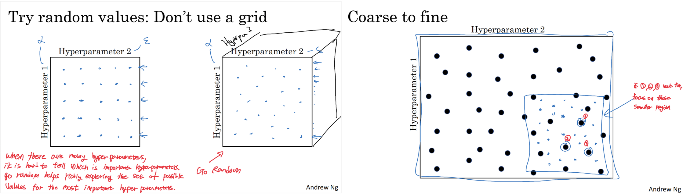
First way to sample hyprerparameter is to go random. When there are many hyperparameters, it is hared to tell which is important hyperparameter. So go random helps richly exploring the set of possible values for the most important hyperparameters.  
Second method is to try few sets of hyperparameters and if they are fine, choose set from the smaller region among those sets.

### Scale of Hyperparameters
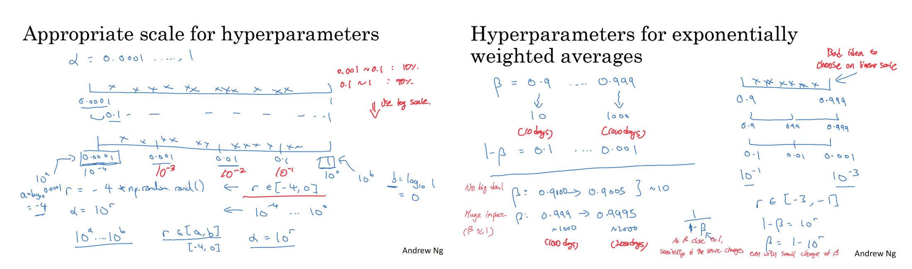
When choosing hyperparameters, it is bad idea to choose on linear scale. If you choose on linear scale, for example learning rate, you have 10% chance to choose from $0.001$ ~ $0.1$ and 90% chance to choose from $0.1% to $1$.  
Additionally, when choosing $\beta$ from exponentially weighted averages, as $\beta$ is close to $1$, sensitivity of the result changes even with the small change of $\beta$.

### Panda vs Caviar
 - Panda: Babysitting one model.
 - Caviar: Training many models in parallels.

## Batch Normalization (Normalizing Activation Functions)
Remind that normalization is as below.
$$
\mu \;=\; \frac{1}{m}\,\sum_{i=1}^{m} x^{(i)} \qquad
\tilde{X} \;=\; X - \mu \\[6pt]
\sigma^{2} \;=\; \frac{1}{m}\,\sum_{i=1}^{m} \bigl(\tilde{x}^{(i)}\bigr)^{2} \qquad
\hat{X} \;=\; \frac{\tilde{X}}{\sigma}
$$

Batcn Normalization is one kind of activation normalization that relies on batch statistics. Let's consider batch norm for a certain hidden layer $l$ of train sets from $1$ to $m$.
$$
\mu^{[l]}
\;=\;
\frac{1}{m}\,
\sum_{i=1}^{m} z^{[l](i)} \\[6pt]

\bigl(\sigma^{[l]}\bigr)^{2}
\;=\;
\frac{1}{m}\,
\sum_{i=1}^{m}
\Bigl(z^{[l](i)} - \mu^{[l]}\Bigr)^{2} \\[6pt]

\tilde z^{[l](i)}_{\text{norm}}
\;=\;
\frac{\;z^{[l](i)}-\mu^{[l]}\;}
     {\sqrt{(\sigma^{[l]})^{2}+\varepsilon}},
\qquad
\text{now mean $0$ and variance $1$}
$$
Now, you can use $\tilde z$ instead of $z$. If you want to set mean and variance different than ($0,1$), you can do as below.
$$
\tilde z^{[l](i)}
\;=\;
\gamma^{[l]}\,z^{[l](i)}_{\text{norm}} + \beta^{[l]}
$$
Note that $\tilde z^{[l](i)} = z^{[l](i)}$,  if,
$$
\gamma^{[l]} = \sqrt{(\sigma^{[l]})^{2} + \varepsilon},
\quad
\beta^{[l]}  = \mu^{[l]}
$$

In batch normalization, subtracting the batch mean removes any constant shift. So the entire constant shift—including bias vanishes.  
Since the batch-norm normalizes $z^{[l]}$ to mean $0$ and standard variance $1$ and then rescales by $\gamma^{[l]}$ and $\beta^{[l]}$, bias $b^{[l]}$ will be subtracted out.

### Why does Batch Normalization Works?
During Learning process, you might run on the shifting input distribution (Covariate Shift). So from $X$-$Y$ mapping, if the distribution of $X$ changes, you might need to retrain the learning algorithm.

The batch norm reduces the amount the distribution of these $a^{[l]}$'s (hidden layers) values shift occured. This is because 
batch norm assures that no matter how $z^{[l]}$'s changes, the mean and the variance will remain the same. Note that the $z^{[l]}$'s values change when the neural network updates parameters.  
Therefore, Batch Norm limits the amount that updating the parameters in an earlier layer can affect the current layer.
So you can think batch norm as weakening the coupling between what the earlier layers’ parameters do and what the later layers’ parameters do. And it leads to allow each layer to learn more independently and speeds up learning.

### Batch Norm as Regularization
Each mini-batch is scaled by the mean/variance computed
on just that mini-batch. This adds some noise to the value within that minibatch because those mean and variance are not from entire datasets. So similar to dropout, it adds some noise to each hidden layer’s activations. This has a slight regularization effect.


## The Problem of Local Optima
