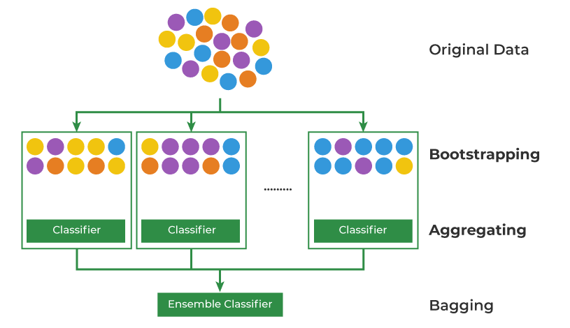
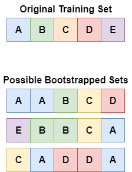
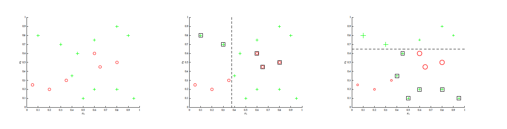
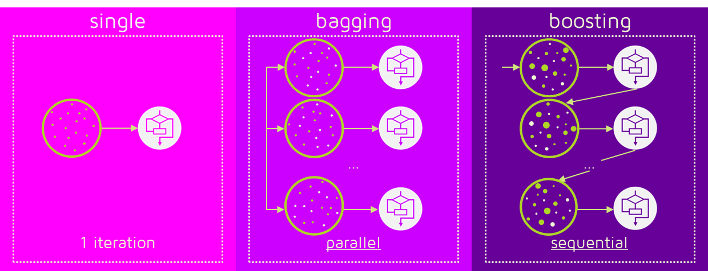

# Deision Tree and Ensemble
## Preliminaries
### Mean (Expected Value)
#### Mean of Vector
The expected value of a random vector is also a vector. If you have a vector and its expected value is defined component-wise as below.
$$
\mathbb{E}[\mathbf{z}] = \begin{bmatrix}
\mathbb{E}[z_1] \\
\mathbb{E}[z_2] \\
\vdots \\
\mathbb{E}[z_n]
\end{bmatrix}
$$
Each component $\mathbb{E}[z_i]$ is a scalar, but the result of stacking them into a column vector makes the overall expected value a vector of the same dimension as $z$.

#### Linearity of Expectation of Mean
The linearity of expectation means is below.
$$
E[aX+bY]=aE[X]+bE[Y]
$$
Where $a$ and $b$ are constants (scalars, vectors, or matrices).
$X$ and $Y$ are random variables.

In this context, even if $a$ or $b$ is a matrix, the rule still applies, as long as the matrix is deterministic (fixed and not random). The key requirement for applying this property is that the matrix does not depend on the random variable.

#### Non-Multiplicativity of Mean
In general, the expected value is not multiplicative aas $\operatorname {E} [XY]$  is not necessarily equal to $\operatorname {E} [X]\cdot \operatorname {E} [Y]$.  
If $X$ and $Y$ are independent, then one can show that 
$\operatorname {E} [XY]=\operatorname {E} [X]\operatorname {E} [Y]$.  
If the random variables are dependent, then generally $\operatorname {E} [XY]\neq \operatorname {E} [X]\operatorname {E} [Y]$ although in special cases of dependency the equality may hold.

### Covariance
Covariance is a measure of the joint variability of two random variables. It is the sign of the covariance, therefore, shows the tendency in the linear relationship between the variables.  
For example, if the covariance is positive, greater values of one variable mainly correspond with greater values of the other variable, and the same holds for lesser values (that is, the variables tend to show similar behavior).  
If the covarinace is negative, the greater values of one variable mainly correspond to lesser values of the other (that is, the variables tend to show opposite behavior)
$$
\text{cov}(X, Y) = \mathbb{E}[(X - \mathbb{E}[X])(Y - \mathbb{E}[Y])]
$$
Also, it can be wrtitten as,
$$
\text{cov}(X, Y) = \mathbb{E}[(X - \mathbb{E}[X])(Y - \mathbb{E}[Y])] \\
= \mathbb{E}[XY - X\mathbb{E}[Y] - \mathbb{E}[X]Y + \mathbb{E}[X]\mathbb{E}[Y]] \\
= \mathbb{E}[XY] - \mathbb{E}[X]\mathbb{E}[Y] - \mathbb{E}[X]\mathbb{E}[Y] + \mathbb{E}[X]\mathbb{E}[Y] \\
= \mathbb{E}[XY] - \mathbb{E}[X]\mathbb{E}[Y]
$$

#### Covariance Matrix
A covariance matrix is a square matrix giving the covariance between each pair of elements of a given random vector.  
Given Vector $\mathbf{X}$, all entries are random variables, each with finite variance and expected value.
$$

\mathbf{X} = (X_1, X_2, \ldots, X_n)^\top
$$
Then the covariance matrix $\mathbf{K}_{X_i X_j}$ is the matrix whose 
$(i,j)$ entry is the covariance.
$$
\mathbf{K}_{X_i X_j} = \text{cov}[X_i, X_j] = \mathbb{E}[(X_i - \mathbb{E}[X_i])(X_j - \mathbb{E}[X_j])]
$$
Any covariance matrix is symmetric and positive semi-definite and its main diagonal contains variances. (i.e., the covariance of each element with itself).

### Variance
Variance is the expected value of the squared deviation from the mean of a random variable.
$$
\text{Var}(X) = \mathbb{E}[(X - \mu)^2].
$$
### Relationship Between Variance and Covariance
$$
\text{Cov}(X_i, X_i) = \text{Var}(X_i).
$$
Using the fact above, the sum of variance can be written as
$$
\text{Var}\left(\sum_{i=1}^n X_i\right) = \sum_{i=1}^n \sum_{j=1}^n \text{Cov}(X_i, X_j) = \\ 
\sum_{i=1}^n \text{Var}(X_i) + 2 \sum_{1 \leq i < j \leq n} \text{Cov}(X_i, X_j) = \\
\sum_{i=1}^n \text{Var}(X_i) + \sum_{i \neq j} \text{Cov}(X_i, X_j)
$$

#### Applying to Vector
If $X$ is not a single variable but random vector, $Var(X)$ is redefined as the variance of the entire random vector $X$.
$$ 
Var(X)=E[(X−E[X])(X−E[X])
$$ 
And this is exactly the same as the covariance matrix.
$$
Var(X)=Cov(X)
$$

### Correlation
In statistics, correlation or dependence is any statistical relationship, whether causal or not, between two random variables or bivariate data.  
Although in the broadest sense, "correlation" may indicate any type of association, in statistics it usually refers to the degree to which a pair of variables are linearly related.

### Correlation Coefficient
A correlation coefficient is a numerical measure of some type of linear correlation, meaning a statistical relationship between two variables.  
The variables may be two columns of a given data set of observations, often called a sample, or two components of a multivariate random variable with a known distribution.

There are several different measures for the degree of correlation in data, depending on the kind of data(Whether the data is a measurement, ordinal, or categorical). For example, Pearson, Intra-class, Rank and so on.

    
### Pearson Correlation Coefficient
The Pearson Correlation Coefficient is a correlation coefficient that measures linear correlation between two sets of data.  
It is the ratio between the covariance of two variables and the product of their standard deviations.
$$
\rho_{X,Y} = \frac{\text{cov}(X, Y)}{\sigma_X \sigma_Y}
$$
Where "cov" is covariance and $\sigma_X$ and $\sigma_Y$ are the standard deviation of $X$ and $Y$. This fomular can also be written as below,
$$
\rho_{X,Y} = \frac{\mathbb{E}[(X - \mu_X)(Y - \mu_Y)]}{\sigma_X \sigma_Y} \\
$$
Where $\mu_X$ and $\mu_Y$ are the mean of $X$ and $Y$.
Above is also can be written as,
$$
\rho_{X, Y} = \frac{\mathbb{E}[XY] - \mathbb{E}[X]\mathbb{E}[Y]}{\sqrt{\mathbb{E}[X^2] - (\mathbb{E}[X])^2} \sqrt{\mathbb{E}[Y^2] - (\mathbb{E}[Y])^2}}.
$$
It is because, 
$$
\mathbb{E}[(X - \mu_X)(Y - \mu_Y)] = \mathbb{E}[XY] - \mathbb{E}[X\mu_Y] - \mathbb{E}[\mu_X Y] + \mathbb{E}[\mu_X \mu_Y].
$$
While $ \mathbb{E}[X\mu_Y] =  \mathbb{E}[X\mu_Y]  = \mathbb{E}[\mu_X \mu_Y]$.

### Covariance and Correlation
In probability theory and statistics, the mathematical concepts of covariance and correlation are very similar. Since both describe the degree to which two random variables or sets of random variables tend to deviate from their expected values in similar ways.

$$
\textbf{covariance} \\
\text{cov}_{XY} = \sigma_{XY} = \mathbb{E}[(X - \mu_X)(Y - \mu_Y)] \\

\textbf{correlation} \\
\text{corr}_{XY} = \rho_{XY} = \mathbb{E}[(X - \mu_X)(Y - \mu_Y)] / (\sigma_X \sigma_Y), \\

\text{so that} \\

\rho_{XY} = \sigma_{XY} / (\sigma_X \sigma_Y)
$$

## Decision Tree
## Ensemble
Ensemble means ‘a collection of things’ and in Machine Learning terminology, Ensemble learning refers to the approach of combining multiple ML models to produce a more accurate and robust prediction compared to any individual model.  
The idea is to train a diverse set of weak models on the same modelling task, such that the outputs of each weak learner have poor predictive ability (i.e., high bias), and among all weak learners, the outcome and error values exhibit high variance.  
The set of weak models — which would not produce satisfactory predictive results individually — are combined or averaged to produce a single, high performing, accurate, and low-variance model to fit the task as required.  
The Ensemble learning typically refers to bagging (bootstrap aggregating), boosting or stacking/blending techniques to induce high variance among the base models. We will look over only bagging and boosting.

### Basic Probability Theory in Ensemble
Since $\text{Var}(X_i) = \sigma^2$ and $\text{Var}(aX) = a^2 \text{Var}(X)$, variance of mean of $X$($\bar{X})$ is,
$$
\text{Var}(\bar{X}) = \text{Var}\left(\frac{1}{n} \sum_i X_i \right) = \frac{\sigma^2}{n}
$$
When variables are only identically distributed, using above derivation we can find out that,
$$
\text{Var}(\bar{X}) = \text{Var}\left(\frac{1}{n} \sum_i X_i \right) \text{(1)} \\
= \frac{1}{n^2} \sum_{i,j} \text{Cov}(X_i, X_j) \text{(2)} \\
= \frac{n\sigma^2}{n^2} + \frac{n(n-1)\rho\sigma^2}{n^2} \text{(3)} \\
= \rho\sigma^2 + \frac{1-\rho}{n} \sigma^2 \text{(4)}
$$
(2) and (3) is derived from the relationship between variance and covariance, which is,
$$
\text{Var}\left(\sum_{i=1}^n X_i\right) = \sum_{i=1}^n \sum_{j=1}^n \text{Cov}(X_i, X_j)
 = \sum_{i=1}^n \text{Var}(X_i) + \sum_{i \neq j} \text{Cov}(X_i, X_j)
$$
Also in (3), we know that varinace of the mean is $\frac{\sigma^2}{n}$ and any sets of $X_i$ and $X_j$  are correlated by a factor $\rho$ when $i \neq j$.  
Therefore below can be derived as shown in (3).
$$
\text{Since } \text{Var}(X_i)= \sigma^2, \\ 
\sum_{i=1}^n \text{Var}(X_i) = n \sigma^2
$$
$$
\sum_{i \neq j} \text{Cov}(X_i, X_j) = (n^2-n)\rho\sigma^2
$$
Multiplying two with $\frac{1}{n^2}$ and combined together, we can understsand (4).

### Bagging (Bootstrapped Aggregation)

 - Bootstrap Sampling: Divides the original training data into ‘N’ subsets and randomly selects a subset with replacement in some rows from other subsets.
 - Base Model Training: For each bootstrapped sample, train a base model independently on that subset of data. These weak models are trained in parallel to increase computational efficiency and reduce time consumption.
 - Prediction Aggregation: To make a prediction on testing data combine the predictions of all base models. For classification tasks, it can include majority voting or weighted majority while for regression, it involves averaging the predictions.
 - Out-of-Bag (OOB) Evaluation: Some samples are excluded from the training subset of particular base models during the bootstrapping method. These “out-of-bag” samples can be used to estimate the model’s performance without the need for cross-validation.
 - Final Prediction: After aggregating the predictions from all the base models, Bagging produces a final prediction for each instance.
#### Bootstrap
Bootstrap aggregation (bagging) involves training an ensemble on bootstrapped data sets. A bootstrapped set is created by selecting from original training data set with replacement.  
Thus, a bootstrap set may contain a given example zero, one, or multiple times. Ensemble members can also have limits on the features (e.g., nodes of a decision tree), to encourage exploring of diverse features.  
  
Mathmatically, if true population is $P$, training set $S$ is sampled from $P$($S \sim P$).  Since in real scenario, true population is unknown, we make assumption that $S=P$ and sample bootstrap set $Z$ from $S$($Z \sim S$).  
By generating multiple samples $\{Z_1, Z_2, Z_3, \cdots Z_M\}$ from $S$, we can then look at the variability of our estimate across these bootstrap sets and this promotes diversity in the ensemble, and can strengthen the ensemble.

#### Aggregating
Now, returning to ensembling, we can take each $Z_m$ and train a machine
learning model $G_m$ on each, and define a new aggregate predictor:
$$
G(X) = \sum_m \frac{G_m(x)}{M}
$$
Remind previous equation (eq4) from ensemble, we can see that increasing bootstrap sample $M$ leads to decrease in variance, since $\rho$ and $M$ is insensitive to each other.
$$
\rho\sigma^2 + \frac{1-\rho}{M} \sigma^2 
$$
However, the bias of each individual predictor($G_M$) increases due to each bootstrap set not having the full training set available. 

#### Out of Bags Estimation
To reduce overfitting, a member can be validated using the out-of-bag set (the examples that are not in its bootstrap set). These “out-of-bag” samples can be used to estimate the model’s performance without the need for cross-validation.

#### Random Forests
The random forests applies the general technique of bootstrap aggregating, or bagging, to tree learners. Given a training set $X = x_1, \cdots x_n$ with responses $Y = y_1, \cdots y_n$, bagging repeatedly (B times) selects a random sample with replacement of the training set and fits trees to these samples.  
Below are the way Random Forests train:  
For $b = 1, \cdots, M$, 
- sample, with replacement, $n$ training examples from $X, Y$ and  call these $X_b, Y_b$.
- train a classification or regression tree $f_b$ on $X_b, Y_b$.

After training, predictions for unseen samples $x'$ can be made by averaging the predictions from all the individual regression trees on $x'$:  
$$
\hat{f} = \frac{1}{N} \sum_{b=1}^{M} f_b(x').
$$
Random forests also include another type of bagging scheme: they use a modified tree learning algorithm that selects, at each candidate split in the learning process, a random subset of the features. This process is sometimes called "feature bagging".  
The reason for doing this is the correlation of the trees in an ordinary bootstrap sample: if one or a few features are very strong predictors for the response variable (target output), these features will be selected in many of the B trees, causing them to become correlated. 

### Boosting
Boosting attempts to build a strong classifier from the number of weak classifiers. It is done by building a model by using weak models in series.  
Firstly, a model is built from the training data. Then the second model is built which tries to correct the errors present in the first model. This procedure is continued and models are added until either the complete training data set is predicted correctly or the maximum number of models are added. 
So Boosting training successive models by emphasizing training data misclassified by previously learned models. Initially, all data (D1) has equal weight and is used to learn a base model M1. The examples mis-classified by M1 are assigned a weight greater than correctly classified examples. This boosted data (D2) is used to train a second base model M2, and so on. 

While Bagging is a variance-reducing technique, boosting is used for bias-reduction. We therefore want high bias, low variance models, also known as weak learners. In Decision Trees, only make one
decision before making a prediction; these are known as decision stumps.

#### Adaboost
At first, $w_i = \frac{1}{N}$ for $i = 1, \cdots N$.  
For $m = 0 \text{ to } M$,  do
 1. Fit weak classifier $G_m$ to training data weighted by $w_i$  
 (a weight $w_i$ is assigned to each sample in the training set)
 2. Compute weighted error, $\text{err}_m = \frac{\sum_i w_i \mathbb{1}(y_i \neq G_m(x_i))}{\sum_i w_i}$.  
 3. Compute weight $\alpha_m = \log\left(\frac{1 - \text{err}_m}{\text{err}_m}\right)$.
 4. adjust weight of the example, $w_i \leftarrow w_i \cdot \exp\left(\alpha_m \mathbb{1}(y_i \neq G_m(x_i))\right)$.

After fitting, $f(x) = \text{sign}\left(\sum_m \alpha_m G_m(x)\right)$

As you can see, the weightings for each example begin out even, with misclassi ed examples being further up-weighted at each step, in a cumulative fashion.  
The final aggregate classifier is a summation of all the weak learners, weighted by the negative log-odds of the weighted error.  

Also, each new weak learner is no longer independent of the previous models in the sequence, meaning that increasing $M$ leads to an increase in the risk of overfitting.

#### XGboost
https://en.wikipedia.org/wiki/XGBoost

#### Gradient Boosting Machine (GBM)
https://en.wikipedia.org/wiki/Gradient_boosting

#### Generalized Additive Model
Many classification and regression models can be written as a linear combination of some simpler models (as below), 
$$
f(x) = \sum_{m=1}^{M} \beta_m b_m(x; \gamma_m)
$$
Where, 
- $x$ is input data
- $\{\beta_m, \gamma_m\}$ are model parameters
- $b_m(x; \gamma_m)$ are any arbitrary function of $x$.  

Typically, $\{\beta_m, \gamma_m\}$ are estimated by minimizing some loss function $L$, which measures the prediction errors over training data $\{x_n, y_n\}$ as below.  
$$
\langle \beta_m^*, \gamma_m^* \rangle_{1}^{M} = \arg\min_{\{\beta_m, \gamma_m\}_{1}^{M}} \sum_{i=1}^{N} L\left(y_i, \sum_{m=1}^{M} \beta_m b_m(x_i; \gamma_m)\right)
$$

#### Forward Stagewise Additive Modeling
Optimizing loss function as above is often difficult.  
However, if optimizing over one single base function can be done efficiently, a simple greedy search method can be used. 
$$
\min_{\beta, \gamma} \sum_{i=1}^{N} L\left(y_i, \beta b_m(x_i; \gamma)\right)
$$
The basic idea is, sequentially adding new base functions to the expansion function f(x) without changing the parameters that have been added.   

For example, in the $i$-th stage, a new function $b_i(x;γ_i)$ is added to the expansion $f_{i−1}(x)$. The new coefficients $\beta_i, \gamma_i$ are fitted by minimizing the error between $\beta_i b_i (x; \gamma_i)$ and the residue $y − f_{i−1}(x)$; then $f(x)$ is updated by $f_i(x) = f_{i−1}(x) + \beta_i^* b_i(x; \gamma_i^*)$.  
(minimize $y − f_{i−1}(x) - \beta_i b_i (x; \gamma_i)$ is same as $y - f_i(x)$ )  
Adaboost is a special case of this formulation.

#### Gradient Boosting
It is also one of specific case of Forward Stagewise Additive Modeling that its target is pseudo-residuals instead of residuals as in traditional boosting.  

When there is a training set $\{(x_{i},y_{i})\}_{i=1}^{n}$, aa differentiable loss function $L(y,F(x))$ and $M$ is stands for number of iteration.

After initializaing, $F_0(x) = \arg\min_{\gamma} \sum_{i=1}^n L(y_i, \gamma)$,   

For $m = 1 \text{ to } M$:
 1. Compute so-called pseudo-residuals by computing gradient.  
 $r_{im} = - \left[ \frac{\partial L(y_i, F(x_i))}{\partial F(x_i)} \right]_{F(x) = F_{m-1}(x)} \quad \text{for } i = 1, \ldots, n$.

 2. Train it using the training set $\{(x_{i},y_{i})\}_{i=1}^{n}$(=Fit a base learner).

 3. Compute multiplier $\gamma _{m}$ by solving the optimization problem.  
 $\gamma_m = \arg\min_{\gamma} \sum_{i=1}^{n} L\left(y_i, F_{m-1}(x_i) + \gamma h_m(x_i)\right)$

 4. Update the model using the multiplier $\gamma_{m}$.  
 $F_m(x) = F_{m-1}(x) + \gamma_m h_m(x)$

After fitting, the output model is $F_m(x)s$. 

#### Bagging vs Boosting

배깅은 병렬로 학습하는 반면, 부스팅은 순차적으로 학습합니다. 한번 학습이 끝난 후 결과에 따라 가중치를 부여합니다. 그렇게 부여된 가중치가 다음 모델의 결과 예측에 영향을 줍니다.

오답에 대해서는 높은 가중치를 부여하고, 정답에 대해서는 낮은 가중치를 부여합니다. 따라서 오답을 정답으로 맞추기 위해 오답에 더 집중할 수 있게 되는 것입니다. 

부스팅은 배깅에 비해 error가 적습니다. 즉, 성능이 좋습니다. 하지만 속도가 느리고 오버 피팅이 될 가능성이 있습니다
