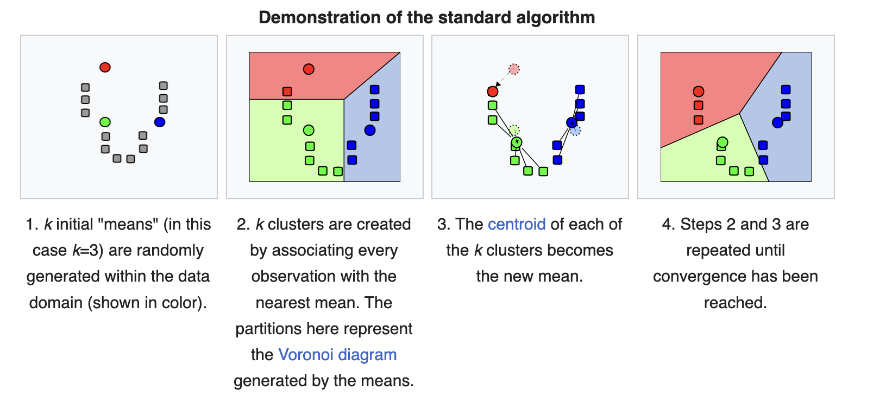

# EM Algorithm
## Preliminaries
### Jensen's Inequality

Jensen's inequality generalizes the statement that the secant line(a line that intersects a curve at a minimum of two distinct points) of a convex function lies above the graph of the function. In the context of probability theory, it is generally stated in the following form:  
If $X$ is a random variable and $\varphi$ is a convex function, then
$$
\varphi(\mathbb{E}[X]) \leq \mathbb{E}[\varphi(X)]
$$
If $\varphi$ is concave function, then
$$
\varphi(\mathbb{E}[X]) \geq \mathbb{E}[\varphi(X)]
$$
The difference between the two sides of the inequality is called the Jensen gap.
$$
\varphi(\mathbb{E}[X]) - \mathbb{E}[\varphi(X)]
$$
Moreover, if function $\varphi$ is strictly convex(or concave), 
$$
\varphi(\mathbb{E}[X]) = \mathbb{E}[\varphi(X)]
$$
Above is true if and only if $X=E[X]$ with probability 1.  (i.e., if $X$ is a constant)

### Log Sum Inequality
https://en.wikipedia.org/wiki/Log_sum_inequality

#### Kullback–Leibler Divergence (KL-Divergence)
The Kullback–Leibler (KL) divergence is a type of statistical distance measure of how much a model probability distribution $Q$ is different from a true probability distribution $P$.  
Mathematically, it is defined as
$$
{\displaystyle D_{\text{KL}}(P\parallel Q)=\sum _{x\in {\mathcal {X}}}P(x)\ \log \left({\frac {\ P(x)\ }{Q(x)}}\right).}
$$

A simple interpretation of the KL Divergence of $P$ from $Q$ is the expected excess surprise from using $Q$ as a model instead of $P$ when the actual distribution is $P$.  
While it is a measure of how different two distributions are and is thus a "distance" in some sense, it is not actually a metric(a set together with a notion of distance between its elements, usually called points. ), which is the most familiar and formal type of distance.  
Instead, it is a type of divergence, a generalization of squared distance, and for certain classes of distributions (notably an exponential family), it satisfies a generalized Pythagorean theorem (which applies to squared distances).

##### Property of KL-Divergence

 - reference1: https://homes.cs.washington.edu/~anuprao/pubs/CSE533Autumn2010/lecture3.pdf

### Score Function
Score Functiont is the gradient of the log-likelihood function with respect to the parameter vector.  
It indicates the steepness(gradient) of the log-likelihood function and thereby the sensitivity to infinitesimal(극소) changes to the parameter values.  
If the log-likelihood function is continuous over the parameter space, the score will vanish at a local maximum or minimum.  

The score is the gradient (the vector of partial derivatives) of $\log {\mathcal {L}}(\theta ;x)$, the natural logarithm of the likelihood function, with respect to an $m$-dimensional parameter vector $\theta$ is,
$$
s(\theta ;x)\equiv {\frac {\partial \log {\mathcal {L}}(\theta ;x)}{\partial \theta }}
$$

### Fisher Information
Fisher Information is is the variance of the score, or the expected value of the observed information.

#### Definition
Formally, the partial derivative with respect to $\theta$ of the natural logarithm of the likelihood function is called the score. Under certain regularity conditions, if $X$ is actually distributed as $f(X;\theta )$, it can be shown that the expected value of the score, evaluated at $\theta$ is $0$

$$
{\displaystyle {\begin{aligned}\operatorname {E} \left[\left.{\frac {\partial }{\partial \theta }}\log f(X;\theta )\,\,\right|\,\,\theta \right]={}&\int _{\mathbb {R} }{\frac {{\frac {\partial }{\partial \theta }}f(x;\theta )}{f(x;\theta )}}f(x;\theta )\,dx\\[6pt]={}&{\frac {\partial }{\partial \theta }}\int _{\mathbb {R} }f(x;\theta )\,dx\\[6pt]={}&{\frac {\partial }{\partial \theta }}1\\[6pt]={}&0.\end{aligned}}}
$$

Using the fact that expected value of score is $0$, we derive Fisher Information as bellow.
$$
{\displaystyle {\mathcal {I}}(\theta )=\operatorname {E} \left[\left.\left({\frac {\partial }{\partial \theta }}\log f(X;\theta )\right)^{2}\,\,\right|\,\,\theta \right]=\int _{\mathbb {R} }\left({\frac {\partial }{\partial \theta }}\log f(x;\theta )\right)^{2}f(x;\theta )\,dx,}
$$

Note that, 
$$
\mathrm{Cov}[X]
\;=\;
\mathbb{E}\!\Bigl[(X - \mathbb{E}[X])\,(X - \mathbb{E}[X])^{T}\Bigr]
\;=\;
\mathbb{E}[\,X\,X^{T}\,]\;\;
\text{when}\;\mathbb{E}[X] = 0.
$$

#### Observed (Fihser) Information
Observed (Fisher) Information is the negative of the second derivative (the Hessian matrix) of the "log-likelihood" (the logarithm of the likelihood function). It is a sample-based version of the Fisher information.

? need to show the relation with fisher information in formula

### Natural Gradient
In the usual gradient descent, we fist choose the direction by calculating the gradient of the MLE objective w.r.t the parameters, and then move a magnitude of step size along that direction.  
Whereas in natural gradient, we first choose a divergence amount by which we would like to move, in the $D_{\text{KL}}$ sense. This gives us a perimeter(둘레) around the current parameters.  
These points of the perimeter along this perimeter correspond to distributions which are at an equal $D_{\text{KL}}$-distance away from the current parameter. 
These points of the perimeter along this perimeter correspond to distributions which are at an equal $D_{\text{KL}}$-distance away from the current parameter.  
Then among the set of all distributions along this perimeter, we move to the distribution that maximizes the objective (i.e minimize $D_{\text{KL}}$ between data and itself) the most. So, we always descend down the same sequence of distributions towards the optimum.

## K-means Clustering
K-means clustering is a method that aims to partition $n$ observations into $k$ clusters in which each observation belongs to the cluster with the nearest mean (cluster centers or cluster centroid), serving as a prototype of the cluster.

Given a training set $\{ x^{(1)}, \ldots, x^{(m)} \}$ and no labels $y^{(i)}$, 

1. Initialize cluster centroids $\mu_1, \mu_2, \ldots, \mu_k \in \mathbb{R}^n$ randomly.

2. Repeat until convergence.  

For every $i$,
$$
c^{(i)} := \arg\min_j \|x^{(i)} - \mu_j\|^2.
$$
For each $j$,
$$
\mu_j := \frac{\sum_{i=1}^m 1\{c^{(i)} = j\} x^{(i)}}{\sum_{i=1}^m 1\{c^{(i)} = j\}}.
$$
Where , $k$ (a parameter of the algorithm) is the number of clusters we want to find, and the cluster centroids $\mu_j$ represent our current guesses for the positions of the centers of the clusters.

Let's see more Mathmatically. Partition the $m$ observations into $k (k \leq m)$ sets $S = \{S_1, S_2, \cdots, S_k\}$ so as to minimize the within-cluster sum of squares (WCSS) (i.e. variance).  
The objective of K-means algorithm can be described as below.
$$
\arg\min_{\mathcal{S}} \sum_{j=1}^k \sum_{\mathbf{x} \in S_j} \|\mathbf{x} - \mu_j\|^2 = \arg\min_{\mathcal{S}} \sum_{j=1}^k |S_j| \operatorname{Var}(S_j)
$$
Where mean(cluster centroid) of points in $S_i$ is, 
$$
\mu_j = \frac{1}{|S_j|} \sum_{\mathbf{x} \in S_j} \mathbf{x},
$$
and $|S_i|$ indcates the number of elements in $S_i$

This objective can be achieved using following steps. First, assign each observation to the cluster with the nearest mean(using the least squared Euclidean distance). 
$$
S_i^{(t)} = \left\{ x_p : \| x_p - m_i^{(t)} \|^2 \leq \| x_p - m_j^{(t)} \|^2 \; \forall j, \; 1 \leq j \leq k \right\}
$$
Where $x_{p}$ is assigned to exactly one $S^{(t)}$. Next, Recalculate means(centroids) for observations assigned to each cluster.
(note that $(t)$ is the iteration number or time step in the algorithm.)
$$
m_i^{(t+1)} = \frac{1}{|S_i^{(t)}|} \sum_{x_j \in S_i^{(t)}} x_j
$$

### Is the k-means algorithm guaranteed to converge?
#### Distortion Function

## Density Estimation
Density Estimation is the construction of an estimate of an unobservable underlying probability density function, based on observed data. A very natural use of density estimates is in the informal investigation of the properties of a given set of data.  
Therefore Density estimation is also frequently used in anomaly detection or novelty detection. If an observation lies in a very low-density region, it is likely to be an anomaly or a novelty.  
We can also assume that the observed data points of Density Estimation are distributed from multiple mixture of Gaussian distributions.

### Problem of Density Estimation
However the problem of Density Estimation is that you can only see the data came from set of Gaussains, but you don't know which example came from which Gaussian.  
Therefore Expectation-Maximization algorithm will allow us to fit the model despite not knowing which Gaussian each example that came from.

## Mixture of Gaussians
When Mixture of Gaussian is a function that is composed of $k$ number of gaussian, each Gaussian is comprised of 3 parameters.
 - mean $\mu$ that defines its center.
 - covariance $\Sigma$ that defines its width. This would be equivalent to the dimensions of an ellipsoid in a multivariate scenario.
 - mixing probability $\phi$ represents the weights of each Gaussian component in the mixture of Gaussians.
It is a method used to determine the probability each data point belongs to a given cluster.

In MoG Model, each $x^{(i)}$ from training set was generated by randomly choosing $z^{(i)}$($\{1, \cdots, k\}$), and then $x^{(i)}$ was drawn from one of $k$ Gaussians depending on $z^{(i)}$. When $z^{(i)}$'s are latent random variables, meaning that they’re hidden/unobserved.
$$
\sum_{i=1}^{m} p(x^{(i)}; \phi, \mu, \Sigma) = \sum_{i=1}^{m} \sum_{z^{(i)}=1}^{k} p(x^{(i)} \mid z^{(i)}; \mu, \Sigma) p(z^{(i)}; \phi)
$$

 - $ p(x^{(i)}, z^{(i)}) = p(x^{(i)} \mid z^{(i)})p(z^{(i)})$ 
   - indicates the probability of observing $x^{(i)}$ along with its corresponding latent variable $z^{(i)}$, and applying Bayes' rule.  
 - $\phi_j = p(z^{(i)} = j)$
   - indicates that $\phi_j$ is the probability that the $z^{(i)}$ belongs to the $j$-th cluster.
 - $z^{(i)} \sim \text{Multinomial}(\phi), \quad (\phi_j \geq 0, \quad \sum_{j=1}^{k} \phi_j = 1)$
   - indicates that latent variable $z^{(i)}$, which represents the cluster assignment for $x^{(i)}$ is drawn from a multinomial distribution. In other words, $z^{(i)}$ is drawn from the multinomial distribution with probabilities $\phi$.  
   - For example, when $k=3$ and $\phi = (0.2,0.5,0.3)$, $P(z^{(i)} = 1) = 0.2, \quad P(z^{(i)} = 2) = 0.5, \quad P(z^{(i)} = 3) = 0.3.$
 - $x^{(i)} \mid z^{(i)} = j \sim \mathcal{N}(\mu_j, \Sigma_j)$
   - indicates that data point $x^{(i)}$ is generated by sampling from the Gaussian distribution with mean $\mu_j$ and covariance $\Sigma_j$ but only if the latent variable $z^{(i)}$ assigns it to cluster $j$.

### Multivariate Gaussian, Mixture of Gaussian and Gaussian Discriminant Analysis(GDA)
#### GDA vs Mixture of Gaussian
 - In GDA, we have labled examples $(x_i, y_i)$ when $y_i$ is obseved. In Mixture of Gaussian, $y_i$ is replaced with $z_i$ which is latent(=hidden) random variable that we can not observer in the training set.
 - Mixture of Gaussian set $z(y)$ to one of $k$ values instead of two in GDA. In GDA, $y(z)$ takes on one of two values. 
 - Mixture of Gaussian use $\Sigma_{j}$ instead of $\Sigma$ in GDA, which means each Gaussian model in Mixture of Gaussian uses its own covariance matrix.

#### Multivariate Gaussian vs Mixture of Gaussian
While $k$ dimensional Multivariate Gaussian is, 
$$
\mathbf{X} = \begin{pmatrix} x_1, \dots, x_k \end{pmatrix} \sim \text{N}(\boldsymbol{\mu}, \boldsymbol{\Sigma}),
$$
Where $\mu = \{\mu_1, \mu_2, \cdots, \mu_k \}$ is the mean vector, and $\Sigma$ is the positive definite $k \times k$ covariance matrix.

However, we can write out a $k$ component mixture of (1 dimensional) Gaussians as, 
$$
\mathbf{X} \sim \sum_{i=1}^{k} \pi_i \, \text{N}(\mu_i, \Sigma_i),
$$
where $\pi_i$ is the mixing proportion of the $i$-th component and $(\mu_i, \Sigma_i)$ are the parameters of the $i$-th component.  
As above, the Multivariate Gaussian is defined as a $k$ dimensional random vector, and the Mixture of Gaussians is defined as a random variable (which you can call a $1$ dimensional random vector).  

In conclusion, 
 - A Multivariate Gaussian Distribution describes a single, unified probability density over a vector of random variables, capturing the relationships (covariances) between them.  
 - A Mixture of Gaussians is a probabilistic model that represents a weighted sum of multiple Gaussian distributions. It is designed to model data that comes from several distinct subpopulations, each of which follows its own Gaussian distribution.

## Expectation–Maximization Algorithm (EM Algorithm)
An expectation–maximization (EM) algorithm is an iterative method to find (local) maximum likelihood estimates of parameters in statistical models, where the model depends on unobserved(latent) variables.  
EM Algorithm chooses some random values for the latent data points and estimates a new set of data. These new values are then recursively used to estimate a better first date, by filling up unknown points, until the values get fixed.  
The EM iteration alternates between performing an expectation (E) step, which creates the expectation of the log-likelihood function evaluated using the current estimate for the parameters, and a maximization (M) step, which computes parameters maximizing the expected log-likelihood found on the E step.   
These parameter-estimates are then used to determine the distribution of the latent variables in the next E step.  
It can be used, for example, to estimate a mixture of gaussians.

### Description of EM Algorithm
Suppose we have an estimation problem in which we have a training set $\{x^{(1)}, \cdots, x^{(m)} \}$ consisting of $m$ independent examples. We wish to fit the parameters of a model $p(x, z)$ to the data where the likelihood is given as below.
$$
\ell(\theta) = \sum_{i=1}^m \log p(x; \theta) = \sum_{i=1}^m \log \sum_{z} p(x, z; \theta).
$$
Since $z^{(i)}$'s are latent random variables, instead of observed data points, we can't use maximum likelihood estimation. 

EM algorithm gives an efficient method for maximum likelihood estimation.  
Since Maximizing $\ell(\theta)$ explicitly is difficult(MLE), instead,
 - E-step: we will repeatedly construct a lower-bound on $\ell(\theta)$. 
 - M-step: and then optimize that lower-bound.

### Expectation Step (E Step)
For each $i$, let $Q_i$ be some distribution over the discrete variables $z$’s Where $\sum Q_i(z^{(i)}) = 1, \quad Q_i(z^{(i)}) \geq 0$, following equations can be derived.
$$
\ell(\theta) = \sum_{i=1}^m \log p(x; \theta) = \sum_i \log p(x^{(i)}; \theta)  
= \sum_i \log \sum_{z^{(i)}} p(x^{(i)}, z^{(i)}; \theta) \\
= \sum_i \log \sum_{z^{(i)}} Q_i(z^{(i)}) \frac{p(x^{(i)}, z^{(i)}; \theta)}{Q_i(z^{(i)})} \\ 
\geq \sum_i \sum_{z^{(i)}} Q_i(z^{(i)}) \log \frac{p(x^{(i)}, z^{(i)}; \theta)}{Q_i(z^{(i)})}
$$
For the understading of the derivation above, firstly consider following idea that considering $\sum_{z^{(i)}} Q_i(z^{(i)}) \frac{p(x^{(i)}, z^{(i)}; \theta)}{Q_i(z^{(i)})}$ as an expectation of $\frac{p(x^{(i)}, z^{(i)}; \theta)}{Q_i(z^{(i)})}$ drawn according to the distribution given by $Q_i$.
$$
\frac{p(x^{(i)}, z^{(i)}; \theta)}{Q_i(z^{(i)})} = X^{(i)}, \\[6pt]
\sum_{z^{(i)}} Q_i(z^{(i)}) \left[ \frac{p(x^{(i)}, z^{(i)}; \theta)}{Q_i(z^{(i)})} \right] = \sum_{z^{(i)}} Q_i(z^{(i)}) \cdot X^{(i)} = \mathbb{E}[X^{(i)}], \\[6pt]
\text{when } \sum_{z^{(i)}} Q_i(z^{(i)}) = 1
$$
For example, when $z = \{1, 2, \cdots, 10 \}$, $\mathbb{E}[g(z)] = \sum_z p(z)g(z)$ and $\mathbb{E} = \sum_z p(z) z$.  
Now you got the idea, then second idea is as below.
$$
\log = f \\[6pt]
\log \sum_{z^{(i)}} Q_i(z^{(i)}) \frac{p(x^{(i)}, z^{(i)}; \theta)}{Q_i(z^{(i)})} = f(\mathbb{E}[X^{(i)}]) \\[6pt]
\sum_{z^{(i)}} Q_i(z^{(i)}) \log \frac{p(x^{(i)}, z^{(i)}; \theta)}{Q_i(z^{(i)})} = \mathbb{E}[f(X^{(i)}])
$$   
From this idea, we apply Jensen's inequality and we have as below. Remember that $f = \log$, which means that it is concave function.
$$
\log(\mathbb{E}[X]) \geq \mathbb{E}[\log(X)], \quad f = \log \\[6pt]
f \left( \mathbb{E}_{z^{(i)} \sim Q_i} \left[ \frac{p(x^{(i)}, z^{(i)}; \theta)}{Q_i(z^{(i)})} \right] \right) 
\geq 
\mathbb{E}_{z^{(i)} \sim Q_i} \left[ f \left( \frac{p(x^{(i)}, z^{(i)}; \theta)}{Q_i(z^{(i)})} \right) \right],
$$
So this makes the previous two equations works.
$$
\sum_i \log \sum_{z^{(i)}} Q_i(z^{(i)}) \frac{p(x^{(i)}, z^{(i)}; \theta)}{Q_i(z^{(i)})}  
\geq \sum_i \sum_{z^{(i)}} Q_i(z^{(i)}) \log \frac{p(x^{(i)}, z^{(i)}; \theta)}{Q_i(z^{(i)})}
$$
Now, for any set of distributions $Q_i$, We have a lower-bound on $\ell(\theta)$.  
After that, it is natural to try to make the lower-bound tight at that value of $\theta$.  
In other word, make the inequality above hold with equality at our particular value of $\theta$ as following.
$$
\sum_i \log \sum_{z^{(i)}} Q_i(z^{(i)}) \frac{p(x^{(i)}, z^{(i)}; \theta)}{Q_i(z^{(i)})}  
= \sum_i \sum_{z^{(i)}} Q_i(z^{(i)}) \log \frac{p(x^{(i)}, z^{(i)}; \theta)}{Q_i(z^{(i)})}
$$
To make above true, it is sufficent that the expectation be taken over a constant value. 
$$
\frac{p(x^{(i)}, z^{(i)}; \theta)}{Q_i(z^{(i)})} = c
$$
This is because,
$$
f \left( \mathbb{E}_{z^{(i)} \sim Q_i} \left[ c \right] \right) = 
f \left( \mathbb{E} \left[ c \right] \right) =
f(c)
\\ 
\mathbb{E}_{z^{(i)} \sim Q_i} \left[ f \left( c \right) \right] = 
\mathbb{E} \left[ f \left( c \right) \right] = 
f(c)
$$
This can be accomplished by setting $Q_i(z^{(i)})$ is proportion of $p(x^{(i)}, z^{(i)})$. In other words ratio between numerator and denominator must be same.
$$
Q_i(z^{(i)}) \propto p(x^{(i)}, z^{(i)}; \theta).
$$
To make the $Q_i$ proportion of $p(x^{(i)}, z^{(i)})$, we will use the fact that we know, which is $\sum_{z^{(i)}} Q_i(z^{(i)}) = 1$.
$$
Q_i(z^{(i)}) = \frac{p(x^{(i)}, z^{(i)}; \theta)}{\sum_z p(x^{(i)}, z; \theta)}
= \frac{p(x^{(i)}, z^{(i)}; \theta)}{p(x^{(i)}; \theta)}
= p(z^{(i)} \mid x^{(i)}; \theta).
$$
So by simply set the $Q_i$’s to be the posterior distribution of the $z^{(i)}$’s given $x^{(i)}$
and the setting of the parameters $\theta$, we can make the Jensen’s inequality in our derivation hold with equality.  

At last, We have a lower-bound on the loglikelihood $\ell$ that we’re trying to maximize.

### Maximization Step (M Step)
Maximize the following formula that we derived from E Step which indicates the lower bound of the current log likelihood with respect to the parameters, so that we can obtain a new setting of the $\theta$.
$$
\sum_i \sum_{z^{(i)}} Q_i(z^{(i)}) \log \frac{p(x^{(i)}, z^{(i)}; \theta)}{Q_i(z^{(i)})}
$$
(Detailed calculation will be explained in the "Applying EM Algorithm to Mixture of Gaussians" using Gaussian Mixtures Model example.)

So combining both E Step and M step,  

$$
\textbf{Repeat until convergence} \\ 
\text{(E-step)} \quad \text{For each } i, \text{ set} \quad Q_i(z^{(i)}) := p(z^{(i)} \mid x^{(i)}; \theta). \\
\text{(M-step)} \quad \text{Set} \quad \theta := \arg \max_\theta \sum_i \sum_{z^{(i)}} Q_i(z^{(i)}) \log \frac{p(x^{(i)}, z^{(i)}; \theta)}{Q_i(z^{(i)})}. \\
$$

### Convergence of EM
How we we know if this algorithm will converge? We will prove that 
$$\ell(\theta^{(t)}) \leq \ell(\theta^{(t+1)})$$
So that EM always monotonically improves log likelihood.  
We will use the result of choosing $Q_i$'s from derivation above, remind that,
$$
Q_i^{(t)}(z^{(i)}) = p(z^{(i)} \mid x^{(i)}; \theta^{(t)}) \\
\ell(\theta^{(t)}) = \sum_i \sum_{z^{(i)}} Q_i^{(t)} (z^{(i)}) \log \frac{p(x^{(i)}, z^{(i)}; \theta^{(t)})}{Q_i^{(t)} (z^{(i)})}
$$
with difference of $t$ which indicates the iteration.  
$$
\ell(\theta) \geq \sum_i \sum_{z^{(i)}} Q_i (z^{(i)}) \log \frac{p(x^{(i)}, z^{(i)}; \theta)}{Q_i (z^{(i)})} 
$$
Since above equation is true for any values of $Q_i$'s and $\theta$, particularly it holds also true for  $Q_i = Q_i^{(t)}$ and $\theta = \theta^{(t+1)}$ as below.
$$
\ell(\theta^{(t+1)})
\geq \sum_i \sum_{z^{(i)}} Q_i^{(t)} (z^{(i)}) \log \frac{p(x^{(i)}, z^{(i)}; \theta^{(t+1)})}{Q_i^{(t)} (z^{(i)})}
$$
Since $\theta^{(t+1)}$ is explicitly is chosen from following equation, 
$$
\theta^{(t+1)} = \arg\max_{\theta} \sum_i \sum_{z^{(i)}} Q_i(z^{(i)}) \log \frac{p(x^{(i)}, z^{(i)}; \theta)}{Q_i(z^{(i)})},
$$
We can assure that $\theta^{(t+1)}$ must be equal or larger than the same formula evaluated at  $\theta^{(t)}$.
$$
\sum_i \sum_{z^{(i)}} Q_i^{(t)} (z^{(i)}) \log \frac{p(x^{(i)}, z^{(i)}; \theta^{(t+1)})}{Q_i^{(t)} (z^{(i)})}
\geq \sum_i \sum_{z^{(i)}} Q_i^{(t)} (z^{(i)}) \log \frac{p(x^{(i)}, z^{(i)}; \theta^{(t)})}{Q_i^{(t)} (z^{(i)})} = \ell(\theta^{(t)})
$$
Therefore combining all together, we can find out that EM causes the likelihood to converge monotonically.
$$
\ell(\theta^{(t+1)})
\geq \sum_i \sum_{z^{(i)}} Q_i^{(t)} (z^{(i)}) \log \frac{p(x^{(i)}, z^{(i)}; \theta^{(t+1)})}{Q_i^{(t)} (z^{(i)})} 
\geq \sum_i \sum_{z^{(i)}} Q_i^{(t)} (z^{(i)}) \log \frac{p(x^{(i)}, z^{(i)}; \theta^{(t)})}{Q_i^{(t)} (z^{(i)})} = \ell(\theta^{(t)})
$$

### Coordinate Ascent aspect of EM Algorithm
Coordinate descent is an optimization algorithm that successively minimizes along coordinate directions to find the minimum of a function. 
At each iteration, the algorithm determines a coordinate via a coordinate selection rule, then minimizes over the corresponding coordinate hyperplane while fixing all other coordinates or coordinate block.
$$
J(Q, \theta) = \sum_i \sum_{z^{(i)}} Q_i(z^{(i)}) \log \frac{p(x^{(i)}, z^{(i)}; \theta)}{Q_i(z^{(i)})}
$$
From the view of definition of coordinate ascent, EM can also be viewed a coordinate ascent on $J$, in which the E-step maximizes it with
respect to $Q$(choosing $Q_i$ in E step) and the M-step maximizes it with respect to $\theta$.

#### Differences between $p(z^{(i)} = j; \phi)$ and $Q_i(z^{(i)} = j)$
##### $p(z^{(i)} = j; \phi)$
 - A prior belief about how likely cluster $j$ is to generate a random point $x$.
 - It is a fixed prior that does not depend on the data. (only how large the cluster matters)
##### $Q_i(z^{(i)} = j)$ 
 - An updated probability (posterior) that cluster $j$ generated point $x^{(i)}$.
 - It shows how well cluster $j$ explains the specific data point $x^{(i)}$ given the current parameters.
 - It depends on the data and reflects the posterior belief after seeing the data.

### Applying EM Algorithm to Mixture of Gaussians
Armed with our general definition of the EM algorithm, let’s go back to our
old example of fitting the parameters $\phi, \mu, \Sigma$ in a mixture of Gaussians.
Before that, let's check the log-likelihood function for a Gaussian Mixture Model (GMM)
$$
\ell(\phi, \mu, \Sigma) = \sum_{i=1}^{m} \log p(x^{(i)}; \phi, \mu, \Sigma) \\
= \sum_{i=1}^{m} \log \sum_{z^{(i)}=1}^{k} p(x^{(i)} \mid z^{(i)}; \mu, \Sigma) p(z^{(i)}; \phi) \\[6pt]
= \sum_{i=1}^{m} \log p(x^{(i)} \mid z^{(i)}; \mu, \Sigma) + \log p(z^{(i)}; \phi)s
$$
If we assume that we knew what the $z(i)$’s were, we can just us Maximum Likelihood Estimation (MLE) to solve maximum likelihood problem.
Maximizing this with respect to $\phi, \mu, \Sigma$ gives the maximum likelihood estimate of the parameters as below, which are similar to parameters of GDA.
$$
\phi_j = \frac{1}{m} \sum_{i=1}^{m} 1\{ z^{(i)} = j \}, \\[10pt]
\mu_j = \frac{\sum_{i=1}^{m} 1\{ z^{(i)} = j \} x^{(i)}}{\sum_{i=1}^{m} 1\{ z^{(i)} = j \}}, \\[6pt]
\Sigma_j = \frac{\sum_{i=1}^{m} 1\{ z^{(i)} = j \} (x^{(i)} - \mu_j)(x^{(i)} - \mu_j)^T}{\sum_{i=1}^{m} 1\{ z^{(i)} = j \}}
$$
Compare to the maximum likelihood estimate of the parameters from GDA below.
$$
\phi = \frac{1}{m} \sum_{i=1}^{m} 1\{ y^{(i)} = 1 \}, \\[10pt]
\mu_0 = \frac{\sum_{i=1}^{m} 1\{ y^{(i)} = 0 \} x^{(i)}}{\sum_{i=1}^{m} 1\{ y^{(i)} = 0 \}}, \\[6pt]
\mu_1 = \frac{\sum_{i=1}^{m} 1\{ y^{(i)} = 1 \} x^{(i)}}{\sum_{i=1}^{m} 1\{ y^{(i)} = 1 \}}, \\[6pt]
\Sigma = \frac{1}{m} \sum_{i=1}^{m} (x^{(i)} - \mu_{y^{(i)}})(x^{(i)} - \mu_{y^{(i)}})^T
$$
Note that there are several differences between GDA and Mixture of Gaussian model.
 - Mixture of Gaussian is using $z$'s instead of labels $y$'s.
 - $z$'s are from multinominal distribution, while GDA is from Bernoulli distribution.
 - Mixture of Gaussian is using different covariance matrix $\Sigma_j$ for each Gaussian distribution.

However, as from density estimation problem, what if the $z$’s are not known, what can we do?
We will use following EM Algorithm.

#### How to get maximum likelihood estimate of the parameters from GDA and Mixture of Gaussian Model

#### Estimation Step (E): Tries to “guess” the latent values of the $z^{(i)}$
First, initialize our model parameters like the mean($\mu_j$), covariance matrix($\Sigma_j$), and mixing coefficients($\phi_j$).  
Calculate the posterior probabilities of data points belonging to each centroid using the current parameter values. In other words, using current paratmers values(mean, covariance and mixing probability), calculate the posterior probability of $z^{(i)}$'s given $x^{(i)}$'s.

When $w_j^{(i)} 
\;=\;
Q_i(z^{(i)} = j)$,
$$
\textbf{(For each $i$,$j$)} \quad w_j^{(i)} := p(z^{(i)} = j \mid x^{(i)}; \phi, \mu, \Sigma)
$$

The values $w^{(i)}_j$ calculated in the E-step abvove is soft guesses for the $z^{(i)}$, which is the probability of how much $x^{(i)}$ is assigned to the $j$ Gaussian.

Applying Bayes' Rule to $w^{(i)}_j$,
$${\displaystyle P(A|B)={\frac {P(B|A)P(A)}{P(B)}}.}$$
 we can get, 
$$
w_j^{(i)} 
\;=\;
Q_i(z^{(i)} = j) \;=\;
p\bigl(z^{(i)}=j \mid x^{(i)}; \,\phi,\mu,\Sigma\bigr)
\;=\;
\frac{p\bigl(x^{(i)}\mid z^{(i)}=j;\,\mu,\Sigma\bigr)\,p\bigl(z^{(i)}=j;\,\phi\bigr)}
{\displaystyle\sum_{l=1}^{k}
  p\bigl(x^{(i)}\mid z^{(i)}=l;\,\mu,\Sigma\bigr)\,p\bigl(z^{(i)}=l;\,\phi\bigr)
}
$$

Since $(x^{(i)} \mid z^{(i)} = j) \sim \mathcal{N}(\mu_j, \Sigma_j)$ and $\phi_j = p(z^{(i)} = j)$,  
$$
w_j^{(i)} 
\;=\;
\frac{
\displaystyle
\frac{1}{(2\pi)^{\frac{n}{2}}\!\bigl|\Sigma_j\bigr|^{\tfrac12}}
\exp\!\Bigl(-\tfrac12\bigl(x^{(i)} - \mu_j\bigr)^{\!T}\Sigma_j^{-1}\bigl(x^{(i)} - \mu_j\bigr)\Bigr)\;\phi_j
}{
\displaystyle
\sum_{l=1}^{k}
  \frac{1}{(2\pi)^{\frac{n}{2}}\!\bigl|\Sigma_l\bigr|^{\tfrac12}}
  \exp\!\Bigl(-\tfrac12\bigl(x^{(i)} - \mu_l\bigr)^{\!T}\Sigma_l^{-1}\bigl(x^{(i)} - \mu_l\bigr)\Bigr)\;\phi_l
}
$$

#### Maximazation Step (M): Update parameter values($\phi, \mu, \Sigma$)
In M Step, pretending that the guesses in the E step were correct, updates the parameters of the model based on the guesses.  
In other words, since if we knew what the $z(i)$’s were from E-Step, we can maximum likelihood estimate(MLE).  

Let's recall the log likelihood function we drived.
$$
\sum_{i=1}^{m}\sum_{z^{(i)}} 
Q_{i}\bigl(z^{(i)}\bigr)\;
\log\!
\frac{p\bigl(x^{(i)},\,z^{(i)};\,\phi,\mu,\Sigma\bigr)}
     {Q_{i}\bigl(z^{(i)}\bigr)}
$$
If $z^{(i)}$ can take on $k$ discrete values, we can rewrite that as 
$z^{(i)} = j \;\text{for}\; j \in \{1,\dots,k\}$.  
Hence the sum over all possible becomes as follow.
$$
\sum_{z^{(i)}} 
\;\;\longrightarrow\;\;
\sum_{j=1}^{k},
$$
There fore log likihood function can be rewritten as,
$$

\sum_{i=1}^{m}\sum_{j=1}^{k}
Q_{i}\bigl(z^{(i)}=j\bigr)\;
\log\!
\frac{p\bigl(x^{(i)},\,z^{(i)}=j;\,\phi,\mu,\Sigma\bigr)}
     {Q_{i}\bigl(z^{(i)}=j\bigr)}
$$
Using the property of conditional probability,
$$
{\displaystyle P(A\mid B)={\frac {P(A\cap B)}{P(B)}}}
$$
We get,

$$
\sum_{i=1}^{m}\sum_{j=1}^{k}
Q_{i}\bigl(z^{(i)}=j\bigr)\;
\log\!
\frac{p\bigl(x^{(i)}\mid z^{(i)}=j;\,\mu,\Sigma\bigr)\;p\bigl(z^{(i)}=j;\,\phi\bigr)}
     {Q_{i}\bigl(z^{(i)}=j\bigr)}
$$
Again, since $x^{(i)} \mid z^{(i)} = j \sim \mathcal{N}(\mu_j, \Sigma_j)$ and $\phi_j = p(z^{(i)} = j)$, after applying these, we get the final formula before getting derivatives w.r.t parameters $\mu, \Sigma, \phi$.
$$
\sum_{i=1}^{m}\sum_{j=1}^{k}
w_{j}^{(i)}\;\log\!
\frac{
   \displaystyle
   \frac{1}{(2\pi)^{n/2}\!\bigl|\Sigma_{j}\bigr|^{1/2}}
   \exp\!\Bigl(-\tfrac{1}{2}\bigl(x^{(i)} - \mu_{j}\bigr)^{\!T}
               \Sigma_{j}^{-1}\bigl(x^{(i)} - \mu_{j}\bigr)\Bigr)
   \;\phi_{j}
}{
   w_{j}^{(i)}
}
$$

Now, what we have to do is maximize the formula with respect to each parameters by either below.
 1. Getting derivatives.
 2. Getting Lagrange Multiplier on single constraint condition first then taking derivaties.

$$
\phi_j := \frac{1}{m} \sum_{i=1}^m w_j^{(i)}, \\

\mu_j := \frac{\sum_{i=1}^m w_j^{(i)} x^{(i)}}{\sum_{i=1}^m w_j^{(i)}}, \\

\Sigma_j := \frac{\sum_{i=1}^m w_j^{(i)} \left( x^{(i)} - \mu_j \right) \left( x^{(i)} - \mu_j \right)^T}{\sum_{i=1}^m w_j^{(i)}}.
$$

## Factor Analysis
Factor analysis is one of the unsupervised machine learning algorithms which is used for dimensionality reduction. This algorithm creates factors from the observed variables to represent the common variance(i.e. variance due to correlation among the observed variables).
$$
x = \Lambda z + \mu
$$
Factor analysis, a statistical method for modeling the covariance structure of high
dimensional data($x$) using a small number of latent variables(factors = $z^{(i)}$'s).  

### Why Use Factor Analysis
When $n$ is dimension of data from a mixture of Gaussian models and $m$ is the number of training set, if $n >> m$, we would find that the covariance matrix $\Sigma$  is singular.  
This means that $(1/|\Sigma|^{1/2}) = \frac{1}{0}$ does not exist. (part of denominator of PDF of Gaussian Distribution)

More generally, unless $m$ exceeds $n$ by some reasonable amount, the maximum likelihood estimates of the mean and covariance may be quite poor.  
Nonetheless, we would still like to be able to fit a reasonable Gaussian model to the data, and perhaps capture some interesting covariance structure in the data. We can do it by using Factor Analysis.

#### Why Covariance Matrix is Singular when $n >> m$
Remind the estimated mean and covariance matrix of Mixture of Gaussian Model.
$$
\mu \;=\; \frac{1}{m} \sum_{i=1}^{m} x^{(i)}, \\[10pt]
\Sigma \;=\; \frac{1}{m} \sum_{i=1}^{m} \bigl(x^{(i)} - \mu\bigr)\bigl(x^{(i)} - \mu\bigr)^{\!\top}.
$$
When calculating the mean, $\bigl(x^{(i)} - \mu\bigr)\bigl(x^{(i)} - \mu\bigr)^{\!\top}$ generates matrix with rank $1$, because it is outer product. Using subadditivity of matrix rank, rank of $\Sigma$ is $ \leq 1 + 1 + 1 \cdots = m$, since there are $m$ examples.  
Recall that the dimension of matrix ( = order of matrix) is $n$. Now rank is less than order of matrix so that the determinant is zero.  
For example,
$$
\mathbf{u} = \bigl(x^{(i)} - \mu\bigr) = 
\begin{bmatrix}
    u_1 \\
    u_2 \\
    \vdots \\
    u_m
\end{bmatrix}, \quad
\mathbf{v} = \bigl(x^{(i)} - \mu\bigr) = 
\begin{bmatrix}
    v_1 \\
    v_2 \\
    \vdots \\
    v_n
\end{bmatrix} \\[10pt]
\mathbf{u} \mathbf{v}^{T} = \Sigma =
\begin{bmatrix}
    u_1 v_1 & u_1 v_2 & \cdots & u_1 v_n \\
    u_2 v_1 & u_2 v_2 & \cdots & u_2 v_n \\
    \vdots & \vdots & \ddots & \vdots \\
    u_m v_1 & u_m v_2 & \cdots & u_m v_n
\end{bmatrix}
$$
As you can see from above equation, outer product generates the matrix whose first row is $u_1(v_1, v_2, \cdots, v_n)$ and the $i$-th row is $u_i(v_1, v_2, \cdots, v_n)$.  

### Idea of Factor Analysis
Factor analysis is a statistical method used to describe variability(variance) among observed, correlated variables in terms of a potentially lower number of unobserved variables called factors($=z$).  
For example, it is possible that variations in six observed variables mainly reflect the variations in two unobserved (underlying) variables. Factor analysis searches for such joint variations in response to unobserved latent variables. The observed variables are modelled as linear combinations of the potential factors($\Lambda z $) plus "error" terms($\mu$).

### Factor Analysis Model
As mentioned earlier, by modeling the correlations in our data($x$), we can represent it with fewer variables or dimensions(factors = $z^{(i)}$'s).
$$
x = \Lambda z + \mu
$$
 - $\Lambda$ is known as the factor loading matrix.  
 - factors $z$ are assumed to be $\mathcal{N}(0, I)$ distributed (zero-mean independent normals, with unit variance).  
- The $p$ dimensional random variable $\mu$ is distributed $\mathcal{N}(0, \Psi)$ , where $\Psi$ is a diagonal matrix. 
  - This diagonality of $\Psi$ is one of the key assumptions of factor analysis that the observed variables are independent given the factors.

The goal of factor analysis is to find the $\Lambda$ and $\Psi$ that
best model the covariance structure of $x$. The factor variables $z$ model the correlations between
the elements of $x$, while the $\mu$ variables account for independent noise in each element of $x$.

### Dimensionality Reduction using Loading Matrix
As an example, imagine we modeled a random vector $x$, normally distributed, in which two variables($x_1, x_2$) were strongly correlated as following.
$$
\mathbf{x}
=
\begin{bmatrix}
x_{1}\\
x_{2}\\
x_{3}
\end{bmatrix}
\sim
\mathcal{N}\!\Bigl(
  \begin{bmatrix}
    0\\
    0\\
    0
  \end{bmatrix},
  \begin{bmatrix}
    1 & 0.9 & 0\\
    0.9 & 1 & 0\\
    0 & 0 & 1
  \end{bmatrix}
\Bigr).
$$
The correlation between $x_1, x_2$ allows us to model the covariance of $x$ as a low-rank approximation using a matrix called the loadings($\Lambda$), plus a noise term($\Psi$). 
$$
\underbrace{
\begin{bmatrix}
0.99 & 0.90 & 0.02\\
0.90 & 1.01 & 0.03\\
0.02 & 0.03 & 1.03
\end{bmatrix}
}_{\text{Empirical covariance}}
\;\approx\;
\underbrace{
\begin{bmatrix}
-0.94 & 0.01\\
-0.95 & -0.0\\
-0.03 & -0.16
\end{bmatrix}
}_{\Lambda}
\underbrace{
\begin{bmatrix}
-0.94 & -0.95 & -0.03\\
0.01 & -0.0 & -0.16
\end{bmatrix}
}_{\Lambda^{T}}
\;+\;
\underbrace{
\begin{bmatrix}
0.1 & 0 & 0\\
0 & 0.1 & 0\\
0 & 0 & 1.0
\end{bmatrix}
}_{\text{Noise}}
$$
Simulating $x$ with 10,000 samples and running factor analysis, we can see that the loadings matrix allows us to quickly read off which variables are correlated, and the diagonal noise matrix accounts for arbitrary and uncorrelated offsets.  
This is the main intuition behind factor analysis.

### Notation
Consider a random vector $x \in \mathbb{R}^{p}$.  
We want to represent this variable with an unobserved latent variable $z \in \mathbb{R}^{k}$ where typically $k << p$.  

The generative model is,
$$
x = \Lambda z + \mu + \epsilon, \quad x \in \mathbb{R}^{p}, \quad \Lambda \in \mathbb{R}^{n \times k}, \quad  \mu \in \mathbb{R}^{n} \\
$$
When where $z$ and $\epsilon$ are independent,
$$
z \sim \mathcal{N}(0, I), \quad z \in \mathbb{R}^{k} \\
\epsilon \sim \mathcal{N}(0, \Psi), \quad \Psi \in \mathbb{R}^{n \times n} \quad  \\ 
\mu \text{ is constant vector indicates noise.}
$$
where $\epsilon$ and $z$ are independent.

Sometimes the model can be shown as following with $\mu$ is basically $\mu + \epsilon$ from above formula. (Since $\mu$ and $\epsilon$ account for independent noise in each element of $x$)
$$
\mu \sim \mathcal{N}(0, \Psi) \\
x = \Lambda z + \mu 
$$
But In this notation we will stick to the former model formula. ($x = \Lambda z + \mu + \epsilon$)

Now we want to find out exactly what distribution our model defines.
$$
\begin{bmatrix} z \\ x \end{bmatrix} \sim \mathcal{N}(\mu_{zx}, \Sigma)
$$

Using this joint distribution, we can compute the conditional distributions using convenient properties of joint Gaussians as mentioned below.

$$
x_1 \in \mathbb{R}^r, \quad x_2 \in \mathbb{R}^s, \quad \text{and} \quad x \in \mathbb{R}^{r+s}.
\quad \text{Suppose} \quad x \sim \mathcal{N}(\mu, \Sigma),  \\ 
\mu = \begin{bmatrix} \mu_1 \\ \mu_2 \end{bmatrix}, 
\quad \Sigma = \begin{bmatrix} \Sigma_{11} & \Sigma_{12} \\ \Sigma_{21} & \Sigma_{22} \end{bmatrix}.
$$

$$
\mu_{1|2} = \mu_1 + \Sigma_{12} \Sigma_{22}^{-1} (x_2 - \mu_2), \\
\Sigma_{1|2} = \Sigma_{11} - \Sigma_{12} \Sigma_{22}^{-1} \Sigma_{21}.
$$

Then what is the distribution of $z$ and $x$? We have to consider it as marginal distribution of Gaussian as following.
$$
\mu_{zx} = \begin{bmatrix} 0 \\ \mu \end{bmatrix} 
= \begin{bmatrix} \mathbb{E}[z] \\ \mathbb{E}[\mathbf{x}] \end{bmatrix} 
\left. 
\begin{array}{c}
\\ \\
\end{array} 
\right\} 
\begin{array}{c}
\text{r dimension} \\ \text{s dimension}
\end{array}, \\
\Sigma_{zx} = \overbrace{\begin{bmatrix} \Sigma_{zz} & \Sigma_{zx} \\ \Sigma_{xz} & \Sigma_{xx} \end{bmatrix}}^{\text{r,s dimension }}  \left. 
\begin{array}{c}
\\ \\
\end{array} 
\right\} 
\begin{array}{c}
\text{r dimension} \\ \text{s dimension}
\end{array},
= \begin{bmatrix} 
\mathbb{E}[(z - \mathbb{E}[z])(z - \mathbb{E}[z])^T] & \mathbb{E}[(z - \mathbb{E}[z])(x - \mathbb{E}[x])^T] \\ 
\mathbb{E}[(x - \mathbb{E}[x])(z - \mathbb{E}[z])^T] & \mathbb{E}[(x - \mathbb{E}[x])(x - \mathbb{E}[x])^T] 
\end{bmatrix}.
$$

First, let's get mean of $z$ and $x$.
$$
\mathbb{E}[z] = 0, \quad \text{from the fact that } z \sim \mathcal{N}(0, I).
$$
$$
\mathbb{E}[x] = \mathbb{E}[\mu + \Lambda z + \epsilon] \\
= \mu + \Lambda \mathbb{E}[z] + \mathbb{E}[\epsilon] \\
= \mu
$$
Second, let's find the covariance matrix $\Sigma$.

$$
\text{Since } z \sim \mathcal{N}(0, I), \text{ we easily find that } \Sigma_{zz} = \operatorname{Cov}(z) = I
$$

$\Sigma_{zx}$ can be derived as following with the fact that 
$E[zzT] = \text{Cov}(z)$ (since $z$ has zero mean) and $E[z \epsilon^{T}] = E[z]E[\epsilon^{T}] = 0$ (since $z$ and $\epsilon$ are independent, and hence the expectation of their product is the product of their expectations).
$$
\mathbb{E}\big[(z - \mathbb{E}[z])(x - \mathbb{E}[x])^T\big] 
= \mathbb{E}\big[z (\mu + \Lambda z + \epsilon - \mu)^T\big] \\
= \mathbb{E}[z z^T] \Lambda^T + \mathbb{E}[z \epsilon^T] \\
= \Lambda^T.
$$

Similarly, we can find $\Sigma_{xx}$ as below.
$$
\mathbb{E}\big[(x - \mathbb{E}[x])(x - \mathbb{E}[x])^T\big] 
= \mathbb{E}\big[(\mu + \Lambda z + \epsilon - \mu)(\mu + \Lambda z + \epsilon - \mu)^T\big] \\
= \mathbb{E}[\Lambda z z^T \Lambda^T + \epsilon z^T \Lambda^T + \Lambda z \epsilon^T + \epsilon \epsilon^T] \\
= \Lambda \mathbb{E}[z z^T] \Lambda^T + \mathbb{E}[\epsilon \epsilon^T] \\
= \Lambda \Lambda^T + {\Psi}.
$$

So putting together we get joint distribution of $z$ and $x$.
$$
\begin{bmatrix} 
z \\ 
x 
\end{bmatrix} 
\sim \mathcal{N}(\mu_{zx}, \Sigma) = 
\mathcal{N} \left( 
\begin{bmatrix} 
0 \\ 
\mu 
\end{bmatrix}, 
\begin{bmatrix} 
I & \Lambda^T \\ 
\Lambda & \Lambda \Lambda^T + \Psi 
\end{bmatrix} 
\right)
$$
Now we can see that the marginal distribution of $x$ is given as below.
$$
x \sim \mathcal{N}(\mu, \Lambda \Lambda^T + \Psi)
$$
Since the goal of factor analysis is to model the observed data $x$ using a low-dimensional latent variable $z$, the marginal distribution of $x$ encapsulates how the observed variables relate to the latent variables and the model's ability to explain the data.  
You can also see that the covariance of $x$ is explained with the loading matrix($\Lambda \Lambda^T$) and noise as mentioned in "Dimensionality Reduction using Loading Matrix" part. 

Thus we can write down the log likelihood of the parameters as below.
$$
\ell(x \mid \mu, \Lambda, \Psi) = \log \prod_{i=1}^{m} \frac{1}{(2\pi)^{n/2} |\Lambda \Lambda^T + \Psi|^{1/2}} 
\exp\left( -\frac{1}{2} (x^{(i)} - \mu)^T (\Lambda \Lambda^T + \Psi)^{-1} (x^{(i)} - \mu) \right)
$$

To perform maximum likelihood estimation, we would like to maximize this quantity with respect to the parameters($\mu, \Lambda, \Psi$). 

But maximizing this formula explicitly is hard and we are aware of no algorithm that does so in closed-form. So, we will instead use to the EM algorithm. In the next section, we derive EM for factor analysis.

### EM for Factor Analysis
#### E Step
Remind from EM Algorithm that we made the Jensen’s inequality in our derivation hold with equality by simply set the $Q_i$’s to be the posterior distribution of the $z^{(i)}$’s given $x^{(i)}$ and the setting of the parameters $\theta$.
$$
Q_i(z^{(i)}) = \frac{p(x^{(i)}, z^{(i)}; \theta)}{\sum_z p(x^{(i)}, z; \theta)}
= \frac{p(x^{(i)}, z^{(i)}; \theta)}{p(x^{(i)}; \theta)}
= p(z^{(i)} \mid x^{(i)}; \theta).
$$
The difference is that in previous E step of EM Algorithm, we trined to find the vector $w$ since $z$ was discrete value.  
Note that $w_{j}^{(i)} = Q_{i}(z^{(i)} = j)$ is the probability of $z^{(i)}$ taking the value $j$ under the distribution $Q_i$.  
($\sum_{z} Q_{i}(z) = 1, \quad Q_{i}(z) > 0$, Don't confuse! not Gaussian distribution!)
$$
w_{j}^{(i)} = Q_{i}(z^{(i)} = j) = P(z^{(i)} = j \mid x^{(i)} ; \phi, \mu, \Sigma)
$$ 
Instead, we are finding the conditional distribution of a Gaussian since $z^{(i)}$ is continuous value (real data).  
$$
z^{(i)} \mid x^{(i)} ; \mu, \Lambda, \Psi \sim \mathcal{N} \left( \mu_{z^{(i)} \mid x^{(i)}}, \Sigma_{z^{(i)} \mid x^{(i)}} \right)
$$
Applying the definition of conditional distribution mentioned before,
$$
\mu_{1|2} = \mu_1 + \Sigma_{12} \Sigma_{22}^{-1} (x_2 - \mu_2), \\
\Sigma_{1|2} = \Sigma_{11} - \Sigma_{12} \Sigma_{22}^{-1} \Sigma_{21}
$$
We can get as below.
$$
\mu_{z^{(i)} \mid x^{(i)}} = \Lambda^T (\Lambda \Lambda^T + \Psi)^{-1} (x^{(i)} - \mu), \\
\Sigma_{z^{(i)} \mid x^{(i)}} = I - \Lambda^T (\Lambda \Lambda^T + \Psi)^{-1} \Lambda
$$
Using the definition of $\mu_{z^{(i)}}, \Sigma_{z^{(i)}}$,
$$
Q_i(z^{(i)}) = \frac{1}{(2\pi)^{k/2} |\Sigma_{z^{(i)} \mid x^{(i)}}|^{1/2}} 
\exp\left( -\frac{1}{2} (z^{(i)} - \mu_{z^{(i)} \mid x^{(i)}})^T \Sigma_{z^{(i)} \mid x^{(i)}}^{-1} (z^{(i)} - \mu_{z^{(i)} \mid x^{(i)}}) \right)
$$
Now We have the formula to maximize in M step.
$$
\sum_{i=1}^{m} \int_{z^{(i)}} Q_i(z^{(i)}) \log \frac{p(x^{(i)}, z^{(i)}; \mu, \Lambda, \Psi)}{Q_i(z^{(i)})} \, dz^{(i)}
$$

#### M Step
In M step, we need to maximize the following formular w.r.t to its parameters ($\mu, \Lambda, \Psi$).
$$
\sum_{i=1}^{m} \int_{z^{(i)}} Q_i(z^{(i)}) \log \frac{p(x^{(i)}, z^{(i)}; \mu, \Lambda, \Psi)}{Q_i(z^{(i)})} \, dz^{(i)}
$$

Let's simplify the formular.
$$
\sum_{i=1}^{m} \int_{z^{(i)}} Q_i(z^{(i)}) \left[ \log p(x^{(i)} \mid z^{(i)}; \mu, \Lambda, \Psi) + \log p(z^{(i)}) - \log Q_i(z^{(i)}) \right] \, dz^{(i)} \\
= \sum_{i=1}^{m} \mathbb{E}_{z^{(i)} \sim Q_i} \left[ \log p(x^{(i)} \mid z^{(i)}; \mu, \Lambda, \Psi) + \log p(z^{(i)}) - \log Q_i(z^{(i)}) \right]
$$
In detail, to derive, $\log p(x^{(i)}, z^{(i)}) = \log p(x^{(i)} \mid z^{(i)}; \mu, \Lambda, \Psi) + \log p(z^{(i)})$, the definition Bayes' Rule and Joint Probability as following is used.  
$$
P(A \mid B) = \frac{P(A \cap B)}{P(B)}, \quad P(A, B) = P(A \cap B) = P(A \mid B) \cdot P(B)
$$

Also since
$
Q_i(z^{(i)}) = \frac{1}{(2\pi)^{k/2} |\Sigma_{z^{(i)} \mid x^{(i)}}|^{1/2}} 
\exp\left( -\frac{1}{2} (z^{(i)} - \mu_{z^{(i)} \mid x^{(i)}})^T \Sigma_{z^{(i)} \mid x^{(i)}}^{-1} (z^{(i)} - \mu_{z^{(i)} \mid x^{(i)}}) \right)$, which is gaussian distribution, we can apply the concept of expectation of Gaussian distribution to the formula as following.
$$
\int_{z^{(i)}} Q_i(z^{(i)}) z^{(i)} \, dz^{(i)} = \mathbb{E}_{z^{(i)} \sim Q_i}[z^{(i)}] = \mu_{z^{(i)} \mid x^{(i)}}
$$

Now we can maximize this simplified formular with respect to parameters using derivative.
The loading matrix $\Lambda$ is:
$$
\Lambda = \left( \sum_{i=1}^{m} (x^{(i)} - \mu) \mathbb{E}_{z^{(i)} \sim Q_i} \left[ z^{(i) T} \right] \right) 
\left( \sum_{i=1}^{m} \mathbb{E}_{z^{(i)} \sim Q_i} \left[ z^{(i)} z^{(i) T} \right] \right)^{-1} \\
= \left( \sum_{i=1}^{m} (x^{(i)} - \mu) \mu_{z^{(i)} \mid x^{(i)}}^T \right) 
\left( \sum_{i=1}^{m} \mu_{z^{(i)} \mid x^{(i)}} \mu_{z^{(i)} \mid x^{(i)}}^T + \Sigma_{z^{(i)} \mid x^{(i)}} \right)^{-1}
$$
While the diagonal matrix $\Psi$ is:
$$
\Phi = \frac{1}{m} \sum_{i=1}^{m} x^{(i)} x^{(i) T} - x^{(i)} \mu_{z^{(i)} \mid x^{(i)}}^T \Lambda^T 
- \Lambda \mu_{z^{(i)} \mid x^{(i)}} x^{(i) T} + \Lambda \left( \mu_{z^{(i)} \mid x^{(i)}} \mu_{z^{(i)} \mid x^{(i)}}^T + \Sigma_{z^{(i)} \mid x^{(i)}} \right) \Lambda^T
$$

##### How to get the derivation of each parameter