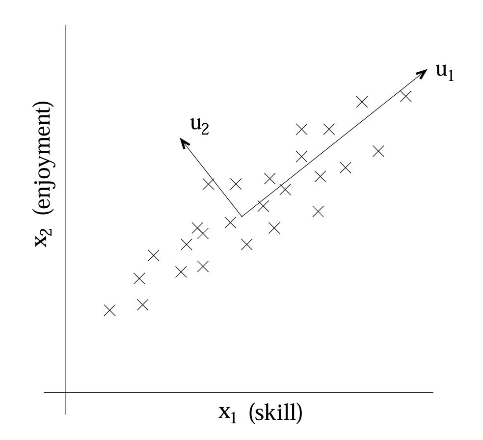
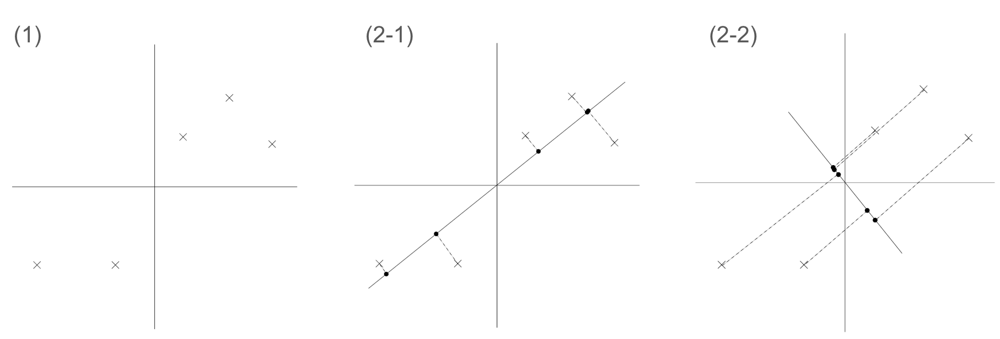
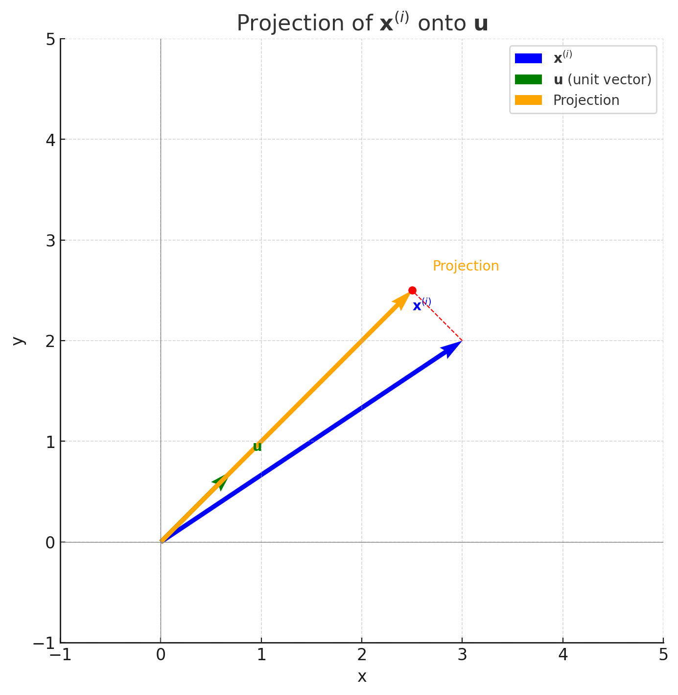

# Principal Component Analysis (PCA)
## Preliminaries
### Eigenvector and Eigenvalue
An eigenvector is a vector that has its direction unchanged by a given linear transformation.  
Consider an $n{\times }n$ matrix A and a nonzero vector $v$ of length $n$. 
If multiplying $A$ with $v$ (denoted by $A v$) simply scales $v$ by a factor of $\lambda$, where $\lambda$ is a scalar, then $v# is called an eigenvector of $A$, and $\lambda$ is the corresponding eigenvalue. This relationship can be expressed as,
$$
A v =\lambda v
$$
Above formula can be stated equivalently as $\left(A - \lambda I \right)v = 0$
where $I$ is the $n \times n$ identity matrix and $0$ is the zero vector.

#### Principal Eigenvector

### Method of Lagrangie Multiplier
In mathematical optimization, the method of Lagrange multipliers is a strategy for finding the local maxima and minima of a function subject to equation constraints.  
(i.e., subject to the condition that one or more equations have to be satisfied exactly by the chosen values of the variables)

The basic idea is to convert a constrained problem into a form such that the derivative test of an unconstrained problem can still be applied.  
(In calculus, a derivative testuses the derivatives of a function to locate the critical points of a function and determine whether each point is a local maximum, a local minimum, or a saddle point) 

The relationship between the gradient of the function and gradients of the constraints rather naturally leads to a reformulation of the original problem, known as the Lagrangian function or Lagrangian.

#### Details
$$
\mathcal{L}(x, \lambda) \equiv f(x) + \langle \lambda, g(x) \rangle \equiv f(x) + \lambda \cdot g(x)

$$
Where $\langle \cdot, \cdot \rangle$ denotes dot product.  

The Method of Lagrangie Multiplier can be summarized as in order to find the maximum or minimum of a function $f$ subject to the equality constraint $g(x)=0$, find the stationary points(points on the graph of the differentiable function where the function's derivative is zero) of ${\mathcal {L}}$ considered as a function of $x$ and the Lagrange multiplier $\lambda$.  
This means that all partial derivatives should be zero, including the partial derivative with respect to $\lambda$.

$$
\frac{\partial f(x)}{\partial x} + \lambda \cdot \frac{\partial g(x)}{\partial x} = 0 \quad \text{and} \quad g(x) = 0
$$

#### Example
Suppose we wish to maximize, 
$$f(x,y)=x+y$$
Subject to the below constraint 
$$x^{2}+y^{2}=1$$
For the method of Lagrange multipliers, the constraint is, 
$$g(x,y)=x^{2}+y^{2}-1=0$$
Hence the Lagrangian function can be derived as below.
$$
\displaystyle {\begin{aligned}{\mathcal {L}}(x,y,\lambda )&=f(x,y)+\lambda \cdot g(x,y)\\[4pt]&=x+y+\lambda (x^{2}+y^{2}-1)\ ,\end{aligned}}
$$
This is a function that is equivalent to $f(x,y)$ when $g(x,y)=0$

Now we can calculate the gradient,
$$
\displaystyle {\begin{aligned}\nabla _{x,y,\lambda }{\mathcal {L}}(x,y,\lambda )&=\left({\frac {\partial {\mathcal {L}}}{\partial x}},{\frac {\partial {\mathcal {L}}}{\partial y}},{\frac {\partial {\mathcal {L}}}{\partial \lambda }}\right)\\[4pt]&=\left(1+2\lambda x,1+2\lambda y,x^{2}+y^{2}-1\right)\ \color {gray}{,}\end{aligned}}
$$
By setting to zero, we get,
$$
\displaystyle \nabla _{x,y,\lambda }{\mathcal {L}}(x,y,\lambda )=0\quad \Leftrightarrow \quad {\begin{cases}1+2\lambda x=0\\1+2\lambda y=0\\x^{2}+y^{2}-1=0\end{cases}}
$$

The first two equations yield,
$$
\displaystyle x=y=-{\frac {1}{2\lambda }},\qquad \lambda \neq 0
$$
By substituting into the last equation,
$$
\displaystyle {\frac {1}{4\lambda ^{2}}}+{\frac {1}{4\lambda ^{2}}}-1=0
$$

So $\displaystyle \lambda =\pm {\frac {1}{\sqrt {2\ }}}$ which implies that the stationary points of ${\mathcal {L}}$ are as below.
$$
\displaystyle \left({\tfrac {\sqrt {2\ }}{2}},{\tfrac {\sqrt {2\ }}{2}},-{\tfrac {1}{\sqrt {2\ }}}\right),\qquad \left(-{\tfrac {\sqrt {2\ }}{2}},-{\tfrac {\sqrt {2\ }}{2}},{\tfrac {1}{\sqrt {2\ }}}\right)
$$

Evaluating the objective function $f$ at these points yields
$$
\displaystyle f\left({\tfrac {\sqrt {2\ }}{2}},{\tfrac {\sqrt {2\ }}{2}}\right)={\sqrt {2\ }}\ ,\qquad f\left(-{\tfrac {\sqrt {2\ }}{2}},-{\tfrac {\sqrt {2\ }}{2}}\right)=-{\sqrt {2\ }}
$$
Thus, the constrained maximum is $\displaystyle \ {\sqrt {2\ }}$ and the constrained minimum is $\displaystyle -{\sqrt {2}}$.

## Basics
Principal component analysis is a dimensionality reduction method that is often used to reduce the dimensionality of large data sets, by transforming a large set of variables into a smaller one that still contains most of the information in the large set.

Reducing the number of variables of a data set naturally comes at the expense of accuracy, but the trick in dimensionality reduction is to trade a little accuracy for simplicity. Because smaller data sets are easier to explore and visualize, and thus make analyzing data points much easier and faster for machine learning algorithms without extraneous variables to process.

In conclusionthe idea of PCA is simple: reduce the number of variables of a data set, while preserving as much information as possible.

### Why Caputuring Variance of data?

## Pre-Processing
Pre-process the data to normalize its mean and variance as following.
$$
\begin{array}{rl}
1. & \text{Let } \mu = \frac{1}{m} \sum_{i=1}^{m} x^{(i)}. \\[10pt]
2. & \bar{x}^{(i)} = x^{(i)} - \mu, \quad \mathbb{E}[{\bar{x}_j^{(i)}}] = 0 \\[10pt]
3. & \text{Let } \sigma_j^2 = \frac{1}{m} \sum_{i=1}^{m} (x_j^{(i)})^2 \\[10pt]
   & (\frac{1}{m} \sum_{i=1}^{m} \mathbb{E}[\bar{x}^{(i)} - \mathbb{E}[\bar{x}]]^2 = \frac{1}{m} \sum_{i=1}^{m} \mathbb{E}[(\bar{x}_j^{(i)} - 0)]^2 = \mathbb{E}[(\bar{x}_j^{(i)})^2]) \\[10pt]
4. & \tilde{x}_j^{(i)} = \frac{\bar{x}_j^{(i)} - \mu}{\sigma_j} \\
5. & \therefore \mathbb{E}[\tilde{x}_j^{(i)}] = 0 \text{ and } \operatorname{Var}(\tilde{x}_j^{(i)}) = 1
\end{array}
$$
In Step 2 when $\bar{x}^{(i)}$ has zero mean, $\bar{x}_j^{(i)}$ also has zero mean because in the step 1 you already zero out the mean across all dimension of vector of $x$.  
For example, consider following vector $x$.
$$
\begin{aligned}
x^{(1)} - \mu &= [1, 3, 5] - [1.5, 3.5, 5.5] = [-0.5, -0.5, -0.5], \\
x^{(2)} - \mu &= [2, 4, 6] - [1.5, 3.5, 5.5] = [0.5, 0.5, 0.5].
\end{aligned}
$$

$$
\begin{aligned}
& \sigma_j^2 = \frac{1}{2} \left[ (-0.5)^2 + (0.5)^2 \right] = 0.25 \\
& \sigma_j = \sqrt{\sigma_j^2} = 0.5 \\
& \frac{\begin{bmatrix} -0.5 \\ 0.5 \end{bmatrix}}{0.5} = \begin{bmatrix} -1 \\ 1 \end{bmatrix}
\end{aligned}
$$

## Construction of PCA
Similar to Factor Analysis, Principal Components Analysis also tries to identify the subspace in which the data approximately lies. However, PCA will do so more directly, and will require only an eigenvector calculation.  

For example, consider a dataset resulting from a survey of pilots for radio-controlled helicopters, where $x_1$ is a measure of the piloting skill of pilot, and $x_2$ captures how much he/she enjoys flying.  
(Because RC helicopters are very difficult to fly, only the most committed students, ones that truly enjoy flying, become good pilots)  
So, the two attributes $x_1$ and $x_2$ are strongly correlated and therfore two attributes are almost linearly dependent. Thus, the data really lies approximately on an $n − 1$ dimensional subspace.  
Indeed, we might posit that the data actually likes along some diagonal axis (the $u_1$ direction) capturing the intrinsic piloting “karma” of a person, with only a small amount of noise lying off this axis. How can we automatically compute this $u_1$ direction?  
(In other words, automatically detect, and perhaps remove, the redundancy of two axis into one subspace)

After normalization from pre-processing, we need to compute the “major axis of variation” $u$—that is, which is the direction on which the data approximately lies.  
One way to do this is finding the unit vector $u$ so that when the data is projected onto the direction corresponding to $u$, the variance of the projected data is maximized. In other word, choose a direction $u$ so that if we were to approximate the data as lying in the direction/subspace corresponding to $u$, as much as possible of this variance is still retained.

### Intuition of PCA
Consider the following dataset, on which we have already carried out the normalization steps.

Suppose we pick $u$ to correspond the the direction shown in the figure (2-1). The circles denote the projections of the original data onto this line. We see that the projected data still has a fairly large variance, and the points tend to be far from zero.  
In contrast, suppose had instead picked the direction as figure (2-2), the projections have a significantly smaller variance, and are much closer to the origin.

### Formalization of the Intuition
Given a unit vector $u$ and a point $x$, the length of the projection of $x$ onto $u$ is given by $x^{T}u$. This is derived by the formula of scalar projection. 
$$
\text{Projection length of } x \text{ onto } u = \lvert \text{Scalar projection} \rvert = \frac{x \cdot u}{\| u \|} = x \cdot u = u^{T} x
$$
Also remember the definition of unit vector that if $u$ is a unit vector, then by definition, $ || u || = 1$.

As shown above, if $x^{(i)}$ is a point in our dataset then its projection onto $u$ (which is unit  vector) is distance $x^Tu$ from the origin.
Since we want to maximize the variance of the projections onto unit vector $u$, we would like to choose a unit-length $u$ to maximize below.
$$
\frac{1}{m} \sum_{i=1}^{m} \left( x^{(i)T} u \right)^2 = \frac{1}{m} \sum_{i=1}^{m} u^T x^{(i)} x^{(i)T} u = u^T \left( \frac{1}{m} \sum_{i=1}^{m} x^{(i)} x^{(i)T} \right) u
$$
Let's put it simply, 
$$
\max_{ \| u \|_2 = 1 } u^T \Sigma u
$$
Where $u$ is the principal eigenvector of the covariance matrix $\Sigma$.
Now, since there is equation constraint $ \| u \|_2 = 1$, we can apply the method of Lagrange multiplier.
The objective function and constraint of the original equations is below.
$$
\mathbb{f}(u, \Sigma) =  u^T \Sigma u 
$$
$$
\| u \|_2 = 1
$$
Applying Method of Lagrangie multiplier, we get $\mathcal{L}(u, \lambda)$ as following.
$$
\mathcal{L}(u, \lambda) = u^T \Sigma u - \lambda (u^T u - 1)
$$
Now, let's take the partial derivative with respect to each of parameters of Lagrangian function, $u$ and $\lambda$.

$$
\frac{\partial \mathcal{L}}{\partial u} = 2 \Sigma u - 2 \lambda u = 0 \quad \Rightarrow \quad \Sigma u = \lambda u
$$

$$
\frac{\partial \mathcal{L}}{\partial \lambda} = -(u^T u - 1) = 0 \quad \Rightarrow \quad u^T u = 1
$$

From The equation $\Sigma u = \lambda u$, we found that it is eigenvector equation and $u$ is the eigenvector equation with $u$ is the eigen vector and $\lambda$ is the corresponding eigenvalue.  
So in order to maximize $u^T \Sigma u$(with the constraint $\| u \|_2 = 1$), $u$ has to be the principal eigenvector and $\lambda$ is the largest eigenvalue. 

#### Summary
So we have found that if we wish to find a 1-dimensional subspace with with to approximate the data, we should choose $u$ to be the principal eigenvector of $\Sigma$.  
More generally, if we wish to project our data into a $k$-dimensional subspace ($k < n$), we should choose $u_1,...,u_k$ to be the top $k$ eigenvectors of $\Sigma$.  
For example, if $ x^{(i)} \in \mathbb{R}^n \, (n = 1000)$ and eigenvector $u=\{ u_1, u_2, \dots, u_n \} \quad (k = 10)$ then,
$$
x^{(i)} \Rightarrow [u_1^T x^{(i)}, u_2^T x^{(i)}, \dots, u_k^T x^{(i)}] = y^{(i)} \in \mathbb{R}^k
$$
You can see that $1000(=n)$ dimension $x^{(i)}$ is now $10(=k)$ dimensional vector $y^{(i)}$.  

Therefore PCA also referred to as a dimensionality reduction algorithm. The vectors $u_1, \cdots, u_k$ are called the first $k$ principal components of the data.

## How to choose $k$?
Since PCA maximize the variance, retain 90% of variance. (percentages could be 95%, 99% and so on)
$$
\frac{\lambda_1 + \lambda_2 + \dots + \lambda_k}{\lambda_1 + \lambda_2 + \dots + \lambda_n} = 0.90
$$

## Applicantions of PCA
 - Compression: representing $x^{(i)}$’s with lower dimension $y^{(i)}$’s is an obvious application. Also we can preprocess a dataset to reduce its dimension before running a supervised learning learning algorithm with the $x^{(i)}$’s as inputs.
 - Visualization: if we reduce high dimensional data to k = 2 or 3 dimensions, then we can also plot the  $y^{(i)}$’s to visualize the data.
 - Avoid Overfitting: reduce the complexity of the hypothesis class considered and help avoid overfitting.
 - Noise Reduction: PCA reduces noise by discarding low variance components that typically represent random or irrelevant variations(which is noise) while retaining high variance components that capture meaningful structure in the data. This is processed by representing high dimension data $x^{(i)}$’s with a much lower imensional $y^{(i)}$’s .

## Remark using PCA
Before using PCA, consider just using original dataset  $x^{(i)}$'s.