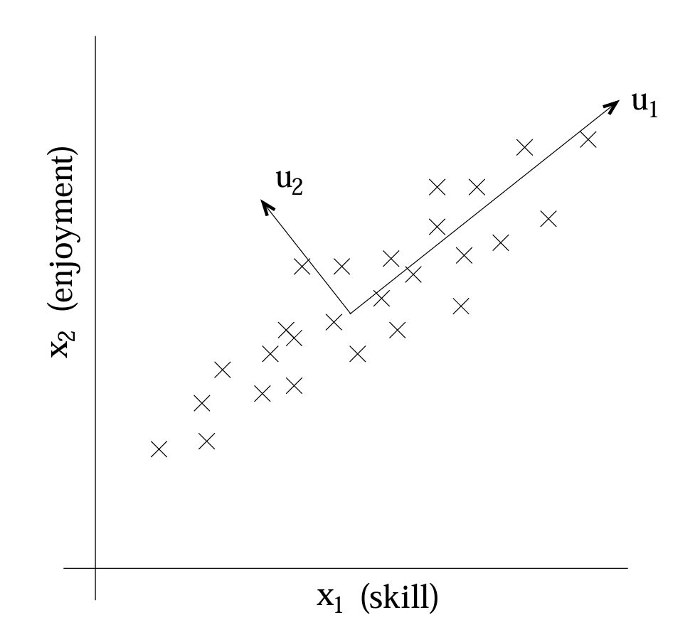
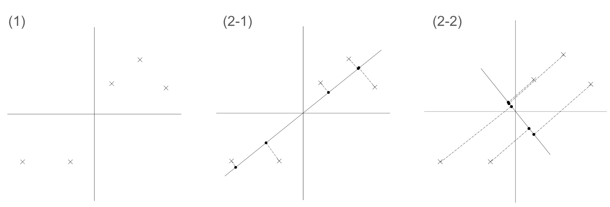
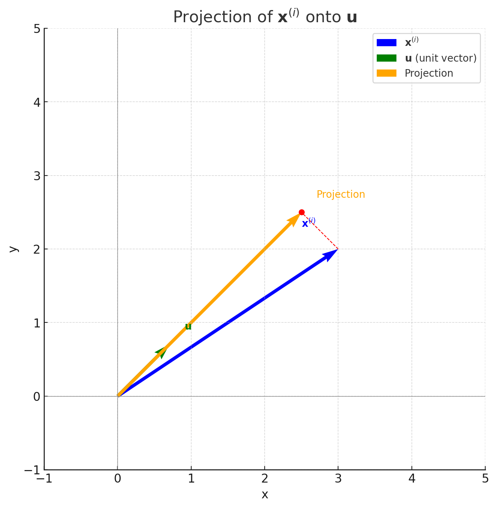

# Principal Component Analysis (PCA)
## Preliminaries
### Orthogonal Matrix
Orthogonal matrix is a real square matrix whose columns and rows are orthogonal vectors.
$$
Q^{\top}Q=QQ^{\top}=I
$$
Where $Q^{\top}$ is the transpose of $Q$ and $I$ is the identity matrix.

As a linear transformation, an orthogonal matrix preserves the inner product of vectors. Therefore it only acts as an isometry(a distance-preserving transformation) of Euclidean space, such as a rotation, reflection or rotoreflection. In other words, it is a unitary transformation(a linear transformation that preserves the inner product).

### Eigenvector and Eigenvalue
An eigenvector is a vector that has its direction unchanged by a given linear transformation.  
Consider an $n{\times }n$ matrix A and a nonzero vector $v$ of length $n$. 
If multiplying $A$ with $v$ (denoted by $A v$) simply scales $v$ by a factor of $\lambda$, where $\lambda$ is a scalar, then $v$ is called an eigenvector of $A$, and $\lambda$ is the corresponding eigenvalue. This relationship can be expressed as,
$$
A v =\lambda v
$$
Above formula can be stated equivalently as $\left(A - \lambda I \right)v = 0$
where $I$ is the $n \times n$ identity matrix and $0$ is the zero vector.

### Eigendecomposition of Matrix
Eigen decomposition is a method used in linear algebra to break down a square matrix into simpler components called eigenvalues and eigenvectors.

Let $A$ be a square $n \times n$ matrix with $n$ linearly independent eigenvectors $q_i$ (where $i = 1, \cdots, n$). Then $A$ can be decomposed as,
$$
\mathbf {A} =\mathbf {Q} \mathbf {\Lambda } \mathbf {Q} ^{-1}
$$
Where $Q$ is the square $n \times n$ matrix whose $i$-th column is the eigenvector $q_i$ of $A$, and $\Lambda$ is the diagonal matrix whose diagonal elements are the corresponding eigenvalues, $\Lambda_{i,i} = \lambda_{i}$. In other words, $Q$ is an orthogonal matrix composed of eigenvectors of $A$, and $\Lambda$ is a diagonal matrix. The eigenvalue $\Lambda_{i,i}$ is associated with the eigenvector in column $i$
of $Q$($Q_{:,i}$).  
Because $Q$ is an orthogonal matrix, we can think of $A$ as scaling space by $\lambda_{i}$ in direction $v(i)$. Note that $\Lambda$ is diagonal matrix with vector $\lambda$ and $Q$ is orthogonal matrix.
$$
Q\,(\lambda I)\,Q^{\top}x = \lambda\,Q\,Q^{\top}x = \lambda\,Ix = \lambda x,
$$

### Singular Value Decomposition (SVD)
SVD (Singular Value Decomposition) is a method used in linear algebra to factorize(decompose) a matrix into three simpler matrices, making it easier to analyze and manipulate.  

The singular value decomposition is similar to Eigendecomposition, except this time we will write $A$ as a product of three matrices:
$$
A \;=\; U\,D\,V^{\top}
$$
Suppose that $A$ is an $m \times n$ matrix. Then $U$ is defined to be an $m \times m$ matrix, $D$ to be an $m \times n$ matrix, and $V$ to be an $n \times n$ matrix.  
Each of these matrices is defined to have a special structure. The matrices $U$ and $V$ are both defined to be orthogonal matrices. The matrix $D$ is defined to be a diagonal matrix. Note that $D$ is not necessarily square.  
The elements along the diagonal of $D$ are known as the singular values of the matrix $A$. The columns of $U$ are known as the "left-singular vectors". The columns of $V$ are known as as the "right-singular vectors".

#### SVD and Singular Value
SVD는 임의의 $m \times n$ 행렬 $M$을 다음과 같이 세 개의 특별한 행렬의 곱으로 분해하는 것을 말합니다.

$$M = U \Sigma V^* \\ = (MV = U \Sigma)$$

$V^*$ (Right-singular vectors의 켤레전치): 입력 공간을 회전(또는 반사)시킵니다. V의 컬럼 벡터는 행렬 $M$이 곱해지기 전, 입력 공간(원래 공간)에서 서로 직교하는 기준 축들입니다.  
($V$가 실수(Real number)로만 이루어진 행렬일 때는 역행렬이 전치행렬($V^T$)과 같고, 복소수(Complex number)까지 포함된 행렬일 때는 역행렬이 켤레전치행렬($V^*$)과 같습니다. 따라서 위 수식이 성립합니다.)

$\Sigma$ (Singular values, 특이값 행렬): 주축을 따라 크기를 늘리거나 줄입니다. (대각 행렬) 이 행렬의 대각성분은 벡터는 아니지만 둘을 연결하는 핵심인 특이값입니다. 원래 축 $v_i$가 결과 축 $u_i$ 방향으로 변환될 때 얼마나 인장(확대/축소)되었는지 그 크기(Scale)를 나타냅니다. 

$U$ (Left-singular vectors): 변환된 공간을 최종적으로 다시 회전(또는 반사)시킵니다. U의 컬럼 벡터행렬 $M$이 곱해진 후, 출력 공간(변환된 공간)에서 서로 직교하는 결과 축들입니다.즉, 입력 공간의 특이 벡터 $v_i$가 행렬 $M$을 통과하여 최종적으로 도달한 결과물의 주축 방향을 나타냅니다.

##### SVD의 의의 
<b> 정보의 중요도 파악 (차원 축소) </b>  
SVD를 하면 특이값($\sigma$)이 큰 순서대로 정렬할 수 있습니다. 특이값이 크다는 것은 그 축으로 데이터가 아주 길게 늘어나 있다는 뜻이고, 이는 "이 축이 데이터의 특징을 가장 잘 설명하는 중요한 축이다"라는 의미가 됩니다. 중요도가 낮은(특이값이 작은) 축들을 버리면 데이터 용량을 획기적으로 줄이는 PCA(주성분 분석)나 이미지 압축이 가능해집니다.

<b> 노이즈 제거 </b>  
데이터에서 가장 큰 특이값 몇 개와 그에 대응하는 특이 벡터들만 남기고 나머지를 제거(0으로 만듦)한 뒤 행렬을 다시 복원하면, 자잘한 노이즈가 사라진 깨끗한 핵심 데이터만 남게 됩니다.

##### SVD Mechanism
SVD의 최종 목표는 주어진 행렬을 $A = U \Sigma V^T$ 형태로 쪼개는 것입니다.

<b> Step 1 - $AA^T$ 계산하기 </b>  
좌특이벡터(Matrix $U$)와 특이값($\Sigma$)을 구하기 위해, 먼저 원래 행렬 $A$와 그 전치행렬(Transpose)인 $A^T$를 곱해줍니다.  

$$A = \begin{bmatrix} 3 & 2 & 2 \\ 2 & 3 & -2 \end{bmatrix}, \quad A^T = \begin{bmatrix} 3 & 2 \\ 2 & 3 \\ 2 & -2 \end{bmatrix}$$  
두 행렬을 곱하면 다음과 같은 $2 \times 2$ 정방행렬이 나옵니다.

$$AA^T = \begin{bmatrix} 3&2&2 \\ 2&3&-2 \end{bmatrix} \begin{bmatrix} 3&2 \\ 2&3 \\ 2&-2 \end{bmatrix} = \begin{bmatrix} 17 & 8 \\ 8 & 17 \end{bmatrix}$$

<b> Step 2 - $AA^T$의 고유값(Eigenvalues)과 특이값(Singular Values) 찾기</b>  
방금 구한 행렬의 특성방정식 $\det(AA^T - \lambda I) = 0$을 풀어 고유값($\lambda$)을 찾습니다.
$$\det \begin{bmatrix} 17-\lambda & 8 \\[3pt] 8 & 17-\lambda \end{bmatrix} = 0 \\[3pt] (17-\lambda)^2 - 64 = 0 \\(\lambda - 25)(\lambda - 9) = 0$$

고유값 ($\lambda$): $\lambda_1 = 25$, $\lambda_2 = 9$, 특이값 ($\sigma$)은 고유값에 루트($\sqrt{}$)를 씌운 값입니다. 내림차순으로 정렬합니다.$$\sigma_1 = \sqrt{25} = 5, \quad \sigma_2 = \sqrt{9} = 3$$이 특이값들로 대각행렬 $\Sigma$가 만들어집니다. 크기는 원래 행렬 $A$와 같은 $2 \times 3$입니다.$$\Sigma = \begin{bmatrix} 5 & 0 & 0 \\ 0 & 3 & 0 \end{bmatrix}$$

<b> Step 3 - 우특이벡터(Right Singular Vectors, Matrix $V$) 구하기 </b>  
Step 3의 목표는 $A^TA$라는 행렬의 고유벡터(Eigenvectors)들을 구하는 것입니다. 이 벡터들이 행렬 $V$의 열(Column)을 구성하게 됩니다.먼저 원래 행렬 $A$와 전치행렬 $A^T$를 곱해 $A^TA$를 구하면 다음과 같은 $3 \times 3$ 행렬이 나옵니다.
$$A^TA = \begin{bmatrix} 3 & 2 \\ 2 & 3 \\ 2 & -2 \end{bmatrix} \begin{bmatrix} 3 & 2 & 2 \\ 2 & 3 & -2 \end{bmatrix} = \begin{bmatrix} 13 & 12 & 2 \\ 12 & 13 & -2 \\ 2 & -2 & 8 \end{bmatrix}$$
이 행렬의 고유값은 $\lambda_1 = 25$, $\lambda_2 = 9$, $\lambda_3 = 0$ 입니다. 이제 각 고유값에 대응하는 고유벡터를 하나씩 연립방정식으로 풀어보겠습니다.

1. $\lambda_1 = 25$ 일 때의 고유벡터 구하기$(A^TA - 25I)v_1 = 0$ 식을 세웁니다. 대각 성분에서 25를 빼주면 다음과 같습니다.$$\begin{bmatrix} 13-25 & 12 & 2 \\ 12 & 13-25 & -2 \\ 2 & -2 & 8-25 \end{bmatrix} \begin{bmatrix} x \\ y \\ z \end{bmatrix} = \begin{bmatrix} -12 & 12 & 2 \\ 12 & -12 & -2 \\ 2 & -2 & -17 \end{bmatrix} \begin{bmatrix} x \\ y \\ z \end{bmatrix} = \begin{bmatrix} 0 \\ 0 \\ 0 \end{bmatrix}$$이 행렬을 기본 행 연산(Row reduction)을 통해 정리하면 다음과 같은 관계식이 나옵니다.$-12x + 12y + 2z = 0 \rightarrow 6x - 6y - z = 0$, $2x - 2y - 17z = 0$ 두 식을 연립하면 $z = 0$이 되고, 자연스럽게 $x = y$라는 결론을 얻습니다.  
따라서 기본 고유벡터는 $\begin{bmatrix} 1 \ 1 \ 0 \end{bmatrix}$이 됩니다.정규화(크기를 1로 만들기)를 적용합니다. 벡터의 크기는 $\sqrt{1^2 + 1^2 + 0^2} = \sqrt{2}$이므로, 각 성분을 $\sqrt{2}$로 나눕니다.$$v_1 = \begin{bmatrix} \frac{1}{\sqrt{2}} \\ \frac{1}{\sqrt{2}} \\ 0 \end{bmatrix}$$
2. $\lambda_2 = 9$ 일 때의 고유벡터 구하기$(A^TA - 9I)v_2 = 0$ 식을 세웁니다. 대각 성분에서 9를 빼줍니다.$$\begin{bmatrix} 13-9 & 12 & 2 \\ 12 & 13-9 & -2 \\ 2 & -2 & 8-9 \end{bmatrix} \begin{bmatrix} x \\ y \\ z \end{bmatrix} = \begin{bmatrix} 4 & 12 & 2 \\ 12 & 4 & -2 \\ 2 & -2 & -1 \end{bmatrix} \begin{bmatrix} x \\ y \\ z \end{bmatrix} = \begin{bmatrix} 0 \\ 0 \\ 0 \end{bmatrix}$$  
방정식을 정리하면 $y = -x$이므로, $z = 2x - 2(-x) = 4x$가 됩니다. $x=1$이라고 두면 고유벡터는 $\begin{bmatrix} 1 \ -1 \ 4 \end{bmatrix}$가 됩니다. 마찬가지로 정규화 하면 벡터의 크기는 $\sqrt{1^2 + (-1)^2 + 4^2} = \sqrt{18}$입니다.$$v_2 = \begin{bmatrix} \frac{1}{\sqrt{18}} \\ -\frac{1}{\sqrt{18}} \\ \frac{4}{\sqrt{18}} \end{bmatrix}$$
3. $\lambda_3 = 0$ 일 때의 고유벡터 구하기본문에서는 $v_1$과 $v_2$에 모두 수직인 벡터(내적이 0인 벡터)를 찾는 방식으로 $v_3$를 구했습니다. $v_3 = \begin{bmatrix} x \ y \ z \end{bmatrix}$ 라 두고, 앞서 구한 정규화 전의 벡터들과 내적을 구합니다. 
$$\begin{bmatrix} 1 \\ 1 \\ 0 \end{bmatrix} \cdot \begin{bmatrix} x \\ y \\ z \end{bmatrix} = 0 \rightarrow x + y = 0 \rightarrow y = -x \\[3pt] \begin{bmatrix} 1 \\ -1 \\ 4 \end{bmatrix} \cdot \begin{bmatrix} x \\ y \\ z \end{bmatrix} = 0 \rightarrow x - y + 4z = 0$$
$z = -1$이라고 두면, $x = 2$, $y = -2$가 되어 고유벡터는 $\begin{bmatrix} 2 \ -2 \ -1 \end{bmatrix}$이 됩니다. 정규화 하면 벡터의 크기는 $\sqrt{2^2 + (-2)^2 + (-1)^2} = \sqrt{9} = 3$입니다. 
$$v_3 = \begin{bmatrix} \frac{2}{3} \\ -\frac{2}{3} \\ -\frac{1}{3} \end{bmatrix}$$
이렇게 구한 $v_1, v_2, v_3$를 합치면 본문의 행렬 $V$가 완성됩니다.

<b> Step 4: 좌특이벡터(Left Singular Vectors, Matrix $U$) 구하기 </b>  
SVD 정의로 행렬 $A$는 $A = U \Sigma V^T$로 분해됩니다. 우특이벡터 행렬 $V$는 직교행렬이므로 $V^T V = I$(단위행렬)가 성립합니다. 따라서 양변의 오른쪽에 $V$를 곱하면 식은 다음과 같이 변합니다.
$$ AV = U \Sigma V^T V \rightarrow AV = U \Sigma $$

이 행렬 곱셈을 행렬 내부의 열벡터 단위로 표현하면 다음과 같습니다.
$$A \begin{bmatrix} v_1 & v_2 & v_3 \end{bmatrix} = \begin{bmatrix} u_1 & u_2 \end{bmatrix} \begin{bmatrix} \sigma_1 & 0 & 0 \\ 0 & \sigma_2 & 0 \end{bmatrix}$$
이를 전개하면 각 열마다 다음과 같은 규칙이 생깁니다.
$$Av_1 = \sigma_1 u_1, \quad Av_2 = \sigma_2 u_2$$
$u_i$에 대해 정리: 우리가 알고 싶은 것은 $u_i$이므로, 양변을 특이값 $\sigma_i$로 나누어 줍니다. 
$$u_i = \frac{1}{\sigma_i} A v_i$$

위 공식 $u_i = \frac{1}{\sigma_i} A v_i$를 사용해 $U$의 열벡터들을 구합니다. 
$$u_1 = \frac{1}{5} A v_1 = \begin{bmatrix} \frac{1}{\sqrt{2}} \\ \frac{1}{\sqrt{2}} \end{bmatrix} \\[3pt]
u_2 = \frac{1}{3} A v_2 = \begin{bmatrix} \frac{1}{\sqrt{2}} \\ -\frac{1}{\sqrt{2}} \end{bmatrix}$$
이 두 벡터를 합쳐 행렬 $U$를 만듭니다.$$U = \begin{bmatrix} \frac{1}{\sqrt{2}} & \frac{1}{\sqrt{2}} \\ \frac{1}{\sqrt{2}} & -\frac{1}{\sqrt{2}} \end{bmatrix}$$

<b> Step 5 - 종 SVD 방정식 완성 ($A = U \Sigma V^T$) </b>
 
이제 구한 세 개의 행렬을 공식에 그대로 대입하면 SVD가 완료됩니다. 주의할 점은 마지막 행렬은 $V$가 아니라 $V$의 전치행렬($V^T$)이라는 점입니다.
$$A = \begin{bmatrix} \frac{1}{\sqrt{2}} & \frac{1}{\sqrt{2}} \\ \frac{1}{\sqrt{2}} & -\frac{1}{\sqrt{2}} \end{bmatrix} \begin{bmatrix} 5 & 0 & 0 \\ 0 & 3 & 0 \end{bmatrix} \begin{bmatrix} \frac{1}{\sqrt{2}} & \frac{1}{\sqrt{2}} & 0 \\ \frac{1}{\sqrt{18}} & -\frac{1}{\sqrt{18}} & \frac{4}{\sqrt{18}} \\ \frac{2}{3} & -\frac{2}{3} & -\frac{1}{3} \end{bmatrix}$$

Reference - https://www.geeksforgeeks.org/data-science/singular-value-decomposition-svd/

##### 직교하는 축'을 기준으로 삼는이유 (SVD의 핵심)
임의의 행렬 $M$은 공간을 사선으로 비틀고, 찌그러뜨리고, 엉망으로 만듭니다. 그래서 그냥 보면 행렬이 공간을 어떻게 변화시키는지 한눈에 알기 어렵습니다. 그런데 수학자들이 발견한 놀라운 사실이 있습니다. 
아무리 무작위로 공간을 구기고 찌그러뜨리는 행렬이라 하더라도, 변환하기 전 입력 공간에서 '정확히 90도로 만나는 특정 축 세트'를 잘 고르면, 변환된 후(출력 공간)에도 자기들끼리 정확히 90도를 유지하며 예쁘게 늘어나게 만들 수 있다는 것입니다.

- 입력 공간의 기준 축 (V): "행렬을 곱하기 전, 원래 공간에서 미리 준비해 둔 90도짜리 축 세트"
- 출력 공간의 결과 축 (U): "행렬을 곱해 데이터가 타원으로 찌그러진 후, 그 타원의 가장 긴 방향과 짧은 방향을 가리키는 90도짜리 새로운 축 세트"

결국 SVD는 "입력할 때 90도였던 축(V)이, 행렬을 통과해 찌그러진 후에도 여전히 90도를 유지하는 축(U)으로 변환되는 순간"을 포착한 것입니다. 그리고 그 축들이 얼마나 길어졌는지를 나타내는 상수가 바로 특이값($\Sigma$)이 됩니다.

### Method of Lagrangie Multiplier
In mathematical optimization, the method of Lagrange multipliers is a strategy for finding the local maxima and minima of a function subject to equation constraints.  
(i.e., subject to the condition that one or more equations have to be satisfied exactly by the chosen values of the variables)

The basic idea is to convert a constrained problem into a form such that the derivative test of an unconstrained problem can still be applied.  
(In calculus, a derivative test uses the derivatives of a function to locate the critical points of a function and determine whether each point is a local maximum, a local minimum, or a saddle point) 

The relationship between the gradient of the function and gradients of the constraints rather naturally leads to a reformulation of the original problem, known as the Lagrangian function or Lagrangian.

#### Details
$$
\mathcal{L}(x, \lambda) \equiv f(x) + \langle \lambda, g(x) \rangle \equiv f(x) + \lambda \cdot g(x)
$$
Where $\langle \cdot, \cdot \rangle$ denotes dot product.  
The Method of Lagrangie Multiplier can be summarized as in order to find the maximum or minimum of a function $f$ subject to the equality constraint $g(x)=0$, find the stationary points(points on the graph of the differentiable function where the function's derivative is zero) of ${\mathcal {L}}$ (a function of $x$ and the Lagrange multiplier $\lambda$).  
This means that all partial derivatives should be zero, including the partial derivative with respect to $\lambda$.

$$
\frac{\partial f(x)}{\partial x} + \lambda \cdot \frac{\partial g(x)}{\partial x} = 0 \quad \text{and} \quad g(x) = 0
$$

#### Example
Suppose we wish to maximize, 
$$f(x,y)=x+y$$
Subject to the below constraint 
$$x^{2}+y^{2}=1$$
For the method of Lagrange multipliers, the constraint is, 
$$g(x,y)=x^{2}+y^{2}-1=0$$
Hence the Lagrangian function can be derived as below.
$$
\displaystyle {\begin{aligned}{\mathcal {L}}(x,y,\lambda )&=f(x,y)+\lambda \cdot g(x,y)\\[4pt]&=x+y+\lambda (x^{2}+y^{2}-1)\ ,\end{aligned}}
$$
This is a function that is equivalent to $f(x,y)$ when $g(x,y)=0$

Now we can calculate the gradient,
$$
\displaystyle {\begin{aligned}\nabla _{x,y,\lambda }{\mathcal {L}}(x,y,\lambda )&=\left({\frac {\partial {\mathcal {L}}}{\partial x}}, {\frac {\partial {\mathcal {L}}}{\partial y}}, {\frac {\partial {\mathcal {L}}}{\partial \lambda }}\right)\\[4pt]&=\left(1+2\lambda x,1+2\lambda y,x^{2}+y^{2}-1\right)\ \color {gray}{,}\end{aligned}}
$$
By setting to zero, we get,
$$
\displaystyle \nabla _{x,y,\lambda }{\mathcal {L}}(x,y,\lambda )=0\quad \Leftrightarrow \quad {\begin{cases}1+2\lambda x=0\\1+2\lambda y=0\\x^{2}+y^{2}-1=0\end{cases}}
$$

The first two equations yield,
$$
\displaystyle x=y=-{\frac {1}{2\lambda }},\qquad \lambda \neq 0
$$
By substituting into the last equation,
$$
\displaystyle {\frac {1}{4\lambda ^{2}}}+{\frac {1}{4\lambda ^{2}}}-1=0
$$

So $\displaystyle \lambda =\pm {\frac {1}{\sqrt {2\ }}}$ which implies that the stationary points of ${\mathcal {L}}$ are as below.
$$
\displaystyle \left({\tfrac {\sqrt {2\ }}{2}},{\tfrac {\sqrt {2\ }}{2}},-{\tfrac {1}{\sqrt {2\ }}}\right),\qquad \left(-{\tfrac {\sqrt {2\ }}{2}},-{\tfrac {\sqrt {2\ }}{2}},{\tfrac {1}{\sqrt {2\ }}}\right)
$$

Evaluating the objective function $f$ at these points yields
$$
\displaystyle f\left({\tfrac {\sqrt {2\ }}{2}},{\tfrac {\sqrt {2\ }}{2}}\right)={\sqrt {2\ }}\ ,\qquad f\left(-{\tfrac {\sqrt {2\ }}{2}},-{\tfrac {\sqrt {2\ }}{2}}\right)=-{\sqrt {2\ }}
$$
Thus, the constrained maximum is $\displaystyle \ {\sqrt {2\ }}$ and the constrained minimum is $\displaystyle -{\sqrt {2}}$.

## Basics
Principal component analysis is a dimensionality reduction method that is often used to reduce the dimensionality of large data sets, by transforming a large set of variables into a smaller one that still contains most of the information in the large set.

Reducing the number of variables of a data set naturally comes at the expense of accuracy, but the trick in dimensionality reduction is to trade a little accuracy for simplicity. Because smaller data sets are easier to explore and visualize, and thus make analyzing data points much easier and faster for machine learning algorithms without extraneous variables to process.

In conclusionthe idea of PCA is simple: reduce the number of variables of a data set, while preserving as much information as possible.

### Why Caputuring Variance of data?
It is because variance is directly related to the amount of information (or spread) present in the data.

#### Geometric Interpretation - Spread Implies Distinctive Features
Imagine a 2D scatter plot of data points shaped like an elongated ellipse. The long axis of the ellipse represents the direction of maximum variance, meaning most of the data’s variability lies along this direction.
PCA will choose this direction as the first principal component because it captures the most distinctive variation between the data points.
Conversely, the short axis of the ellipse has much smaller variance and likely represents redundant or less important features that PCA can ignore during dimensionality reduction.
Check picture in "Construction of PCA".

The variance along a particular direction tells us how spread out or informative the data is in that direction.
 - High variance means that the data points are more spread out, indicating that this direction captures a significant amount of variation (or patterns) in the dataset.
 - Low variance suggests that most of the data points are clustered closely together in that direction, meaning that direction doesn’t add much new information.

#### Higher variance implies more information
Data points with high variance typically carry more distinguishing features and useful differences between samples.  
Low variance components are often considered noise or redundant, as they contribute less to distinguishing different observations.

#### Dimensionality reduction without significant information loss
By retaining only the components (principal components) with the highest variance, PCA ensures that the reduced representation of the data still preserves the most critical structure.   
The components with lower variance are discarded since they contribute little to the overall variability or structure of the dataset.

### Principal Eigenvector in PCA
The principal eigenvector is the eigenvector corresponding to the largest eigenvalue of the data covariance matrix $\Sigma$ where,
$$
\Sigma = \frac{1}{m} \sum_{i=1}^{m} \tilde{x}^{(i)} {\tilde{x}^{(i)}}^T.
$$
More details of derivation of above formula are explained in the "Construction of PCA".

From the eigenvector equation of PCA,
$$
\Sigma u =\lambda u
$$

From the property of eigenvector, the eigenvector $u$ of PCA is a vector that, when multiplied by the covariance matrix $\Sigma$, does not change its direction and only gets scaled by a factor $\lambda$ (the eigenvalue).  
Thus, the eigenvector $u$ points in a direction of maximum variance(which is the eigenvector with the maximum eigenvalue), and we want to project data along this direction to reduce dimensionality while retaining information.  
For example, when covariance matrix $\Sigma$ is as following,
$$
\Sigma = \begin{bmatrix} 3 & 2 \\ 2 & 3 \end{bmatrix}
$$
You want to solve $\Sigma u =\lambda u$. Using eigenvalue equation, you get two sets of eigenvalue and eigenvector.
 - $u_1 = \frac{1}{\sqrt{2}} \begin{bmatrix} 1 \\ 1 \end{bmatrix}$ and $\lambda_1 = 5$

 - $u_2 = \frac{1}{\sqrt{2}} \begin{bmatrix} -1 \\ 1 \end{bmatrix}$ and $\lambda_2 = 1$.

Since eigenvector $u$ is scaled with the eigenvalue $\lambda$,  
$\Sigma u_1$ will be the long axis of the ellipse of dataset indicating the largest variance.  
Conversely, $\Sigma u_2$ will be the short axis of the ellipse of dataset.  
(It will be helpful to see the picture in "Construction of PCA")

## Pre-Processing
Pre-process the data to normalize its mean and variance as following.
$$
\begin{array}{rl}
1. & \text{Let } \mu = \frac{1}{m} \sum_{i=1}^{m} x^{(i)}. \\[10pt]
2. & \bar{x}^{(i)} = x^{(i)} - \mu, \quad \mathbb{E}[{\bar{x}_j^{(i)}}] = 0 \\[10pt]
3. & \text{Let } \sigma_j^2 = \frac{1}{m} \sum_{i=1}^{m} (x_j^{(i)})^2 \\[10pt]
   & (\frac{1}{m} \sum_{i=1}^{m} \mathbb{E}[\bar{x}^{(i)} - \mathbb{E}[\bar{x}]]^2 = \frac{1}{m} \sum_{i=1}^{m} \mathbb{E}[(\bar{x}_j^{(i)} - 0)]^2 = \mathbb{E}[(\bar{x}_j^{(i)})^2]) \\[10pt]
4. & \tilde{x}_j^{(i)} = \frac{\bar{x}_j^{(i)} - \mu}{\sigma_j} \\
5. & \therefore \mathbb{E}[\tilde{x}_j^{(i)}] = 0 \text{ and } \operatorname{Var}(\tilde{x}_j^{(i)}) = 1
\end{array}
$$
In Step 2 when $\bar{x}^{(i)}$ has zero mean, $\bar{x}_j^{(i)}$ also has zero mean because in the step 1 you already zero out the mean across all dimension of vector of $x$.  
For example, consider following vector $x$.
$$
\begin{aligned}
x^{(1)} - \mu &= [1, 3, 5] - [1.5, 3.5, 5.5] = [-0.5, -0.5, -0.5], \\
x^{(2)} - \mu &= [2, 4, 6] - [1.5, 3.5, 5.5] = [0.5, 0.5, 0.5].
\end{aligned}
$$

$$
\begin{aligned}
& \sigma_j^2 = \frac{1}{2} \left[ (-0.5)^2 + (0.5)^2 \right] = 0.25 \\
& \sigma_j = \sqrt{\sigma_j^2} = 0.5 \\
& \frac{\begin{bmatrix} -0.5 \\ 0.5 \end{bmatrix}}{0.5} = \begin{bmatrix} -1 \\ 1 \end{bmatrix}
\end{aligned}
$$

## Construction of PCA
Similar to Factor Analysis, Principal Components Analysis also tries to identify the subspace in which the data approximately lies. However, PCA will do so more directly, and will require only an eigenvector calculation.  

For example, consider a dataset resulting from a survey of pilots for radio-controlled helicopters, where $x_1$ is a measure of the piloting skill of pilot, and $x_2$ captures how much he/she enjoys flying.  
(Because RC helicopters are very difficult to fly, only the most committed students, ones that truly enjoy flying, become good pilots)  
So, the two attributes $x_1$ and $x_2$ are strongly correlated and therfore two attributes are almost linearly dependent. Thus, the data really lies approximately on an $n − 1$ dimensional subspace.  
Indeed, we might posit that the data actually likes along some diagonal axis (the $u_1$ direction) capturing the intrinsic piloting “karma” of a person, with only a small amount of noise lying off this axis. How can we automatically compute this $u_1$ direction?  
(In other words, automatically detect, and perhaps remove, the redundancy of two axis into one subspace)

After normalization from pre-processing, we need to compute the “major axis of variation” $u$—that is, which is the direction on which the data approximately lies.  
One way to do this is finding the unit vector $u$ so that when the data is projected onto the direction corresponding to $u$, the variance of the projected data is maximized. In other word, choose a direction $u$ so that if we were to approximate the data as lying in the direction/subspace corresponding to $u$, as much as possible of this variance is still retained.

### Intuition of PCA
Consider the following dataset, on which we have already carried out the normalization steps.

Suppose we pick $u$ to correspond the the direction shown in the figure (2-1). The circles denote the projections of the original data onto this line. We see that the projected data still has a fairly large variance, and the points tend to be far from zero.  
In contrast, suppose had instead picked the direction as figure (2-2), the projections have a significantly smaller variance, and are much closer to the origin.

### Formalization of the Intuition
From the above intuition, we have to select the direction $u$ corresponding to
the (2-1), because it has more variance which means more information (less information loss). Given a unit vector $u$ and a point $x$, the length of the projection of $x$ onto $u$ is given by $x^{T}u$. This is derived by the formula of scalar projection. 
$$
\text{Projection length of } x \text{ onto } u = \lvert \text{Scalar projection} \rvert = \frac{x \cdot u}{\| u \|} = x \cdot u = u^{T} x
$$
Also remember the definition of unit vector that if $u$ is a unit vector, then by definition, $ || u || = 1$.

As shown above, if $x^{(i)}$ is a point in our dataset then its projection onto $u$ (which is unit  vector) is distance $x^Tu$ from the origin.
Since we want to maximize the variance of the projections onto unit vector $u$, we would like to choose a unit-length $u$ to maximize below.
$$
\frac{1}{m} \sum_{i=1}^{m} \left( x^{(i)T} u \right)^2 = \frac{1}{m} \sum_{i=1}^{m} u^T x^{(i)} x^{(i)T} u = u^T \left( \frac{1}{m} \sum_{i=1}^{m} x^{(i)} x^{(i)T} \right) u
$$
Above equation is calculating the variance of projection $u^{T}x$. Note that variance is $\text{Var}(X) = \mathbb{E}[(X - \mu)^2]$ and here, $X =  x^{(i)T} u$ as below.
$$
\frac{1}{m} \sum_{i=1}^{m} \left( x^{(i)T} u - \left(\frac{1}{m}\sum_{i=1}^{m}\!\bigl(x^{(i)\!\top}u\bigr) \right)^{2} \right)^2  = \frac{1}{m} \sum_{i=1}^{m} \left( x^{(i)T} u - (\mu^T u)^2 \right)^2, \\[6pt]
\text{When, } \quad \frac{1}{m}\sum_{i=1}^{m}\!\bigl(x^{(i)\!\top}u\bigr)
\;=\;
\left(\frac{1}{m}\sum_{i=1}^{m} x^{(i)}\right)^{\!\top} u
$$
Since we normalized the mean before PCA, $\mu =0$, therefore $\frac{1}{m} \sum_{i=1}^{m} \left( x^{(i)T} u \right)^2 $ can be used to get variance omitting the substraction term.  

Now, back to the variance and let's put it simply, 
$$
\max_{ \| u \|_2 = 1 } u^T \Sigma u
$$
Where $u$ is the principal eigenvector of the covariance matrix $\Sigma$. (We will see why)
Now, since there is equation constraint $ \| u \|_2 = 1$, we can apply the method of Lagrange multiplier.
The objective function and constraint of the original equations is below.
$$
\mathbb{f}(u, \Sigma) =  u^T \Sigma u 
$$
$$
\| u \|_2 = 1
$$
Applying Method of Lagrangie multiplier, we get $\mathcal{L}(u, \lambda)$ as following.
$$
\mathcal{L}(u, \lambda) = u^T \Sigma u - \lambda (u^T u - 1)
$$
Now, let's take the partial derivative with respect to each of parameters of Lagrangian function, $u$ and $\lambda$.

$$
\frac{\partial \mathcal{L}}{\partial u} = 2 \Sigma u - 2 \lambda u = 0 \quad \Rightarrow \quad \Sigma u = \lambda u
$$

$$
\frac{\partial \mathcal{L}}{\partial \lambda} = -(u^T u - 1) = 0 \quad \Rightarrow \quad u^T u = 1
$$

From The equation $\Sigma u = \lambda u$, we found that it is the eigenvector equation with $u$ is the eigen vector and $\lambda$ is the corresponding eigenvalue.  
So in order to maximize $u^T \Sigma u$(with the constraint $\| u \|_2 = 1$), $u$ has to be the principal eigenvector and $\lambda$ is the largest eigenvalue. 

### Summary
So we have found that if we wish to find a 1-dimensional subspace with with to approximate the data, we should choose $u$ to be the principal eigenvector of $\Sigma$. Easily speaking, the line spanned by a single unit vector $u$ that best represents the data’s direction of largest variance.  
More generally, if we wish to project our data into a $k$-dimensional subspace ($k < n$), we should choose $u_1,...,u_k$ to be the top $k$ eigenvectors of $\Sigma$.  
For example, if $ x^{(i)} \in \mathbb{R}^n \, (n = 1000)$ and eigenvector $u=\{ u_1, u_2, \dots, u_n \} \quad (k = 10)$ then,
$$
x^{(i)} \Rightarrow [u_1^T x^{(i)}, u_2^T x^{(i)}, \dots, u_k^T x^{(i)}] = y^{(i)} \in \mathbb{R}^k
$$
You can see that $1000(=n)$ dimension $x^{(i)}$ is now $10(=k)$ dimensional vector $y^{(i)}$.  
If you want to go back to $y$ to $x$, you can do it as below.
$$
x^{(i)} \approx\ y_{1}^{(i)}\,u_{1} + y_{2}^{(i)}\,u_{2} + \dots + y_{k}^{(i)}\,u_{k}, \qquad
x^{(i)} \in \mathbb{R}^{n}
$$
Therefore PCA also referred to as a dimensionality reduction algorithm, because whereas $x^{(i)} \in \mathbb{R}^{n}$, the vector $y^{(i)}$ now gives a lower, k-dimensional,
approximation/representation for $x^{(i)}$.  
The vectors $u_1, \cdots, u_k$ are called the first $k$ principal components of the data.

## How to choose $k$?
Since PCA maximize the variance, retain 90% of variance. (percentages could be 95%, 99% and so on)
$$
\frac{\lambda_1 + \lambda_2 + \dots + \lambda_k}{\lambda_1 + \lambda_2 + \dots + \lambda_n} = 0.90
$$

## Applicantions of PCA
 - Compression: representing $x^{(i)}$’s with lower dimension $y^{(i)}$’s is an obvious application. Also we can preprocess a dataset to reduce its dimension before running a supervised learning learning algorithm with the $x^{(i)}$’s as inputs.
 - Visualization: if we reduce high dimensional data to 2 or 3 dimensions($k$), then we can also plot the  $y^{(i)}$’s to visualize the data.
 - Avoid Overfitting: by reducing the data’s dimension, it reduces the complexity of the hypothesis class considered and help avoid overfitting.
 - Noise Reduction: PCA reduces noise by discarding low variance components that typically represent random or irrelevant variations(which is noise) while retaining high variance components that capture meaningful structure in the data. This is processed by representing high dimension data $x^{(i)}$’s with a much lower imensional $y^{(i)}$’s .

## Orthogonality of Principal Components
The first principal component can equivalently be defined as a direction that maximizes the variance of the projected data. The $i$-th principal component can be taken as a direction orthogonal to the first 
$i-1$ principal components that maximizes the variance of the projected data.  

The covariance matrix $\Sigma$ is symmetric ($\Sigma = \Sigma^T$).  
One fundamental property of symmetric matrices is that their eigenvectors corresponding to distinct eigenvalues are orthogonal due to the spectral theorem.
That is, if $v_1$ and $v_2$ are two eigenvectors corresponding to different eigenvalues of $\lambda_1$ and $\lambda_2$, then: $v_1^T v_2 = 0$.  
Thus, all principal components (eigenvectors of $\Sigma$) are mutually orthogonal.

### Why Covariance Matrix $\Sigma$ is Symmetric?
1. Each outer product $xx^T$ is symmetric because $(xx^T)^T=xx^T$.
$$
x = \begin{bmatrix} x_1 \\ x_2 \\ \vdots \\ x_n \end{bmatrix}
$$

$$
xx^T = \begin{bmatrix} x_1 \\ x_2 \\ \vdots \\ x_n \end{bmatrix}
\begin{bmatrix} x_1 & x_2 & \cdots & x_n \end{bmatrix}
$$

$$
xx^T =
\begin{bmatrix}
x_1 x_1 & x_1 x_2 & \cdots & x_1 x_n \\
x_2 x_1 & x_2 x_2 & \cdots & x_2 x_n \\
\vdots & \vdots & \ddots & \vdots \\
x_n x_1 & x_n x_2 & \cdots & x_n x_n
\end{bmatrix}
$$
2. The sum of symmetric matrices remains symmetric.

## Remark using PCA
Before using PCA, consider just using original dataset  $x^{(i)}$'s.