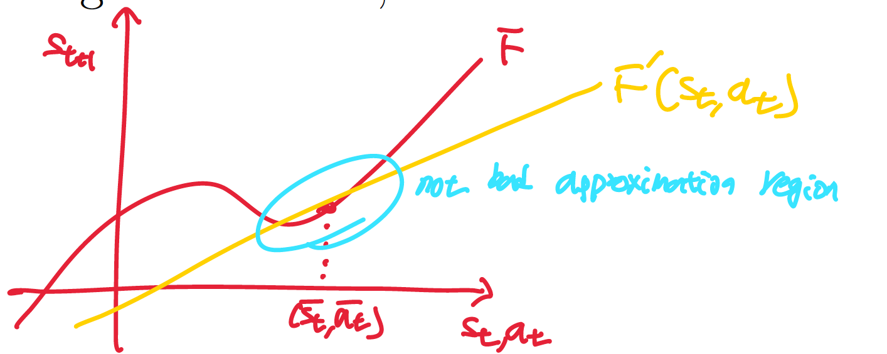
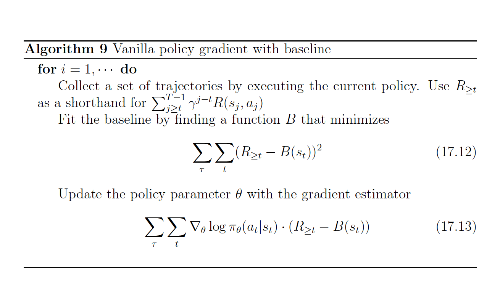

# Reinforcement Learning
Reinforcement Learning(RL) is a branch of machine learning focused on making decisions to maximize cumulative rewards in a given situation. Unlike supervised learning, which relies on a training dataset with predefined answers, RL involves learning through experience.  
In RL, an agent learns to achieve a goal in an uncertain, potentially complex environment by performing actions and receiving feedback through rewards or penalties.

The environment is typically stated in the form of a Markov Decision Process (MDP), as many reinforcement learning algorithms use dynamic programming techniques. 

## Preliminaries

## Finite-State Machine (FSM)
FSM is a mathematical model of computation. It is an abstract machine that can be in exactly one of a finite number of states at any given time. The FSM can change from one state to another in response to some inputs; the change from one state to another is called a transition.  
An FSM is defined by a list of its states, its initial state, and the inputs that trigger each transition. A state is a description of the status of a system that is waiting to execute a transition. A transition is a set of actions to be executed when a condition is fulfilled or when an event is received. 

## Bellman Equation
The Bellman Equation is a recursive formula used in decision-making and reinforcement learning. It shows how the value of being in a certain state depends on the rewards received and the value of future states.   
The Bellman Equation breaks down a complex problem into smaller steps, making it easier to solve. The equation helps find the best way to make decisions when outcomes depend on a series of actions.
$$
V(s) = \max_{a} \left[ R(s,a) + \gamma \sum_{s'} P(s' | s, a) V(s') \right]
$$
 - $V(s)$ : The value of state $s$, which represents the long-term reward of being in that state.
 - $R(s,a)$ : The immediate reward received for taking action $a$ in state $s$.
 - $\gamma$: The discount factor (between 0 and 1) that determines the importance of future rewards compared to immediate rewards.
 - $ P(s' | s, a)$:  The probability of transitioning to state $s′$ from state $s$ by taking action $a$.
 - $\max_{a}$: The optimal action that maximizes the expected value of future rewards.

### Bellman Equation vs Dynamic Programming
 - Dynamic Programming: A method to solve optimization problems using subproblem decomposition and memoization.
 - Bellman Equation: A recursive equation that expresses the value of a state based on the values of successor states.

## Credit Assignment Problem
The credit assignment problem (CAP) is a fundamental challenge in reinforcement learning. It arises when an agent receives a reward for a particular action, but the agent must determine which of its previous actions led to the reward.  
The credit assignment problem refers to the problem of measuring the influence and impact of an action taken by an agent on future rewards. The core aim is to guide the agents to take corrective actions which can maximize the reward.  
Putting it simply, how does algorithm know of all the things that the model did before,  what did it well (which it should do more of) and what did it poorly(which it should do less of).

For example, think of car crashes in building self driving car, chances are the car was doing right before the crash would be brake, but it's not braking that causes the crash and it would be something else that caused crash before crash.
Another example, in chess, when the program lost the game at move 50 due to the blunder(bad move) program amde at move 20 and took another 30 moves before the fates was sealed.

## Markov Decision Processes(MDP)
### Relevance to Reinforcement Learning
MDP is a mathematical framework used to describe an environment in decision making scenarios where outcomes are partly random and partly under the control of a decision-maker(dynamic programing).  
MDP provides a formalism for modeling decision making in situations where outcomes are uncertain, making them essential for Reinforcement Learning.

### Component of MDP
An MDP is defined by a tuple $(S, A, \{ P_{sa} \}, \gamma, R)$ where:

 - States ($S$): A finite set of states representing all possible situations in which the agent can find itself. Each state encapsulates all the relevant information needed to make a decision.
 - Actions ($A$): A finite set of actions available to the agent. At each state, the agent can choose from these actions to influence its environment.
 - Transition Probability ($\{ P_{sa} \}$): A probability function that defines the probability of transitioning from state $s$ to state $s′$ after taking action $a$. This encapsulates the dynamics of the environment. In other words, it gives the distribution over what states($s'$) we will transition to if we take action $a$ in state $s$.
 - Reward Function (R): A reward function $R: S \times A \to \mathbb{R}$ that provides a scalar reward received after transitioning from state $s$ to state $s′$ due to action $a$. This reward guides the agent towards desirable outcomes.
 - Discount Factor ($\gamma$): A discount factor $\gamma \in [0,1)$ that determines the importance of future rewards. A discount factor close to 1 makes the agent prioritize long-term rewards, while a factor close to 0 makes it focus on immediate rewards.
 - Policy($\pi$): A policy is any function $\pi: S \to A$ mapping from the states to the actions. We say that we are executing some policy $\pi$ if, whenever we are in state $s$, we take action $a = \pi(s)$.

### Basics
The dynamics of an MDP proceeds as follows:  
Starting in some state $s_0$, and choose some action $a_0 \in A$ to take in the MDP. As a result of our choice, the state of the MDP randomly transitions to some successor state $s_1$, drawn according to $s_1 \sim P_{s_0 a_0}$.  
Then, pick another action $a_1$. As a result of this action, the state transitions again, now to some $s_2 \sim P_{s_1 a_1}$. We then pick $a_2$, and so on...  
If you put it into picture, it will be as below.
$$
s_0 \xrightarrow{a_0} s_1 \xrightarrow{a_1} s_2 \xrightarrow{a_2} s_3 \xrightarrow{a_3} \cdots
$$
Upon visiting the sequence of states $s_0, s_1, \cdots$ with actions $a_0,a_1, \cdots$ our total payoff is given by,
$$
R(s_0, a_0) + \gamma R(s_1, a_1) + \gamma^2 R(s_2, a_2) + \cdots
$$

Note that Rewards are sometimes also written as a function of a state $s$ only, in which case we would have $R: S \to \mathbb{R}$ from Now on. So, the total payoff is expressed as below.
$$
R(s_0) + \gamma R(s_1) + \gamma^2 R(s_2) + \cdots
$$
From now, we are writing rewards as a function of the states only. More general setting which is function with both states and actions, will be introduced in the latter section "Generalized State-Action Reward".

In Reinforcement Learning, the goal is to choose actions over time so as to maximize the expected value of the total payoff:
$$
\mathbb{E} \left[ R(s_0) + \gamma R(s_1) + \gamma^2 R(s_2) + \cdots \right]
$$

Now, let's define the value function for a policy $\pi$.  
$V^{\pi}(s)$ is simply the expected sum of discounted rewards upon starting in state $s$, and taking actions according to a fixed policy $\pi$.

$$
V^{\pi}(s) = \mathbb{E} \left[ R(s_0) + \gamma R(s_1) + \gamma^2 R(s_2) + \cdots \mid s_0 = s, \pi \right]
$$

This can be also expressed as,
$$
V^{\pi}(s) = \mathbb{E} \left[ R(s_0) + \gamma (R(s_1) + \gamma R(s_2) + + \gamma^2 R(s_3)\cdots) \mid s_0 = s, \pi \right]
$$
Now you can see that  value function $V^{\pi}(s)$ satisfies the Bellman equations as below.
$$
V^{\pi}(s) = R(s) + \gamma \sum_{s' \in S} P_{s \pi(s)}(s') V^{\pi}(s').
$$
Where $s$ is current state and $s'$ is the state after one step.
As you can see there are two terms in the equation.
 - $R(s)$: immediate reward that we get rightaway simply for starting in state $s$. 
 - $\sum_{s' \in S} P_{s \pi(s)}(s') V^{\pi}(s')$: the expected sum of future discounted rewards.  

The second term can be interpreted as below which is the expected sum of discounted rewards for starting in state $s′$.  
$$\mathbb{E}_{s' \sim P_{s\pi(s)}} \left[ V^{\pi}(s') \right]$$
Where $s'$ is distributed according $P_{s \pi(s)}(s')$, which is the distribution over where we will end up "after" taking the first action $\pi(s)$ in the MDP from state $s$.  
Therefore the second term gives the expected sum of discounted rewards obtained "after" the first step in the MDP.

### Optimal Value Function and Optimal Policy
From the value functions above $V^{\pi}(s)$, we define the optimal value function is,
$$
V^*(s) = \max_{\pi} V^{\pi}(s).
$$
This is the best possible expected sum of discounted rewards that can be attained using any policy. There is Bellman's Equations version of optimal value function as below.
$$
V^*(s) = R(s) + \max_{a \in A} \gamma \sum_{s' \in S} P_{sa}(s') V^*(s').
$$
From the above equation first term $R(s)$ is an immediate reward like the value function before.  
The second term is the maximum over all actions $a$ of the expected future sum of discounted rewards we’ll get upon after action $a$. Meaning that it finds the maximum possible expected value over all actions $a \in A$.

There is also optimal policy which is the best action should be taken from state $s$.
$$
\pi^*(s) = \arg\max_{a \in A} \sum_{s' \in S} P_{sa}(s') V^*(s')
$$
Note that $\pi^*(s)$ gives the action $a$ that attains the maximum in the second term in $V^*(s)$ (which is $\sum_{s' \in S} P_{sa}(s') V^*(s')$).

Note that $\pi^*(s)$ has the interesting property that it is the optimal policy for all states $s$.  
Therefore, it is "not" the case that if we were starting in some state $s$ then there’d be some optimal policy for that state, and if we
were starting in some other state $s′$ then there’d be some other policy that’s optimal policy for $s′$.  
The same policy $\pi^*(s)$ attains the maximum in value function for all states $s$. This means that we can use the same policy $\pi^*(s)$ no matter what the initial state of our MDP is.

It is a fact that for every state $s$ and every policy $\pi$, 
$$
V^*(s) = V^{\pi^*}(s) \geq V^{\pi}(s).
$$
Which means that value function for optimal policy $V^{\pi^*}(s)$ is equal to the optimal value function $V^*(s)$ for every state $s$. 

### Value Iteration
One efficient algorithm for solving finite-state MDP is value iteration.  
1. For each state $s$, initialize $V(s) := 0$.
2. Repeat until convergence:  
{  
    For every state, update $V(s) := R(s) + \max_{a \in A} \gamma \sum_{s' \in S} P_{sa}(s') V^*(s')$   
}  

In value iteration, the $\pi$ function is not used and instead value function is used.
This can be interpreted as repeatedly trying to update the estimated value function using Bellman Equations.  So more precisely, 
$$
V_{k+1}(s)
\;=\;
R(s)
\;+\;
\gamma\;
\max_{a\in A}
\sum_{s'} P_{s a}(s')\,V_{k}(s').
$$
Note that each new estimate $V_{k+1}(s)$ is defined with the current estimates 
$V_{k}(s)$ on the right-hand side. In other words, you keep applying this Bellman-update operator until the entire vector $V_{k}$ stops changing (converges).  So the recursion is not a separate process for every possible starting state; there is one global value function $V$ that is repeatedly fed back into its own right-hand side.  

Also there are two ways of performing the updates.
 - Synchronous Update: compute the new values for $V(s)$ for every state $s$, and then overwrite all the old values with the new values.
 - Asynchronous Update: loop over the states (in some order) and update the values one at a time.

Under either synchronous or asynchronous updates, value iteration will cause $V$ to converge to $V∗$.
With the optained $V∗$, we can then use find the optimal policy as the equation shown above $\pi^*(s) = \arg\max_{a \in A} \sum_{s' \in S} P_{sa}(s') V^*(s')$.

### Policy Iteration
Apart from value iteration, there is a second standard algorithm for finding an optimal policy for an MDP which is policy iteration.
1. Initialize $\pi$ randomly.
2. Repeat until convergence:  
{   
    a. Let $V := V^{\pi}$.  
    b. For each state $s$, let $\pi(s) := \arg\max_{a \in A} \sum_{s' \in S} P_{sa}(s') V^*(s')$   
}

For small MDPs, policy iteration is often very fast and converges with very few iterations.  
However, for MDPs with large state spaces, solving for $V^{\pi}$ explicitly would involve solving a large system of linear equations, and could be difficult. 

### Value Iteration vs Policy Iteration
 - VI: Solve for the $V^{*}$ first, then compute $\pi^*(s)$.
 - PI: Solve Come up with the new policy on every single iteration.   

For small MDPs, policy iteration is often very fast and converges with very few iterations.  
However, for MDPs with large state spaces, solving for $V^{\pi}$$ explicitly would involve solving a large system of linear equations, and could be difficult. In these problems, value iteration may be preferred.

### MDP Model Learning
In many realistic problems, we are not given state transition probabilities and rewards explicitly,
but must instead estimate them from data. ($S$, $A$ and $\gamma$)  
Given this “experience” in the MDP consisting of a number of trials, we can then easily derive the maximum likelihood estimates for the state transition probabilities as below.  
$$
P_{sa}(s') = \frac{\# \text{times took action } a \text{ in state } s \text{ and got to } s'}
{\# \text{times we took action } a \text{ in state } s}
$$
Or, if the ratio above is “0/0”—corresponding to the case of never having taken action $a$in state $s$ before. then we might simply estimate $P_{sa}(s') = \frac{1}{|S|}$.   
Using a similar procedure, if reward function $R$ is unknown, we can also pick our estimate of the expected immediate reward $R(s)$ in state $s$ to be the average reward observed in state $s$.

Having learned a model for the MDP, we can then use either value iteration or policy iteration to solve the MDP using the estimated transition probabilities and rewards.

If putting together model learning ane value iteration(or it can be policy iteation), we can have an algorithm for learning ina an MDP with unknown state transition probabilities.

1. Initialize $\pi$ randomly.
2. Repeat {  
(a) Execute $\pi$ in the MDP for some number of trials.  
(b) Using the accumulated experience in the MDP, update our estimates for $P_{sa}$ (state transition probabilities) (and reward function $R$, if possible).  
(c) Apply value iteration with the estimated state transition probabilities and rewards to get a new estimated value function $V$ .  
(d) Update $\pi$ to be the greedy policy with respect to $V$ .  
}

### Exploration vs Exploitation in RL(MDP) - Exploration–Exploitation dilemma,
Exploitation involves choosing the best option based on current knowledge of the system (which may be incomplete or misleading), while exploration involves trying out new options that may lead to better outcomes in the future at the expense of an exploitation opportunity.  
Finding the optimal balance between these two strategies is a crucial challenge in many decision-making problems whose goal is to maximize long-term benefits.

#### Epsilon-Greedy Algorithm in RL(MDP)
Epsilon-Greedy is a simple method to balance exploration and exploitation by choosing between exploration and exploitation randomly.
The epsilon-greedy, where epsilon refers to the probability of choosing to explore, exploits most of the time with a small chance of exploring.   
For example, at action time $t$, one can take an action $a$ to maximize current reward(greedy with respect to $v$) with probability of $1-\epsilon$, and otherwise you can take an random action with probability of $\epsilon$.

## Continuous State MDPs
We now discuss algorithms for MDPs that may have an infinite number of states, instead of a finite number of states.  
The one simplest way to solve a continuous-state MDP is to discretize the state space, and then to use an algorithm like value iteration or policy iteration, as described previously.  
The alternative method for finding policies in continuous state MDPs, in which we approximate $V^{*}$ directly, without resorting to discretization. 

### Discretization
Discretization is the process of transferring continuous functions, models, variables, and equations into discrete counterparts. 
연속적인 함수, 모델, 변수, 방정식을 이산적인 구성요소로 변환하는 프로세스이다. 이 프로세스는 일반적으로 디지털 컴퓨터에서 수치적 평가 및 구현에 적합하도록 하는 첫 단계로 수행된다.

#### Downsides of Discretization in Continuous State MDPs
First, It is a fairly naive representation for value function ($V$) and policy($\pi$). We need a very fine discretization (very small grid cells) to get a
good approximation.  
Second, because of the curse of dimensionality.  
Suppose $S = \mathbb{R}^{n}$, and we discretize each of the $n$ dimensions of the state into $k$ values. Then the total number of discrete states we have is $k^{n}$.  
This grows exponentially quickly in the dimension of the state space $n$, and thus does not scale well to large problems.  
For example, with a $10$-d state, if we discretize each state variable into $100$ values, we would have $100^{10} = 1020$ discrete states, which is far too many to represent.  
Therefore, as a rule of thumb, discretization usually works extremely well for $1$-d and $2$-d problems, but very rarely works for problems with any higher dimensional.

### Value Function Approximation
The alternative method for finding policies in continuousstate MDPs, in which we approximate $V^{*}$ directly, without resorting to discretization.  
In linear regression, you can approximate $y$ as a linear function of $x$ as below.
$$
y \approx \theta^T \phi(x), \quad \text{where } \phi(x) = \text{feature of } x =  \begin{bmatrix} x_1 \\ x_2 \\ \vdots \\ x_i^k \end{bmatrix}
$$
Fitted Value Iteration is a model approxmiate $V^*$ of state $s$ as a linear function of the state.
$$
 V^*(s) \approx \theta^T \phi(s)
$$

#### Model(Simulator)
A Model (or simulator) is a black-box that takes as input any (continuous-valued) state $s_t$ and action $a_t$, and outputs a next-state $s_{t+1}$ sampled according to the state transition probabilities $P_{s_ta_t}$.  
You can get a model by using the laws of physics calculate or use open-source software simulator, but we will get a mode by learning from the data collected in the MDP. Let's suppose  execute $m$ trials in which we repeatedly take actions in an MDP, each trial for $T$ timesteps. This can be done picking actions at random, executing some specific policy, or via some other way of choosing actions. Then we can observe $m$ state sequences like the following:
$$
\begin{aligned}
    &s_0^{(1)} \xrightarrow{a_0^{(1)}} s_1^{(1)} \xrightarrow{a_1^{(1)}} s_2^{(1)} \xrightarrow{a_2^{(1)}} \dots \xrightarrow{a_{T-1}^{(1)}} s_T^{(1)} \\
    &s_0^{(2)} \xrightarrow{a_0^{(2)}} s_1^{(2)} \xrightarrow{a_1^{(2)}} s_2^{(2)} \xrightarrow{a_2^{(2)}} \dots \xrightarrow{a_{T-1}^{(2)}} s_T^{(2)} \\
    &\vdots \\
    &s_0^{(m)} \xrightarrow{a_0^{(m)}} s_1^{(m)} \xrightarrow{a_1^{(m)}} s_2^{(m)} \xrightarrow{a_2^{(m)}} \dots \xrightarrow{a_{T-1}^{(m)}} s_T^{(m)}
\end{aligned}
$$
We can then apply a supervised learning algorithm to predict $s_{t+1} $ as a function of $s_t$ and $a_t$.
For example, with the parameter matrices $A$ and $B$, you can choose a linear model of the below form.
$$
s_{t+1} = A s_t + B a_t,
$$
We can estimate them using the data collected from $m$ trials,
$$
\arg\min_{A,B} \sum_{i=1}^{m} \sum_{t=0}^{T-1} \left\| s_{t+1}^{(i)} - \left( A s_t^{(i)} + B a_t^{(i)} \right) \right\|^2
$$
Note that this corresponds to maximum likelihood estimate.

##### Deterministic Model
Having learned $A$ and $B$, you can build deterministic model, in which given an input $s_t$ and $a_t$, the output $s_{t+1}$ is exactly determined as above equation.
$$
s_{t+1} = A s_t + B a_t,
$$

##### Stochastic Model
 Or you can build a stochastic model, in which $s_{t+1}$ is a random function of the inputs, by modelling it as
$$
s_{t+1} = A s_t + B a_t + \epsilon_t
$$
Where $\epsilon_t$ is a noise term, usually modeled as $\epsilon_t \sim \mathcal{N}(0, \Sigma)$.  
The reason why adding noise is that without noise(= deterministirc model) algorithm might work in the simulator but not in real time. This is because your simulator can never be 100% accurate so adding noise to the simulator can make more robust policy out of the model. So the odds of generalizaing to real time is much higher.

##### Model-Based RL vs Model-Free RL
 - Model-Based RL: Build a model and train the algorithm in the model. Then, take the policy learned from the model and apply it to the real time.
 - Model-Free RL: Run learning algorithm on the real time directly.

#### Fitted Value Iteration
Let's recall the value iteration from discrete MDP from above section, which repeat below equation until convergence.  
$$
V_{k+1}(s)
\;=\;
R(s)
\;+\;
\gamma\;
\max_{a\in A}
\sum_{s'} P_{s a}(s')\,V_{k}(s')
$$
 - The first term $R(s)$: An immediate reward that we get rightaway simply for starting in state $s$.
 - The second term: The maximum over all actions $a$ of the expected future sum of discounted rewards we’ll get upon after action $a$. (the expected sum of future discounted rewards)
 - Value Function $V(s)$: Expected payoff from the state $s$(expected sum of discounted reward)

However, since now we are now dealing with the continous states rather than discrete states, we have to use integral over states instead of summation. 
$$
V(s) \coloneqq R(s) + \gamma \max_{a} \int_{s'} P_{sa}(s') V(s') \,ds' \\ 
= R(s) + \gamma \max_{a} \mathbb{E}_{s' \sim P_{sa}} \left[ V(s') \right]
$$

The main idea of fitted value iteration is that we are going to approximately carry out this step, over a finite sample of states $s^{(1)}, \cdots, s^{(m)}$.  
What do you mean by approximately carry out? It means that we will use a supervised learning algorithm(linear regression as shown below) to approximate the value function $V(s)$ as a linear or non-linear function of the sampled $m$ states:
$$
V(s) = \theta^T \phi(s).
$$
Where $\phi(s)$ is a feature mapping of state $s$.

##### Algorithm of Fitted Value Iteration
1. Randomly sample $m$ states $s^{(1)}, s^{(2)}, \cdots,  s^{(m)} \in S$. 
2. Initialize $\theta := 0$. 
3. Repeat  
{  
&emsp;For $i = 1, \cdots ,m$, {  
&emsp;&emsp;For each action $a \in A$  {  
&emsp;&emsp;&emsp;Sample $s'_1, \cdots, s'_k ∼ P_{s^{(i)}a}$ (using a model of the MDP)  
&emsp;&emsp;&emsp;Set $q(a) = \frac{1}{k} \sum_{j=1}^{k} R(s^{(i)}) + \gamma V(s'_j)$  
&emsp;&emsp;}  
&emsp;&emsp;Set $y^{(i)} = \max_{a} q(a)$.  
&emsp;&emsp;}  
$\theta := \arg\min_{\theta} \frac{1}{2} \sum_{i=1}^{m} \left( \theta^T \phi(s^{(i)}) - y^{(i)} \right)^2$  
}

From above, $q(a)$ is an estimate of $R(s^{(i)}) + \gamma \mathbb{E}_{s' \sim P_{s^{(i)} a}} \left[ V(s') \right]$. This is because,
$$
R(s^{(i)}) + \gamma \mathbb{E}_{s' \sim P_{s^{(i)} a}} \left[ V(s') \right] = \mathbb{E}_{s' \sim P_{s^{(i)} a}} \left[R(s^{(i)}) + \gamma V(s') \right]
$$
And since we don’t know the exact transition probabilities, we approximate this expectation using sampled next states $s'_j$.
In short, $q(a)$ is an estimate of the expected future due to approximation via sampling and $y^{(i)}$ is the best $q(a)$ for this state.
$$
q(a) = R\!\bigl(s^{(i)}\bigr) + \gamma\,\mathbb{E}_{\,s' \sim P_{s^{(i)}a}}\!\bigl[\,V(s')\,\bigr] \\[6pt]
y^{(i)} = R(s^{(i)}) + \gamma \max_{a} \mathbb{E}_{s' \sim P_{s^{(i)} a}} \left[ V(s') \right]
$$

Since we defined value function as a linear or non-linear function of the sampled $m$ states, $V(s^{(i)}) =  \theta^T \phi(s^{(i)})$ and we want $V(s^{(i)}) \approx y^{(i)}$, we’ll be using supervised learning (linear regression).  
$$
\theta := \arg\min_{\theta} \frac{1}{2} \sum_{i=1}^{m} \left( \theta^T \phi(s^{(i)}) - y^{(i)} \right)^2
$$
##### Policy of Fitted Value Iteration
Finally, fitted value iteration algorithm outputs $V$ , which is an approximation to $V^{*}$. This implicitly defines our policy because now we have value function $V$.    
Specifically, when our system is in some state s, and we need to choose an action, we would like to choose the action to get optimal policy $\pi^{*},$
$$
\pi^*(s) = \arg\max_{a} \mathbb{E}_{s' \sim P_{s a}} \left[ V(s') \right]
$$
 The process for computing/approximating this is similar to the inner-loop of f itted value iteration, where for each action, we sample $s'_1, \cdots, s'_k ∼ P_{s^{(i)}a}$ to approximate the expectation.

#### In Real Time
You can represent the simulator as, 
$$
s_{t+1} = f(s_t, a_t) + \epsilon_t
$$
Where $f$ is some deterministirc function $f(s_t, a_t) = A s_t + B a_t$ and $\epsilon$ is noise.  
So if you want to use deterministic simulator you have to set nose $\epsilon =0$ and set $k=1$ where $k$ is sampling algorithim from fitted value iteration.  
This is because you are sampling from the expectation over a deterministic distribution, so a single example is sufficient to exactly compute that expectation. (Because no matter how many you sample, result is same in deterministic function)

In real time you don't want the to random sample, because it generates random value and some unlucky value might be very critical.

- Model: Use Stochastic Model.  
$$S_{t+1} = f(S_t, a_t) + \epsilon_t \quad \text{(e.g., } A s_t + B a_t + \epsilon_t \text{)}
$$
- In Real:
Set $\epsilon_t = 0 $ and sampling number $k = 1$.  In other word,  
When in state $s$, pick action, $$\arg\max_{a} V(f(s, a))$$ (Simulator without noise)

During training, add noise to the simulator because it causes the policy you learned to be more robust,
But when deploying in real, it is reasonable to get rid of the noise and set $k=1$ to avoid randomness.

## Generalized State-Action Reward
In this part, we will define Markov Decision Processes (MDPs) and Value Iteration / Policy Iteration covered previoysly, in a more general setting.  

(1) We want to write equations that make sense for both the discrete and
the continuous case. So In the finite case, we can rewrite the expectation as a sum over
states, and the continuous case, we can rewrite the expectation as an integral.
$$
\mathbb{E}_{s' \sim P_{sa}}\!\Bigl[\,V^{\pi^{*}}(s') \Bigr] \quad \text{instead of} \sum_{s' \in S} P_{sa}(s')\,V^{\pi^{*}}(s')
$$
(2) The rewards depend on both states and actions. In other words, $R: S \times A \to \mathbb{R}$. Note that $s$ is current state and $s'$ is the state after one step.

$$
\pi^{*}(s)
  \;=\;
  \arg\max_{a \in \mathcal{A}}
  \Bigl\{R(s,a) + \gamma \, \mathbb{E}_{s' \sim P_{sa}} \!\bigl[V^{\pi^{*}}(s') \bigr] \Bigr\} \\[10pt]

V(^{*}s)
  \;=\;
  \max_{a \in \mathcal{A}}
  \Bigl\{
       R(s,a)
       + \gamma \,
         \mathbb{E}_{s' \sim P_{sa}}
         \!\bigl[
              V^{*}(s')
           \bigr]
  \Bigr\},
$$

(3) Instead of considering an infinite horizon MDP, we'll assume that we have a finite horizon MDP with the time horizon as below. Note that there is no discount factor $\gamma$ as the payoff is a finite sum.
$$
R(s_{0}, a_{0}) + R(s_{1}, a_{1}) + \cdots +  R(s_{T}, a_{T})
$$

With time horizn, the optimal policy might be non-stationary, meaning that it changes over time. Why does the optimal policy happen to be non-stationary in the finite-
horizon setting? Intuitively, as we have a  nite numbers of actions to take, we might want to adopt di erent strategies depending on where we are in the environment and how much time we have left.
$$
\pi^{(t)} : \mathcal{S} \;\to\; \mathcal{A}
$$  

(4) Lastly, time dependent dynamics is applied. It means that the transition's distribution $P^{(t)}_{\,s_t,\,a_t}$ changes over time. The same thing can be said about $R(t)$. Note that this setting is a better model for real life. In a car, the gas tank empties, trac changes,etc.
$$
s_{t+1} \sim P^{(t)}_{\,s_t,\,a_t}
$$

#### Optimal Value Function in Generalized State-Action Reward
Now, these settings, how do we find the optimal value function? Note that now optimal value function depnds on what time it is. In other words, optimal value function is expected total payoff, starting in state $s$ at time $t$, executing $\pi^{*}$.
$$
 V^{*}_{t}(s) = \max_{\pi}\,V^{\pi}_{t}(s) \\[6pt]
 = \mathbb{E} \Bigl[ R^{(t)}(s_{t},a_{t}) + R^{(t+1)}(s_{t+1},a_{t+1}) + \;\cdots\; + R^{(T)}(s_{T},a_{T})v \,\Bigm|\, s_{t}=s,\; \pi^{*} \Bigr]
$$
We will use dynamic programming to find optimal value function in time horizaon.

$$
\text{(1)} \quad \forall\,s \in \mathcal{S} :\quad
V_{T}^{*}(s) = \max_{a \in \mathcal{A}} \,R^{(T)}(s,a) \\[6pt]

\text{(2)} \quad \forall\,t < T,\; s \in \mathcal{S} :\quad
V_{t}^{*}(s) = \max_{a \in \mathcal{A}} \Bigl[R^{(t)}(s,a) + \mathbb{E}_{s' \sim P_{sa}^{(t)}} \!\bigl[V_{t+1}^{*}(s')\bigr]\Bigr]
$$
(1): The optimal value is obvious at the end of the game (for time step $T$).  
(2): For another time step $0 \leq t < T$, if we suppose that we know the
optimal value function for the next time step $V^{*}_{T+1}(s)$, we can define $V_{t}^{*}(s)$.

In short,
1. Compute $V_{t}^{*}(s)$ using equation (1).
2. for $t = T-1, \cdots, 0$, compute $V_{t}^{*}(s)$ using $V_{t+1}^{*}(s)$ using equation (2).

## Linear Dynamical System

## Linear Quadratic Regulation(LQR)
While solving the dynamic programming problem for continuous systems is very hard in general, there are a few very important special cases where the solutions are very accessible. Most of these involve variants on the case of linear dynamics and convex (e.g. positive quadratic) cost. The simplest case, called the linear quadratic regulator (LQR), is formulated as stabilizing a time-invariant linear system to the origin.

### Ket Assumptions of LQR
1. State Transition Dynamics: the way states change in a linear function of the previous state and action plus some noise.
$$
s_{t+1} \;=\; A_t\,s_t \;+\; B_t\,a_t \;+\; w_t \\[10pt]
\mathcal S \;=\; \mathbb R^{\,n}, \quad \mathcal A \;=\; \mathbb R^{\,d}, \quad
A_t \;\in\; \mathbb R^{\,n\times n}, \quad
B_t \;\in\; \mathbb R^{\,n\times d}, \quad 
w_t \;\sim\; \mathcal N\!\bigl(0,\Sigma_t\bigr)
$$
2. Reward Function: quadratic cost function.
$$
R^{(t)}(s_t,a_t) = -\,s_t^{\!\top} U_t\,s_t - a_t^{\!\top} W_t\,a_t \\[6pt]
U_t \;\in\; \mathbb R^{\,n\times n},\quad
W_t \;\in\; \mathbb R^{\,d\times d},\\[6pt]
U_t \geq 0,\; W_t \geq 0, \quad
s_t^{\!\top} U\,s_t \;\ge 0, \quad
a_t^{\!\top} V\,a_t \;\ge 0
$$
Where $U_t$ and $W_t$ are positive definite matrices.

### Linearization of dymanics in LQR

Let's suppose that at time $t$, the system spends most of its time in some state $\bar{s_t}$ and the actions we perform are around $\bar{at}$. So the idea of this linearization of non linear dynamics is that if you expect the system to spend most of time at ($\bar{s_t}$, $\bar{a_t}$), $F'$ is not bad approximation around the region ($\bar{s_t}$, $\bar{a_t}$).

Using Taylor Series, $f(x) = \sum_{n=0}^{\infty} \frac{f^{(n)}(a)}{n!} (x - a)^n$, we get,
$$
s_{t+1} \approx
F\bigl(\bar s_t,\bar a_t\bigr)
+ \nabla_{s} F\bigl(\bar s_t,\bar a_t\bigr)\,\bigl(s_t - \bar s_t\bigr)
+ \nabla_{a} F\bigl(\bar s_t,\bar a_t\bigr)\,\bigl(a_t - \bar a_t\bigr)
$$
As you can see, now, $s_{t+1}$ is linear in $s_t$ and $a_t$. This could be rewritten as below. 
$$
s_{t+1} \approx A\,s_t + B\,s_t + \kappa
$$
This is similar to the assumptions made for LQR, except for the $\kappa$ term, which is constant term. It turns out that the constant term can be absorbed into $s_t$ by artificially increasing the dimension by one.

### LQR Algorithm
There are two steps of the LQR algorithm.  
1. Figure out the parameters. (Matrices $A,B,\Sigma$)
2. Derive the optimal policy using dynamic programming with the parameters earned from 1.

#### 1. Figure out the parameters
There are two ways to figure out the parameters. 
1. First way is to just learn it as following the idea of "Value function approximation". So collect the data and fit the model.
$$
\arg\min_{A,B} \sum_{i=1}^{m} \sum_{t=0}^{T-1} \left\| s_{t+1}^{(i)} - \left( A s_t^{(i)} + B a_t^{(i)} \right) \right\|^2
$$
And use GDA method to get $\Sigma$.
$$
\Sigma = \frac{1}{m} \sum_{i=1}^{m} \bigl(x^{(i)} - \mu_{y^{(i)}}\bigr) \bigl(x^{(i)} - \mu_{y^{(i)}}\bigr)^{\!\top}
$$
2. Second way to figure out the parameters is to "Linearization of dymanics in LQR".

#### 2. Derive the optimal policy using dynamic programming
Assuming that the parameters of our model are known (given or estimated with step 1), we can derive the optimal policy using dynamic programming.

So we want to comput $V_{t}^{*}$ using dynamic programming given below.
$$
s_{t+1} = A_t\,s_t \;+\; B_t\,a_t \;+\; w_t \quad \bigl(A_t,\,B_t,\,U_t,\,W_t,\,\Sigma_t\text{ known}\bigr)\\[6pt]
R^{(t)}(s_t,a_t) = -\,s_t^{\!\top} U_t\,s_t \;-\; a_t^{\!\top} W_t\,a_t
$$

##### 2-1. Initialization Step  
For the last time step $T$,
$$
V_T^{*}(s_T)
  = \max_{a_T \in \mathcal{A}} R_T(s_T,a_T)
  = \max_{a_T \in \mathcal{A}} \bigl( -\,s_T^{\top} U_T s_T - a_T^{\top} W_T a_T \bigr)
  = -\,s_T^{\top} U_T s_T
$$
Note that maximized for $a_T = 0$.

##### 2-2. Recurrence Step
When $t <T$, suppose we know $V^{*}_{t+1}$, if $V^{*}_{t+1}$ is a quadratic function in $s_t$, then $V^{*}_{t}$ is also a quadratic function. In other words, there exists some matrix $\Phi$ and some scalar $\Psi$ such that,
$$
V_{t+1}^{*}(s_{t+1}) = s_{t+1}^{\top} \Phi_{t+1} s_{t+1} + \Psi_{t+1} \Rightarrow V_{t}^{*}(s_{t}) = s_{t}^{\top} \Phi_{t} s_{t} + \Psi_{t}
$$
So if $t=T$, $\Phi_{t} = -s_T^{\top} U_T s_T$ and $\Psi_{t} = 0$.

Now, since $V^{*}_{t+1}$ is composed of $\Phi_{t+1}$ and $\Psi_{t+1}$, if we know how to derive $\Phi_{t}, \Psi_{t+1}$ from  $\Phi_{t+1}, \Psi_{t+1}$, we can get $V^{*}_{t}$.

$$
V_t^{*}(s_t) = s_t^{\top} \Phi_t s_t + \Psi_t \\[6pt]
  = \max_{a_t} \Bigl[\, R^{(t)}(s_t,a_t)
      + \mathbb{E}_{\,s_{t+1}\sim P_{s_t,a_t}^{(t)}}\bigl[\, W_{t+1}^{*}(s_{t+1}) \bigr] \Bigr] \\[6pt]
  = \max_{a_t} \Bigl[
        -\,s_t^{\top} U_t s_t
        - a_t^{\top} W_t a_t
        + \mathbb{E}_{\,s_{t+1}\sim\mathcal{N}(A_t s_t + B_t a_t,\Sigma_t)}
          \bigl[\, s_{t+1}^{\top} \Phi_{t+1} s_{t+1} + \Psi_{t+1} \bigr]
      \Bigr]
$$

Note that expectation term can be calculated as below.
$$
s_{t+1}^{\top}\Phi_{t+1}s_{t+1} + \Psi_{t+1}
  = (A_t s_t + B_t a_t + w_t)^{\top}\Phi_{t+1}(A_t s_t + B_t a_t + w_t) \\[4pt]
  = (A_t s_t + B_t a_t)^{\top}\Phi_{t+1}(A_t s_t + B_t a_t) \\[2pt]
  \phantom{=} + 2\,(A_t s_t + B_t a_t)^{\top}\Phi_{t+1}w_t \\[2pt]
  \phantom{=} + w_t^{\top}\Phi_{t+1}w_t + \Psi_{t+1} \\[10pt]
$$
Note that, 
$$
s_{t+1} = A_t s_t + B_t a_t + w_t ,\quad
w_t \sim \mathcal{N}(0,\Sigma_t) \\[6pt]
s_{t+1} \sim \mathcal{N}\!\bigl(A_t s_t + B_t a_t,\Sigma_t\bigr)
\Longleftrightarrow
w_t \sim \mathcal{N}(0,\Sigma_t).
$$
So, $A_t s_t + B_t a_t$ is deterministic from the distribution. Therfore, expectation term can be shown as below.
$$
\mathbb{E}_{s_{t+1}\sim \mathcal{N}(A_t s_t + B_t a_t,\,\Sigma_t)}
  \bigl[\,s_{t+1}^{\top}\Phi_{t+1}s_{t+1} + \Psi_{t+1}\bigr] \\[2pt]
\quad = (A_t s_t + B_t a_t)^{\top}\Phi_{t+1}(A_t s_t + B_t a_t)
        + \operatorname{tr}(\Phi_{t+1}\Sigma_t)
        + \Psi_{t+1}.
$$
Note that it used the facts below.
$$
\mathbb{E}_{w_t}\!\bigl[\, (A_t s_t + B_t a_t)^{\top}\Phi_{t+1}w_t \bigr] = 0
\qquad (\mathbb{E}[\,w_t\,] = 0) \\[6pt]

\mathbb{E}_{w_t}\!\bigl[w_t^{\top}\Phi_{t+1}w_t\bigr]
  = \operatorname{tr}\!\bigl(\Phi_{t+1}\,\mathbb{E}[\,w_t w_t^{\top}\,]\bigr)
  = \operatorname{tr}(\Phi_{t+1}\Sigma_t)
$$

Now, using the expectation term, third line can be expressed as,
$$
\max_{a_t} \Bigl[
-\,s_t^{\top} U_t s_t
-a_t^{\top} W_t a_t + \mathbb{E}_{\,s_{t+1}\sim\mathcal{N}(A_t s_t + B_t a_t,\Sigma_t)} \bigl[\, s_{t+1}^{\top} \Phi_{t+1} s_{t+1} + \Psi_{t+1} \bigr] = \\[6pt]
\max_{a_t} \Bigl[
-\,s_t^{\top} U_t s_t
- a_t^{\top} W_t a_t \\[3pt]
+ s_t^{\top} A_t^{\top} \Phi_{t+1} A_t s_t
+ s_t^{\top} A_t^{\top} \Phi_{t+1} B_t a_t
+ \,a_t^{\top} B_t^{\top} \Phi_{t+1} A_t s_t
+ a_t^{\top} B_t^{\top} \Phi_{t+1} B_t a_t \\[3pt]
+ \operatorname{tr}\!\bigl(\Phi_{t+1} \Sigma_t\bigr)
+ \Psi_{t+1}
\Bigr]
$$

Take derivate of below term with respect to $a_t$ and set $0$ to solve for $a_t$.
$$ 
-a_t^{\top} W_t a_t + \mathbb{E}_{\,s_{t+1}\sim\mathcal{N}(A_t s_t + B_t a_t,\Sigma_t)} \bigl[\, s_{t+1}^{\top} \Phi_{t+1} s_{t+1} + \Psi_{t+1} \bigr]
$$
Then, you can get $a_t^{*}$ as below.
$$
\pi_t^{*}(s_t) = a_t^{*}
  = \bigl[(B_t^{\top}\Phi_{t+1}B_t - W_t)^{-1}\,B_t\Phi_{t+1}A_t\bigr]\,s_t
  = L_t\,s_t, \\[6pt]
  a_t^{*} = \bigl[(B_t^{\top}\Phi_{t+1}B_t - W_t)^{-1}\,B_t\Phi_{t+1}A_t\bigr]
$$

Now insert $a_t^{*}$ back to third line expression of $V_t^{*}(s_t)$.
$$
V_t^{*}(s_t)
  = s_t^{\top}\!\Bigl(
      A_t^{\top}\Phi_{t+1}A_t
      - A_t^{\top}\Phi_{t+1}B_t\,
        \bigl(B_t^{\top}\Phi_{t+1}B_t - W_t\bigr)^{-1}
        B_t^{\top}\Phi_{t+1}A_t
      - U_t
    \Bigr)s_t
  - \operatorname{tr}\!\bigl(\Sigma_t\Phi_{t+1}\bigr)
  + \Psi_{t+1}

$$
Note that, argmax term disappears since we  have found the optimizer $a_t^{*}$. So you can evaluate the cost at that optimizer and thus get the maximal value directly.
$$
V_t^{*}(s_t) = \max_{a_t}\, f(a_t) = f(a_t^{*})
$$

Then, match with the first line expression.
$$
s_t^{\top} \Phi_t s_t + \Psi_t
$$

You can get each $\Phi_t$ and $\Psi_t$.
$$
\Phi_t =
A_t^{\top}\!
\Bigl(\Phi_{t+1} - \Phi_{t+1} B_t \bigl( B_t^{\top} \Phi_{t+1} B_t - W_t \bigr)^{-1} B_t^{\top} \Phi_{t+1}
\Bigr)A_t - U_t \\[6pt]

\Psi_t = - \operatorname{tr}\!\bigl( \Sigma_t \Phi_{t+1} \bigr) + \Psi_{t+1}
$$

One Additional thing to remember here is that $\Phi_t$ depends on neither $\Psi_t$ nor the noise $\Sigma_t$. As $L_t$
is a function of $A_t, B_t, \Phi_{t+1}$. This implies that the optimal policy also does not depend on the noise.  
But $\Psi_t$ does depend on $\Sigma_t$, which implies that $V_t^{*}(s_t)$ depends on $\Psi_t$ (noise).

#### Summary
The LQR algorithm works as follows
1. (if necessary) Estimate parameters $A_t, B_t, \Sigma_t$. (1)
2. Initialize  $\Phi_{t} = -s_T^{\top} U_T s_T$ and $\Psi_{t} = 0$. (2-1)
3. Iterate from $t = T-1, \cdots,  0$ to update $\Phi_t$ and $\Psi_t$ using  $\Phi_{t+1}$ and $\Psi_{t+1}$ (2-2). If there exists a policy that drives the state towards zero, then convergence is guaranteed.

## Differential Dynamic Programming(DDP)

## Linear Quadratic Gaussian(LQG)

## RL Debugging and Diagnostics

## Policy Search Algorithm (Direct Policy Search)
Instead of approximate the value function $V^{\star}$ and learn $\pi^{\star}$, try to find a good $\pi$ directly.
$$
a \approx \pi_{\theta}(s) = \frac{1}{1 + e^{-\theta^{\top}s}}
$$
A stochastic policy search is a function $\pi : \mathcal{S} \times \mathcal{A} \;\to\; \mathbb{R}$, where $\pi(s,a)$ is the probability of taking action $a$ in state $s$, when $ \sum_{a}\pi(s,a) = 1$.
For example, let's think of inverted-pendulum (cart-pole) task.
We use a binary stochastic policy $\pi_{\theta}$ that decides between pushing the cart Right or Left via sigmoid function.  
$$
\pi_\theta\bigl(s,\text{Right}\bigr)
    = \frac{1}{1+\exp\!\bigl(-\theta^{\top}s\bigr)},\qquad
\pi_\theta\bigl(s,\text{Left}\bigr)
    = 1-\frac{1}{1+\exp\!\bigl(-\theta^{\top}s\bigr)}
$$

When State vector is as below, 
$$
s=\begin{pmatrix}
1\\ x_c \\ \dot x_c \\ \theta \\ \dot\theta
\end{pmatrix} \\[6pt]
$$
Given these parameters(weight vectors), inner product $\theta^{\top}s$ for each computation are as below.
$$
\begin{array}{lcl}
\theta=\begin{bmatrix}0\\0\\0\\1\\0\end{bmatrix}
 &\Longrightarrow&
\theta^{\top}s=\theta
\\[6pt]
\theta=\begin{bmatrix}0\\-0.5\\0\\1\\0\end{bmatrix}
 &\Longrightarrow&
\theta^{\top}s=-0.5\,x_c + \theta .
\end{array}
$$
The first one results in the policy depends only on pole angle, while the second one uses both cart position($x_c$) and angle($\theta$).

### Goal of Policy Search
Find the parameter vector $\theta$ so that, when we execute the policy $\pi_{\theta}(s,a)$
the expected cumulative reward from the fixed initial state $s_0$.
$$
\underset{\theta}{\text{maximize}}\;
\mathbb{E}\Bigl[
      R(s_0,a_0) + R(s_1,a_1) + \cdots + R(s_T,a_T)
      \,\Bigm|\, \pi_\theta
\Bigr]
$$
Derive a stochastic gradient ascent algorithm as a function of $\theta$ to maximize the expected return. It is Reinforce algorithm.

### Reinforce Algorithm (Policy Gradient)
Consider below which is expected return for $T=1$.
$$
\max_{\theta}\;
\mathbb{E}_{\tau\sim P_{\theta}}
     \!\Bigl[\,R(s_{0},a_{0}) + R(s_{1},a_{1})\Bigr] 
     \qquad (T=1) \\[6pt]
= \sum_{s_{0},a_{0},s_{1},a_{1}}
      P_{\theta}(s_{0},a_{0},s_{1},a_{1})\,
      \bigl[R(s_{0},a_{0}) + R(s_{1},a_{1})\bigr]
$$

Using this return, let's derive reinforce algorithm.
$$
\begin{aligned}
\textbf{repeat}\quad & \\[4pt]
  &1. \quad\text{sample a set of trajectories using current policy } 
     \tau=s_0,a_0,s_1,a_1\sim\pi_\theta \\[6pt]
  &2. \quad \text{compute payoff: } \quad \sum_{t=0}^{T} R(s_t,a_t) = R(s_0,a_0) + R(s_1,a_1)\\[6pt]
  &3. \quad \text{update } \theta \;:=\; \theta 
        \;+\; \alpha\;
        \biggl[
            \frac{\nabla_{\theta}\pi_{\theta}(s_0,a_0)}{\pi_{\theta}(s_0,a_0)}
          \;+\;
            \frac{\nabla_{\theta}\pi_{\theta}(s_1,a_1)}{\pi_{\theta}(s_1,a_1)}
        \biggr]\; \biggl[R(s_0,a_0) + R(s_1,a_1)  \biggr] \\[4pt]
\end{aligned}
$$

Note that in Stochastic Gradient Ascent: every individual update is random because it depends on the particular action sequence we sample and the payoff of that trajectory.  
However, when we average over many such updates, the expected update equals the gradient direction, so on average we ascend the objective.

Note that the randomness comes from the stochastic state-transition probabilities and from drawing actions according to the policy. Even if you repeated the same sequence of actions, the next state $s_{t+1}$ may differ(state-transition probabilities: $P\!\bigl(s_{t+1}\mid s_t,a_t\bigr)$). Similarly, The policy deliberately “rolls a dice” to pick an action. Two runs starting from the same state $s_t$ can choose different $a_t$(policy sampling: $a_t \;\sim\; \pi_\theta(\,\cdot \mid s_t)$).

Remind you that the expected return that we want to maximize is,
$$
\sum_{s_{0},a_{0},s_{1},a_{1}}
      P_{\theta}(s_{0},a_{0},s_{1},a_{1})\,
      \bigl[R(s_{0},a_{0}) + R(s_{1},a_{1})\bigr]
$$
Using the product rules,
$$
\frac{d}{d\theta}\,\bigl[f(\theta)\,g(\theta)\,h(\theta)\bigr]
   \;=\;
   f'(\theta)\,g(\theta)\,h(\theta)
   \;+\;
   f(\theta)\,g'(\theta)\,h(\theta)
   \;+\;
   f(\theta)\,g(\theta)\,h'(\theta)
$$
Let's take derivative of this expected return with respect to $\theta$.
$$
\begin{aligned}
%
&\nabla_{\theta}
  \sum_{s_0,a_0,s_1,a_1}
        P(s_0)\,
        \pi_{\theta}(a_0\mid s_0)\,
        P(s_1\mid s_0,a_0)\,
        \pi_{\theta}(a_1\mid s_1)
        \;\bigl[\text{payoff}\bigr]                            \\[6pt]
%
&=\sum_{s_0,a_0,s_1,a_1}
  \Bigl[
        P(s_0)\,\pi_{\theta}(a_0\mid s_0)
        \frac{\nabla_{\theta}\pi_{\theta}(a_0\mid s_0)}
             {\pi_{\theta}(a_0\mid s_0)}
        P(s_1\mid s_0,a_0)\,\pi_{\theta}(a_1\mid s_1)          \\[6pt]
&\hphantom{=\sum_{s_0,a_0,s_1,a_1}\Bigl[}\;
      {}+P(s_0)\,\pi_{\theta}(a_0\mid s_0)\,
        P(s_1\mid s_0,a_0)\,
        \pi_{\theta}(a_1\mid s_1)
        \frac{\nabla_{\theta}\pi_{\theta}(a_1\mid s_1)}
             {\pi_{\theta}(a_1\mid s_1)}
  \Bigr]\;
  \bigl[\text{payoff}\bigr]                                    \\[10pt]
%
&=\sum_{s_0,a_0,s_1,a_1}
      P(s_0,a_0,s_1,a_1)\,
      \Bigl[
        \nabla_{\theta}\log\pi_{\theta}(a_0\mid s_0)
        +\nabla_{\theta}\log\pi_{\theta}(a_1\mid s_1)
      \Bigr]\;
      \bigl[\text{payoff}\bigr].
\end{aligned}
$$
From the above derivation, the derivative of expected total payoff which is derivative of the return you want to maximize is equal to the expected value of your gradient update defiend before. So on average, with small learning rates, updates of reinforce is taking on every iteration is exactly in the direction of the derivative of the expected total payoff to maximize.

$$
\biggl[ \frac{\nabla_{\theta}\pi_{\theta}(s_0,a_0)}{\pi_{\theta}(s_0,a_0)}
+ \frac{\nabla_{\theta}\pi_{\theta}(s_1,a_1)}{\pi_{\theta}(s_1,a_1)} \biggr] \biggl[R(s_0,a_0) + R(s_1,a_1)  \biggr] 
= \Bigl[ \nabla_{\theta}\log\pi_{\theta}(a_0\mid s_0) +\nabla_{\theta}\log\pi_{\theta}(a_1\mid s_1) \Bigr] \biggl[R(s_0,a_0) + R(s_1,a_1)  \biggr] 
$$
Note that,
$$
\nabla_{\theta}\log f(\theta)
      = \frac{1}{f(\theta)}\,\nabla_{\theta} f(\theta)
      = \frac{\nabla_{\theta} f(\theta)}{f(\theta)}
$$

Also the reinforce algorithm described above doesn't include discount factor and baseline function. If they are included, algorithm will be like below pic. (check the note for more detail)

### When to use Policy Search Algorithm?
#### 1. Partially Observable MDP (POMDP)
At each step, get a partial(and potentially noisy) measurement of the state, and have to choose action "a" using them.
$$
\text{State (full):}\quad
S \;=\;
\begin{pmatrix}
x_1 \\[1pt]
x_2 \\[1pt]
\theta_1 \\[1pt]
\theta_2
\end{pmatrix}
$$
When only $x_1, \theta_1$ are observable, 
$$
\text{observation }y
   \;=\;
\begin{pmatrix}
x_1 \\[2pt]
\theta_1
\end{pmatrix}
\;+\;\text{noise},  \qquad
y=
\begin{pmatrix}
1 \\[2pt]
x_1+\text{noise}\\[2pt]
\theta_1+\text{noise}
\end{pmatrix}
$$
The chance of going "Right" given observation $y$ is,
$$
\pi_{\theta}\bigl(y,\text{Right}\bigr)
    = \frac{1}{1+\exp\!\bigl(-\theta^{\!\top}y\bigr)}
$$

#### 2. Low-level control Tasks
Low-level control Tasks refers to tasks that focus on directly managing a hardware components like motors and sensors, translating algorithms and commands into physical actions. Such as flying helicopters or driving cars.  
For These kind of tasks, policy search algorithm is appropriate.

On the contrary, if your model needs multiple steps of reasoning to solve the problem, such as chess, go, value function approximation is more promising.

## Deep Reinforcement Learning (deep RL)
https://huggingface.co/learn/deep-rl-course/en/unit0/introduction

### Deep Q-Net(DQN)

#### Target Network
#### Why Two propagation in one loop?
https://medium.com/data-science/reinforcement-learning-explained-visually-part-5-deep-q-networks-step-by-step-5a5317197f4b

#### DQN Training Challenges
##### Keep track of terminal step
##### Experience Replay
##### Epsilon Greedy action choice (Exploration / Exploitation trade off)