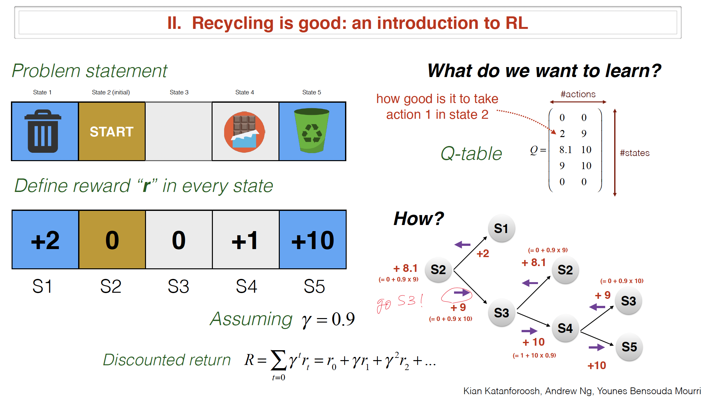
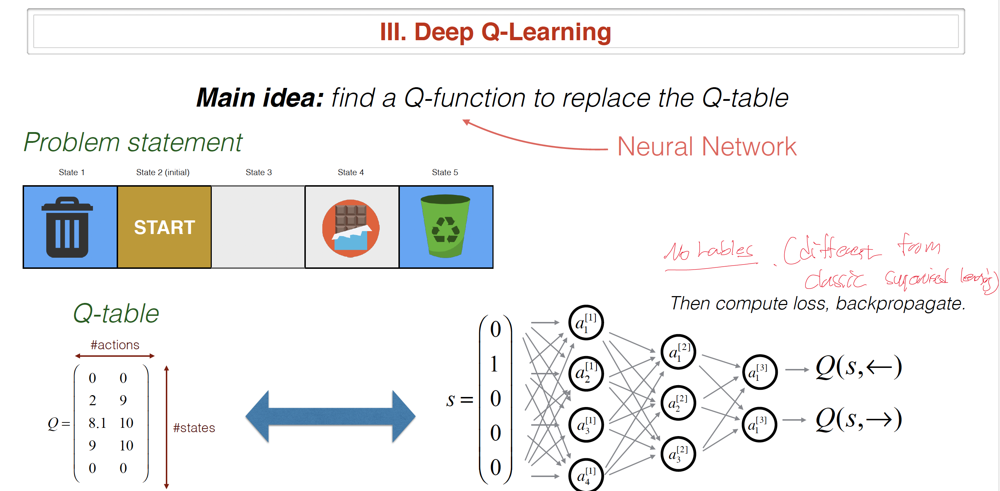
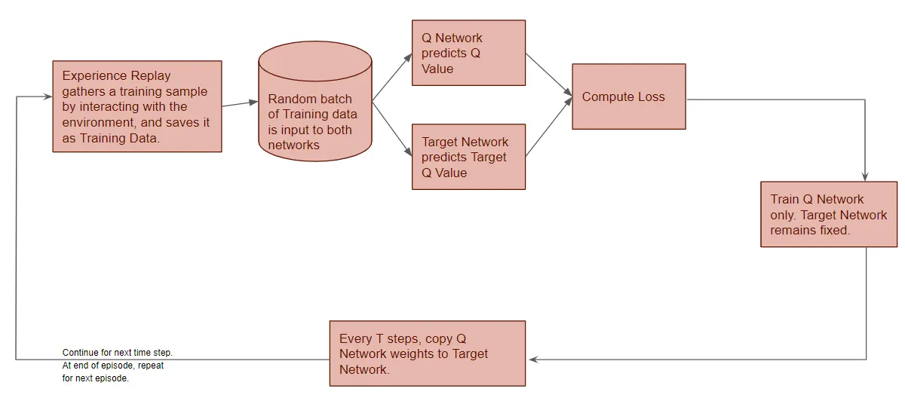
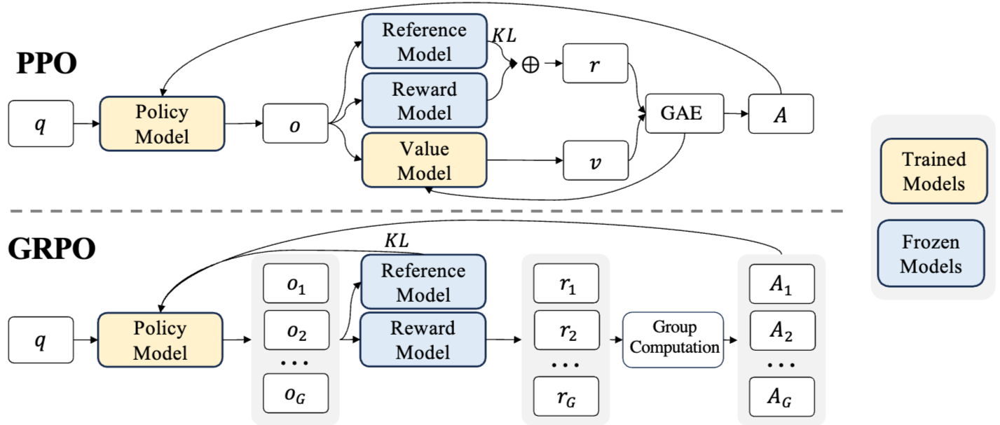

# Reinforcement Learning
Reinforcement Learning(RL) is a branch of machine learning focused on making decisions to maximize cumulative rewards in a given situation. Unlike supervised learning, which relies on a training dataset with predefined answers, RL involves learning through experience.  
In RL, an agent learns to achieve a goal in an uncertain, potentially complex environment by performing actions and receiving feedback through rewards or penalties.

The environment is typically stated in the form of a Markov Decision Process (MDP), as many reinforcement learning algorithms use dynamic programming techniques. 

## Preliminaries

### Episodes
Note that episode a sequence of interactions between an agent and its environment, starting from an initial state and ending at a terminal state.

### Catastrophic Forgetting
Note that Catastrophic interference, also known as catastrophic forgetting, is the tendency of an artificial neural network to abruptly and drastically forget previously learned information upon learning new information.

## Finite-State Machine (FSM)
FSM is a mathematical model of computation. It is an abstract machine that can be in exactly one of a finite number of states at any given time. The FSM can change from one state to another in response to some inputs; the change from one state to another is called a transition.  
An FSM is defined by a list of its states, its initial state, and the inputs that trigger each transition. A state is a description of the status of a system that is waiting to execute a transition. A transition is a set of actions to be executed when a condition is fulfilled or when an event is received. 

### Bellman Equation
The Bellman Equation is a recursive formula used in decision-making and reinforcement learning. It shows how the value of being in a certain state depends on the rewards received and the value of future states.   
The Bellman Equation breaks down a complex problem into smaller steps, making it easier to solve. The equation helps find the best way to make decisions when outcomes depend on a series of actions.
$$
V(s) = \max_{a} \left[ R(s,a) + \gamma \sum_{s'} P(s' | s, a) V(s') \right]
$$
 - $V(s)$ : The value of state $s$, which represents the long-term reward of being in that state.
 - $R(s,a)$ : The immediate reward received for taking action $a$ in state $s$.
 - $\gamma$: The discount factor (between 0 and 1) that determines the importance of future rewards compared to immediate rewards.
 - $ P(s' | s, a)$:  The probability of transitioning to state $s′$ from state $s$ by taking action $a$.
 - $\max_{a}$: The optimal action that maximizes the expected value of future rewards.

#### Bellman Equation vs Dynamic Programming
 - Dynamic Programming: A method to solve optimization problems using subproblem decomposition and memoization.
 - Bellman Equation: A recursive equation that expresses the value of a state based on the values of successor states.

## Credit Assignment Problem
The credit assignment problem (CAP) is a fundamental challenge in reinforcement learning. It arises when an agent receives a reward for a particular action, but the agent must determine which of its previous actions led to the reward.  
The credit assignment problem refers to the problem of measuring the influence and impact of an action taken by an agent on future rewards. The core aim is to guide the agents to take corrective actions which can maximize the reward.  
Putting it simply, how does algorithm know of all the things that the model did before,  what did it well (which it should do more of) and what did it poorly(which it should do less of).

For example, think of car crashes in building self driving car, chances are the car was doing right before the crash would be brake, but it's not braking that causes the crash and it would be something else that caused crash before crash.
Another example, in chess, when the program lost the game at move 50 due to the blunder(bad move) program amde at move 20 and took another 30 moves before the fates was sealed.

## Markov Decision Processes(MDP)
### Relevance to Reinforcement Learning
MDP is a mathematical framework used to describe an environment in decision making scenarios where outcomes are partly random and partly under the control of a decision-maker(dynamic programing).  
MDP provides a formalism for modeling decision making in situations where outcomes are uncertain, making them essential for Reinforcement Learning. In other words, Reinforcement learning utilizes the MDP framework to model the interaction between a learning agent and its environment. In this framework, the interaction is characterized by states, actions, and rewards.

### Component of MDP
An MDP is defined by a tuple $(S, A, \{ P_{sa} \}, \gamma, R)$ where:

 - States ($S$): A finite set of states representing all possible situations in which the agent can find itself. Each state encapsulates all the relevant information needed to make a decision.
 - Actions ($A$): A finite set of actions available to the agent. At each state, the agent can choose from these actions to influence its environment.
 - Transition Probability ($\{ P_{sa} \}$): A probability function that defines the probability of transitioning from state $s$ to state $s′$ after taking action $a$. This encapsulates the dynamics of the environment. In other words, it gives the distribution over what states($s'$) we will transition to if we take action $a$ in state $s$.
 - Reward Function (R): A reward function $R: S \times A \to \mathbb{R}$ that provides a scalar reward received after transitioning from state $s$ to state $s′$ due to action $a$. This reward guides the agent towards desirable outcomes.
 - Discount Factor ($\gamma$): A discount factor $\gamma \in [0,1)$ that determines the importance of future rewards. A discount factor close to 1 makes the agent prioritize long-term rewards, while a factor close to 0 makes it focus on immediate rewards.
 - Policy($\pi$): A policy is any function $\pi: S \to A$ mapping from the states to the actions. We say that we are executing some policy $\pi$ if, whenever we are in state $s$, we take action $a = \pi(s)$.

### Basics
The dynamics of an MDP proceeds as follows:  
Starting in some state $s_0$, and choose some action $a_0 \in A$ to take in the MDP. As a result of our choice, the state of the MDP randomly transitions to some successor state $s_1$, drawn according to $s_1 \sim P_{s_0 a_0}$.  
Then, pick another action $a_1$. As a result of this action, the state transitions again, now to some $s_2 \sim P_{s_1 a_1}$. We then pick $a_2$, and so on...  
If you put it into picture, it will be as below.
$$
s_0 \xrightarrow{a_0} s_1 \xrightarrow{a_1} s_2 \xrightarrow{a_2} s_3 \xrightarrow{a_3} \cdots
$$
Upon visiting the sequence of states $s_0, s_1, \cdots$ with actions $a_0,a_1, \cdots$ our total payoff is given by,
$$
R(s_0, a_0) + \gamma R(s_1, a_1) + \gamma^2 R(s_2, a_2) + \cdots
$$

Note that Rewards are sometimes also written as a function of a state $s$ only, in which case we would have $R: S \to \mathbb{R}$ from Now on. So, the total payoff is expressed as below.
$$
R(s_0) + \gamma R(s_1) + \gamma^2 R(s_2) + \cdots
$$
From now, we are writing rewards as a function of the states only. More general setting which is function with both states and actions, will be introduced in the latter section "Generalized State-Action Reward".

In Reinforcement Learning, the goal is to choose actions over time so as to maximize the expected value of the total payoff:
$$
\mathbb{E} \left[ R(s_0) + \gamma R(s_1) + \gamma^2 R(s_2) + \cdots \right]
$$

Now, let's define the value function for a policy $\pi$.  
$V^{\pi}(s)$ is simply the expected sum of discounted rewards upon starting in state $s$, and taking actions according to a fixed policy $\pi$.

$$
V^{\pi}(s) = \mathbb{E} \left[ R(s_0) + \gamma R(s_1) + \gamma^2 R(s_2) + \cdots \mid s_0 = s, \pi \right]
$$

This can be also expressed as,
$$
V^{\pi}(s) = \mathbb{E} \left[ R(s_0) + \gamma (R(s_1) + \gamma R(s_2) + + \gamma^2 R(s_3)\cdots) \mid s_0 = s, \pi \right]
$$
Now you can see that  value function $V^{\pi}(s)$ satisfies the Bellman equations as below.
$$
V^{\pi}(s) = R(s) + \gamma \sum_{s' \in S} P_{s \pi(s)}(s') V^{\pi}(s').
$$
Where $s$ is current state and $s'$ is the state after one step.
As you can see there are two terms in the equation.
 - $R(s)$: immediate reward that we get rightaway simply for starting in state $s$. 
 - $\sum_{s' \in S} P_{s \pi(s)}(s') V^{\pi}(s')$: the expected sum of future discounted rewards.  

The second term can be interpreted as below which is the expected sum of discounted rewards for starting in state $s′$.  
$$\mathbb{E}_{s' \sim P_{s\pi(s)}} \left[ V^{\pi}(s') \right]$$
Where $s'$ is distributed according $P_{s \pi(s)}(s')$, which is the distribution over where we will end up "after" taking the first action $\pi(s)$ in the MDP from state $s$.  
Therefore the second term gives the expected sum of discounted rewards obtained "after" the first step in the MDP.

### Optimal Value Function and Optimal Policy
From the value functions above $V^{\pi}(s)$, we define the optimal value function is,
$$
V^*(s) = \max_{\pi} V^{\pi}(s).
$$
This is the best possible expected sum of discounted rewards that can be attained using any policy. There is Bellman's Equations version of optimal value function as below.
$$
V^*(s) = R(s) + \max_{a \in A} \gamma \sum_{s' \in S} P_{sa}(s') V^*(s').
$$
From the above equation first term $R(s)$ is an immediate reward like the value function before.  
The second term is the maximum over all actions $a$ of the expected future sum of discounted rewards we’ll get upon after action $a$. Meaning that it finds the maximum possible expected value over all actions $a \in A$.

There is also optimal policy which is the best action should be taken from state $s$.
$$
\pi^*(s) = \arg\max_{a \in A} \sum_{s' \in S} P_{sa}(s') V^*(s')
$$
Note that $\pi^*(s)$ gives the action $a$ that attains the maximum in the second term in $V^*(s)$ (which is $\sum_{s' \in S} P_{sa}(s') V^*(s')$).

Note that $\pi^*(s)$ has the interesting property that it is the optimal policy for all states $s$.  
Therefore, it is "not" the case that if we were starting in some state $s$ then there’d be some optimal policy for that state, and if we
were starting in some other state $s′$ then there’d be some other policy that’s optimal policy for $s′$.  
The same policy $\pi^*(s)$ attains the maximum in value function for all states $s$. This means that we can use the same policy $\pi^*(s)$ no matter what the initial state of our MDP is.

It is a fact that for every state $s$ and every policy $\pi$, 
$$
V^*(s) = V^{\pi^*}(s) \geq V^{\pi}(s).
$$
Which means that value function for optimal policy $V^{\pi^*}(s)$ is equal to the optimal value function $V^*(s)$ for every state $s$. 

### Value Iteration
One efficient algorithm for solving finite-state MDP is value iteration.  
1. For each state $s$, initialize $V(s) := 0$.
2. Repeat until convergence:  
{  
    For every state, update $V(s) := R(s) + \max_{a \in A} \gamma \sum_{s' \in S} P_{sa}(s') V^*(s')$   
}  

In value iteration, the $\pi$ function is not used and instead value function is used.
This can be interpreted as repeatedly trying to update the estimated value function using Bellman Equations.  So more precisely, 
$$
V_{k+1}(s)
\;=\;
R(s)
\;+\;
\gamma\;
\max_{a\in A}
\sum_{s'} P_{s a}(s')\,V_{k}(s').
$$
Note that each new estimate $V_{k+1}(s)$ is defined with the current estimates 
$V_{k}(s)$ on the right-hand side. In other words, you keep applying this Bellman-update operator until the entire vector $V_{k}$ stops changing (converges).  So the recursion is not a separate process for every possible starting state; there is one global value function $V$ that is repeatedly fed back into its own right-hand side.  

Also there are two ways of performing the updates.
 - Synchronous Update: compute the new values for $V(s)$ for every state $s$, and then overwrite all the old values with the new values.
 - Asynchronous Update: loop over the states (in some order) and update the values one at a time.

Under either synchronous or asynchronous updates, value iteration will cause $V$ to converge to $V∗$.
With the optained $V∗$, we can then use find the optimal policy as the equation shown above $\pi^*(s) = \arg\max_{a \in A} \sum_{s' \in S} P_{sa}(s') V^*(s')$.

### Policy Iteration
Apart from value iteration, there is a second standard algorithm for finding an optimal policy for an MDP which is policy iteration.
1. Initialize $\pi$ randomly.
2. Repeat until convergence:  
{   
    a. Let $V := V^{\pi}$.  
    b. For each state $s$, let $\pi(s) := \arg\max_{a \in A} \sum_{s' \in S} P_{sa}(s') V^*(s')$   
}

For small MDPs, policy iteration is often very fast and converges with very few iterations.  
However, for MDPs with large state spaces, solving for $V^{\pi}$ explicitly would involve solving a large system of linear equations, and could be difficult. 

### Value Iteration vs Policy Iteration
 - VI: Solve for the $V^{*}$ first, then compute $\pi^*(s)$.
 - PI: Solve Come up with the new policy on every single iteration.   

For small MDPs, policy iteration is often very fast and converges with very few iterations.  
However, for MDPs with large state spaces, solving for $V^{\pi}$$ explicitly would involve solving a large system of linear equations, and could be difficult. In these problems, value iteration may be preferred.

### MDP Model Learning
In many realistic problems, we are not given state transition probabilities and rewards explicitly,
but must instead estimate them from data. ($S$, $A$ and $\gamma$)  
Given this “experience” in the MDP consisting of a number of trials, we can then easily derive the maximum likelihood estimates for the state transition probabilities as below.  
$$
P_{sa}(s') = \frac{\# \text{times took action } a \text{ in state } s \text{ and got to } s'}
{\# \text{times we took action } a \text{ in state } s}
$$
Or, if the ratio above is “0/0”—corresponding to the case of never having taken action $a$in state $s$ before. then we might simply estimate $P_{sa}(s') = \frac{1}{|S|}$.   
Using a similar procedure, if reward function $R$ is unknown, we can also pick our estimate of the expected immediate reward $R(s)$ in state $s$ to be the average reward observed in state $s$.

Having learned a model for the MDP, we can then use either value iteration or policy iteration to solve the MDP using the estimated transition probabilities and rewards.

If putting together model learning ane value iteration(or it can be policy iteation), we can have an algorithm for learning ina an MDP with unknown state transition probabilities.

1. Initialize $\pi$ randomly.
2. Repeat {  
(a) Execute $\pi$ in the MDP for some number of trials.  
(b) Using the accumulated experience in the MDP, update our estimates for $P_{sa}$ (state transition probabilities) (and reward function $R$, if possible).  
(c) Apply value iteration with the estimated state transition probabilities and rewards to get a new estimated value function $V$ .  
(d) Update $\pi$ to be the greedy policy with respect to $V$ .  
}

### Exploration vs Exploitation in RL(MDP) - Exploration–Exploitation dilemma,
Exploitation involves choosing the best option based on current knowledge of the system (which may be incomplete or misleading), while exploration involves trying out new options that may lead to better outcomes in the future at the expense of an exploitation opportunity.  
Finding the optimal balance between these two strategies is a crucial challenge in many decision-making problems whose goal is to maximize long-term benefits.

#### Epsilon-Greedy Algorithm in RL(MDP)
Epsilon-Greedy is a simple method to balance exploration and exploitation by choosing between exploration and exploitation randomly.
The epsilon-greedy, where epsilon refers to the probability of choosing to explore, exploits most of the time with a small chance of exploring.   
For example, at action time $t$, one can take an action $a$ to maximize current reward(greedy with respect to $v$) with probability of $1-\epsilon$, and otherwise you can take an random action with probability of $\epsilon$.

## Continuous State MDPs
We now discuss algorithms for MDPs that may have an infinite number of states, instead of a finite number of states.  
The one simplest way to solve a continuous-state MDP is to discretize the state space, and then to use an algorithm like value iteration or policy iteration, as described previously.  
The alternative method for finding policies in continuous state MDPs, in which we approximate $V^{*}$ directly, without resorting to discretization. 

### Discretization
Discretization is the process of transferring continuous functions, models, variables, and equations into discrete counterparts. 
연속적인 함수, 모델, 변수, 방정식을 이산적인 구성요소로 변환하는 프로세스이다. 이 프로세스는 일반적으로 디지털 컴퓨터에서 수치적 평가 및 구현에 적합하도록 하는 첫 단계로 수행된다.

#### Downsides of Discretization in Continuous State MDPs
First, It is a fairly naive representation for value function ($V$) and policy($\pi$). We need a very fine discretization (very small grid cells) to get a
good approximation.  
Second, because of the curse of dimensionality.  
Suppose $S = \mathbb{R}^{n}$, and we discretize each of the $n$ dimensions of the state into $k$ values. Then the total number of discrete states we have is $k^{n}$.  
This grows exponentially quickly in the dimension of the state space $n$, and thus does not scale well to large problems.  
For example, with a $10$-d state, if we discretize each state variable into $100$ values, we would have $100^{10} = 1020$ discrete states, which is far too many to represent.  
Therefore, as a rule of thumb, discretization usually works extremely well for $1$-d and $2$-d problems, but very rarely works for problems with any higher dimensional.

### Value Function Approximation
The alternative method for finding policies in continuousstate MDPs, in which we approximate $V^{*}$ directly, without resorting to discretization.  
In linear regression, you can approximate $y$ as a linear function of $x$ as below.
$$
y \approx \theta^T \phi(x), \quad \text{where } \phi(x) = \text{feature of } x =  \begin{bmatrix} x_1 \\ x_2 \\ \vdots \\ x_i^k \end{bmatrix}
$$
Fitted Value Iteration is a model approxmiate $V^*$ of state $s$ as a linear function of the state.
$$
 V^*(s) \approx \theta^T \phi(s)
$$

#### Model(Simulator)
A Model (or simulator) is a black-box that takes as input any (continuous-valued) state $s_t$ and action $a_t$, and outputs a next-state $s_{t+1}$ sampled according to the state transition probabilities $P_{s_ta_t}$.  
You can get a model by using the laws of physics calculate or use open-source software simulator, but we will get a mode by learning from the data collected in the MDP. Let's suppose  execute $m$ trials in which we repeatedly take actions in an MDP, each trial for $T$ timesteps. This can be done picking actions at random, executing some specific policy, or via some other way of choosing actions. Then we can observe $m$ state sequences like the following:
$$
\begin{aligned}
    &s_0^{(1)} \xrightarrow{a_0^{(1)}} s_1^{(1)} \xrightarrow{a_1^{(1)}} s_2^{(1)} \xrightarrow{a_2^{(1)}} \dots \xrightarrow{a_{T-1}^{(1)}} s_T^{(1)} \\
    &s_0^{(2)} \xrightarrow{a_0^{(2)}} s_1^{(2)} \xrightarrow{a_1^{(2)}} s_2^{(2)} \xrightarrow{a_2^{(2)}} \dots \xrightarrow{a_{T-1}^{(2)}} s_T^{(2)} \\
    &\vdots \\
    &s_0^{(m)} \xrightarrow{a_0^{(m)}} s_1^{(m)} \xrightarrow{a_1^{(m)}} s_2^{(m)} \xrightarrow{a_2^{(m)}} \dots \xrightarrow{a_{T-1}^{(m)}} s_T^{(m)}
\end{aligned}
$$
We can then apply a supervised learning algorithm to predict $s_{t+1} $ as a function of $s_t$ and $a_t$.
For example, with the parameter matrices $A$ and $B$, you can choose a linear model of the below form.
$$
s_{t+1} = A s_t + B a_t,
$$
We can estimate them using the data collected from $m$ trials,
$$
\arg\min_{A,B} \sum_{i=1}^{m} \sum_{t=0}^{T-1} \left\| s_{t+1}^{(i)} - \left( A s_t^{(i)} + B a_t^{(i)} \right) \right\|^2
$$
Note that this corresponds to maximum likelihood estimate.

##### Deterministic Model
Having learned $A$ and $B$, you can build deterministic model, in which given an input $s_t$ and $a_t$, the output $s_{t+1}$ is exactly determined as above equation.
$$
s_{t+1} = A s_t + B a_t,
$$

##### Stochastic Model
 Or you can build a stochastic model, in which $s_{t+1}$ is a random function of the inputs, by modelling it as
$$
s_{t+1} = A s_t + B a_t + \epsilon_t
$$
Where $\epsilon_t$ is a noise term, usually modeled as $\epsilon_t \sim \mathcal{N}(0, \Sigma)$.  
The reason why adding noise is that without noise(= deterministirc model) algorithm might work in the simulator but not in real time. This is because your simulator can never be 100% accurate so adding noise to the simulator can make more robust policy out of the model. So the odds of generalizaing to real time is much higher.

##### Model-Based RL vs Model-Free RL
 - Model-Based RL: Build a model and train the algorithm in the model. Then, take the policy learned from the model and apply it to the real time.
 - Model-Free RL: Run learning algorithm on the real time directly.

#### Fitted Value Iteration
Let's recall the value iteration from discrete MDP from above section, which repeat below equation until convergence.  
$$
V_{k+1}(s)
\;=\;
R(s)
\;+\;
\gamma\;
\max_{a\in A}
\sum_{s'} P_{s a}(s')\,V_{k}(s')
$$
 - The first term $R(s)$: An immediate reward that we get rightaway simply for starting in state $s$.
 - The second term: The maximum over all actions $a$ of the expected future sum of discounted rewards we’ll get upon after action $a$. (the expected sum of future discounted rewards)
 - Value Function $V(s)$: Expected payoff from the state $s$(expected sum of discounted reward)

However, since now we are now dealing with the continous states rather than discrete states, we have to use integral over states instead of summation. 
$$
V(s) \coloneqq R(s) + \gamma \max_{a} \int_{s'} P_{sa}(s') V(s') \,ds' \\ 
= R(s) + \gamma \max_{a} \mathbb{E}_{s' \sim P_{sa}} \left[ V(s') \right]
$$

The main idea of fitted value iteration is that we are going to approximately carry out this step, over a finite sample of states $s^{(1)}, \cdots, s^{(m)}$.  
What do you mean by approximately carry out? It means that we will use a supervised learning algorithm(linear regression as shown below) to approximate the value function $V(s)$ as a linear or non-linear function of the sampled $m$ states:
$$
V(s) = \theta^T \phi(s).
$$
Where $\phi(s)$ is a feature mapping of state $s$.

##### Algorithm of Fitted Value Iteration
1. Randomly sample $m$ states $s^{(1)}, s^{(2)}, \cdots,  s^{(m)} \in S$. 
2. Initialize $\theta := 0$. 
3. Repeat  
{  
&emsp;For $i = 1, \cdots ,m$, {  
&emsp;&emsp;For each action $a \in A$  {  
&emsp;&emsp;&emsp;Sample $s'_1, \cdots, s'_k ∼ P_{s^{(i)}a}$ (using a model of the MDP)  
&emsp;&emsp;&emsp;Set $q(a) = \frac{1}{k} \sum_{j=1}^{k} R(s^{(i)}) + \gamma V(s'_j)$  
&emsp;&emsp;}  
&emsp;&emsp;Set $y^{(i)} = \max_{a} q(a)$.  
&emsp;&emsp;}  
$\theta := \arg\min_{\theta} \frac{1}{2} \sum_{i=1}^{m} \left( \theta^T \phi(s^{(i)}) - y^{(i)} \right)^2$  
}

From above, $q(a)$ is an estimate of $R(s^{(i)}) + \gamma \mathbb{E}_{s' \sim P_{s^{(i)} a}} \left[ V(s') \right]$. This is because,
$$
R(s^{(i)}) + \gamma \mathbb{E}_{s' \sim P_{s^{(i)} a}} \left[ V(s') \right] = \mathbb{E}_{s' \sim P_{s^{(i)} a}} \left[R(s^{(i)}) + \gamma V(s') \right]
$$
And since we don’t know the exact transition probabilities, we approximate this expectation using sampled next states $s'_j$.
In short, $q(a)$ is an estimate of the expected future due to approximation via sampling and $y^{(i)}$ is the best $q(a)$ for this state.
$$
q(a) = R\!\bigl(s^{(i)}\bigr) + \gamma\,\mathbb{E}_{\,s' \sim P_{s^{(i)}a}}\!\bigl[\,V(s')\,\bigr] \\[6pt]
y^{(i)} = R(s^{(i)}) + \gamma \max_{a} \mathbb{E}_{s' \sim P_{s^{(i)} a}} \left[ V(s') \right]
$$

Since we defined value function as a linear or non-linear function of the sampled $m$ states, $V(s^{(i)}) =  \theta^T \phi(s^{(i)})$ and we want $V(s^{(i)}) \approx y^{(i)}$, we’ll be using supervised learning (linear regression).  
$$
\theta := \arg\min_{\theta} \frac{1}{2} \sum_{i=1}^{m} \left( \theta^T \phi(s^{(i)}) - y^{(i)} \right)^2
$$
##### Policy of Fitted Value Iteration
Finally, fitted value iteration algorithm outputs $V$ , which is an approximation to $V^{*}$. This implicitly defines our policy because now we have value function $V$.    
Specifically, when our system is in some state s, and we need to choose an action, we would like to choose the action to get optimal policy $\pi^{*},$
$$
\pi^*(s) = \arg\max_{a} \mathbb{E}_{s' \sim P_{s a}} \left[ V(s') \right]
$$
 The process for computing/approximating this is similar to the inner-loop of f itted value iteration, where for each action, we sample $s'_1, \cdots, s'_k ∼ P_{s^{(i)}a}$ to approximate the expectation.

#### In Real Time
You can represent the simulator as, 
$$
s_{t+1} = f(s_t, a_t) + \epsilon_t
$$
Where $f$ is some deterministirc function $f(s_t, a_t) = A s_t + B a_t$ and $\epsilon$ is noise.  
So if you want to use deterministic simulator you have to set nose $\epsilon =0$ and set $k=1$ where $k$ is sampling algorithim from fitted value iteration.  
This is because you are sampling from the expectation over a deterministic distribution, so a single example is sufficient to exactly compute that expectation. (Because no matter how many you sample, result is same in deterministic function)

In real time you don't want the to random sample, because it generates random value and some unlucky value might be very critical.

- Model: Use Stochastic Model.  
$$S_{t+1} = f(S_t, a_t) + \epsilon_t \quad \text{(e.g., } A s_t + B a_t + \epsilon_t \text{)}
$$
- In Real:
Set $\epsilon_t = 0 $ and sampling number $k = 1$.  In other word,  
When in state $s$, pick action, $$\arg\max_{a} V(f(s, a))$$ (Simulator without noise)

During training, add noise to the simulator because it causes the policy you learned to be more robust,
But when deploying in real, it is reasonable to get rid of the noise and set $k=1$ to avoid randomness.

## Generalized State-Action Reward
In this part, we will define Markov Decision Processes (MDPs) and Value Iteration / Policy Iteration covered previoysly, in a more general setting.  

(1) We want to write equations that make sense for both the discrete and
the continuous case. So In the finite case, we can rewrite the expectation as a sum over
states, and the continuous case, we can rewrite the expectation as an integral.
$$
\mathbb{E}_{s' \sim P_{sa}}\!\Bigl[\,V^{\pi^{*}}(s') \Bigr] \quad \text{instead of} \sum_{s' \in S} P_{sa}(s')\,V^{\pi^{*}}(s')
$$
(2) The rewards depend on both states and actions. In other words, $R: S \times A \to \mathbb{R}$. Note that $s$ is current state and $s'$ is the state after one step.

$$
\pi^{*}(s)
  \;=\;
  \arg\max_{a \in \mathcal{A}}
  \Bigl\{R(s,a) + \gamma \, \mathbb{E}_{s' \sim P_{sa}} \!\bigl[V^{\pi^{*}}(s') \bigr] \Bigr\} \\[10pt]

V(^{*}s)
  \;=\;
  \max_{a \in \mathcal{A}}
  \Bigl\{
       R(s,a)
       + \gamma \,
         \mathbb{E}_{s' \sim P_{sa}}
         \!\bigl[
              V^{*}(s')
           \bigr]
  \Bigr\},
$$

(3) Instead of considering an infinite horizon MDP, we'll assume that we have a finite horizon MDP with the time horizon as below. Note that there is no discount factor $\gamma$ as the payoff is a finite sum.
$$
R(s_{0}, a_{0}) + R(s_{1}, a_{1}) + \cdots +  R(s_{T}, a_{T})
$$

With time horizn, the optimal policy might be non-stationary, meaning that it changes over time. Why does the optimal policy happen to be non-stationary in the finite-
horizon setting? Intuitively, as we have a  nite numbers of actions to take, we might want to adopt di erent strategies depending on where we are in the environment and how much time we have left.
$$
\pi^{(t)} : \mathcal{S} \;\to\; \mathcal{A}
$$  

(4) Lastly, time dependent dynamics is applied. It means that the transition's distribution $P^{(t)}_{\,s_t,\,a_t}$ changes over time. The same thing can be said about $R(t)$. Note that this setting is a better model for real life. In a car, the gas tank empties, trac changes,etc.
$$
s_{t+1} \sim P^{(t)}_{\,s_t,\,a_t}
$$

#### Optimal Value Function in Generalized State-Action Reward
Now, these settings, how do we find the optimal value function? Note that now optimal value function depnds on what time it is. In other words, optimal value function is expected total payoff, starting in state $s$ at time $t$, executing $\pi^{*}$.
$$
 V^{*}_{t}(s) = \max_{\pi}\,V^{\pi}_{t}(s) \\[6pt]
 = \mathbb{E} \Bigl[ R^{(t)}(s_{t},a_{t}) + R^{(t+1)}(s_{t+1},a_{t+1}) + \;\cdots\; + R^{(T)}(s_{T},a_{T})v \,\Bigm|\, s_{t}=s,\; \pi^{*} \Bigr]
$$
We will use dynamic programming to find optimal value function in time horizaon.

$$
\text{(1)} \quad \forall\,s \in \mathcal{S} :\quad
V_{T}^{*}(s) = \max_{a \in \mathcal{A}} \,R^{(T)}(s,a) \\[6pt]

\text{(2)} \quad \forall\,t < T,\; s \in \mathcal{S} :\quad
V_{t}^{*}(s) = \max_{a \in \mathcal{A}} \Bigl[R^{(t)}(s,a) + \mathbb{E}_{s' \sim P_{sa}^{(t)}} \!\bigl[V_{t+1}^{*}(s')\bigr]\Bigr]
$$
(1): The optimal value is obvious at the end of the game (for time step $T$).  
(2): For another time step $0 \leq t < T$, if we suppose that we know the
optimal value function for the next time step $V^{*}_{T+1}(s)$, we can define $V_{t}^{*}(s)$.

In short,
1. Compute $V_{t}^{*}(s)$ using equation (1).
2. for $t = T-1, \cdots, 0$, compute $V_{t}^{*}(s)$ using $V_{t+1}^{*}(s)$ using equation (2).

## Linear Dynamical System

## Linear Quadratic Regulation(LQR)
While solving the dynamic programming problem for continuous systems is very hard in general, there are a few very important special cases where the solutions are very accessible. Most of these involve variants on the case of linear dynamics and convex (e.g. positive quadratic) cost. The simplest case, called the linear quadratic regulator (LQR), is formulated as stabilizing a time-invariant linear system to the origin.

### Ket Assumptions of LQR
1. State Transition Dynamics: the way states change in a linear function of the previous state and action plus some noise.
$$
s_{t+1} \;=\; A_t\,s_t \;+\; B_t\,a_t \;+\; w_t \\[10pt]
\mathcal S \;=\; \mathbb R^{\,n}, \quad \mathcal A \;=\; \mathbb R^{\,d}, \quad
A_t \;\in\; \mathbb R^{\,n\times n}, \quad
B_t \;\in\; \mathbb R^{\,n\times d}, \quad 
w_t \;\sim\; \mathcal N\!\bigl(0,\Sigma_t\bigr)
$$
2. Reward Function: quadratic cost function.
$$
R^{(t)}(s_t,a_t) = -\,s_t^{\!\top} U_t\,s_t - a_t^{\!\top} W_t\,a_t \\[6pt]
U_t \;\in\; \mathbb R^{\,n\times n},\quad
W_t \;\in\; \mathbb R^{\,d\times d},\\[6pt]
U_t \geq 0,\; W_t \geq 0, \quad
s_t^{\!\top} U\,s_t \;\ge 0, \quad
a_t^{\!\top} V\,a_t \;\ge 0
$$
Where $U_t$ and $W_t$ are positive definite matrices.

### Linearization of dymanics in LQR

Let's suppose that at time $t$, the system spends most of its time in some state $\bar{s_t}$ and the actions we perform are around $\bar{at}$. So the idea of this linearization of non linear dynamics is that if you expect the system to spend most of time at ($\bar{s_t}$, $\bar{a_t}$), $F'$ is not bad approximation around the region ($\bar{s_t}$, $\bar{a_t}$).

Using Taylor Series, $f(x) = \sum_{n=0}^{\infty} \frac{f^{(n)}(a)}{n!} (x - a)^n$, we get,
$$
s_{t+1} \approx
F\bigl(\bar s_t,\bar a_t\bigr)
+ \nabla_{s} F\bigl(\bar s_t,\bar a_t\bigr)\,\bigl(s_t - \bar s_t\bigr)
+ \nabla_{a} F\bigl(\bar s_t,\bar a_t\bigr)\,\bigl(a_t - \bar a_t\bigr)
$$
As you can see, now, $s_{t+1}$ is linear in $s_t$ and $a_t$. This could be rewritten as below. 
$$
s_{t+1} \approx A\,s_t + B\,s_t + \kappa
$$
This is similar to the assumptions made for LQR, except for the $\kappa$ term, which is constant term. It turns out that the constant term can be absorbed into $s_t$ by artificially increasing the dimension by one.

### LQR Algorithm
There are two steps of the LQR algorithm.  
1. Figure out the parameters. (Matrices $A,B,\Sigma$)
2. Derive the optimal policy using dynamic programming with the parameters earned from 1.

#### 1. Figure out the parameters
There are two ways to figure out the parameters. 
1. First way is to just learn it as following the idea of "Value function approximation". So collect the data and fit the model.
$$
\arg\min_{A,B} \sum_{i=1}^{m} \sum_{t=0}^{T-1} \left\| s_{t+1}^{(i)} - \left( A s_t^{(i)} + B a_t^{(i)} \right) \right\|^2
$$
And use GDA method to get $\Sigma$.
$$
\Sigma = \frac{1}{m} \sum_{i=1}^{m} \bigl(x^{(i)} - \mu_{y^{(i)}}\bigr) \bigl(x^{(i)} - \mu_{y^{(i)}}\bigr)^{\!\top}
$$
2. Second way to figure out the parameters is to "Linearization of dymanics in LQR".

#### 2. Derive the optimal policy using dynamic programming
Assuming that the parameters of our model are known (given or estimated with step 1), we can derive the optimal policy using dynamic programming.

So we want to comput $V_{t}^{*}$ using dynamic programming given below.
$$
s_{t+1} = A_t\,s_t \;+\; B_t\,a_t \;+\; w_t \quad \bigl(A_t,\,B_t,\,U_t,\,W_t,\,\Sigma_t\text{ known}\bigr)\\[6pt]
R^{(t)}(s_t,a_t) = -\,s_t^{\!\top} U_t\,s_t \;-\; a_t^{\!\top} W_t\,a_t
$$

##### 2-1. Initialization Step  
For the last time step $T$,
$$
V_T^{*}(s_T)
  = \max_{a_T \in \mathcal{A}} R_T(s_T,a_T)
  = \max_{a_T \in \mathcal{A}} \bigl( -\,s_T^{\top} U_T s_T - a_T^{\top} W_T a_T \bigr)
  = -\,s_T^{\top} U_T s_T
$$
Note that maximized for $a_T = 0$.

##### 2-2. Recurrence Step
When $t <T$, suppose we know $V^{*}_{t+1}$, if $V^{*}_{t+1}$ is a quadratic function in $s_t$, then $V^{*}_{t}$ is also a quadratic function. In other words, there exists some matrix $\Phi$ and some scalar $\Psi$ such that,
$$
V_{t+1}^{*}(s_{t+1}) = s_{t+1}^{\top} \Phi_{t+1} s_{t+1} + \Psi_{t+1} \Rightarrow V_{t}^{*}(s_{t}) = s_{t}^{\top} \Phi_{t} s_{t} + \Psi_{t}
$$
So if $t=T$, $\Phi_{t} = -s_T^{\top} U_T s_T$ and $\Psi_{t} = 0$.

Now, since $V^{*}_{t+1}$ is composed of $\Phi_{t+1}$ and $\Psi_{t+1}$, if we know how to derive $\Phi_{t}, \Psi_{t+1}$ from  $\Phi_{t+1}, \Psi_{t+1}$, we can get $V^{*}_{t}$.

$$
V_t^{*}(s_t) = s_t^{\top} \Phi_t s_t + \Psi_t \\[6pt]
  = \max_{a_t} \Bigl[\, R^{(t)}(s_t,a_t)
      + \mathbb{E}_{\,s_{t+1}\sim P_{s_t,a_t}^{(t)}}\bigl[\, W_{t+1}^{*}(s_{t+1}) \bigr] \Bigr] \\[6pt]
  = \max_{a_t} \Bigl[
        -\,s_t^{\top} U_t s_t
        - a_t^{\top} W_t a_t
        + \mathbb{E}_{\,s_{t+1}\sim\mathcal{N}(A_t s_t + B_t a_t,\Sigma_t)}
          \bigl[\, s_{t+1}^{\top} \Phi_{t+1} s_{t+1} + \Psi_{t+1} \bigr]
      \Bigr]
$$

Note that expectation term can be calculated as below.
$$
s_{t+1}^{\top}\Phi_{t+1}s_{t+1} + \Psi_{t+1}
  = (A_t s_t + B_t a_t + w_t)^{\top}\Phi_{t+1}(A_t s_t + B_t a_t + w_t) \\[4pt]
  = (A_t s_t + B_t a_t)^{\top}\Phi_{t+1}(A_t s_t + B_t a_t) \\[2pt]
  \phantom{=} + 2\,(A_t s_t + B_t a_t)^{\top}\Phi_{t+1}w_t \\[2pt]
  \phantom{=} + w_t^{\top}\Phi_{t+1}w_t + \Psi_{t+1} \\[10pt]
$$
Note that, 
$$
s_{t+1} = A_t s_t + B_t a_t + w_t ,\quad
w_t \sim \mathcal{N}(0,\Sigma_t) \\[6pt]
s_{t+1} \sim \mathcal{N}\!\bigl(A_t s_t + B_t a_t,\Sigma_t\bigr)
\Longleftrightarrow
w_t \sim \mathcal{N}(0,\Sigma_t).
$$
So, $A_t s_t + B_t a_t$ is deterministic from the distribution. Therfore, expectation term can be shown as below.
$$
\mathbb{E}_{s_{t+1}\sim \mathcal{N}(A_t s_t + B_t a_t,\,\Sigma_t)}
  \bigl[\,s_{t+1}^{\top}\Phi_{t+1}s_{t+1} + \Psi_{t+1}\bigr] \\[2pt]
\quad = (A_t s_t + B_t a_t)^{\top}\Phi_{t+1}(A_t s_t + B_t a_t)
        + \operatorname{tr}(\Phi_{t+1}\Sigma_t)
        + \Psi_{t+1}.
$$
Note that it used the facts below.
$$
\mathbb{E}_{w_t}\!\bigl[\, (A_t s_t + B_t a_t)^{\top}\Phi_{t+1}w_t \bigr] = 0
\qquad (\mathbb{E}[\,w_t\,] = 0) \\[6pt]

\mathbb{E}_{w_t}\!\bigl[w_t^{\top}\Phi_{t+1}w_t\bigr]
  = \operatorname{tr}\!\bigl(\Phi_{t+1}\,\mathbb{E}[\,w_t w_t^{\top}\,]\bigr)
  = \operatorname{tr}(\Phi_{t+1}\Sigma_t)
$$

Now, using the expectation term, third line can be expressed as,
$$
\max_{a_t} \Bigl[
-\,s_t^{\top} U_t s_t
-a_t^{\top} W_t a_t + \mathbb{E}_{\,s_{t+1}\sim\mathcal{N}(A_t s_t + B_t a_t,\Sigma_t)} \bigl[\, s_{t+1}^{\top} \Phi_{t+1} s_{t+1} + \Psi_{t+1} \bigr] = \\[6pt]
\max_{a_t} \Bigl[
-\,s_t^{\top} U_t s_t
- a_t^{\top} W_t a_t \\[3pt]
+ s_t^{\top} A_t^{\top} \Phi_{t+1} A_t s_t
+ s_t^{\top} A_t^{\top} \Phi_{t+1} B_t a_t
+ \,a_t^{\top} B_t^{\top} \Phi_{t+1} A_t s_t
+ a_t^{\top} B_t^{\top} \Phi_{t+1} B_t a_t \\[3pt]
+ \operatorname{tr}\!\bigl(\Phi_{t+1} \Sigma_t\bigr)
+ \Psi_{t+1}
\Bigr]
$$

Take derivate of below term with respect to $a_t$ and set $0$ to solve for $a_t$.
$$ 
-a_t^{\top} W_t a_t + \mathbb{E}_{\,s_{t+1}\sim\mathcal{N}(A_t s_t + B_t a_t,\Sigma_t)} \bigl[\, s_{t+1}^{\top} \Phi_{t+1} s_{t+1} + \Psi_{t+1} \bigr]
$$
Then, you can get $a_t^{*}$ as below.
$$
\pi_t^{*}(s_t) = a_t^{*}
  = \bigl[(B_t^{\top}\Phi_{t+1}B_t - W_t)^{-1}\,B_t\Phi_{t+1}A_t\bigr]\,s_t
  = L_t\,s_t, \\[6pt]
  a_t^{*} = \bigl[(B_t^{\top}\Phi_{t+1}B_t - W_t)^{-1}\,B_t\Phi_{t+1}A_t\bigr]
$$

Now insert $a_t^{*}$ back to third line expression of $V_t^{*}(s_t)$.
$$
V_t^{*}(s_t)
  = s_t^{\top}\!\Bigl(
      A_t^{\top}\Phi_{t+1}A_t
      - A_t^{\top}\Phi_{t+1}B_t\,
        \bigl(B_t^{\top}\Phi_{t+1}B_t - W_t\bigr)^{-1}
        B_t^{\top}\Phi_{t+1}A_t
      - U_t
    \Bigr)s_t
  - \operatorname{tr}\!\bigl(\Sigma_t\Phi_{t+1}\bigr)
  + \Psi_{t+1}

$$
Note that, argmax term disappears since we  have found the optimizer $a_t^{*}$. So you can evaluate the cost at that optimizer and thus get the maximal value directly.
$$
V_t^{*}(s_t) = \max_{a_t}\, f(a_t) = f(a_t^{*})
$$

Then, match with the first line expression.
$$
s_t^{\top} \Phi_t s_t + \Psi_t
$$

You can get each $\Phi_t$ and $\Psi_t$.
$$
\Phi_t =
A_t^{\top}\!
\Bigl(\Phi_{t+1} - \Phi_{t+1} B_t \bigl( B_t^{\top} \Phi_{t+1} B_t - W_t \bigr)^{-1} B_t^{\top} \Phi_{t+1}
\Bigr)A_t - U_t \\[6pt]

\Psi_t = - \operatorname{tr}\!\bigl( \Sigma_t \Phi_{t+1} \bigr) + \Psi_{t+1}
$$

One Additional thing to remember here is that $\Phi_t$ depends on neither $\Psi_t$ nor the noise $\Sigma_t$. As $L_t$
is a function of $A_t, B_t, \Phi_{t+1}$. This implies that the optimal policy also does not depend on the noise.  
But $\Psi_t$ does depend on $\Sigma_t$, which implies that $V_t^{*}(s_t)$ depends on $\Psi_t$ (noise).

#### Summary
The LQR algorithm works as follows
1. (if necessary) Estimate parameters $A_t, B_t, \Sigma_t$. (1)
2. Initialize  $\Phi_{t} = -s_T^{\top} U_T s_T$ and $\Psi_{t} = 0$. (2-1)
3. Iterate from $t = T-1, \cdots,  0$ to update $\Phi_t$ and $\Psi_t$ using  $\Phi_{t+1}$ and $\Psi_{t+1}$ (2-2). If there exists a policy that drives the state towards zero, then convergence is guaranteed.

## Differential Dynamic Programming(DDP)

## Linear Quadratic Gaussian(LQG)

## RL Debugging and Diagnostics

## Policy Search Algorithm (Direct Policy Search)
Instead of approximate the value function $V^{\star}$ and learn $\pi^{\star}$, try to find a good $\pi$ directly.
$$
a \approx \pi_{\theta}(s) = \frac{1}{1 + e^{-\theta^{\top}s}}
$$
A stochastic policy search is a function $\pi : \mathcal{S} \times \mathcal{A} \;\to\; \mathbb{R}$, where $\pi(s,a)$ is the probability of taking action $a$ in state $s$, when $ \sum_{a}\pi(s,a) = 1$.
For example, let's think of inverted-pendulum (cart-pole) task.
We use a binary stochastic policy $\pi_{\theta}$ that decides between pushing the cart Right or Left via sigmoid function.  
$$
\pi_\theta\bigl(s,\text{Right}\bigr)
    = \frac{1}{1+\exp\!\bigl(-\theta^{\top}s\bigr)},\qquad
\pi_\theta\bigl(s,\text{Left}\bigr)
    = 1-\frac{1}{1+\exp\!\bigl(-\theta^{\top}s\bigr)}
$$

When State vector is as below, 
$$
s=\begin{pmatrix}
1\\ x_c \\ \dot x_c \\ \theta \\ \dot\theta
\end{pmatrix} \\[6pt]
$$
Given these parameters(weight vectors), inner product $\theta^{\top}s$ for each computation are as below.
$$
\begin{array}{lcl}
\theta=\begin{bmatrix}0\\0\\0\\1\\0\end{bmatrix}
 &\Longrightarrow&
\theta^{\top}s=\theta
\\[6pt]
\theta=\begin{bmatrix}0\\-0.5\\0\\1\\0\end{bmatrix}
 &\Longrightarrow&
\theta^{\top}s=-0.5\,x_c + \theta .
\end{array}
$$
The first one results in the policy depends only on pole angle, while the second one uses both cart position($x_c$) and angle($\theta$).

### Goal of Policy Search
Find the parameter vector $\theta$ so that, when we execute the policy $\pi_{\theta}(s,a)$
the expected cumulative reward from the fixed initial state $s_0$.
$$
\underset{\theta}{\text{maximize}}\;
\mathbb{E}\Bigl[
      R(s_0,a_0) + R(s_1,a_1) + \cdots + R(s_T,a_T)
      \,\Bigm|\, \pi_\theta
\Bigr]
$$
Derive a stochastic gradient ascent algorithm as a function of $\theta$ to maximize the expected return. It is Reinforce algorithm.

### Reinforce Algorithm (Policy Gradient)
Consider below which is expected return for $T=1$.
$$
\max_{\theta}\;
\mathbb{E}_{\tau\sim P_{\theta}}
     \!\Bigl[\,R(s_{0},a_{0}) + R(s_{1},a_{1})\Bigr] 
     \qquad (T=1) \\[6pt]
= \sum_{s_{0},a_{0},s_{1},a_{1}}
      P_{\theta}(s_{0},a_{0},s_{1},a_{1})\,
      \bigl[R(s_{0},a_{0}) + R(s_{1},a_{1})\bigr]
$$

Using this return, let's derive reinforce algorithm.
$$
\begin{aligned}
\textbf{repeat}\quad & \\[4pt]
  &1. \quad\text{sample a set of trajectories using current policy } 
     \tau=s_0,a_0,s_1,a_1\sim\pi_\theta \\[6pt]
  &2. \quad \text{compute payoff: } \quad \sum_{t=0}^{T} R(s_t,a_t) = R(s_0,a_0) + R(s_1,a_1)\\[6pt]
  &3. \quad \text{update } \theta \;:=\; \theta 
        \;+\; \alpha\;
        \biggl[
            \frac{\nabla_{\theta}\pi_{\theta}(s_0,a_0)}{\pi_{\theta}(s_0,a_0)}
          \;+\;
            \frac{\nabla_{\theta}\pi_{\theta}(s_1,a_1)}{\pi_{\theta}(s_1,a_1)}
        \biggr]\; \biggl[R(s_0,a_0) + R(s_1,a_1)  \biggr] \\[4pt]
\end{aligned}
$$

Note that in Stochastic Gradient Ascent: every individual update is random because it depends on the particular action sequence we sample and the payoff of that trajectory.  
However, when we average over many such updates, the expected update equals the gradient direction, so on average we ascend the objective.

Note that the randomness comes from the stochastic state-transition probabilities and from drawing actions according to the policy. Even if you repeated the same sequence of actions, the next state $s_{t+1}$ may differ(state-transition probabilities: $P\!\bigl(s_{t+1}\mid s_t,a_t\bigr)$). Similarly, The policy deliberately “rolls a dice” to pick an action. Two runs starting from the same state $s_t$ can choose different $a_t$(policy sampling: $a_t \;\sim\; \pi_\theta(\,\cdot \mid s_t)$).

Remind you that the expected return that we want to maximize is,
$$
\sum_{s_{0},a_{0},s_{1},a_{1}}
      P_{\theta}(s_{0},a_{0},s_{1},a_{1})\,
      \bigl[R(s_{0},a_{0}) + R(s_{1},a_{1})\bigr]
$$
Using the product rules,
$$
\frac{d}{d\theta}\,\bigl[f(\theta)\,g(\theta)\,h(\theta)\bigr]
   \;=\;
   f'(\theta)\,g(\theta)\,h(\theta)
   \;+\;
   f(\theta)\,g'(\theta)\,h(\theta)
   \;+\;
   f(\theta)\,g(\theta)\,h'(\theta)
$$
Let's take derivative of this expected return with respect to $\theta$.
$$
\begin{aligned}
%
&\nabla_{\theta}
  \sum_{s_0,a_0,s_1,a_1}
        P(s_0)\,
        \pi_{\theta}(a_0\mid s_0)\,
        P(s_1\mid s_0,a_0)\,
        \pi_{\theta}(a_1\mid s_1)
        \;\bigl[\text{payoff}\bigr]                            \\[6pt]
%
&=\sum_{s_0,a_0,s_1,a_1}
  \Bigl[
        P(s_0)\,\pi_{\theta}(a_0\mid s_0)
        \frac{\nabla_{\theta}\pi_{\theta}(a_0\mid s_0)}
             {\pi_{\theta}(a_0\mid s_0)}
        P(s_1\mid s_0,a_0)\,\pi_{\theta}(a_1\mid s_1)          \\[6pt]
&\hphantom{=\sum_{s_0,a_0,s_1,a_1}\Bigl[}\;
      {}+P(s_0)\,\pi_{\theta}(a_0\mid s_0)\,
        P(s_1\mid s_0,a_0)\,
        \pi_{\theta}(a_1\mid s_1)
        \frac{\nabla_{\theta}\pi_{\theta}(a_1\mid s_1)}
             {\pi_{\theta}(a_1\mid s_1)}
  \Bigr]\;
  \bigl[\text{payoff}\bigr]                                    \\[10pt]
%
&=\sum_{s_0,a_0,s_1,a_1}
      P(s_0,a_0,s_1,a_1)\,
      \Bigl[
        \nabla_{\theta}\log\pi_{\theta}(a_0\mid s_0)
        +\nabla_{\theta}\log\pi_{\theta}(a_1\mid s_1)
      \Bigr]\;
      \bigl[\text{payoff}\bigr].
\end{aligned}
$$
From the above derivation, the derivative of expected total payoff which is derivative of the return you want to maximize is equal to the expected value of your gradient update defiend before. So on average, with small learning rates, updates of reinforce is taking on every iteration is exactly in the direction of the derivative of the expected total payoff to maximize.

$$
\biggl[ \frac{\nabla_{\theta}\pi_{\theta}(s_0,a_0)}{\pi_{\theta}(s_0,a_0)}
+ \frac{\nabla_{\theta}\pi_{\theta}(s_1,a_1)}{\pi_{\theta}(s_1,a_1)} \biggr] \biggl[R(s_0,a_0) + R(s_1,a_1)  \biggr] 
= \Bigl[ \nabla_{\theta}\log\pi_{\theta}(a_0\mid s_0) +\nabla_{\theta}\log\pi_{\theta}(a_1\mid s_1) \Bigr] \biggl[R(s_0,a_0) + R(s_1,a_1)  \biggr] 
$$
Note that,
$$
\nabla_{\theta}\log f(\theta)
      = \frac{1}{f(\theta)}\,\nabla_{\theta} f(\theta)
      = \frac{\nabla_{\theta} f(\theta)}{f(\theta)}
$$

Also the reinforce algorithm described above doesn't include discount factor and baseline function. If they are included, algorithm will be like below pic. (check the note for more detail)

### When to use Policy Search Algorithm?
#### 1. Partially Observable MDP (POMDP)
At each step, get a partial(and potentially noisy) measurement of the state, and have to choose action "a" using them.
$$
\text{State (full):}\quad
S \;=\;
\begin{pmatrix}
x_1 \\[1pt]
x_2 \\[1pt]
\theta_1 \\[1pt]
\theta_2
\end{pmatrix}
$$
When only $x_1, \theta_1$ are observable, 
$$
\text{observation }y
   \;=\;
\begin{pmatrix}
x_1 \\[2pt]
\theta_1
\end{pmatrix}
\;+\;\text{noise},  \qquad
y=
\begin{pmatrix}
1 \\[2pt]
x_1+\text{noise}\\[2pt]
\theta_1+\text{noise}
\end{pmatrix}
$$
The chance of going "Right" given observation $y$ is,
$$
\pi_{\theta}\bigl(y,\text{Right}\bigr)
    = \frac{1}{1+\exp\!\bigl(-\theta^{\!\top}y\bigr)}
$$

#### 2. Low-level control Tasks
Low-level control Tasks refers to tasks that focus on directly managing a hardware components like motors and sensors, translating algorithms and commands into physical actions. Such as flying helicopters or driving cars.  
For These kind of tasks, policy search algorithm is appropriate.

On the contrary, if your model needs multiple steps of reasoning to solve the problem, such as chess, go, value function approximation is more promising.

## Relationship between Markov-Decision Process, Reinforcement Learning and Q-Learning
Reinforcement learning is a method of machine learning and optimal control that has, as main objective, finding an approximately optimal policy for MDPs where transition probabilities and rewards are unknown. So Reinforcement learning can solve Markov-Decision processes without explicit specification of the transition probabilities.(Note that transition probabilities are needed to perform policy iteration)  

MDP is a sequential decision process with states, actions, state transition probability, reward function and discount.  

Q-learning is a reinforcement learning algorithm that trains an agent to assign values to its possible actions based on its current state. Q-learning solves an MDP without knowing/learning a model of $P$ and $R$. It interacts with the environment, uses sampled rewards $r$, and learns an action-value function $Q(s,a)$ stored in a Q-table. The table holds estimated action values (expected discounted returns) and these values are learned during training.

In short, MDP is the mathematical framework; RL learns to solve MDPs from data; Q-learning is a specific model-free RL algorithm that learns optimal action-value function $Q^{*}$ directly from sampled transitions.

## Model-Free Algorithm
In reinforcement learning (RL), a model-free algorithm is an algorithm which does not estimate the transition probability distribution (and the reward function) associated with the Markov decision process (MDP). In RL, MDP represents the problem to be solved. The transition probability distribution and the reward function are often collectively called the "model" of the environment (or MDP), hence the name "model-free". A model-free RL algorithm can be thought of as an "explicit" trial-and-error algorithm. Q-learning is an example of model-free algorithm.

## Q-Learning

A Q-learning table mapping states to actions, initially filled with zeros and updated iteratively through training. Simply speaking q-table is a matrix of entries representing “how good is it to take action $a$ in state $s$”.
$$
Q^*(s,a) \;=\; r \;+\; \gamma \,\underbrace{\max_{a'} Q^*(s',a')}_{\text{max over actions } a'} \\[5pt]
\pi(s) \;=\; \arg\max_{a} \, Q^*(s,a)
$$
The core of q-learning algorithm is a Bellman equation as a simple value iteration update. In other words, Q-learning is a Bellman equation satisfied by the optimal Q-table. $\pi$ is a policy which is fa unction telling us what’s the best strategy to adopt. An episode of the algorithm ends when state ${\displaystyle s'}$ is a final or terminal state.

The downside of Q-learning is that when state and actions space are too big, this method has huge memory cost. So we use Deep Q-Learning.

## Deep Reinforcement Learning (deep RL)
https://huggingface.co/learn/deep-rl-course/en/unit0/introduction

### Deep Q-Net(DQN)

The main idea of Deep Q-Learning is to find a Q-function to replace the Q-table to avoid downside of Q-learning. The Q-function is neural network that works as a function approximator which approximates the Q-values.  
So input of the Q-function is a state and output is the distribution of scores for all the actions. Simply speaking, Q-function predicts Q-value. We have to select the maximum score action from the output.

#### Training Q-Function
In order to train this network, we need to compute the loss and back-propagate. But unlike the classic supervised learning, there are no labels. Note that since q-scores(output of the network) doesn't have to be in range $0 \sim 1$, it is regression problem.

We can use L-2 loss function to Q-function.
$$
L \;=\; \bigl( y \;-\; Q(s,a) \bigr)^2
$$
Note that optimal q($Q^*$) should follow bellman's equation shown below.
$$
Q^*(s,a) \;=\; r \;+\; \gamma \max_{a'} Q^*(s',a')
$$
The question is what is $y$? $y$ should be the optimal Q and optimal Q follows Bellman's equation. For example, think of case when $Q(s,\leftarrow) \;>\; Q(s,\rightarrow)$.
$$
y \;=\; r_{\leftarrow} \;+\; \gamma \max_{a'} Q\!\big(s^{\text{next}}_{\leftarrow}, a'\big) 
$$
- $r_{\leftarrow}$: The immediate reward for taking action "going left" in current state $s$.
- $\gamma \max_{a'} Q\!\big(s^{\text{next}}_{\leftarrow}, a'\big)$: The discounted maximum future reward when you are in state $s^{\text{next}}_{\leftarrow}$.   

In this case, after initializing network randomly, forward propagate current state($s$) in the network and the q-score for left is better than q-score for the right. Then takes the next state($s^{\text{next}}_{\leftarrow}$) and predicts the best Q-value out of all actions that can be taken from that state($s^{\text{next}}_{\leftarrow}$).

$y$ is a proxy to a good label. It is the best guess of what would be the best Q-function we have is label. Therefore the label is moving, not static. We hope if we use this proxy as a label, we learn the difference between where we are now and the proxy. Then compute the loss between the label and the Q-function we have right now. Backpropagate and the Q-function is closer to the label (best guess); then we can update the proxy using the better Q-function and get closer to optimality. Train again, update the proxy, get closer to optimality, and so on. Doing iteratively until converges, than it will be very close to Bellman's equation. 

Now we have $y$. Note that since q-function is neural network it has parameter $W$ to train. We hav eto put $y$ and q-function to loss function and backward propagate as below.
$$
L = \bigl( y - Q(s,\leftarrow))^2 = \bigl((r_{\leftarrow} \;+\; \gamma \max_{a'} Q\!\big(s^{\text{next}}_{\leftarrow}, a'\big))  - Q(s,\leftarrow))^2, \\
W \leftarrow W -\alpha \,\frac{\partial L}{\partial W} 
$$
But the problem is that from the derivative of the loss function w.r.t $W$, both $y$ and q-function terms in the loss function will have non-zero value because they both have $W$ in $Q$.  
So in order to handle this, we consider $Q\!\big(s^{\text{next}}_{\leftarrow}, a'\big)$ in the $y$ is fixed for many iteration until q-function is close to $y$. When the gradient will be small, then update the $y$ and fix again and so on. So there are technically two networks in parallel. One that is fixed and one that is not fixed. Let's see below architecture of Deep Q Learning training flow to see details.

From above picture, since "Experience Replay" will be explained in later secion, let's just see how forward propagation and backward propagation works.  

As you can see the DQN architecture has two neural nets, the Q network and the Target networks, which is identical to the Q network. So the Q network takes the current state and action from each data sample and predicts the Q value for that particular action. This is the ‘Predicted Q Value’.  
While The Target network takes the next state from each data sample and predicts the best Q value out of all actions that can be taken from that state. This is the ‘Target Q Value’. This is what " $Q\!\big(s^{\text{next}}_{\leftarrow}, a'\big)$ in the $y$ is fixed" actually means, using different network.

$$
\text{Predicted Q Value: } Q(s,\leftarrow) \\[5pt]
\text{Target Q Value: } \max_{a'} Q\!\big(s^{\text{next}}_{\leftarrow}, a'\big) \\[5pt]
y = \text{(Immediate reward)} + \text{(Target Q Value)} =  r_{\leftarrow} \;+\; \gamma \max_{a'} Q\!\big(s^{\text{next}}_{\leftarrow}, a'\big) \\[5pt]
L = (y - \text{(Predicted Q Value)})^2 = \bigl( y - Q(s,\leftarrow))^2 = \bigl((r_{\leftarrow} \;+\; \gamma \max_{a'} Q\!\big(s^{\text{next}}_{\leftarrow}, a'\big))  - Q(s,\leftarrow))^2
$$

##### Why use Target Network?
As mentioned before, the derivative of the loss function w.r.t $W$, both $y$ and q-function terms in the loss function will have non-zero value because they both have $W$ in $Q$. 
$$
L = \bigl( y - Q(s,\leftarrow))^2 = \bigl((r_{\leftarrow} \;+\; \gamma \max_{a'} Q\!\big(s^{\text{next}}_{\leftarrow}, a'\big))  - Q(s,\leftarrow))^2, \\
W \leftarrow W -\alpha \,\frac{\partial L}{\partial W} 
$$
So during backward propagation to update Q Network it also changes the direction of our predicted Target Q values. So $y$ do not remain steady but can fluctuate after each update. Therefore, at every step of training, both our Q-values and the target values($y$) shift. We’re getting closer to our target, but the target is also moving. It’s like chasing a moving target! This can lead to significant oscillation in training.

##### Why Two propagations in one loop?
One forward propagation in Q network with current state $s$ to get ‘Predicted Q Value’,  $Q(s,\leftarrow)$.  
And the other forward propagation in target q network with next state $s^{\text{next}}$ to get 'Target Q Value', $\max_{a'} Q\!\big(s^{\text{next}}_{\leftarrow}, a'\big)$

##### DQN Implementation Recap so far
- Initialize your Q-network parameters
- Loop over episodes:
  - Start from initial state `s`
  - Loop over time-steps:
    - Forward propagate `s` in the Q-network
    - Execute action `a` (the action with the maximum `Q(s, a)` from the network)
    - Observe reward `r` and next state `s'`
    - Compute targets `y` by forward propagating state `s'` in the Target Q Network, then compute the loss
    - Update parameters with gradient descent

#### DQN Training Challenges
##### Preprocessing
To preprocess the input is an essential step since we want to reduce the complexity of our state to reduce the computation time needed for training. For example, when building an agent to play atari game "Space Invader", input was a stack of 4 frames to handle the problem of temporal limitation. It allows us to capture and exploit spatial relationships in images. Then reduce the state space to 84x84 and grayscale it. We can do this since the colors in Atari environments don’t add important information. Also crop a part of the screen in some games if it does not contain important information.

To sum up,
- Convert to grayscale.
- Reduce dimensions (h,w)
- History (4 frames)

##### Keep track of terminal step
You should keep track of the terminal step during training because you have to end the loop at the end.

##### Experience Replay
It is concept to perform actions and store the observed experience tuples in a replay memory.
The reason for using Experience Replay is to make more efficient use of the experiences during the training. Usually,in reinforcement learning, the agent interacts with the environment, gets experiences (state, action, reward, and next state), learns from them (updates the neural network), and discards them. 
The experience replay helps by using the experiences of the training more efficiently. It is a replay buffer that saves experience samples that we can reuse during the training. This prevents the network from only learning about what it has done immediately before. Experience replay also has other benefits. By randomly sampling the experiences, we remove correlation in the observation sequences and avoid action values from oscillating or diverging catastrophically.

##### Epsilon Greedy action choice (Exploration / Exploitation trade off)
Epsilon-Greedy is a simple method to balance exploration and exploitation by choosing between exploration and exploitation randomly. Check "Epsilon-Greedy Algorithm in RL(MDP)" Section.

##### DQN Implementation Re-Recap with Preprocessing and Training Challenges
Re-Recap with (1)Preprocessing, (2)Detect terminal state, (3)Experience replay and (4)Epsilon greedy action applied.

- Initialize your Q-network parameters
- Initialize replay memory **D**
- Loop over episodes:
  - Start from initial state φ(s)
  - Create a boolean to detect terminal states: `terminal = False`
  - Loop over time-steps:
    - With probability ε, take a **random** action `a`
    - Otherwise:
      - Forward propagate φ(s) in the Q-network
      - Execute action `a = argmax_a Q(φ(s), a)`
    - Observe reward `r` and next state `s'`
    - Use `s'` to create **φ(s')**
    - **Add experience** `(φ(s), a, r, φ(s'))` to replay memory **D**
    - **Sample** a random mini-batch of transitions from **D**
    - **Check** if `s'` is a terminal state  
      (compute targets `y` by forward propagating φ(s') in the Q-network, then compute loss)
    - **Update** parameters with gradient descent

## Reward Sparsity 
강화 학습 에이전트가 환경과 상호작용하면서 보상을 받는 빈도가 매우 낮을 때 발생하는 문제입니다.
즉, 에이전트가 수많은 행동을 시도하지만, 보상(긍정적 또는 부정적 피드백)은 아주 가끔, 주로 작업이 성공적으로 완료되거나 완전히 실패했을 때만 주어지는 상황입니다.
이러한 환경에서는 에이전트가 어떤 행동이 좋은 결과를 가져오고 어떤 행동이 나쁜 결과를 가져오는지 학습하기가 매우 어렵습니다. 특정 행동이 보상에 어떻게 기여했는지 파악하기 어렵기 때문에 'credit assignment problem(신용 할당 문제)'이 발생하며, 이는 학습 효율성을 크게 저해하고 수렴을 늦춥니다.
예를 들어, LLM이 복잡한 추론 과정을 거쳐야 하는 질문에 대해 정답을 맞히거나 틀렸을 때만 보상을 받는다면, 그 과정 속의 수많은 중간 추론 단계들은 어떤 보상도 받지 못해 모델이 올바른 추론 경로를 학습하기 어렵습니다.

## Proximal Policy Optimization Algorithms (PPO)
Like all policy gradient methods, PPO is used for training an RL agent whose actions are determined by a differentiable policy function by gradient ascent.

Intuitively, a policy gradient method takes small policy update steps, so the agent can reach higher and higher rewards in expectation. Policy gradient methods may be unstable: A step size that is too big may direct the policy in a suboptimal direction, thus having little possibility of recovery; a step size that is too small lowers the overall efficiency.

To solve the instability, PPO implements a clip function that constrains the policy update of an agent from being too large, so that larger step sizes may be used without negatively affecting the gradient ascent process.

The PPO loss function can be defined as following.
$$
\mathcal{J}_{\text{PPO}}(\theta)
= \mathbb{E}\!\left[
\frac{1}{|o|} \sum_{t=1}^{|o|}
\min\!\Big(
\frac{\pi_\theta(o_t \mid q, o_{<t})} {\pi_{\theta_{\text{old}}}(o_t \mid q, o_{<t})} A_t,\,
\text{clip}\big(\frac{\pi_\theta(o_t \mid q, o_{<t})} {\pi_{\theta_{\text{old}}}(o_t \mid q, o_{<t})}, 1 - \varepsilon, 1 + \varepsilon\big) A_t
\Big)
\right]
$$
- $\pi_\theta, \pi_{\theta_{\text{old}}}$: the current and old policy models.
- $\pi_\theta(o_t \mid q, o_{<t})$: The probability (under the model parameters $\theta$) of generating token $o_t$, given the input prompt $q$ and all previously generated tokens $o_{<t}$.
- $q,o$:questions and outputs sampled from the question dataset and the old policy, $\pi_{\theta_{\text{old}}}$ respectively. 
- $\varepsilon$: a clipping-related hyper-parameter introduced in PPO for stabilizing training. 
- $A_t$: the advantage, which is computed by applying Generalized Advantage Estimation(GAE).
- clip
  - $\frac{\pi_\theta(o_t \mid q, o_{<t})} {\pi_{\theta_{\text{old}}}(o_t \mid q, o_{<t})}> 1 + \varepsilon$: the new model gives too high probability to the same action → clip it.
  - $\frac{\pi_\theta(o_t \mid q, o_{<t})} {\pi_{\theta_{\text{old}}}(o_t \mid q, o_{<t})} < 1 + \varepsilon$: it gives too low probability → also clip it.

You can see that PPO prevents large destructive updates, keeping the new policy “close” to the old one using clip method. That’s what stabilizes PPO training compared to vanilla policy gradient.

The reward model with KL-penalty is defined as following.
$$
r_t = r_\phi(q, o_{\le t}) - \beta \log \frac{\pi_\theta(o_t \mid q, o_{<t})} {\pi_{\text{ref}}(o_t \mid q, o_{<t})}
$$
- $r_\phi$: learned reward model that gives a scalar score $r_\phi$ telling the model how human-preferred its output $o$ is for a given input $q$. It is leared separately, so it’s fixed during PPO.
- $\pi_{\text{ref}}$: it penalizes the current policy if it drifts too far from the original supervised model. It is also not trainable.  

So the first term $r_\phi(q, o_{\le t})$ encourages better answers, while the second term (KL-penalty = KL-divergence) discourages large changes from the original model.

Now, the advantage is computed from a sequence of $r_t$ values via Generalized Advantage Estimation (GAE).
$$
A_t = \sum_{k=0}^{\infty} (\gamma \lambda)^k
\big( r_{t+k} + \gamma V_\psi(o_{t+k+1}) - V_\psi(o_{t+k}) \big), \quad 
V_\psi(o_t) \approx \mathbb{E}[R_t \mid o_t]
$$
where $R_t$ is the expected future cumulative reward starting from token $o_t$.
Since $V_\psi(o_t)$ is a value model, it gives a baseline estimate of how good that situation already was.

Altogether, <b>reward → advantage → PPO optimization</b>. Check below image to clarify the understanding.
  

## Generalized Advantage Estimation(GAE)
### Preliminary
<b> $\pi_{\theta(a_t|s_t)}$ </b>  
상태 $s_t$가 주어졌을 때 행동 $a_t$ 를 선택할 조건부 확률 분포 -> 모델이 현재 상황($s_t$)에서 어떤 행동($a_t$​)을 취할 가능성이 얼마나 높은지를 수치화합니다.  

<b> $A^\pi(s_t, a_t) := Q^\pi(s_t, a_t) - V^\pi(s_t)$ </b>  
정책 $\pi$ 에 따른 어드밴티지 함수로 특정 행동 $a_t$가 정책의 평균적인 행동보다 얼마나 더 좋은지를 나타냅니다.
- $Q^\pi(s_t, a_t)$: 상태 $s_t$ 에서 특정 행동 $a_t$ 를 취한 다음, 그 이후로 부터는 정책 $\pi$를 따랐을 때의 총 보상의 합. = State-Value Function
- $V^\pi(s_t)$: 상태 $s_t$ 에서 단순히 현재 정책 $\pi$ 를 따랐을 때 기대되는 총 보상의 합. 즉, 내가 지금 한 행동($a_t$) 이 평소 하던 대로($\pi$) 했을 때보다 얼마나 더 좋은가?"를 측정하는 것. = Action-Value Function

<b> Policy Gradient </b>  
Policy gradient methods are a sub-class of policy optimization methods. Unlike value-based methods which learn a value function to derive a policy, policy optimization methods directly learn a policy function $\pi$ that selects actions without consulting a value function.

### 정책 그래디언트(Policy Gradient)의 기본 원리와 어드밴티지 함수
정책 최적화 문제에서는 매 타임스텝마다 보상 $r_t$ 를 받으며, 목표는 기대 총 보상의 합을 최대화하는 것입니다.
$$
\text{Maximize } \mathbb{E}\left[\sum_{t=0}^{\infty} r_t\right]
$$

"Policy Gradient methods" 를 사용하면 위 "the expected total reward"를 최대화(maximize) 하기 위해 반복적으로 gradient를 추정합니다. 이 "Policy Gradient" 는 일반적으로 아래와 같은 form을 가집니다. 모델은 아래 식을 통해 보상이 높았던 행동의 발생 확률을 높이도록 스스로를 교정합니다.

$$
g = \mathbb{E}\left[\sum_{t=0}^{\infty} \Psi_t \nabla_\theta \log \pi_\theta (a_t \mid s_t)\right]
$$

- $g$(Policy Gradient): 기대 총 보상($\mathbb{E}\left[\sum_{t=0}^{\infty} r_t\right]$)을 최대화하기 위해 정책 파라미터 $\theta$ 가 이동해야 할 경사(Gradient) 방향입니다.
- $\mathbb{E}$: 정책에 의해 생성된 모든 가능한 궤적(Trajectory)에 대한 평균값을 의미합니다.
- $\nabla_\theta \log \pi_\theta (a_t \mid s_t)$: 상태 $s_t$ 에서 행동 $a_t$ 를 선택할 로그 확률의 기울기입니다. 이 항은 파라미터 $\theta$ 를 수정하여 해당 행동이 일어날 확률을 높이는 방향을 가리킵니다.
- $\Psi_t$(Scalar Weight): 해당 타임스텝의 행동이 "얼마나 좋았는지"를 나타내는 가중치입니다. 이 값이 그래디언트의 방향을 결정하는 지표가 됩니다.

GAE 에서는 $\Psi_t$로 어드밴티지 함수를 사용합니다. 어드밴티지 함수는 특정 행동 $a_t$가 정책의 평균적인 행동보다 얼마나 더 좋은지를 나타냅니다.
$$
A^\pi(s_t, a_t) := Q^\pi(s_t, a_t) - V^\pi(s_t)
$$

하지만 실제 계산에서 무한한 타임스텝의 보상을 합산하면 분산이 매우 커집니다. 따라서 이를 해결하기 위해 분산 감소를 위한 할인 계수($\gamma$) 를 도입합니다.
$$
g^\gamma := \mathbb{E}_{\substack{s_{0:\infty} \\ a_{0:\infty}}} \left[ \sum_{t=0}^\infty A^{\pi,\gamma}(s_t, a_t) \nabla_\theta \log \pi_\theta (a_t | s_t) \right], \quad A^{\pi,\gamma}(\mathbf{s}_t, \mathbf{a}_t) := Q^{\pi,\gamma}(\mathbf{s}_t, \mathbf{a}_t) - V^{\pi,\gamma}(\mathbf{s}_t).
$$

### 어드밴티지 함수 추정
실제 할인된 ($\gamma$ 가 적용된) 어드밴티지 함수 $A^\pi(s_t, a_t)$ 는 알 수 없으므로, 전체 궤적 데이터를 사용하여 계산한 근사치를 대신 사용해야하므로 이를 추정하는 방법을 다룹니다. 즉, ground truth 할인된 어드밴티지 함수($A^\pi(s_t, a_t)$)를 정확하게 추정하는 $\hat{A}$ 를 만드는 것입니다.

$$
\hat{g} = \frac{1}{N} \sum_{n=1}^{N} \sum_{t=0}^{\infty} \hat{A}_t^n \nabla_\theta \log \pi_\theta (a_t^n | s_t^n)
$$
실제 어드밴티지 $A$를 모르니 위와 같이 어드밴티지 추정치 $\hat{A}$ 를 만들어 배치 단위(N)로 평균을 내는 방식을 사용합니다.

추정치 $\hat{A}$ 를 만들 때는 TD-Residual 개념을 사용합니다. 근사 가치 함수 $V$를 사용하여 다음과 같이 정의 할 수 있습니다.

$$
\delta_t^{V^{\pi,\gamma}} = r_t + \gamma V^{\pi,\gamma}(s_{t+1}) - V^{\pi,\gamma}(s_t)
$$
위 식은 현재 상태 $s_t$ 에서 행동 $a_t$ 를 취했을 때 얻은 즉각적인 보상($r_t$) 과 다음 상태의 가치($\gamma V^{\pi,\gamma}(s_{t+1})$)의 합에서, 원래 예상했던 현재 상태의 가치($V^{\pi,\gamma}(s_t)$)를 뺀 값으로 나타납니다. 즉 TD-Reisudal은 행동 $a_t$ 에 대한 어드밴티지의 추정치로 간주할 수 있습니다.

이를 $k$ 타입스텝으로 확장하면,
$$
\hat{A}_t^{(1)} := \delta_t^V = -V(s_t) + r_t + \gamma V(s_{t+1}) \\[5pt]
\hat{A}_t^{(2)} := \delta_t^V + \gamma\delta_{t+1}^V = -V(s_t) + r_t + \gamma r_{t+1} + \gamma^2 V(s_{t+2}) \\[5pt]
\hat{A}_t^{(3)} := \delta_t^V + \gamma\delta_{t+1}^V + \gamma^2\delta_{t+2}^V = -V(s_t) + r_t + \gamma r_{t+1} + \gamma^2 r_{t+2} + \gamma^3 V(s_{t+3}) \\[5pt]
\cdots \\[5pt]
\hat{A}_t^{(k)} := \sum_{l=0}^{k-1} \gamma^l \delta^{V}_{t+l} = -V(s_t) + r_t + \gamma r_{t+1} + \cdots + \gamma^{k-1} r_{t+k-1} + \gamma^k V(s_{t+k}) \\[5pt]

\hat{A}_t^{(k)} = \sum_{l=0}^{k-1} \gamma^l \delta_{t+l}^V = -V(s_t) + \sum_{l=0}^{k-1} \gamma^l r_{t+l}
$$

위를 바탕으로 일반화된 어드밴티지 추정치(Generalized Advantage Estimator, GAE)를 정의합니다. GAE는 현재 시점($1$)에서 $\infin$ 단계까지의 어드밴티지 추정치들을 적절한 비율($\lambda$)로 지수적으로 가중 평균한 것입니다.
$$
\begin{align*}
\hat{A}_t^{\text{GAE}(\gamma,\lambda)} &:= (1 - \lambda) (\hat{A}_t^{(1)} + \lambda \hat{A}_t^{(2)} + \lambda^2 \hat{A}_t^{(3)} + \ldots) \\
&= (1 - \lambda)(\delta_t^V + \lambda(\delta_t^V + \gamma\delta_{t+1}^V) + \lambda^2(\delta_t^V + \gamma\delta_{t+1}^V + \gamma^2\delta_{t+2}^V) + \ldots) \\
&= (1 - \lambda)\left(\delta_t^V (1 + \lambda + \lambda^2 + \ldots ) + \gamma\delta_{t+1}^V (\lambda + \lambda^2 + \lambda^3 + \ldots ) \right. \\
& \quad \left. {} + \gamma^2\delta_{t+2}^V (\lambda^2 + \lambda^3 + \lambda^4 + \ldots ) + \ldots \right) \\
&= (1 - \lambda) \left( \delta_t^V \left( \frac{1}{1 - \lambda} \right) + \gamma\delta_{t+1}^V \left( \frac{\lambda}{1 - \lambda} \right) + \gamma^2\delta_{t+2}^V \left( \frac{\lambda^2}{1 - \lambda} \right) + \ldots \right) \\
&= \sum_{l=0}^{\infty} (\gamma\lambda)^l \delta_{t+l}^V
\end{align*}
$$

즉 GAE는 TD residual을 이용하여 여러 개의 k-스텝 어드밴티지(Q-V) 추정치를 $\lambda$ 를 이용해 지수 가중 평균(weighted sum)하는 개념입니다.

## Group Relative Policy Optimization (GRPO)
GRPO is variant of PPO, that enhances mathematical reasoning abilities while concurrently optimizing the memory usage of PPO. GRPO removes the need for additional value model as
in PPO, and instead uses the average reward of multiple sampled outputs, produced in response to the same question, as the baseline.  
More specifically, for each question 𝑞, GRPO samples a group of outputs $\{o_1, o_2, \cdots, o_G\}$ from the old policy $\pi_{\theta_{\text{old}}}$ and then optimizes the policy model by maximizing the following objective.
$$
\mathcal{J}_{\text{GRPO}}(\theta) = \mathbb{E}_{q \sim P(Q), \{o_i\}_{i=1}^{G} \sim \pi_{\theta_{\text{old}}}(O|q)} \left[ \frac{1}{G} \sum_{i=1}^{G} \frac{1}{|o_i|} \sum_{t=1}^{|o_i|} \left\{ \min \left[ \frac{\pi_{\theta}(o_{i,t}|q, o_{i,<t})}{\pi_{\theta_{\text{old}}}(o_{i,t}|q, o_{i,<t})} \hat{A}_{i,t}, \text{clip}\left(\frac{\pi_{\theta}(o_{i,t}|q, o_{i,<t})}{\pi_{\theta_{\text{old}}}(o_{i,t}|q, o_{i,<t})}, 1-\varepsilon, 1+\varepsilon\right) \hat{A}_{i,t} \right] \right\} - \beta \mathbb{D}_{\text{KL}} \left[ \pi_{\theta} \| \pi_{\text{ref}} \right] \right]
$$
Also note that it uses modified KL-diverge term unlike PPO.
$$
\mathbb{D}_{KL} [\pi_\theta || \pi_{ref}] = \frac{\pi_{ref}(o_{i,t}|q, o_{i,<t})}{\pi_\theta(o_{i,t}|q, o_{i,<t})} - \log \frac{\pi_{ref}(o_{i,t}|q, o_{i,<t})}{\pi_\theta(o_{i,t}|q, o_{i,<t})} - 1
$$

How to calculate advantage term, $\hat{A}_{i,t}$? For each question $q$, a group of outputs $\{o_1, o_2, \cdots, o_G\}$ are sampled from the old policy model $\pi_{\theta_{\text{old}}}$. A reward model is then used to score the outputs, yielding $G$ rewards $r = \{r_1, r_2, \cdots, r_G \}$ correspondingly. Then set the advantages $\hat{A}_{i,t}$ of all tokens in
the output as the normalized reward as following.
$$
\hat{A}_{i,t} = \tilde{r}_i = \frac{r_i - \mathrm{mean}(\mathbf{r})}{\mathrm{std}(\mathbf{r})}
$$
Again, like PPO, optimize the policy by maximizing the objective function using advantages.

<b> 계산 과정 정리 </b>  
1. 현재 정책 모델로부터 G개의 출력 {$o_1, o_2, \cdots, o_G$}을 샘플링합니다.
2. 보상 모델($r$) 을 통해 각 출력에 대한 보상 r={$r_1, r_2, \cdots, r_G$} 을 얻습니다.
3. 이 보상들을 그룹 내에서 정규화(Normalization)하여 최종 어드밴티지($\hat{\text{A}}$)를 구합니다

<b> Reward Model($r$) of GRPO (vs $r$ of PPO)</b>  
PPO와 GRPO 모두 보상 모델(Reward Model)은 학습된 신경망(Neural Reward Model)을 사용하여 생성된 답변의 품질을 수치화된 점수로 변환하는 역할을 합니다. GRPO의 경우 DeepSeekMath-Base 7B를 기반으로 학습된 신경망으로, 답변의 최종 결과나 중간 추론 단계에 대해 수치화된 점수를 부여하여 그룹 내 상대적 어드밴티지를 계산할 수 있도록 합니다.  
다만 PPO는 그 점수를 해석하기 위해 '가치 모델'이라는 또 다른 AI를 옆에 두는 방식이고, GRPO는 여러 답변의 점수를 서로 비교하는 통계적 방식을 택해 자원을 절약한다는 점이 다릅니다.

## GDPO: Group reward-Decoupled Normalization Policy Optimization for Multi-reward RL Optimization
GDPO는 GRPO를 다중 보상(Multi-reward) 환경에 적용할 때 발생하는 '보상 신호 붕괴(reward collapse)' 문제를 해결하기 위해 NVIDIA 연구진에서 제시한 방법론으로 여러 보상 항목(예: 정확도, 형식, 길이 등)을 단순히 합산한 뒤 정규화하는 GRPO와 달리, 각 보상 항목을 개별적으로 정규화한 후 합산 한 후 전체 배치 단위로 한 번 더 정규화하여 안정성을 높이는 것이 특징입니다.

### Multi Rewards (다중 보상 in GRPO & GDPO)
GRPO는 구조적으로 $n$개의 보상 모델로부터 오는 신호를 수용할 수 있도록 설계되었고 최근 트렌드에서 그렇게 활용되고 있습니다. 이를 통해 GRPO는 여러 목표와 목표에 부합하는 보상을 처리할 수 있습니다. 
$$
r_{\text{sum}}^{(i,j)} = r_1^{(i,j)} + \dots + r_n^{(i,j)}
$$
위 GRPO 보상 함수 수식은 $n$ 개의 목표(objectives)가 있을 때, 한 질문($i$)에 대한 $j$ 번째 응답에 대한 집계된 보상을 의미합니다. 가령 GDPO 논문처럼 도구 호출(형식 + 정확도), 수학 추론(정확도 + 길이 제약), 코딩 추론(통과율 + 길이 + 버그 비율) 등의 보상 모델들을 설정할 수 있습니다.

### Problem of GRPO: reward signal collapse in multi-reward RL
다중 보상 환경에서 GRPO 방식은 아래 식처럼 모든 개별 보상을 먼저 합산(Sum)한 뒤, 그 합계 점수를 그룹 내에서 정규화합니다.
$$
r_{\text{sum}}^{(i,j)} = r_1^{(i,j)} + \dots + r_n^{(i,j)}, \\[5pt]
A_{\text{sum}}^{(i,j)} = \frac{r_{\text{sum}}^{(i,j)} - \operatorname{mean}\left\{r_{\text{sum}}^{(i,1)}, \ldots, r_{\text{sum}}^{(i,G)}\right\}}{\operatorname{std}\left\{r_{\text{sum}}^{(i,1)}, \ldots, r_{\text{sum}}^{(i,G)}\right\}}
$$
이 경우 서로 다른 보상 성분들이(정확도, 형식, 길이 등등) 하나로 뭉쳐서 정규화하면, 서로 다른 품질의 답변들이 동일한 어드밴티지(Advantage) 값으로 변환되는 현상이 발생합니다. 그로 인해 모델은 여러 다른 품질의 답변들 중 어느 답변이 더 우수한지에 대한 정교한 차이를 구분하지 못하게 됩니다. 이를 "보상 신호 붕괴(reward signal collapse)" 라고 합니다.

#### Example
    

예를 들어, 위 그림 처럼 (0점, 1점) 조합과 (0점, 2점) 조합을 GRPO와 GDPO에서 비교해 보겠습니다.  

<b> GRPO </b>  
(0점, 1점)
$$
r_{sum}^{(1)} = r_{obj1}^{(1)} + r_{obj2}^{(1)} = 0 + 0 = 0 \\[3pt]
r_{sum}^{(2)} = r_{obj1}^{(2)} + r_{obj2}^{(2)} = 1 + 0 = 1 \\[6pt]
\mu = \frac{0 + 1}{2} = 0.5,\quad
s^2 = \frac{(0 - 0.5)^2 + (1 - 0.5)^2}{2 - 1}
= 0.25 + 0.25 = 0.5,\quad
s = \sqrt{0.5} \approx 0.7071 \\[6pt]
A_{sum}^{(1)} = \frac{0 - 0.5}{0.7071} \approx -0.7071,\quad
A_{sum}^{(2)} = \frac{1 - 0.5}{0.7071} \approx 0.7071 \\[6pt]
(-0.7071,\; 0.7071)
$$

(0점, 2점)
$$
r_{sum}^{(1)} = r_{obj1}^{(1)} + r_{obj2}^{(1)} = 0 + 0 = 0 \\[3pt]
r_{sum}^{(2)} = r_{obj1}^{(2)} + r_{obj2}^{(2)} = 1 + 1 = 2 \\[6pt]
\mu = \frac{0 + 2}{2} = 1.0,\quad
s^2 = \frac{(0 - 1.0)^2 + (2 - 1.0)^2}{2 - 1}
= \frac{1 + 1}{1} = 2.0,\quad
s = \sqrt{2} \approx 1.4142 \\[6pt]
A_{sum}^{(1)} = \frac{0 - 1.0}{1.4142} \approx -0.7071,\quad
A_{sum}^{(2)} = \frac{2 - 1.0}{1.4142} \approx 0.7071 \\[6pt]
(-0.7071,\; 0.7071)
$$

위 예시에서와 같이 GRPO에서 (0, 1) 조합의 정규화된 어드밴티지는 (−0.7071,0.7071)이 됩니다. 마찬가지로 (0, 2) 조합 역시 정규화 과정을 거치면 똑같이 (−0.7071,0.7071)이라는 값을 갖게 됩니다. 보상의 절대적인 차이(0과 2의 차이)가 더 커졌음에도 불구하고, 그 차이가 커진 만큼 표준편차도 함께 커지기 때문에 최종적으로 정규화된 어드밴티지 값은 동일하게 유지되는 것입니다.

이로 인해 GRPO에서는 "2점짜리 답변"과 "1점짜리 답변" 을 동일한 강도로 강화함으로써 학습 효율을 떨어뜨리는 "보상 신호 붕괴" 현상을 발생시키게 됩니다.

반면 GDPO의 경우...
<b> GDPO </b>  
(0점, 1점)
$$
r_{obj1}^{(1)} = 0,\quad r_{obj1}^{(2)} = 1 \\[3pt]
\mu_1 = \frac{0 + 1}{2} = 0.5,\quad
s_1^2 = \frac{(0 - 0.5)^2 + (1 - 0.5)^2}{2 - 1}
= 0.25 + 0.25 = 0.5,\quad
s_1 = \sqrt{0.5} \approx 0.7071 \\[3pt]
A_1^{(1)} = \frac{0 - 0.5}{0.7071} = -0.7071,\quad
A_1^{(2)} = \frac{1 - 0.5}{0.7071} = 0.7071 \\[6pt]
r_{obj2}^{(1)} = 0,\quad r_{obj2}^{(2)} = 0 \\[3pt]
A_2^{(1)} = 0,\quad A_2^{(2)} = 0 \\[6pt]
A_{\text{sum}}^{(1)} = -0.7071,\quad
A_{\text{sum}}^{(2)} = 0.7071 \\[3pt]
(-0.7071,\; 0.7071)
$$

(0점, 2점)
$$
r_{obj1}^{(1)} = 0,\quad r_{obj1}^{(2)} = 1 \\[3pt]
\mu_1 = \frac{0 + 1}{2} = 0.5,\quad
s_1 = \sqrt{0.5} \approx 0.7071 \\[3pt]
A_1^{(1)} = -0.7071,\quad A_1^{(2)} = 0.7071 \\[6pt]
r_{obj2}^{(1)} = 0,\quad r_{obj2}^{(2)} = 1 \\[3pt]
\mu_2 = \frac{0 + 1}{2} = 0.5,\quad
s_2 = \sqrt{0.5} \approx 0.7071 \\[3pt]
A_2^{(1)} = -0.7071,\quad A_2^{(2)} = 0.7071 \\[6pt]
A_{\text{sum}}^{(1)} = -1.4142,\quad
A_{\text{sum}}^{(2)} = 1.4142 \\[3pt]
(-1.4142,\; 1.4142)
$$

두 예시를 통해 GRPO와 GDPO를 비교해 보았을 때, GRPO는 다중 보상을 처리할 때 신호를 압축해버려 모델이 "무엇을 더 잘했는지" 구분하기 어렵게 만든 반면, GDPO는 보상 간의 구분을 유지함으로써 더 정확한 정책 업데이트(Accurate policy updates)와 우수한 수렴 성능을 이끌어냅니다.

### GRPO Methods
GRPO의 한계(다중 보상 처리시 보상 신호 붕괴)를 극복하기 위해 제안된 GDPO 알고리즘을 설명합니다.

#### Group reward-Decoupled normalization Policy Optimization
기존 GRPO는 모든 보상을 먼저 더한 뒤 그룹 정규화를 수행하여 정보 손실(붕괴)을 야기했습니다. 반면, GDPO는 각 보상 항목을 개별적으로 정규화한 뒤 합산하는 방식을 취합니다. 이는 답변 간의 미세한 차이(fine-grained differences)를 보존하여 더 정확한 학습 신호를 제공하기 위함입니다.

$$
A^{(i,j)}_n = \frac{r^{(i,j)}_n - \text{mean}\left\{r^{(i,1)}_n, \ldots, r^{(i,G)}_n\right\}}{\text{std}\left\{r^{(i,1)}_n, \ldots, r^{(i,G)}_n\right\}} \\[5pt]
A_{\text{sum}}^{(i,j)} = A_1^{(i,j)} + \dots + A_n^{(i,j)} \\[5pt]
$$
위 식에서 보시다 시피 먼저 개별 보상 항목별 그룹 정규화를 한 후 통합합니다.즉, 질문 $i$ 에 대한 $j$ 번째 응답의 $k$ 번째 보상 항목($r_k$) 에 대해서만 그룹 내 평균을 빼고 표준편차로 나눈 이후 이 정규화된 어드밴티지들을 하나로 통합합니다.

$$
\hat{A}_{\text{sum}}^{(i,j)} = \frac{A_{\text{sum}}^{(i,j)} - \operatorname{mean}\left\{A_{\text{sum}}^{(i',j')} \mid i' \in D_{\text{Batch}}, j' = 1, \dots, G\right\}}{\operatorname{std}\left\{A_{\text{sum}}^{(i',j')} \mid i' \in D_{\text{Batch}}, j' = 1, \dots, G\right\} + \epsilon}
$$
그 이후 합산된 어드밴티지를 전체 배치($D_{\text{Batch}}$)에 대해 다시 한번 정규화합니다. 이를 통해 최종 어드밴티지의 수치 범위를 일정하게 유지하여 학습의 안정성을 높입니다. 실제로 이 단계를 생략하면 가끔 학습이 수렴하지 못하고 실패하는 경우가 발생합니다.

#### Effective incorporation of priority variation: Conditioned Rewards
여러 보상 항목 사이에 Priority 가 다를 때, 이를 어떻게 효과적으로 모델 학습에 반영할 것인가에 대한 전략을 다룹니다. 일반적으로 여러 목표가 있을 때 각 보상에 가중치($w$)를 부여하여 중요도를 조절합니다.
$$
A^{(i,j)}_{\text{sum}} = w_1 A_1^{(i,j)} + \cdots + w_n A_n^{(i,j)}
$$
이 방법은 보상 항목 간의 난이도 차이(Difficulty disparity)가 클 경우, 가중치 조절만으로는 한계가 있습니다. 예를 들어 '답변 길이 조절'이 '수학 정답 맞히기'보다 훨씬 쉽다면, 모델은 가중치가 낮더라도 더 얻기 쉬운 '길이 보상'을 먼저 극대화하려 하며 정작 중요한 '정확도'는 무시하는 현상이 발생합니다.

$$
r_k = \begin{cases}
    r_k, & \text{if } r_l \geq t \\
    0, & \text{otherwise.}
\end{cases}
$$
난이도가 낮은 보상이 학습을 지배하는 문제를 해결하기 위해, Conditioned Rewards 라는 더 강력한 설계 방식을 제안합니다. 위 수식 처럼 쉬운 보상($r_k$) 을 어려운 보상($r_l$)에 종속시킵니다. 즉, 어려운 목표를 달성했을 때만 쉬운 목표에 대한 보상을 주는 방식입니다. 예를들어, "답이 맞았을때만($r_{\text{correct}} = 1$), 길이가 짧은 것에 대한 보상($r_{\text{length}} = 1$)을 준다." 는 식입니다.  
이 방식을 쓰면 모델은 쉬운 보상을 챙기기 위해서라도 반드시 어려운 보상(인간이 우선순위를 둔 목표)을 먼저 달성해야만 합니다. 이는 모델이 쉬운 보상만 챙기는 Reward hacking'을 원천적으로 방지합니다.

기존의 조건부 보상 없이 단순히 가중치만 줄였을 때는 모델의 행동이 예측 불가능하거나, 가중치를 아주 극단적으로 낮추어야만 겨우 효과가 나타났습니다. 하지만 Conditioned Rewards 을 도입한 후에는 가중치를 조금만 조절해도 모델의 성능(정확도 vs 효율성)이 매우 예측 가능하고 정교하게(Fine-grained) 변화하는 것을 확인했습니다.

### Experiments
GDPO의 성능을 검증하기 위해 연구진은 도구 호출, 수학적 추론, 코딩 추론이라는 세 가지 핵심 작업을 선정했습니다. 이 작업들은 모델이 정답을 맞히는 정확도(Correctness)뿐만 아니라, 출력 형식이나 길이를 제한하는 제약 조건 준수(Constraint adherence)라는 두 가지 이상의 서로 다른 보상 항목을 동시에 최적화해야 하는 환경을 제공합니다. 결론적으로 모든 실험에서 GDPO는 GRPO보다 뛰어난 수렴 성능과 최종 성능을 보였습니다.

#### Tool Calling
모델은 외부 도구를 사용하여 사용자 문제를 해결해야 하며, 반드시 <think>, <tool_call>, <response>라는 특정 구조와 순서를 지켜 답변을 생성해야 합니다.

1. 형식 보상: 답변이 정해진 구조와 필드 순서를 완벽히 지켰는지 체크하는 이진 보상(0 또는 1)입니다.
2. 정확도 보상: 모델이 호출한 도구 이름, 파라미터 이름, 파라미터 값이 실제 정답과 얼마나 일치하는지 평가하며 -3에서 3 사이의 점수를 부여합니다.

GDPO는 GRPO와 비교했을 때 형식 보상과 정확도 보상 모두에서 더 높은 점수로 수렴했습니다. 특히 정확도 보상의 경우 초기 학습 단계에서 GRPO보다 더 빠른 개선 속도를 보였습니다.

#### Mathmatical Reasoning
모델이 어려운 문제를 푸는 정확도(Correctness)를 높이는 동시에, 답변의 길이 제약(Length constraint)을 지켜 효율적인 추론을 하도록 유도하는 것을 목표로 실험 합니다.

1. 정확도 보상: 최종 답안이 정답과 일치하면 1, 아니면 0을 부여합니다.
2. 길이 보상: 답변의 길이가 4,000 토큰 이하이면 1, 초과하면 0을 부여합니다.

학습 초기에는 두 보상 항목이 서로 경쟁하는 모습을 보입니다. 모델은 상대적으로 얻기 쉬운 '길이 보상'을 먼저 극대화하려고 시도합니다. 이 과정에서 답변이 너무 짧아져 추론이 부실해지면서 정확도 보상이 일시적으로 하락하는 현상이 발생합니다. 하지만 GDPO는 GRPO보다 정확도 보상을 훨씬 더 효과적으로 회복하며, 더 높은 점수에 도달합니다. 그리고 GRPO는 약 400단계를 기점으로 정확도가 다시 낮아지는 불안정성을 보인 반면, GDPO는 정확도를 계속 높이면서 동시에 답변 길이를 안정적으로 제어하는 데 성공했습니다.

#### Coding Reasoning
두 개를 넘어 세 개의 보상 항목(n=3)을 동시에 최적화해야 하는 복잡한 상황에서도 얼마나 효과적으로 작동하는지 검증하는 내용입니다.

1. 통과율 보상: 생성된 코드가 전체 테스트 케이스를 통과한 비율(0~1 사이)입니다.
2. 조건부 길이 보상: 답변 길이가 기준 이하이면서 동시에 코드가 모든 테스트를 통과했을 때만 1을 부여합니다.
3. 버그 보상: 생성된 코드가 런타임 에러나 컴파일 에러 없이 실행되는지 여부를 체크하여 1 또는 0을 부여합니다

결과적으로 2개 보상과 3개 보상인 상황 모두에서 GDPO가 나은 성능을 보이며, GDPO의 방식이 보상 항목이 많아질수록 발생하는 신호의 혼선과 붕괴를 효과적으로 막아주며, 결과적으로 정확도, 효율성, 코드 품질이라는 다중 목표를 모두 만족시키는 모델을 만들 수 있음을 보여주었습니다.

## Direct Preference Optimization (DPO)
https://arxiv.org/pdf/2305.18290

## Trajectory in RL
A "trajectory" is the sequence of what has happened (in terms of state, action, reward) over a set of contiguous timestamps, from a single episode, or a single part of a continuous problem.

## Off-Policy vs On-Policy
- On-Policy Method: Behavior Policy != Target Policy  
- Off-Policy Method: Behavior Policy = Target Policy
- Behavior Policy ($b(a|s)$): action을 선택하고 데이터 샘플을 얻는데 사용하는 policy
- Target Policy($\pi(a|s)$): 평가(evaluate) 하고 수정(improve)하는 policy

### Off-Policy (Q-Learning)
Q-learning은 대부분은 최선의 행동을 선택하고 가끔은 랜덤하게 탐험합니다. 그리고 behavior policy로 데이터를 모으되, 항상 greedy policy를 기준으로 Q(action value function)를 업데이트 합니다.

상태 s에서 행동 a를 선택할 behavior policy 확률은 아래와 같습니다.
$$
b(a \mid s) =
\begin{cases}
(1 - \epsilon) + \dfrac{\epsilon}{|\mathcal{A}|}
& \text{if } a = \arg\max_a Q(s,a) \\
\\
\dfrac{\epsilon}{|\mathcal{A}|}
& \text{otherwise}
\end{cases}
$$

target policy 는 아래와 같습니다. 상태 s가 주어지면 Q값이 가장 큰 행동 하나만 선택, 그 행동의 확률은 1 이고 나머지 모든 행동의 확률은 0이 됩니다.
$$
\pi(a \mid s) =
\begin{cases}
1 & \text{if } a = \arg\max_a Q(s,a) \\
0 & \text{otherwise}
\end{cases}
$$

실제 업데이트 식은 아래와 같습니다.

$$
Q(s_t, a_t) \leftarrow Q(s_t, a_t)
+ \alpha \Big[
r_t + \gamma \max_a Q(s_{t+1}, a)
- Q(s_t, a_t)
\Big]
$$

### On-Policy (SARSA)
SARSA에서는 behavior policy와 target policy가 동일합니다. 대부분의 시간에는 현재 Q값이 가장 큰 행동을 선택 (exploitation), 가끔은 랜덤한 행동을 선택하는 건 Q-Learning 과 똑같지만 행동을 선택하는 정책과 Q를 업데이트할 때 가정하는 정책이 동일합니다.
$$
b(a \mid s) = \pi(a \mid s) =
\begin{cases}
(1 - \varepsilon) + \dfrac{\varepsilon}{|\mathcal{A}|}
& \text{if } a = \arg\max_a Q(s,a) \\
\dfrac{\varepsilon}{|\mathcal{A}|}
& \text{otherwise}
\end{cases}
$$

업데이트 식은 아래와 같습니다.
$$
Q(s_t, a_t) \leftarrow Q(s_t, a_t)
+ \alpha \Big[
r_t + \gamma Q(s_{t+1}, a)
- Q(s_t, a_t)
\Big]
$$

### Pros & Cons
#### Off-policy의 장단점
- High sample efficiency
  - 과거의 policy로부터 획득한 sample을 현재 policy를 업데이트할 때 여러 번 재사용이 가능하여 environment와의 상호작용을 적게 할 수 있습니다.
- High bias error
  - 과거의 policy와 현재의 policy가 많이 달라진 경우, 과거의 sample은 현재의 policy를 업데이트하기에 좋은 sample이 아닐 수 있습니다.

#### On-policy의 장단점
- Low bias error
  - Behavior policy와 target policy가 같으므로 일반적으로 bias error를 유발시키지 않아 성능이 안정적입니다.
- Low sample efficiency
  - 획득한 sample을 이용해 policy를 한 번 업데이트하고 폐기하므로 environment와의 상호작용이 많이 필요합니다.

## Action Value Function vs State Value Function
### State-Value Function
$$
\mathbf{V}^{\pi}(s)
$$
- 상태 s 에 있을 때, 정책 $\pi$ 를 따르면 앞으로 받을 기대 누적 보상
- 행동을 이미 평균낸 값

### Action-Value Function (Q-function)
$$
\mathbf{Q}^{\pi}(s,a)
$$
- 상태 s 에서 행동 a 를 한 뒤, $\pi$ 를 따르면 앞으로 받을 기대 누적 보상 
(지금은 a를 했다고 가정하고, 그 다음부터는 정책을 따르면 얼마나 좋을까?)
- 행동을 구체적으로 구분한 값
