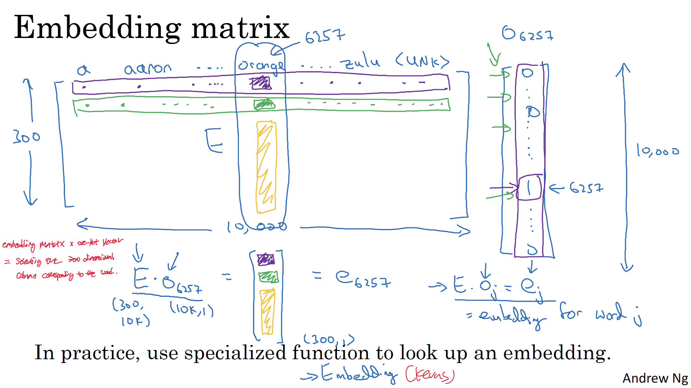
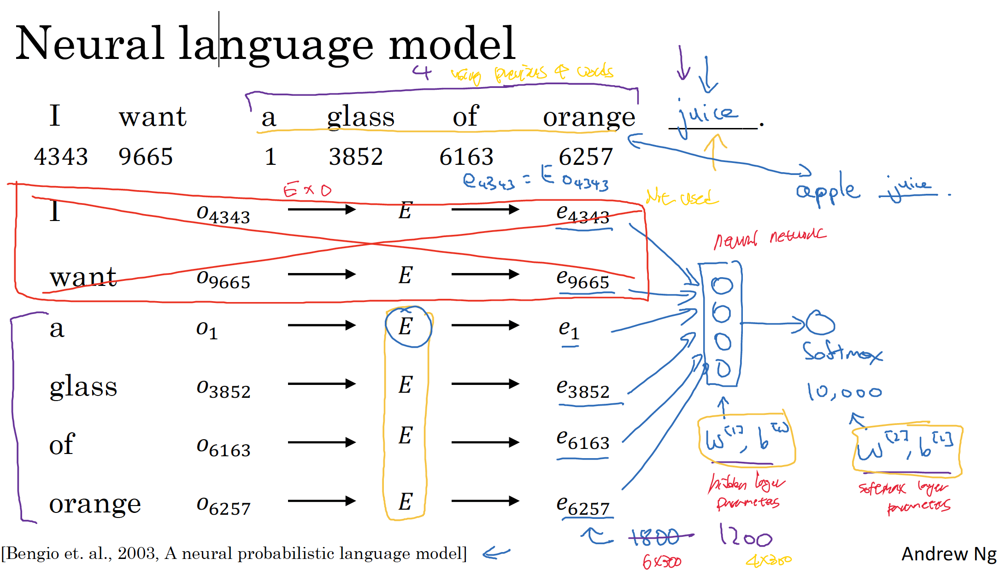
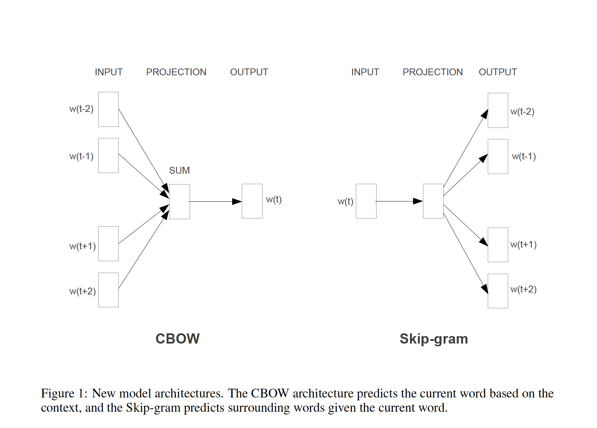
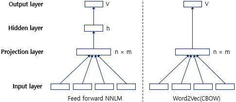
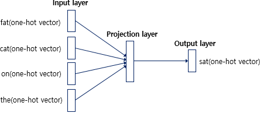
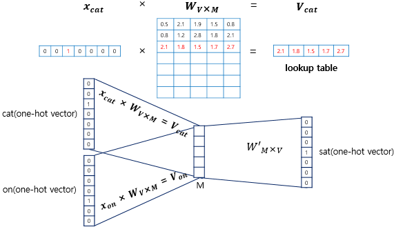
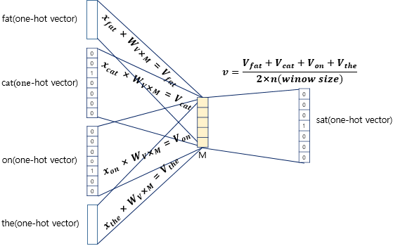
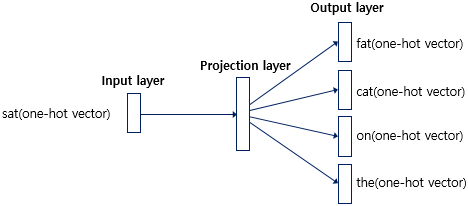
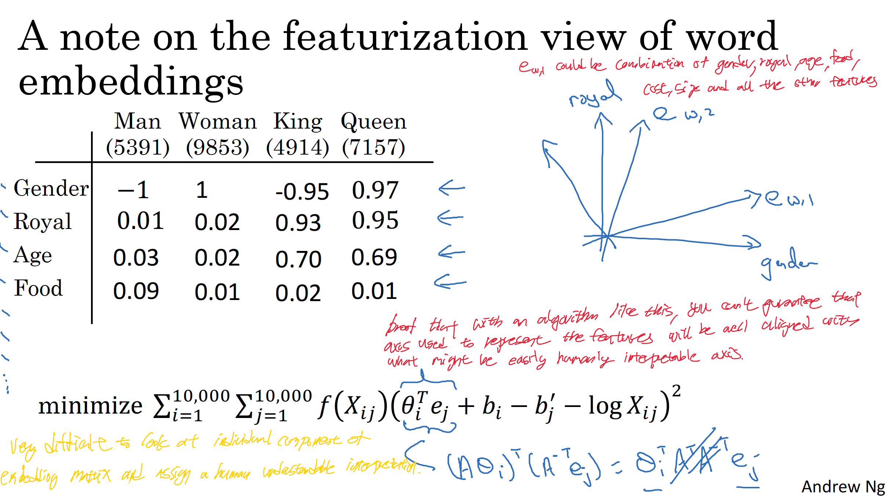

# Natural Language Processing (NLP)
## Preliminaries
### Cosine Similarity
  

The cosine similarity is a measure of similarity between two non-zero vectors defined in an inner product space. Cosine similarity is the cosine of the angle between the vectors;that is, it is the dot product of the vectors divided by the product of their lengths.  
It follows that the cosine similarity does not depend on the magnitudes of the vectors, but only on their angle. The cosine similarity always belongs to the interval $[-1,+1]$.  
For example, two proportional vectors have a cosine similarity of +1, two orthogonal vectors have a similarity of 0, and two opposite vectors have a similarity of −1.
$$
\mathrm{sim}(u,v)=\frac{u^{\mathsf T}v}{\|u\|_2\,\|v\|_2}
$$
Cosine of the angle between two vectors $u$ and $v$.
Or you can use square distance(Euclidiean distance) to measure dissimilarity between two vectors.
$$
||u-v||^{2}
$$

### Hierarchical Softmax
The hierarchical softmax uses a binary tree representation of the output layer with the $W$ words as its leaves and, for each node, explicitly represents the relative probabilities of its child nodes. These define a random walk that assigns probabilities to words.  
The hierarchical softmax defines $p(w_O \mid w_I) $ as follows.
$$
p(w_O \mid w_I) = \prod_{j=1}^{L(w)-1} \sigma \Big( \big[ [ n(w,j+1) = ch(n(w,j)) ] \big] \cdot {v'}_{n(w,j)}^{\top} v_{w_I} \Big)
$$
- $n(w,j)$: the $j$-th node along the path from root to word $w$.
- $L(w)$: path length from root to $w$.
- $ch(n)$: an arbitrary fixed child of $n$.
- $\big[[x] \big]$ : indicator, +1 if true, -1 otherwise.
- $v_{w_I}$: vector representation of the input word.
- ${v'}$: vector representation of an internal node in the tree.
- $\sigma(x) = \frac{1} {1+e^{-x}}$: sigmoid function.
- $\sum_{k=1}^{W} p(w_k \mid w_I) = 1$: for a given input word $w_I$, the probabilities of all possible output words, fron $w_1 \sim w_W$ must add up to 1.

Using above definition, you can also find that,
$$
n(w,1) = \text{root}, \\
n(w, L(w)) = w, \\
$$
Also note that $ch(n)$ means that for each internal node $n$, you make a once-and-for-all choice. Either its left child is $ch(n)$ or its right child is $ch(n)$. So what indicaor function does is that,
- $\sigma \!\left( [+1] \cdot {v'}_{n}^{\top} v_{w_I} \right)$: probability of left child.
- $\sigma \!\left( [-1] \cdot {v'}_{n}^{\top} v_{w_I} \right)$: means probability of right child.

Why using this? It is a "trick" that makes hierarchical softmax work with just a single sigmoid per decision instead of two by using the property of sigmoid.
$$
\sigma(-x) = 1 - \sigma(x)
$$
So it is a just trick that makes you don’t need to write two separate formulas (one using $\sigma(-x)$ instead of $1 - \sigma(x)$).

Now let's see an example to clarify the understanding.
```
         root
        /    \
      n1      n2
     /  \    /  \
   w1   w2  w3   w4
```
- From root:
  - Prob(go $n1$ = left) = $\sigma(x)$
  - Prob(go $n2$ = right) = $\sigma(-x)$
- From $n1$:
  - Prob($w1$) = $\sigma(x_1)$
  - Prob($w2$) = $\sigma(-x_1)$
- From $n2$:
  - Prob($w3$) = $\sigma(x_2)$
  - Prob($w4$) =  $\sigma(-x_2)$  
 
$$
p(w_1) + p(w_2) = \sigma(x)\big(\sigma(x_1) + \sigma(-x_1)\big) = \sigma(x)\cdot 1 = \sigma(x) \\[5pt]
p(w_3) + p(w_4) = \sigma(-x)\big(\sigma(x_2) + \sigma(-x_2)\big) = \sigma(-x)\cdot 1 = \sigma(-x) \\[5pt] 
p(w_1) + p(w_2) + p(w_3) + p(w_4) = \sigma(x) + \sigma(-x) = 1
$$
Don't confuse and remember that root node is not input word. Input word is not shown on the tree because it is already given. ($p(w_O \mid w_I)$)  

Now, let's assume that you are looking for the probability of $w3$, $p(w_3|w_I)$. Using the original formula, you compute as below.
$$
p(w_3 \mid w_I) = \prod_{j=1}^{2} \sigma \!\left( \big[ [\, n(w,j+1) = ch(n(w,j)) \,] \big] \cdot {v'}_{n(w,j)}^{\top} v_{w_I} \right)\\[5pt] 
= \sigma\!\left(-{v'}_{\text{root}}^{\top} v_{w_I}\right) \cdot \sigma\!\left({v'}_{n_2}^{\top} v_{w_I}\right)
$$

### Unigram
Unigram distribution is just a probability distribution over individual words (tokens) in a vocabulary, ignoring any context.  
If $V$ is the vocab and $c(w)$ is how many times word $w$ appears in a corpus with $N=\sum_{u \in V} c(u)$ total appearance of entire words, the empirical unigram probability is as below.
$$P_{\text{uni}}(w) = \frac{c(w)}{N}$$


## Word Representation
### One-Hot vector (encoding)
A one-hot vector is a $1 \times N$ matrix (vector) used to distinguish each word in a vocabulary from every other word in the vocabulary. The one-hot vector consists of 0s in all cells with the exception of a single 1 in a cell used uniquely to identify the word.
$$
\begin{array}{cccccc}
\text{Man (5391)} & \text{Woman (9853)} & \text{King (4914)} &
\text{Queen (7157)} & \text{Apple (456)} & \text{Orange (6257)} \\[6pt]
\left[\!\!\begin{array}{c}
0\\[2pt]0\\[2pt]0\\[2pt]\vdots\\[2pt]1\\[2pt]\vdots\\[2pt]0\\[2pt]0\\[2pt]0
\end{array}\!\!\right] &
\left[\!\!\begin{array}{c}
0\\[2pt]0\\[2pt]0\\[2pt]\vdots\\[2pt]1\\[2pt]\vdots\\[2pt]0\\[2pt]0\\[2pt]0
\end{array}\!\!\right] &
\left[\!\!\begin{array}{c}
0\\[2pt]0\\[2pt]\vdots\\[2pt]1\\[2pt]\vdots\\[2pt]0\\[2pt]0\\[2pt]0\\[2pt]0
\end{array}\!\!\right] &
\left[\!\!\begin{array}{c}
0\\[2pt]0\\[2pt]0\\[2pt]0\\[2pt]\vdots\\[2pt]1\\[2pt]\vdots\\[2pt]0\\[2pt]0
\end{array}\!\!\right] &
\left[\!\!\begin{array}{c}
0\\[2pt]\vdots\\[2pt]1\\[2pt]0\\[2pt]0\\[2pt]0\\[2pt]\vdots\\[2pt]0\\[2pt]0
\end{array}\!\!\right] &
\left[\!\!\begin{array}{c}
0\\[2pt]0\\[2pt]0\\[2pt]0\\[2pt]\vdots\\[2pt]0\\[2pt]\vdots\\[2pt]1\\[2pt]0
\end{array}\!\!\right] \\[6pt]
\mathbf{o}_{5391} & \mathbf{o}_{9853} & \mathbf{o}_{4914} &
\mathbf{o}_{7157} & \mathbf{o}_{456} & \mathbf{o}_{6257}
\end{array}
$$

### Word Embeddings
Word embeddings are a way of representing words as vectors in a multi-dimensional space, where the distance and direction between vectors reflect the similarity and relationships among the corresponding words.   
Word embeddings are trained using machine learning techniques, often based on neural networks. The idea is to learn representations that encode semantic meaning and relationships between words. Word embeddings are trained by exposing a model to a large amount of text data and adjusting the vector representations based on the context in which words appear.
$$
\begin{array}{c|rrrrrr}
\textbf{Feature}
& \textbf{Man\ (5391)}
& \textbf{Woman\ (9853)}
& \textbf{King\ (4914)}
& \textbf{Queen\ (7157)}
& \textbf{Apple\ (456)}
& \textbf{Orange\ (6257)}
\\ \hline
\text{Gender} & -1.00 &  1.00 & -0.95 &  0.97 &  0.00 &  0.01 \\
\text{Royal}  &  0.01 &  0.62 & \underline{0.93} & \underline{0.95} & -0.01 &  0.00 \\
\text{Age}    &  0.03 &  0.02 &  0.70 &  0.69 &  0.03 & -0.02 \\
\text{Food}   &  0.04 &  0.01 &  0.02 &  0.01 &  0.95 &  0.97 \\
\vdots        & \vdots & \vdots & \vdots & \vdots & \vdots & \vdots
\end{array}
$$
For example, a lot of features of 'apple' and 'orange' are similar.

## Named Entity Recognition(NER)
Named Entity Recognition is that identifying and categorizing important information known as entities in text. These entities can be names of people, places, organizations, dates, etc.  
For example, see below example. An annotated block of text that highlights the names of entities.
$$
\text{Jim bought 300 shares of Acme Corp.\ in 2006.} \\[5pt]
\text{[Jim]}_{\text{Person}}
\ \text{bought 300 shares of }
\text{[Acme Corp.]}_{\text{Organization}}
\ \text{in }
\text{[2006]}_{\text{Time}}
\text{.}
$$
## Transfer Learning with Word Embedding
1. Learn word embeddings from large text corpus. (1-100B words)
(Or download pre-trained embedding online.)
2. Transfer embedding to new task with smaller training set.
(say, 100k words)
3. Optional: Continue to finetune the word embeddings with new
data. (When above task 2 has a pretty big data set)

## Analogy Reasoning
A surprising property of word vectors is that word analogies can often be solved with vector arithmetic. At the core of analogy reasoning is the idea that differences between word vectors capture meaningful relationships.  
For example, consider below word embeddings. 
$$
\begin{array}{c|rrrrrr}
 & \textbf{Man\ (5391)} & \textbf{Woman\ (9853)} &
   \textbf{King\ (4914)} & \textbf{Queen\ (7157)} &
   \textbf{Apple\ (456)} & \textbf{Orange\ (6257)}\\ \hline
\text{Gender} & -1.00 &  1.00 & -0.95 & 0.97 & 0.00 & 0.01 \\
\text{Royal}  &  0.01 &  0.02 &  0.93 & 0.95 & -0.01 & 0.00 \\
\text{Age}    &  0.03 &  0.02 &  0.70 & 0.69 & 0.03 & -0.02 \\
\text{Food}   &  0.09 &  0.01 &  0.02 & 0.01 & 0.95 & 0.97
\end{array}
$$
Let's say we want to find out what '?' is from below classic analogy using above embedding.
$$
\text{man : woman :: king : ?}
$$
The key observation is that the vector difference. Both $\mathbf{e}_{\text{man}} - \mathbf{e}_{\text{woman}}$ and $\mathbf{e}_{\text{king}} - \mathbf{e}_{\text{queen}}$ result in vectors with similar properties. By comparing these differences, we can automatically infer that replacing the gender dimension in “king” should yield “queen”.
$$
\mathbf{e}_{\text{man}} - \mathbf{e}_{\text{woman}}
\;\approx\;
\mathbf{e}_{\text{king}} - \mathbf{e}_{\text{queen}}
\;\approx\;
\begin{bmatrix}
-2\\[2pt] 0\\[2pt] 0\\[2pt] 0\\[2pt] \vdots
\end{bmatrix}
$$

Let's formalize and turn it into an algorithm.
$$
\mathbf e_{\text{man}}-\mathbf e_{\text{woman}} \;\approx\; \mathbf e_{\text{king}}-\mathbf e_{\text{?}}
$$
To find the word embedding $e_{\text{?}}$, use cosine similarity.
$$
\arg\max_{w}\;
\operatorname{sim}\!\big(
\mathbf e_{?},\;
\mathbf e_{\text{king}}-\mathbf e_{\text{man}}+\mathbf e_{\text{woman}}
\big)
$$
One of the remarkable results about word embeddings is the generality of analogy relationship they can learn. And all the analogies can be learned just by running a word embedding learning algorithm on the large text corpus.

## Embedding Matrix
When you implement an algorithm to learn word embedding, what you end up learning is an embedding matrix.
An embedding matrix refers to a matrix used to map each word in the training data to a word-embedding vector, allowing for a lower-dimensional representation of the vocabulary. It is collaboratively optimized during the training process to improve the model's performance.
  
$$
\text{(word embedding matrix)} \times \text{(one hot vector)} = \text{(selecting out the column corresponding to the word)}
$$

## Neural Language Model: Feedforward Neural Net Language Model (NNLM)
NNLM is a feed forward neural network with a linear projection layer and a non-linear hidden layer was used to learn jointly the word vector representation and a statistical language model. This model predicts the probability of a word given the previous $n−1$ words.
  
The goal is to predict the word in the sentence, "I want a glass of orange __".  
1. Construct one-hot vector $o$ for the words and embedding matrix $E$.
2. Multiply embedding matrix with each word's one-hot vector to select out the embedding vector for the words.
3. Feed the embedding vectors to neural network.
4. The output of the neural network feeds to softmax network.
5. The softmax classifies among the vocabularies. 

What commonly done is to have a fixed historial window which means that you predict the next word given previous $n$ words.  
For example, if you choose $n=4$, you only need word vectors of 'a', 'glass', 'of', 'orange'.

### Other Context/Target Pairs
- $n$ words on left and right side of the target word.
- Last $1$ word
- Nearby $1$ word

The researchers found that it’s natural to use last few words as context to build a language model. But if your main goal is to learn word embedding, then you have to use all the other contexts to build a meaningful word embedding as well. (Word2Vec Model)

## Word2Vec
  
Word2vec is a group of related models that are used to produce word embeddings. One is Continuous bag-of-words model and the other is Continuous skip-gram model. These models are shallow, two-layer(2 weight parameters $W_1, W_2$ from input-hidden and hidden-output) neural networks that are trained to reconstruct linguistic contexts of words.

### Compared to NNLM
  
워드 임베딩의 개념 자체는 피드 포워드 신경망 언어 모델(NNLM)을 설명하며 이미 학습한 적이 있습니다. NNLM은 단어 벡터 간 유사도를 구할 수 있도록 워드 임베딩의 개념을 도입하였고, 워드 임베딩 자체에 집중하여 NNLM의 느린 학습 속도와 정확도를 개선하여 탄생한 것이 Word2Vec입니다.

NNLM과 Word2Vec의 차이를 비교해봅시다. 우선 예측하는 대상이 달라졌습니다. NNLM은 다음 단어를 예측하는 언어 모델이 목적이므로 다음 단어를 예측하지만, Word2Vec은 워드 임베딩 자체가 목적이므로 다음 단어가 아닌 중심 단어를 예측하게 하여 학습합니다(CBOW). 중심 단어를 예측하므로 NNLM이 예측 단어의 이전 단어들만을 참고하였던 것과는 달리, Word2Vec은 예측 단어의 전,후 단어들을 모두 참고합니다.

구조도 달라졌습니다. Word2Vec이 NNLM보다 학습 속도에서 강점을 가지는 이유는 크게 두 가지입니다.
첫번째로, Word2Vec은 우선 NNLM에 존재하던 활성화 함수가 있는 은닉층을 제거하였습니다. 이에 따라 투사층 다음에 바로 출력층으로 연결되는 구조입니다.
두번째는 은닉층을 제거한 것뿐만 아니라 추가적으로 사용되는 기법들을 사용하였습니다. 대표적인 기법으로 계층적 소프트맥스(hierarchical softmax)와 네거티브 샘플링(negative sampling)이 있습니다.

### Input Embeddings and Output Embeddings
For both models, each word has two embeddings and the purpose of both models are trainig these embeddings. 즉, CBOW 는 주변 단어로 중심 단어를 더 정확히 맞추기 위해 계속해서 이 $W$와 $W'$를 학습해가는 구조 이고, Skip-Gram은 반대로, 중심 단으로 주변 단어를 더 정확히 맞추기 위해 $W$와 $W'$ 를 학습해 가는 구조인 것입니다.  

<b>Skip-Gram</b>  
- Input embedding: used for the center word.
- Output embedding: used for the context words that the model predicts.

<b>CBOW</b>
- Input embeddings: used for the context words (averaged together).
- Output embedding: used for the center word that the model predicts.
- But some implementations average the two (input + output) to get slightly better results.

<b> After Training </b>  
- The training maintains two sets of weights (input & output).
- But the embeddings people actually use and analyze are the input-layer embeddings. It is because the author did in his other paper "Linguistic Regularities in Continuous Space Word Representations” (Mikolov et al., 2013)".

### C-Bow
$$
e_{\text{I}}=\begin{bmatrix}1\\0\end{bmatrix},\quad
e_{\text{like}}=\begin{bmatrix}0\\1\end{bmatrix} \\[5pt]

c_{\text{NNLM}}=[\,e_{\text{I}};\ e_{\text{like}}\,],\qquad
h=\phi\!\left(
\underbrace{\begin{bmatrix}W_{(1)} & W_{(2)}\end{bmatrix}}_{\text{pos.-specific}}
\begin{bmatrix} e_{\text{I}} \\ e_{\text{like}} \end{bmatrix} + b
\right) \\[5pt]

h'=\phi\!\left(
\begin{bmatrix}W_{(1)} & W_{(2)}\end{bmatrix}
\begin{bmatrix} e_{\text{like}} \\ e_{\text{I}} \end{bmatrix} + b
\right)\;\neq\; h \\[5pt]

c_{\text{CBOW}}=\tfrac12\big(e_{\text{I}}+e_{\text{like}}\big) \;=\; \tfrac12\big(e_{\text{like}}+e_{\text{I}}\big) \\[5pt]
$$
The architecture of C-Bow algorithm is similar to the feed forward NNLM, but with the non-linear hidden layer is removed and the projection layer is shared for all words (not just the projection matrix). So, all words get projected into the same position (their vectors are averaged). We call this architecture a bag-of-words model as the order of words in the history does not influence the projection.
  
  
  
  

You can see that there are two embedding matrices, input matrix $W$ and output matrix $W'$.

### Skip-gram
#### Basics
  
The Skip-gram architecture is similar to CBOW, but instead of predicting the current word based on the context, it tries to maximize classification of a word based on another word in the same sentence. So use each current word as an input to a log-linear classifier with continuous projection layer, and predict words within a certain range before and after the current word.  
It is known that increasing the range improves quality of the resulting word vectors, but it also increases the computational complexity. Since the more distant words are usually less related to the current word than those close to it, we give less weight to the distant words by sampling less from those words in our training examples.

#### Skip-gram Model Training
The objective of the Skip-gram model is to maximize the average
log probability given a sequence of training words, $w_1,\, w_2,\, w_3,\, \ldots,\, w_T$ and $c$ is the size of training context. 
Larger $c$ results in more training examples and thus can lead to a higher accuracy, at the expense of the training time.
$$
\frac{1}{T}\sum_{t=1}^{T}\;\sum_{\substack{-c\le j\le c\\ j\neq 0}}
\log p\!\left(w_{t+j}\mid w_t\right) \\[5pt]
$$
By doing so, the model is able to find word representations that are useful for predicting the surrounding words in a sentence or a document.  
The $p\!\left(w_{t+j}\mid w_t\right)$ is using softmax function as below.
$$
p(w_O \mid w_I)=\frac{\exp\!\big( \mathbf{v}'_{w_O}{}^{\top}\mathbf{v}_{w_I} \big)}
{\sum_{w=1}^{W}\exp\!\big( \mathbf{v}'_{w}{}^{\top}\mathbf{v}_{w_I} \big)}
$$
where $\mathbf{v}$ and $\mathbf{v}'$ are the “input” and “output” vector representations of word $w$ and $W$ is the number
of words in the vocabulary.  
But this formulation is impractical because the cost of computing
$\nabla \log p(w_O \mid w_I)$ is proportional to $W$, which is often large and makes the computing cost expensive. In other words calculating denominator gets too expensive when $W$ is large.

One way of dealing with high cost is using Hierarchical Softmax which is a computationally efficient approximation of the full softmax is the hierarchical softmax.
##### Gradient of Skip-gram

#### Negative Sampling
An alternative to the hierarchical softmax is Noise Contrastive Estimation (NCE) which is known to approximately maximize the log probability of the softmax. Negative Sampling is simplifeid NCE. 
It aims at maximizing the similarity of the words in the same context and minimizing it when they occur in different contexts. However, instead of doing the minimization for all the words in the dictionary except for the context words, it randomly selects a handful of words ($2 \le k \le 20$) depending on the training size and uses them to optimize the objective. 
$$
\begin{array}{c|c||c}
\textbf{context} & \textbf{word} & \textbf{target } \mathbf y \\
\hline
\color{blue}{\text{orange}} & \color{green}{\textbf{juice}} & \color{green}{1} \\
\color{blue}{\text{orange}} & \text{king} & 0 \\
\color{blue}{\text{orange}} & \text{book} & 0 \\
\color{blue}{\text{orange}} & \text{the}  & 0 \\
\color{blue}{\text{orange}} & \text{of}   & 0 \\
\end{array}
$$
Above table shows the generated negative sampling training examples. The word around the window of context word is labeled $1$ and other words with labeled $0$ are randomly chosen word from the dictionary. <b>So Negative Sampling is supervised learning that has input as paif of $X$ (context, word)  to predict $y$.</b>  
$$
\log \sigma\!\big({\mathbf v'}_{w_O}^{\top}\mathbf v_{w_I}\big)
\;+\;
\sum_{i=1}^{k} \mathbb{E}_{w_i \sim P_n(w)}
\left[ \log \sigma\!\big(-{\mathbf v'}_{w_i}^{\top}\mathbf v_{w_I}\big) \right]
$$
Use objective function above to replace $\log p(w_O \mid w_I)$ in the skip-gram model objective. This helps distinguishing the target word $w_O$ from draws from the noise distribution $P_n(w)$ using logistic regression, where there are $k$ negative samples for each data sample. Since on every iteration, we only update $k+1$ examples, more efficient than basic Skip-gram algorithm. 

Maximizing this objective function will result in maximizing the dot product in its first term and minimizing it in the second term. In other words, the words in the same context will be pushed to have more similar vector representations while the ones that are found in different contexts will be forced to have less similar word vectors.
$$
J \;=\; \log \sigma(x_{+}) \;+\; \sum_{i=1}^{k} \log \sigma(-x_i),
\qquad
x_{+} \;=\; {\mathbf{v}'_{w_O}}^{\!\top}\mathbf{v}_{w_I}, 
\quad
x_i \;=\; {\mathbf{v}'_{w_i}}^{\!\top}\mathbf{v}_{w_I} \\[5pt]

\frac{\partial J}{\partial \mathbf{v}_{w_I}}
\;=\;
\bigl(1-\sigma(x_{+})\bigr)\,\mathbf{v}'_{w_O}
\;-\;
\sum_{i=1}^{k}\sigma(x_i)\,\mathbf{v}'_{w_i}, \\
\frac{\partial J}{\partial \mathbf{v}'_{w_O}}
\;=\;
\bigl(1-\sigma(x_{+})\bigr)\,\mathbf{v}_{w_I}, \\
\qquad
\frac{\partial J}{\partial \mathbf{v}'_{w_i}}
\;=\;
-\,\sigma(x_i)\,\mathbf{v}_{w_I}
\quad (i=1,\ldots,k) \\[5pt]

\mathbf{v}_{w_I}
\leftarrow
\mathbf{v}_{w_I}
+\eta\!\left[
\bigl(1-\sigma(x_{+})\bigr)\,\mathbf{v}'_{w_O}
-\sum_{i=1}^{k}\sigma(x_i)\,\mathbf{v}'_{w_i}
\right] \\
\mathbf{v}'_{w_O}
\leftarrow
\mathbf{v}'_{w_O}
+\eta\,\bigl(1-\sigma(x_{+})\bigr)\,\mathbf{v}_{w_I}, \\
\qquad
\mathbf{v}'_{w_i}
\leftarrow
\mathbf{v}'_{w_i}
-\eta\,\sigma(x_i)\,\mathbf{v}_{w_I}
$$
Note that since we want to maximize the object, we are using gradient ascent optimization. From above optimization process you can see that,
- In the update of $\mathbf{v}_{w_I}$ you add a positive multiple of $\mathbf{v}'_{w_O}$ that moves $\mathbf{v}_{w_I}$ toward the positive context vector 
$\mathbf{v}'_{w_O}$.
- You also subtract positive multiples of each negative $\mathbf{v}'_{w_i}$ that moves $\mathbf{v}_{w_I}$ away from each negative context vector.
-  Symmetrically, $\mathbf{v}'_{w_O}$ is moved toward $\mathbf{v}_{w_I}$, while every negative $\mathbf{v}'_{w_i}$ is moved away from $\mathbf{v}_{w_I}$.

The last thing to know is noise distribution $P(w)$. 
$$
P(w_i)=\frac{f(w_i)^{3/4}}{\sum_{j=1}^{10{,}000} f(w_j)^{3/4}}
$$
$f(w)$ is unigram that observed frequency of a particular word in the vocabulary on training corpus. Power of $\frac{3}{4}$ is a heuristic to choose somewhere between uniform distribution and empirical frequency distribution in the training corpus.

##### Gradient of Negative Sampling

## GloVE
### Basics
GloVe is a model for distributed word representation. The model is an unsupervised learning algorithm for obtaining vector representations of words. This is achieved by learning vectors geometric closeness in the learned vector space correlates with closeness in meaning.  
The idea of GloVe is to construct, for each word's vectors such that the relative positions of the vectors capture part of the statistical regularities of the word. The statistical regularity is defined as the co-occurrence probabilities. <b> Words that resemble each other in meaning should also resemble each other in co-occurrence probabilities.</b>

### GloVE Model
Let the matrix of word-word co-occurrence counts be denoted by
$X$, whose entries $X_{ij}$ indcidates the number of times
word $j$ occurs in the context of word $i$.
$$
\text{minimize: } J \;=\; \sum_{i,j=1}^{V} f\!\left(X_{ij}\right)\,\Big( \mathbf{w}_i^{\top}\,\tilde{\mathbf{w}}_j \;+\; b_i \;+\; \tilde{b}_j \;-\; \log X_{ij} \Big)^{2}, \\
\text{If } X_{ij} \neq 0
$$
When there are two word vectors ($w, \tilde{w}$), they are equivalent and differ only as a result of their random
initializations;the two sets of vectors should perform equivalently. The reason for setting two word vector is that there is evidence that for certain types of neural networks,
training multiple instances of the network and then combining the results can help reduce overfitting and noise and generally improve results. So author uses the sum $w + \tilde{w}$ as real word vectors. While 'b' is bias.  
$f$ is weighting function to address the problem from weighting all co-occurrences equally, even those that happen rarely or never. Such rare cooccurrences are noisy and carry less information than the more frequent ones.
$$
f(x)=\left\{{\begin{array}{cc}\left(x/x_{\max }\right)^{\alpha }&{\text{ if }}x<x_{\max }\\1&{\text{ otherwise }}\end{array}}\right.
$$

$x_{\max },\alpha$ are hyperparameters. In the original paper, the authors found that $x_{\max }=100,\alpha =3/4$ seem to work well in practice.

## Featurization view of word embedding
  
It is very difficult to look at individual components of embedding matrix and assign a human understandable interpretation. For example,$e_{\text{I}}$ could be combination of gender, royal, age, food, case, size and all the other features.

$$
\mathbf{w}_i^{\top}\,\tilde{\mathbf{w}}_j = \left( A\,\mathbf{w}_i \right)^{\top}\!\left( A^{-\top}\,\tilde{\mathbf{w}}_j\right) = ( \mathbf{w}_i^{\top} A^{\top})(A {\mathbf{w}}_j)
$$ 
Above is simple proof that with an algorithm like this, you can’t guarantee that the axes used to represent the features will be well aligned with what might be easily human-interpretable axes.
Because any invertible $A$ yields the same model score for every pair of words, the coordinate axes of the learned space are arbitrary. So you can “mix” a clean axis like “gender” with “royalty” by applying a shear $A$, and the training objective won’t notice the predictions are identical.
To help your understanding, see below example.
$$
\mathbf{w}_{\text{man}}=[1,0],\qquad
\mathbf{w}_{\text{woman}}=[-1,0],\qquad
\mathbf{w}_{\text{king}}=[1,1],\qquad
\mathbf{w}_{\text{queen}}=[-1,1] \\[5pt]

\mathbf{w}_{\text{man}}^{\top}\tilde{\mathbf{w}}_{\text{king}}
= [1,0]\!\cdot\![1,1]=1,\qquad
\mathbf{w}_{\text{woman}}^{\top}\tilde{\mathbf{w}}_{\text{queen}}
= [-1,0]\!\cdot\![-1,1]=1,\qquad
\mathbf{w}_{\text{man}}^{\top}\tilde{\mathbf{w}}_{\text{woman}}
= [1,0]\!\cdot\![-1,0]=-1 \\[5pt]
$$
If matrix $A$ is applied,
$$
\textbf{Inputs:}\qquad
\mathbf{w}'_{\text{man}}=A[1,0]=[1,0],\quad
\mathbf{w}'_{\text{woman}}=A[-1,0]=[-1,0],\quad
\mathbf{w}'_{\text{king}}=A[1,1]=[3,1],\quad
\mathbf{w}'_{\text{queen}}=A[-1,1]=[1,1] \\[5pt]

\textbf{Outputs (using }A^{-\top}\textbf{):}\qquad
\tilde{\mathbf{w}}'_{\text{king}}=A^{-\top}[1,1]=[1,-1],\quad
\tilde{\mathbf{w}}'_{\text{queen}}=A^{-\top}[-1,1]=[-1,3],\quad
\tilde{\mathbf{w}}'_{\text{woman}}=A^{-\top}[-1,0]=[-1,2] \\[5pt]

\mathbf{w}'_{\text{man}}{}^{\top}\tilde{\mathbf{w}}'_{\text{king}}
= [1,0]\!\cdot\![1,-1]=1\;(\text{same}), \\[3pt]
\mathbf{w}'_{\text{woman}}{}^{\top}\tilde{\mathbf{w}}'_{\text{queen}}
= [-1,0]\!\cdot\![-1,3]=1\;(\text{same}), \\[3pt]
\mathbf{w}'_{\text{man}}{}^{\top}\tilde{\mathbf{w}}'_{\text{woman}}
= [1,0]\!\cdot\![-1,2]=-1\;(\text{same}).
$$
You can see that $\mathbf{w}_{\text{king}}$ moved from $[1,1]$ to $[3,1]$ and so on. But the model scores are unchanged.

## Sentiment Classification
Sentiment analysis is the use of natural language processing to systematically identify, extract, quantify, and study affective states and subjective information.  
One simple type of classfication model just averaging the word embedding of the context and feeding into neural network and predict the output using softmax classifier.  
But the problem is that it ignores the words' order, and it could lower the accuracy of the prediction. Other method is using RNN so that you can take word sequence into account.

## Debiasing Word Embeddings
Word embeddings can reflect gender, ethnicity, age, sexual
orientation, and other biases of the text used to train the
model. Such as,
- < Man:Computer Programmer > as < Woman:Homemaker >
- < Father:Doctor > as < Mother:Nurse >

1. Identify bias direction. The bias direction can be achieved by averaging the difference between gender related word embedding such as [($e_{\text{man}} - e_{\text{woman}}$),$e_{\text{male}} - e_{\text{female}}$)] Then direction orthogonal to bias direction will be unbiased direction.
2. Neutralize: For every word that is not definitional(gender-neutral), project to unbiased direction to get rid of bias.
3. Equalize pairs. Make words like 'grandmother', 'grandfather' have exactly the same distance from the words that should be gender-neutral (babysitter, doctor, … and so on).

One thing to note is that the author trained classifier to figure out what words are definitional or not.