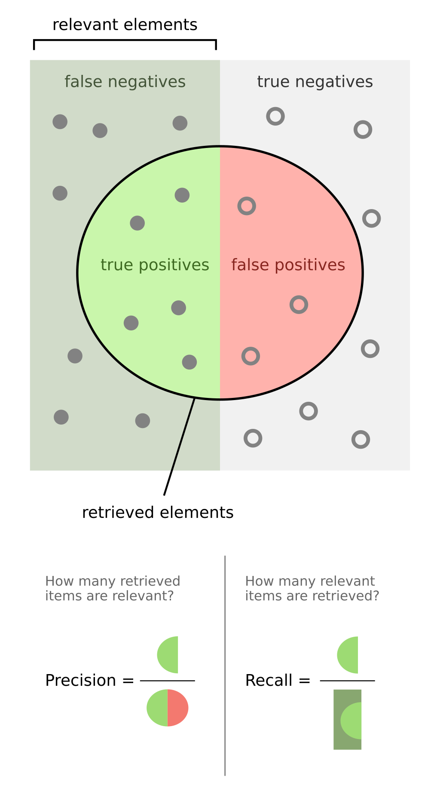
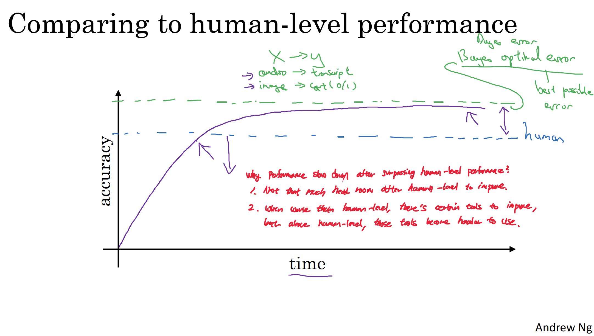

# Machine Learning Strategy
## Background
Why would we need strategy for machine learning? Let me give you an example. Let's say that you get $90$ % accuracy and itis not enough, figure out which of all of these ideas (or other ideas) are worth pursuing and which ones you can safely discard.

 - Collect more data
 - Collect more diverse training set
 - Train algorithm longer with gradient descent
 - Try Adam instead of gradient descent
 - Try bigger network
 - Try smaller network
 - Try dropout
 - Add L-2 regularization
 - Network architecture
   - Activation functions
   - Number of hidden units

## Orthogonalization
Orthogonalization is a system design property that ensures that modification of an instruction or an algorithm component does not create or propagate side effects to other system components.
### Benefits of Orthogonalization
1. Orthogonalization can lead to improved model performance by reducing the complexity and ensuring that each component of the model works efficiently.  
2. Separating concerns through orthogonalization simplifies the debugging process, as issues in one component are less likely to affect others, making the model easier to maintain and update.

For example, when you are driving a car, handle should only control the steering and gear should only control the acceleration. If handle is controlling both steering and acceleration, or vice versa, driving would become much more complex job.

### Chain of Assumptions in Machine Learning
1. Fit training set well on cost function
 - bigger network, Adam Optimizer, ...
2. Fit dev set well on cost function
 - regularization, bigger training sets, ...
3. Fit test set well on cost function
 - bigger dev sets
4. Performs well in real world
 - change dev sets or cost function

Since the sets of method of each criteria are following Orthogonalization, you can use sets of method to tune the algorithm to fit well on each(train/dev/test) sets.  
For example, you can apply regularization or bigger train sets when the model does well on the training sets but poorly on the dev sets. Similarly, you can find the bigger dev sets when your model do well on the dev sets but poorly on the test sets, because your model is overtuned to dev sets. Lastly, you have to fix the dev/test sets distribution or cost function when your model does well on the test sets but poorly on the real world.  
Additionally early stopping is not recommended idea because it can work on multiple criteria simultaneously.

## Single Number Evaluation Metric
If you are building a machine learning system, you will have to measure your algorithm performance. A single number evaluation metric would give a helpful indication of algorithm performance.

Let's see an example.
$$
\begin{array}{|c|c|c|c|}
\hline
\textbf{Classifier} & \textbf{Precision} & \textbf{Recall} & \textbf{F\_1\ Score} \\ \hline
A & 95\% & 90\% & 92.4\% \\ \hline
B & 98\% & 85\% & 91.0\% \\ \hline
\end{array}
$$

As you can see from above example, precision and recall are  evaluation metrics. However, two number evaluation metric is somehow confusing when it comes to choosing either of classifier, because you can't tell which one is better in this case. In this case, you might take the mean of two numbers or F1-score, which is helpful to combine into a single number evaluation.

### Precision and Recall

Consider a computer program for recognizing dogs (the relevant element) in a digital photograph. Upon processing a picture which contains $10$ cats and $12$ dogs, the program identifies $8$ dogs.  
Of the $8$ elements identified as dogs, only $5$ actually are dogs (true positives), while the other $3$ are cats (false positives).  
$7$ dogs were missed (false negatives), and $7$ cats were correctly excluded (true negatives). The program's precision is then $\frac{5}{8}$ (true positives / selected elements) while its recall is $\frac{5}{12}$ (true positives / relevant elements).

### F-Score

$$
{\displaystyle F_{1}={\frac {2}{\mathrm {recall} ^{-1}+\mathrm {precision} ^{-1}}}=2{\frac {\mathrm {precision} \cdot \mathrm {recall} }{\mathrm {precision} +\mathrm {recall} }}={\frac {2\mathrm {TP} }{2\mathrm {TP} +\mathrm {FP} +\mathrm {FN} }}}
$$

### Satisficing and Optimizing Metrics
There are different metrics for assessing a classifier‘s performance, they are called evaluation matrices. They can be categorized as matrices that satisfy and optimize.  
First, metric for optimizing is to maximize as well as possible. While, metric for satisfying  has to be just good enough.
For example, optimizing metric is "Accuracy" and satisfying metric is "Running Time" in the case below.
$$
\begin{aligned}
\text{maximize}\quad & \text{Accuracy} \\[4pt]
\text{subject to}\quad & \text{Running Time} \le 100\ \text{ms}
\end{aligned}
$$

Generally, when there are $N$ metrics, optimizing $1$ metric and satisfying $N-1$ metrics.

## Train, Dev and Test Sets 
Basically you train on the training set, evaluate results on the dev set, and test on the test set.

### Distributions
Choose a dev set and test set to reflect data you expect to get in the future. In other words, dev and test sets should be come from same distribution.
### Size of Sets
Set your dev set to be big enough to detect differences in algorithm/models you’re trying out.  
Set your test set to be big enough to give high confidence
in the overall performance of your system.

Starting from 6:2:2 splits when the size sets are relatively small, the ratio of train set increase to 98%,99% while dev and test sets is 1% when the size of data set large(e.g, #1,000,000)
### When to change
If doing well on your metric and dev/test set does not correspond to doing well on your real application, change your metric and/or dev/test set.

### Orthogonalization of Metrics
1. How to define a metric to evaluate classifiers(model).
2. Worry separately about how to do well on this metric.

1,2 has to be completely separate steps.

## Human Level Performance

From the pic above, green line is best possible accuracy and blue line is human level accuracy, while the purple line is model performance.

You can see that model performance slow down after surpassing human level performance. There are mainly two reasons.
1. Not that much head room to improve left after human level.
2. when worse than human level, there certain tools to improve. But above human level, those tasks become harder to use.
### Why compare to Human Level Performance?
Humans are quite good at a lot of tasks. So long as ML is worse than humans, you can, 
- Get labeled data from humans.
- Gain insight from manual error analysis: Why did a person get this right?
- Better analysis of bias/variance.

### Avoidable Bias
$$
\begin{array}{lcc}
\textbf{Error} & \textbf{Focus on Bias} & \textbf{Focus on Variance} \\\hline
\text{Human}    & 1\%    & 7.5\%  \\
\text{Training} & 8\%    & 8\%    \\
\text{Dev}      & 10\%   & 10\%   \\
\end{array}
$$
From above example, let's say human error is a proxy(estimate) for Bayes error(best possible error).  
When there is large difference between training error and human error, your model need to improve on bias. However, if your model shows more difference in performance between training and dev sets, you need to work on variance. 

The difference between human error (approximation of Bayes error) and the training error is termed avoidable bias.

### Bias/Variance with Huaman Level Performance
 - Bias: Training Error
 - Avoidable Bias: Training Error - Human Error(Bayes Error)
 - Variance: Dev Error - Training Error

Now Let's see another example with performance.
$$
\begin{array}{lcc}
\textbf{Error}  \\\hline
\text{Human}    & 0.7\%     \\
\text{Training} & 0.5\%      \\
\text{Dev}      & 0.8\%   \\
\end{array}
$$
This table shows why as you reach human level performance, it is harder to tease out the bias-variance effect. You are not sure what to focus, bias or variance. In other words, progress in ML is getting harder as you progress.

## Improving Model Performance
### Reducing (avoidable) bias and variance
1. To reduce (avoidable) bias(Train Error ( - Human Error)): 
 - Train bigger model
 - Train longer/better optimization algorithms: momentum, RMSProp, Adam
 - Neural Network architecture/hyperparameters search: RNN, CNN
2. To reduce variance(Dev Error - Train Error): 
 - More data
 - Regularization: R2 regulation, dropout, data augmentation
 - Neural Network architecture/hyperparameters search: RNN, CNN

### The two fundamental assumptions of supervised learning
1. You can fit the training set pretty well: You can achieve low avoidable bias.
2. The training set performance generalizes pretty
well to the dev/test set: The model’s error rate (or accuracy) on held-out data (dev/test) is very close to its error on the data it was trained on. So you can get not too bad variance.

## Error Analysis

## Mismatched Training and Dev/Test data
### Training and Testing on different distribution
### Bias and Variance with mismatched data distribution
### Addressing data mismatch

## Transfer Learning
## MultiTask Learning
### Comparison to Softmax
## End to End Deep Learning

