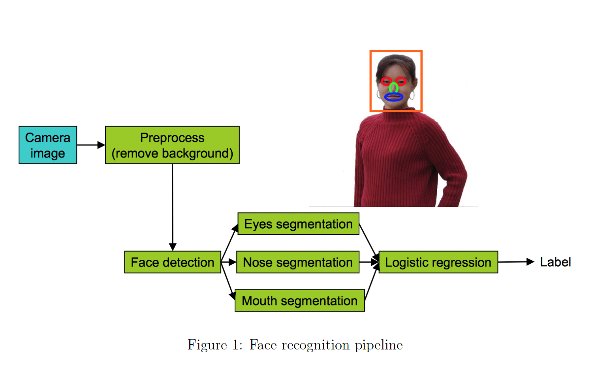

# Machine Learning Strategy
## Background
Why would we need strategy for machine learning? Let me give you an example. Let's say that you get $90$ % accuracy and itis not enough, figure out which of all of these ideas (or other ideas) are worth pursuing and which ones you can safely discard.

 - Collect more data
 - Collect more diverse training set
 - Train algorithm longer with gradient descent
 - Try Adam instead of gradient descent
 - Try bigger network
 - Try smaller network
 - Try dropout
 - Add L-2 regularization
 - Network architecture
   - Activation functions
   - Number of hidden units

## Orthogonalization
Orthogonalization is a system design property that ensures that modification of an instruction or an algorithm component does not create or propagate side effects to other system components.
### Benefits of Orthogonalization
1. Orthogonalization can lead to improved model performance by reducing the complexity and ensuring that each component of the model works efficiently.  
2. Separating concerns through orthogonalization simplifies the debugging process, as issues in one component are less likely to affect others, making the model easier to maintain and update.

For example, when you are driving a car, handle should only control the steering and gear should only control the acceleration. If handle is controlling both steering and acceleration, or vice versa, driving would become much more complex job.

### Chain of Assumptions in Machine Learning
1. Fit training set well on cost function
 - bigger network, Adam Optimizer, ...
2. Fit dev set well on cost function
 - regularization, bigger training sets, ...
3. Fit test set well on cost function
 - bigger dev sets
4. Performs well in real world
 - change dev sets or cost function

Since the sets of method of each criteria are following Orthogonalization, you can use sets of method to tune the algorithm to fit well on each(train/dev/test) sets.  
For example, you can apply regularization or bigger train sets when the model does well on the training sets but poorly on the dev sets. Similarly, you can find the bigger dev sets when your model do well on the dev sets but poorly on the test sets, because your model is overtuned to dev sets. Lastly, you have to fix the dev/test sets distribution or cost function when your model does well on the test sets but poorly on the real world.  
Additionally early stopping is not recommended idea because it can work on multiple criteria simultaneously.

## Single Number Evaluation Metric
If you are building a machine learning system, you will have to measure your algorithm performance. A single number evaluation metric would give a helpful indication of algorithm performance.

Let's see an example.
$$
\begin{array}{|c|c|c|c|}
\hline
\textbf{Classifier} & \textbf{Precision} & \textbf{Recall} & \textbf{F\_1\ Score} \\ \hline
A & 95\% & 90\% & 92.4\% \\ \hline
B & 98\% & 85\% & 91.0\% \\ \hline
\end{array}
$$

As you can see from above example, precision and recall are  evaluation metrics. However, two number evaluation metric is somehow confusing when it comes to choosing either of classifier, because you can't tell which one is better in this case. In this case, you might take the mean of two numbers or F1-score, which is helpful to combine into a single number evaluation.

### Precision and Recall

Consider a computer program for recognizing dogs (the relevant element) in a digital photograph. Upon processing a picture which contains $10$ cats and $12$ dogs, the program identifies $8$ dogs.  
Of the $8$ elements identified as dogs, only $5$ actually are dogs (true positives), while the other $3$ are cats (false positives).  
$7$ dogs were missed (false negatives), and $7$ cats were correctly excluded (true negatives). The program's precision is then $\frac{5}{8}$ (true positives / selected elements) while its recall is $\frac{5}{12}$ (true positives / relevant elements).

### F-Score

$$
{\displaystyle F_{1}={\frac {2}{\mathrm {recall} ^{-1}+\mathrm {precision} ^{-1}}}=2{\frac {\mathrm {precision} \cdot \mathrm {recall} }{\mathrm {precision} +\mathrm {recall} }}={\frac {2\mathrm {TP} }{2\mathrm {TP} +\mathrm {FP} +\mathrm {FN} }}}
$$

### Satisficing and Optimizing Metrics
There are different metrics for assessing a classifier‘s performance, they are called evaluation matrices. They can be categorized as matrices that satisfy and optimize.  
First, metric for optimizing is to maximize as well as possible. While, metric for satisfying  has to be just good enough.
For example, optimizing metric is "Accuracy" and satisfying metric is "Running Time" in the case below.
$$
\begin{aligned}
\text{maximize}\quad & \text{Accuracy} \\[4pt]
\text{subject to}\quad & \text{Running Time} \le 100\ \text{ms}
\end{aligned}
$$

Generally, when there are $N$ metrics, optimizing $1$ metric and satisfying $N-1$ metrics.

## Train, Dev and Test Sets 
Basically you train on the training set, evaluate results on the dev set, and test on the test set.

### Train Sets
Training data set,which is a set of examples used to fit the parameters (weights of connections between layers in the network) of the model. 

### Dev Sets(Validation Sets)
The validation data set provides first unbiased evaluation of a model fit on the training data set while tuning the model's hyperparameters. (e.g., the number of hidden units/layers and layer widths in a neural network)

 - Never backpropagate using dev set.
 - The dev set acts as your scoreboard for comparing different hyperparameter choices.

### Test Sets
The test data set is a data set used to provide an unbiased evaluation of a final model fit on the training data set. So a test set is therefore a set of examples used only to assess the performance of a fully specified classifier.

### Distributions
Choose a dev set and test set to reflect data you expect to get in the future. In other words, dev and test sets should be come from same distribution.
### Size of Sets
Set your dev set to be big enough to detect differences in algorithm/models you’re trying out.  
Set your test set to be big enough to give high confidence
in the overall performance of your system.

Starting from 6:2:2 splits when the size sets are relatively small, the ratio of train set increase to 98%,99% while dev and test sets is 1% when the size of data set large(e.g, #1,000,000)
### When to change
If doing well on your metric and dev/test set does not correspond to doing well on your real application, change your metric and/or dev/test set.

### Orthogonalization of Metrics
1. How to define a metric to evaluate classifiers(model).
2. Worry separately about how to do well on this metric.

1,2 has to be completely separate steps.

## Human Level Performance

From the pic above, green line is best possible accuracy and blue line is human level accuracy, while the purple line is model performance.

You can see that model performance slow down after surpassing human level performance. There are mainly two reasons.
1. Not that much head room to improve left after human level.
2. when worse than human level, there certain tools to improve. But above human level, those tasks become harder to use.
### Why compare to Human Level Performance?
Humans are quite good at a lot of tasks. So long as ML is worse than humans, you can, 
- Get labeled data from humans.
- Gain insight from manual error analysis: Why did a person get this right?
- Better analysis of bias/variance.

### Avoidable Bias
$$
\begin{array}{lcc}
\textbf{Error} & \textbf{Focus on Bias} & \textbf{Focus on Variance} \\\hline
\text{Human}    & 1\%    & 7.5\%  \\
\text{Training} & 8\%    & 8\%    \\
\text{Dev}      & 10\%   & 10\%   \\
\end{array}
$$
From above example, let's say human error is a proxy(estimate) for Bayes error(best possible error).  
When there is large difference between training error and human error, your model need to improve on bias. However, if your model shows more difference in performance between training and dev sets, you need to work on variance. 

The difference between human error (approximation of Bayes error) and the training error is termed avoidable bias.

### Bias/Variance with Huaman Level Performance
 - Bias: Training Error
 - Avoidable Bias: Training Error - Human Error(Bayes Error)
 - Variance: Dev Error - Training Error

Now Let's see another example with performance.
$$
\begin{array}{lcc}
\textbf{Error}  \\\hline
\text{Human}    & 0.7\%     \\
\text{Training} & 0.5\%      \\
\text{Dev}      & 0.8\%   \\
\end{array}
$$
This table shows why as you reach human level performance, it is harder to tease out the bias-variance effect. You are not sure what to focus, bias or variance. In other words, progress in ML is getting harder as you progress.

## Improving Model Performance
### Reducing (avoidable) bias and variance
1. To reduce (avoidable) bias(Train Error ( - Human Error)): 
 - Train bigger model
 - Train longer/better optimization algorithms: momentum, RMSProp, Adam
 - Neural Network architecture/hyperparameters search: RNN, CNN
2. To reduce variance(Dev Error - Train Error): 
 - More data
 - Regularization: R2 regulation, dropout, data augmentation
 - Neural Network architecture/hyperparameters search: RNN, CNN

### The two fundamental assumptions of supervised learning
1. You can fit the training set pretty well: You can achieve low avoidable bias.
2. The training set performance generalizes pretty
well to the dev/test set: The model’s error rate (or accuracy) on held-out data (dev/test) is very close to its error on the data it was trained on. So you can get not too bad variance.

## Error Analysis
Error analysis is a systematic process of examining and understanding the errors made by a machine learning model.
It is important to know which parts of the machine learning algorithm lead to the error rate is crucial.  
Let's look at this face recognition example.

This algorithms is divided into several steps.
1. The inputs are taken from a camera image.
2. Preprocessing to remove the background on the image. (For instance, if the image are taken from a security camera, the background is always the same, and we could remove it easily by keeping the pixels that changed on the image)
3. Detect the position of the face.
4. Detect the eyes - Detect the nose - Detect the mouth
5. Final logistic regression step to predict the label.

If you build a complicated system like this one, you might want to figure out how much error is attributable to each of the components and how good is each of these green boxes.  
If one of these boxes is really problematic, you might want to spend more time trying to improve the performance of that one green box. So how do you decide what part to focus on?  
The one thing we can do is plug in the ground-truth for each component, and see how accuracy changes.

$$
\begin{array}{|l|c|}
\hline
\textbf{Component} & \textbf{Accuracy} \\ \hline
\text{Overall system}                 & 85\%   \\ \hline
\text{Preprocess (remove background)} & 85.1\% \\ \hline
\text{Face detection}                 & 91\%   \\ \hline
\text{Eyes segmentation}              & 95\%   \\ \hline
\text{Nose segmentation}              & 96\%   \\ \hline
\text{Mouth segmentation}             & 97\%   \\ \hline
\text{Logistic regression}            & 100\%  \\ \hline
\end{array}
$$
Looking at the table, we know that working on the background removal won't help much.
It also tells us where the biggest jumps are. We notice that having an accurate face detection mechanism really improves the performance, and similarly, the eyes really help making the prediction more accurate.

### Ablative analysis
While error analysis tries to explain the difference between current performance and perfect performance,(85% to 100% in above example) ablative analysis tries to explain the difference between some baseline (much poorer) performance and current performance. In other words,it removes components from your system one at a time, to see how it breaks.

Forinstance, suppose you have built a good anti-spam classifier by adding lots of clever features to logistic regression.  

 - Spelling correction
 - Sender host features
 - Email header features
 - Email text parser features
 - Javascript parser
 - Features from embedded images

In this example, simple logistic regression without any clever features gets 94% performance, but when adding these clever features, we get 99.9% performance.

$$
\begin{array}{|l|c|}
\hline
\textbf{Component} & \textbf{Accuracy} \\ \hline
\text{Overall system}              & 99.9\% \\ \hline
\text{Spelling correction}         & 99.0\% \\ \hline
\text{Sender host features}        & 98.9\% \\ \hline
\text{Email header features}       & 98.9\% \\ \hline
\text{Email text parser features}  & 95\%   \\ \hline
\text{JavaScript parser}           & 94.5\% \\ \hline
\text{Features from images}        & 94.0\% \\ \hline
\end{array}
$$
Now you want to know how much did each of these components really help?
In abaltive analysis, what we do is start from the current level of performance 99.9%, and slowly take away all of these features to see how it a ects performance.  
By so, instead of simply giving the loss/error rate of the algorithm, we can provide evidence that some specific features are actually more important than others. We can conclude that the email text parser features account for most of the improvement in above example.

### Analyze the mistakes
Assume you are given a dataset with pictures of animals, and your goal is to identify pictures of cats that you would eventually send to the members of a community of cat lovers. You notice that there are many pictures of dogs in the original dataset, and wonders whether you should build a special algorithm to identify the pictures of dogs and avoid sending dogs pictures to cat lovers or not.
One thing you can do is take a 100 examples from your dev set that are misclassified, and count up how many of these 100 mistakes are dogs. If 5% of them are dogs, then even if you come up with a solution to identidy the dogs, your error would only godown by 5%, that is your accuracy would go up from 90% to 90.5%.  
However, if 50 of these 100 errors are dogs, then you could improve your accuracy to reach 95%.
By analyzing your mistakes, you can focus on what's really important. If you notice that 80 out of your 100 mistakes are blurry images, then work hard on classifying correctly these blurry images. If you notice that 70 out of the 100 errors are great cats(tigers, lions..), then focus on this specific task of identifying great cats.  

In brief, do not waste your time improving parts of your algorithm that won't really help decreasing your error rate, and focus on what really matters.

## Mismatched Training and Dev/Test data
Deep Learning algorithms require lots of training data. Sometimes, this results in putting in whatever data they can find and putting them into training set even a lot of this data doesn't come from same distribution as dev/test sets. So nowadays more and more teams are training on data that comes from different distribution than dev/test sets.  
There are some best practice that dealing with when your train and dev/test sets distribution differ from each other.
### Training and Testing on different distribution
One thing to note is that goal of the dev sets is telling the model where to aim the target. So setting up the dev set to optimize for the different distribution of the data that what you actually care.  

For example, when you are developing mobile app of cat that recognize the picture uploaded from users' mobile phone is cat or not. Suppose when you develop the model for the app, you have two different source of data, 200,000 cat images from web and 10,000 cat images from mobile upload. In this situation, rather than mixing two different distribution of data and split into train/dev/test sets,(such as 205,000/2,500/2,500) it is better to put all 200,000 data from web source to training set and fill the dev and test sets with only mobile source data. (such as 200,000(web)+5,000(mobile)/2,500(mobile)/2,500(mobile)) It is because the distribution of mobile source is what the app is recally care.

Another example is speach recognition system in car. While there are lots of speach data, what you really care is the speach data earned from car. Because those data include much more specific data for speach recognition system in car. In this situation, similart to earlier example, set your trainin data with general speach data you have and set dev/test sets with the speach data earned from car. The reason is same as before, speach from the car is the data distribution that you really want.

### Bias and Variance with mismatched data distribution
When train and dev/test sets are from different distribution, it is hard to diagnose the problem of bias and variance. For example if training error is 1% and dev error is 10%, if these two data sets are from same distribution, we can conclude that there is variance problem. But if they are from different distribution, we can't conclude so. This is  because there is possibility that the training sets are easier than dev/test sets so the model is actually doing just fine.  
So we come up with "training-dev set", which is data from ame
distribution as training set, but not used for training.
$$
\begin{array}{|l|c|l|}
\hline
\textbf{Metric} & \textbf{Error} & \textbf{Interpretation} \\ \hline
\text{Human level (Bayes/optimum)}      & 4\%  & \text{} \\ \hline
\text{Training-set error}               & 7\%  & \uparrow\; \text{avoidable bias} \\ \hline
\text{Training-dev sets error}          & 10\% & \uparrow\; \text{variance} \\ \hline
\text{Dev-set error}                    & 12\% & \uparrow\; \text{data mismatch} \\ \hline
\text{Test-set error}                   & 12\% & \uparrow\; \text{degree of overfit to dev} \\ \hline
\end{array}
$$
Training-dev sets error indicates the variance problem that your model is not generalized well to the data never seen before but same distribution. So the Dev-set error now indicates the data mismatch problem that the model is not doing well on the different distribution of the data that you really care.  
Lastly, Test-set error says degree of overfit to dev sets data. In other words, if there is huge gap between dev set error and test set error, your model is overtuned to the dev sets. So you need to find the bigger dev sets.

### Addressing data mismatch problem
- Carry out manual error analysis to try to understand difference
between training and dev/test sets.
- Make training data more similar; or collect more data similar to
dev/test sets. 
  - e.g., simulate the noise in the car (artificial data synthesis)

## Transfer Learning
## MultiTask Learning
### Comparison to Softmax
## End to End Deep Learning

