# Computer Vision
## Preliminaries
### Edge
Edges are defined as curves in a digital image at which the image brightness changes sharply or, more formally, has discontinuities.
These changes usually happen at borders of objects. 
Detecting edges helps us understand the shape, size and location of different parts in an image. 
### Edge Detection
Edge detection is a technique used to identify the boundaries of objects within images. 
It helps in simplifying the image data by reducing the amount of information to be processed while preserving the structural properties of the image. 
Edge Detection is essential for various image analysis tasks, including object recognition, segmentation, and image enhancement.

#### First-Order Derivative Edge Detction
In a continuous view, an edge pixel is a point where the first derivative of image intensity has a local maximum in the direction of the gradient. So the edge is where intensity changes rapidly across, and is (approximately) constant along.  
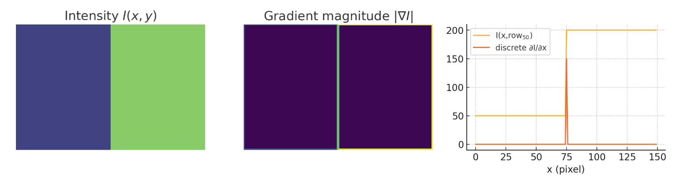
- The intensiy function is a table of samples $I[i,j]$ whose values on a pixel grid. Since the function $I$ is defined only at the lattice points $(i,j)$ like $(11, 10)$, not $(11.1, 10.5)$ (this contains nothing). So Note that intensity function is a set of discrete samples, not a continuous field.
- The gradient vector $\nabla I \;=\; \left( \frac{\partial I}{\partial x},\; \frac{\partial I}{\partial y} \right)$ points in the direction of greatest increase of intensity, where I is intensity function. So gradient magnitude $||\nabla I||$ is large at edges.  

Since the intensity function of a digital image is only known at discrete points, derivatives of this function cannot be defined unless we assume that there is an underlying differentiable intensity function that has been sampled at the image points. With some additional assumptions, the derivative of the continuous intensity function can be computed as a function on the sampled intensity function. Therefore, it turns out that the derivatives at any particular point are functions of the intensity values at virtually all image points.

However, you can get the approximate derivative of the intensity function by convolutioning filters. The discrete differentiation operator such as Sobel operator, represents a rather inaccurate approximation of the image gradient, but is still of sufficient quality to be of practical use in many applications. This operator(filter) uses convolutional masks to highlight regions with high spatial frequency, which correspond to edges.

##### Intuition
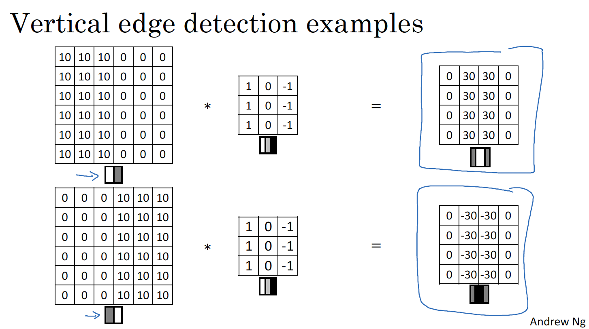
Note that it doesn't matter you choose upper case to get positive output or lower case to get negative output because you take absolute value.
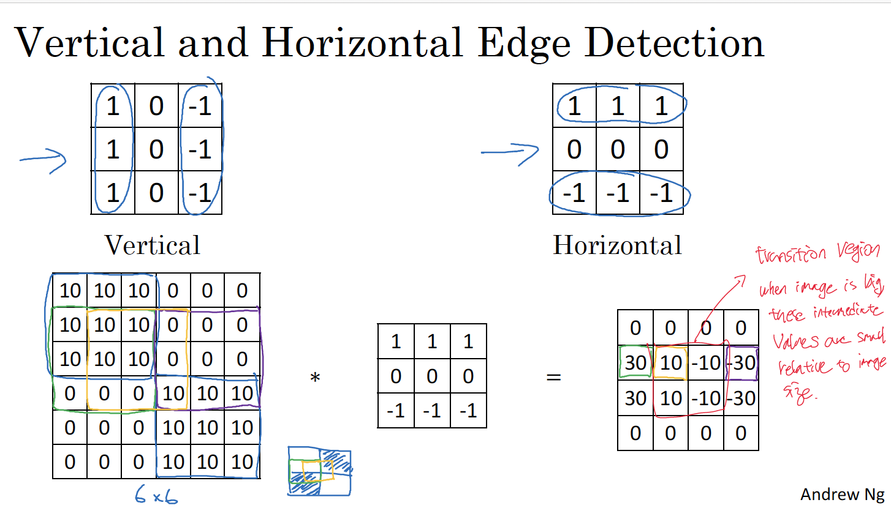
Note that transition region is intermediate values. These intermediate value is relatively small when image is big.

### Filter (Kernel)
In image processing, a kernel, convolution matrix, or mask is a small matrix used for blurring, sharpening, embossing, edge detection, and more. This is accomplished by doing a convolution between the kernel and an image.  
Put simply, during convolution, kenrel is a small grids that move over the image. Or it can be interpreted as a sliding function applied to the image matrix.  
e.g., Sobel filter.

In edge detection, instead of using existing filters, you can make the filter to learn the numbers to get good edge detector. This can be done by treating those numbers as prameters and using backpropagation.

### Filter(Kernel), Feature Map and Channel
<b> Kernel (Filter) </b>  
A kernel (or filter) is a small 3D block of learnable weights used to extract a pattern from the input volume.  
<b> Feature Map </b>  
A feature map (or activation map) is the 2D output produced by applying one kernel across the input.  
<b> Channel </b>  
A channel is just the depth index of a feature map tensor.

For example, Seeing below example,  
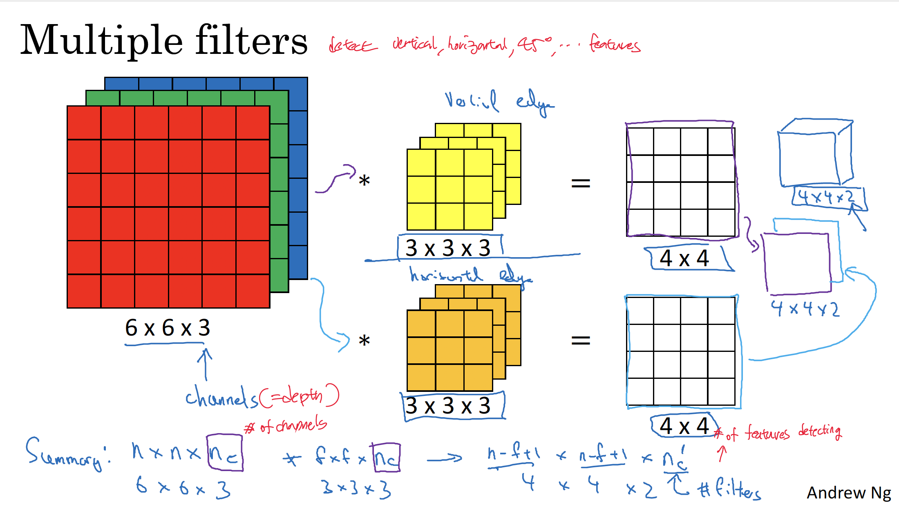  

| Term                 | Symbolic shape | Meaning                               |
| -------------------- | -------------- | ------------------------------------- |
| Input volume         | (6, 6, 3)      | 3 input channels                      |
| One kernel           | (3, 3, 3)      | 3D filter spanning all input channels |
| # of kernels         | 2              | each produces one output feature map  |
| One feature map      | (4, 4)         | result from one kernel                |
| Feature map volume   | (4, 4, 2)      | all feature maps stacked together     |
| # of output channels | 2              | equal to # of kernels                 |

### Convolution
Mathmatically convolution is an operation on two functions $f$ and $g$ that produces a third function $f*g$ as the integral of the product of the two functions after one is reflected about the y-axis and shifted.  
In ML, convolution is an application of a sliding window function to a matrix of pixels representing an image.

#### Convolution vs Cross-Correlation
 - Convolution in Deep Learning = Cross-Correlation
 - Convolution in Mathmatics = Cross-Correlation + Mirroring

Convolution in general, the kernel is flipped both horizontally and vertically before applying. However, in deep learning, for more computationally efficient by skipping the flipping step, the kernel is used as-is without flipping. Plus, just call convolution instead of term cross-correlation

### Padding and Stride
#### Padding
During convolution, the size of the output feature map is determined by the size of the input feature map, the size of the kernel, and the stride. If we simply apply the kernel on the input feature map, then the output feature map will be smaller than the input. This can result in the loss of information at the borders of the input feature map. In order to preserve the border information we use padding.

- Valid Convolution: No padding is added to the input feature map, and the output feature map is smaller than the input feature map. This is useful when we want to reduce the spatial dimensions of the feature maps.
- Same Convolution: Padding is added to the input feature map such that the size of the output feature map is the same as the input feature map. This is useful when we want to preserve the spatial dimensions of the feature maps.

To formalize, let's say when there is $(n \times n)$ size image and $(f \times f)$ filter. Suppose $p$ is padding size, then $(n \times n)$ image becomes $(n + 2p) \times (n + 2p)$ image after padding. After convolution, the output image is $(n + 2p - f + 1) \times (n + 2p - f + 1)$ size.
#### Stride
The number of rows and columns traversed per slide as stride. So the output size including strides is cacluated as below.
$$
\left\lfloor \frac{n + 2p - f}{s} + 1 \right\rfloor
\times
\left\lfloor \frac{n + 2p - f}{s} + 1 \right\rfloor
$$

### K-nearest neighbors algorithm
In the classification phase, $k$ is a user-defined constant, and an unlabeled vector is classified by assigning the label which is most frequent among the $k$ training samples nearest to that query point. A commonly used distance metric for continuous variables is Euclidean distance.

### Spatial Pooling
Spatial pooling is a technique used in convolutional neural networks to reduce the spatial dimensions (width and height) of feature maps while retaining important information. It works by applying a fixed operation, such as taking the maximum or average value, over small regions of the input(maxpool, avgpool, minpool). 
For example, max pooling uses a sliding window (e.g., 2x2 pixels) to extract the highest value from each region, effectively downsampling the feature map by a factor equal to the window size. This reduces computational complexity and helps the network focus on broader patterns rather than precise pixel locations. A common setup is applying a 2x2 pooling window with a stride of 2, turning a 4x4 grid into a 2x2 output, halving the resolution in each dimension.

### Receptive Field
In Convolutional Neural Networks (CNNs) used in computer vision, the receptive field refers to the region of the input image that a particular neuron in a convolutional layer is “looking at” or taking into account when making its predictions or feature extractions. 
   
(CNN 에서 출력 레이어의 뉴런 하나에 영향을 미치는 입력 뉴런들의 공간크기를 의미)

## Convolutional Network
### References
- https://arxiv.org/pdf/1311.2901
- https://arxiv.org/pdf/1312.6229
- https://arxiv.org/pdf/1406.2199
- https://proceedings.neurips.cc/paper_files/paper/2012/file/c399862d3b9d6b76c8436e924a68c45b-Paper.pdf (alexnet)
- https://arxiv.org/pdf/1409.1556 (vgg)

### Convolution over volume
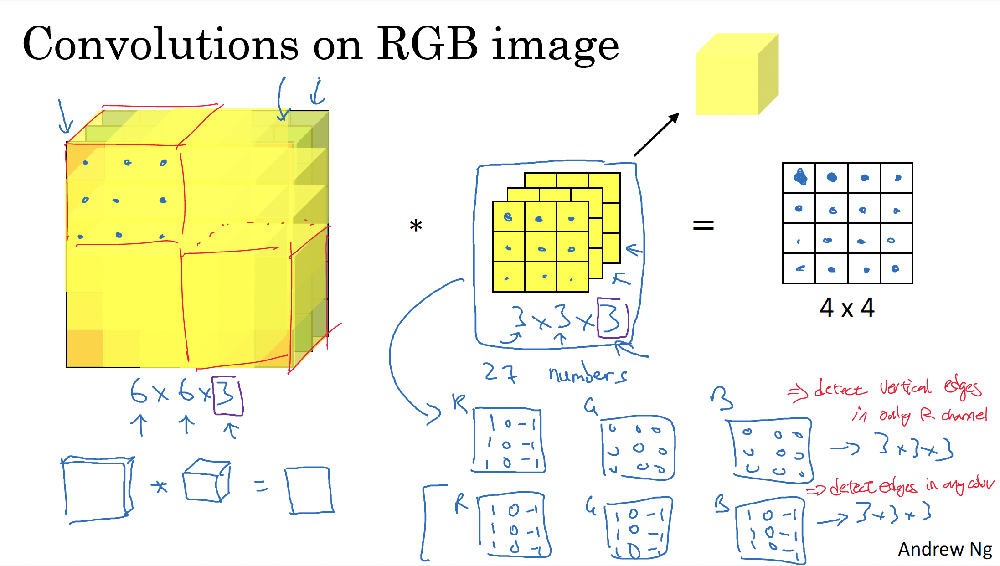
  

You can stack multiple 2-D pixel matrix(height * width) to represent 3-D tensor(height * width * #channel). One thing to note is to match the number of channel of image and filters. So how do you convolve this pixel tensor with the 3D filter? Similar to 2-D convolution, take each numbers of the filter and multiply them with the corresponding numbers from the each channel of the tensor.  
To put it simply using above image example, take the each $9$ numbers from the $3$ channels and multiply it with the corresponding $27$ numbers that gets covered by first left yellow cube show on the image. Then add up all those numbers and this gives you this first number in the output, and then to compute the next output you take this cube and slide it over by one, and again, due to 27 multiplications, add up the 27 numbers, that gives you this next output and so on.

From the above image, you have to match the number of channel to $3$. When performing image processing in convolutional neural network, each channel represents a color. In a color image, there are three channels: red, green, and blue. An RGB image can be described as a $w \times h \times n\_c$ matrix, where each denotes the width, height, and the number of channels respectively. Thus, when an RGB image is processed, a three-dimensional tensor is applied to it.  

Unlike RGB images, grayscale images are singled channeled and can be described as a $w \times h$ matrix, in which every pixel represents information about the intensity of light.

### Multiple Filters
  

When we want to detect not just single feature from the tensor, but multiple features, we can use multiple filters. (e.g., detect vertical, horizontal, 45 degree edges and so on)
The output is the stack of the result of each convolution of filter. From the above image example, since it is using two filters to detect vertical and horizontal edges, the number of output is also two and you combine these two result.
$$
\begin{aligned}
&\textbf{Input tensor:}  && n \times n \times n_c \\[2pt]
&\textbf{Filter (kernel):} && f \times f \times n_c \\[2pt]
&\textbf{Output tensor:} &&
      (\,n - f + 1\,)\;\times\;(n - f + 1)\;\times\;n_c' \\[6pt]
%-----------------------------------------------------------
&\textit{Example:}  && 6 \times 6 \times 3 
      \;\;{\xrightarrow{\;\;3 \times 3 \times 3,\; n_c'=2\;\;}}
      \;\;4 \times 4 \times 2
\end{aligned}
$$
### Convolutional Layer
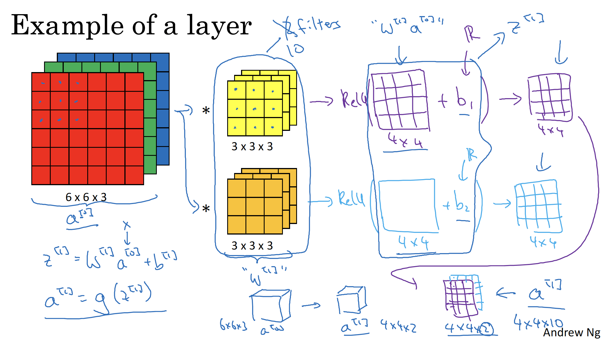
Consider above convolutional layer example.  
$a^{[0]} = x$ is convolution with each filter $w^{[1]}$ and bias $b^{[1]}$ is added. So the result $z^{[1]} = w^{[1]} a^{[0]} + b^{[1]}$. Applying Relu function to $z^{[1]}$ to get output $a^{[1]}$.

- $f^{[l]}$ is filter(kernel) size.
- $p^{[l]}$ is padding.
- $s^{[l]}$ is stride.
- $n_c^{[l]}$ is number of channel of output(=number of filters). 
- $f^{[l]} \times f^{[l]} \times n_c^{[\,l-1]}$ is each filter.
- $f^{[l]} \times f^{[l]} \times n_c^{[\,l-1]} \times n_c^{[l]}$ is weight.
- $b^{[l]}: 1 \times 1 \times 1 \times n_c^{[l]}$ is bias.
- $a^{[l-1]} = n_H^{[\,l-1]} \times n_W^{[\,l-1]} \times n_c^{[\,l-1]}$ is input.
- $a^{[l]} = n_H^{[\,l]} \times n_W^{[\,l]} \times n_c^{[\,l]}$ is output.  

Note that the number of depth(channel) of output layer is same as the number of filters applied.
Also remind that size of height and width is below.
$$
n_H^{[\,l]} = 
\Bigl\lfloor \frac{n_H^{[\,l-1]} + 2p^{[l]} - f^{[l]}}{s^{[l]}} + 1 \Bigr\rfloor,
\qquad
n_W^{[\,l]} = 
\Bigl\lfloor \frac{n_W^{[\,l-1]} + 2p^{[l]} - f^{[l]}}{s^{[l]}} + 1 \Bigr\rfloor 
$$
So the output layer dimension is, 
$$
\Bigl\lfloor \frac{n_H^{[\,l-1]} + 2p^{[l]} - f^{[l]}}{s^{[l]}} + 1 \Bigr\rfloor \times \Bigl\lfloor \frac{n_W^{[\,l-1]} + 2p^{[l]} - f^{[l]}}{s^{[l]}} + 1 \Bigr\rfloor  \times n_c^{[l]}
$$
### Pooling
A pooling layer is a kind of network layer that downsamples and aggregates information that is distributed among many vectors into fewer vectors. So pooling is basically convolution over data with filter but summarizing the features within the region covered by the filter.
- Max Pooling: Max pooling selects the maximum element from the region of the feature map covered by the filter. Thus, the output after max-pooling layer would be a feature map containing the most prominent features of the previous feature map. Max pooling layer preserves the most important features (edges, textures, etc.) and provides better performance in most cases.
- Average Pooling: Average pooling computes the average of the elements present in the region of feature map covered by the filter. Thus, while max pooling gives the most prominent feature in a particular patch of the feature map, average pooling gives the average of features present in a patch. Average pooling provides a more generalized representation of the input. It is useful in the cases where preserving the overall context is important. Also it is sometimes used in very deep neural network to collapse the representation.($n \times n$ to $1 \times 1$)

The output dimension can be calculated just like before.
$$
\Bigl\lfloor \frac{n_H^{[\,l-1]} + 2p^{[l]} - f^{[l]}}{s^{[l]}} + 1 \Bigr\rfloor \times \Bigl\lfloor \frac{n_W^{[\,l-1]} + 2p^{[l]} - f^{[l]}}{s^{[l]}} + 1 \Bigr\rfloor  \times n_c^{[l]}
$$

### Convolutional Network Example
General trend in Convolutional Network is that as go deeper in the network, size of height & width stays same for while and trend down, while the number of channer gradually increase.

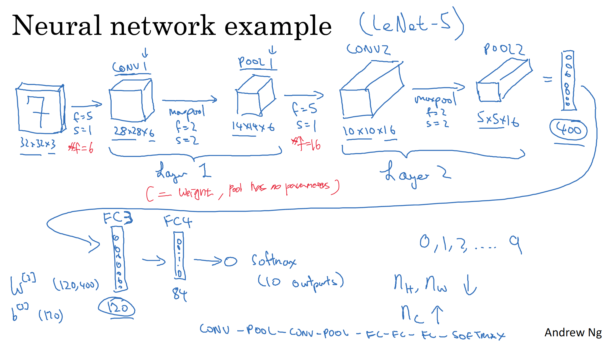
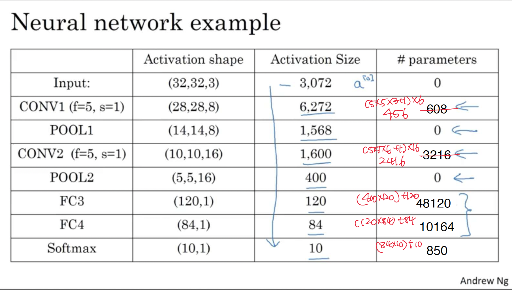

### Why Convolutional Network?
- Good at detecting patterns and features in images, videos, and audio signals.
- Robust to translation, rotation, and scaling invariance.

#### Invariance
Invariance means that you can recognize an object as an object, even when its appearance varies in some way. This is generally a good thing, because it preserves the object's identity, category, (etc) across changes in the specifics of the visual input, like relative positions of the viewer/camera and the object.

#### Why Convolutional Network have small number of parameters?
- Parameter sharing: A feature detector (such as a vertical
edge detector) that’s useful in one part of the image is probably
useful in another part of the image.
- Sparsity of connections: In each layer, each output value
depends only on a small number of inputs.

### Backpropagation of Convolutional Network
https://pavisj.medium.com/convolutions-and-backpropagations-46026a8f5d2c

### Backpropagation of MaxPooling
https://towardsdatascience.com/forward-and-backward-propagation-of-pooling-layers-in-convolutional-neural-networks-11e36d169bec/

### Backpropagation of Linear Layer
https://robotchinwag.com/posts/linear-layer-deriving-the-gradient-for-the-backward-pass/

## Convolutional Network Case Study
### Classic Networks
#### LeNet-5

1. Input layer : (32,32,1) 
   - Note that depth is 1 since it is grey scale.
2. Convolution layer 1: 
   - Convolution with Filter: (5,5,1) * 6, with stride=1 and padding=0
   - ((((32 + (2 * 0) - 5) / 1) + 1), (((32 + (2 * 0) - 5) / 1) + 1)) * 6 = (28,28,6)
3. Pooling(Subsampling) layer 1:
   - Pool with Filter: (2,2,6) * 6, with stride=2 and padding=0
   - ((((28 + (2 * 0) - 2) / 2) + 1), (((28 + (2 * 0) - 2) / 2) + 1)) * 6 = (14,14,6)
4. Convolution layer 2: 
   - Convolution with Filter: (5,5,6) * 16, with stride=1 and padding=0
   - ((((14 + (2 * 0) - 5) / 1) + 1), (((14 + (2 * 0) - 5) / 1) + 1)) * 16 = (10,10,16)
5. Pooling(Subsampling) layer 2:
   - Pool with Filter: (2,2,6) * 16, with stride=2 and padding=0
   - ((((10 + (2 * 0) - 2) / 2) + 1), (((28 + (2 * 0) - 2) / 2) + 1)) * 16 = (5,5,16)
6. Fully Connected Layer 1:
   - Weight: ((5*5*16), 120)
   - Parameters: Weight(400 * 120) + Bias(120)
7. Fully Connected Layer 2:
   - Weight: (120, 84)
   - Parameters: Weight(120 * 84) + Bias(84)
8. Output Layer:
   - Softmax Function of 10 output.

##### Note on Lenet-5
- As go deeper through the network, $N_h$, $N_w$ reduces, while $N_c$ increases.
- The original Lenet-5 uses Euclidean Radial Basis Function(RBF) as output layer which is useless these days. 
- The original Lenet-5 has non-linearity function (such as sigmoid) after convolution layers, (conv-sigmoid-pool-conv-sidmoid-pool) which is not done thesedays also. 
- Lastly, Lenet-5 used average pool instead of max pool in pooling layer.

#### AlexNet

1. Input layer : (227,227,3)
2. Convolution layer 1: 
   - Convolution with Filter: (11, 11, 3) * 96, with stride=4 and padding=0
   - ((((227 + (2 * 0) - 11) / 4) + 1), (((227 + (2 * 0) - 11) / 4) + 1)) * 96 = (55,55,96)
3. Pooling(Subsampling) layer 1:
   - Pool with Filter: (3,3,96) * 96, with stride=2 and padding=0
   - ((((55 + (2 * 0) - 3) / 2) + 1),(((55 + (2 * 0) - 3) / 2) + 1)) * 96 = (27,27,96)
4. Convolution layer 2: 
   - Convolution with Filter: (5,5,96) * 256, with stride=1 and padding=2 (same convolution)
   - ((((27 + (2 * 2) - 5) / 1) + 1), (((27 + (2 * 2) - 5) / 1) + 1)) * 256 = (27,27,256)
5. Pooling(Subsampling) layer 2:
   - Pool with Filter: (3,3,256) * 384, with stride=2 and padding=0
   - ((((27 + (2 * 0) - 3) / 2) + 1), (((27 + (2 * 0) - 3) / 2) + 1)) * 384 = (13,13,384)
6. Convolution layer 3 ~ 4: 
   - Convolution with Filter: (3,3,384) * 384, with stride=1 and padding=1 (same convolution)
   - ((((13 + (2 * 1) - 3) / 1) + 1), (((13 + (2 * 1) - 3) / 1) + 1)) * 384 = (13,13,384)
   - Two Convolution Layers in a row.
7. Convolution layer 5: 
   - Convolution with Filter: (3,3,384) * 256, with stride=1 and padding=1 (same convolution)
   - ((((13 + (2 * 1) - 3) / 1) + 1), (((13 + (2 * 1) - 3) / 1) + 1)) * 256 = (13,13,256)
8. Pooling(Subsampling) layer 3:
   - Pool with Filter: (3,3,256) * 256, with stride=2 and padding=0
   - ((((13 + (2 * 0) - 3) / 2) + 1), (((27 + (2 * 0) - 3) / 2) + 1)) * 256 = (6,6,256)
9. Fully Connected Layer 1:
   - Weight: ((6 * 6 *256), 4096)
10. Fully Connected Layer 2:
   - Weight: (4096, 4096)
8. Output Layer:
   - Softmax Function of 1000 output.

##### Overall

[(CONV → RN → MP) * 2] → (CONV3 → MP) → [(FC → DO)*2] → Linear → Softmax
 - CONV = convolutional layer (with ReLU activation)
 - RN = local response normalization
 - MP = max-pooling
 - FC = fully connected layer (with ReLU activation)
 - Linear = fully connected layer (without activation)
 - DO = dropout

##### Note on AlexNet
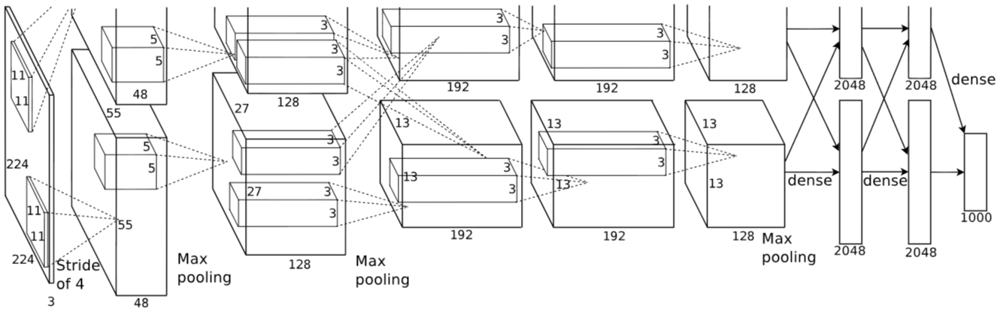  

- AlexNet is similar to Lenet-5 but much bigger size.
- Apply ReLu function to the every output of convolutional layer to add non-linearity.
- It used max pooling.
- It used local response normalization(which is turned out to be effectless), and dropout regularization with drop probability 0.5.
- During learning, it use stochastic gradient descent with momentum and weight decay.

##### Data Augmentation in AlexNet
A common method to reduce overfitting on image data is to artificially enlarge the dataset.
- Extracting random $224 \times 224$ patches (and their horizontal reflections) from the
$256 \times 256$ images and training our network on these extracted patches. This increases the size of our
training set by a factor of 2048, though the resulting training examples are, of course, highly interdependent.  
$256 - 224 = 32, (32 +1) \times (32 + 1) = 1089, 1089 \times 2 = 2178 (\text{ almost }2048)$
- Altering the intensities of the RGB channels in training images by performing PCA on the set of RGB pixel values throughout the training sets. To each training image, we add multiples of the found principal components with magnitudes proportional to the corresponding eigenvalues times a random variable drawn from
a Gaussian with mean zero and standard deviation $0.1$.
  - Adding $\mathbf{p}_1, \mathbf{p}_2, \mathbf{p}_3][\alpha_1 \lambda_1, \alpha_2 \lambda_2, \alpha_3 \lambda_3]^T$ to RGB image pixel $\mathbf{I}_{xy} = [\ \mathbf{I}_{xy}^{R}, \mathbf{I}_{xy}^{G}, \mathbf{I}_{xy}^{B}]$. ㅉhere $\mathbf{p}_i$ and $\lambda_i$ are ith eigenvector and eigenvalue of the $3 \times 3$ covariance matrix of RGB pixel values.

##### Local Response Normalization
"비슷한 위치에 있는 여러 커널들(필터들)의 활성화 값들"을 묶어서 정규화하는 방식.
$$
b_{x,y}^{i} = a_{x,y}^{i} / \left( k + \alpha \sum_{j=\max\left(0, i - \frac{n}{2}\right)}^{\min\left(N-1, i + \frac{n}{2}\right)} \left(a_{x,y}^{j}\right)^2 \right)^{\beta}
$$
- 여기서 $a_i^{x,y}$​는 ReLU를 거친 뉴런 출력,
- $b_i^{x,y}$​는 정규화 후 출력,
- $N$은 커널 수, $k, n, \alpha, \beta$는 하이퍼파라미터입니다
- 여기서 합은 동일한 공간 위치에서 nnnn개의 "인접한" 커널 맵에 대해 실행.

##### GPU Partitioning
Because AlexNet used two GPUs, Krizhevsky et al. split the kernels and feature maps evenly across GPUs to fit memory and bandwidth limits. (See image on "Note on AlexNEt" Section)

| Layer | #kernels | Kernel size | Input channels | Output size (channels) | Split (GPU1 + GPU2)            |
| ----- | -------- | ----------- | -------------- | ---------------------- | ------------------------------ |
| Conv1 | 96       | (11×11×3)   | 3              | 96                     | 48 + 48                        |
| Conv2 | 256      | (5×5×48)    | 48 per GPU     | 256                    | 128 + 128                      |
| Conv3 | 384      | (3×3×256)   | 256 (all GPUs) | 384                    | **Fully connected (no split)** |
| Conv4 | 384      | (3×3×192)   | 192 per GPU    | 384                    | 192 + 192                      |
| Conv5 | 256      | (3×3×192)   | 192 per GPU    | 256                    | 128 + 128                      |

#### VGG-16(19)
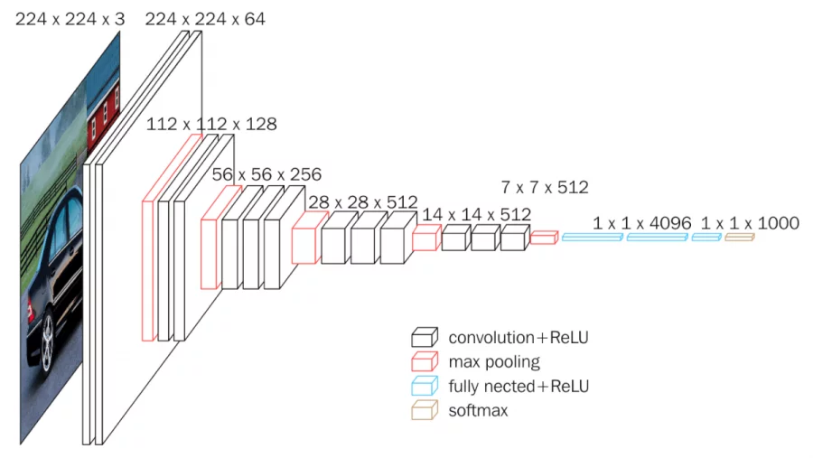

- Input Size: (224, 224, 3)
- Convolution: (3 * 3) filters with stride=1, same convolution
- Max Pooling: (2 * 2) filters with stride=2

The key idea of VGG is to focus on the aspect of depth of the network, therefore, increase the depth of the network by using filters with a very small receptive field: $3 \times 3$ (which is the smallest size to capture the notion of left/right, up/down, center).  
The small filter helps the network to have deeper depth without increasing the number of the parameters sharply. For example, assuming that both the input and the output of a
three-layer stack of $3 \times 3$ convolution stack has $C$ channels, the stack is parametrised by $3 (3^2 C^2) = 27C^2$ weights; at the same time, a single $7 \times 7$ conv. layer would require $72 C^2 = 49 C^2$ parameters, i.e. $81%$ more.  
Another benefit is to increase the non-linearity of the decision function, which makes the decision function more discriminative.  

### Configuration of VGG
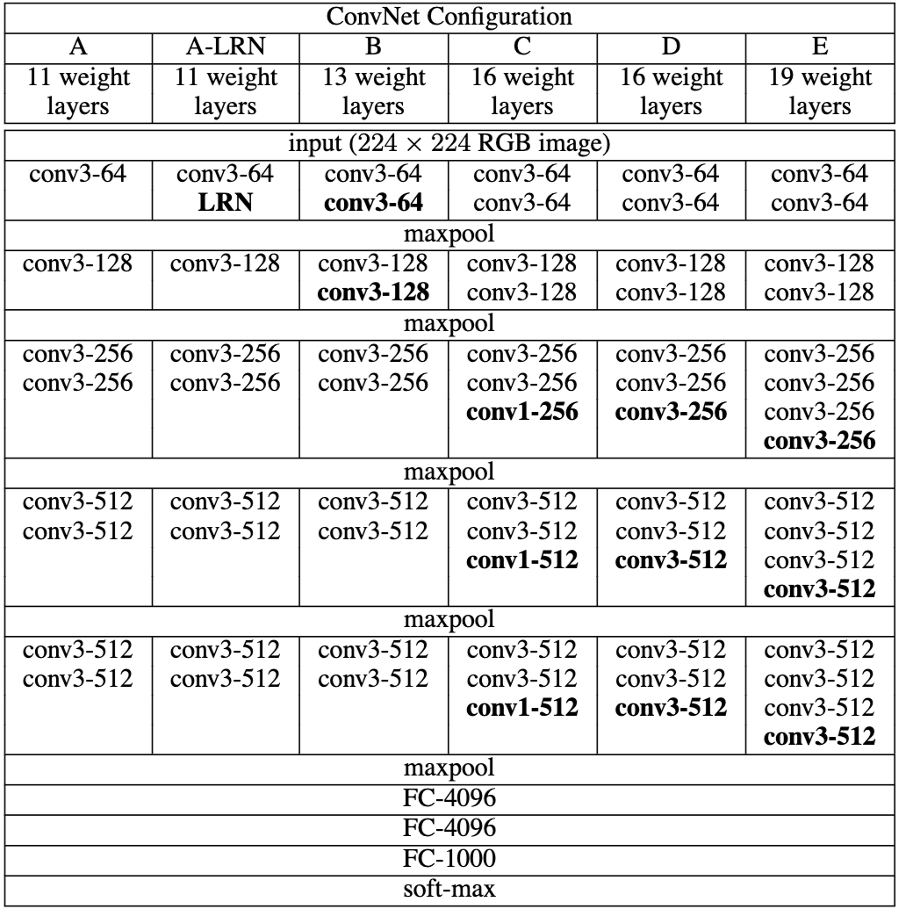   

##### Notes on VGG-16(19)
- All hidden layers are equipped with the rectification (ReLU) non-linearity. 
- It is also noted that none of the networks (except for one) contain Local Response Normalisation (LRN), such normalization does not improve the performance on the ILSVRC dataset, but leads to increased memory consumption and computation time.

### Residual Networks(ResNets)
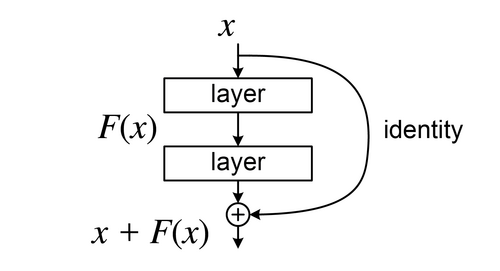
Above image show residual block in deep residual network whose residual connection skips two layers.  

In a multilayer neural network model, consider a subnetwork with a certain number of stacked layers (e.g., 2 or 3). Denote the underlying function performed by this subnetwork as $H(x)$, where $x$ is the input to the subnetwork. Residual learning reparameterizes this subnetwork and lets the parameter layers(layer that actually learn) represent a "residual function" $F(x)=H(x)-x$. The output of this subnetwork is then represented as $H(x)=F(x)+x$.  
The operation of $+ x$ is implemented via a "skip connection" that performs an identity mapping to connect the input of the subnetwork with its output. This connection is referred to as a "residual connection" in later work.  It helps to solve the problem of the vanishing/exploding gradient so that helps the model to learn deeper neural network.

#### Mathmatics of ResNets
$$
\begin{aligned}
&z^{[l+1]} = W^{[l+1]}\,a^{[l]} + b^{[l+1]}, \quad a^{[l+1]} = g\!\bigl(z^{[l+1]}\bigr) \\[6pt]
&z^{[l+2]} = W^{[l+2]}\,a^{[l+1]} + b^{[l+2]} \\[6pt]
&\cancel{a^{[l+2]} = g\!\bigl(z^{[l+2]}\bigr)} \\[6pt]
&a^{[l+2]}_{residual} = g\!\bigl(z^{[l+2]} + a^{[l]}\bigr)
\end{aligned}
$$

#### Why ResNets work?
When the network is very deep, it's hard for the parameters in the network to learn even the identity function. On the other hand,the residual block makes easy to $H(x) = x$. Therfore, residual block doesn’t hurt performance and still leaves the possibility to do better than the identity function. So you can say that residual block lowers the baseline to “not hurting performance,” so gradient descent can only improve the solution from that baseline.

$$
a^{[l+2]} \;=\; g\!\bigl( z^{[l+2]} \;+\; a^{[l]} \bigr) \\[6pt]
= g\!\bigl( W^{[l+2]}a^{[l+1]} + b^{[l+2]} + W_s a^{[l]} \bigr)
$$
Also note that dimension of the output and input of residual block should be equal. If not, you can add parameter(or constant) like $W_s$ to match the dimension. For example, when $a^{[l+2]} \in \mathbb{R}^{256}$ and $a^{[l]} \in  \mathbb{R}^{128}$, $W_s \in \mathbb{R}^{256 \times 128}$.

### 1*1 Convolution (Network in Network)
(1 * 1) Convolution simply means the filter is of size (1*1). This 1X1 filter will convolve over the entire input image pixel by pixel. So why this (1 * 1) convolution is used? mainly two reasons.
1. Dimensionality Reduction/Augmentation of channel.
2. Add additional non-linearity to the network.

For example, Suppose you have layer A which is (28 * 28 * 192). If you use 32 (1 * 1 * 192) filters to convole with output of layer A, you get layer with (28 * 28 * 32) dimension. Also, if you apply this output through a non-linear activation(such as ReLU), it adds non-linearity to the network.

#### Pooling vs 1*1 Convolution
While Pooling helps to reduce the height/width of the layer ($N_h, N_w$), 1*1 convolution layer helps to reduce the depth(channel) of the layer ($N_c$).  

### Inception Module
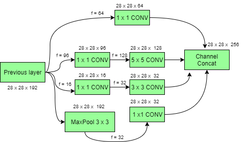
Motivation of Inception module is that instead of handpicking filter size or pooling, concate them all layers and let the network learns whatever parameters it want to use and whatever combinations of the filter sizes it want to use.  
One thing to note is that computational costs can be reduced drastically by introducing a (1 * 1) convolution. As you can see, the number of input channels is reduced by adding an extra (1 * 1) convolution before the (3 * 3) and (5 * 5) convolutions.  
Secondly, intput and output dimension of convolutional network are also same, only the dimension temporarily reduced in (1 * 1) convolution layer(bottleneck).  
For example, let's see (3 * 3) convolution layer. The channel of the output sholud be 32. But rather than applying (3 * 3) convolution directly to the previous layer (28 * 28 * 192), adding 16 (1 * 1) convolution filters prior to that, depth is temporarily reduced to 16 and recovered to 32.  
Lastly, if the bottle neck layer is properly implemented, the performance of the network doesn't hurt.

#### Inception Network
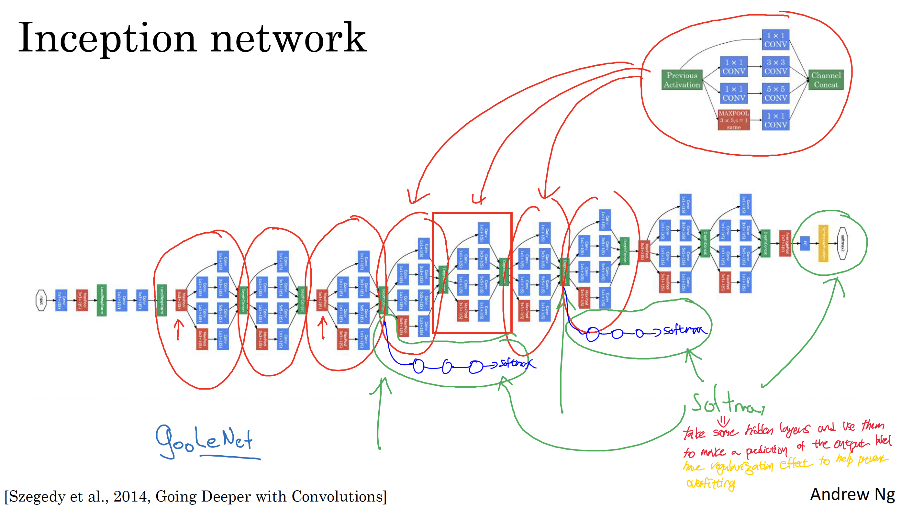
Inception Network is more or less put a lot of these inception modules together. In the Inception Network, take some hidden layers and use them to make a prediction of the output labels. Since it has regularization effecdt to help prevent overfitting.  
It was invented to build deeper network. 

## Practical Advices for ConvNets
### Transfer Learning
In building computer vision application, you progress much faster when using open source weights that has already trained to pre-train and transfer to new task you are interested in.  
One pattern is that if you have more data, the number of layer to freeze could be smaller and the number of layer to train on top could be greater. If you have a lot of data set, you can train the whole open source network.  
From deep learning area, computer vision is one where you should do transfer learning almost always.

### Data Augmentation
Common augmentation methods are color shift and random cropping. Other than these, you can also use rotation, sheering, .. and so on.  
One common way of implementing data augmentation is to have one or multiple threads that are responsible to load and disort the data and passing the output to other thread or process of training. Sometimes disorting and training can be happening parallely.

### Tips
#### Tips for doing well on benchmarks/winning competitions
- Ensembling
  - Train several networks independently and average their outputs.
- Multi-crop at test time
  - Run classifier on multiple versions of test images and average results.
But these techniques are not used in production, because they consume lots of computational budget.
#### Use Open Source Code
Since lots of computer vision problem depends on small dataset regime, other have done a lot of work on architecture of the network. So a neural network works well on one computer vision problem oftern works well on other problems as well.
- Use architectures of networks published in the literature
- Use pretrained models and fine-tune on your dataset
- Use open source implementations if possible

## Classification vs Localization vs Detection
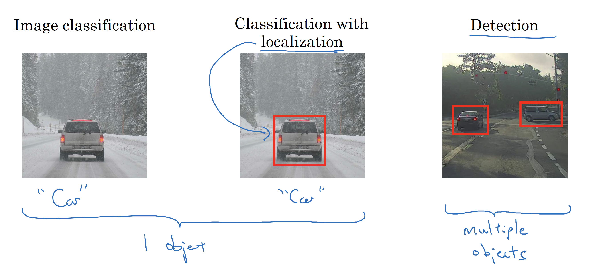
- Classifiation: Outputs the label "car" or "truck" without indicating their positions in the image.
- Object Localization(With Classification): Outputs one bounding box indicating the location of the car or the truck with label "car" or "truck".
- Object Detection: Outputs bounding boxes for both the car and the truck, along with their respective labels "car" and "truck".
## Localization
Object localization can be defined as an aspect of computer vision whereby the aim is to locate the exact position of an object as presented in an image or a frame of video. It comprises not only identifying objects but also locating them in a specific area. Used with Classification, label ("car" or "truck") is also included in the output.
## Detection
Object detection in the domains of computer vision is the task of detecting and locating multiple objects within an image or a video frame. Detection identifies the presence of one or several objects in the same picture or frame.
### Landmark Detection
Landmark detection in deep learning is the process of finding significant landmarks in an image, such as $(x,y)$ coordinates of important points of the image. This idea is simple, adding a bunch of output units to output the $X,Y$ coordinates of landmarks. 
For example, in facial recognition where it is used to identify key points on a face. Key points in the face could be such as coordinates of left/right corner of the eyes. So the model using landmark detection generates output with the key points coordinates(landmarks). Note that the identity of the landmark must be consistent across the images($l_{x1}$ left corner of left eye should be consistent across the images).
### Sliding Window Detection
The sliding window approach in object detection involves gradually moving a predefined window across the entire surface of the image to identify all the objects in it. At each position of the window, the algorithm examines the given region of the image and normally uses a classifier or a detection model to look out for objects. This method is involving such that regardless of the positions of the objects in the image, different parts will be analyzed, and the objects will be detected. The purpose of the sliding window approach is to create potential candidates of objects that could be later discriminated more accurately.  
For example, when detecting a car from the image, choose window size and put the window size region of the picture into the convolutional network and convolutional network makes predcition for that small region to detect whether there is a car or not. Then move the window region and put that shifted small image region into the convolutional network and run predction. You keep going this process until you slit the window across the every region of the image. Next, you repeat this process with larger window and even larger window and so on.  
During this process you hope that somewhere in the image that there will be a window where object is included so that convolutional network can detect the object from this input region.  
The disadvantage is computational cost, because cropping all different regions in the image and running each of them independently through convolutional network. The solution to this problem is that implementing sliding windows object detector convolutionally.

#### Turning Fully Connected Layers into Convolutional Network
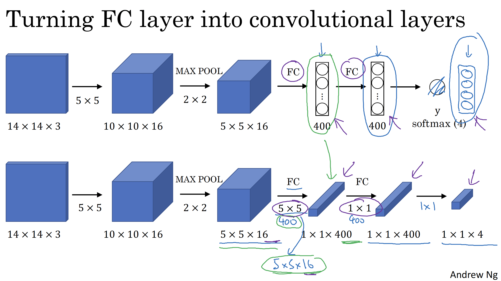
The first network shows the general model with FC layers. The second network shows that you can implement FC layer convolutionally using filters.  
For example, from the (5,5,16) layer, you convolve with (400,5,5,16) filters(in other word four hundred (5,5,16) filters), to make (1,1,400) output layer. So you can see that FC layer with 400 nodes can be viewed as (1,1,400) volume. Mathmatically both layers are identical, because each of the value in the layer has a filter of (5,5,16) and so each of the value is some arbitrary linear function of (5,5,16) activations of previous layer.  
Next, you convolve this layer with (400,1,1,400) filter to get another (1,1,400) output layer which matches for the next FC layer of the first network. Lastly, convolve with (4,1,1,400) filter and apply softmax activation to get (1,1,4) output layer which matches for the output layer of the first model.

#### Convolutional Implementing of Sliding Windows
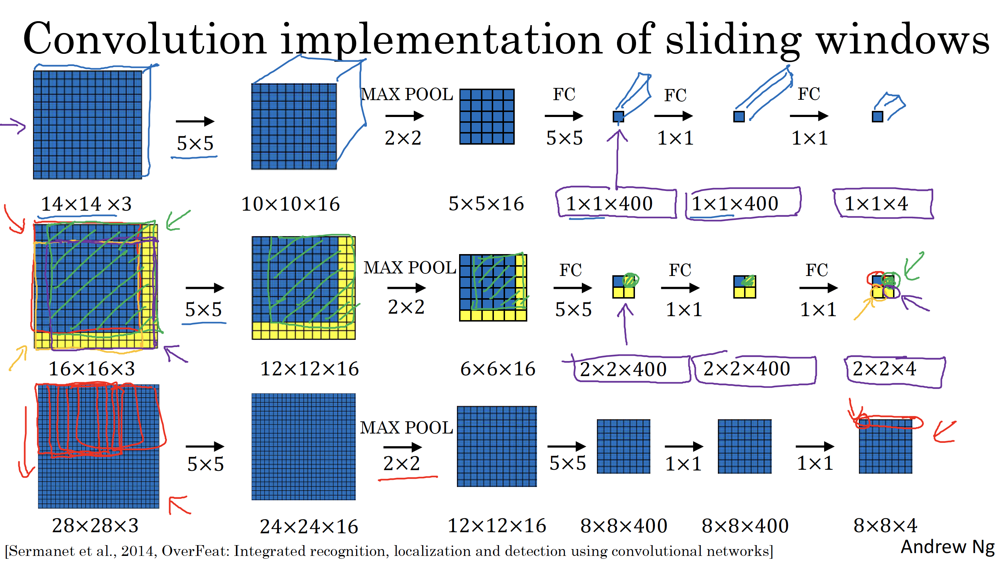
Armed with the knowledge from "Turning Fully Connected Layers into Convolutional Network" section, you can understand the first model in the picture, using (14,14,3) size image as an input and running convolutional network to generate output whose (1,1,4) volume of $1$ or $0$ for detected objects (car, pedestrian, motorcycle, background).  
Now Suppose you have (16,16,3) size image as second model. In original sliding windows algorithm, you input blue region from the image into the convolutional network run once to generate a classification result $0$ or $1$. Then slide right to next green region and input the green region to network and rerun to generate classification result. Keep doing same process to orange and purple region to get 4 labels from the whole image. You can see that the computation is highly duplicated.  
Instead, what convolutional implementation of sliding windows does, you pass the entire image through the process of convolve with filter, maxpool and convolutional implementing of FC layer as the first network to get output (2,2,4) volume to share the computation across $4$ convolutional network from original sliding windows algorithm. It turns out that the blue subset of the output gives you the result of the running the convolutional network with the blue region of the image as input. The same result goes to green, yellow and purple region too. Besides this is true for not only to the output layer, but also to all the intermediate layers.  
So what convolutional implementation does is instead of running $4$ propagation for $4$ subsets of the image independently, it combines all $4$ into $1$ computation and shares a lot of computation. 

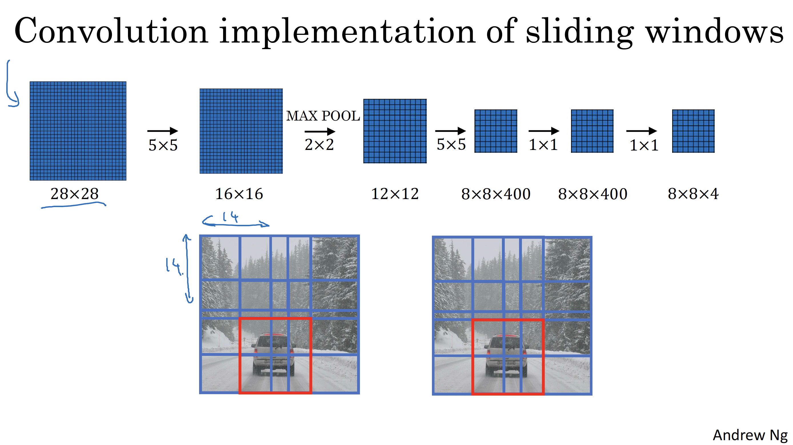
Let's recap with this car image example. Originally, what sliding windows algorithm does is cropping out the window size regions and run convolutional network to generate classification result and move to next region until reach the end of the image and hopefully certain window region recognizes the car.  
But instead of doing it sequentially, with convolutional implementation of sliding windows, you make prediction at the same time to detect the position of the car by passing the entire image through big convolutional network.  
One weakness of this algorithm is that the position of the bounding box is not going to be very accurate.

### Intersection over Union(IoU)
Most of the time, a single object in an image can have multiple grid box candidates for prediction, even though not all are relevant. The goal of the IOU (a value between $0 \sim 1$) is to discard such grid boxes to only keep those that are relevant.  
$$
\text{IOU} \;=\; \frac{\text{Intersection Area}}{\text{Union Area}}
$$
1. First, user defines its IOU selection threshold, which can be, for instance, 0.5. 
2. Secondly, computes the IOU of each grid cell, which is the Intersection area divided by the Union Area. 
3. Finally, it ignores the prediction of the grid cells having an IOU $\leq$ threshold and considers those with an IOU $\geq$ threshold. 

Above shows an illustration of applying the grid selection process. We can observe that the object originally had two grid candidates, and only “Grid 2” was selected at the end. 

More generally, IoU is a measure of the overlap between two bounding boxes.

### Non-Max Suppression
Setting a threshold for the IOU is not always enough because an object can have multiple boxes with IOU beyond the threshold, and leaving all those boxes might include noise. Non-Max Suppression makes sure that your algorithm detects each object only once and prevent multiple detection of the same object.

Each output prediction of the grid is as below when detecting single object.
$$y = [pc, bx, by, bh, bw]$$
You can understand this output vector for every grid cell, you output bounding box($bx,by,bh,bw$), together with a probability of that bounding box being a good one($pc$).

1. First, discard all boxes with low probability(e.g., $pc \leq 0.6$), while $pc$ stands for the chance that there is an object. 
2. While there are any remaining boxes:
  - Pick the box with the largest $pc$ and output that as a prediction.
  - Discard any remaining box with $IoU \geq 0.5$ with the box output
in the previous step.

When detecting multiple objects, carrying out non-max suppresion for each of the output class.

### YOLO Algorithm
#### Bounding Box Predictions
Bounding box predictions is a technique used in object detection tasks to predict the coordinates of a bounding box that tightly encloses an object of interest within an image. You can see the problem of inaccurate bounding box from "Convolutional Implementing of Sliding Windows" section above.  

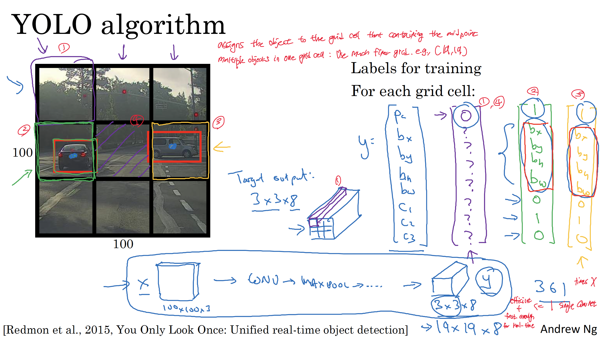
YOLO Algorithm determines the attributes of these bounding boxes using the following format, where $y$ is the final vector representation for each bounding box from each grid. In other words, each grid predicts bounding boxes and their confidence scores. 

The bounding box is defined by five parameters: x, y, w, h, and confidence. Here, x and y define the position of the bounding box center relative to the grid, w and h define the width and height of the bounding box relative to the entire image, and confidence measures the presence of an object in the grid and the accuracy of the bounding box prediction.

$$y = [pc, bx, by, bh, bw, c1, c2,c3]$$

- $pc$ is confidence measures the presence of an object in the grid and the accuracy of the bounding box prediction. In other words, the probability that object is actually contained inside the rectangle defined by $bx,by,bh,bw$.

It is only $0,1$ because YOLO assigns the object to the grid cell that containing the mid point($bx,by$).

- $bx, by$ are the $(x,y)$ coordinates of the center of the bounding box with respect to the enveloping grid cell. Must be between $0 \sim 1$.

- $bh, bw$ correspond to the height and the width of the bounding box with respect to the enveloping grid cell. Could be greater than $1$.

- $c1,c2,c3$ correspond to the three classes, car, pedestrian, motorcycle. We can have as many classes as your use case requires.

So when you have (3,3) grid cell as above picture and you have $y$ vector with $8$ dimensions, the total volume of the output will be (3,3,8). To get more detail about $bx,by,bh,bw$, see below picture.

When you have multiple objects in one grid cell, use much finer grid such as (19,19) instead of (3,3) as the first picture above.

#### Anchor boxes
The idea of anchor boxes is to make a grid cell to detect multiple objects. These anchor boxes are pre-defined bounding boxes with specific sizes, aspect ratios, and positions that are used as reference templates during object detection. These anchor boxes are placed at various positions across an image, often in a grid-like pattern, to capture objects of different scales and shapes.  
Previously, each object in training image is assigned to grid
cell that contains that object’s midpoint.  
With anchor boxes, each object in training image is assigned to grid cell that contains object’s midpoint and anchor box for the grid cell with highest IoU. Also output layer has repetitive structure for each anchor box.

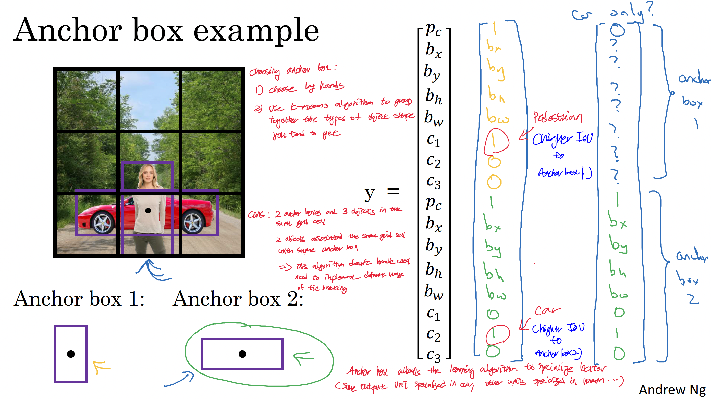
For this example, the mid points of the pedestrian and car are in the same grid cell. However, since pedestrian object has higher IOU with long shaped anchor box1, this pedestrian object get assigned to (grid8, ancho box1) pair. Similarly, the car object has higher IOU with wide shaped anchor box 2, the car object get assinged to (grid8,anchor box2) pair.

#### Bounding boxes vs Anchor boxes
- Bounding boxes represent the actual regions in an image that enclose objects of interest.
- Anchor boxes are reference bounding boxes used to predict object locations and shapes during object detection.

#### Pros and Cons og Anchor boxes
- Pros: Anchor boxes algorithm allows the learning algorithm to specialize better. For example, some output units are specialized in car and other units are specialized in pedestrians.. and so on.
- Cons: Anchor boxes algorithm doesn't handle well in the cases such as when there are 2 anchor boxes and 3 objects in the same grid, or when there are multiple objects in the same grid associatied with same anchor box. You need to implement default way of tie breaking method.

#### Choosing Anchor boxes
- Choose by hands.
- Use K-means algorithm to group together the types of obejct shape you tend to get.

#### Outputting the non-max supressed outputs in YOLO
Suppose you use (3,3) grid with 2 anchor boxes, then you will have 2 predicted bounding
boxes for each cell when making prediction in YOLO.

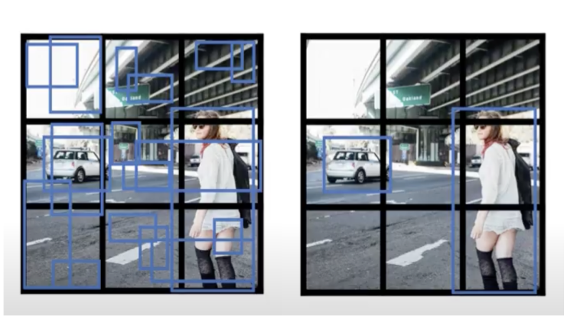
Then you run,
1. Get rid of low probability predictions.
2. For each class (pedestrian, car, motorcycle) use non-max suppression to generate final
predictions.

### Region Proposals

## Face Recognition
### Face verification vs Face recognition
- Verification
  - Input image, name/ID
  - Output whether the input image is that of the claimed person
- Recognition
  - Has a database of K persons
  - Get an input image
  - Output ID if the image is any of the K persons (or
“not recognized”)
### One-Shot Learning
Learning from one example to recognize the person again.
#### Similarity Function
$$d(\text{img1,img2}) = \text{degree of difference between images}$$  
 - $d(\text{img1,img2}) < \tau$: same person
 - $d(\text{img1,img2}) > \tau$: different person  
 
### Siamese Network
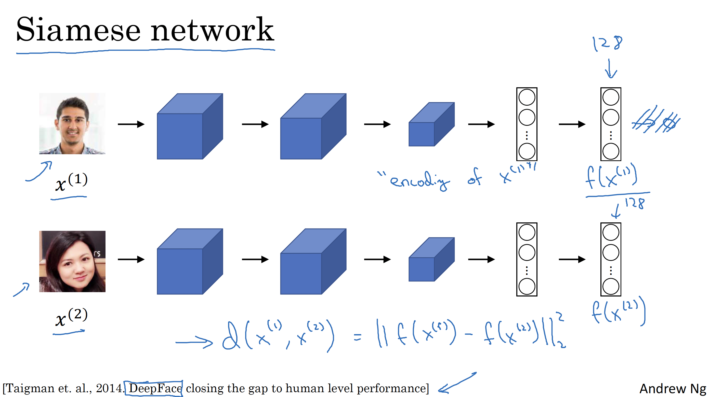
Siamese Neural Networks (SNNs) are a specialized type of neural network designed to compare two inputs and determine their similarity. Unlike traditional neural networks, which process a single input to produce an output, SNNs take two inputs and pass them through identical subnetworks. It uses the same weights while working in two different input vectors to compute comparable output vectors.

The common learning goal is to minimize a distance metric for similar objects and maximize for distinct ones.
$$
{\displaystyle {\begin{aligned}{\begin{cases}\min \ \|\operatorname {f} \left(x^{(i)}\right)-\operatorname {f} \left(x^{(j)}\right)\|\,,i=j\\\max \ \|\operatorname {f} \left(x^{(i)}\right)-\operatorname {f} \left(x^{(j)}\right)\|\,,i\neq j\end{cases}}\end{aligned}}}
$$
Where ${\displaystyle i,j}$ are indexes into a set of vectors ${\displaystyle \operatorname {f} (\cdot )}$ function implemented by the twin network. Simply speaking, the paarameters of SNNs define an encoding ${\displaystyle \operatorname {f} (\cdot )}$ and learn parameters so that above condition meet.  

Learning in twin networks can be done with triplet loss or contrastive loss. For learning by triplet loss a baseline vector (anchor image) is compared against a positive vector (truthy image) and a negative vector (falsy image). The negative vector will force learning in the network, while the positive vector will act like a regularizer. 
### Triplet Loss
Triplet loss is a machine learning loss function widely used in one-shot learning, a setting where models are trained to generalize effectively from limited examples.  It designed to assist training models to learn an embedding (mapping to a feature space) where similar data points are closer together and dissimilar ones are farther apart, enabling robust discrimination across varied conditions. In the context of face detection, data points correspond to images.  
The loss function is defined using triplets of training points of the form (A,P,N) In each triplet, A (called an "anchor point") denotes a reference point of a particular identity, P (called a "positive point") denotes another point of the same identity in point A, and N (called a "negative point") denotes a point of an identity different from the identity in point A and P.  

The goal of training here is to ensure that, after learning, the following condition (called the "triplet constraint") is satisfied by all triplets ${\displaystyle (A^{(i)},P^{(i)},N^{(i)})}$ in the training data set:
$$
{\displaystyle \Vert f(A^{(i)})-f(P^{(i)})\Vert _{2}^{2}+\alpha <\Vert f(A^{(i)})-f(N^{(i)})\Vert _{2}^{2}}
$$
Where ${\displaystyle \alpha }$ is a hyperparameter called the margin, and its value must be set manually. In the FaceNet system, its value was set as $0.2$. This margin has two purpose. One is to prevent each distance function to beconme 0. The other is to make the learning algorithm work extra hard to push right hand side up and push down the left hand side.
Thus, the full form of the function to be minimized is the following:
$${\displaystyle L=\sum _{i=1}^{m}\max {\Big (}\Vert f(A^{(i)})-f(P^{(i)})\Vert _{2}^{2}-\Vert f(A^{(i)})-f(N^{(i)})\Vert _{2}^{2}+\alpha ,0{\Big )}}$$
Note that it is the hinge function(i.e., $\max(0, ⋅)$) which is applied to each term before summing, not after summation.

#### Choosing the Triplet (A,P,N)
When choosing the triplets (A,P,N) during training, if A,P,N are chosen randomly below condition is easily satisfied, When A=P same person and N is different person.
$$
{\displaystyle \Vert f(A^{(i)})-f(P^{(i)})\Vert _{2}^{2}+\alpha < \Vert f(A^{(i)})-f(N^{(i)})\Vert _{2}^{2}}
$$
Choose triplets that’re “hard” to train on. In particular choose (A,P) whose the value of distance function is very close to that of (A,N). 
$$
{\displaystyle \Vert f(A^{(i)})-f(P^{(i)})\Vert _{2}^{2} \approx \Vert f(A^{(i)})-f(N^{(i)})\Vert _{2}^{2}}
$$ 
It makes the learning algorithm work extra hard to push right hand side up and push down the left hand side to have a margin between them.

### Binary Classification on Face Verification
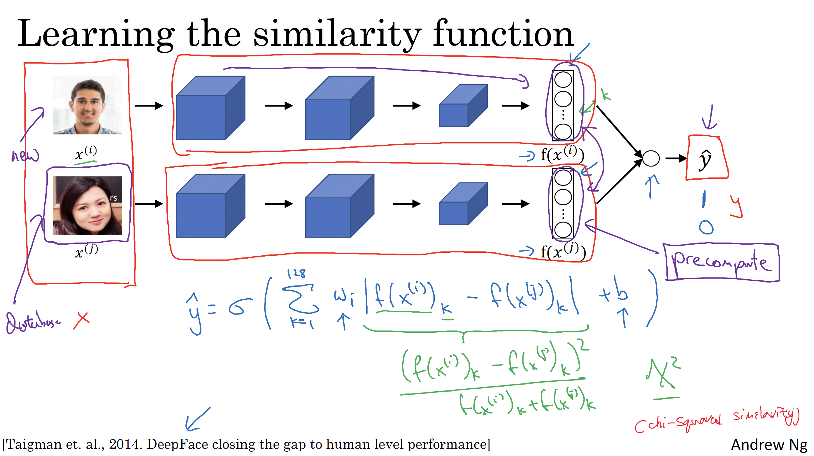

Binary classification can be another way to learn parameters other than triplet loss using siamese network in face recognition problem. Using the two output vectors from the siamese network as inputs to logistic regression unit to make prediction. So the output $\hat{y}$ will be either $0$ if both persons are different and $1$ if they are same person.  
Computing $\hat{y}$ can be done as below.
$$
\hat{y}\;=\;
\sigma\!\Bigl(\sum_{k=1}^{128}w_k\,\bigl\lvert f\!\bigl(x^{(i)}\bigr)_k \;-\; f\!\bigl(x^{(j)}\bigr)_k \bigr\rvert \;+\; b \Bigr)
$$
Note that there is an other variation on $\bigl\lvert f\!\bigl(x^{(i)}\bigr)_k \;-\; f\!\bigl(x^{(j)}\bigr)_k \bigr\rvert $ this part on the formular, which is called chi-squred similarity.
$$
\chi^{2} = \sum_{k=1}^{128} \frac{\bigl(f\!\bigl(x^{(i)}\bigr)_k
\;-\; f\!\bigl(x^{(j)}\bigr)_k \bigr)^{2}} {f\!\bigl(x^{(i)}\bigr)_k \;+\; f\!\bigl(x^{(j)}\bigr)_k}
$$
One computational trick is that you pre-compute the database images into embeddings so that you don't need to compute in real-time situation. So when a person comes in, you only compute the encoding of the new person and compare with the pre-computed encodings to make prediction. Note that this trick can be applied to not only binary classification, but also to triplet loss.

## Neural Style Transfer
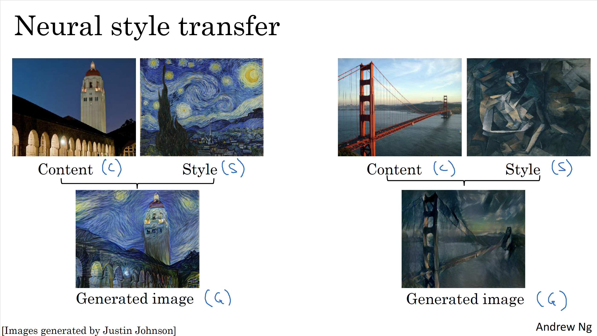
Neural style transfer (NST) refers to a class of software algorithms that manipulate digital images, or videos, in order to adopt the appearance or visual style of another image. NST algorithms are characterized by their use of deep neural networks for the sake of image transformation. Common uses for NST are the creation of artificial artwork from photographs, for example by transferring the appearance of famous paintings to user-supplied photographs. This method has been used by artists and designers around the globe to develop new artwork based on existent style(s).
### Visualizing what a deep network is learning
Pick a unit in layer $k$ and find the image patches that maximize the unit’s activation. In the shallow layers, you get the simple features such as edges or particular shade of colors. In the deeper layers, you get the larger image patches and more complex features.

### Cost Function of Neural Style Transfer
$$
J(G) \;=\; \alpha\,J_{\text{content}}(C,G) \;+\; \beta\,J_{\text{style}}(S,G)
$$
To find the generated image $G$, 
1. Initiate Image $G$ randomly
2. Use gradient descent to minimize $J(G)$.  
$ G \;:=\; G \;-\; \eta\,\frac{\partial}{\partial G}J(G)$

#### Content cost function
$$
J_{\text{content}}(C,G)
   \;=\;
   \tfrac12 \,
   \left\lVert
      a^{[l]}(C) - a^{[l]}(G)
   \right\rVert_{2}^{2},
$$
When $a^{[l]}(C)$ and $a^{[l]}(G)$ be the activation of layer $l$ of the Convolutional network of the each images($C,G$), if they are similar, both images have similar content.

#### Style cost function
When $a^{[\ell]}_{\,i,j,k}$ is activation at $(i,j,k)$ where $i$ is height, $w$ is width and $k$ is number of channel. 
$$
G^{[\ell]}_{kk'}(S) \;=\; \sum_{i=1}^{n_H^{[\ell]}} \;\sum_{j=1}^{n_W^{[\ell]}} a^{[\ell]}_{\,i j k}(S)\; a^{[\ell]}_{\,i j k'}(S) \\[6pt]
G^{[\ell]}_{kk'}(G) \;=\; \sum_{i=1}^{n_H^{[\ell]}} \;\sum_{j=1}^{n_W^{[\ell]}} a^{[\ell]}_{\,i j k}(S)\; a^{[\ell]}_{\,i j k'}(S)
$$
What style matrix $G$ does is that summing over the different position of the image over the height and width, multiplying the activations of the channel $k$ and $k'$. In other words, look at different positions across the channels of activations. For example, one number in first channel and the other in the second channel and see across all $n_H$, $n_W$ how correlated these two numbers.  
$G^{[\ell]}_{kk'}$ will be large if the both of activations are large together and otherwise $G^{[\ell]}_{kk'}$ will be small.
$$
J_{\text{style}}^{[\ell]}(S,G) \;=\; \frac{1}{\bigl(2\,n_H^{[\ell]} n_W^{[\ell]} n_C^{[\ell]}\bigr)^{2}} \bigl\lVert
G^{[\ell]}(S) - G^{[\ell]}(G) \bigr\rVert_{F}^{2}\;=\; \\[3pt]
\frac{1}{\bigl(2\,n_H^{[\ell]} n_W^{[\ell]} n_C^{[\ell]}\bigr)^{2}} \sum_{k}\sum_{k'} \bigl(C^{[\ell]}_{kk'}(S) - C^{[\ell]}_{kk'}(G) \bigr)^{2}
$$
So you can now define the style cost function as above, the difference between two style matrix of ground image and style image.  
Overall style cost function is defined as below.
$$
J_{\text{style}}(S,G) \;=\; \sum_{\ell}\, \lambda^{[\ell]}\; J_{\text{style}}^{[\ell]}(S,G)\;,
$$
Note that $\lambda$ allows to use different layers in neural network earlier layer to capture simple, low-level features like  edges and later layer for high level features. So take both low and high level features into account.

##### Intuition about style of an image
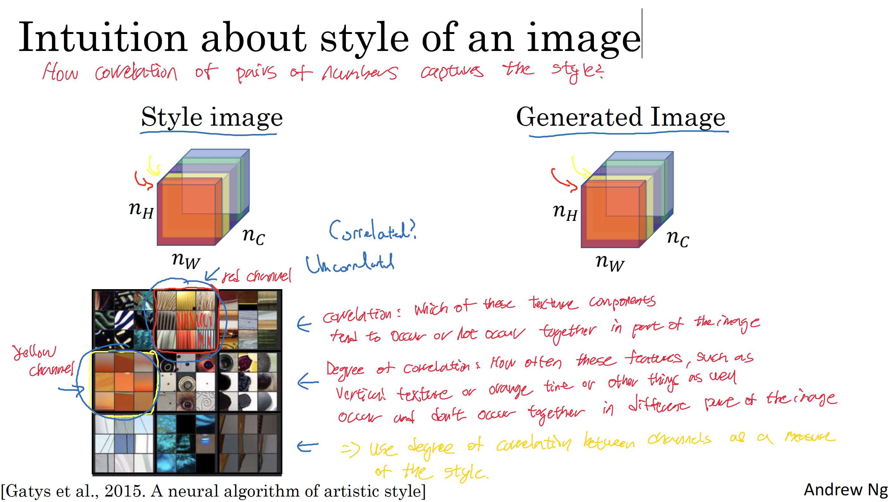
If you are using layer $l$'s activation to measure “style",define style as correlation between activations across channels.  
What is correlation and how correlation of pairs of numbers capture the style? Note that correlation indicates which of these components tend to occur or not occur together in part of the image. So degree of correlation is how often these features, such as vertical texture or orange tinge or other things as well occur and don't occur together in different part of the image.  
Therfore, we use degree of correlation between channels as a measure of the style.

## Convolutional Networks in 1D and 3D
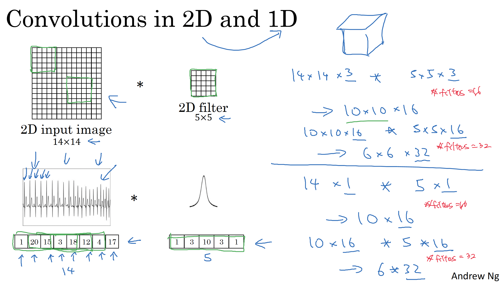
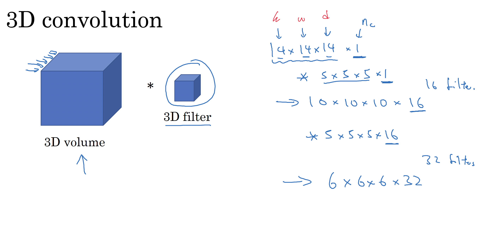

## ZFNet (Visualizing and Understanding Convolutional Networks)
https://arxiv.org/pdf/1311.2901

## VAE
https://arxiv.org/pdf/1312.6114

## VQ-VAE
https://arxiv.org/pdf/1711.00937

## RQ-VAE
https://arxiv.org/pdf/2203.01941