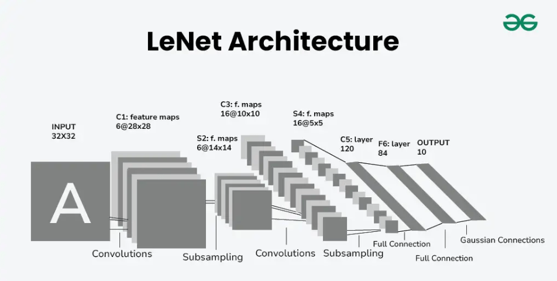
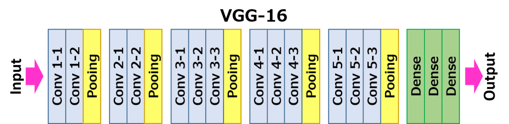

# Computer Vision
## Preliminaries
### Edge
Edges are defined as curves in a digital image at which the image brightness changes sharply or, more formally, has discontinuities.
These changes usually happen at borders of objects. 
Detecting edges helps us understand the shape, size and location of different parts in an image. 
### Edge Detection
Edge detection is a technique used to identify the boundaries of objects within images. 
It helps in simplifying the image data by reducing the amount of information to be processed while preserving the structural properties of the image. 
Edge Detection is essential for various image analysis tasks, including object recognition, segmentation, and image enhancement.

#### First-Order Derivative Edge Detction
In a continuous view, an edge pixel is a point where the first derivative of image intensity has a local maximum in the direction of the gradient. So the edge is where intensity changes rapidly across, and is (approximately) constant along.  

- The intensiy function is a table of samples $I[i,j]$ whose values on a pixel grid. Since the function $I$ is defined only at the lattice points $(i,j)$ like $(11, 10)$, not $(11.1, 10.5)$ (this contains nothing). So Note that intensity function is a set of discrete samples, not a continuous field.
- The gradient vector $\nabla I \;=\; \left( \frac{\partial I}{\partial x},\; \frac{\partial I}{\partial y} \right)$ points in the direction of greatest increase of intensity, where I is intensity function. So gradient magnitude $||\nabla I||$ is large at edges.  

Since the intensity function of a digital image is only known at discrete points, derivatives of this function cannot be defined unless we assume that there is an underlying differentiable intensity function that has been sampled at the image points. With some additional assumptions, the derivative of the continuous intensity function can be computed as a function on the sampled intensity function. Therefore, it turns out that the derivatives at any particular point are functions of the intensity values at virtually all image points.

However, you can get the approximate derivative of the intensity function by convolutioning filters. The discrete differentiation operator such as Sobel operator, represents a rather inaccurate approximation of the image gradient, but is still of sufficient quality to be of practical use in many applications. This operator(filter) uses convolutional masks to highlight regions with high spatial frequency, which correspond to edges.

##### Intuition

Note that it doesn't matter you choose upper case to get positive output or lower case to get negative output because you take absolute value.

Note that transition region is intermediate values. These intermediate value is relatively small when image is big.

### Filter (Kernel)
In image processing, a kernel, convolution matrix, or mask is a small matrix used for blurring, sharpening, embossing, edge detection, and more. This is accomplished by doing a convolution between the kernel and an image.  
Put simply, during convolution, kenrel is a small grids that move over the image. Or it can be interpreted as a sliding function applied to the image matrix.  
e.g., Sobel filter.

In edge detection, instead of using existing filters, you can make the filter to learn the numbers to get good edge detector. This can be done by treating those numbers as prameters and using backpropagation.

### Convolution
Mathmatically convolution is an operation on two functions $f$ and $g$ that produces a third function $f*g$ as the integral of the product of the two functions after one is reflected about the y-axis and shifted.  
In ML, convolution is an application of a sliding window function to a matrix of pixels representing an image.

#### Convolution vs Cross-Correlation
 - Convolution in Deep Learning = Cross-Correlation
 - Convolution in Mathmatics = Cross-Correlation + Mirroring

Convolution in general, the kernel is flipped both horizontally and vertically before applying. However, in deep learning, for more computationally efficient by skipping the flipping step, the kernel is used as-is without flipping. Plus, just call convolution instead of term cross-correlation

### Padding and Stride
#### Padding
During convolution, the size of the output feature map is determined by the size of the input feature map, the size of the kernel, and the stride. If we simply apply the kernel on the input feature map, then the output feature map will be smaller than the input. This can result in the loss of information at the borders of the input feature map. In order to preserve the border information we use padding.

- Valid Convolution: No padding is added to the input feature map, and the output feature map is smaller than the input feature map. This is useful when we want to reduce the spatial dimensions of the feature maps.
- Same Convolution: Padding is added to the input feature map such that the size of the output feature map is the same as the input feature map. This is useful when we want to preserve the spatial dimensions of the feature maps.

To formalize, let's say when there is $(n \times n)$ size image and $(f \times f)$ filter. Suppose $p$ is padding size, then $(n \times n)$ image becomes $(n + 2p) \times (n + 2p)$ image after padding. After convolution, the output image is $(n + 2p - f + 1) \times (n + 2p - f + 1)$ size.
#### Stride
The number of rows and columns traversed per slide as stride. So the output size including strides is cacluated as below.
$$
\left\lfloor \frac{n + 2p - f}{s} + 1 \right\rfloor
\times
\left\lfloor \frac{n + 2p - f}{s} + 1 \right\rfloor
$$

## Convolutional Network
### Convolution over volume

You can stack multiple 2-D pixel matrix(height * width) to represent 3-D tensor(height * width * #channel). One thing to note is to match the number of channel of image and filters. So how do you convolve this pixel tensor with the 3D filter? Similar to 2-D convolution, take each numbers of the filter and multiply them with the corresponding numbers from the each channel of the tensor.  
To put it simply using above image example, take the each $9$ numbers from the $3$ channels and multiply it with the corresponding $27$ numbers that gets covered by first left yellow cube show on the image. Then add up all those numbers and this gives you this first number in the output, and then to compute the next output you take this cube and slide it over by one, and again, due to 27 multiplications, add up the 27 numbers, that gives you this next output and so on.

From the above image, you have to match the number of channel to $3$. When performing image processing in convolutional neural network, each channel represents a color. In a color image, there are three channels: red, green, and blue. An RGB image can be described as a $w \times h \times n\_c$ matrix, where each denotes the width, height, and the number of channels respectively. Thus, when an RGB image is processed, a three-dimensional tensor is applied to it.  

Unlike RGB images, grayscale images are singled channeled and can be described as a $w \times h$ matrix, in which every pixel represents information about the intensity of light.

### Multiple Filters

When we want to detect not just single feature from the tensor, but multiple features, we can use multiple filters. (e.g., detect vertical, horizontal, 45 degree edges and so on)
The output is the stack of the result of each convolution of filter. From the above image example, since it is using two filters to detect vertical and horizontal edges, the number of output is also two and you combine these two result.
$$
\begin{aligned}
&\textbf{Input tensor:}  && n \times n \times n_c \\[2pt]
&\textbf{Filter (kernel):} && f \times f \times n_c \\[2pt]
&\textbf{Output tensor:} &&
      (\,n - f + 1\,)\;\times\;(n - f + 1)\;\times\;n_c' \\[6pt]
%-----------------------------------------------------------
&\textit{Example:}  && 6 \times 6 \times 3 
      \;\;{\xrightarrow{\;\;3 \times 3 \times 3,\; n_c'=2\;\;}}
      \;\;4 \times 4 \times 2
\end{aligned}
$$
### Convolutional Layer

Consider above convolutional layer example.  
$a^{[0]} = x$ is convolution with each filter $w^{[1]}$ and bias $b^{[1]}$ is added. So the result $z^{[1]} = w^{[1]} a^{[0]} + b^{[1]}$. Applying Relu function to $z^{[1]}$ to get output $a^{[1]}$.

- $f^{[l]}$ is filter(kernel) size.
- $p^{[l]}$ is padding.
- $s^{[l]}$ is stride.
- $n_c^{[l]}$ is number of channel of output(=number of filters). 
- $f^{[l]} \times f^{[l]} \times n_c^{[\,l-1]}$ is each filter.
- $f^{[l]} \times f^{[l]} \times n_c^{[\,l-1]} \times n_c^{[l]}$ is weight.
- $b^{[l]}: 1 \times 1 \times 1 \times n_c^{[l]}$ is bias.
- $a^{[l-1]} = n_H^{[\,l-1]} \times n_W^{[\,l-1]} \times n_c^{[\,l-1]}$ is input.
- $a^{[l]} = n_H^{[\,l]} \times n_W^{[\,l]} \times n_c^{[\,l]}$ is output.  

Note that the number of depth(channel) of output layer is same as the number of filters applied.
Also remind that size of height and width is below.
$$
n_H^{[\,l]} = 
\Bigl\lfloor \frac{n_H^{[\,l-1]} + 2p^{[l]} - f^{[l]}}{s^{[l]}} + 1 \Bigr\rfloor,
\qquad
n_W^{[\,l]} = 
\Bigl\lfloor \frac{n_W^{[\,l-1]} + 2p^{[l]} - f^{[l]}}{s^{[l]}} + 1 \Bigr\rfloor 
$$
So the output layer dimension is, 
$$
\Bigl\lfloor \frac{n_H^{[\,l-1]} + 2p^{[l]} - f^{[l]}}{s^{[l]}} + 1 \Bigr\rfloor \times \Bigl\lfloor \frac{n_W^{[\,l-1]} + 2p^{[l]} - f^{[l]}}{s^{[l]}} + 1 \Bigr\rfloor  \times n_c^{[l]}
$$
### Pooling
A pooling layer is a kind of network layer that downsamples and aggregates information that is distributed among many vectors into fewer vectors. So pooling is basically convolution over data with filter but summarizing the features within the region covered by the filter.
- Max Pooling: Max pooling selects the maximum element from the region of the feature map covered by the filter. Thus, the output after max-pooling layer would be a feature map containing the most prominent features of the previous feature map. Max pooling layer preserves the most important features (edges, textures, etc.) and provides better performance in most cases.
- Average Pooling: Average pooling computes the average of the elements present in the region of feature map covered by the filter. Thus, while max pooling gives the most prominent feature in a particular patch of the feature map, average pooling gives the average of features present in a patch. Average pooling provides a more generalized representation of the input. It is useful in the cases where preserving the overall context is important. Also it is sometimes used in very deep neural network to collapse the representation.($n \times n$ to $1 \times 1$)

The output dimension can be calculated just like before.
$$
\Bigl\lfloor \frac{n_H^{[\,l-1]} + 2p^{[l]} - f^{[l]}}{s^{[l]}} + 1 \Bigr\rfloor \times \Bigl\lfloor \frac{n_W^{[\,l-1]} + 2p^{[l]} - f^{[l]}}{s^{[l]}} + 1 \Bigr\rfloor  \times n_c^{[l]}
$$

### Convolutional Network Example
General trend in Convolutional Network is that as go deeper in the network, size of height & width stays same for while and trend down, while the number of channer gradually increase.

### Why Convolutional Network?
- Good at detecting patterns and features in images, videos, and audio signals.
- Robust to translation, rotation, and scaling invariance.

#### Invariance
Invariance means that you can recognize an object as an object, even when its appearance varies in some way. This is generally a good thing, because it preserves the object's identity, category, (etc) across changes in the specifics of the visual input, like relative positions of the viewer/camera and the object.

#### Why Convolutional Network have small number of parameters?
- Parameter sharing: A feature detector (such as a vertical
edge detector) that’s useful in one part of the image is probably
useful in another part of the image.
- Sparsity of connections: In each layer, each output value
depends only on a small number of inputs.

### Backpropagation of Convolutional Network
https://pavisj.medium.com/convolutions-and-backpropagations-46026a8f5d2c

### Backpropagation of MaxPooling
https://towardsdatascience.com/forward-and-backward-propagation-of-pooling-layers-in-convolutional-neural-networks-11e36d169bec/

### Backpropagation of Linear Layer
https://robotchinwag.com/posts/linear-layer-deriving-the-gradient-for-the-backward-pass/

## Convolutional Network Case Study
### Classic Networks
#### LeNet-5

1. Input layer : (32,32,1) 
   - Note that depth is 1 since it is grey scale.
2. Convolution layer 1: 
   - Convolution with Filter: (5,5,1) * 6, with stride=1 and padding=0
   - ((((32 + (2 * 0) - 5) / 1) + 1), (((32 + (2 * 0) - 5) / 1) + 1)) * 6 = (28,28,6)
3. Pooling(Subsampling) layer 1:
   - Pool with Filter: (2,2,6) * 6, with stride=2 and padding=0
   - ((((28 + (2 * 0) - 2) / 2) + 1), (((28 + (2 * 0) - 2) / 2) + 1)) * 6 = (14,14,6)
4. Convolution layer 2: 
   - Convolution with Filter: (5,5,6) * 16, with stride=1 and padding=0
   - ((((14 + (2 * 0) - 5) / 1) + 1), (((14 + (2 * 0) - 5) / 1) + 1)) * 16 = (10,10,16)
5. Pooling(Subsampling) layer 2:
   - Pool with Filter: (2,2,6) * 16, with stride=2 and padding=0
   - ((((10 + (2 * 0) - 2) / 2) + 1), (((28 + (2 * 0) - 2) / 2) + 1)) * 16 = (5,5,16)
6. Fully Connected Layer 1:
   - Weight: ((5*5*16), 120)
   - Parameters: Weight(400 * 120) + Bias(120)
7. Fully Connected Layer 2:
   - Weight: (120, 84)
   - Parameters: Weight(120 * 84) + Bias(84)
8. Output Layer:
   - Softmax Function of 10 output.

##### Note on Lenet-5
- As go deeper through the network, $N_h$, $N_w$ reduces, while $N_c$ increases.
- The original Lenet-5 uses Euclidean Radial Basis Function(RBF) as output layer which is useless these days. 
- The original Lenet-5 has non-linearity function (such as sigmoid) after convolution layers, (conv-sigmoid-pool-conv-sidmoid-pool) which is not done thesedays also. 
- Lastly, Lenet-5 used average pool instead of max pool in pooling layer.

#### AlexNet

1. Input layer : (227,227,3)
2. Convolution layer 1: 
   - Convolution with Filter: (11, 11, 3) * 96, with stride=4 and padding=0
   - ((((227 + (2 * 0) - 11) / 4) + 1), (((227 + (2 * 0) - 11) / 4) + 1)) * 96 = (55,55,96)
3. Pooling(Subsampling) layer 1:
   - Pool with Filter: (3,3,96) * 96, with stride=2 and padding=0
   - ((((55 + (2 * 0) - 3) / 2) + 1),(((55 + (2 * 0) - 3) / 2) + 1)) * 96 = (27,27,96)
4. Convolution layer 2: 
   - Convolution with Filter: (5,5,96) * 256, with stride=1 and padding=2 (same convolution)
   - ((((27 + (2 * 2) - 5) / 1) + 1), (((27 + (2 * 2) - 5) / 1) + 1)) * 256 = (27,27,256)
5. Pooling(Subsampling) layer 2:
   - Pool with Filter: (3,3,256) * 384, with stride=2 and padding=0
   - ((((27 + (2 * 0) - 3) / 2) + 1), (((27 + (2 * 0) - 3) / 2) + 1)) * 384 = (13,13,384)
6. Convolution layer 3 ~ 4: 
   - Convolution with Filter: (3,3,384) * 384, with stride=1 and padding=1 (same convolution)
   - ((((13 + (2 * 1) - 3) / 1) + 1), (((13 + (2 * 1) - 3) / 1) + 1)) * 384 = (13,13,384)
   - Two Convolution Layers in a row.
7. Convolution layer 5: 
   - Convolution with Filter: (3,3,384) * 256, with stride=1 and padding=1 (same convolution)
   - ((((13 + (2 * 1) - 3) / 1) + 1), (((13 + (2 * 1) - 3) / 1) + 1)) * 256 = (13,13,256)
8. Pooling(Subsampling) layer 3:
   - Pool with Filter: (3,3,256) * 256, with stride=2 and padding=0
   - ((((13 + (2 * 0) - 3) / 2) + 1), (((27 + (2 * 0) - 3) / 2) + 1)) * 256 = (6,6,256)
9. Fully Connected Layer 1:
   - Weight: ((6 * 6 *256), 4096)
10. Fully Connected Layer 2:
   - Weight: (4096, 4096)
8. Output Layer:
   - Softmax Function of 1000 output.

##### Overall
[(CONV → RN → MP) * 2] → (CONV3 → MP) → [(FC → DO)*2] → Linear → Softmax
 - CONV = convolutional layer (with ReLU activation)
 - RN = local response normalization
 - MP = max-pooling
 - FC = fully connected layer (with ReLU activation)
 - Linear = fully connected layer (without activation)
 - DO = dropout

##### Note on AlexNet
- AlexNet is similar to Lenet-5 but much bigger size.
- Apply ReLu function to the every output of convolutional layer to add non-linearity.
- It used max pooling.
- It used local response normalization(which is turned out to be effectless), and dropout regularization with drop probability 0.5.

#### VGG-16

- Input Size: (224, 224, 3)
- Convolution: (3 * 3) filters with stride=1, same convolution
- Max Pooling: (2 * 2) filters with stride=2

##### Notes on VGG-16
- All hidden layers are equipped with the rectification (ReLU) non-linearity. 
- It is also noted that none of the networks (except for one) contain Local Response Normalisation (LRN), such normalization does not improve the performance on the ILSVRC dataset, but leads to increased memory consumption and computation time.

### Residual Networks(ResNets)

Above image show residual block in deep residual network whose residual connection skips two layers.  

In a multilayer neural network model, consider a subnetwork with a certain number of stacked layers (e.g., 2 or 3). Denote the underlying function performed by this subnetwork as $H(x)$, where $x$ is the input to the subnetwork. Residual learning reparameterizes this subnetwork and lets the parameter layers(layer that actually learn) represent a "residual function" $F(x)=H(x)-x$. The output of this subnetwork is then represented as $H(x)=F(x)+x$.  
The operation of $+ x$ is implemented via a "skip connection" that performs an identity mapping to connect the input of the subnetwork with its output. This connection is referred to as a "residual connection" in later work.  It helps to solve the problem of the vanishing/exploding gradient so that helps the model to learn deeper neural network.

#### Mathmatics of ResNets
$$
\begin{aligned}
&z^{[l+1]} = W^{[l+1]}\,a^{[l]} + b^{[l+1]}, \quad a^{[l+1]} = g\!\bigl(z^{[l+1]}\bigr) \\[6pt]
&z^{[l+2]} = W^{[l+2]}\,a^{[l+1]} + b^{[l+2]} \\[6pt]
&\cancel{a^{[l+2]} = g\!\bigl(z^{[l+2]}\bigr)} \\[6pt]
&a^{[l+2]}_{residual} = g\!\bigl(z^{[l+2]} + a^{[l]}\bigr)
\end{aligned}
$$

#### Why ResNets work?
When the network is very deep, it's hard for the parameters in the network to learn even the identity function. On the other hand,the residual block makes easy to $H(x) = x$. Therfore, residual block doesn’t hurt performance and still leaves the possibility to do better than the identity function. So you can say that residual block lowers the baseline to “not hurting performance,” so gradient descent can only improve the solution from that baseline.

$$
a^{[l+2]} \;=\; g\!\bigl( z^{[l+2]} \;+\; a^{[l]} \bigr) \\[6pt]
= g\!\bigl( W^{[l+2]}a^{[l+1]} + b^{[l+2]} + W_s a^{[l]} \bigr)
$$
Also note that dimension of the output and input of residual block should be equal. If not, you can add parameter(or constant) like $W_s$ to match the dimension. For example, when $a^{[l+2]} \in \mathbb{R}^{256}$ and $a^{[l]} \in  \mathbb{R}^{128}$, $W_s \in \mathbb{R}^{256 \times 128}$.

### 1*1 Convolution (Network in Network)
(1 * 1) Convolution simply means the filter is of size (1*1). This 1X1 filter will convolve over the entire input image pixel by pixel. So why this (1 * 1) convolution is used? mainly two reasons.
1. Dimensionality Reduction/Augmentation of channel.
2. Add additional non-linearity to the network.

For example, Suppose you have layer A which is (28 * 28 * 192). If you use 32 (1 * 1 * 192) filters to convole with output of layer A, you get layer with (28 * 28 * 32) dimension. Also, if you apply this output through a non-linear activation(such as ReLU), it adds non-linearity to the network.

#### Pooling vs 1*1 Convolution
While Pooling helps to reduce the height/width of the layer ($N_h, N_w$), 1*1 convolution layer helps to reduce the depth(channel) of the layer ($N_c$).  

### Inception Module

Motivation of Inception module is that instead of handpicking filter size or pooling, concate them all layers and let the network learns whatever parameters it want to use and whatever combinations of the filter sizes it want to use.  
One thing to note is that computational costs can be reduced drastically by introducing a (1 * 1) convolution. As you can see, the number of input channels is reduced by adding an extra (1 * 1) convolution before the (3 * 3) and (5 * 5) convolutions.  
Secondly, intput and output dimension of convolutional network are also same, only the dimension temporarily reduced in (1 * 1) convolution layer(bottleneck).  
For example, let's see (3 * 3) convolution layer. The channel of the output sholud be 32. But rather than applying (3 * 3) convolution directly to the previous layer (28 * 28 * 192), adding 16 (1 * 1) convolution filters prior to that, depth is temporarily reduced to 16 and recovered to 32.  
Lastly, if the bottle neck layer is properly implemented, the performance of the network doesn't hurt.

#### Inception Network

Inception Network is more or less put a lot of these inception modules together. In the Inception Network, take some hidden layers and use them to make a prediction of the output labels. Since it has regularization effecdt to help prevent overfitting.  
It was invented to build deeper network. 

## Practical Advices for ConvNets
### Transfer Learning
In building computer vision application, you progress much faster when using open source weights that has already trained to pre-train and transfer to new task you are interested in.  
One pattern is that if you have more data, the number of layer to freeze could be smaller and the number of layer to train on top could be greater. If you have a lot of data set, you can train the whole open source network.  
From deep learning area, computer vision is one where you should do transfer learning almost always.

### Data Augmentation
Common augmentation methods are color shift and random cropping. Other than these, you can also use rotation, sheering, .. and so on.  
One common way of implementing data augmentation is to have one or multiple threads that are responsible to load and disort the data and passing the output to other thread or process of training. Sometimes disorting and training can be happening parallely.

### Tips
#### Tips for doing well on benchmarks/winning competitions
- Ensembling
  - Train several networks independently and average their outputs.
- Multi-crop at test time
  - Run classifier on multiple versions of test images and average results.
But these techniques are not used in production, because they consume lots of computational budget.
#### Use Open Source Code
Since lots of computer vision problem depends on small dataset regime, other have done a lot of work on architecture of the network. So a neural network works well on one computer vision problem oftern works well on other problems as well.
- Use architectures of networks published in the literature
- Use pretrained models and fine-tune on your dataset
- Use open source implementations if possible

## Classification vs Localization vs Detection

- Classifiation: Outputs the label "car" or "truck" without indicating their positions in the image.
- Object Localization(With Classification): Outputs one bounding box indicating the location of the car or the truck with label "car" or "truck".
- Object Detection: Outputs bounding boxes for both the car and the truck, along with their respective labels "car" and "truck".
## Localization
Object localization can be defined as an aspect of computer vision whereby the aim is to locate the exact position of an object as presented in an image or a frame of video. It comprises not only identifying objects but also locating them in a specific area. Used with Classification, label ("car" or "truck") is also included in the output.
## Detection
Object detection in the domains of computer vision is the task of detecting and locating multiple objects within an image or a video frame. Detection identifies the presence of one or several objects in the same picture or frame.
### Landmark Detection
### Obejct Detection
#### Sliding Window Detection
