# Interpretability of Neural Network (Explainable artificial intelligence, XAI)
## Interpreting Neural Networks' outputs
### Saliency Maps
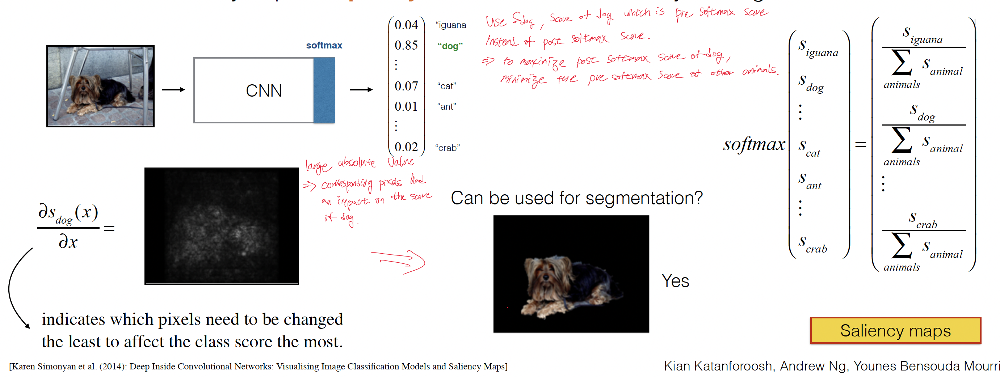
In computer vision, a saliency map is an image that highlights the most relevant regions for machine learning models. The goal of a saliency map is to reflect the degree of importance of a pixel to the ML model. Simply speaking, saliency maps can be interpreted as a heat map where hotness refers to those regions of the image which have a big impact on predicting the class which the object belongs to.  

Saliency Maps can be attained by computing the gradient of the prediction (or classification score) with respect to the input features. The interpretation of the gradient attribution is that if I were to increase the color values of the pixel, the predicted class probability would go up (for positive gradient) or down (for negative gradient). The larger the absolute value of the gradient, the stronger the effect of a change of this pixel. So the corresponding pixel has an impact on the score.

One more thing to note is that the score should be pre softmax instead of post softmax. This is because in order to maximize the post score of the target, minimize the pre softmax score of other candidates.

### Occlusion Sensitivity
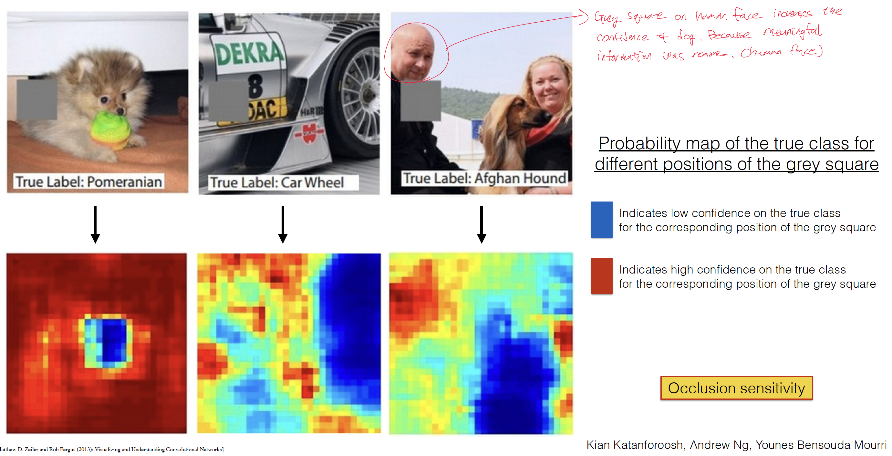 
Occlusion sensitivity is a simple technique for understanding which parts of an image are most important for a deep network's classification. You can measure a network's sensitivity to occlusion in different regions of the data using small perturbations of the data.  

It is represented as a probability map of the true class for different positions of the grey square(perturbations). For example, if the input is a picture with a pomeranian, the true class is pomeranian. So if you see the occlusion sensitivity probability map of this input, the region of picture with pomeranian's face will have different color scale than other regions. This is because the color of the region(dog's face) indicates low confidence on the true class for the corresponding position of the grey square, while the color of the other region indicates high confidence on the true class
for the corresponding position of the grey square.
### Class Activation Maps
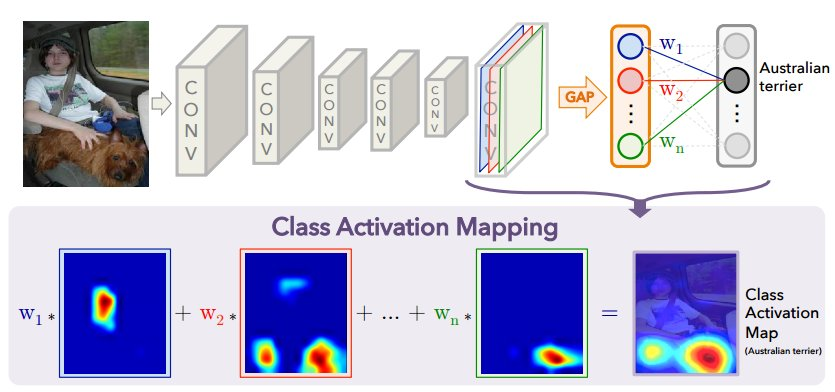 
A Class Activation Map is for a particular category to indicate the discriminative image regions used by the
CNN to identify that category.  

The network largely consists of convolutional layers, and just before the final output layer (softmax in the case of categorization), we perform global average pooling on the convolutional feature maps and use those as features for a fully-connected layer that produces the desired output (categorical or otherwise).

Given this simple connectivity structure, we can identify
the importance of the image regions by projecting back the
weights of the output layer on to the convolutional feature
maps, a technique we call class activation mapping.

#### Mathmatic Interpretation of CAM
From above image, let $f_k(x, y)$ represent the activation
of unit $k$ in the last convolutional layer at spatial location $(x, y)$. Then, for unit $k$, the result of performing global average pooling, $F_k = \Sigma_{x,y} f_k(x, y)$. Thus, for a given class $c$, the input to the softmax, $S_c = \Sigma_{k}w^{c}_k F_k$ where $w^{c}_k$
is the weight corresponding to class $c$ for unit $k$, in other words $w^{c}_k$ indicates the importance of $F_k$ for class $c$(how much the score $S_c$ was dependent on certain feature map(unit)). Finally the output of the softmax for class $c$, $P_c$ is given by $\frac{\exp(S_c)}{\Sigma_{c} \exp(S_c)}$. (ignore the bias term)  

From the previous knowledge $F_k = \Sigma_{x,y} f_k(x, y)$ and putting into $S_c$, we get,
$$
S_c = \sum_k w_k^c \sum_{x, y} f_k(x, y) = \sum_{x, y} \sum_k w_k^c f_k(x, y)
$$

If we define $M_c$ as the class activation map for class $c$, where
each spatial element is given by,
$$
M_c(x, y) = \sum_k w_k^c f_k(x, y)
$$
Note that, $\Sigma_{x,y} M_c(x, y) = S_c$ so therefore $M_c(x, y)$ directly indicates the importance of the activation at spatial grid $(x,y)$ leading to the classification of an image to class $c$.  
Also note that from $\sum_{x, y} \sum_k w_k^c f_k(x, y)$, you can see that global average pooling doesn’t kill spatial information, unlike flattening, we know what feature maps(units) are and we can exactly map it back.

CAM expects each unit to be activated by some visual pattern within its receptive field. For example, from the above example, the blue edge unit captures the face of kid and the green edge unit caputres the face of dog. Thus $f_k$ is the map of the presence of this visual pattern.  
So the class activation map is simply a weighted linear sum of the presence of these visual patterns at different spatial locations. By simply upsampling the class activation map to the size of the input image, we can identify the image regions most relevant to the particular category.

## Visualizaing Neural Networks from the inside
### Class Model Visualization
Class Model Visualization is a technique for visualising the class models, learnt by the image classification convolutional neural network. Given a learnt classification neural network and a class of interest, the visualisation method consists in(구성하다) numerically generating an image, which is representative of the class in terms of the convolutional neural network class scoring model.  

The procedure is related to the ConvNet training procedure, where the back-propagation is used to optimise the layer weights. The difference is that in our case the optimisation is performed with respect to the input image($I$), while the weights are fixed to those found during the training stage. Also initialize the optimisation with the zero image (the ConvNet was trained on the zero-centred image data), and then added the training set mean image to the result.  

$$
L = s_{\text{dog}}(x) - \lambda \left\| I \right\|_2^2 \\[6pt]
I = I + \alpha \frac{\partial L}{\partial I}
$$
Above is the loss function and the gradient ascent method using the loss function. As mentioned before, keep the weights fixed and use gradient ascent on the input image to maximize this loss. (Remind that gradient ascent method is used to maximize the loss)  
In other word, you repeat this process below.
1. Forward propagate image $I$
2. Compute the objective $L$
3. Backpropagate to get $\frac{\partial L}{\partial I}$
4. Update $I$’s pixels with gradient ascent.

From the above expression, $\lambda$ is regularization parameter. The reason for regularization is that we don't want to have extreme value at pixel because it doesn't help. So all the values are around each other and then rescale to $0 \sim 255$ values. Since the gradient ascent doesn't constrain the input to be $0 \sim 255$, it could be $\infty$, while numbers are stored between $0 \sim 255$.

Also note that the original paper used the (unnormalised) class scores $S_c$, rather than the class posteriors returned by the soft-max layer, $P_c = \frac{\exp(S_c)}{\Sigma_{c} \exp(S_c)}$. Just like the section "Saliency Maps" with the same reason that the maximization of the class
posterior can be achieved by minimising the scores of other classes.    
The authors also experimented with optimising the posterior $P_c$, but the results were not visually prominent, thus confirming their intuition.

### Dataset Search
Dataset Search is literally a way to search what examples in the dataset lead to a strongly activated feature map given a filter. You can find out what the activation units in the middle of the network is thinking.

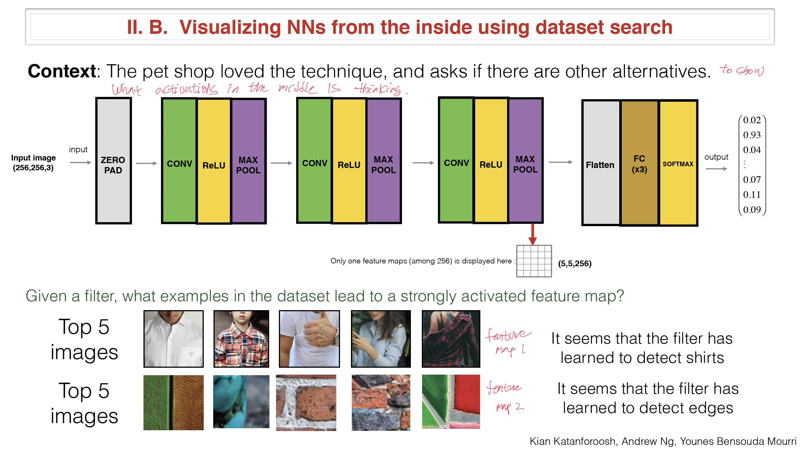 
For example, let's see above example. You select a certain layer whose shape is (5,5,256). In other words, there are 256 filters applied to this layer and therefore 256 (5,5) features maps are generated. Now, you choose one feature among them and see what examples in the dataset lead to a strongly activate that one feature map.  
From the image above, feature map upper case shows the images of the shirts and this indicates that the filter detects the shirts and the feature map activated the most to the image of the shirts. Similarly, the feature map lower case shows the images of the edges and this indicates that this filter detects the edges and the feature map activated the most to the image of the edges.

One question is how can we crop the input image from the activation and why is it cropped?
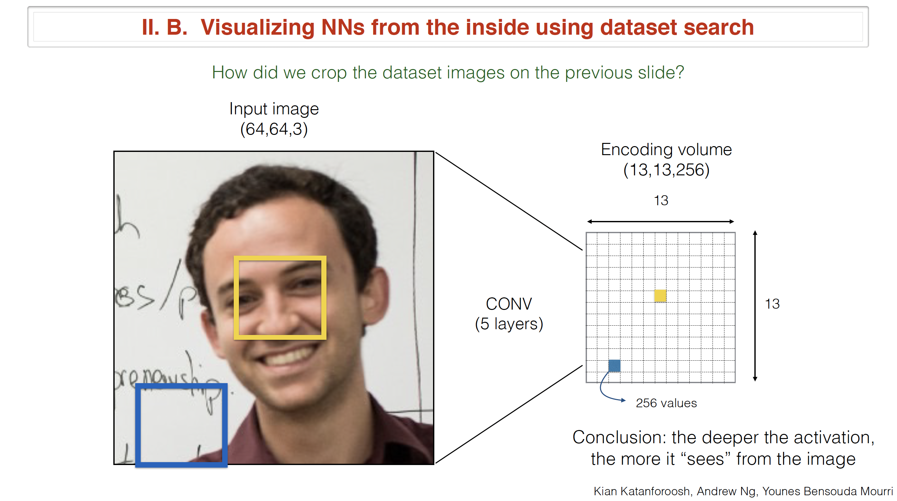 
Intuition is that when you pick one activation unit as above, that activation unit doesn't see the entire image but only subpart of the image. So from the activation unit and map it back through the previous layers using the strides and filter size applied, you can get the sub part of the image that activation is seeing. Thus, the other parts of the image have no influence on that particular activation unit.  
Now let's think when you add more convolutional layers. Since you will apply more filters, naturally, one activation will cover the more part of the image. So the deeper the activation, the more it sees from the image.


### Deconvolution Network and its Application
Deconvolutional Network is a set of reversed operations of a hidden layer of a convolutional neural network. In other words, Deconvolutional Networks are convolutional neural networks (CNN) that work in a reversed process. Therefore, it has three types of layers which are the reversed max-pooling layer (unpooling layer), the reversed rectification layer(ReLU) and the reversed convolutional layer (deconvolutional layer). 

Deconvolution is also called transposed convolution, because it used transposed weight matrix that is used in convoultion. The need for transposed convolutions generally arises from the desire to use a transformation going in the opposite direction of a normal convolution. In other words, from something that has the shape of the output of some convolution to something that has the shape of its input while maintaining a connectivity pattern that
is compatible with said convolution.

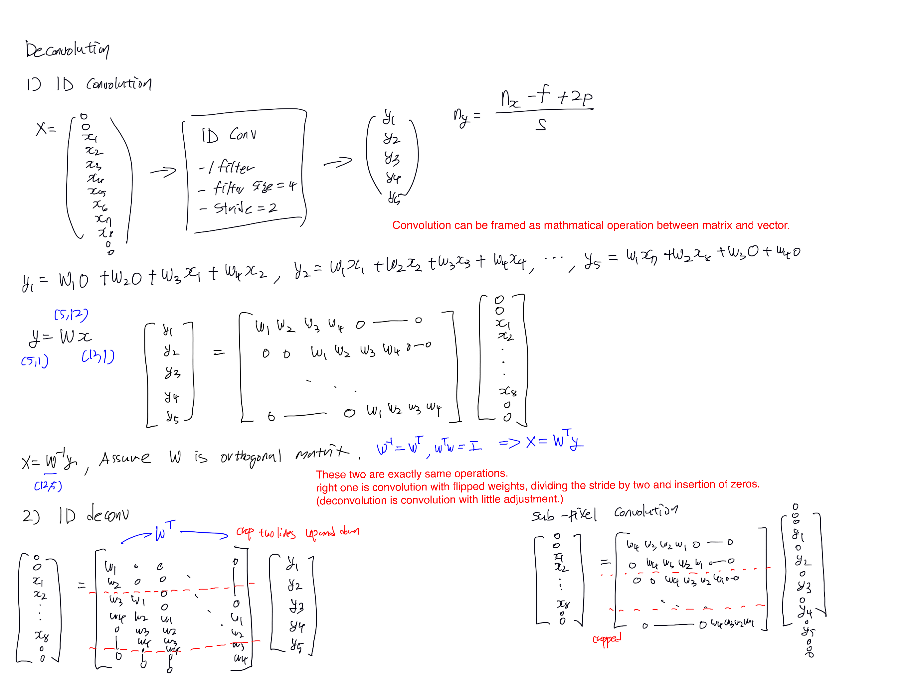 
One good intuition to understand convolution and deconvolution is that convolution can be framed as mathmatical operation between matrix and vector and deconvolution is convolution with little adjustment, such as flipping weights, dividing the strides and insertion of zeros.

#### Deconvolutional Layer
Check below 4 examples and understand how deconvolution can retain original input shape of the encoding.
##### Deconvolution with no padding and no stride ($p=0, s=1$)
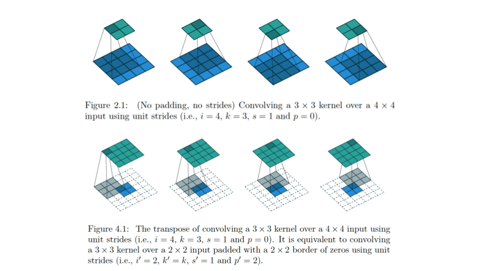 

##### Deconvolution with padding and no stride ($p \neq 0, s=1$)
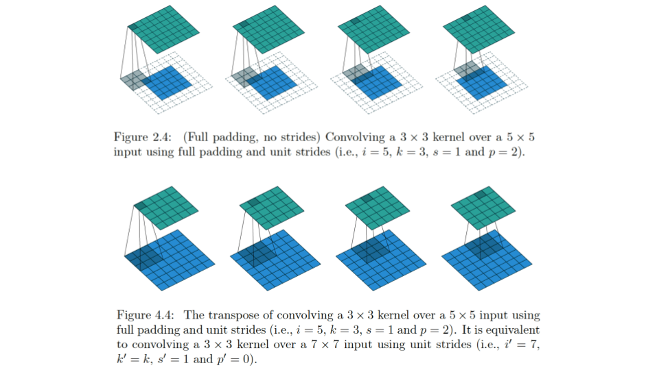 

##### Deconvolution with no padding and stride ($p=0, s \neq 1$)
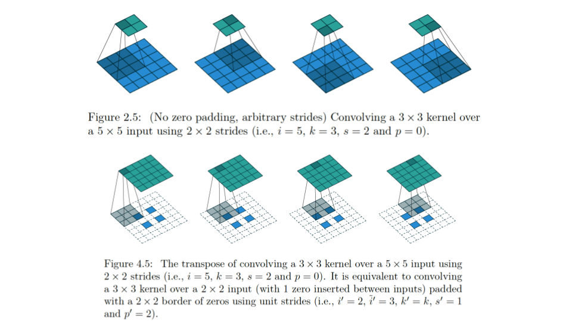

##### Deconvolution with padding and stride ($p \neq 0, s \neq 1$)
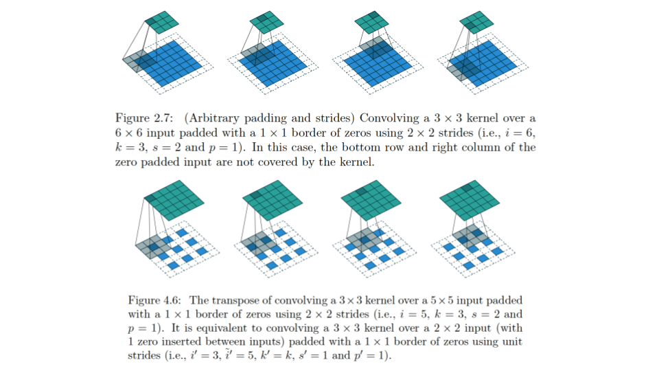 

Also note that Deconvolution allows to upsample an encoding into an image. Below exmple shows how $(4,4)$ input can be upsampled into $(6,6)$ output using deconvolution technique.

##### Deconvolution for Upsampling
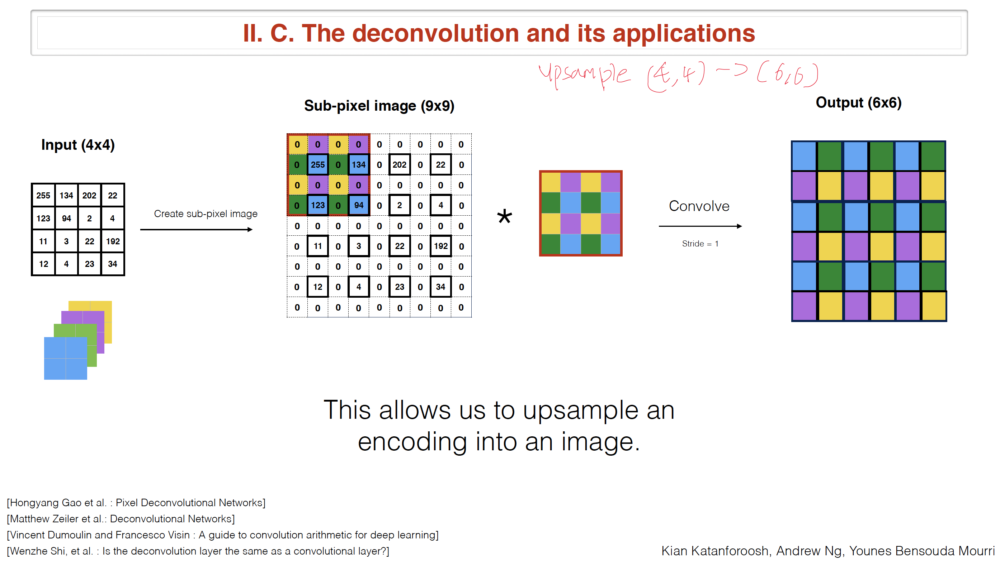 
Note that each box of the output is the result of the convolution of the input with the filter. Simply speaking, the color of the box of the output is the sum of number of the same color of the input overlapped with the filter(convolution). For example, the most left upper blue box of the output is $\Sigma (255 + 134 + 123 + 94)$.

#### UnPool(Max Pool) Layer
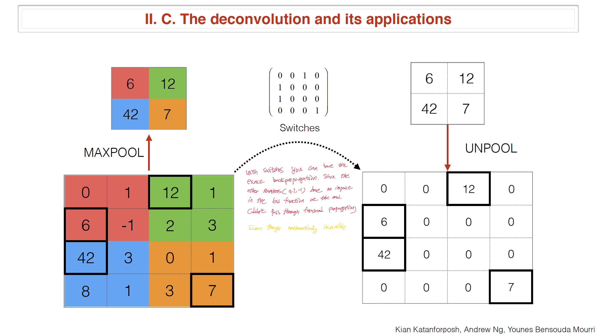
Since maxpooling forgets all the numbers except for the maximum, we use cache the values. With switches(cache) you can have the exact backpropagation. For example, from the red region of the input, the other numbers ($0,1,-1$) have no impact in the loss function at the end (which means, the numbers ($0,1,-1$) Didn't pass through forward propagation).

#### UnReLU Layer
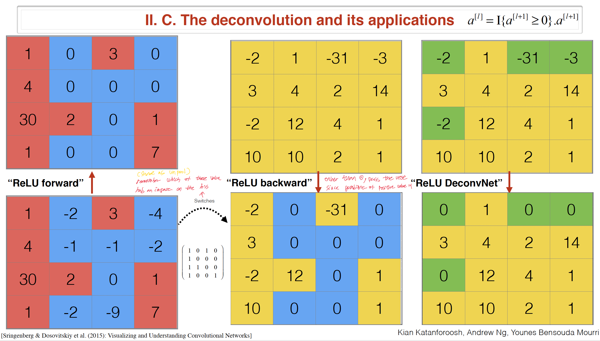
Same as unpooling, When ReLU backward, we can use switch(cache) to remember which of the values in the pooing layer that had an impact on the loss. So as you can see from the above example, set 0 according to the switch and pass the rest. You pass the rest because gradient of ReLU is $1$, so just pass the gradient from the latter layer.

But in deconvolution, ReLU backward is not used but ReLU DeconvNet will be used instead. Relu DeconvNet is just you apply ReLU to output to reconstruct the input. This is hack which has been found from trial and error and not scientifically viable. The intuition behind this technique is that,
 - We are interested in which pixels of the input positively affected the activation units.
 - Also during backpropagation, we want to have minimum influence from forward propagation.

## Deep Dream
DeepDream is a computer vision program created by Google engineer Alexander Mordvintsev that uses a convolutional neural network to find and enhance patterns in images via algorithmic pareidolia (the tendency for perception to impose a meaningful interpretation on a vague stimulus, usually visual, so that one detects an object, pattern, or meaning where there is none.)

Basically, Deep Dream algorithm ses what the network is activating for and increase even this activation. Below is how dreaming process works. 
1. Forward propagate image until dreaming layer
2. Set gradients of dreaming layer to be equal to its activations
3. Backpropagate gradients to input image
4. Update Pixels of the image
5. Repeat

The reason for setting gradient of layer equal to its activations is to increase activation. Stronger the activation, the stronger it's going to become later on and so on.  

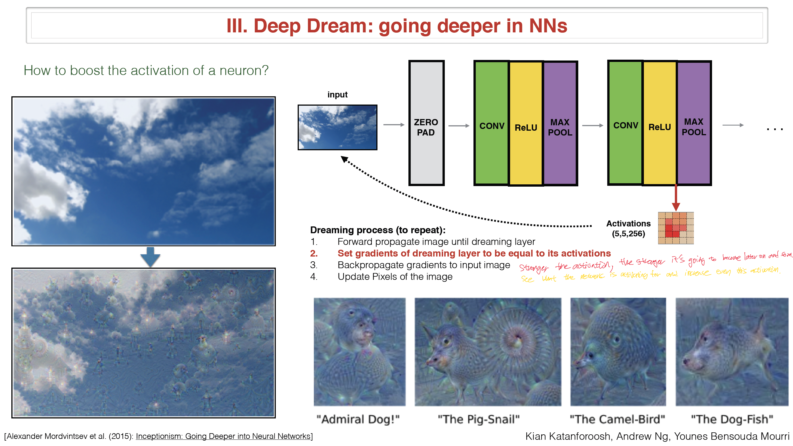
When network thought that was like tower a little bit,
you will increase the network’s confidence in the fact
that there’s a tower by changing the image and the tower comes out.

## SHapley Additive exPlanations (SHAP)
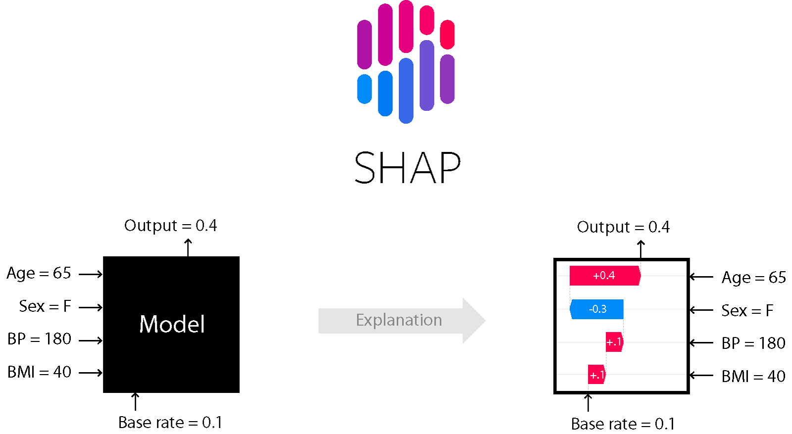   

SHAP(Shapley Additive Explanations)은 각 특성(Feature)에 중요도 값을 부여하여 머신러닝 모델의 예측 결과를 설명하는 방법입니다. 이 방법은 공동의 성과에 대한 각 참여자의 기여도를 측정하는 협조적 게임 이론(Cooperative Game Theory)의 개념인 샤플리 값(Shapley values)에 기반을 두고 있습니다. SHAP은 특정 데이터 인스턴스에 대한 모델의 예측값과 전체 데이터셋의 평균 예측값 간의 차이에 각 특성이 얼마나 기여했는지를 계산합니다.
```
예시: 신용 평가 모델에서 SHAP을 사용하면, 지원자의 낮은 소득이 대출 거절에 -10%만큼 기여한 반면, 좋지 않은 신용 기록은 +15%만큼 기여했음을 보여줄 수 있어 개발자가 모델의 결정 이유를 이해하는 데 도움을 줍니다.
```

### SHAP의 작동 방식
SHAP은 체계적인 과정을 통해 각 특성의 영향을 평가합니다.
특정 예측에 대해 가능한 모든 특성 조합을 고려하고 각각의 한계 기여도(Marginal Contribution)를 계산합니다. 이는 특정 특성이 포함되거나 제외될 때 예측이 어떻게 변하는지를 모든 가능한 특성 순서에 대해 테스트하고 이를 평균 내는 방식입니다.

이 접근 방식은 이론적으로 완벽하지만, 특성이 많은 모델에서는 계산 비용이 매우 많이 들 수 있습니다. 이를 해결하기 위해 SHAP은 다음과 같은 최적화된 구현체를 제공합니다.

- Kernel SHAP: 모델에 구애받지 않는(Model-agnostic) 근사치 계산법
- Tree SHAP: 트리 기반 모델을 위한 효율적인 계산법

```
의료 모델 예시: 환자의 위험도를 예측하는 의료 모델에서 Tree SHAP을 사용하면 나이와 콜레스테롤 수치가 고위험 예측의 가장 큰 기여 요인인 반면, 운동 습관은 영향이 적다는 것을 밝혀낼 수 있습니다.
```
SHAP을 통해 특성의 영향력을 정량화함으로써 개발자가 모델을 투명하고 신뢰할 수 있게 만들며, 도메인 지식과 일치하도록 도울 수 있습니다.

### Shapley Value
섀플리 값은 협력 게임 이론(Cooperative Game Theory)에서 여러 플레이어가 협력하여 얻은 총 이익(또는 비용)을 공정하게 배분하기 위한 방법입니다.
```
예시: 조별 과제나 공동 프로젝트에서 팀원들의 기여도가 제각각일 때, 각 멤버가 얼마만큼의 보상(또는 책임)을 받는 것이 공정한지 결정할 때 사용됩니다.
```
#### 원리
플레이어가 다른 플레이어들의 모든 가능한 조합(연합, Coalition)에 참여할 때 발생하는 한계 기여도(Marginal Contribution)를 계산한 후, 이 값들의 평균을 내어 기여도를 측정합니다.

#### 4대 공리
섀플리 값은 아래의 4가지 근본적인 수학적 공리를 동시에 만족하는 유일한 배분 방법입니다. 학계에서는 이 조건들을 만족해야 '공정한 배분'이라고 인정합니다.

- 효율성(Efficiency): 전체 이익이 남거나 모자라지 않게 모두 배분되어야 함.
- 대칭성(Symmetry): 기여도가 똑같은 두 플레이어는 똑같은 보상을 받아야 함.
- 가법성/선형성(Additivity/Linearity): 두 게임이 합쳐지면 보상도 각각의 게임에서 받을 보상의 합이어야 함.
- 더미 플레이어(Dummy/Null player): 전체 결과에 아무런 기여를 하지 않은 사람은 보상을 받지 못함.

#### 정의
'모든 연합에 참여할 때의 평균 한계 기여도'를 수학적 공식으로 표현한 것입니다.여기서 전체 플레이어의 집합을 $N$, 총 플레이어 수를 $n$이라고 하고, 특정 연합(소그룹) $S$가 얻는 총 가치를 함수 $v(S)$로 정의합니다. 플레이어 $i$가 받게 되는 섀플리 값 $\varphi_i(v)$는 두 가지 방식의 공식으로 표현됩니다.

<b> 공식 1: 조합(Combination)을 이용한 표현 </b>  
$$\varphi _i(v)=\sum _{S\subseteq N\setminus \{i\}}{\frac {|S|!\;(n-|S|-1)!}{n!}}(v(S\cup \{i\})-v(S))$$

이 공식은 플레이어 $i$가 포함되지 않은 모든 부분집합 $S$에 대해 다음을 계산하여 더합니다.
- $(v(S\cup \{i\}) - v(S))$: 기존 연합 $S$에 플레이어 $i$가 새로 가입함으로써 추가로 생겨난 가치(한계 기여도)입니다.
- $\frac{|S|!(n-|S|-1)!}{n!}$: 플레이어들이 무작위 순서로 한 명씩 방에 들어와 연합을 구성한다고 가정할 때, 하필 플레이어 $i$ 바로 앞에 $S$라는 멤버들이 이미 와 있을 확률(가중치)입니다.
- $|S|!$: $i$ 앞에 있는 멤버들이 들어오는 순서의 가짓수
- $(n-|S|-1)!$: $i$ 뒤에 남은 멤버들이 들어오는 순서의 가짓수
- $n!$: 전체 플레이어가 들어오는 모든 경우의 수

<b> 공식 2: 순열(Permutation)을 이용한 표현</b>  
$$\varphi _i(v)={\frac {1}{n!}}\sum _{R}\left[v(P_i^R\cup \left\{i\right\})-v(P_i^R)\right]$$

- $R=n!$: 전체 플레이어 $n$명이 일렬로 서는 모든 가능한 순서중 하나입니다.
- $P_i^R$: 그 순서 $R$에서 플레이어 $i$보다 앞에 서 있는 플레이어들의 집합입니다.

즉, 모든 사람이 무작위 순서로 줄을 서서 차례대로 연합에 합류한다고 상상해 봅니다. 각 사람은 자신이 합류하는 순간 늘어난 가치($v(P_i^R \cup \{i\}) - v(P_i^R)$)를 보상으로 요구합니다. 발생할 수 있는 모든 줄서기 시나리오($n!$)에 대해 플레이어 $i$가 얻은 보상들을 싹 다 더한 뒤, 시나리오 수($n!$)로 나누어 평균을 구하는 것입니다.

요컨데 섀플리 값은 "누구 뒤에 합류하느냐"에 따라 달라지는 나의 추가 기여도를 모든 경우의 수에 대해 따져본 후, 그 평균치를 내어 보상하는 수학적으로 공정한 배분 방식입니다.

https://en.wikipedia.org/wiki/Shapley_value

Reference
- https://arxiv.org/pdf/1705.07874
- https://forest62590.tistory.com/29
- https://milvus.io/ai-quick-reference/what-is-shap-shapley-additive-explanations

## LIME(Local Interpretable Model-agnostic Explanations)
LIME은 블랙박스 머신러닝 모델을 국소적(Local)으로 해석 가능한 모델로 근사화하는 기술입니다. 다시 말해 블랙박스(Black-Box)라 불리는 모델들을 분해하여 입력 데이터의 서로 다른 구역/특징들이 출력, 즉 모델의 예측에 어떤 영향을 미치는지 볼 수 있도록 합니다.

### Local Interpretability (국소적 해석 가능성)
모델을 전역적으로 학습시키는 대신, 변형된(perturbed) 입력값들에 대해 '국소적 대리 모델(local surrogate models)'을 학습시키는 데 집중하는 것입니다. 특정 데이터 포인트가 입력되면, LIME은 변형된 샘플들과 그에 대응하는 블랙박스 모델의 예측값들로 구성된 새로운 데이터셋을 생성합니다. 이렇게 새로 만들어진 데이터셋을 바탕으로 해석 가능한 모델을 학습시키는데, 이때 관심 있는 원래 데이터 포인트와 유사한(가까운) 샘플일수록 더 높은 가중치를 부여합니다. 여기서 사용되는 국소적 해석 가능 모델은 다음과 같은 것들이 될 수 있습니다.

- 선형 회귀 (Linear Regression)
- 로지스틱 회귀 (Logistic Regression)
- 결정 트리 (Decision Trees)
- 나이브 베이즈 (Naive Bayes)
- K-최근접 이웃 (K Nearest Neighbors)

### 학습방법
블랙박스 예측에 대한 설명을 찾고자 하는 관심 영역(region of interest)을 선택하는 것입니다. 그런 다음, 데이터셋을 변형하고 순열 조합(perturbed and permutated)하여 새로운 데이터셋의 포인트들에 대한 블랙박스의 예측값들을 다시 얻어냅니다. 그 후, 원래 관심 인스턴스와의 근접도에 따라 새로운 샘플들에 가중치를 부여합니다. 따라서 상대적인 가중치는 예측에 기여(찬성)하거나 혹은 반대되는 증거가 될 수 있습니다. 다음 단계로, 변화를 준 데이터셋을 바탕으로 가중치가 적용된 해석 가능한 모델을 학습시킵니다. 마지막으로, 이 국소 모델을 해석함으로써 예측의 이유를 설명하게 됩니다.

### 정의
LIME의 목표는 "복잡한 인공지능 모델이 특정 데이터를 왜 그렇게 예측했는지 이유를 밝히는 것"입니다. 이때 다음 수식을 사용해 가장 적절한 설명 모델($g$)을 찾아냅니다.

$$\xi(x) = \arg\min_{g \in G} L(f, g, \Pi_x) + \Omega(g)$$

- $L(f, g, \Pi_x)$ : 원래 모델과 얼마나 똑같이 예측하는가? - 설명하려는 데이터 $x$의 주변 영역($\Pi_x$)에서, 원래 AI 모델($f$)의 예측값과 우리가 만든 설명 모델($g$)의 예측값이 얼마나 다른지(오차)를 측정합니다. 이 오차가 작을수록 내가 궁금한 데이터 주변에서만큼은 설명 모델이 원래 AI와 똑같이 행동해야 믿을 수 있는 설명이 되기 때문입니다.
- $\Omega(g)$ : 설명이 얼마나 단순한가? - 설명 모델($g$) 자체의 복잡한 정도를 나타냅니다. 예를 들어 설명에 사용하는 정형 데이터의 변수(특성) 개수가 너무 많거나 공식이 복잡하면 인간이 이해할 수 없습니다. 이 복잡도가 낮을수록 사람이 보고 단번에 원인을 파악할 수 있어서 좋습니다.

### Trade-Off
원래 AI의 복잡한 예측을 완벽하게 흉내 내려면($L(f, g, \Pi_x)$), 설명 모델도 같이 복잡해져야 하므로 사람이 이해하기 어려워집니다($\Omega(g)$). 반대로 사람이 완벽하게 이해하도록 아주 단순하게 만들면($\Omega(g)$), 원래 AI가 예측한 정밀한 값을 제대로 맞추지 못하고 오차가 커집니다($L(f, g, \Pi_x)$).

결론적으로 LIME은 "사람이 이해할 수 있는 낮은 복잡도에서, 최대한 원래 AI의 예측을 왜곡 없이 정확하게 반영하는 최적의 타협점"을 찾는 알고리즘입니다.

### Reference
- https://c3.ai/glossary/data-science/lime-local-interpretable-model-agnostic-explanations/
- https://medium.com/intel-student-ambassadors/local-interpretable-model-agnostic-explanations-lime-the-eli5-way-b4fd61363a5e
- https://arxiv.org/pdf/1602.04938