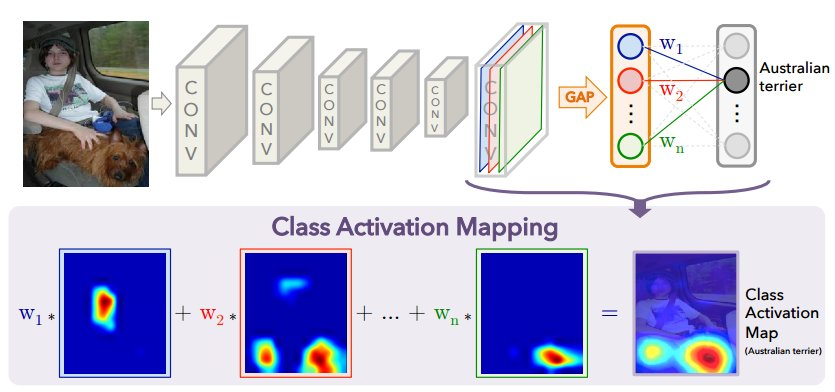

# Interpretability of Neural Network (Explainable artificial intelligence, XAI)
## Interpreting Neural Networks' outputs
### Saliency Maps

In computer vision, a saliency map is an image that highlights the most relevant regions for machine learning models. The goal of a saliency map is to reflect the degree of importance of a pixel to the ML model. Simply speaking, saliency maps can be interpreted as a heat map where hotness refers to those regions of the image which have a big impact on predicting the class which the object belongs to.  

Saliency Maps can be attained by computing the gradient of the prediction (or classification score) with respect to the input features. The interpretation of the gradient attribution is that if I were to increase the color values of the pixel, the predicted class probability would go up (for positive gradient) or down (for negative gradient). The larger the absolute value of the gradient, the stronger the effect of a change of this pixel. So the corresponding pixel has an impact on the score.

One more thing to note is that the score should be pre softmax instead of post softmax. This is because in order to maximize the post score of the target, minimize the pre softmax score of other candidates.

### Occlusion Sensitivity
 
Occlusion sensitivity is a simple technique for understanding which parts of an image are most important for a deep network's classification. You can measure a network's sensitivity to occlusion in different regions of the data using small perturbations of the data.  

It is represented as a probability map of the true class for different positions of the grey square(perturbations). For example, if the input is a picture with a pomeranian, the true class is pomeranian. So if you see the occlusion sensitivity probability map of this input, the region of picture with pomeranian's face will have different color scale than other regions. This is because the color of the region(dog's face) indicates low confidence on the true class for the corresponding position of the grey square, while the color of the other region indicates high confidence on the true class
for the corresponding position of the grey square.
### Class Activation Maps
 
A Class Activation Map is for a particular category to indicate the discriminative image regions used by the
CNN to identify that category.  

The network largely consists of convolutional layers, and just before the final output layer (softmax in the case of categorization), we perform global average pooling on the convolutional feature maps and use those as features for a fully-connected layer that produces the desired output (categorical or otherwise).

Given this simple connectivity structure, we can identify
the importance of the image regions by projecting back the
weights of the output layer on to the convolutional feature
maps, a technique we call class activation mapping.

#### Mathmatic Interpretation of CAM
From above image, let $f_k(x, y)$ represent the activation
of unit $k$ in the last convolutional layer at spatial location $(x, y)$. Then, for unit $k$, the result of performing global average pooling, $F_k = \Sigma_{x,y} f_k(x, y)$. Thus, for a given class $c$, the input to the softmax, $S_c = \Sigma_{k}w^{c}_k F_k$ where $w^{c}_k$
is the weight corresponding to class $c$ for unit $k$, in other words $w^{c}_k$ indicates the importance of $F_k$ for class $c$(how much the score $S_c$ was dependent on certain feature map(unit)). Finally the output of the softmax for class $c$, $P_c$ is given by $\frac{\exp(S_c)}{\Sigma_{c} \exp(S_c)}$. (ignore the bias term)  

From the previous knowledge $F_k = \Sigma_{x,y} f_k(x, y)$ and putting into $S_c$, we get,
$$
S_c = \sum_k w_k^c \sum_{x, y} f_k(x, y) = \sum_{x, y} \sum_k w_k^c f_k(x, y)
$$

If we define $M_c$ as the class activation map for class $c$, where
each spatial element is given by,
$$
M_c(x, y) = \sum_k w_k^c f_k(x, y)
$$
Note that, $\Sigma_{x,y} M_c(x, y) = S_c$ so therefore $M_c(x, y)$ directly indicates the importance of the activation at spatial grid $(x,y)$ leading to the classification of an image to class $c$.  
Also note that from $\sum_{x, y} \sum_k w_k^c f_k(x, y)$, you can see that global average pooling doesn’t kill spatial information, unlike flattening, we know what feature maps(units) are and we can exactly map it back.

CAM expects each unit to be activated by some visual pattern within its receptive field. For example, from the above example, the blue edge unit captures the face of kid and the green edge unit caputres the face of dog. Thus $f_k$ is the map of the presence of this visual pattern.  
So the class activation map is simply a weighted linear sum of the presence of these visual patterns at different spatial locations. By simply upsampling the class activation map to the size of the input image, we can identify the image regions most relevant to the particular category.

## Visualizaing Neural Networks from the inside
### Class Model Visualization
### Dataset Search
### Deconvolution
### Interpreting NNs using Deconvolution

### Deep Dream
