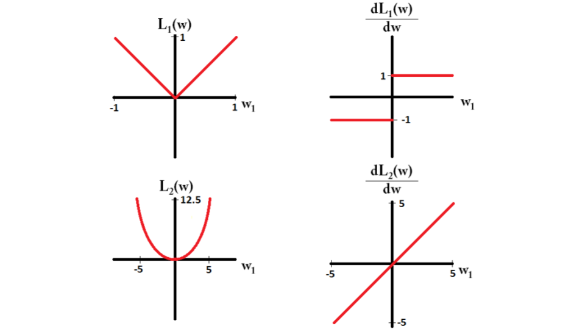
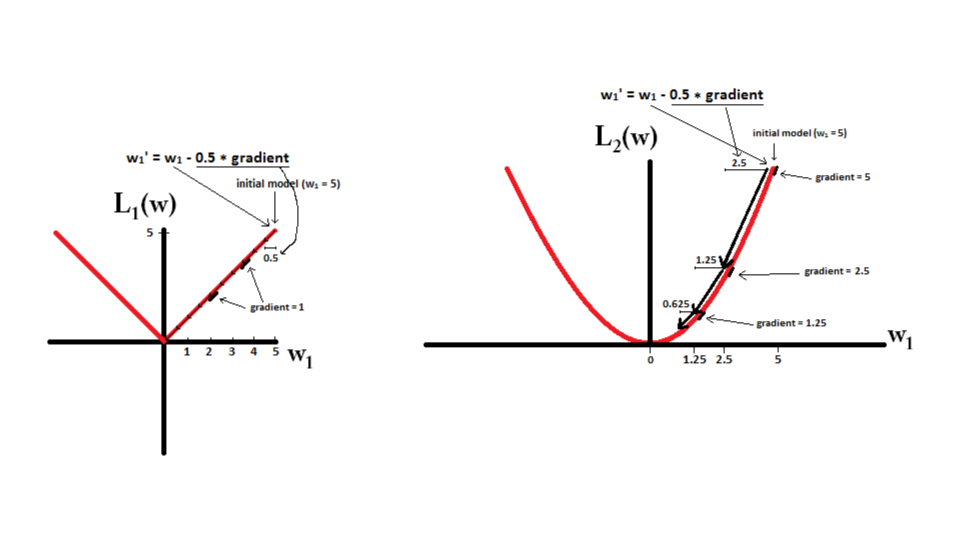
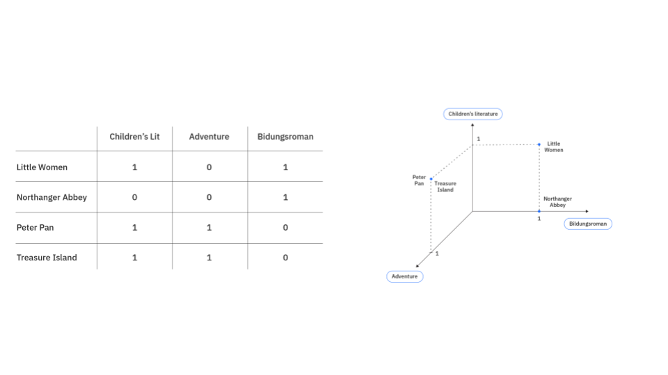

# Advertisement Recommendation (ADRec)
## Stub For ADRec
### CPA, CPC, CPM, CPP, CPR, CTR, TRP, Reach and Frequency
<b>CPA(Cost per Action) </b>  
CPA는 회원가입, sALES, 홈페이지 방문 등 Action 당 단가를 말한다.  
가장 대표적으로 일컬어지는 것이 회원 가입당 단가, 배너를 클릭해서 광고주 홈페이지에서 회원가입을 할 경우, 배너를 통해 회원가입까지 간 사람들을 1명 당 단가를 책정해서 광고집행금액을 결정하는 방식을 CPA라고 한다.

<b>CPC(Cost per Click)</b>  
CPC는 광고 클릭당 광고비, 광고 1 클릭을 얻기위해 소요되는 광고 비용을 말한다.
동일한 CPM으로 광고를 집행하였더라도, CTR(클릴율)이 높으면, CPC는 떨어지므로 더 효율적인
광고를 집행하였다고 할 수 있다.

<b>CPM (Cost per Mile)(노출 1,000회에 대한 단가)</b>   
CPM은 노출수에 따라 광고비를 내는 정액제 방식으로 CPM은 1000회의 광고 노출에 드는 광고비를 말한다.
CPM이 5000이라면 1회의 노출에 드는 광고비는 5원이라고 할 수 있음. Mile은 로마술자에서 1,000을 나타냄

<b> Reach and Frequency </b>  
Reach의 뜻은 '도달'로서 광고계에서는 풀이하면 '광고나 마케팅 메시지가 이용자에게 알려지거나 전달되는 넓이'를 말한다. 그래서 나같은 경우에는 이 용어를 이해하려고 할 때 '이용자'에 초점을 맞췄다. 그리고 도달률은 전체 이용자 수 대비 메시지가 전달되는 정도를 백분율로 나타낸 것이다.  
Frequency는'빈도'라는 뜻을 가진 영어단어로써, '한 이용자에게 같은 광고나 마케팅 메시지가 보이는 횟수'를 말한다. 즉 '1인당 광고 노출 수'를 의미한다. Frequency에서 주의할 점은 모든 이용자에게 보이는 횟수가 아닌 '한 이용자'라는 점이고 또 '같은' 광고나 마케팅 메시지에 초점을 맞췄다는 것이다.  

<b> TRP (Taget Rationg Point) </b>  
'일반적으로 매체 효과를 평가할 때 사용하는 지수인 GRP를 타겟 대상으로 적용시킨 것'이다. 그래서 공식이 GRP와 많이 닮아 있다. TRP = Tagret Reach X Frequency. 

<b>CPP (Cost per TRP)</b>  
TRP 1포인트를 올리는데 들어간 비용.  

<b>CPR (Cost per Reach) </b>
CPR은 Reach 1%를 올리는데 들어간 비용을 말한다.  

<b>CTR Click-Through Rate</b>  
CTR은 일반적으로 말하는 '클릭율'로서 광고 노출 대비 광고를 클릭한 비율을 백분율로 환산한 수치를 말한다. CTR=100*(Click Impressions)

### Bayesian Personalized Ranking (BPR)
Bayesian Personalized Ranking is a machine learning algorithm specifically designed for enhancing the recommendation process. It operates under a pairwise ranking framework where the goal is not just to predict the items a user might like but to rank them in the order of potential interest. Unlike traditional methods that might predict absolute ratings, BPR focuses on getting the order of recommendations right.

BPR works by maximizing the posterior probability of a user preferring a known positive item over a randomly chosen negative item.

Reference - https://www.geeksforgeeks.org/machine-learning/recommender-system-using-bayesian-personalized-ranking/  
https://arxiv.org/pdf/1205.2618

### Approximate Nearest Neighbor (ANN) Search
https://medium.com/data-science/comprehensive-guide-to-approximate-nearest-neighbors-algorithms-8b94f057d6b6

https://dytis.tistory.com/108

### Stein’s Identity and Kernelized Stein Discrepancy
https://arxiv.org/pdf/1608.04471

### Cold Start
Cold start is a potential problem in automated data modelling. It concerns the issue that the system cannot draw any inferences for users or items about which it has not yet gathered sufficient information.

### Calibration in Recommendation
A classification algorithm is called calibrated if the predicted proportions of the various classes agree with the
actual proportions of data points in the available data. Analogously(Similarly), the goal of calibrated recommendations is to reflect the various interests of a user in the recommended list, and with their appropriate proportions.  

Reference - https://dl.acm.org/doi/pdf/10.1145/3240323.3240372

### Follow The Regularized Leader (FTRL)
The FTRL (Follow the Regularized Leader) family of learning algorithms is a core set of learning methods used in online learning. As a type of FTL (Follow the Leader) algorithm, they select a weight function at each timestep that minimizes the loss of all previously observed data. To reduce computational complexity, implementations of the FTRL algorithm generally utilize a linearized loss function, while a regularizer ensures solution stability by limiting changes to the weight vector.  

$$
{\displaystyle w_{t+1}=\arg \min \left(f(w)\right)}, \quad {\displaystyle f(w)=l_{1:t}(w)+R(w)}
$$
Where ${\displaystyle l_{1:t}(w)}$ represents the cumulative loss of all previous observations, and ${\displaystyle R(w)}$ is a regularization term. Solving this objective, however, is extremely computationally expensive, as the loss must be expanded and recomputed for all past data points whenever new data is introduced. 

To address this, most implementations of the algorithm approximate the loss using a linearized loss function, leveraging the gradient of the original loss to reduce computational complexity. That is applying first-order Taylor Series.

$$
l_i(w) \approx l_i(w_t) + \nabla l_i(w_t) \cdot (w - w_t)
$$

Unlike other machine learning algorithms that iteratively step along this gradient upon each update step, FTRL minimizes an optimization problem upon each update step, where instead the regularization places a limit on the step size.

$$
w_{t+1} = \arg\min_w \left( \sum_{i=1}^t l_i(w) + R(w) \right)
$$
Don't confuse that FTRL is not like keeping a separate weight for each loss, rather, FTRL finds one weight vector that balances all past losses together.  

So put it simply, FTRL’s idea can be represented as follow.  
"Let’s find the single best weight vector $w$ that would have minimized the total loss so far.”

reference: https://optimization.cbe.cornell.edu/index.php?title=FTRL_algorithm

### Multi-armed bandit (MAB)
https://www.geeksforgeeks.org/machine-learning/multi-armed-bandit-problem-in-reinforcement-learning/
https://en.wikipedia.org/wiki/Multi-armed_bandit

### Radial Basis Function (RBF) kernel
RBF kernel is a popular kernel function used in various kernelized learning algorithms. In particular, it is commonly used in support vector machine classification. Since the value of the RBF kernel decreases with distance and ranges between zero (in the infinite-distance limit) and one (when $x = x'$), it has a ready interpretation as a similarity measure.  
The RBF kernel on two samples $ \mathbf {x} ,\mathbf {x'} \in \mathbb {R} ^{k}$ represented as feature vectors in some input space, is defined as,
$$
{\displaystyle K(\mathbf {x} ,\mathbf {x'} )=\exp \left(-{\frac {\|\mathbf {x} -\mathbf {x'} \|^{2}}{2\sigma ^{2}}}\right)}
$$
Where $ \|\mathbf {x} -\mathbf {x'} \|^{2}$ may be recognized as the squared Euclidean distance between the two feature vectors and $\sigma$ is a free parameter. 

## Sequential Recommendation
https://arxiv.org/abs/1511.06939
https://arxiv.org/abs/1808.09781
https://arxiv.org/abs/1904.06690

## Models
CTR prediction Models
https://medium.com/@lonslonz/추천-모델-개발-2-딥러닝-모델-29dbf704715
### Wide and Deep Model
https://arxiv.org/pdf/1606.07792

### Deep and Cross Model
https://arxiv.org/abs/1708.05123

### Two Tower Model
https://storage.googleapis.com/gweb-research2023-media/pubtools/5716.pdf
https://storage.googleapis.com/gweb-research2023-media/pubtools/6090.pdf

### Deep Learning Recommendation Mode(DLRM)
https://arxiv.org/pdf/1906.00091

### Tabular Data Modeling Using Contextual Embeddings(TabTransformer)
https://arxiv.org/pdf/2012.06678

### SPLADE Model
check "images/blog33_splade.pdf"  

#### Preliminaries
##### Neural Information Retrieval
정보 검색(Information Retrieval, IR)은 사용자가 필요로 하는 정보를 문서나 데이터베이스, 웹 등에서 찾아내는 기술과 연구 분야를 말합니다. 이 분야는 사용자의 쿼리(query) 또는 질문에 가장 관련성 높은 정보를 신속하고 정확하게 제공하는 것을 목표로 합니다. IR 분야도 ML 특히 DL이 결합되면서 NN 기반의 ranking model이 쿼리에 맞는 정보를 '순위'(rank)를 매겨 응답하는 연구가 많이 이루어 지고 있습니다.

일반적인 NN기반 IR Model들은 일반적으로 2단계 파이프라인을 사용합니다.
1번째 stage에서는 BoW(bag-of-words) 모델 기반의 retrieval model를 통해 쿼리에 적합한 documents들을 document collection에서 먼저 추출합니다. 
2번째 stage에서는 1번째 stage에서 빠르게 추출된 documents들을 input으로 조금 더 정교한 모델을 이용하여 사용자의 쿼리에 보다 적합한 결과로 re-rank 한 결과를 리턴합니다.
이 중 1번째 stage는 "문자 그대로의 매칭"으로 빠르게 document들을 추출하기 때문에 속도가 빠르지만, 대신 "relevant" 하지만 "exact-matching" 하지 않는 단어들을 고려하지 못하기 때문에 semantic-level의 결과는 기대할 수 없었습니다. (vocabulary mismatch problem)

이 1번째 stage의 문제를 해결하기 위해 최근(2020~21년)의 경향은 BoW 모델을 사용하는 대신 Bert 등 LLM을 이용해서 쿼리와 document를 dense embedding으로 표현 후 이 벡터들 간의 유사도(approximate nearest neighbor search) 를 계산하는 방법이 제안되었습니다. 하지만 이 방법만으로는 semantic level의 응답값을 리턴할 수 있지만 계산 비용 상승으로 인한 효율성 감소, 그리고 쿼리의 특정 키워드가 document에 정확히 존재하는지 여부(exact-match)를 명시적으로 확인할 수 없는 문제점이 있었습니다.

그래서 최근에는 "sparse representation"을 NN을 이용해 학습하는 데 대한 관심이 증가하고 있습니다.(SpaTerm)
이를 통해 1st-stage 모델은 정확한 매칭(exact-match)과 효율성 같은 BOW 모델의 장점들을 가져오면서, dense embedding 을 사용하는 확장된 IR 모델의 semantic-level 결과값도 기대할 수 있는 장점도 가져올 수 있습니다.

##### Dense vs Sparse Embedding(Representation)
<b> Dense Embedding </b>  
Dense embeddings are compact, continuous vectors where most dimensions contain non-zero values. These are typically generated by neural networks like Word2Vec, BERT, or GPT, which map words, phrases, or documents into a lower-dimensional space (e.g., 300 dimensions) where similar items are closer together. For example, in a dense embedding model, the words “dog” and “puppy” might be represented by vectors that are mathematically near each other, reflecting their semantic similarity. Dense embeddings excel at capturing nuanced relationships and contextual meaning, making them ideal for tasks like semantic search or recommendation systems.

<b> Sparse Embedding </b>  
Sparse Embedding is high-dimensional vector where most values are zero. These often rely on techniques like TF-IDF, one-hot encoding, or bag-of-words models, where each dimension corresponds to a specific term or feature in the dataset. For instance, in a one-hot encoded sparse vector for a text corpus, the word “apple” might occupy a unique dimension with a value of 1 if present in a document and 0 otherwise.

##### L1 Regularization on shrinking coefficients to zero
It adds the absolute value of magnitude of the coefficient as a penalty term to the loss function(L). This penalty can shrink some coefficients to zero which helps in selecting only the important features and ignoring the less important ones.  

<b> How the L1 norm enforces sparsity in models </b>
   
For L1, the gradient is either $1$ or $-1$, except for when $w_i=0$
. That means that L1-regularization will move any weight towards 0 with the same step size, regardless the weight's value.  
In contrast, in L2-regularization, gradient is linearly decreasing towards $0$ as the weight goes towards 0. Therefore, L2-regularization will also move any weight towards 0, but it will take smaller and smaller steps as a weight approaches 0.  

For example, check below example.  
   
In L1-Regularization(left), start with a model with $w_1 = 5$ and using learning rate $\eta = 0.5$. You can see how gradient descent using L1-regularization makes $10$ updates until reaching a model with $w_1=0$.
$$ w_1 := w_1 - \eta \cdot \frac{dL_1(w)}{dw} = w_1 - \tfrac{1}{2} \cdot 1 $$  
In constrast, with L2-regularization where $\eta=0.5$, the gradient is $w_1$, causing every step to be only halfway towards 0.
$$ w_1 := w_1 - \eta \cdot \frac{dL_2(w)}{dw} = w_1 - \tfrac{1}{2} \cdot w_1 $$
Therefore, the model never reaches a weight of 0, regardless of how many steps we take.

<b> Combining original loss and penalty term(L1 norm) </b>  
Since the regularization is just a penalty term, the next possible question is combined with loss function, there is also weight inside loss function, so how come these two combined can force weight to exact zero? Let's consider below loss function.
$$
J(w) = \underbrace{\mathcal{L}_{\text{data}}(w)}_{\text{fit term}} + \underbrace{\lambda \|w\|_1}_{\text{regularizer}}
$$
At the best weight $w^*$, the slope (or gradient) of the total loss 
$J(w)$ should be zero, because if the slope isn’t zero, the optimizer would still move left or right. It can be formally represented as,
$$
0 \in \frac{\partial \mathcal{L}_{\text{data}}(w_i)}{\partial w_i} + \lambda \, \frac{\partial |w_i|}{\partial w_i}
$$
For all $w_i$.
Simply it can be derived as <b>$0$ is in the set of all possible values of slope of the total loss $J(w)$</b>.  

Also note that,
$$
\frac{\partial |w_i|}{\partial w_i} =
\begin{cases}
+1, & w_i > 0, \\[6pt]
-1, & w_i < 0, \\[6pt]
[-1, +1], & w_i = 0
\end{cases}
$$

Now, let's consider the case where $w_i =0$,
$$
0 \in \frac{\partial \mathcal{L}_{\text{data}}(0)}{\partial w_i} + \lambda \, [-1, +1]
$$
Since original eqaution holds for all $w_i$.  
- $\frac{\partial \mathcal{L}_{\text{data}}(0)}{\partial w_i}$: the data loss term. a constant number that tells you how much the data would like to increase or decrease this weight.
- $\lambda \, [-1, +1]$: at $0$, the L1 part can take any value between $-\lambda$ and $\lambda$.

So, since data loss term is constant number and L1 part is range, there exists some $s_i \in [−1,+1]$ from L1 term such that,
$$
\frac{\partial \mathcal{L}_{\text{data}}(0)}{\partial w_i} + \lambda s_i = 0
$$
Simply speaking, <b>we can find a value between −1 and +1 from L1 regularization part that perfectly cancels out the slope of the data loss</b>.  
$$
s_i = -\frac{1}{\lambda} \frac{\partial \mathcal{L}_{\text{data}}(0)}{\partial w_i}
$$
Now, $w_i=0$ is a valid solution only if this $s_i$ is a valid subgradient, which means $s_i \in [−1,+1]$.
$$
-1 \le -\frac{1}{\lambda} \frac{\partial \mathcal{L}_{\text{data}}(0)}{\partial w_i} \le +1, \\[5pt]
| \frac{\partial \mathcal{L}_{\text{data}}(0)}{\partial w_i} | \le \lambda
$$

So If $| \frac{\partial \mathcal{L}_{\text{data}}(0)}{\partial w_i} | \le \lambda$, $w_i = 0$, since original assumption was correct($w_i = w_i^* = 0$). In contrast, if $| \frac{\partial \mathcal{L}_{\text{data}}(0)}{\partial w_i} | \ge \lambda$, assumption was wrong and $w_i \neq 0$. 

Let's interpret this result. 
- $| \frac{\partial \mathcal{L}_{\text{data}}(0)}{\partial w_i} | \le \lambda$: If the gradient of the data loss with respect to $w_i$ is smaller in magnitude than $\lambda$, the L1 penalty term($\lambda$) can cance the data loss term and $w_i=0$ satisfies the optimality condition.
- $| \frac{\partial \mathcal{L}_{\text{data}}(0)}{\partial w_i} | \le \lambda$: The data term is “too strong” and no $s_i$ can make the sum $0$.

<b> Why not L2? </b>  
$$
J(w) = \mathcal{L}_{\text{data}}(w) + \lambda \|w\|_2^2 = \mathcal{L}_{\text{data}}(w) + \lambda \sum_i w_i^2 \\[5pt]
J(w_i) = \mathcal{L}_{\text{data}}(w_i) + \lambda w_i^2 \\[5pt]
\frac{\partial J}{\partial w_i} = \frac{\partial \mathcal{L}_{\text{data}}}{\partial w_i} + 2\lambda w_i = 0 \\[5pt]
w_i = -\frac{1}{2\lambda} \frac{\partial \mathcal{L}_{\text{data}}}{\partial w_i}
$$
You can see that the optimal weight, $w_i$ is proportional to the data gradient. So to make optimal weight zero, the data term has to be exact zero which is rare.  
Another intuition is that, since $w_i$ is inside the gradient $2 \lambda w_i$, as weight shrinks, also gradient shrinks, so it slows down and never actually reaches zero.

##### Log-Saturation
log 함수의 고유한 그래프 모양 때문에 입력 인자(arguments)의 크기가 아무리 넓게 분포되어 있더라도, log 함수를 거치면 그 상대적인 차이가 줄어들고 값들이 특정 범위 안에서 압축되어 서로 더 "비슷해지는" 경향을 보이는 것을 의미합니다.

##### Term Weighting
Term weighting is a procedure that takes place during the text indexing process in order to assess the value of each term to the document. Term weighting is the assignment of numerical values to terms that represent their importance in a document in order to improve retrieval effectiveness.

##### Expansion (용어 확장)
정의: 원본 텍스트(문서 또는 쿼리)에는 직접 나타나지 않지만, 텍스트의 의미와 밀접하게 관련된 다른 단어들을 해당 텍스트의 표현에 추가하는 과정입니다.
목표: 전통적인 BoW 모델이 겪는 "어휘 불일치(lexical mismatch)" 문제를 해결하여, 쿼리와 문서가 동일한 단어를 사용하지 않더라도 의미상으로 관련성이 있다면 검색될 수 있도록 합니다. 즉, Bag-of-Words(BOW) 모델은 쿼리에 있는 단어가 문서에 없으면 아무리 의미적으로 관련성이 높아도 해당 문서를 찾지 못하는 '단어 불일치' 문제에 취약합니다. Expansion은 쿼리나 문서에 직접적으로 나타나지 않더라도 의미적으로 관련된 단어들을 추가하거나 기존 단어의 중요도를 재조정함으로써 이 문제를 해결하고자 합니다. SPLADE와 같은 모델에서는 입력된 쿼리 또는 문서의 토큰(단어)들을 기반으로 전체 단어장(vocabulary) 내의 모든 단어에 대한 중요도(weight)를 예측합니다. 즉, 원본 텍스트에 없던 단어라도 문맥상 관련성이 높다고 판단되면 해당 단어에 0이 아닌 가중치를 부여하여 벡터 표현에 포함시킵니다.

### Self-Attentive Sequential Recommendation (SASRec)
https://arxiv.org/pdf/1808.09781

### Duo Rec
https://arxiv.org/pdf/2110.05730

### OneRec
check "images/blog33_onerec.pdf"  

### OneRec-v2
https://arxiv.org/abs/2508.20900
### Mini OneRec
https://arxiv.org/abs/2510.24431

### Matryoshka Representation Learning (MRL)
https://arxiv.org/abs/2205.13147

## Factorized Personalized MC(Markov Chains) Model
https://cseweb.ucsd.edu/classes/fa17/cse291-b/reading/p811.pdf

## Recommendation System Basic
A recommendation system helps users find compelling content in a large corpus. For example, the Google Play Store provides millions of apps, while YouTube provides billions of videos.  

<b> Homepage Recommendations </b>  
Homepage recommendations are personalized to a user based on their known interests. Every user sees different recommendations.

<b> Related item Recommendations </b>  
Related items are recommendations similar to a particular item. In the Google Play apps example, users looking at a page for a math app may also see a panel of related apps, such as other math or science apps.

### Architecture

One common architecture for recommendation systems consists of the following three components.
   

<b> 1. Candidate Generation</b>  
In this first stage, the system starts from a potentially huge corpus and generates a much smaller subset of candidates.
The model needs to evaluate queries quickly given the enormous size of the corpus. A given model may provide multiple candidate generators, each nominating a different subset of candidates.  

<b> 2. Scoring</b>  
Next, another model scores and ranks the candidates in order to select the set of items to display to the user. Since this model evaluates a relatively small subset of items, the system can use a more precise model relying on additional queries.

<b> 3. Re-Ranking </b>  
Finally, the system must take into account additional constraints for the final ranking. For example, the system removes items that the user explicitly disliked or boosts the score of fresher content. Re-ranking can also help ensure diversity, freshness, and fairness.  

### Candidate Generation
Candidate generation is the first stage of recommendation. Given a query, the system generates a set of relevant candidates.
| **Type**                    | **Definition**                                                                         | **Example**                                                                                                                                         |
| --------------------------- | -------------------------------------------------------------------------------------- | --------------------------------------------------------------------------------------------------------------------------------------------------- |
| **Content-based filtering** | Uses similarity between items to recommend items similar to what the user likes.       | If user A watches two cute cat videos, the system recommends other cute animal videos.                                                              |
| **Collaborative filtering** | Uses similarities between users *and* items simultaneously to provide recommendations. | If user A is similar to user B, and user B likes video 1, the system recommends video 1 to user A(even if user A has not seen any similar videos). |

#### Embedding Space
In candidate generation, map each item and each query (or context) to an embedding vector in a common embedding space. 
$$
E = \mathbb{R}^{d}
$$
The embedding space is low-dimensional($d$ is  much smaller than the size of the corpus), and captures some latent structure of the item or query set.  
Similar items, such as YouTube videos that are usually watched by the same user, end up close together in the embedding space. The notion of "closeness" is defined by a similarity measure.

#### Similarity Measures
A similarity measure is a function that takes a pair of embeddings and returns a scalar measuring their similarity.
$$
s : E \times E \rightarrow \mathbb{R}
$$
When given a query embedding $q \in E$,  the system looks for item embeddings $x \in E$ that are close to $q$ that is, embeddings with high similarity, $s(q,x)$.  

To determine the degree of similarity, most recommendation systems rely on one or more of the following.
- cosine: cosine of the angle between the two vectors, $cos(q,x)$.
- dot product: $ s(q, x) = \langle q, x \rangle = \sum_{i = 1}^d q_i x_i = \|x\| \|q\| \cos(q, x)$. Note that dot product is equivalent to the cosine of the angle multiplied by the product of l2 norms.
- Euclidean distance: just Euclidean lengths (l2 norm). A smaller distance means higher similarity.

Consider the example in the figure following.
   
- cosine: C>A>B
- Euclidean distance: B>C>A
- dot product: A>B>C

Compared to the cosine, the dot product similarity is sensitive to the norm of the embedding. That is, the larger the norm of an embedding, the higher the similarity and the more likely the item is to be recommended.  

Items that appear very frequently in the training set (for example, popular YouTube videos) tend to have embeddings with large norms. Popular items tend to get updated more often. This is because since these items are liked by many users, most updates pull the embedding in similar directions.
This accumulated effect increases the vector’s norm, so popular item embeddings tend to have large norms.

Therefore, If capturing popularity information is desirable, then you should prefer dot product. However, if you're not careful, the popular items may end up dominating the recommendations. In practice, you can use other variants of similarity measures that put less emphasis on the norm of the item.
$$
s(q, x) = \|q\|^\alpha \|x\|^\alpha \cos(q, x), \quad \text{for some } \alpha \in (0, 1).
$$

On the other hand, items that appear very rarely may not be updated frequently during training. Consequently, if they are initialized with a large norm, the system may recommend rare items over more relevant items. To avoid this problem, be careful about embedding initialization, and use appropriate regularization.

#### Content-based Filtering
Content-based filtering uses item features to recommend other items similar to what the user likes, based on their previous actions or explicit feedback. It uses item features to select and return items relevant to a user’s query. 

In Content-based recommender systems(CBRSs), the model compares a user profile and item profile to predict user-item interaction and recommend items accordingly.
- item profile: an item’s representation in the system. It consists of an item’s feature set, which can be internal structured characteristics or descriptive metadata.
- user profile: a representation of user preferences and behavior. It can consist of representations of those items in which a user has previously shown interest. It also consists of user data of their past interactions with the system (for example, user likes, dislikes, ratings, queries, etc.).

So items are converted to vectors using metadata descriptions or internal characteristics as features. For example, say we build item profiles to recommend new novels to users as part of an online bookshop. 
   
As you can see, above left table shows profiles for each novel using representative metadata, such as author, genre, etc. A novel’s value for a given category can be represented with Boolean values, where 1 indicates the novel’s presence in that category and 0 indicates its absence. 

The right graph is a visualization of vector space. The closer two novel-vectors are in vector space, the more similar our system considers them to be according to the provided features. "Peter Pan" and "Treasure Island" share the exact same features, appearing at the same vector point $(1,1,0)$. Because of their similarity in this space, if a user has previously purchased "Peter Pan", the system will recommend those novels closest to "Peter Pan"—such as "Treasure Island"—to that user as a potential future purchase. 

CBRSs create a user-based classifier or regression model to recommend items to a specific user. To start, the algorithm takes descriptions and features of those items in which a particular user has previously shown interest—that is the user profile. These items constitute the training dataset used to create a classification or regression model specific to that user. In this model, item attributes are the independent variables, with the dependent variable being user behavior (for example, user ratings, likes, purchases, etc.). The model trained on this past behavior aims to predict future user behavior for possible items and recommend items according to the prediction.

##### Advantages and Disadvantages
<b> Advantages </b>  
While content-based filtering struggles with new users, it nevertheless adeptly handles incorporating new items. This is because it recommends items based on internal or metadata characteristics rather than past user interaction. 

Content-based filtering enables greater degree of transparency by providing interpretable features that explain recommendations. For example, a movie recommendation system may explain why a certain movie is recommended, such as genre or actor overlap with previously watched movies.  

<b> Disadvantages </b>  
Feature limitation. Content-based recommendations are derived exclusively from the features used to describe items. A system’s item features may not be able to capture what a user likes however. In other words, since the feature representation of the items are hand-engineered to some extent, this technique requires a lot of domain knowledge. Therefore, the model can only be as good as the hand-engineered features.

Because content-based filtering only recommends items based on a user’s previously evidenced interests, its recommendations are often similar to items a user liked in the past. So the model has limited ability to expand on the users' existing interests.

#### Collaborative Filtering
Collaborative filtering is an information retrieval method that recommends items to users based on how other users with similar preferences and behavior have interacted with that item. It uses similarities between users and items simultaneously to provide recommendations.

In practice, the embeddings can be learned automatically, which is the power of collaborative filtering models. Suppose the embedding vectors for the movies are fixed. Then, the model can learn an embedding vector for the users to best explain their preferences. Consequently, embeddings of users with similar preferences will be close together. Similarly, if the embeddings for the users are fixed, then we can learn movie embeddings to best explain the feedback matrix. As a result, embeddings of movies liked by similar users will be close in the embedding space.

##### Matrix Factorization in Recommender Systems

### References
- https://developers.google.com/machine-learning/recommendation?_gl=1*100s3or*_up*MQ..*_ga*NDEzMDgzNTk0LjE3NjMwNDM1Mzc.*_ga_SM8HXJ53K2*czE3NjMwNDM1MzckbzEkZzAkdDE3NjMwNDM1MzckajYwJGwwJGgw
- https://en.wikipedia.org/wiki/Matrix_factorization_(recommender_systems)
- https://www.ibm.com/think/topics/content-based-filtering
