# Advertisement Recommendation (ADRec)
## Stub For ADRec
### CPA, CPC, CPM, CPP, CPR, CTR, TRP, Reach and Frequency
<b>CPA(Cost per Action) </b>  
CPA는 회원가입, sALES, 홈페이지 방문 등 Action 당 단가를 말한다.  
가장 대표적으로 일컬어지는 것이 회원 가입당 단가, 배너를 클릭해서 광고주 홈페이지에서 회원가입을 할 경우, 배너를 통해 회원가입까지 간 사람들을 1명 당 단가를 책정해서 광고집행금액을 결정하는 방식을 CPA라고 한다.

<b>CPC(Cost per Click)</b>  
CPC는 광고 클릭당 광고비, 광고 1 클릭을 얻기위해 소요되는 광고 비용을 말한다.
동일한 CPM으로 광고를 집행하였더라도, CTR(클릴율)이 높으면, CPC는 떨어지므로 더 효율적인
광고를 집행하였다고 할 수 있다.

<b>CPM (Cost per Mile)(노출 1,000회에 대한 단가)</b>   
CPM은 노출수에 따라 광고비를 내는 정액제 방식으로 CPM은 1000회의 광고 노출에 드는 광고비를 말한다.
CPM이 5000이라면 1회의 노출에 드는 광고비는 5원이라고 할 수 있음. Mile은 로마술자에서 1,000을 나타냄

<b> Reach and Frequency </b>  
Reach의 뜻은 '도달'로서 광고계에서는 풀이하면 '광고나 마케팅 메시지가 이용자에게 알려지거나 전달되는 넓이'를 말한다. 그래서 나같은 경우에는 이 용어를 이해하려고 할 때 '이용자'에 초점을 맞췄다. 그리고 도달률은 전체 이용자 수 대비 메시지가 전달되는 정도를 백분율로 나타낸 것이다.  
Frequency는'빈도'라는 뜻을 가진 영어단어로써, '한 이용자에게 같은 광고나 마케팅 메시지가 보이는 횟수'를 말한다. 즉 '1인당 광고 노출 수'를 의미한다. Frequency에서 주의할 점은 모든 이용자에게 보이는 횟수가 아닌 '한 이용자'라는 점이고 또 '같은' 광고나 마케팅 메시지에 초점을 맞췄다는 것이다.  

<b> TRP (Taget Rationg Point) </b>  
'일반적으로 매체 효과를 평가할 때 사용하는 지수인 GRP를 타겟 대상으로 적용시킨 것'이다. 그래서 공식이 GRP와 많이 닮아 있다. TRP = Tagret Reach X Frequency. 

<b>CPP (Cost per TRP)</b>  
TRP 1포인트를 올리는데 들어간 비용.  

<b>CPR (Cost per Reach) </b>
CPR은 Reach 1%를 올리는데 들어간 비용을 말한다.  

<b>CTR Click-Through Rate</b>  
CTR은 일반적으로 말하는 '클릭율'로서 광고 노출 대비 광고를 클릭한 비율을 백분율로 환산한 수치를 말한다. CTR=100*(Click Impressions)

### PCOC(Predict Click Over Click): 실제 발생한 전체 클릭 수 대비 모델이 예측한 총 클릭 수의 비율
CTR 예측 모델이 산출한 점수가 단순한 순위를 넘어 실제 클릭 확률과 얼마나 정확하게 일치하는지를 나타내는 모델의'절대적인 예측 정확도(absolute prediction accuracy)'를 측정하는 지표입니다.

이상적인 PCOC 값은 1.0입니다. PCOC가 1.0에 가깝다는 것은 모델이 10%의 확률로 클릭될 것이라고 예측한 상품들이 실제로도 딱 10% 비율로 클릭되었다는 것을 의미합니다.
만약 PCOC가 1.0을 크게 초과한다면, 모델이 변별력을 높이려는 과정에서 점수를 과도하게 올려 실제 클릭 확률보다 Over-estimation하고 있다는 뜻이 됩니다.

### Sequential Recommendation Models, SRM
User의 과거 행동 순서(sequence)를 분석하여 관심사(user interests)를 포착하는 것을 목적으로 하는 모델. 사용자가 과거에 어떤 아이템을 클릭하거나 구매했는지 시간 순서대로 파악함으로써, 다음에 무엇을 선호할지 예측하고 클릭률(CTR)과 같은 비즈니스 지표를 극대화하는 데 사용합니다.

### Generative Recommendation Models, GRM
사용자 행동 기록을 일련의 '토큰(token)' 시퀀스로 취급하여 언어 모델과 유사한 방식으로 다음 아이템을 예측하는 방식

### SRM vs GRM
SRM: 사용자의 과거 행동(상호작용) 기록에 담긴 순차적인 패턴을 모델링하여 미래의 상호작용을 정확하게 예측하는 '문제 설정(Problem setting)' 혹은 목표 그 자체를 의미함.
GRM: 앞서 말한 SRM의 문제를 푸는 접근방식입니다. 기존의 전통적인 방법론(discriminative methods)들이 순차 추천을 풀기 위해 각 아이템을 단일 ID로 취급했던 것과 달리, 생성형 추천은 이 문제를 시퀀스-투-시퀀스(sequence-to-sequence) 문제로 재정의합니다. 즉, 추천할 아이템을 여러 개의 이산적인 토큰으로 분할(토큰화)한 뒤, 사용자의 과거 기록을 조건으로 삼아 다음 아이템의 토큰 시퀀스를 자기회귀적(autoregressively)으로 차례차례 생성해 내는 모델링 방식입니다.  

요약하자면, 순차 추천이 "과거 행동을 바탕으로 다음 행동을 예측한다"는 풀고자 하는 문제라면, 생성형 추천은 그 문제를 "아이템을 토큰화하여 언어 모델처럼 순차적으로 생성해 낸다"는 방식으로 접근하는 최신 해결책

### Bayesian Personalized Ranking (BPR)
Bayesian Personalized Ranking is a machine learning algorithm specifically designed for enhancing the recommendation process. It operates under a pairwise ranking framework where the goal is not just to predict the items a user might like but to rank them in the order of potential interest. Unlike traditional methods that might predict absolute ratings, BPR focuses on getting the order of recommendations right.

BPR works by maximizing the posterior probability of a user preferring a known positive item over a randomly chosen negative item.

#### Objective Function of BPR
The BPR objective function is designed to maximize the probability that a user prefers a purchased (positive) item($i$) over a non-purchased (negative) item($j$).
$$
\sum_{(u,i,j)\in D_s}
\ln \sigma\!\left(\hat{r}_{ui} - \hat{r}_{uj}\right)
- \lambda \left( \lVert U \rVert^2 + \lVert I \rVert^2 \right)
$$
- $\sigma$: the logistic sigmoid function.
- $D_s$​: the set of triplets $(u,i,j)$, such that user $u$ has interacted with item $i$ but not with item $j$.
- $\lambda$: a regularization parameter to prevent overfitting.
- $ \lVert U \rVert^2 + \lVert I \rVert^2$: the regularization terms for user and item matrices.

Reference - https://www.geeksforgeeks.org/machine-learning/recommender-system-using-bayesian-personalized-ranking/  
https://arxiv.org/pdf/1205.2618


### Nearest Neighbor Search
NN is a form of proximity search, is the optimization problem of finding the point in a given set that is closest (or most similar) to a given point. Closeness is typically expressed in terms of a dissimilarity function: the less similar the objects, the larger the function values.  
NN can be defined as "given a set $S$ of points in a space $M$ and a query point $q\in M$, find the closest point in $S$ to $q$."

#### Methods
#### Linear Search
The simplest solution to the NNS problem is to compute the distance from the query point to every other point in the database, keeping track of the "best so far". This algorithm, sometimes referred to as the naive approach, has a running time of O(dN), where $N$ is the cardinality of $S$ and $d$ is the dimensionality of $S$.

#### Space Partitioning(K-D Trees)
K-D Tree which iteratively bisects the search space into two regions containing half of the points of the parent region. Queries are performed via traversal of the tree from the root to a leaf by evaluating the query point at each split. Depending on the distance specified in the query, neighboring branches that might contain hits may also need to be evaluated. For constant dimension query time, average complexity is O($\log N$)in the case of randomly distributed points.

#### Approximate Nearest Neighbor (ANN) Search
Approximate Nearest Neighbor (ANN) is an algorithm that finds a data point in a dataset that’s very close to the given query point but not necessarily the absolute closest one. More specifically, an approximate nearest neighbor search algorithm is allowed to return points whose distance from the query is at most $c$ times the distance from the query to its nearest points. The appeal of this approach is that, in many cases, an approximate nearest neighbor is almost as good as the exact one.

##### How ANN works
1. Dimensionality Reduction: High-dimensional data such as images, text or sensor readings which can overwhelm traditional search methods. Dimensionality reduction simplifies the data while preserving its essential characteristics, making it easier and faster to analyze. The first steps in ANN is reducing the dimensionality of the data.
2. Metric Spaces: ANN operates within metric spaces where distances between data points are defined according to specific rules (Euclidean distance or cosine similarity ).
3. Indexing Structures: ANN uses indexing structures like KD-trees, Locality-Sensitive Hashing (LSH) and Hierarchical Navigable Small World (HNSW). These structures preprocess the data enabling faster navigation through the search space. 

##### When to Use ANN Search
1. Large Datasets: When dealing with millions or billions of data points the exhaustive nature of exact NN becomes useless but ANN excels with vast datasets efficiently.
2. High-Dimensional Data: As dimensions increase exact NN computations become prohibitively expensive. ANN’s dimensionality reduction techniques shrink the search space, making it suitable for complex data like images or text.
3. Real-Time Applications: Recommendation systems, fraud detection and anomaly detection require instant results. ANN’s speed makes it perfect for these use cases.
4. Acceptable Approximation:If your application can tolerate slight inaccuracies, ANN’s efficiency becomes invaluable.

##### Types of Approximate Nearest Neighbor Algorithms
<b> KD-Trees </b>  
KD-trees arrange data points in a tree-like hierarchy, dividing the space according to particular dimensions. They excel in low-dimensional spaces and Euclidean distance-based queries. However, they struggle with high-dimensional data due to the “curse of dimensionality.”

<b> Locality-Sensitive Hashing (LSH) </b>  
LSH hashes data points into lower-dimensional spaces while preserving similarity relationships. It’s highly effective for searching massive, high-dimensional datasets like images or text. While LSH is fast and scalable, it may occasionally produce false positives.

<b> Hierarchical Navigable Small World (HNSW) </b>  
HNSW builds a graph-based index that facilitates quick searches in large-scale datasets. Its layered structure enables logarithmic search complexity, making it one of the fastest ANN algorithms available.

<b> FAISS (Facebook AI Similarity Search)  </b>  
FAISS is a library optimized for ANN search, widely used in deep learning applications. It supports both CPU and GPU acceleration, making it ideal for efficient vector similarity retrieval.
https://github.com/facebookresearch/faiss/wiki

<b> Annoy  </b>  
Annoy (Approximate Nearest Neighbors Oh Yeah) is an open-source library designed for memory-efficient and fast search in high-dimensional spaces. It combines multiple ANN approaches under one roof, offering flexibility for different data types and search scenarios.

<b> Linear Scan </b>  
Although not typically classified as an ANN technique, linear scan is a brute-force approach that iterates through every data point sequentially. While simple to implement, it’s inefficient for large datasets and impractical for real-time applications.


##### Reference
https://dytis.tistory.com/108

### Stein’s Identity and Kernelized Stein Discrepancy
https://arxiv.org/pdf/1608.04471

### Cold Start
Cold start is a potential problem in automated data modelling. It concerns the issue that the system cannot draw any inferences for users or items about which it has not yet gathered sufficient information.

#### Cold Start in Recommend System
There are three cases of cold start.

<b> New community </b>  
This refers to the start-up of the recommender, when, although a catalogue of items might exist, almost no users are present and the lack of user interaction makes it very hard to provide reliable recommendations. This case presents the disadvantages of both the New user and the New item case, as all items and users are new. 

<b> New item </b>  
A new item is added to the system, it might have some content information but no interactions are present.

<b> New user </b>  
A new user registers and has not provided any interaction yet, therefore it is not possible to provide personalized recommendations.

##### Mitigation strategies
추천 시스템에서 cold start 문제는 사용자나 아이템에 대한 상호작용 데이터가 부족해서 발생한다. 이를 해결하기 위해 가장 많이 사용되는 방법은 하이브리드 추천 시스템(Hybrid Recommender)이다. 이는 협업 필터링(Collaborative Filtering)과 콘텐츠 기반 필터링(Content-based Filtering)을 함께 사용하는 방식이다. 일반적으로 기존 데이터가 충분한 warm item에는 협업 필터링을 적용하고, 새 아이템이나 데이터가 부족한 cold item에는 콘텐츠 기반 추천을 사용한다. 다만 콘텐츠 기반 추천은 아이템의 특성을 충분히 설명할 수 없는 경우 추천 품질이 낮아질 수 있다는 단점이 있다. 새 사용자에 대해서는 개인화 정보가 없기 때문에 전체 인기 아이템이나 지역·언어 기반 인기 아이템을 우선 추천하는 경우가 많다.

<b> Profile Completion </b>

Cold user 또는 cold item 문제를 해결하기 위한 대표적인 방법 중 하나는 가능한 빨리 선호 데이터를 수집하는 것이다. 이를 preference elicitation 전략이라고 부른다. 방법은 크게 두 가지로 나뉜다. 첫 번째는 사용자가 직접 정보를 입력하는 explicit 방식이고, 두 번째는 사용자의 행동을 관찰해 데이터를 수집하는 implicit 방식이다.

대표적인 예로 MovieLens는 회원가입 과정에서 사용자가 영화 평점을 입력하도록 한다. 이렇게 하면 시스템은 초기 사용자 프로필을 빠르게 구축할 수 있다. 하지만 이 과정은 사용자에게 추가적인 부담을 주며, 사용자가 오래전에 본 영화를 기억에 의존해 평가하거나 귀찮아서 대충 입력할 가능성이 있다는 문제가 있다.

또 다른 방법은 외부 활동 데이터를 활용하는 것이다. 예를 들어 사용자가 특정 음악가 관련 콘텐츠를 자주 읽는다면, 추천 시스템은 이를 바탕으로 해당 아티스트의 음악을 추천할 수 있다. 즉, 추천 시스템 외부의 행동 데이터를 초기 프로필 생성에 활용하는 방식이다.

새 아이템의 경우에는 비슷한 아이템에 대한 커뮤니티 평가를 기반으로 초기 평점을 자동 부여할 수도 있다. 아이템 간의 유사성은 장르, 배우, 감독 등의 콘텐츠 특성으로 계산된다.

최근에는 사용자의 성격(Personality)을 활용하는 방법도 연구되고 있다. Five Factor Model(FFM) 같은 성격 모델을 기반으로 초기 사용자 프로필을 생성하고 이를 통해 개인화 추천을 수행한다.

또 하나의 중요한 접근법은 Active Learning이다. 이는 추천 정확도를 가장 크게 향상시킬 수 있는 질문만 사용자에게 선택적으로 제시하는 방법이다. 예를 들어 이미 취향이 명확한 영화 대신 사용자의 선호 경계에 있는 영화를 질문함으로써 적은 수의 질문만으로도 효율적으로 사용자 취향을 학습할 수 있다.

마지막으로 interface agent 기반 시스템에서는 여러 사용자의 agent가 서로 학습 결과를 공유하는 collaborative agent 방식도 사용된다. 이를 통해 새로운 상황에서도 다른 agent의 경험을 활용해 더 빠르게 적응할 수 있다.

<b> Feature Mapping </b>

최근에는 머신러닝 기반의 고급 방법들이 많이 사용된다. 이들은 콘텐츠 정보와 협업 정보를 하나의 모델 안에서 통합하려고 한다. 대표적인 방법이 attribute-to-feature mapping이다.

Matrix Factorization 기반 추천 시스템에서는 사용자와 아이템을 latent factor라는 잠재 벡터로 표현한다. 하지만 새 아이템은 사용자 상호작용 데이터가 없기 때문에 latent factor를 학습할 수 없다. 이를 해결하기 위해 아이템의 메타데이터(예: 감독, 배우, 장르, 출판사 등)를 입력으로 받아 latent factor를 예측하는 embedding function을 학습한다.

즉, 콘텐츠 특성을 이용해 협업 필터링 모델에서 필요한 latent representation을 생성하는 것이다. 이 embedding function은 기존 warm item 데이터를 사용해 학습된다.

또 다른 방식은 group-specific method이다. 이 방법에서는 latent factor를 개별 아이템 요소와 그룹 공통 요소로 분리한다. 예를 들어 새 영화가 들어오더라도 “SF 영화”라는 그룹 특성을 공유할 수 있기 때문에 최소한 그룹 수준의 latent factor는 즉시 사용할 수 있다. 사용자도 마찬가지로 나이, 성별, 국적 등의 정보를 이용해 초기 latent factor를 추정할 수 있다.

<b> Hybrid Feature Weighting </b>  

Hybrid feature weighting은 콘텐츠 기반 추천에서 feature마다 서로 다른 중요도를 학습하는 방법이다. 추천 시스템은 모든 feature를 동일하게 취급하지 않는다.

예를 들어 James Bond 영화 시리즈에서는 주연 배우는 자주 바뀌지만 Lois Maxwell 같은 배우는 오랫동안 등장했다. 따라서 추천 시스템 입장에서는 메인 배우보다 Lois Maxwell의 존재가 James Bond 스타일을 더 잘 설명하는 feature가 될 수 있다.

기존에는 tf-idf나 BM25 같은 정보검색(IR) 기반 weighting 기법이 사용되었다. 하지만 최근에는 추천 시스템에 특화된 feature weighting 기법들이 개발되었다. 일부 방법은 사용자의 interaction 데이터를 직접 활용해 feature importance를 학습하고, 또 다른 방법은 collaborative filtering 모델을 근사하도록 feature weight를 학습한다.

많은 hybrid 방법은 Factorization Machine(FM)의 특수한 형태로 볼 수 있다. FM은 sparse feature interaction을 잘 학습하기 때문에 cold start 문제에 강한 특징을 가진다.

<b> Differentiating Regularization Weights</b>  

최근에는 regularization 강도를 사용자나 아이템별로 다르게 적용하는 방법도 제안되었다. 핵심 아이디어는 정보가 부족한 user/item에는 더 강한 regularization을 적용하고, 충분한 데이터를 가진 인기 아이템이나 활동적인 사용자에는 더 약한 regularization을 적용하는 것이다.

이는 데이터가 부족한 경우 모델이 과적합(overfitting)되는 것을 방지하기 위함이다. 실제로 다양한 추천 모델에서 이 전략이 성능 향상에 도움이 되는 것으로 알려져 있으며, 다른 cold start 해결 전략들과 함께 결합해서 사용할 수도 있다.


### Follow The Regularized Leader (FTRL)
The FTRL (Follow the Regularized Leader) family of learning algorithms is a core set of learning methods used in online learning. As a type of FTL (Follow the Leader) algorithm, they select a weight function at each timestep that minimizes the loss of all previously observed data. To reduce computational complexity, implementations of the FTRL algorithm generally utilize a linearized loss function, while a regularizer ensures solution stability by limiting changes to the weight vector.  

$$
{\displaystyle w_{t+1}=\arg \min \left(f(w)\right)}, \quad {\displaystyle f(w)=l_{1:t}(w)+R(w)}
$$
Where ${\displaystyle l_{1:t}(w)}$ represents the cumulative loss of all previous observations, and ${\displaystyle R(w)}$ is a regularization term. Solving this objective, however, is extremely computationally expensive, as the loss must be expanded and recomputed for all past data points whenever new data is introduced. 

To address this, most implementations of the algorithm approximate the loss using a linearized loss function, leveraging the gradient of the original loss to reduce computational complexity. That is applying first-order Taylor Series.

$$
l_i(w) \approx l_i(w_t) + \nabla l_i(w_t) \cdot (w - w_t)
$$

Unlike other machine learning algorithms that iteratively step along this gradient upon each update step, FTRL minimizes an optimization problem upon each update step, where instead the regularization places a limit on the step size.

$$
w_{t+1} = \arg\min_w \left( \sum_{i=1}^t l_i(w) + R(w) \right)
$$
Don't confuse that FTRL is not like keeping a separate weight for each loss, rather, FTRL finds one weight vector that balances all past losses together.  

So put it simply, FTRL’s idea can be represented as follow.  
"Let’s find the single best weight vector $w$ that would have minimized the total loss so far.”

reference: https://optimization.cbe.cornell.edu/index.php?title=FTRL_algorithm

### Multi-armed bandit (MAB)
In the multi-armed bandit problem, decisions are made without context. Every action’s outcome depends only on prior attempts. 
It is a problem in which a decision maker iteratively selects one of multiple fixed choices (i.e., arms or actions) when the properties of each choice are only partially known at the time of allocation, and may become better understood as time passes

### Radial Basis Function (RBF) kernel
RBF kernel is a popular kernel function used in various kernelized learning algorithms. In particular, it is commonly used in support vector machine classification. Since the value of the RBF kernel decreases with distance and ranges between zero (in the infinite-distance limit) and one (when $x = x'$), it has a ready interpretation as a similarity measure.  
The RBF kernel on two samples $ \mathbf {x} ,\mathbf {x'} \in \mathbb {R} ^{k}$ represented as feature vectors in some input space, is defined as,
$$
{\displaystyle K(\mathbf {x} ,\mathbf {x'} )=\exp \left(-{\frac {\|\mathbf {x} -\mathbf {x'} \|^{2}}{2\sigma ^{2}}}\right)}
$$
Where $ \|\mathbf {x} -\mathbf {x'} \|^{2}$ may be recognized as the squared Euclidean distance between the two feature vectors and $\sigma$ is a free parameter. 

### Feature Selection
추천 시스템에서 특성 선택의 주된 목표는 모델의 정확도는 최대한 유지하면서 사용하는 특성 하위 집합의 크기를 최소화하는 것입니다. 이를 최적화 문제로 정의하면, 전체 특성 집합을 E, 선택된 특성 하위 집합을 E_s 라고 할 때, E_s 만을 사용한 예측의 손실(Loss)과 전체 E를 사용한 예측의 손실 차이가 임의로 정의한 최대 허용 성능 저하폭인 δ보다 작도록 보장하면서 E_s 의 크기를 최소화하는 것입니다.

이를 위해서는 개별 특성 필드(예: 성별, 연령 등)가 모델에 얼마나 기여하는지 정량적으로 측정할 수 있는 특성 중요도 지표(feature importance metric) I(e_i)를 먼저 수립하고 이 지표를 바탕으로 점수가 가장 높은 상위 K개(Top-K)의 특성 필드들만 골라내어 모델을 재학습시키는 데 활용하게 됩니다.

결론적으로 성공적인 특성 선택은 이 특성의 중요도를 나타내는 함수 I를 어떻게 편향 없이 정확하게 추정할 것인가?" 라는 근본적인 과제를 해결하는 문제로 귀결됩니다.

#### Feature Selection 필요성
- 성능 저하: 특성에 포함된 노이즈 정보가 신경망의 표현력을 낭비하게 만들어 전체적인 모델 성능을 떨어뜨립니다.
- 지연 시간 증가: 불필요하게 중복된 특성들은 계산 부담을 가중시켜 서비스 지연(Serving latency)을 초래합니다.

## Sequential Recommendation
https://arxiv.org/abs/1511.06939
https://arxiv.org/abs/1808.09781
https://arxiv.org/abs/1904.06690


## Models
CTR prediction Models
https://medium.com/@lonslonz/추천-모델-개발-2-딥러닝-모델-29dbf704715

### Wide and Deep Model
Wide & Deep 네트워크는 추천 시스템에서 과거 데이터의 구체적인 패턴을 기억하는 Memorizatio 과 새로운 조합을 유추하는 Generalization 의 장점을 하나의 모델로 통합한 아키텍처입니다. 

#### Wide 컴포넌트(Memorization)
특정 특징(Feature)들이 함께 등장하는 빈도나 상관관계를 직관적으로 학습하여 강력하게 기억(암기)하는 역할을 합니다.주로 일반화 선형 모델(Generalized Linear Model) 형태로 구성됩니다.
BPE 알고리즘을 통해 자주 함께 등장하는 토큰들을 묶어 만든 암기력 토큰(mem-tokens)을 네트워크의 입력으로 사용하여, 빈번하게 노출되는 아이템이 가진 세밀한 조합 지식을 보존합니다.

#### Deep 컴포넌트 (Generalization)
데이터의 이면적인 맥락을 추상화하여, 과거 훈련 데이터에 거의 없었거나 완전히 새로운 특징 조합에 대해서도 유연하고 다양하게 대처할 수 있도록 돕습니다. 다층 피드포워드 신경망(Feed-forward Neural Network)으로 구성됩니다.  
희소하고 차원이 높은 범주형 특징들을 저차원의 밀집 임베딩(dense embedding) 벡터로 변환한 뒤, 여러 층의 은닉층(Hidden layers, 예: ReLU)을 통과시키며 특징들 간의 복잡한 상호작용을 학습합니다. 이때 훈련 데이터에만 과도하게 맞춰지는 과적합을 방지하기 위해 랜덤 드롭아웃(random dropout)을 적용하면서 깊은 수준의 학습을 수행합니다.

#### Joint Training
Wide와 Deep은 단순히 따로 학습된 후 마지막에 결과만 합치는 앙상블(Ensemble) 방식이 아닙니다. 두 네트워크는 훈련 과정에서부터 하나의 Loss function를 이ㅇㅐ 파라미터들을 동시에 최적화하는 Joint Training을 거칩니다.  
Wide 측면과 Deep 측면을 각각 통과하며 만들어진 두 가지 성격의 임베딩을 하나로 결합하여, 랭킹 모델의 최종 입력값인 **'하이브리드 토큰(hybrid tokens)'**을 완성하는 구조로 활용됩니다.

결과적으로 이 네트워크 구조는 Deep 컴포넌트만 사용할 경우 데이터가 희소할 때 발생할 수 있는 '과도한 일반화(over-generalize)' 문제를 Wide 컴포넌트의 명시적인 암기력으로 완벽하게 보완하며 시스템의 전반적인 성능을 극대화합니다.

#### References
- https://arxiv.org/pdf/1606.07792
- https://arxiv.org/pdf/2601.22694 

### Deep and Cross Model
https://arxiv.org/abs/1708.05123

### Two Tower Model
https://storage.googleapis.com/gweb-research2023-media/pubtools/5716.pdf
https://storage.googleapis.com/gweb-research2023-media/pubtools/6090.pdf

### Deep Learning Recommendation Mode(DLRM)
https://arxiv.org/pdf/1906.00091

### Tabular Data Modeling Using Contextual Embeddings(TabTransformer)
https://arxiv.org/pdf/2012.06678

### SPLADE Model
check "images/blog33_splade.pdf"  

#### Preliminaries
##### Neural Information Retrieval
정보 검색(Information Retrieval, IR)은 사용자가 필요로 하는 정보를 문서나 데이터베이스, 웹 등에서 찾아내는 기술과 연구 분야를 말합니다. 이 분야는 사용자의 쿼리(query) 또는 질문에 가장 관련성 높은 정보를 신속하고 정확하게 제공하는 것을 목표로 합니다. IR 분야도 ML 특히 DL이 결합되면서 NN 기반의 ranking model이 쿼리에 맞는 정보를 '순위'(rank)를 매겨 응답하는 연구가 많이 이루어 지고 있습니다.

일반적인 NN기반 IR Model들은 일반적으로 2단계 파이프라인을 사용합니다.
1번째 stage에서는 BoW(bag-of-words) 모델 기반의 retrieval model를 통해 쿼리에 적합한 documents들을 document collection에서 먼저 추출합니다. 
2번째 stage에서는 1번째 stage에서 빠르게 추출된 documents들을 input으로 조금 더 정교한 모델을 이용하여 사용자의 쿼리에 보다 적합한 결과로 re-rank 한 결과를 리턴합니다.
이 중 1번째 stage는 "문자 그대로의 매칭"으로 빠르게 document들을 추출하기 때문에 속도가 빠르지만, 대신 "relevant" 하지만 "exact-matching" 하지 않는 단어들을 고려하지 못하기 때문에 semantic-level의 결과는 기대할 수 없었습니다. (vocabulary mismatch problem)

이 1번째 stage의 문제를 해결하기 위해 최근(2020~21년)의 경향은 BoW 모델을 사용하는 대신 Bert 등 LLM을 이용해서 쿼리와 document를 dense embedding으로 표현 후 이 벡터들 간의 유사도(approximate nearest neighbor search) 를 계산하는 방법이 제안되었습니다. 하지만 이 방법만으로는 semantic level의 응답값을 리턴할 수 있지만 계산 비용 상승으로 인한 효율성 감소, 그리고 쿼리의 특정 키워드가 document에 정확히 존재하는지 여부(exact-match)를 명시적으로 확인할 수 없는 문제점이 있었습니다.

그래서 최근에는 "sparse representation"을 NN을 이용해 학습하는 데 대한 관심이 증가하고 있습니다.(SpaTerm)
이를 통해 1st-stage 모델은 정확한 매칭(exact-match)과 효율성 같은 BOW 모델의 장점들을 가져오면서, dense embedding 을 사용하는 확장된 IR 모델의 semantic-level 결과값도 기대할 수 있는 장점도 가져올 수 있습니다.

##### Dense vs Sparse Embedding(Representation)
<b> Dense Embedding </b>  
Dense embeddings are compact, continuous vectors where most dimensions contain non-zero values. These are typically generated by neural networks like Word2Vec, BERT, or GPT, which map words, phrases, or documents into a lower-dimensional space (e.g., 300 dimensions) where similar items are closer together. For example, in a dense embedding model, the words “dog” and “puppy” might be represented by vectors that are mathematically near each other, reflecting their semantic similarity. Dense embeddings excel at capturing nuanced relationships and contextual meaning, making them ideal for tasks like semantic search or recommendation systems.

<b> Sparse Embedding </b>  
Sparse Embedding is high-dimensional vector where most values are zero. These often rely on techniques like TF-IDF, one-hot encoding, or bag-of-words models, where each dimension corresponds to a specific term or feature in the dataset. For instance, in a one-hot encoded sparse vector for a text corpus, the word “apple” might occupy a unique dimension with a value of 1 if present in a document and 0 otherwise.

##### L1 Regularization on shrinking coefficients to zero
It adds the absolute value of magnitude of the coefficient as a penalty term to the loss function(L). This penalty can shrink some coefficients to zero which helps in selecting only the important features and ignoring the less important ones.  

<b> How the L1 norm enforces sparsity in models </b>
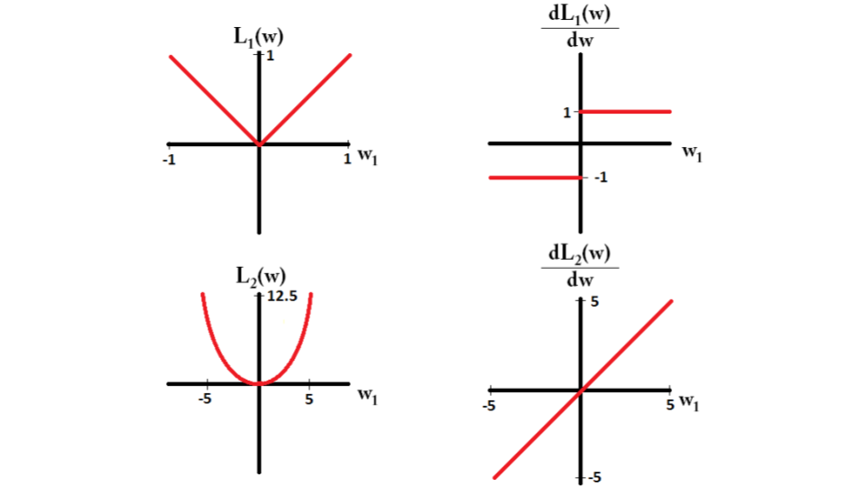   
For L1, the gradient is either $1$ or $-1$, except for when $w_i=0$
. That means that L1-regularization will move any weight towards 0 with the same step size, regardless the weight's value.  
In contrast, in L2-regularization, gradient is linearly decreasing towards $0$ as the weight goes towards 0. Therefore, L2-regularization will also move any weight towards 0, but it will take smaller and smaller steps as a weight approaches 0.  

For example, check below example.  
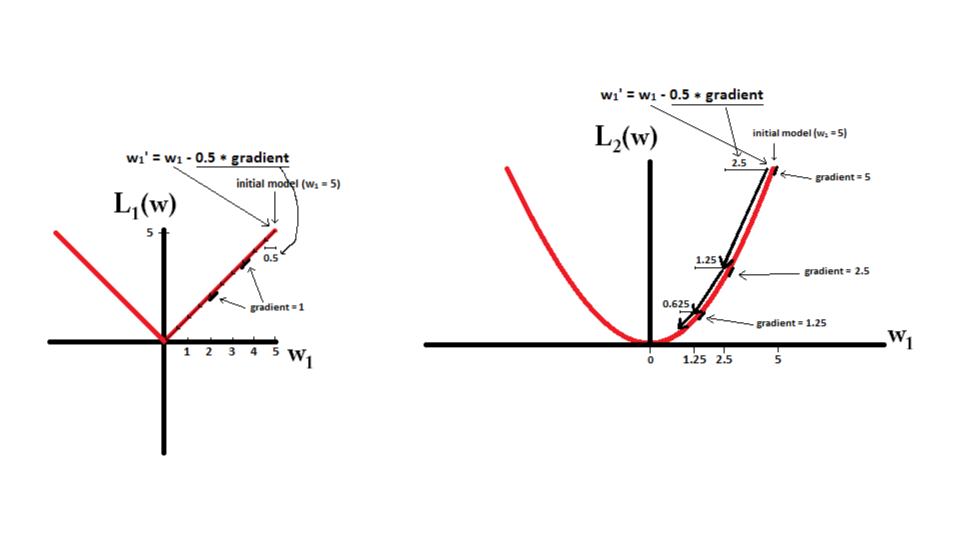   
In L1-Regularization(left), start with a model with $w_1 = 5$ and using learning rate $\eta = 0.5$. You can see how gradient descent using L1-regularization makes $10$ updates until reaching a model with $w_1=0$.
$$ w_1 := w_1 - \eta \cdot \frac{dL_1(w)}{dw} = w_1 - \tfrac{1}{2} \cdot 1 $$  
In constrast, with L2-regularization where $\eta=0.5$, the gradient is $w_1$, causing every step to be only halfway towards 0.
$$ w_1 := w_1 - \eta \cdot \frac{dL_2(w)}{dw} = w_1 - \tfrac{1}{2} \cdot w_1 $$
Therefore, the model never reaches a weight of 0, regardless of how many steps we take.

<b> Combining original loss and penalty term(L1 norm) </b>  
Since the regularization is just a penalty term, the next possible question is combined with loss function, there is also weight inside loss function, so how come these two combined can force weight to exact zero? Let's consider below loss function.
$$
J(w) = \underbrace{\mathcal{L}_{\text{data}}(w)}_{\text{fit term}} + \underbrace{\lambda \|w\|_1}_{\text{regularizer}}
$$
At the best weight $w^*$, the slope (or gradient) of the total loss 
$J(w)$ should be zero, because if the slope isn’t zero, the optimizer would still move left or right. It can be formally represented as,
$$
0 \in \frac{\partial \mathcal{L}_{\text{data}}(w_i)}{\partial w_i} + \lambda \, \frac{\partial |w_i|}{\partial w_i}
$$
For all $w_i$.
Simply it can be derived as <b>$0$ is in the set of all possible values of slope of the total loss $J(w)$</b>.  

Also note that,
$$
\frac{\partial |w_i|}{\partial w_i} =
\begin{cases}
+1, & w_i > 0, \\[6pt]
-1, & w_i < 0, \\[6pt]
[-1, +1], & w_i = 0
\end{cases}
$$

Now, let's consider the case where $w_i =0$,
$$
0 \in \frac{\partial \mathcal{L}_{\text{data}}(0)}{\partial w_i} + \lambda \, [-1, +1]
$$
Since original eqaution holds for all $w_i$.  
- $\frac{\partial \mathcal{L}_{\text{data}}(0)}{\partial w_i}$: the data loss term. a constant number that tells you how much the data would like to increase or decrease this weight.
- $\lambda \, [-1, +1]$: at $0$, the L1 part can take any value between $-\lambda$ and $\lambda$.

So, since data loss term is constant number and L1 part is range, there exists some $s_i \in [−1,+1]$ from L1 term such that,
$$
\frac{\partial \mathcal{L}_{\text{data}}(0)}{\partial w_i} + \lambda s_i = 0
$$
Simply speaking, <b>we can find a value between −1 and +1 from L1 regularization part that perfectly cancels out the slope of the data loss</b>.  
$$
s_i = -\frac{1}{\lambda} \frac{\partial \mathcal{L}_{\text{data}}(0)}{\partial w_i}
$$
Now, $w_i=0$ is a valid solution only if this $s_i$ is a valid subgradient, which means $s_i \in [−1,+1]$.
$$
-1 \le -\frac{1}{\lambda} \frac{\partial \mathcal{L}_{\text{data}}(0)}{\partial w_i} \le +1, \\[5pt]
| \frac{\partial \mathcal{L}_{\text{data}}(0)}{\partial w_i} | \le \lambda
$$

So If $| \frac{\partial \mathcal{L}_{\text{data}}(0)}{\partial w_i} | \le \lambda$, $w_i = 0$, since original assumption was correct($w_i = w_i^* = 0$). In contrast, if $| \frac{\partial \mathcal{L}_{\text{data}}(0)}{\partial w_i} | \ge \lambda$, assumption was wrong and $w_i \neq 0$. 

Let's interpret this result. 
- $| \frac{\partial \mathcal{L}_{\text{data}}(0)}{\partial w_i} | \le \lambda$: If the gradient of the data loss with respect to $w_i$ is smaller in magnitude than $\lambda$, the L1 penalty term($\lambda$) can cance the data loss term and $w_i=0$ satisfies the optimality condition.
- $| \frac{\partial \mathcal{L}_{\text{data}}(0)}{\partial w_i} | \le \lambda$: The data term is “too strong” and no $s_i$ can make the sum $0$.

<b> Why not L2? </b>  
$$
J(w) = \mathcal{L}_{\text{data}}(w) + \lambda \|w\|_2^2 = \mathcal{L}_{\text{data}}(w) + \lambda \sum_i w_i^2 \\[5pt]
J(w_i) = \mathcal{L}_{\text{data}}(w_i) + \lambda w_i^2 \\[5pt]
\frac{\partial J}{\partial w_i} = \frac{\partial \mathcal{L}_{\text{data}}}{\partial w_i} + 2\lambda w_i = 0 \\[5pt]
w_i = -\frac{1}{2\lambda} \frac{\partial \mathcal{L}_{\text{data}}}{\partial w_i}
$$
You can see that the optimal weight, $w_i$ is proportional to the data gradient. So to make optimal weight zero, the data term has to be exact zero which is rare.  
Another intuition is that, since $w_i$ is inside the gradient $2 \lambda w_i$, as weight shrinks, also gradient shrinks, so it slows down and never actually reaches zero.


##### Log-Saturation
log 함수의 고유한 그래프 모양 때문에 입력 인자(arguments)의 크기가 아무리 넓게 분포되어 있더라도, log 함수를 거치면 그 상대적인 차이가 줄어들고 값들이 특정 범위 안에서 압축되어 서로 더 "비슷해지는" 경향을 보이는 것을 의미합니다.

##### Term Weighting
Term weighting is a procedure that takes place during the text indexing process in order to assess the value of each term to the document. Term weighting is the assignment of numerical values to terms that represent their importance in a document in order to improve retrieval effectiveness.

##### Expansion (용어 확장)
정의: 원본 텍스트(문서 또는 쿼리)에는 직접 나타나지 않지만, 텍스트의 의미와 밀접하게 관련된 다른 단어들을 해당 텍스트의 표현에 추가하는 과정입니다.
목표: 전통적인 BoW 모델이 겪는 "어휘 불일치(lexical mismatch)" 문제를 해결하여, 쿼리와 문서가 동일한 단어를 사용하지 않더라도 의미상으로 관련성이 있다면 검색될 수 있도록 합니다. 즉, Bag-of-Words(BOW) 모델은 쿼리에 있는 단어가 문서에 없으면 아무리 의미적으로 관련성이 높아도 해당 문서를 찾지 못하는 '단어 불일치' 문제에 취약합니다. Expansion은 쿼리나 문서에 직접적으로 나타나지 않더라도 의미적으로 관련된 단어들을 추가하거나 기존 단어의 중요도를 재조정함으로써 이 문제를 해결하고자 합니다. SPLADE와 같은 모델에서는 입력된 쿼리 또는 문서의 토큰(단어)들을 기반으로 전체 단어장(vocabulary) 내의 모든 단어에 대한 중요도(weight)를 예측합니다. 즉, 원본 텍스트에 없던 단어라도 문맥상 관련성이 높다고 판단되면 해당 단어에 0이 아닌 가중치를 부여하여 벡터 표현에 포함시킵니다.


### Self-Attentive Sequential Recommendation (SASRec)
https://arxiv.org/pdf/1808.09781

### Duo Rec
https://arxiv.org/pdf/2110.05730

### OneRec
check "images/blog33_onerec.pdf"  

### OneRec-v2
https://arxiv.org/abs/2508.20900
### Mini OneRec
https://arxiv.org/abs/2510.24431

### Matryoshka Representation Learning (MRL)
As new state-of-the-art (text) embedding models started producing embeddings with increasingly higher output dimensions, i.e., every input text is represented using more values. Although this improves performance, it comes at the cost of efficiency of downstream tasks such as search or classification.

Kusupati et al. (2022) were inspired to create embedding models whose embeddings could reasonably be shrunk without suffering too much on performance. Rather than performing your downstream task (e.g., nearest neighbor search) on the full embeddings, you can shrink the embeddings to a smaller size and very efficiently "shortlist" your embeddings. Afterwards, you can process the remaining embeddings using their full dimensionality.

For Matryoshka Embedding models, a training step involves producing embeddings for your training batch, then you use some loss function to determine not just the quality of your full-size embeddings, but also the quality of your embeddings at various different dimensionalities. For example, output dimensionalities are 768, 512, 256, 128, and 64. The loss values for each dimensionality are added together, resulting in a final loss value. The optimizer will then try and adjust the model weights to lower this loss value.

즉, MRL 방식으로 모델을 학습시키면, 전체 차원 중 앞부분의 $m$개 차원(예: 앞의 128개 또는 256개 숫자)만 뚝 잘라서 써도 그 자체로 의미가 통하는 훌륭한 저차원 임베딩 벡터가 됩니다. 학습할 때 임의로 차원을 정하는 것이 아니라, [40, 80, 160, 320, 640, 1280, 2560]처럼 로그 스케일 간격($2^n$배 형태)으로 목표 차원($m$)들을 설정합니다.그리고 인형 속에 인형이 계속 들어있는 것처럼, "40차원도 완벽해야 하고, 80차원도 완벽해야 하고, 최종 차원도 완벽해야 한다"는 목적 함수(Objective)를 중첩해서 모델을 훈련시킵니다.
이 방식의 가장 큰 장점은 개발사가 모델을 딱 하나만 만들어서 출시(Ship)하면 된다는 것입니다. 사용자(Caller)는 각자의 서비스 환경에 따라 추론(Inference) 시점에 원하는 크기를 마음대로 골라 쓸 수 있습니다. 저장 공간과 연산 속도가 중요하다면 앞부분의 작은 차원(예: 160차원)만 잘라서 가볍고 빠르게 씁니다. 정확도가 최우선이라면 전체 차원(예: 2560차원)을 모두 활용합니다.

#### Algorithm of MRL
https://arxiv.org/abs/2205.13147
https://huggingface.co/blog/matryoshka#%F0%9F%AA%86-matryoshka-embeddings

#### Compared to Projection
https://zeroentropy.dev/articles/matryoshka-is-dead/#what-we-shipped-instead-learned-projection-matrices


## Factorized Personalized MC(Markov Chains) Model
https://cseweb.ucsd.edu/classes/fa17/cse291-b/reading/p811.pdf

## Recommendation System Basic
A recommendation system helps users find compelling content in a large corpus. For example, the Google Play Store provides millions of apps, while YouTube provides billions of videos.  

<b> Homepage Recommendations </b>  
Homepage recommendations are personalized to a user based on their known interests. Every user sees different recommendations.

<b> Related item Recommendations </b>  
Related items are recommendations similar to a particular item. In the Google Play apps example, users looking at a page for a math app may also see a panel of related apps, such as other math or science apps.

### Architecture

One common architecture for recommendation systems consists of the following three components.
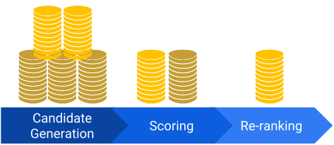   

<b> 1. Candidate Generation</b>  
In this first stage, the system starts from a potentially huge corpus and generates a much smaller subset of candidates.
The model needs to evaluate queries quickly given the enormous size of the corpus. A given model may provide multiple candidate generators, each nominating a different subset of candidates.  

<b> 2. Scoring</b>  
Next, another model scores and ranks the candidates in order to select the set of items to display to the user. Since this model evaluates a relatively small subset of items, the system can use a more precise model relying on additional queries.

<b> 3. Re-Ranking </b>  
Finally, the system must take into account additional constraints for the final ranking. For example, the system removes items that the user explicitly disliked or boosts the score of fresher content. Re-ranking can also help ensure diversity, freshness, and fairness.  

### Candidate Generation
Candidate generation is the first stage of recommendation. Given a query, the system generates a set of relevant candidates.
| **Type**                    | **Definition**                                                                         | **Example**                                                                                                                                         |
| --------------------------- | -------------------------------------------------------------------------------------- | --------------------------------------------------------------------------------------------------------------------------------------------------- |
| **Content-based filtering** | Uses similarity between items to recommend items similar to what the user likes.       | If user A watches two cute cat videos, the system recommends other cute animal videos.                                                              |
| **Collaborative filtering** | Uses similarities between users *and* items simultaneously to provide recommendations. | If user A is similar to user B, and user B likes video 1, the system recommends video 1 to user A(even if user A has not seen any similar videos). |

#### Embedding Space
In candidate generation, map each item and each query (or context) to an embedding vector in a common embedding space. 
$$
E = \mathbb{R}^{d}
$$
The embedding space is low-dimensional($d$ is  much smaller than the size of the corpus), and captures some latent structure of the item or query set.  
Similar items, such as YouTube videos that are usually watched by the same user, end up close together in the embedding space. The notion of "closeness" is defined by a similarity measure.

#### Similarity Measures
A similarity measure is a function that takes a pair of embeddings and returns a scalar measuring their similarity.
$$
s : E \times E \rightarrow \mathbb{R}
$$
When given a query embedding $q \in E$,  the system looks for item embeddings $x \in E$ that are close to $q$ that is, embeddings with high similarity, $s(q,x)$.  

To determine the degree of similarity, most recommendation systems rely on one or more of the following.
- cosine: cosine of the angle between the two vectors, $cos(q,x)$.
- dot product: $ s(q, x) = \langle q, x \rangle = \sum_{i = 1}^d q_i x_i = \|x\| \|q\| \cos(q, x)$. Note that dot product is equivalent to the cosine of the angle multiplied by the product of l2 norms.
- Euclidean distance: just Euclidean lengths (l2 norm). A smaller distance means higher similarity.

Consider the example in the figure following.
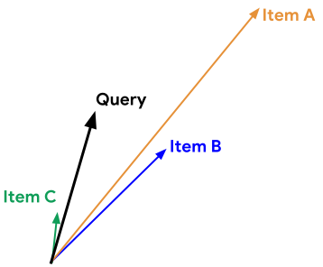   
- cosine: C>A>B
- Euclidean distance: B>C>A
- dot product: A>B>C

Compared to the cosine, the dot product similarity is sensitive to the norm of the embedding. That is, the larger the norm of an embedding, the higher the similarity and the more likely the item is to be recommended.  

Items that appear very frequently in the training set (for example, popular YouTube videos) tend to have embeddings with large norms. Popular items tend to get updated more often. This is because since these items are liked by many users, most updates pull the embedding in similar directions.
This accumulated effect increases the vector’s norm, so popular item embeddings tend to have large norms.

Therefore, If capturing popularity information is desirable, then you should prefer dot product. However, if you're not careful, the popular items may end up dominating the recommendations. In practice, you can use other variants of similarity measures that put less emphasis on the norm of the item.
$$
s(q, x) = \|q\|^\alpha \|x\|^\alpha \cos(q, x), \quad \text{for some } \alpha \in (0, 1).
$$

On the other hand, items that appear very rarely may not be updated frequently during training. Consequently, if they are initialized with a large norm, the system may recommend rare items over more relevant items. To avoid this problem, be careful about embedding initialization, and use appropriate regularization.

#### Content-based Filtering
핵심 아이디어: "당신이 좋아한 것과 비슷한 속성을 가진 아이템을 추천한다."
아이템 자체의 feature을 분석해서, 사용자가 과거에 좋아한 아이템과 유사한 아이템을 찾아냅니다. 사용자의 취향을 아이템 속성의 집합으로 모델링하는 방식이에요.

작동 방식: 각 아이템을 특징 벡터로 표현 (예: 영화 → 장르, 감독, 배우, 키워드) -> 사용자가 좋아한 아이템들의 특징을 모아 사용자 프로파일 생성 ->새 아이템과 사용자 프로파일의 유사도(코사인 유사도 등)를 계산해서 추천

Content-based filtering uses item features to recommend other items similar to what the user likes, based on their previous actions or explicit feedback. It uses item features to select and return items relevant to a user’s query. 

In Content-based recommender systems(CBRSs), the model compares a user profile and item profile to predict user-item interaction and recommend items accordingly.
- item profile: an item’s representation in the system. It consists of an item’s feature set, which can be internal structured characteristics or descriptive metadata.
- user profile: a representation of user preferences and behavior. It can consist of representations of those items in which a user has previously shown interest. It also consists of user data of their past interactions with the system (for example, user likes, dislikes, ratings, queries, etc.).

So items are converted to vectors using metadata descriptions or internal characteristics as features. For example, say we build item profiles to recommend new novels to users as part of an online bookshop. 
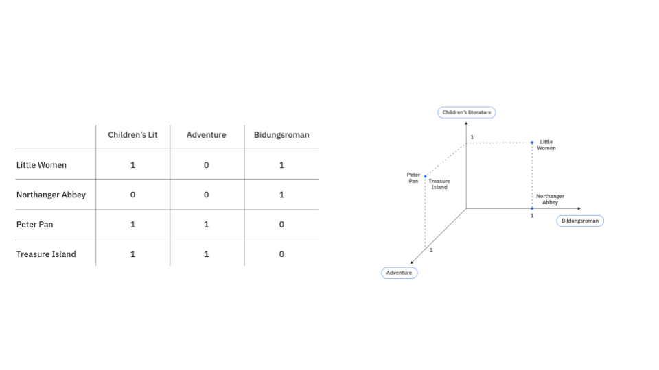   
As you can see, above left table shows profiles for each novel using representative metadata, such as author, genre, etc. A novel’s value for a given category can be represented with Boolean values, where 1 indicates the novel’s presence in that category and 0 indicates its absence. 

The right graph is a visualization of vector space. The closer two novel-vectors are in vector space, the more similar our system considers them to be according to the provided features. "Peter Pan" and "Treasure Island" share the exact same features, appearing at the same vector point $(1,1,0)$. Because of their similarity in this space, if a user has previously purchased "Peter Pan", the system will recommend those novels closest to "Peter Pan"—such as "Treasure Island"—to that user as a potential future purchase. 

CBRSs create a user-based classifier or regression model to recommend items to a specific user. To start, the algorithm takes descriptions and features of those items in which a particular user has previously shown interest—that is the user profile. These items constitute the training dataset used to create a classification or regression model specific to that user. In this model, item attributes are the independent variables, with the dependent variable being user behavior (for example, user ratings, likes, purchases, etc.). The model trained on this past behavior aims to predict future user behavior for possible items and recommend items according to the prediction.

##### Advantages and Disadvantages
<b> Advantages </b>  
While content-based filtering struggles with new users, it nevertheless adeptly handles incorporating new items. This is because it recommends items based on internal or metadata characteristics rather than past user interaction. 

Content-based filtering enables greater degree of transparency by providing interpretable features that explain recommendations. For example, a movie recommendation system may explain why a certain movie is recommended, such as genre or actor overlap with previously watched movies.  

다른 사용자 데이터가 없어도 작동 (사용자 한 명의 이력만 있으면 됨)
새 아이템(cold-start item)도 특징만 분석하면 바로 추천 가능
추천 이유를 설명하기 쉬움 ("당신이 좋아한 SF 영화와 유사해서")

<b> Disadvantages </b>  
Feature limitation. Content-based recommendations are derived exclusively from the features used to describe items. A system’s item features may not be able to capture what a user likes however. In other words, since the feature representation of the items are hand-engineered to some extent, this technique requires a lot of domain knowledge. Therefore, the model can only be as good as the hand-engineered features.

Because content-based filtering only recommends items based on a user’s previously evidenced interests, its recommendations are often similar to items a user liked in the past. So the model has limited ability to expand on the users' existing interests.

특징 추출이 어려운 도메인에선 한계 (예: 음악의 미묘한 분위기, 예술작품의 감성)
필터 버블 문제: 비슷한 것만 계속 추천되어 새로운 발견이 어려움
새 사용자(cold-start user)에겐 여전히 약함 (선호 이력이 있어야 작동)

#### Collaborative Filtering
핵심 아이디어: "당신과 취향이 비슷한 사람들이 좋아한 것을 추천한다."
아이템의 속성은 보지 않고, 오직 사용자-아이템 상호작용(평점, 클릭, 구매 등) 데이터만으로 추천합니다. "비슷한 사용자는 비슷한 것을 좋아한다"는 가정에 기반해요.
두 가지 방향이 있습니다.

- User-based CF (사용자 기반): 나와 평점 패턴이 비슷한 다른 사용자들을 찾는다. 그 사람들이 좋아한 아이템 중 내가 안 본 것을 추천
- Item-based CF (아이템 기반): 내가 좋아한 아이템과 평점 패턴이 비슷한 아이템들을 찾는다. 그 아이템들을 추천

Collaborative filtering is an information retrieval method that recommends items to users based on how other users with similar preferences and behavior have interacted with that item. It uses similarities between users and items simultaneously to provide recommendations.

In practice, the embeddings can be learned automatically, which is the power of collaborative filtering models. Suppose the embedding vectors for the movies are fixed. Then, the model can learn an embedding vector for the users to best explain their preferences. Consequently, embeddings of users with similar preferences will be close together. Similarly, if the embeddings for the users are fixed, then we can learn movie embeddings to best explain the feedback matrix. As a result, embeddings of movies liked by similar users will be close in the embedding space.

##### Advantages & Disadvantages
<b> Advantages </b>  
No domain knowledge necessary: We don't need domain knowledge because the embeddings are automatically learned.
Serendipity(우연): The model can help users discover new interests. In isolation, the ML system may not know the user is interested in a given item, but the model might still recommend it because similar users are interested in that item.
Great starting point

아이템 특징을 정의할 필요 없음 (음악, 영화처럼 특징 추출이 어려운 영역에 강함)
뜻밖의 발견(serendipity) 가능 — 내 평소 취향과 다른 장르도 추천될 수 있음
도메인 지식 없이도 작동

<b> Disadvantages </b>  
Cannot handle fresh items(cold-start problem): The prediction of the model for a given (user, item) pair is the dot product of the corresponding embeddings. So, if an item is not seen during training, the system can't create an embedding for it and can't query the model with this item.

Hard to include side features for query/item: Side features are any features beyond the query or item ID. For movie recommendations, the side features might include country or age. Including available side features improves the quality of the model. 

Cold-start 문제: 새 사용자/새 아이템은 상호작용 데이터가 없어서 추천 불가
희소성(sparsity) 문제: 대부분의 사용자는 극히 일부 아이템만 평가했기 때문에 매트릭스가 거의 비어 있음
사용자/아이템이 많아질수록 계산 비용 폭증 (모든 쌍의 유사도 계산)

##### Collaborative Filtering Embedding
협업 임베딩은 어떤 사용자 집단에 의해 소비되었는지"에 대한 순수한 상호작용 구조를 포착합니다.

1. 초기화: 아이템(항목)의 제목이나 내용 같은 텍스트 정보는 철저히 배제하고, 무작위로 초기화된 고유 ID 임베딩만을 부여합니다.
2. 그래프 구성: 사용자가 어떤 항목을 클릭, 시청, 구매했는지를 나타내는 행동 데이터를 활용하여 '사용자-항목 이분 그래프(Bipartite graph)'를 생성합니다.
3. 그래프 전파 (Graph Propagation): 이웃한 노드(사용자-아이템) 간에 정보를 교환합니다. 협업 모델인 LightGCN은 2개 층(L=2)을 거쳐 정보를 전파시켰는데, 이를 통해 특정 아이템이 "어떤 사용자 집단에 의해 소비되었는지"에 대한 순수한 상호작용 구조를 포착합니다.
4. 최적화: 사용자가 실제로 상호작용한 아이템이 상호작용하지 않은 아이템보다 추천 점수가 더 높게 나오도록 순위 기반의 학습(BPR loss)을 진행합니다.

가령 영화를 예로 들면 영화가 '무엇에 관한 내용인지'가 아니라, '어떤 사람들이 서로 엮여서 상호작용했는지'라는 행동 기반의 연결망을 수학적 벡터(d=64차원)로 압축해 낸 결과물입니다.

<아이언맨 3>와 <퍼시픽 림> 두 영화는 텍스트 상으로는 전혀 다른 제목을 가졌음에도 "비슷한 성향의 관객(메카닉/로봇물 선호 등)이 소비하는 영화"라는 잠재적 주제 연관성(latent thematic affinity)을 기반으로 묶이게 되는 것입니다.

##### Light GCN

##### Matrix Factorization in Recommender Systems
핵심 아이디어: 거대한 사용자-아이템 평점 행렬을 두 개의 작은 행렬의 곱으로 분해해서, 숨겨진 잠재 요인(latent factor)을 찾아낸다.
Collaborative Filtering의 한 종류이지만, 워낙 중요하고 영향력이 커서 별도로 다루는 경우가 많아요. Netflix Prize(2006~2009) 대회에서 우승 기법으로 유명해졌습니다.
```
사용자 × 아이템 평점 행렬 R (대부분 비어 있음, 매우 큼)-> 이걸 두 행렬로 분해: R ≈ U × Vᵀ

U: 사용자 × 잠재요인 행렬 (각 사용자를 k개의 잠재요인으로 표현)
V: 아이템 × 잠재요인 행렬 (각 아이템을 k개의 잠재요인으로 표현)

비어 있던 칸의 평점을 U와 V의 곱으로 예측
```
잠재 요인이 뭔지에 대한 직관
예를 들어 영화 도메인에서 잠재요인 k=3이라면 학습 결과 이런 게 자동으로 발견될 수 있어요:

요인 1: "액션 ↔ 드라마" 축
요인 2: "가벼움 ↔ 진지함" 축
요인 3: "대중적 ↔ 컬트적" 축

각 사용자도, 각 영화도 이 3차원 공간의 한 점이 됩니다. 사용자 벡터와 영화 벡터의 내적이 클수록 그 사용자가 그 영화를 좋아할 확률이 큰 거죠.
중요한 건 이 요인들이 사람이 미리 정의한 게 아니라 데이터에서 자동으로 학습된다는 점이에요. 그래서 Content-based처럼 "장르"라는 명시적 특징을 쓰지 않으면서도, 비슷한 효과를 더 정교하게 냅니다.

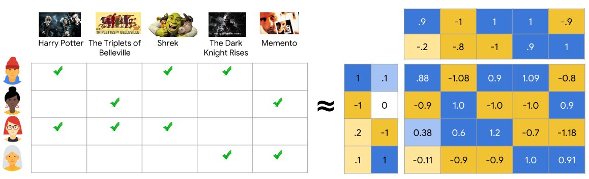  

Matrix factorization is a simple embedding model. Given the feedback matrix $A \in \mathbb{R}^{n \times m}$, where $m$ is the number of users and $n$ is the number of items. A user embedding matrix $U \in \mathbb{R}^{m \times d}$, where row $i$ is the embedding for user $i$. An item embedding matrix $V \in \mathbb{R}^{m \times d}$, where row $j$ is the embedding for item $j$. Each embeddings are learned such that the product $UV^{T}$ is a good approximation of the feedback matrix $A$.

###### Choose Objective Function
One intuitive objective function is the squared distance. To do this, minimize the sum of squared errors over all pairs of observed entries.
$$
\min_{U \in \mathbb{R}^{m \times d},\, V \in \mathbb{R}^{n \times d}}
\sum_{(i,j)\in \text{obs}} (A_{ij} - \langle U_i, V_j \rangle )^2
$$

Or you can use Weighted Matrix Factorization decomposes the objective into the following two sums.
- A sum over observed entries.
- A sum over unobserved entries (treated as zeroes).
$$
\min_{U \in \mathbb{R}^{m \times d},\, V \in \mathbb{R}^{n \times d}}
\sum_{(i,j)\in \text{obs}} w_{i,j}(A_{ij} - \langle U_i, V_j \rangle )^2
\;+\;
w_0 \sum_{(i,j)\notin \text{obs}} (\langle U_i, V_j \rangle )^2 .
$$
Where $w_{i,j}$ and $w_0$ are hyperparameters that weights the two terms so that the objective is not dominated by one or the other.

Common algorithms to minimize the objective function is Stochastic gradient descent (SGD).


#### Deep Neural Network Models
There are some limitations in matrix factorization to learn embeddings.

- The difficulty of using side features (that is, any features beyond the query ID/item ID). As a result, the model can only be queried with a user or item present in the training set.
- Relevance of recommendations. Popular items tend to be recommended for everyone, especially when using dot product as a similarity measure. It is better to capture specific user interests.

One possible DNN model is softmax, which treats the problem as a multiclass prediction problem. The input is the user query and the output is a probability vector with size equal to the number of items in the corpus, representing the probability to interact with each item.

##### Architecture
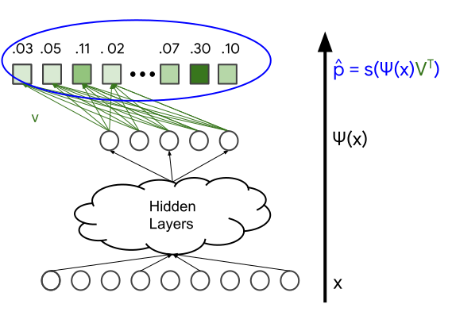   

By adding hidden layers and non-linear activation functions (for example, ReLU), the model can capture more complex relationships in the data. However, increasing the number of parameters also typically makes the model harder to train and more expensive to serve. 
$$
\hat p = h(\psi(x) V^T), \quad h(y)_i=\frac{e^{y_i}}{\sum_j e^{y_j}}
$$
Where $\psi(x)$ is the output of the last layer, $h(y)$ is softmax function and $V$ is the matrix of weights of the softmax layer. The softmax layer maps a vector of scores(logits) to a probability distribution.

##### Loss Function
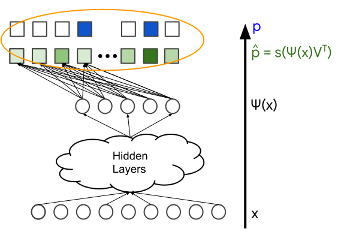   
The loss function that compares the following.

- $p$: the ground truth, representing the items the user has interacted with.
- $\hat{p}$: the output of the softmax layer (a probability distribution).

Then use the cross-entropy loss since you are comparing two probability distributions.

##### DNN vs Matrix Factorization
Both the softmax model and the matrix factorization model, the system learns one embedding vector $V_j$ per item $j$.  
The query embeddings, however, are different. Instead of learning one embedding $U_i$ per query $i$, the system learns a mapping from the query feature $x$ to an embedding $\psi(x)$. So you can consider DNN model as a generalization of matrix factorization, in which you replace the query side by a nonlinear function.

##### Two-Tower Model
Instead of learning one embedding per item, can the model learn a nonlinear function that maps item features to an embedding like query feature? Yes. To do so, use a two-tower neural network, which consists of two neural networks.

- One neural network maps query features $x_{query}$ to query embedding, $\psi(x_{\text{query}}) \in \mathbb R^d$.
- One neural network maps item features $x_{item}$ to item embedding, $\phi(x_{\text{item}}) \in \mathbb R^d$. 

The output of the model can be defined as the dot product $\langle \psi(x_{\text{query}}), \phi(x_{\text{item}}) \rangle$. Note that this is not a softmax model anymore. The new model predicts one value per pair $(x_{\text{query}}, x_{\text{item}})$, instead of a probability vector for each query $x_{\text{query}}$.

##### Folding and Negative Sampling
During training, if the system only trains on positive pairs, the model may suffer from folding. Folding is phenomenon when the model incorrectly predict a high score for an item from a different group. This happends because the model only know how to place the query/item embeddings of a given color relative to each other. So the embeddings from different colors may end up in the same region of the embedding space by chance.

Negative examples are items labeled "irrelevant" to a given query. Showing the model negative examples during training teaches the model that embeddings of different groups should be pushed away from each other.

### Retrieval, Scoring and Re-ranking
#### Retrieval
Retrieval is a stage of embedding model where given a user, decide which items to recommend.

- For a matrix factorization model, the query (or user) embedding is known statically, and the system can simply look it up from the user embedding matrix.
- For a DNN model, the system computes the query embedding at serve time by running the network on the feature vector .

Once you have the query embedding $q$, search for item embeddings $V_j$ that are close to $q$ in the embedding space. This is a nearest neighbor problem. 

##### Large-scale retrieval
To compute the nearest neighbors in the embedding space, the system can exhaustively score every potential candidate. Exhaustive scoring can be expensive for very large corpora, but you can use either of the following strategies to make it more efficient.

- If the query embedding is known statically, the system can perform exhaustive scoring offline, precomputing and storing a list of the top candidates for each query. 
- Use approximate nearest neighbors. Google provides an open-source tool on GitHub called ScaNN (Scalable Nearest Neighbors). This tool performs efficient vector similarity search at scale.

#### Scoring (Ranking)
After candidate generation, another model scores and ranks the generated candidates to select the set of items to display. The recommendation system may have multiple candidate generators that use different sources, such as the following.

- Related items from a matrix factorization model.
- User features that account for personalization.
- "Local" vs "distant" items; that is, taking geographic information into account.
- Popular or trending items.
- A social graph; that is, items liked or recommended by friends.

The system combines these different sources into a common pool of candidates that are then scored by a single model and ranked according to that score. 

##### Why not let the candidate generator score?
- Some systems rely on multiple candidate generators. The scores of these different generators might not be comparable.
- With a smaller pool of candidates, the system can afford to use more features and a more complex model that may better capture context.

##### Choosing an objective function for scoring
<b> Maximize Click Rate </b>  
If the scoring function optimizes for clicks, the systems may recommend click-bait videos. This scoring function generates clicks but does not make a good user experience. Users' interest may quickly fade.

<b> Maximize Watch Time </b>  
If the scoring function optimizes for watch time, the system might recommend very long videos, which might lead to a poor user experience. Note that multiple short watches can be just as good as one long watch.

<b> Increase Diversity and Maximize Session Watch Time </b>  
Recommend shorter videos, but ones that are more likely to keep the user engaged.

##### Positional bias in scoring
Items that appear lower on the screen are less likely to be clicked than items appearing higher on the screen. However, when scoring videos, the system usually doesn't know where on the screen a link to that video will ultimately appear. Querying the model with all possible positions is too expensive. 

Solutions
- Create position-independent rankings.
- Rank all the candidates as if they are in the top position on the screen.

#### Re-Ranking
In the final stage of a recommendation system, the system can re-rank the candidates to consider additional criteria or constraints. One re-ranking approach is to use filters that remove some candidates.

##### Freshness
Most recommendation systems aim to incorporate the latest usage information, such as current user history and the newest items. Keeping the model fresh helps the model make good recommendations.

<b> Solution </b>  
Re-run training as often as possible to learn on the latest training data. We recommend warm-starting the training so that the model does not have to re-learn from scratch. Warm-starting can significantly reduce training time.

##### Diversity
If the system always recommend items that are "closest" to the query embedding, the candidates tend to be very similar to each other. This lack of diversity can cause a bad or boring user experience. 

<b> Solution </b>
- Train multiple candidate generators using different sources.
- Train multiple rankers using different objective functions.


### References
- https://developers.google.com/machine-learning/recommendation?_gl=1*100s3or*_up*MQ..*_ga*NDEzMDgzNTk0LjE3NjMwNDM1Mzc.*_ga_SM8HXJ53K2*czE3NjMwNDM1MzckbzEkZzAkdDE3NjMwNDM1MzckajYwJGwwJGgw
- https://en.wikipedia.org/wiki/Matrix_factorization_(recommender_systems)
- https://www.ibm.com/think/topics/content-based-filtering

## Metrics
### Precision/Recall@K
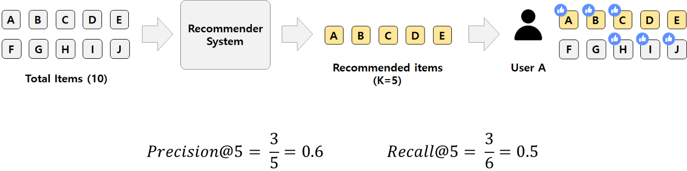   

Precision은 내가 1로 예측한 것 중에 실제 1이 얼마나 있는지 비율 -> Precision@K는 내가 추천한 K개 아이템 중 실제 사용자가 관심있는 아이템의 비율

Recall은 실제 모든 1 중에서 내가 1로 예측한 것이 얼마나 되는지 비율 -> Recall@K는 사용자가 관심있는 전체 아이템의 중 내가 추천한 아이템의 비율

### Hit Rate@K
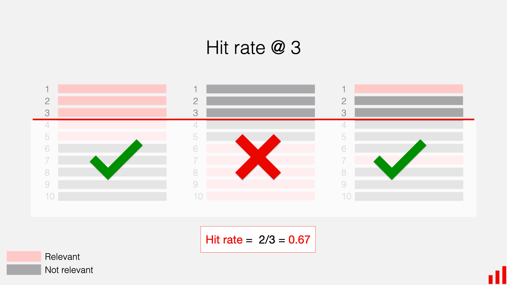   

Hit Rate at K calculates the share of users for which at least one relevant item is present in the K.

### Mean Average Precision@K (MAP@K)
Mean Average Precision (MAP) at K evaluates the average Precision at all relevant ranks within the list of top K recommendations.

To compute MAP, you first need to calculate the Average Precision (AP) for each list which is an average of Precision values at all positions in K with relevant recommendations. Once you compute the AP for every list, you can average it across all users.

<b> Average Precision @ K </b>  
   

<b> Mean Average Precision @ K</b>  

$$
\mathrm{MAP@K} = \frac{1}{U} \sum_{u=1}^{U} \mathrm{AP@K}_u
$$
For example, if you have 100 users, you sum AP for each one and divide by 100.

### Normalized Discounted Cumulative Gain@K (NDCG@K)
#### Cumulative Gain (CG@K)
CG is the sum of the graded relevance values of all results in a search result list. It does not take into account the rank (position) of a result in the result list.
$$
{\displaystyle \mathrm {CG_{K}} =\sum _{i=1}^{K}rel_{i}}
$$

*relevance score:해당 쿼리(또는 유저)에 대해, 그 아이템이 얼마나 관련 있는지를 나타내는 비음수 값. (정답(label) 기반 점수, 모델 예측 X)

CG = 순서를 고려하지 않은 추천한 아이템의 관련성 합

#### Discounted Cumulative Gain (DCG@K)
The premise of DCG is that highly relevant documents appearing lower in a search result list should be penalized, as the graded relevance value is reduced logarithmically proportional to the position of the result.
$$
{\displaystyle \mathrm {DCG_{K}} =\sum _{i=1}^{K}{\frac {rel_{i}}{\log _{2}(i+1)}}=rel_{1}+\sum _{i=2}^{K}{\frac {rel_{i}}{\log _{2}(i+1)}}}
$$

An alternative formulation of DCG[4] places stronger emphasis on retrieving relevant documents.
$$
{\displaystyle \mathrm {DCG_{K}} =\sum _{i=1}^{K}{\frac {2^{rel_{i}}-1}{\log _{2}(i+1)}}}
$$

DCG = 순서를 고려한 CG 값. (뒤에 나온 값의 영향도가 줄어듦)

#### Normalized DCG (NCDG@K)
$$
{\displaystyle \mathrm {nDCG_{K}} ={\frac {DCG_{K}}{IDCG_{K}}}},
$$
Where IDCG is Ideal DCG as shown below.
$$
{\displaystyle \mathrm {IDCG_{K}} =\sum _{i=1}^{|REL_{K}|}{\frac {2^{rel_{i}}-1}{\log _{2}(i+1)}}}
$$
Where ${\displaystyle REL_{p}}$ represents the list of relevant documents (ordered by their relevance) in the corpus up to position $K$.

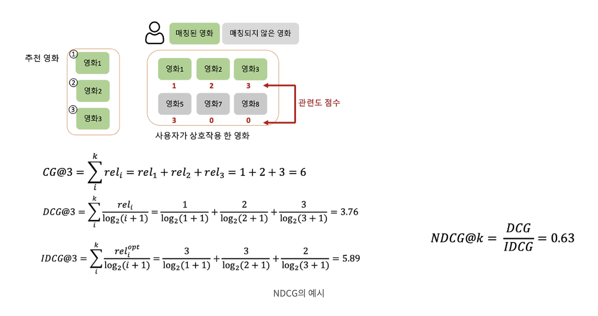   


IDCG = 최적의 추천일 때의 DCG  
NCCG = DCG/IDCG

### Reference
https://lsjsj92.tistory.com/663

## Deep & Cross Network (DCN)
크로스 네트워크 (입력 초기값을 출력벡터와 계속 교차 + 이전 입력 잔차 더함)의 출력과 딥 네트워크 (일반적인 뉴럴네트워크)의 출력물을 concate 한 뒤 가중치를 곱하고 시그모이드를 통과 시켜서 확률을 얻는 구조.  

1. Cross Network
매 레이어마다 초기 입력값($x_0$)과 현재 레이어의 출력($x_l$)을 교차(cross)시키고, 여기에 이전 레이어의 입력값($x_l$)을 잔차(residual) 형태로 더해주는 구조입니다. 
$$x_{l+1} = x_0 x_l^T w_l + b_l + x_l$$

2. Deep Network
크로스 네트워크와 병렬로 작동하며, 일반적인 다층 퍼셉트론(MLP)처럼 활성화 함수(ReLU)를 거쳐 복잡한 비선형적 상호작용을 학습하는 일반적인 전방향 뉴럴 네트워크입니다.
$$h_{l+1} = ReLU(W_l h_l + b_l)$$

3. Combination Layer및 확률 도출**:
크로스 네트워크의 최종 출력($x_{L_1}$)과 딥 네트워크의 최종 출력($h_{L_2}$)을 하나의 벡터로 이어 붙입니다(concatenate). 그 후, 이 결합된 벡터에 최종 선형 가중치($w_{logits}$)를 곱한 뒤 시그모이드(Sigmoid, $\sigma$) 함수를 통과시켜 최종 예측 확률($p$)을 얻게 됩니다.
$$p = \sigma( [x_{L_1}^T, h_{L_2}^T] w_{logits} )$$

### DCN v2
DCN v1은 Cross Network의 표현력(expressiveness)이 제한적이라는 단점이 있었는데, DCNv2는 수식 구조를 변경하여 표현력을 크게 높이면서도 연산 효율성을 유지하는 방향으로 발전했습니다. 핵심 수식들은 다음과 같이 전개됩니다.

#### DCNv2 Standard Cross Layer
$$x_{l+1} = x_0 \odot (W_l x_l + b_l) + x_l$$
- $x_0$: 네트워크의 초기 입력 벡터 (임베딩 레이어의 출력).
- $x_l, x_{l+1}$: 각각 $l$번째와 $l+1$번째 크로스 레이어의 입출력 벡터.
- $W_l \in \mathbb{R}^{d \times d}$, $b_l \in \mathbb{R}^d$: $l$번째 레이어의 학습 가능한 가중치 행렬 및 편향.
- $\odot$: Hadamard product.

DCN v1이 입력 벡터와 스칼라 가중치를 곱하는 구조($x_0 x_l^T w_l$)여서 표현할 수 있는 다항식의 범위가 제한적이었던 반면, DCNv2는 가중치 행렬 $W_l$을 사용하여 훨씬 복잡하고 다양한 명시적 특징 교차(explicit feature crosses)를 학습할 수 있게 되었습니다.

#### DCNv2 Cross Layer ver2: Low-Rank Cross Layer
$$x_{l+1} = x_0 \odot (U_l (V_l^T x_l) + b_l) + x_l$$
실제 산업 환경에서는 가중치 행렬 $W_l$의 크기($d \times d$)가 너무 커지면 연산량과 메모리 비용이 급증합니다. 이를 해결하기 위해 거대한 행렬 $W_l$을 두 개의 얇고 긴 행렬 $U_l$과 $V_l$로 분해(Low-Rank Approximation)**하는 수식이 도입되었습니다.  
여기서 $U_l, V_l \in \mathbb{R}^{d \times r}$ 이며, 랭크 $r$은 원래 차원 $d$보다 훨씬 작습니다 ($r \ll d$). 이 수식은 특징 교차 연산을 저차원 부분 공간(subspace)으로 투영했다가 다시 원래 차원으로 복원하는 방식으로 파라미터 수를 대폭 줄여줍니다.

#### DCNv2 Cross Layer ver3: Mixture of Low-Rank Experts
$$x_{l+1} = \sum_{i=1}^K G_i(x_l) E_i(x_l) + x_l, \quad
E_i(x_l) = x_0 \odot (U_l^i (V_l^{iT} x_l) + b_l)$$
로우 랭크 구조의 성능을 극대화하기 위해, 단일 연산 대신 여러 개의 '전문가(Expert)' 네트워크를 두어 서로 다른 부분 공간에서 특징을 학습한 뒤 결합하는 방식(MoE; Mixture-of-Experts)을 제안했습니다.  
여기서 $K$는 전문가의 수, $G_i(x_l)$는 입력값에 따라 어떤 전문가의 결과에 더 가중치를 둘지 결정하는 게이팅 함수(Gating function, 주로 softmax 등 사용), $E_i(x_l)$는 $i$번째 전문가의 로우 랭크 크로스 연산 결과를 의미합니다.

#### DCNv2 Cross Layer ver4: Nonlinear Transformation
$$E_i(x_l) = x_0 \odot \left( U_l^i \cdot g(C_l^i \cdot g(V_l^{iT} x_l)) + b_l \right)$$
차원이 축소된 공간 안에서 표현력을 더 높이기 위해, 투영된 행렬 사이에 비선형 활성화 함수 $g(\cdot)$를 추가했습니다.

#### Deep and Cross Combination
이렇게 구성된 크로스 네트워크는 딥 네트워크(일반적인 ReLU 기반 다층 퍼셉트론)와 두 가지 구조로 결합될 수 있습니다.
- 직렬 연결 (Stacked Structure): $x_0$가 크로스 네트워크를 통과한 후 그 출력값($x_{L_c}$)이 딥 네트워크의 초기 입력값($h_0$)으로 들어가는 구조입니다.
- 병렬 연결 (Parallel Structure): $x_0$가 크로스 네트워크와 딥 네트워크에 동시에 입력된 후, 각 네트워크의 최종 출력($x_{L_c}$와 $h_{L_d}$)을 concate 하는 구조입니다. 

참고로 1번 수식이 DCNv2의 가장 기본이 되는 표준 원형(Standard Cross Layer)이며, 2, 3, 4번 수식은 실제 대규모 산업 환경의 자원 제약이나 성능 극대화 요구에 맞춰 고안된 상황별 변형(variation) 구조입니다.

최종적으로는 이 결합된 벡터에 선형 가중치를 곱하고 시그모이드(Sigmoid) 함수를 통과시켜 예측 확률을 도출하게 됩니다.

## NVIDIA Triton Inference Server
https://docs.nvidia.com/deeplearning/triton-inference-server/user-guide/docs/index.html

## Cross Encoder vs Bi-Encoder
### 크로스 인코더 (Cross-encoder)
사용자의 쿼리 텍스트와 문서 텍스트를 하나로 이어 붙여서(concatenation) 모델에 한 번에 입력하는 방식입니다. 입력 초기부터 쿼리와 문서가 함께 처리되므로 '초기 상호작용(early-interaction) 모델'의 대표적인 형태입니다.

- 장점: 트랜스포머 네트워크가 쿼리와 문서 전체를 동시에 보면서 결합된 표현(joint representation)을 깊이 있게 학습하기 때문에, 두 텍스트 간의 복잡하고 미묘한 관계를 매우 잘 파악하여 검색 품질이 뛰어납니다.
- 단점: 모델 구조상 쿼리가 주어지기 전에는 문서의 벡터 값을 미리 계산해 둘 수 없습니다. 즉, 사용자가 검색을 할 때마다 쿼리와 코퍼스 내의 수많은 문서를 일일이 짝지어서 무거운 신경망을 통과시켜야 하므로, 방대한 규모의 문서 집합에서는 효율적으로 사용하기 어렵고 속도가 매우 느립니다.

### 바이 인코더 (Bi-encoder / 투 타워 구조)
쿼리와 문서를 각각 독립적인 인코더(두 개의 타워)에 통과시켜 별도의 벡터(희소 벡터 또는 밀집 벡터)로 변환하는 방식입니다. 인코딩이 모두 끝난 마지막 단계에서 점수를 계산하므로 '후기 상호작용(late-interaction) 모델'이라고도 불립니다.
- 장점: 쿼리와 문서를 각각 따로 풀링(pooling)하여 단일 벡터로 만든 뒤, 최종적으로는 내적(inner product)이나 코사인 유사도 같이 아주 가볍고 단순한 함수를 사용해 관련성 점수를 계산합니다. 이 방식의 가장 큰 장점은 모든 문서를 사전에 미리 인코딩하여 인덱스로 저장해 둘 수 있다는 것입니다. 사용자가 쿼리를 입력하면 쿼리만 벡터로 변환한 뒤 미리 저장해 둔 문서 벡터들과 순식간에 비교할 수 있어 대규모 검색 환경에서 매우 효율적입니다.
- 단점: 효율성은 뛰어나지만, 최종 계산을 단순한 선형 유사도 함수(내적 등)에 의존하기 때문에 쿼리와 문서 사이의 복잡한 관련성을 온전히 담아내는 데 근본적인 한계가 있습니다. 이로 인해 크로스 인코더에 비해 검색 정확도는 떨어집니다.