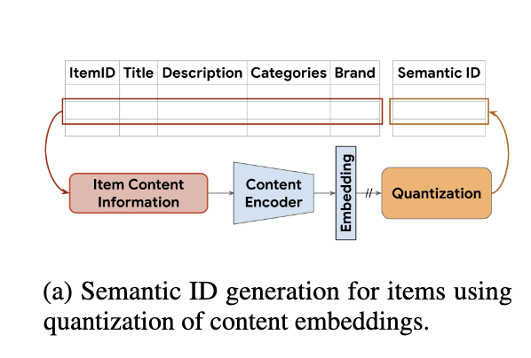
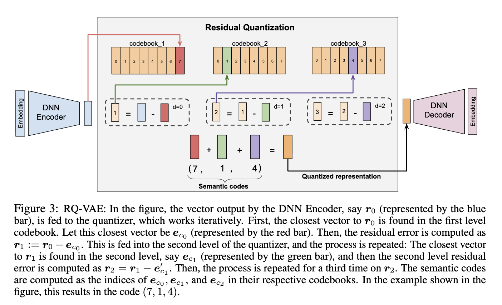
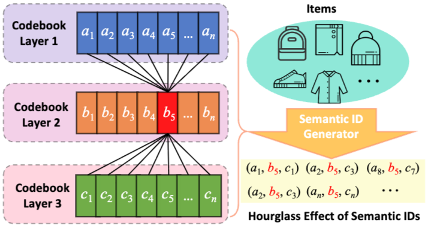

# Vector Quantizations
VQ is a classical quantization technique from signal processing that allows the modeling of probability density functions by the distribution of prototype vectors.  
It works by dividing a large set of points (vectors) into groups having approximately the same number of points closest to them. Each group is represented by its centroid point, as in k-means and some other clustering algorithms. In simpler terms, vector quantization chooses a set of points to represent a larger set of points.

## Semantic ID
Semantic IDs are compact, discrete, learnable “codes” that are representation of an item that captures its semantic meaning (style, category, attributes) rather than raw item identity. Think of it as a compressed code that describes what the item is.

Semantic ID is a tuple of codewords of length $m$. Each codeword in the tuple comes from a different codebook. Therefore, the number of items that the Semantic IDs can represent uniquely is equal to the product of the codebook sizes.

For example, an item with Semantic ID (10, 21, 35) should
be more similar to one with Semantic ID (10, 21, 40), than an item with ID (10, 23, 32). 

## Codebook
A codebook in vector quantization (VQ) is simply a small set of learnable vectors (called codes or tokens) that the model chooses from to represent a larger vector.
$$
C = {c_1, c_2, \dots, c_K}
$$
Simply speaking, codebook is a finite collection of learnable vectors from which the model picks the closest vector to represent (quantize) the input.

## Semantic ID Generation
  

Assume that each item has associated content features that capture useful semantic information (e.g. titles or descriptions or images). Moreover, assume that we have access to a pre-trained content encoder to generate a semantic embedding $x$.  
For example, general-purpose
pre-trained text encoders such as Sentence-T5 and BERT can be used to convert an item’s text features to obtain a semantic embedding. The semantic embeddings are then quantized to generate a semantic ID for each item.

### VAE
https://arxiv.org/pdf/1312.6114

### VQ-VAE
https://arxiv.org/pdf/1711.00937

### RQ-VAE 
  

Residual-Quantized Variational AutoEncoder (RQ-VAE) is a multi-level vector quantizer that applies quantization on residuals to generate a tuple of codewords(aka Semantic IDs).  
The Autoencoder is jointly trained by updating the quantization codebook and the DNN encoder-decoder parameters.

To prevent RQ-VAE from a codebook collapse, where most of the input gets mapped to only a few codebook vectors, we use k-means clustering-based initialization for the codebook. Specifically, we apply the k-means algorithm on the first training batch and use the
centroids as initialization.

#### Hourglass Phenomenon
   

The codebook tokens in the intermediate layers are excessively concentrated, leading to a one-to-many and many-to-one mapping structure. This concentration results in path sparsity, where
the matching paths for the item constitute a minimal fraction of the total path space and a long-tail distribution of intermediate layer tokens with a majority of SID concentrated in a few head token.

For example, let's consider 3-layered codebook tokens.
| Layer         | Dominant Force                            | Effect |
| ------------- | ----------------------------------------- | ------ |
| Layer 1       | High magnitude + high direction diversity | WIDE   |
| Middle layers | Magnitude shrinking (dominant)            | NARROW |
| Final layers  | Directional diversity (dominant)          | WIDE   |

 layer 1 is wide because there are many coarse token at the first place. then, the layer 2 is narrow because you subtract the item from the closet token from the layer 1. so there are little variety. But as go deeper in the layer, you subtract over and over then make the embedding small in magnitude but vary in direction.

 Reference: https://arxiv.org/pdf/2407.21488

### Learning of VQ-VAE and RQ-VAE
- Codebook learning: K-means + EMA
- Encoder+decoder learning: normal neural network backprop

https://arxiv.org/pdf/2203.01941

### RQ-KMeans
https://arxiv.org/pdf/2411.11739