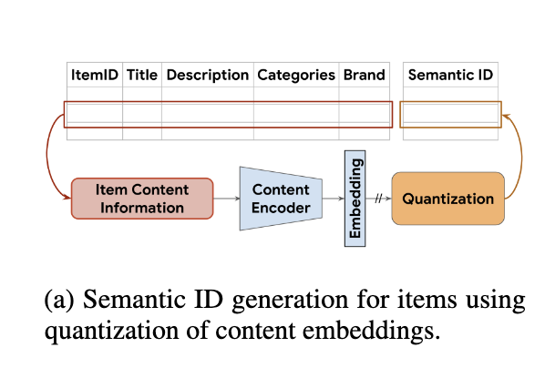
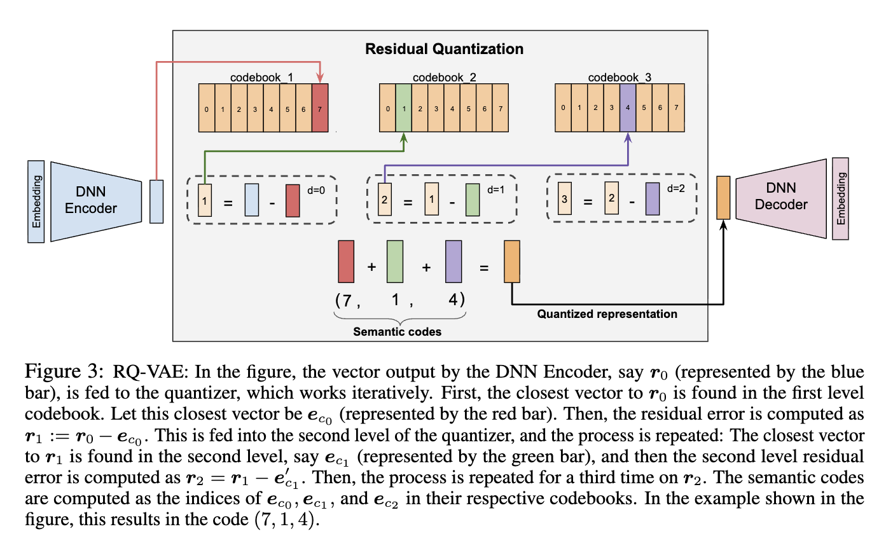
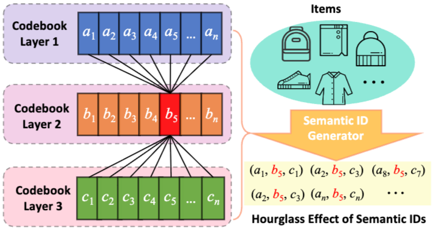

# Vector Quantizations
VQ is a classical quantization technique from signal processing that allows the modeling of probability density functions by the distribution of prototype vectors.  
It works by dividing a large set of points (vectors) into groups having approximately the same number of points closest to them. Each group is represented by its centroid point, as in k-means and some other clustering algorithms. In simpler terms, vector quantization chooses a set of points to represent a larger set of points.
방대한 데이터 포인트(벡터)들을 대표할 수 있는 소수의 대표 포인트(센트로이드)들로 바꾸어 표현하는 기술입니다.  
고차원 공간에 있는 수많은 데이터 포인트들을 거리가 가까운 것끼리 묶어 그룹을 만듭니다. 그리고 각 그룹을 가장 중심에 있는 하나의 대표 벡터(Centroid)로 대치합니다. K-평균(K-means) 알고리즘과 유사한 방식입니다.

## Semantic ID
Semantic IDs are compact, discrete, learnable “codes” that are representation of an item that captures its semantic meaning (style, category, attributes) rather than raw item identity. Think of it as a compressed code that describes what the item is.

Semantic ID is a tuple of codewords of length $m$. Each codeword in the tuple comes from a different codebook. Therefore, the number of items that the Semantic IDs can represent uniquely is equal to the product of the codebook sizes.

For example, an item with Semantic ID (10, 21, 35) should
be more similar to one with Semantic ID (10, 21, 40), than an item with ID (10, 23, 32). 

## Codebook
A codebook in vector quantization (VQ) is simply a small set of learnable vectors (called codes or tokens) that the model chooses from to represent a larger vector.
$$
C = {c_1, c_2, \dots, c_K}
$$
Simply speaking, codebook is a finite collection of learnable vectors from which the model picks the closest vector to represent (quantize) the input.

코드북은 데이터들을 대표할 수 있는 소수의 대표 벡터(Centroid 또는 Codeword)들을 모아놓은 집합체입니다.
- 코드워드(Codeword): 코드북을 구성하는 하나하나의 대표 벡터입니다.
- 인덱스(Index): 각 코드워드에 부여된 고유 번호(주소 값)입니다.

코드북의 사용 과정은 크게 [학습 ➔ 인코딩(압축) ➔ 디코딩(복원)]의 3단계로 나뉩니다.

<b> 1. 코드북 생성 및 학습 (Training) </b>  
먼저 입력될 데이터들의 분포를 분석하여 가장 효율적인 대표 벡터(코드워드)들을 찾아내야 합니다. k-means(K-평균)나 LBG 알고리즘 같은 군집화 알고리즘을 사용합니다.  
전체 데이터 공간을 여러 영역으로 쪼갠 뒤, 각 영역의 중심점(Centroid)들을 뽑아내어 이를 코드북에 등록합니다. 데이터가 자주 발생하는 영역에는 대표 벡터를 촘촘하게 배치하고, 드물게 발생하는 영역에는 성기게 배치하여 오차를 최소화합니다.

<b> 2. 인코딩 (Encoding / 데이터 압축) </b>  
실제 데이터를 전송하거나 저장할 때 코드북을 활용해 용량을 획기적으로 줄입니다. 입력 벡터(원본 데이터)가 들어오면, 코드북에 있는 대표 벡터들과 하나씩 거리를 비교합니다. 그중 가장 유사한(거리가 가장 가까운) 대표 벡터를 찾습니다. 그리고 원본 데이터의 거대한 수치들을 그대로 보내는 것이 아니라, 찾아낸 대표 벡터의 '인덱스(번호)'만 저장하거나 전송합니다. 가령 $[0.25, 0.81, -0.12, 0.94]$라는 복잡한 소수점 벡터를 통째로 보내는 대신, 코드북의 7번 벡터와 가장 비슷하므로 그냥 숫자 7 하나만 기록하는 방식입니다.  

<b> 3. 디코딩 (Decoding / 데이터 복원) </b>  
인덱스(번호)를 받아 다시 원래의 데이터 형태로 되돌리는 과정입니다. 수신 측(혹은 재생 프로그램)도 송신 측과 동일한 코드북을 가지고 있습니다. 가령 압축된 데이터인 인덱스(7)가 들어오면, 코드북에서 7번 번호에 해당하는 대표 벡터를 찾아서 출력합니다. 이때 원본과 완벽히 똑같지는 않지만, 인간의 눈이나 귀로 구별하기 힘들 정도로 유사한 값이 복원됩니다 (손실 압축).

## Semantic ID Generation
  

Assume that each item has associated content features that capture useful semantic information (e.g. titles or descriptions or images). Moreover, assume that we have access to a pre-trained content encoder to generate a semantic embedding $x$.  
For example, general-purpose
pre-trained text encoders such as Sentence-T5 and BERT can be used to convert an item’s text features to obtain a semantic embedding. The semantic embeddings are then quantized to generate a semantic ID for each item.

## AutoEncoder
A system that learns to extract the most important information from the input. Autoencoders are a combination of an encoder and decoder. Autoencoders rely on the following two-step process.

1. The encoder maps the input to a (typically) lossy lower-dimensional (intermediate) format.
2. The decoder builds a lossy version of the original input by mapping the lower-dimensional format to the original higher-dimensional input format.

Autoencoders are trained end-to-end by having the decoder attempt to reconstruct the original input from the encoder's intermediate format as closely as possible. Because the intermediate format is smaller (lower-dimensional) than the original format, the autoencoder is forced to learn what information in the input is essential, and the output won't be perfectly identical to the input.

### Examples of AutoEncoder
- If the input data is a graphic, the non-exact copy would be similar to the original graphic, but somewhat modified. Perhaps the non-exact copy removes noise from the original graphic or fills in some missing pixels.
- If the input data is text, an autoencoder would generate new text that mimics (but is not identical to) the original text.

### Sparse Auto-Encoders(SAE)
#### Introduction
희소 오토인코더는 거대 언어모델 (LLM)이 데이터를 학습해서 만들어내는 표현 (Representation)을 이해할 수 있게 도와주는 도구로 널리 알려져 있는데요. 직접 사람이 손으로 뽑아낸 특징을 사용하는 지도 학습은, 시간도 많이 소요될 뿐 아니라 새로운 문제가 닥쳤을 때 적용이 힘들죠. 반면에, 비지도 신경망의 하나인 희소 오토인코더는 데이터로부터 의미있는 특징들을 자동적으로 뽑아내도록 학습을 합니다.

일반적인 오토인코더와는 조금 다르게, 희소 오토인코더는 입력이 들어왔을 때 ‘소수의 뉴런만이 활성화’되도록 해서, 가장 중요한 패턴을 더 부각시키도록 해 줍니다. 그래서 희소 오토인코더는 ‘Feature Extraction (특징 추출)’, ‘Dimension Reduction (차원 축소)’, ‘Pretraining Deep Networks (심층 네트워크의 사전 훈련)’ 등에 광범위하게 사용되고 있습니다.

#### Algorithm
기존 임베딩을 더 많은 차원의 임베딩으로 보낸뒤 다시 원래 차원의 임베딩으로 복원 하되, 이때 최대한 많은 0을 써서 원래 임베딩을 복원하도록 제약을 걸어서 중요한 피쳐만 남기는 것입니다.
https://web.stanford.edu/class/cs294a/sparseAutoencoder.pdf
https://turingpost.co.kr/p/sparse-autoencoder-12

### Auto-Encoder vs SAE
| 구분 | 일반 오토인코더 (Autoencoder) | 희소 오토인코더 (Sparse Autoencoder) |
| :--- | :--- | :--- |
| **핵심 목적** | 차원 축소 및 본질적 특징 압축 | 더 고차원적이면서도 뚜렷한(해석 가능한) 특징 추출 |
| **은닉층 크기** | 주로 입력층보다 작음 (Undercomplete) | 입력층보다 커도 상관없음 (Overcomplete 가능) |
| **제약 조건** | 은닉층의 **뉴런 개수**를 제한하여 압축 | 뉴런 개수가 많아도 **동시 활성화율**을 제한 |
| **손실 함수** | 복원 오차 (Reconstruction Error) | 복원 오차 + **희소성 패널티 (Sparsity Penalty)** |
| **특징 결과물** | 밀집된 표현 (Dense Representation) | 희소한 표현 (Sparse Representation) |

### Variational autoencoder (VAE)
A type of autoencoder that leverages the discrepancy between inputs and outputs to generate modified versions of the inputs. Variational autoencoders are useful for generative AI.

VAEs are based on variational inference: a technique for estimating the parameters of a probability model.
https://arxiv.org/pdf/1312.6114
https://mbernste.github.io/posts/vae/

### VQ-VAE
https://arxiv.org/pdf/1711.00937

### RQ-VAE 
  

Residual-Quantized Variational AutoEncoder (RQ-VAE) is a multi-level vector quantizer that applies quantization on residuals to generate a tuple of codewords(aka Semantic IDs).  
The Autoencoder is jointly trained by updating the quantization codebook and the DNN encoder-decoder parameters.

To prevent RQ-VAE from a codebook collapse, where most of the input gets mapped to only a few codebook vectors, we use k-means clustering-based initialization for the codebook. Specifically, we apply the k-means algorithm on the first training batch and use the
centroids as initialization.

#### Hourglass Phenomenon
   

The codebook tokens in the intermediate layers are excessively concentrated, leading to a one-to-many and many-to-one mapping structure. This concentration results in path sparsity, where
the matching paths for the item constitute a minimal fraction of the total path space and a long-tail distribution of intermediate layer tokens with a majority of SID concentrated in a few head token.

For example, let's consider 3-layered codebook tokens.
| Layer         | Dominant Force                            | Effect |
| ------------- | ----------------------------------------- | ------ |
| Layer 1       | High magnitude + high direction diversity | WIDE   |
| Middle layers | Magnitude shrinking (dominant)            | NARROW |
| Final layers  | Directional diversity (dominant)          | WIDE   |

 layer 1 is wide because there are many coarse token at the first place. then, the layer 2 is narrow because you subtract the item from the closet token from the layer 1. so there are little variety. But as go deeper in the layer, you subtract over and over then make the embedding small in magnitude but vary in direction.

 Reference: https://arxiv.org/pdf/2407.21488

### Learning of VQ-VAE and RQ-VAE
- Codebook learning: K-means + EMA
- Encoder+decoder learning: normal neural network backprop

### RQ-KMeans
https://arxiv.org/pdf/2411.11739

## RQ,PQ,VQ
- VQ: https://scispace.com/papers/vector-quantization-2q8u54zz2s
- PQ: https://inria.hal.science/inria-00514462v2/document
- RQ(RQ-VAE): https://arxiv.org/abs/2203.01941

## TurboQuant
https://research.google/blog/turboquant-redefining-ai-efficiency-with-extreme-compression/?utm_source=twitter&utm_medium=social&utm_campaign=social_post&utm_content=gr-acct
https://arxiv.org/pdf/2504.19874