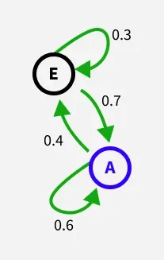
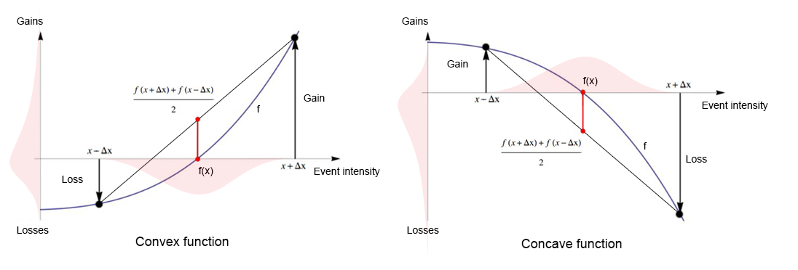
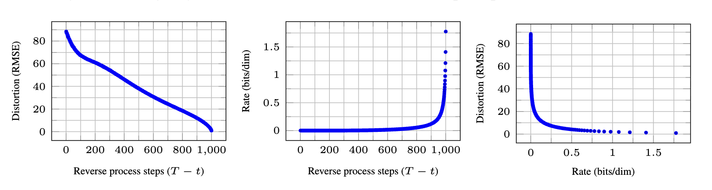
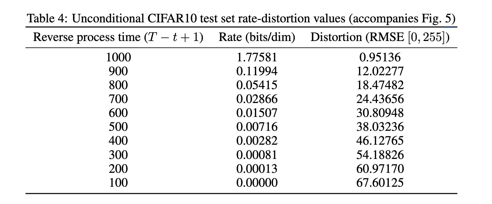
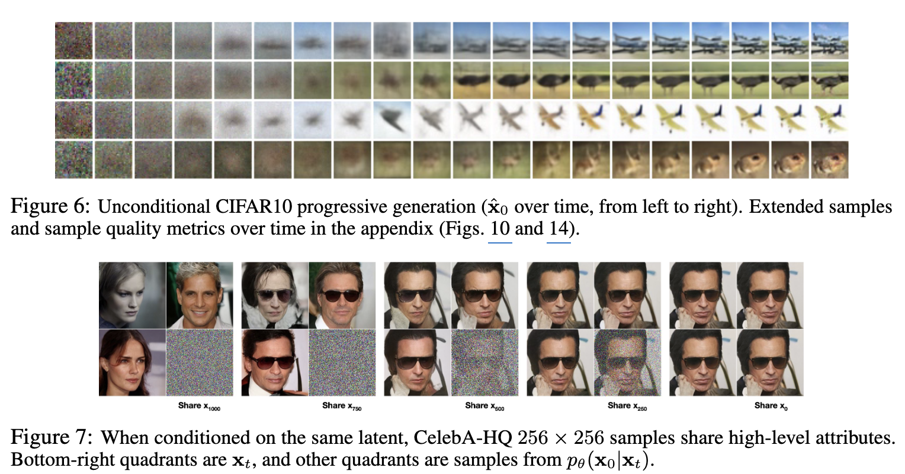

# Diffusion Model
## Deep Unsupervised Learning using Nonequilibrium Thermodynamics
https://arxiv.org/pdf/1503.03585

## Denoising Diffusion Probabilistic Models
https://arxiv.org/abs/2006.11239

### Preliminary
#### Latent variable model
Latent, or “hidden,” variable modeling is a statistical method that studies hidden concepts by analyzing measurable indicators that reflect them. To estimate these hidden constructs, researchers begin with observable data, like test scores or behaviors, and use them to make inferences about underlying concepts, including academic ability, mental health, or customer satisfaction. 

A latent variable model is a statistical model that relates a set of observable variables (also called manifest variables or indicators) to a set of latent variables. It is assumed that the responses on the indicators or manifest variables are the result of an individual's position on the latent variable(s), and that the manifest variables have nothing in common after controlling for the latent variable (local independence).

Different types of latent variable models can be grouped according to whether the manifest and latent variables are categorical or continuous.

| **Manifest Variables (관측변수)** | **Latent Variables: Continuous (연속형)** | **Latent Variables: Categorical (범주형)** |
| ----------------------------- | -------------------------------------- | --------------------------------------- |
| **Continuous (연속형)**          | Factor Analysis (요인분석)                 | Item Response Theory (문항반응이론)           |
| **Categorical (범주형)**         | Latent Profile Analysis (잠재프로파일분석)     | Latent Class Analysis (잠재계층분석)          |

#### Markov Chain
A Markov chain is a way to describe a system that moves between different situations called "states", where the chain assumes the probability of being in a particular state at the next step depends solely on the current state. 

For example, let's consider two-state Markov chain below.  
     

If in state A:
- Stays in A: probability 0.6
- Moves to E: probability 0.4  

If in state E:
- Moves to A: probability 0.7
- Stays in E: probability 0.3

Also note that a Markov chain can be illustrated as a directed graph, where nodes represent the states (A, E), arrows indicate possible transitions and the numbers on arrows show transition probabilities.

#### Kullback–Leibler Divergence (KL-Divergence)
$$
{\displaystyle D_{\text{KL}}(P\parallel Q)=\sum _{x\in {\mathcal {X}}}P(x)\ \log \left({\frac {\ P(x)\ }{Q(x)}}\right)} = \mathbb{E}_{x \sim P} \left[ \log \frac{P(x)}{Q(x)} \right]
$$

#### Jensen's Inequality

Jensen's inequality generalizes the statement that the secant line(a line that intersects a curve at a minimum of two distinct points) of a convex function lies above the graph of the function. In the context of probability theory, it is generally stated in the following form:  
If $X$ is a random variable and $\varphi$ is a convex function, then
$$
\varphi(\mathbb{E}[X]) \leq \mathbb{E}[\varphi(X)]
$$
If $\varphi$ is concave function, then
$$
\varphi(\mathbb{E}[X]) \geq \mathbb{E}[\varphi(X)]
$$

#### Reparameterization Trick
https://en.wikipedia.org/wiki/Reparameterization_trick
https://www.geeksforgeeks.org/deep-learning/reparameterization-trick/

For some common distributions, the reparameterization trick takes specific forms
Normal distribution: For $z\sim {\mathcal {N}}(\mu ,\sigma ^{2})$ we can use,
$$
z=\mu +\sigma \epsilon ,\quad \epsilon \sim {\mathcal {N}}(0,1)
$$

#### LangeLangevin dynamics  

### Mathematical Background of Diffusion Model
확산 모델(Diffusion Models)의 수학적 기초를 설명합니다. 확산 모델은 Latent variable model로 아래의 적분 형태로 나타낼 수 있습니다.
$$p_\theta(x_0) := \int p_\theta(x_{0:T}) dx_{1:T}$$
- $x_0$: 우리가 실제로 관찰하는 데이터(예: 이미지)입니다.
- $x_1, \dots, x_T$: "잠재 변수(Latents)"라고 불리며, 데이터가 생성되는 과정 중에 존재하는 중간 단계들을 의미합니다.
- $p_\theta(x_0)$: 모델이 최종적으로 생성해낸 데이터 $x_0$의 확률 분포입니다. 이 분포가 실제 데이터 분포인 $q(x_0)$와 최대한 일치하도록 만드는 것이 모델의 목표입니다.

이 수식을 적분으로 나타낼 수 있는 이유는 아래 2가지 입니다.
1. 결합 확률 분포($p_\theta(x_{0:T})$): 모델은 노이즈($x_T$)부터 시작해 여러 단계($x_{T-1}, \dots, x_1$)를 거쳐 데이터($x_0$)를 생성하는 전체 경로에 대한 확률을 가집니다. 이를 Reverse Process이라고 부릅니다.
2. 주변 확률 계산: 우리가 보고 싶은 것은 오직 최종 결과물인 $x_0$뿐입니다. 따라서 모든 가능한 중간 경로들($x_{1:T}$)에 대해 확률을 다 더해주는(연속 변수이므로 적분하는) 과정을 통해 $x_0$만이 나타날 확률을 구하는 것입니다.

확산 모델은 데이터를 생성하는 Reverse Process과 데이터를 파괴하는 Forward Process로 이루어져 있습니다.

#### Reverse Process
완전한 노이즈($x_T$)에서 시작하여, 신경망($\theta$)이 예측하는 가우시안 분포를 따라 한 단계씩($T \rightarrow T-1 \rightarrow \dots \rightarrow 0$) 노이즈를 걷어내면(Denoising), 최종적으로 실제 데이터($x_0$)를 얻을 수 있다는 과정을 수학적으로 정리합니다.

$$
p_\theta(\mathbf{x}_{0:T}) := p(\mathbf{x}_T) \prod_{t=1}^{T} p_\theta(\mathbf{x}_{t-1}|\mathbf{x}_t) \\[5pt]
p(\mathbf{x}_T) = \mathcal{N}(\mathbf{x}_T; \mathbf{0}, \mathbf{I}), \quad 
p_\theta(\mathbf{x}_{t-1}|\mathbf{x}_t) := \mathcal{N}(\mathbf{x}_{t-1}; \mu_\theta(\mathbf{x}_t, t), \Sigma_\theta(\mathbf{x}_t, t))
$$

- $p_\theta(\mathbf{x}_{0:T})$: 이 모델이 생성하는 전체 경로($x_0, x_1, \dots, x_T$)에 대한 결합 확률 분포(Joint Distribution).
- $\theta$ (아래 첨자): 딥러닝 모델(신경망)의 학습 가능한 Parameters 를 나타냅니다. 즉, 이 분포는 고정된 것이 아니라 데이터를 통해 학습되는 것임을 의미.
- $p(\mathbf{x}_T)$: Reverse Process의 시작점인 Prior Distribution 입니다. 아무런 정보가 없는 완전한 노이즈 상태의 가우시안 분포입니다.
- $\prod_{t=1}^{T} p_\theta(\mathbf{x}_{t-1}|\mathbf{x}_t)$: $t=1$부터 $T$까지의 모든 단계에 대한 확률을 다 곱한다는 의미입니다. 이는 과정이 Markov Chain임을 나타내며, 현재 단계($x_t$)는 바로 다음 단계($x_{t-1}$)에만 영향을 줍니다.
- $p_\theta(\mathbf{x}_{t-1}|\mathbf{x}_t)$: Reverse Process Transition으로 노이즈가 더 많은 상태인 $\mathbf{x}_t$가 주어졌을 때, 노이즈가 조금 제거된 이전 상태인 $\mathbf{x}_{t-1}$이 어떠할지를 예측하는 확률 모델입니다.
- $\mathcal{N}(\mathbf{x}_{t-1}; \mu_\theta(\mathbf{x}_t, t), \Sigma_\theta(\mathbf{x}_t, t))$: 다음 단계를 현재 단계의 평균과 분산 기반의 가우시안 분포로 예측

#### Forward Process
순방향 과정(Forward Process) 또는 확산 과정(Diffusion Process)을 정의합니다.  
이 과정은 데이터($\mathbf{x}_0$)에서 시작하여, 미리 정해진 스케줄($\beta_t$)에 따라 아주 조금씩 가우시안 노이즈를 섞어가는 과정을 통해 데이터의 정보를 파괴해 나가는 과정입니다. 이 과정을 $T$번(예: 1000번) 반복하면, 원래 데이터의 형체는 완전히 사라지고 표준 가우시안 노이즈($\mathbf{x}_T \approx \mathcal{N}(\mathbf{0}, \mathbf{I})$)에 가까운 상태가 됩니다.

$$
q(\mathbf{x}_{1:T} | \mathbf{x}_0) := \prod_{t=1}^{T} q(\mathbf{x}_t | \mathbf{x}_{t-1}), \quad q(\mathbf{x}_t | \mathbf{x}_{t-1}) := \mathcal{N}(\mathbf{x}_t; \sqrt{1 - \beta_t} \mathbf{x}_{t-1}, \beta_t \mathbf{I})
$$

- $q(\mathbf{x}_{1:T} | \mathbf{x}_0)$: 실제 데이터 $\mathbf{x}_0$가 주어졌을 때, 시점 $1$부터 $T$까지 생성되는 모든 중간 단계들의 조건부 결합 확률 분포(Joint Distribution)입니다. 단, 역과정($p_\theta$)과 달리, 고정된 과정으로 신경망이 학습하는 대상이 아니라 미리 정해진 규칙에 따라 노이즈를 더하는 과정입니다.
- $\prod_{t=1}^{T} q(\mathbf{x}_t | \mathbf{x}_{t-1})$: $t=1$부터 $T$까지의 모든 단계에 대한 확률을 다 곱한다는 의미입니다. 이는 과정이 Markov Chain임을 나타내며, 현재 단계($x_t$)는 바로 다음 단계($x_{t-1}$)에만 영향을 줍니다.
- $\mathcal{N}(\dots)$: 각 단계에서 추가되는 노이즈가 가우시안 분포를 따른다는 것을 의미합니다.
- $\sqrt{1 - \beta_t} \mathbf{x}_{t-1}$: 가우시안 분포의 평균은 이전 단계의 데이터에 $\sqrt{1 - \beta_t}$를 곱하여 크기를 약간 줄입니다. 왜냐하면 단순히 노이즈를 더하기만 하면 데이터의 전체 분산이 계속 커지기 때문입니다. 이 스케일링 인자를 통해 노이즈를 더한 후에도  전체 데이터의 분산(Sclae)이 일정하게 유지되도록 조절합니다.
- $\beta_t \mathbf{I}$: 각 시점 $t$에서 추가되는 노이즈의 양입니다.
- $\beta_1, \dots, \beta_T$: 분산 스케줄(Variance Schedule)로  소스의 실험에서는 $10^{-4}$에서 $0.02$까지 선형적으로 증가하는 값을 사용했습니다.
- $\mathbf{I}$: 항등 행렬로, 모든 차원에 독립적으로 동일한 양의 노이즈가 추가됨을 의미합니다.

참고로 순방향 과정(Forward Process)의 중간 단계($\mathbf{x}_1, \dots, \mathbf{x}_{t-1}$)를 일일이 거치지 않고도, 원본 데이터 $\mathbf{x}_0$에서 임의의 시점 $t$의 노이즈 상태인 $\mathbf{x}_t$를 즉시 추출(Sampling)할 수 있습니다. 
$$
q(\mathbf{x}_t | \mathbf{x}_0) = \mathcal{N}(\mathbf{x}_t; \sqrt{\bar{\alpha}_t}\mathbf{x}_0, (1 - \bar{\alpha}_t)\mathbf{I})
$$
- $\alpha_t := 1 - \beta_t$: 현재 단계에서 보존되는 원본 신호의 비율을 의미합니다.
- $\bar{\alpha}_t := \prod_{s=1}^t \alpha_s$: 1단계부터 $t$단계까지 모든 $\alpha$를 곱한 값.

#### Objective Function and Variational Bound
$$
\mathbb{E}[-\log p_\theta(\mathbf{x}_0)] \leq \mathbb{E}_q\left[-\log \frac{p_\theta(\mathbf{x}_{0:T})}{q(\mathbf{x}_{1:T}|\mathbf{x}_0)}\right] = \mathbb{E}_q\left[-\log p(\mathbf{x}_T) - \sum_{t \geq 1} \log \frac{p_\theta(\mathbf{x}_{t-1}|\mathbf{x}_t)}{q(\mathbf{x}_t|\mathbf{x}_{t-1})}\right] =: L
$$
모델이 실제 데이터의 분포를 얼마나 잘 따르는지(Objective) 를 Variational Bound을 통해 나타냅니다.   

<b> Objective Function </b>  
모델이 생성한 데이터($x_0$)의 확률 분포가 실제 데이터 분포와 얼마나 일치하는지를 나타내는 지표로, 우리는 모델이 실제 데이터를 생성할 확률 $p_\theta(\mathbf{x}_0)$ 을 최대화하기를 원합니다. 다만 계산의 편의를 위해 로그를 취하고 부호를 바꾼 NLL 를 최소화하는 방향으로 학습을 진행합니다.  

$$
\mathbb{E}[-\log p_\theta(\mathbf{x}_0)]
$$
- $p_\theta(\mathbf{x}_0)$: 학습된 매개변수 $\theta$를 가진 모델이 실제 데이터 $\mathbf{x}_0$를 생성할 우도(Likelihood)을 의미. 

생성 모델의 근본적인 목적은 모델이 만들어내는 데이터의 분포를 실제 데이터의 분포($q(\mathbf{x}_0)$)와 일치시키는 것입니다. 따라서 모델이 실제 존재하는 이미지($\mathbf{x}_0$)에 대해 높은 확률($p_\theta$)을 부여한다는 것은, 모델이 그 데이터의 특성과 패턴을 잘 파악했다는 뜻입니다. 그러므로 $p_\theta(\mathbf{x}_0)$를 최대화하도록 학습된 모델은 나중에 새로운 샘플을 생성할 때, 실제 데이터와 통계적으로 유사한(즉, 고품질의) 이미지를 생성할 가능성이 높아집니다.

<b> Variational Bound </b>  
실제 데이터의 확률 $p_\theta(\mathbf{x}_0)$를 직접 계산하려면 모든 중간 단계($\mathbf{x}_{1:T}$)에 대해 적분을 해야 하므로 계산이 거의 불가능하다고 합니다. 따라서 계산이 가능한 Upper Bound을 구하여 이를 최소화 하는 방법을 사용합니다.  
아래 Upper Bound 수식은 순방향 전이($q$)와 역방향 전이($p_\theta$)의 비율에 로그를 취해 모두 더한 것으로 각 단계에서 노이즈를 얼마나 잘 복원하고 있는지 개별적인 손실(loss)들을 모두 합친 것입니다.

$$
\mathbb{E}_q\left[-\log \frac{p_\theta(\mathbf{x}_{0:T})}{q(\mathbf{x}_{1:T}|\mathbf{x}_0)}\right]$$
- $q(\mathbf{x}_{1:T}|\mathbf{x}_0)$: 순방향 과정으로 데이터에서 노이즈로 가는 고정된 경로입니다.
- $p_\theta(\mathbf{x}_{0:T})$: 역과정(생성 과정)으로 노이즈에서 데이터로 오는 학습 가능한 경로입니다.

이를 확장하면 아래와 같이 펼칠 수 있습니다.
$$
\frac{p_\theta(\mathbf{x}_{0:T})}{q(\mathbf{x}_{1:T}|\mathbf{x}_0)} = \frac{p(\mathbf{x}_T) \prod_{t=1}^T p_\theta(\mathbf{x}_{t-1}|\mathbf{x}_t)}{\prod_{t=1}^T q(\mathbf{x}_t|\mathbf{x}_{t-1})} = \mathbb{E}_q\left[-\log p(\mathbf{x}_T) - \sum_{t \geq 1} \log \frac{p_\theta(\mathbf{x}_{t-1}|\mathbf{x}_t)}{q(\mathbf{x}_t|\mathbf{x}_{t-1})}\right]
$$

- $\log p(\mathbf{x}_T)$: 순방향 과정의 끝인 $\mathbf{x}_T$가 우리가 가정한 사전 분포(표준 가우시안 노이즈) $p(\mathbf{x}_T)$와 얼마나 유사한지를 측정합니다.
- $\sum_{t \geq 1} \log \frac{p_\theta(\mathbf{x}_{t-1}|\mathbf{x}_t)}{q(\mathbf{x}_t|\mathbf{x}_{t-1})}$: 각 시점 $t$에서 노이즈를 더하고 복구한 것의 차이를 나타냅니다.

모델이 매 단계마다 순방향 과정에서 추가된 노이즈를 얼마나 정확하게 역으로 되돌리는 지를 평가합니다. 
 
<b> $L$ </b>  
이 모든 계산 결과를 $L$이라는 기호로 정의하며, 딥러닝 모델은 이 $L$ 값을 줄이는 방향으로 경사 하강법(Gradient Descent)을 통해 학습합니다.  
요약하면 "복잡한 데이터의 확률 분포를 직접 계산하는 대신, 노이즈 추가 과정($q$)과 노이즈 제거 과정($p_\theta$)을 매 단계 비*하여 그 차이를 최소화함으로써 모델을 학습시키겠다"는 수학적 선언입니다.

<b> Additional: 어떻게 Upper Bound가 성립하는가? </b>  
고정된 순방향 과정(Forward Process)인 $q(x_{1:T}|x_0)$를 식에 인위적으로 넣은 후 로그함수를 취해 로그 함수는 Concave Function 이므로, Jensen's Inequality 에 의해 "기댓값의 로그는 로그의 기댓값보다 크거나 같다"는 원리가 성립함을 이용합니다.
$$
p_\theta(x_0) = \int p_\theta(x_{0:T}) dx_{1:T} = \int q(x_{1:T}|x_0) \frac{p_\theta(x_{0:T})}{q(x_{1:T}|x_0)} dx_{1:T} = \mathbb{E}_q \left[ \frac{p_\theta(x_{0:T})}{q(x_{1:T}|x_0)} \right], \\[5pt]
\log p_\theta(x_0) = \log \mathbb{E}_q \left[ \frac{p_\theta(x_{0:T})}{q(x_{1:T}|x_0)} \right] \geq \mathbb{E}_q \left[ \log \frac{p_\theta(x_{0:T})}{q(x_{1:T}|x_0)} \right]
$$

<b> 재구성 </b>  
모델($p_\theta$)이 비교해야 할 대상을 "알 수 없는 전이($q(x_t|x_{t-1})$)"에서 "수학적으로 계산 가능한 Posterior Distribution ($q(x_{t-1}|x_t, x_0)$)"로 바꾸기 위한 수학적 절차입니다.

먼저 합계 기호($\sum_{t \geq 1}$)에서 첫 번째 단계인 $t=1$ 항을 밖으로 꺼내어 별도로 표시합니다.
$$L = \mathbb{E}_q\left[-\log p(\mathbf{x}_T) - \sum_{t \geq 1} \log \frac{p_\theta(\mathbf{x}_{t-1}|\mathbf{x}_t)}{q(\mathbf{x}_t|\mathbf{x}_{t-1})}\right] = \mathbb{E}_q \left[ -\log p(x_T) - \sum_{t>1} \log \frac{p_\theta(x_{t-1}|x_t)}{q(x_t|x_{t-1})} - \log \frac{p_\theta(x_0|x_1)}{q(x_1|x_0)} \right]$$

다음은 Forward Process $q(x_t|x_{t-1})$ 를 Bayes' Rule를 이용해 Posterior 형태로 바꿉니다.  
베이즈 정리에 의해 다음과 같은 관계가 성립합니다. 마르코프 체인에서는 현재 상태($x_t$)가 직전 상태($x_{t-1}$)에만 의존하며, 그보다 더 과거인 $x_0$ 에는 영향을 받지 않습니다. 따라서 $q(\mathbf{x}_t | \mathbf{x}_{t-1}, \mathbf{x}_0)= q(\mathbf{x}_t | \mathbf{x}_{t-1})$ 입니다. 

$$q(x_t | x_{t-1}, \mathbf{x}_0) = q(x_t|x_{t-1}) = \frac{q(x_{t-1}|x_t, x_0) q(x_t|x_0)}{q(x_{t-1}|x_0)}$$

이를 위 식의 분모에 있는 $q(x_t|x_{t-1})$ 자리에 위 식을 대입하면 아래와 같습니다.
$$
\mathbb{E}_q \left[ -\log p(x_T) - \sum_{t>1} \log \frac{p_\theta(x_{t-1}|x_t)}{q(x_{t-1}|x_t, x_0) \cdot \frac{q(x_t|x_0)}{q(x_{t-1}|x_0)}} - \log \frac{p_\theta(x_0|x_1)}{q(x_1|x_0)} \right] \\[5pt]
= \mathbb{E}_q \left[ - \log p(\mathbf{x}_T) - \sum_{t>1} \log \frac{p_\theta(\mathbf{x}_{t-1}|\mathbf{x}_t)}{q(\mathbf{x}_{t-1}|\mathbf{x}_t, \mathbf{x}_0)} \cdot \frac{q(\mathbf{x}_{t-1}|\mathbf{x}_0)}{q(\mathbf{x}_t|\mathbf{x}_0)} - \log \frac{p_\theta(\mathbf{x}_0|\mathbf{x}_1)}{q(\mathbf{x}_1|\mathbf{x}_0)} \right]
$$

위 수식의 $\frac{q(x_{t-1}|x_0)}{q(x_t|x_0)}$ 부분을 로그 밖으로 꺼내어 전개하면 대부분의 항이 서로 지워지는 Telescoping sum현상이 발생합니다. 
$$
-\sum_{t=2}^T \log \frac{q(x_{t-1}|x_0)}{q(x_t|x_0)} = -\log \frac{q(x_{T-1}|x_0)}{q(x_T|x_0)} - \log \frac{q(x_{T-2}|x_0)}{q(x_{T-1}|x_0)} - \dots - \log \frac{q(x_1|x_0)}{q(x_2|x_0)} \\[5pt] 
= \log q(x_T|x_0) - \log q(x_1|x_0)
$$

$-\log q(x_1|x_0)$와 $\log q(x_1|x_0)$는 서로 지워지고, 아래와 같이 정리됩니다.
$$L = \mathbb{E}_q \left[ -\log \frac{p(x_T)}{q(x_T|x_0)} - \sum_{t>1} \log \frac{p_\theta(x_{t-1}|x_t)}{q(x_{t-1}|x_t, x_0)} - \log p_\theta(x_0|x_1) \right]$$

마지막으로 $-\log \frac{A}{B} = \log \frac{B}{A}$라는 성질을 이용하여 각 항을 두 확률 분포 간의 거리를 나타내는 KL Divergence 기호로 바꿉니다.
$$
L = \mathbb{E}_q \left[ -\log \frac{p(x_T)}{q(x_T|x_0)} - \sum_{t>1} \log \frac{p_\theta(x_{t-1}|x_t)}{q(x_{t-1}|x_t, x_0)} - \log p_\theta(x_0|x_1) \right] \\[5pt]
= \mathbb{E}_q [ L_T + \sum_{t>1} L_{t-1} + L_0 ]
$$

- $L_T$ 항: $\mathbb{E}_q [-\log \frac{p(x_T)}{q(x_T|x_0)}] = \mathbb{E}_q [\log \frac{q(x_T|x_0)}{p(x_T)}] = D_{KL}(q(x_T|x_0) \parallel p(x_T))$
- $L_{t-1}$ 항: $-\sum \log \frac{p_\theta}{q} = \sum \log \frac{q}{p_\theta} = \sum D_{KL}(q(x_{t-1}|x_t, x_0) \parallel p_\theta(x_{t-1}|x_t))$
- $L_0$ 항: $- \log p_\theta(x_0|x_1)$

#### Posterior Distribution $q(x_{t-1}|x_t, x_0)$
수학적으로 계산 가능한 Posterior Distribution ($q(x_{t-1}|x_t, x_0)$) 은 앞선 수식을 이용해 가우시안 분포 간를 따른다는 걸 도출 할 수 있습니다. 이는 앞선 가우시안 분포를 따르는 Forward Process 의 수식 2개와, Bayes' Rule, 그리고 가우시안 분포끼리의 곱셈과 나눗셈 결과는 다시 가우시안 분포가 되는 성질을 이용한 것입니다. 

##### 1. 베이즈 정리의 적용
원본 데이터 $x_0$와 현재 상태 $x_t$가 주어졌을 때 이전 단계 $x_{t-1}$의 확률을 구하기 위해 다음과 같이 베이즈 정리를 사용합니다.
$$q(\mathbf{x}_{t-1} | \mathbf{x}_t, \mathbf{x}_0) = \frac{q(\mathbf{x}_t | \mathbf{x}_{t-1}, \mathbf{x}_0) q(\mathbf{x}_{t-1} | \mathbf{x}_0)}{q(\mathbf{x}_t | \mathbf{x}_0)}$$

##### 2. Forward Process
$$
\quad q(\mathbf{x}_t | \mathbf{x}_{t-1}) := \mathcal{N}(\mathbf{x}_t; \sqrt{1 - \beta_t} \mathbf{x}_{t-1}, \beta_t \mathbf{I})
$$

$$
q(\mathbf{x}_t | \mathbf{x}_0) = \mathcal{N}(\mathbf{x}_t; \sqrt{\bar{\alpha}_t}\mathbf{x}_0, (1 - \bar{\alpha}_t)\mathbf{I})
$$

"1. 베이즈 정리의 적용" 을 구성하는 세 가지 확률 분포는 "2. Forward Process" 에서 정의된 수식 들을 통해 알 수 있습니다.

- $q(\mathbf{x}_t | \mathbf{x}_{t-1}, \mathbf{x}_0)$: 순방향 과정은 마르코프 체인이므로 $x_t$는 오직 $x_{t-1}$에만 의존합니다. 따라서 기존 $\quad q(\mathbf{x}_t | \mathbf{x}_{t-1})$ 와 동일한 $\mathcal{N}(\mathbf{x}_t; \sqrt{1 - \beta_t} \mathbf{x}_{t-1}, \beta_t \mathbf{I})$가 됩니다.
- $q(\mathbf{x}_{t-1} | \mathbf{x}_0)$: $q(\mathbf{x}_t | \mathbf{x}_0)$ 에서 시점만 $t-1$로 바꾼 것으로, $\mathcal{N}(\mathbf{x}_{t-1}; \sqrt{\bar{\alpha}_{t-1}}\mathbf{x}_0, (1 - \bar{\alpha}_{t-1})\mathbf{I})$입니다.
- $q(\mathbf{x}_t | \mathbf{x}_0)$: $q(\mathbf{x}_t | \mathbf{x}_0)$을 그대로 사용합니다.

이 가우시안 분포를 따르는 항들을 곱하고 나누면 결과적으로 $x_{t-1}$에 대한 새로운 가우시안 분포가 만들어집니다.
$$q(\mathbf{x}_{t-1} | \mathbf{x}_t, \mathbf{x}_0) = \mathcal{N}(\mathbf{x}_{t-1}; \tilde{\mu}_t(\mathbf{x}_t, \mathbf{x}_0), \tilde{\beta}_t \mathbf{I})$$

- 평균($\tilde{\mu}_t$): $\frac{\sqrt{\bar{\alpha}_{t-1}}\beta_t}{1 - \bar{\alpha}_t} \mathbf{x}_0 + \frac{\sqrt{\alpha_t}(1 - \bar{\alpha}_{t-1})}{1 - \bar{\alpha}_t} \mathbf{x}_t$
- 분산($\tilde{\beta}_t$): $\frac{1 - \bar{\alpha}_{t-1}}{1 - \bar{\alpha}_t} \beta_t$

정리하면, 이 Posterior Distribution ($q(x_{t-1}|x_t, x_0)$)는 $x_0$와 $x_t$를 알고 있을 때 평균($\tilde{\mu}_t$)과 분산($\tilde{\beta}_t$)이 명확히 정의되는 가우시안 분포 입니다. 따라서 이 Posterior Distribution을 사용하는 식으로 바꾸면, 모델의 예측($p_\theta$)과 정답($q$)이 모두 가우시안 분포가 됩니다. 이를 통해  모든 KL 발산을 고비용의 몬테카를로 추정 대신 닫힌 형태(closed form)의 수식으로 정확하게 계산할 수 있게 됩니다.
다시 말해 원본 데이터 $\mathbf{x}_0$ 가 조건으로 주어지면, 알기 어려웠던 역방향 전이 $q(\mathbf{x}_{t-1}|\mathbf{x}_t, \mathbf{x}_0)$가 명확한 가우시안 분포로 계산 가능하다는 점입니다. 

($q(x_{t-1}|x_t, x_0)$가 가우시안이라는 사실을 밝혀냄으로써, "수만 번 찍어서 맞추는 방식(몬테카를로)" 대신 " 가우시안 분포 공식에 대입해서 바로 답을 구하는 방식(닫힌 형태)"으로 모델을 아주 효율적으로 훈련시킬 수 있게 된 것)

### $L_{t-1}$, $L_T$ and $L_0$
앞선 모델의 훈련을 위한 "Objective Function and Variational Bound"의 수식을 다시 살펴보겠습니다.
$$
\mathbb{E}_q\left[\underbrace{D_{KL}(q(\mathbf{x}_T | \mathbf{x}_0) \| p(\mathbf{x}_T))^{\vphantom{D_{KL}(q(\mathbf{x}_T | \mathbf{x}_0) \| p(\mathbf{x}_T))}}}_{L_T} + \sum_{t>1} \underbrace{D_{KL}(q(\mathbf{x}_{t-1} | \mathbf{x}_t, \mathbf{x}_0) \| p_\theta(\mathbf{x}_{t-1} | \mathbf{x}_t))^{\vphantom{D_{KL}(q(\mathbf{x}_{t-1} | \mathbf{x}_t, \mathbf{x}_0) \| p_\theta(\mathbf{x}_{t-1} | \mathbf{x}_t))}}}_{L_{t-1}} - \underbrace{\log p_\theta(\mathbf{x}_0 | \mathbf{x}_1)^{\vphantom{\log p_\theta(\mathbf{x}_0 | \mathbf{x}_1)}}}_{L_0}\right]
$$

- $L_T$: forward process 의 마지막 단계인 $q(x_T|x_0)$와 모델의 사전 분포(prior)인 $p(x_T)$ 사이의 KL 발산으로 forward process 과정의 분산($\beta_t$)은 고정하기 때문에 $q$에는 학습 가능한 매개변수가 없어서 학습중 무시되는 항입니다.
- $L_{t-1}$: 학습된 reverse process 인 $p_\theta(x_{t-1}|x_t)$를 forward process 의 posterior distribution 인 $q(x_{t-1}|x_t, x_0)$와 직접 비교하는 KL divergence 항으로 모델이 학습해야 할 핵심 부분입니다. 이 항을 통해 모델은 노이즈 섞인 이미지에서 한 단계 이전의 깨끗한 상태로 되돌아가는 방법을 배웁니다.
- $L_0$ : 마지막 reverse process 인 $x_1$ 상태에서 원본 이미지 $x_0$를 복원할 때의 negative log likelihood ($-\log p_\theta(x_0|x_1)$)를 의미합니다.

#### Reverse Process $L_{t-1}$
원래 모델 $\mu_\theta$는 역과정의 평균인 $\tilde{\mu}_t$를 맞추도록 설계하는 것이 가장 직관적입니다. 하지만 저자들은 모델이 입력값 $\mathbf{x}_t$를 알고 있다면실제 주입된 노이즈 $\epsilon$을 예측하는 것만으로도 충분히 평균값을 재구성할 수 있다는 점을 발견했습니다. 이를 통해 식을 복잡한 이론적 손실 함수가 실제 노이즈와 예측 노이즈 사이의 차이를 줄이는 MSE(평균 제곱 오차) 형태로 바뀔 수 있습니다. 그리고 실험 결과(Ablation study), 평균을 직접 예측하는 것보다 노이즈를 예측하도록 모델을 구성하고 단순화된 손실 함수로 학습했을 때 샘플의 품질이 훨씬 뛰어났다고 합니다.

앞서 정의한/도출한 아래 두 수식과 각 수식의 분산을 학습하지 않는 상수로 고정할 경우($\Sigma_\theta= \sigma_t^2\mathbf{I}$),
$$
 p_\theta(\mathbf{x}_{t-1}|\mathbf{x}_t) := \mathcal{N}(\mathbf{x}_{t-1}; \boldsymbol{\mu}_\theta(\mathbf{x}_t, t), \boldsymbol{\Sigma}_\theta(\mathbf{x}_t, t)) \\[5pt]
q(\mathbf{x}_{t-1} | \mathbf{x}_t, \mathbf{x}_0) = \mathcal{N}(\mathbf{x}_{t-1}; \tilde{\mu}_t(\mathbf{x}_t, \mathbf{x}_0), \tilde{\beta}_t \mathbf{I})
$$
KL Divergence 항 $L_{t-1}$ 를 두 분포의 평균의 MSE 형태로 변경할 수 있습니다.
$$
L_{t-1} = \mathbb{E}_q \left[ \frac{1}{2\sigma_t^2} \left\| \tilde{\mu}_t(\mathbf{x}_t, \mathbf{x}_0) - \mu_\theta(\mathbf{x}_t, t) \right\|^2 \right] + C
$$

다시 앞서 소개한 아래 수식에 가우시안 분포 Reparameterization trick 을 적용하면, 아래와 같이 표현할 수 있습니다. 
$$
q(\mathbf{x}_t | \mathbf{x}_0) = \mathcal{N}(\mathbf{x}_t; \sqrt{\bar{\alpha}_t}\mathbf{x}_0, (1 - \bar{\alpha}_t)\mathbf{I}) \\[5pt]
\rightarrow x_t(x_0, \epsilon) = \sqrt{\bar{\alpha}_t}x_0 + \sqrt{1 - \bar{\alpha}_t}\epsilon \quad ( \epsilon \sim \mathcal{N}(0, I))
$$

이 $x_t(x_0, \epsilon)$ 를 위 MSE 수식에 대입한 후 풀면 아래와 같습니다.
$$
\mathbb{E}_{\mathbf{x}_0, \boldsymbol{\epsilon}} \left[ \frac{1}{2\sigma_t^2} \left\| \frac{1}{\sqrt{\alpha_t}} \left( \mathbf{x}_t(\mathbf{x}_0, \boldsymbol{\epsilon}) - \frac{\beta_t}{\sqrt{1 - \bar{\alpha}_t}} \boldsymbol{\epsilon} \right) - \boldsymbol{\mu}_{\theta}(\mathbf{x}_t(\mathbf{x}_0, \boldsymbol{\epsilon}), t) \right\|^2 \right]
$$
전개해 보니, 모델의 Loss를 0으로 만들기 위해 예측해야 할 목표치(Target)가 $\frac{1}{\sqrt{\alpha_t}} \left( \mathbf{x}_t - \frac{\beta_t}{\sqrt{1-\bar{\alpha}_t}} \epsilon \right)$라는 것을 알았습니다. 이 식에서 $\mathbf{x}_t$ 는 모델의 입력값으로 이미 주어져 있으므로, 모델이 알아내야 하는 유일한 미지수는 이미지에 섞인 노이즈 $\epsilon$ 뿐인 것입니다.

즉, 아래와 같이 모델은 역과정의 평균($\mu_\theta$)을 단순히 예측하는 대신 이미지에 포함된 노이즈($\epsilon$)를 예측하는 방식으로 모델의 구조를 구체화할 수 있습니다.

$$
\mu_\theta(\mathbf{x}_t, t) = \frac{1}{\sqrt{\alpha_t}}\left(\mathbf{x}_t - \frac{\beta_t}{\sqrt{1 - \bar{\alpha}_t}}\epsilon_\theta(\mathbf{x}_t, t)\right)
$$
여기서 $\epsilon_\theta(\mathbf{x}_t, t)$ 은 신경망(U-Net 등)으로 구현된 노이즈 예측기로 입력된 $x_t$에서 어떤 노이즈가 섞여 있는지를 예측하는 역할을 합니다.  

이제 위 식을 앞선 MSE 수식의 $\boldsymbol{\mu}_{\theta}$ 항에 대입하면 아래와 같습니다.
$$
\mathbb{E}_{\mathbf{x}_0, \epsilon} \left[ \frac{\beta_t^2}{2\sigma_t^2 \alpha_t (1 - \bar{\alpha}_t)} \left\| \epsilon - \epsilon_\theta \left( \sqrt{\bar{\alpha}_t} \mathbf{x}_0 + \sqrt{1 - \bar{\alpha}_t} \epsilon, t \right) \right\|^2 \right]
$$

결과적으로 복잡했던 MSE 손실 함수가 위 수식과 같이 "실제 노이즈 $\epsilon$과 예측 노이즈 $\epsilon_\theta$ 사이의 차이"만 계산하면 되는 아주 단순한 형태($L_{simple}$)로 줄어들 수 있게 된 것입니다. 이로써 확산 모델의 학습은 "이미지에서 노이즈를 찾아내는 문제"로 완전히 전환되며, 이것이 DDPM 성능 향상의 핵심 비결 중 하나입니다.

##### Simplified training objective
저자들이 제안한 단순화된 손실함수는 위 식에서 앞의 계수를 모두 제거하고 단순한 MSE 형태만 남긴 형태입니다.

$$
L_{\text{simple}}(\theta) := \mathbb{E}_{t, \mathbf{x}_0, \epsilon} \left[ \left\| \epsilon - \epsilon_{\theta}\left( \sqrt{\bar{\alpha}_t} \mathbf{x}_0 + \sqrt{1 - \bar{\alpha}_t} \epsilon, t \right) \right\|^2 \right]
$$

즉, 이론적인 정확도(로그 가능도)를 조금 희생하더라도, 가중치를 제거한 단순한 형태가 실제 이미지를 생성하는 품질(FID) 면에서는 훨씬 뛰어난 결과를 보여준다는 것을 실험을 통해 확인하고 이를 채택했다고 합니다.

#### $L_0$
마지막 reverse process 인 $x_1$ 상태에서 원본 이미지 $x_0$를 복원할 때의 negative log likelihood ($-\log p_\theta(x_0|x_1)$)를 의미합니다. 소스에서는 이미지 데이터가 {0, 1, ..., 255} 사이의 정수임을 고려하여, 이를 독립적인 이산 디코더(discrete decoder)로 설정합니다. 즉 이미지는 원래 이산적인(discrete) 값인데, 모델은 연속적인 가우시안 분포를 다루기 때문에 이 간극을 메우기 위해 reverse process의  마지막 단계($L_0$)에 모델이 생성한 최종 결과가 실제 이산적인 이미지 데이터와 일치하도록 보장하는 역할을 합니다.

$$p_\theta(\mathbf{x}_0|\mathbf{x}_1) = \prod_{i=1}^D \int_{\delta_-(\mathbf{x}_i^0)}^{\delta_+(\mathbf{x}_i^0)} \mathcal{N}(x; \mu_\theta^i(\mathbf{x}_1, 1), \sigma_1^2) dx$$
- $p_\theta(\mathbf{x}_0|\mathbf{x}_1)$: 모델이 마지막 역과정 단계인 $\mathbf{x}_1$ 상태를 보고 원본 이미지 $\mathbf{x}_0$를 복원할 확률입니다.
- $\prod_{i=1}^D$: 이미지의 모든 픽셀과 색상 채널에 대해 독립적으로 확률을 계산하여 모두 곱한다는 의미입니다.(픽셀 간의 의존성이 독립적이라고 가정합니다)
- $\int_{\delta_-}^{\delta_+}$: 특정 픽셀 값에 해당하는 구간에 대해 가우시안 확률 밀도 함수를 적분하여 해당 칸의 확률 질량(Probability Mass)을 구합니다.
- $\mathcal{N}(x; \mu_\theta^i(\mathbf{x}_1, 1), \sigma_1^2)$: 모델이 예측한 시점 $t=1$에서의 가우시안 분포입니다.

##### 적분 범위 $\delta_+, \delta_-$의 의미
디지털 이미지는 0~255 사이의 정수이지만, 모델 내부에서는 이를 $[-1, 1]$ 범위의 실수로 스케일링하여 처리합니다. 따라서 특정 정수 픽셀 값에 해당하는 구간을 설정해야 합니다.

<b> 일반적인 경우 ($-1 < x^0_i < 1$) </b>  
해당 픽셀 값을 중심으로 양옆으로 약 $\frac{1}{255}$ 만큼의 범위를 설정하여 그 사이의 확률을 계산합니다.
- $\delta_+(x^0_i) = x^0_i + \frac{1}{255}$
- $\delta_-(x^0_i) = x^0_i - \frac{1}{255}$

<b> 경계값 처리 (양 끝점)</b>  
- $x = 1$일 때 (가장 밝은 값): $\delta_+(x) = \infty$. 즉, 1보다 큰 모든 영역의 확률을 이 칸에 포함시킵니다.
- $x = -1$일 때 (가장 어두운 값):*$\delta_-(x) = -\infty$. 즉, -1보다 작은 모든 영역의 확률을 이 칸에 포함시킵니다.

정리하면 이 과정은 모델이 예측한 연속적인 확률 분포를 256개의 픽셀 칸 중 가장 적절한 칸에 확률을 배분하는 규칙이라고 이해할 수 있습니다. 

### Training
훈련 과정의 목표는 모델($\epsilon_\theta$)이 이미지에 섞인 **노이즈를 정확하게 예측**하도록 학습시키는 것입니다.
1. 데이터 샘플링: 실제 데이터 분포($q(x_0)$)에서 깨끗한 이미지 $x_0$를 하나 선택합니다.
2. 시점 선택: $1$부터 $T$ 사이의 시점 $t$를 균등한 확률로 무작위 선택합니다.
3. 노이즈 생성: 표준 정규 분포에서 이미지와 크기가 같은 무작위 노이즈 $\epsilon$을 샘플링합니다.
4. 경사하강법(Gradient Descent): 단순화된 손실 함수($L_{simple}$)를 최소화하도록 모델을 업데이트합니다.

### Sampling
샘플링 과정은 훈련된 모델을 사용해 완전한 노이즈로부터 새로운 이미지를 생성해내는 과정입니다. 즉, 학습이 완료된 모델을 사용하여 새로운 데이터를 생성해내는 실제 추론(Inference) 단계입니다.

1. 초기: 표준 정규 분포($\mathcal{N}(0, \mathbf{I})$)에서 무작위 노이즈인 $x_T$를 추출합니다.
2. 반복적 데노이징: $t = T$부터 $1$까지 거꾸로 내려오며 다음을 계산합니다.  
  2-1. 평균 계산: 현재 이미지 $x_t$와 모델이 예측한 노이즈($\epsilon_\theta$)를 사용하여 이전 단계의 평균적인 모습($x_{t-1}$)을 계산합니다.  $ \mathbf{x}_{t-1} = \frac{1}{\sqrt{\alpha_t}} \left( \mathbf{x}_t - \frac{1-\alpha_t}{\sqrt{1-\bar{\alpha}_t}} \boldsymbol{\epsilon}_{\theta}(\mathbf{x}_t, t) \right) + \sigma_t \mathbf{z}$  
  ($p_\theta(\mathbf{x}_{t-1}|\mathbf{x}_t)$의 분산을 학습하지 않는 상수 $\sigma_t^2\mathbf{I}$로 고정)  
  2-2. 무작위성 추가: $t > 1$인 경우, 계산된 값에 무작위 노이즈($\sigma_t z$)를 다시 더해줍니다. 이는 역과정의 확률적 성질을 유지하기 위함이며, 라쥬방 역학(Langevin dynamics)과 유사한 효과를 냅니다.
3. 최종 결과: $t=1$까지 도달한 후 최종적으로 생성된 이미지 **$x_0$를 반환**합니다.

### Experiments
#### Inception score
An algorithm used to assess the quality of images created by a generative image model such as a generative adversarial network (GAN). The score is calculated based on the output of a separate, pretrained Inception v3 image classification model applied to a sample of (typically around 30,000) images generated by the generative model.  

The Inception Score is maximized when the following conditions are true.

1. The entropy of the distribution of labels predicted by the Inceptionv3 model for the generated images is minimized. In other words, the classification model confidently predicts a single label for each image.
2. The predictions of the classification model are evenly distributed across all possible labels.

#### The Fréchet inception distance (FID) 
FID is a metric used to assess the quality of images created by a generative model, like a generative adversarial network (GAN) or a diffusion model. The FID compares the distribution of generated images with the distribution of a set of real images (a "ground truth" set).  

Rather than comparing individual images, mean and covariance statistics of many images generated by the model are compared with the same statistics generated from images in the ground truth or reference set. 

#### NLL on CIFAR10
CIFAR10의 훈련 세트(Train set)와 테스트 세트(Test set)는 동일한 10가지 카테고리(비행기, 자동차, 새, 고양이 등)로 구성되어 있지만, 그 안에 포함된 개별 이미지들은 서로 중복되지 않는 완전히 다른 사진들입니다.

저자들은 forward process의 수식에 Reparameterization Trick 를 사용한 수식을 이용, 중간 단계($\mathbf{x}_1, \dots, \mathbf{x}_{t-1}$)를 일일이 거치지 않고도 원본 $\mathbf{x}_0$에서 바로 특정 시점 $t$의 노이즈 이미지 $\mathbf{x}_t$를 추출하는 공식을 제시했습니다. 
$$
\mathbf{x}_t = \sqrt{\bar{\alpha}_t}\mathbf{x}_0 + \sqrt{1 - \bar{\alpha}_t}\epsilon \quad (\text{where } \epsilon \sim \mathcal{N}(0, \mathbf{I}))
$$

따라서 CIFAR10 데이터셋에 원본 이미지($\mathbf{x}_0$)만 있지만 위 수식에 따라 $\mathbf{x}_0$로부터 어떤 시점의 노이즈 이미지($\mathbf{x}_t$)든 직접 만들어낼 수 있게 됩니다. 이 공식에 $t=1$을 대입하면, 데이터셋의 $\mathbf{x}_0$에 아주 미세한 양의 가우시안 노이즈를 섞어서 $\mathbf{x}_1$을 즉석에서 생성할 수 있게 됩니다. 이 $x_1$ 노이즈를 $L_0$의 수식에 대입해 NLL을 계산합니다.

NLL을 계산할 때의 흐름은 다음과 같습니다:
1. 샘플링: 데이터셋에서 $\mathbf{x}_0$를 하나 꺼냅니다.
2. 노이즈 주입: forward process의 수식에 Reparameterization Trick 를 사용한 수식을 사용해 $q(\mathbf{x}_1|\mathbf{x}_0)$ 분포로부터 $\mathbf{x}_1$을 샘플링합니다.
3. 모델 입력: 이렇게 생성된 $\mathbf{x}_1$을 신경망 모델($\mu_\theta$)에 입력합니다.  
(역과정의 확률 분포를 가우시안으로 설정했기 때문에 그 분포의 '평균'을 구하는 함수가 곧 우리가 학습시켜야 할 모델($\mu_\theta$)이 된 것)
4. $L_0$ 수식 적용: 모델이 출력한 평균값($\mu_\theta(\mathbf{x}_1, 1)$)을 사용하여, 실제 정답인 $\mathbf{x}_0$가 나올 확률을 적분으로 계산합니다.

정리하면 NLL 계산은 이처럼 "우리가 만든 노이즈 이미지($\mathbf{x}_1$)를 보고 모델이 원래 이미지($\mathbf{x}_0$)를 얼마나 잘 복원하는지"를 확률적으로 측정하는 과정입니다. 

그리고 훈련과 테스트 세트는 모두 'CIFAR10'이라는 동일한 데이터 분포에서 나왔기 때문에 통계적인 특성은 공유합니다. 하지만 모델 학습에는 훈련 세트만 사용하고, 테스트 세트는 모델이 한 번도 본 적 없는 새로운 데이터로서 평가에 활용됩니다. 따라서 만약 모델이 이미지를 단순히 암기했다면, 훈련 세트에 대한 점수는 매우 높고 테스트 세트에 대한 점수는 매우 낮아 큰 격차가 생겼을 것입니다. 하지만 실험 결과 두 세트의 점수가 비슷했기 때문에, 모델이 데이터의 일반적인 생성 규칙을 성공적으로 학습했다고 결론지을 수 있는 것입니다.

#### Progressive Coding
bits/dim(bits per dimension)은 차원당 비트 수로 정보량(비트 단위)을 데이터의 총 차원 수(dim)로 나누어 계산한 것으로 $L_0$항에 적용하면 아래와 같습니다.
$$\text{bits/dim} = \frac{-\log_2 p_\theta(\mathbf{x}_0|\mathbf{x}_1)}{D}$$
 - $D$: 이미지의 가로 × 세로 × 채널 수

$L_0$은 왜곡(Distortion)을 의미하며 모델이 예측한 최종 이미지($x_1$_와 실제 이미지($x_0$) 사이의 재구성 오차를 측정하는 지표가 됩니다.

소스에서는 CIFAR10 모델의 왜곡(Distortion) 값이 1.97 bits/dim 라고 하며 0~255 사이의 픽셀 밝기 단계로 환산하면, 평균 제곱근 오차(RMSE)가 0.95가 됩니다.
즉, 원본 이미지와 모델이 복원한 이미지 사이의 차이가 픽셀당 평균 1단계(밝기 차이)도 나지 않는다는 뜻입니다.

이를 통해 NLL 기준에서 DDPM 이 Sparse Transformer와 같은 최신 likelihood 기반 생성 모델들과 비교했을 때는 NLL 점수가 경쟁력 있지 않은 부분을 설명할 수 있습니다.  
저자들은 일반적인 모델이 데이터를 완벽하게(lossless) 설명하는 데 사용하는 전체 비트 중 절반 이상이 인간의 눈으로는 인식조차 할 수 없는 미세한 디테일(imperceptible distortions)을 설명하는 데 소모되고 있다는 사실을 발견했습니다. 
하지만 그럼에도 불구하고 "bits/dim" 기준으로 보면 DDPM이 생성한 샘플의 품질이 매우 높다는 것은, DDPM이 사람의 눈에 중요한 특징(이미지의 형태, 구조 등)을 우선적으로 학습하고 생성하는 아주 훌륭한 손실 압축기(lossy compressors - 데이터를 압축할 때 사람이 인지하기 어려운 미세한 정보를 일부 제거하여 압축 효율을 높이는 장치나 알고리즘) 로서의 성질을 가졌기 때문으로 설명할 수 있습니다.

  

  

위 Figure & Table을 보면, 인간의 눈에 중요한 거시적 정보(형체 등)를 아주 적은 비트만으로 효율적으로 먼저 복원하고, 나머지 많은 비트는 인지하기 어려운 미세한 디테일(imperceptible distortions)을 채우는 데 사용한다는 점을 실험을 통해 증명됨을 알 수 있습니다.  
따라서 Diffusion 모델은 이러한 특성 때문에 수학적인 NLL 점수에서는 손해를 보더라도, 실제 사람이 보기에는 매우 뛰어난 품질의 이미지를 생성하는 "훌륭한 손실 압축기(excellent lossy compressors)"의  inductive bias 을 가졌다고 결론내릴 수 있습니다.

##### Progressive lossy compression
Progressive lossy compression (점진적 손실 압축) 관점에서 Diffusion 모델이 어떻게 데이터를 계층적으로 압축하고 복원하는지, 그 과정에서 원본 이미지를 어떻게 추정할 수 있는지를 설명합니다.

<b> Sending Algorithm </b>  
송신자는 원본 $x_0$를 바탕으로 노이즈가 섞인 $x_T$부터 $x_0$까지 역순으로 정보를 전송합니다. 이때 각 단계는 이전 단계의 정보를 활용하는 조건부 확률($q(x_t|x_{t+1}, x_0)$)을 사용하여 필요한 비트 수를 최소화합니다.

<b> Receiving Algorithm </b>   
수신자는 전송받은 비트를 바탕으로 $x_T$부터 순차적으로 이미지를 복원해 나갑니다.

<b> 추정식 </b>   
수신자는 전체 데이터를 다 받지 않더라도, 어느 시점 $t$에서든 현재 가진 노이즈 이미지 $x_t$를 바탕으로 원본 $x_0$의 예상 모습($\hat{x}_0$)을 위의 수식을 변형해서 다음과 같이 추정할 수 있습니다.  
$$
\mathbf{x}_t = \sqrt{\bar{\alpha}_t}\mathbf{x}_0 + \sqrt{1 - \bar{\alpha}_t}\epsilon \quad (\text{where } \epsilon \sim \mathcal{N}(0, \mathbf{I})) \\[5pt] 
\rightarrow \quad  \hat{x}_0 = \frac{x_t - \sqrt{1 - \bar{\alpha}_t} \epsilon_\theta(x_t)}{\sqrt{\bar{\alpha}_t}}
$$

##### Progressive generation
Progressive generation(점진적 생성)" 부분은 확산 모델이 무작위 노이즈로부터 이미지를 만들어낼 때, 어떤 순서로 정보가 형성되는지를 분석한 내용입니다.  
앞선 수식을 이용해서 역과정 중($x_T$, $x_{T-1}, x_{T-2} \dots$ )에 현재의 노이즈 상태 $x_t$를 보고 모델이 생각하는 최종 결과물의 예상치($\hat{\mathbf{x}}_0$)를 계산해서 "이 노이즈를 다 걷어내면 결국 이런 그림이 될 것이다" 라고 모델이 추측한 결과물을 시각화하는 방식으로 분석했습니다. 

$$
\mathbf{x}_t = \sqrt{\bar{\alpha}_t}\mathbf{x}_0 + \sqrt{1 - \bar{\alpha}_t}\epsilon \quad (\text{where } \epsilon \sim \mathcal{N}(0, \mathbf{I}))
$$

그 결과 아래 그림과 같이 초기 단계(큰 t 시점)에는 이미지의 거시적인 특징(Large scale image features), 즉 전체적인 형태, 구도, 주요 색감 등이 먼저 결정되고 후기 단계(작은 t 시점)에는 흐를수록 미세한 디테일(Fine details)들이 마지막에 채워지며 이미지가 선명해지는 결과가 나왔습니다.  
따라서 Diffusion 모델이 "Large scale image features appear first and details appear last" 함을 알 수 있습니다.

  

## High-Resolution Image Synthesis with Latent Diffusion Models
https://arxiv.org/pdf/2112.10752

## DENOISING DIFFUSION IMPLICIT MODELS
https://arxiv.org/pdf/2010.02502
