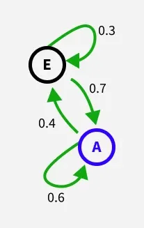

# Diffusion Model
## Deep Unsupervised Learning using Nonequilibrium Thermodynamics
https://arxiv.org/pdf/1503.03585

## Denoising Diffusion Probabilistic Models
https://arxiv.org/abs/2006.11239

### Preliminary
#### Latent variable model
Latent, or “hidden,” variable modeling is a statistical method that studies hidden concepts by analyzing measurable indicators that reflect them. To estimate these hidden constructs, researchers begin with observable data, like test scores or behaviors, and use them to make inferences about underlying concepts, including academic ability, mental health, or customer satisfaction. 

A latent variable model is a statistical model that relates a set of observable variables (also called manifest variables or indicators) to a set of latent variables. It is assumed that the responses on the indicators or manifest variables are the result of an individual's position on the latent variable(s), and that the manifest variables have nothing in common after controlling for the latent variable (local independence).

Different types of latent variable models can be grouped according to whether the manifest and latent variables are categorical or continuous.

| **Manifest Variables (관측변수)** | **Latent Variables: Continuous (연속형)** | **Latent Variables: Categorical (범주형)** |
| ----------------------------- | -------------------------------------- | --------------------------------------- |
| **Continuous (연속형)**          | Factor Analysis (요인분석)                 | Item Response Theory (문항반응이론)           |
| **Categorical (범주형)**         | Latent Profile Analysis (잠재프로파일분석)     | Latent Class Analysis (잠재계층분석)          |

#### Markov Chain
A Markov chain is a way to describe a system that moves between different situations called "states", where the chain assumes the probability of being in a particular state at the next step depends solely on the current state. 

For example, let's consider two-state Markov chain below.  
     

If in state A:
- Stays in A: probability 0.6
- Moves to E: probability 0.4  

If in state E:
- Moves to A: probability 0.7
- Stays in E: probability 0.3

Also note that a Markov chain can be illustrated as a directed graph, where nodes represent the states (A, E), arrows indicate possible transitions and the numbers on arrows show transition probabilities.

#### Kullback–Leibler Divergence (KL-Divergence)
$$
{\displaystyle D_{\text{KL}}(P\parallel Q)=\sum _{x\in {\mathcal {X}}}P(x)\ \log \left({\frac {\ P(x)\ }{Q(x)}}\right)} = \mathbb{E}_{x \sim P} \left[ \log \frac{P(x)}{Q(x)} \right]
$$

#### Jensen's Inequality

Jensen's inequality generalizes the statement that the secant line(a line that intersects a curve at a minimum of two distinct points) of a convex function lies above the graph of the function. In the context of probability theory, it is generally stated in the following form:  
If $X$ is a random variable and $\varphi$ is a convex function, then
$$
\varphi(\mathbb{E}[X]) \leq \mathbb{E}[\varphi(X)]
$$
If $\varphi$ is concave function, then
$$
\varphi(\mathbb{E}[X]) \geq \mathbb{E}[\varphi(X)]
$$

### Mathematical Background of Diffusion Model
확산 모델(Diffusion Models)의 수학적 기초를 설명합니다. 확산 모델은 Latent variable model로 아래의 적분 형태로 나타낼 수 있습니다.
$$p_\theta(x_0) := \int p_\theta(x_{0:T}) dx_{1:T}$$
- $x_0$: 우리가 실제로 관찰하는 데이터(예: 이미지)입니다.
- $x_1, \dots, x_T$: "잠재 변수(Latents)"라고 불리며, 데이터가 생성되는 과정 중에 존재하는 중간 단계들을 의미합니다.
- $p_\theta(x_0)$: 모델이 최종적으로 생성해낸 데이터 $x_0$의 확률 분포입니다. 이 분포가 실제 데이터 분포인 $q(x_0)$와 최대한 일치하도록 만드는 것이 모델의 목표입니다.

이 수식을 적분으로 나타낼 수 있는 이유는 아래 2가지 입니다.
1. 결합 확률 분포($p_\theta(x_{0:T})$): 모델은 노이즈($x_T$)부터 시작해 여러 단계($x_{T-1}, \dots, x_1$)를 거쳐 데이터($x_0$)를 생성하는 전체 경로에 대한 확률을 가집니다. 이를 Reverse Process이라고 부릅니다.
2. 주변 확률 계산: 우리가 보고 싶은 것은 오직 최종 결과물인 $x_0$뿐입니다. 따라서 모든 가능한 중간 경로들($x_{1:T}$)에 대해 확률을 다 더해주는(연속 변수이므로 적분하는) 과정을 통해 $x_0$만이 나타날 확률을 구하는 것입니다.

확산 모델은 데이터를 생성하는 Reverse Process과 데이터를 파괴하는 Forward Process로 이루어져 있습니다.

#### Reverse Process
완전한 노이즈($x_T$)에서 시작하여, 신경망($\theta$)이 예측하는 가우시안 분포를 따라 한 단계씩($T \rightarrow T-1 \rightarrow \dots \rightarrow 0$) 노이즈를 걷어내면(Denoising), 최종적으로 실제 데이터($x_0$)를 얻을 수 있다는 과정을 수학적으로 정리합니다.

$$
p_\theta(\mathbf{x}_{0:T}) := p(\mathbf{x}_T) \prod_{t=1}^{T} p_\theta(\mathbf{x}_{t-1}|\mathbf{x}_t) \\[5pt]
p(\mathbf{x}_T) = \mathcal{N}(\mathbf{x}_T; \mathbf{0}, \mathbf{I}), \quad 
p_\theta(\mathbf{x}_{t-1}|\mathbf{x}_t) := \mathcal{N}(\mathbf{x}_{t-1}; \mu_\theta(\mathbf{x}_t, t), \Sigma_\theta(\mathbf{x}_t, t))
$$

- $p_\theta(\mathbf{x}_{0:T})$: 이 모델이 생성하는 전체 경로($x_0, x_1, \dots, x_T$)에 대한 결합 확률 분포(Joint Distribution).
- $\theta$ (아래 첨자): 딥러닝 모델(신경망)의 학습 가능한 Parameters 를 나타냅니다. 즉, 이 분포는 고정된 것이 아니라 데이터를 통해 학습되는 것임을 의미.
- $p(\mathbf{x}_T)$: Reverse Process의 시작점인 Prior Distribution 입니다. 아무런 정보가 없는 완전한 노이즈 상태의 가우시안 분포입니다.
- $\prod_{t=1}^{T} p_\theta(\mathbf{x}_{t-1}|\mathbf{x}_t)$: $t=1$부터 $T$까지의 모든 단계에 대한 확률을 다 곱한다는 의미입니다. 이는 과정이 Markov Chain임을 나타내며, 현재 단계($x_t$)는 바로 다음 단계($x_{t-1}$)에만 영향을 줍니다.
- $p_\theta(\mathbf{x}_{t-1}|\mathbf{x}_t)$: Reverse Process Transition으로 노이즈가 더 많은 상태인 $\mathbf{x}_t$가 주어졌을 때, 노이즈가 조금 제거된 이전 상태인 $\mathbf{x}_{t-1}$이 어떠할지를 예측하는 확률 모델입니다.
- $\mathcal{N}(\mathbf{x}_{t-1}; \mu_\theta(\mathbf{x}_t, t), \Sigma_\theta(\mathbf{x}_t, t))$: 다음 단계를 현재 단계의 평균과 분산 기반의 가우시안 분포로 예측

#### Forward Process
순방향 과정(Forward Process) 또는 확산 과정(Diffusion Process)을 정의합니다.  
이 과정은 데이터($\mathbf{x}_0$)에서 시작하여, 미리 정해진 스케줄($\beta_t$)에 따라 아주 조금씩 가우시안 노이즈를 섞어가는 과정을 통해 데이터의 정보를 파괴해 나가는 과정입니다. 이 과정을 $T$번(예: 1000번) 반복하면, 원래 데이터의 형체는 완전히 사라지고 표준 가우시안 노이즈($\mathbf{x}_T \approx \mathcal{N}(\mathbf{0}, \mathbf{I})$)에 가까운 상태가 됩니다.

$$
q(\mathbf{x}_{1:T} | \mathbf{x}_0) := \prod_{t=1}^{T} q(\mathbf{x}_t | \mathbf{x}_{t-1}), \quad q(\mathbf{x}_t | \mathbf{x}_{t-1}) := \mathcal{N}(\mathbf{x}_t; \sqrt{1 - \beta_t} \mathbf{x}_{t-1}, \beta_t \mathbf{I})
$$

- $q(\mathbf{x}_{1:T} | \mathbf{x}_0)$: 실제 데이터 $\mathbf{x}_0$가 주어졌을 때, 시점 $1$부터 $T$까지 생성되는 모든 중간 단계들의 조건부 결합 확률 분포(Joint Distribution)입니다. 단, 역과정($p_\theta$)과 달리, 고정된 과정으로 신경망이 학습하는 대상이 아니라 미리 정해진 규칙에 따라 노이즈를 더하는 과정입니다.
- $\prod_{t=1}^{T} q(\mathbf{x}_t | \mathbf{x}_{t-1})$: $t=1$부터 $T$까지의 모든 단계에 대한 확률을 다 곱한다는 의미입니다. 이는 과정이 Markov Chain임을 나타내며, 현재 단계($x_t$)는 바로 다음 단계($x_{t-1}$)에만 영향을 줍니다.
- $\mathcal{N}(\dots)$: 각 단계에서 추가되는 노이즈가 가우시안 분포를 따른다는 것을 의미합니다.
- $\sqrt{1 - \beta_t} \mathbf{x}_{t-1}$: 가우시안 분포의 평균은 이전 단계의 데이터에 $\sqrt{1 - \beta_t}$를 곱하여 크기를 약간 줄입니다. 왜냐하면 단순히 노이즈를 더하기만 하면 데이터의 전체 분산이 계속 커지기 때문입니다. 이 스케일링 인자를 통해 노이즈를 더한 후에도  전체 데이터의 분산(Sclae)이 일정하게 유지되도록 조절합니다.
- $\beta_t \mathbf{I}$: 각 시점 $t$에서 추가되는 노이즈의 양입니다.
- $\beta_1, \dots, \beta_T$: 분산 스케줄(Variance Schedule)로  소스의 실험에서는 $10^{-4}$에서 $0.02$까지 선형적으로 증가하는 값을 사용했습니다.
- $\mathbf{I}$: 항등 행렬로, 모든 차원에 독립적으로 동일한 양의 노이즈가 추가됨을 의미합니다.

참고로 순방향 과정(Forward Process)의 중간 단계($\mathbf{x}_1, \dots, \mathbf{x}_{t-1}$)를 일일이 거치지 않고도, 원본 데이터 $\mathbf{x}_0$에서 임의의 시점 $t$의 노이즈 상태인 $\mathbf{x}_t$를 즉시 추출(Sampling)할 수 있습니다. 
$$
q(\mathbf{x}_t | \mathbf{x}_0) = \mathcal{N}(\mathbf{x}_t; \sqrt{\bar{\alpha}_t}\mathbf{x}_0, (1 - \bar{\alpha}_t)\mathbf{I})
$$
- $\alpha_t := 1 - \beta_t$: 현재 단계에서 보존되는 원본 신호의 비율을 의미합니다.
- $\bar{\alpha}_t := \prod_{s=1}^t \alpha_s$: 1단계부터 $t$단계까지 모든 $\alpha$를 곱한 값.

#### Objective Function and Variational Bound
$$
\mathbb{E}[-\log p_\theta(\mathbf{x}_0)] \leq \mathbb{E}_q\left[-\log \frac{p_\theta(\mathbf{x}_{0:T})}{q(\mathbf{x}_{1:T}|\mathbf{x}_0)}\right] = \mathbb{E}_q\left[-\log p(\mathbf{x}_T) - \sum_{t \geq 1} \log \frac{p_\theta(\mathbf{x}_{t-1}|\mathbf{x}_t)}{q(\mathbf{x}_t|\mathbf{x}_{t-1})}\right] =: L
$$
모델이 실제 데이터의 분포를 얼마나 잘 따르는지(Objective) 를 Variational Bound을 통해 나타냅니다.   

<b> Objective Function </b>  
모델이 생성한 데이터($x_0$)의 확률 분포가 실제 데이터 분포와 얼마나 일치하는지를 나타내는 지표로, 우리는 모델이 실제 데이터를 생성할 확률 $p_\theta(\mathbf{x}_0)$ 을 최대화하기를 원합니다. 다만 계산의 편의를 위해 로그를 취하고 부호를 바꾼 NLL 를 최소화하는 방향으로 학습을 진행합니다.  

$$
\mathbb{E}[-\log p_\theta(\mathbf{x}_0)]
$$
- $p_\theta(\mathbf{x}_0)$: 학습된 매개변수 $\theta$를 가진 모델이 실제 데이터 $\mathbf{x}_0$를 생성할 우도(Likelihood)을 의미. 

생성 모델의 근본적인 목적은 모델이 만들어내는 데이터의 분포를 실제 데이터의 분포($q(\mathbf{x}_0)$)와 일치시키는 것입니다. 따라서 모델이 실제 존재하는 이미지($\mathbf{x}_0$)에 대해 높은 확률($p_\theta$)을 부여한다는 것은, 모델이 그 데이터의 특성과 패턴을 잘 파악했다는 뜻입니다. 그러므로 $p_\theta(\mathbf{x}_0)$를 최대화하도록 학습된 모델은 나중에 새로운 샘플을 생성할 때, 실제 데이터와 통계적으로 유사한(즉, 고품질의) 이미지를 생성할 가능성이 높아집니다.

<b> Variational Bound </b>  
실제 데이터의 확률 $p_\theta(\mathbf{x}_0)$를 직접 계산하려면 모든 중간 단계($\mathbf{x}_{1:T}$)에 대해 적분을 해야 하므로 계산이 거의 불가능하다고 합니다. 따라서 계산이 가능한 Upper Bound을 구하여 이를 최소화 하는 방법을 사용합니다.  
아래 Upper Bound 수식은 순방향 전이($q$)와 역방향 전이($p_\theta$)의 비율에 로그를 취해 모두 더한 것으로 각 단계에서 노이즈를 얼마나 잘 복원하고 있는지 개별적인 손실(loss)들을 모두 합친 것입니다.

$$
\mathbb{E}_q\left[-\log \frac{p_\theta(\mathbf{x}_{0:T})}{q(\mathbf{x}_{1:T}|\mathbf{x}_0)}\right]$$
- $q(\mathbf{x}_{1:T}|\mathbf{x}_0)$: 순방향 과정으로 데이터에서 노이즈로 가는 고정된 경로입니다.
- $p_\theta(\mathbf{x}_{0:T})$: 역과정(생성 과정)으로 노이즈에서 데이터로 오는 학습 가능한 경로입니다.

이를 확장하면 아래와 같이 펼칠 수 있습니다.
$$
\frac{p_\theta(\mathbf{x}_{0:T})}{q(\mathbf{x}_{1:T}|\mathbf{x}_0)} = \frac{p(\mathbf{x}_T) \prod_{t=1}^T p_\theta(\mathbf{x}_{t-1}|\mathbf{x}_t)}{\prod_{t=1}^T q(\mathbf{x}_t|\mathbf{x}_{t-1})} = \mathbb{E}_q\left[-\log p(\mathbf{x}_T) - \sum_{t \geq 1} \log \frac{p_\theta(\mathbf{x}_{t-1}|\mathbf{x}_t)}{q(\mathbf{x}_t|\mathbf{x}_{t-1})}\right]
$$

- $\log p(\mathbf{x}_T)$: 순방향 과정의 끝인 $\mathbf{x}_T$가 우리가 가정한 사전 분포(표준 가우시안 노이즈) $p(\mathbf{x}_T)$와 얼마나 유사한지를 측정합니다.
- $\sum_{t \geq 1} \log \frac{p_\theta(\mathbf{x}_{t-1}|\mathbf{x}_t)}{q(\mathbf{x}_t|\mathbf{x}_{t-1})}$: 각 시점 $t$에서 노이즈를 더하고 복구한 것의 차이를 나타냅니다.

모델이 매 단계마다 순방향 과정에서 추가된 노이즈를 얼마나 정확하게 역으로 되돌리는 지를 평가합니다. 
 
<b> $L$ </b>  
이 모든 계산 결과를 $L$이라는 기호로 정의하며, 딥러닝 모델은 이 $L$ 값을 줄이는 방향으로 경사 하강법(Gradient Descent)을 통해 학습합니다.  
요약하면 "복잡한 데이터의 확률 분포를 직접 계산하는 대신, 노이즈 추가 과정($q$)과 노이즈 제거 과정($p_\theta$)을 매 단계 비*하여 그 차이를 최소화함으로써 모델을 학습시키겠다"는 수학적 선언입니다.

<b> Additional: 어떻게 Upper Bound가 성립하는가? </b>  
고정된 순방향 과정(Forward Process)인 $q(x_{1:T}|x_0)$를 식에 인위적으로 넣은 후 로그함수를 취해 로그 함수는 Concave Function 이므로, Jensen's Inequality 에 의해 "기댓값의 로그는 로그의 기댓값보다 크거나 같다"는 원리가 성립함을 이용합니다.
$$
p_\theta(x_0) = \int p_\theta(x_{0:T}) dx_{1:T} = \int q(x_{1:T}|x_0) \frac{p_\theta(x_{0:T})}{q(x_{1:T}|x_0)} dx_{1:T} = \mathbb{E}_q \left[ \frac{p_\theta(x_{0:T})}{q(x_{1:T}|x_0)} \right], \\[5pt]
\log p_\theta(x_0) = \log \mathbb{E}_q \left[ \frac{p_\theta(x_{0:T})}{q(x_{1:T}|x_0)} \right] \geq \mathbb{E}_q \left[ \log \frac{p_\theta(x_{0:T})}{q(x_{1:T}|x_0)} \right]
$$

## High-Resolution Image Synthesis with Latent Diffusion Models
https://arxiv.org/pdf/2112.10752

## DENOISING DIFFUSION IMPLICIT MODELS
https://arxiv.org/pdf/2010.02502
