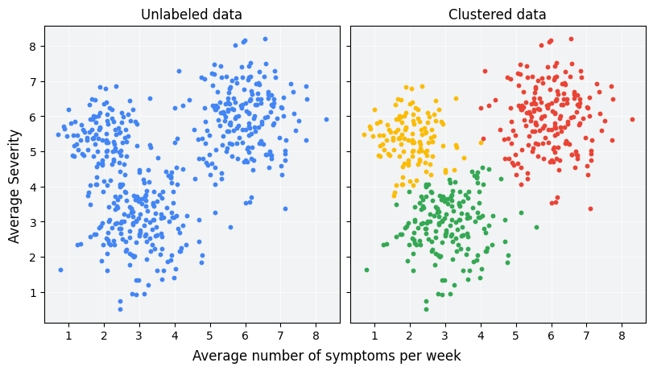

# Clustering
Clustering is an unsupervised machine learning technique designed to group unlabeled examples based on their similarity to each other. 
If the examples are labeled, this kind of grouping is called "classification".

   

As you can see  the data forms three clusters, even without a formal definition of similarity between data points. In real-world applications, however, you need to explicitly define a similarity measure, or the metric used to compare samples, in terms of the dataset's features. As the number of features increases, combining and comparing features becomes less intuitive and more complex.

After clustering, each group is assigned a unique label called a cluster ID. Clustering is powerful because it can simplify large, complex datasets with many features to a single cluster ID.

## Clustering Algorithms
### Centroid-based clustering
The centroid of a cluster is the arithmetic mean of all the points in the cluster. 

Centroid-based clustering organizes the data into non-hierarchical clusters. Centroid-based clustering algorithms are efficient but sensitive to initial conditions and outliers. Of these, <b>k-means</b> is the most widely used. It requires users to define the number of centroids, k, and works well with clusters of roughly equal size.

### Density-based Clustering
Density-based clustering connects contiguous areas of high example density into clusters. This allows for the discovery of any number of clusters of any shape. Outliers are not assigned to clusters. These algorithms have difficulty with clusters of different density and data with high dimensions.

### Distribution-based Clustering
This clustering approach assumes data is composed of probabilistic distributions, such as Gaussian distributions. As distance from the distribution's center increases, the probability that a point belongs to the distribution decreases. 

### Hierarchical Clustering
Hierarchical clustering creates a tree of clusters. Hierarchical clustering, not surprisingly, is well suited to hierarchical data, such as taxonomies.

## Clustering Workflows
Introduce steps to cluster data.

1. Prepare data
As with any ML problem, you must normalize, scale, and transform feature data before training or fine-tuning a model on that data. In addition, before clustering, check that the prepared data lets you accurately calculate similarity between examples.

2. Create similarity metric
Before a clustering algorithm can group data, it needs to know how similar pairs of examples are. You can quantify the similarity between examples by creating a similarity metric, which requires a careful understanding of your data. (Euclidean distance, Cosine, Dot Product)

3. Run clustering algorithm
A clustering algorithm uses the similarity metric to cluster data. For example, k-means.

4. Interpret results and adjust
Because clustering doesn't produce or include a ground "truth" against which you can verify the output, it's important to check the result against your expectations at both the cluster level and the example level. If the result looks odd or low-quality, experiment with the previous three steps. Continue iterating until the quality of the output meets your needs.

## Data preparation
- Normalizing data: You can transform data for multiple features to the same scale by normalizing the data.
- Z-scores: Whenever you see a dataset roughly shaped like a Gaussian distribution, you should calculate z-scores for the data. 
Z-scores are the number of standard deviations a value is from the mean. 
- Log transforms: When a dataset perfectly conforms to a power law distribution, where data is heavily clumped at the lowest values, use a log transform.
- Quantiles: Binning the data into quantiles works well when the dataset does not conform to a known distribution. It means dividing the dataset into intervals that each contain equal numbers of examples, and assigning the quantile index to each example.

## K-Means Clustering
See SubTopic "K-means Clustering" in Topic "EM Algorithm"

## Neural nets for clustering
Instead of comparing manually-combined feature data, you can reduce the feature data to representations called embeddings, then compare the embeddings. Embeddings are generated by training a supervised deep neural network (DNN) on the feature data itself. The embeddings map the feature data to a vector in an embedding space with typically fewer dimensions than the feature data. 

### Supervised Similarity Measure
Embedding vectors for similar examples, such as YouTube videos on similar topics watched by the same users, end up close together in the embedding space. A supervised similarity measure uses this "closeness" to quantify the similarity for pairs of examples.

#### Creating Supervised Similarity Measure
1. Input Feature data
2. Choose DNN (Autoencoder, predictor)
3. Extract Embeddings
4. Choose measurement (dot prdoduct, cosine, euclidean distance)

#### Choose DNN based on training labels
Note that Autoencoder is trying to reconstruct the input (copy input to output), while Predictor is trying to Predict a target variable from input (Regression/Classification)

##### Autoencoder
A DNN that learns embeddings of input data by predicting the input data itself is called an autoencoder. Because an autoencoder's hidden layers are smaller than the input and output layers, the autoencoder is forced to learn a compressed representation of the input feature data. Once the DNN is trained, extract the embeddings from the smallest hidden layer to calculate similarity.

##### Predictor
An autoencoder is the simplest choice to generate embeddings. However, an autoencoder isn't the optimal choice when certain features could be more important than others in determining similarity. For example, in house data, assume price is more important than postal code. In such cases, use only the important feature as the training label for the DNN. Since this DNN predicts a specific input feature instead of predicting all input features, it is called a predictor DNN. Embeddings should usually be extracted from the last embedding layer.

### Measuring similarity from embeddings
1. Euclidean distance: Distance between ends of vectors. $\sqrt{(a_1-b_1)^2+(a_2-b_2)^2+...+(a_N-b_N)^2}$		
2. Cosine: Cosine of angle  between vectors. $\frac{a^T b}{|a| \cdot |b|}$
3. Dot product: Cosine multiplied by lengths of both vectors. $a_1b_1+a_2b_2+...+a_nb_n =|a||b|cos(\theta)$

In contrast to the cosine, the dot product is proportional to the vector length. This is important because examples that appear very frequently in the training set (for example, popular YouTube videos) tend to have embedding vectors with large lengths. If you want to capture popularity, then choose dot product. However, the risk is that popular examples may skew the similarity metric.  To balance this skew, you can raise the length to an exponent $\alpha <1$  to calculate the dot product as $|a|^{\alpha}|b|^{\alpha}\cos(\theta)$.

## References
- https://developers.google.com/machine-learning/clustering
