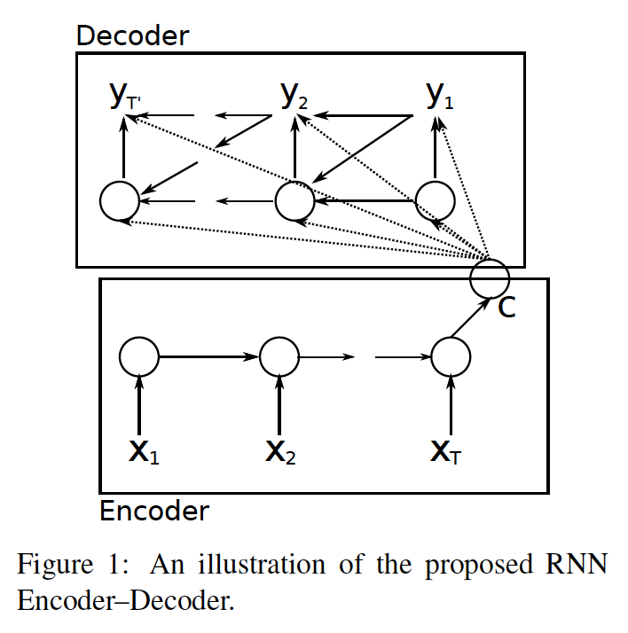
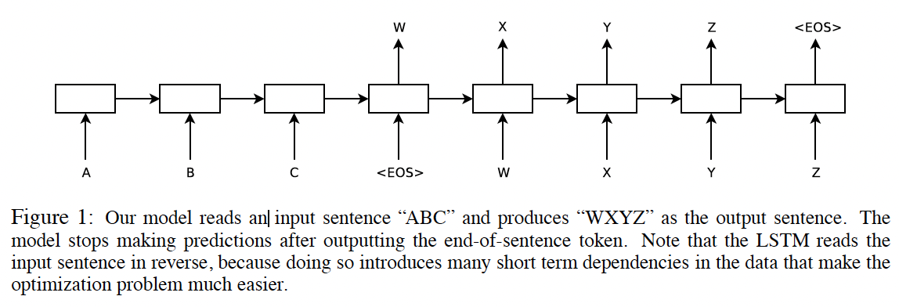
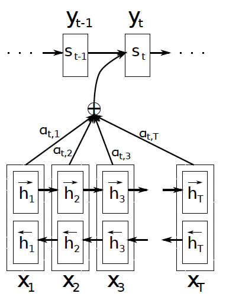

# Sequence Model and Attention Mechanism
## Preliminaries
### Statistical Machine Translation (SMT)
SMT is a type of machine translation that uses statistical models to translate text from one language to another. Unlike traditional rule-based systems, SMT relies on large bilingual text corpora to build probabilistic models that determine the likelihood of a sentence in the target language given a sentence in the source language.  
This approach marked a significant shift in natural language processing (NLP) and more advanced machine translation technologies.

## RNN Encoder-Decoder Model
RNN Encoder–Decoder consists of two recurrent neural networks (RNN) that act as an encoder and a decoder pair. The encoder
maps a variable-length source sequence to a fixed-length vector, and the decoder maps the vector representation back to a variable-length target sequence. The two networks are trained jointly to maximize the conditional probability of the target sequence given a source sequence.  
  

Encoder-Decoder architecture that learns to encode a variable-length sequence into a fixed-length vector representation and to decode a given fixed-length vector representation back into a variable-length sequence.
From a probabilistic perspective, this new model
is a general method to learn the conditional distribution
over a variable-length sequence conditioned on another variable-length sequence. For example,
$$
p(y_1, \ldots, y_{T'} \mid x_1, \ldots, x_T), \\[5pt]
$$
Where lengths $T$ and $T'$ may differ.  

<b> Encoder </b>  
The encoder is an RNN that reads each symbol
of an input sequence $x$ sequentially. As it reads
each symbol, the hidden state of the RNN changes
according to the equaton below. 
$$
\mathbf{h}_{\langle t \rangle} = f \big( \mathbf{h}_{\langle t-1 \rangle}, x_t \big)
$$
Where $t$ represents time step, $\mathbf{h}_{\langle t \rangle}$ is hidden state at time step $t$, $x = (x_1,  x_2, \cdots x_t)$ is input sequence and $f$ is a non-linear activation function.  
After reading the end of the sequence, the hidden state of the RNN is a summary $c$ of the whole input sequence.

<b> Decoder </b>  
The decoder of the model is another RNN which is trained to generate the output sequence by predicting the next symbol $y_{t}$ given the hidden state $\mathbf{h}_{\langle t \rangle}$. So the hidden state of the decoder and the output at time $t$ are computed by,
$$
\mathbf{h}_{\langle t \rangle} = f \big( \mathbf{h}_{\langle t-1 \rangle}, y_{t-1}, c \big), \\[5pt]
P(y_t \mid y_{t-1}, y_{t-2}, \ldots, y_1, c) 
= g \big( \mathbf{h}_{\langle t \rangle}, y_{t-1}, c \big)
$$
You can see that  both $y_{t}$ and $\mathbf{h}_{\langle t \rangle}$ are also conditioned $y_{t-1}$ and on the summary $c$ of the input sequence. 

<b> Objective Function </b>  
The objective function of the model is as below.proposed
model architecture. The RNN Encoder–Decoder are jointly trained to maximize this conditional log-likelihood. 
$$
\max_{\theta} \; \frac{1}{N} \sum_{n=1}^{N} \log p_\theta(y_n \mid x_n)
$$
Where $\theta$ is the set of the model parameters and
each $(x_n, y_n)$ is an (input sequence, output sequence)
pair from the training set.  

Note that this objective function is equal to that of RNN model. Recall that,
$$
\begin{aligned}
\mathcal{L}(\hat{y}^{\langle t \rangle}, y^{\langle t \rangle}) &= - \sum_i y_i^{\langle t \rangle} \log \hat{y}_i^{\langle t \rangle} \\
\mathcal{L} &= \sum_t \mathcal{L}^{\langle t \rangle}(\hat{y}^{\langle t \rangle}, y^{\langle t \rangle})
\end{aligned}
$$
Now let's see how they are equal.
$$
p_\theta(y_n \mid x_n) 
= \prod_{t=1}^{T_n} p_\theta\!\big(y_n^{\langle t \rangle} \mid y_n^{\langle <t \rangle}, x_n \big), \\[5pt]
\log p_\theta(y_n \mid x_n) 
= \sum_{t=1}^{T_n} \log p_\theta\!\big(y_n^{\langle t \rangle} \mid y_n^{\langle <t \rangle}, x_n \big)
$$
Since the probability of the true word is just the corresponding predicted probability, 
$$
p_\theta\!\big(y_n^{\langle t \rangle} \mid y_n^{\langle <t \rangle}, x_n \big) = \hat{y}_{n,k}^{\langle t \rangle}, \\[5pt]
\log p_\theta \big(y_n^{\langle t \rangle} \mid y_n^{\langle <t \rangle}, x_n  \big) = \log \hat{y}_{n,k}^{\langle t \rangle}
$$
You can interprete it as the probability of the true word in the $n$-th training example at timestep $t$ is one of the entries in the $K$-dimensional softmax output vector.  
Now, using the fact that $y_n^{\langle t \rangle}$ is one-hot vector that only one component is $1$ (the true class) and the rest are $0$, 
$$
\log p_\theta \big(y_n^{\langle t \rangle} \mid y_n^{\langle <t \rangle}, x_n  \big) = \log \hat{y}_{n,k}^{\langle t \rangle} \\[3pt]
= \sum_{i=1}^K y_{n,i}^{\langle t \rangle} \log \hat{y}_{n,i}^{\langle t \rangle}
$$
Therefore, 
$$
\log p_\theta(y_n \mid x_n) = \sum_{t=1}^{T_n} \log p_\theta\!\big(y_n^{\langle t \rangle} \mid y_n^{\langle <t \rangle}, x_n \big) \\[3pt]
= \sum_{t=1}^{T_n} \sum_{i=1}^{K} y_{n,i}^{\langle t \rangle} \log \hat{y}_{n,i}^{\langle t \rangle}
$$

## Sequence to Sequence Model
The Sequence-to-Sequence (Seq2Seq) model is a type of neural network architecture widely used in machine learning particularly in tasks that involve translating one sequence of data into another. It takes an input sequence, processes it and generates an output sequence. The Seq2Seq model has made significant contributions to areas such as natural language processing (NLP), machine translation and speech recognition.
  

It uses RNN Encoder-Decoer architecture for general sequence learning which is mapping the input sequence to a fixed-sized vector using one RNN, and then to map the vector to the target sequence with another RNN. While it would be difficult to train the RNNs due to the resulting long term dependencies, the LSTM’s ability to successfully learn on data with long range temporal dependencies makes it a natural choice for this application due to the considerable time lag between the inputs and their corresponding outputs.  

Note that The goal of the LSTM is to estimate the conditional probability $p(y_1, \cdots, y_{T′} |x_1, \cdots , x_T)$ where $(x_1, \cdots , x_T )$ is an input sequence and $y_1, \cdots, y_{T′}$ is its corresponding output sequence whose length $T′$ may differ from $T$.The LSTM computes this conditional probability by first obtaining the fixed dimensional representation $v$ of the input sequence $(x_1, \cdots , x_T )$ given by the last hidden state of the LSTM, and then computing the probability of $y_1, \cdots, y_{T′}$ with a standard LSTM-LM(Language Model) formulation whose initial hidden state is set to the representation $v$ of $x_1, \cdots , x_T$: 
$$
p(y_1, \ldots, y_{T'} \mid x_1, \ldots, x_T) 
= \prod_{t=1}^{T'} p(y_t \mid v, y_1, \ldots, y_{t-1})
$$
In this equation, each $p(y_t \mid \mathbf{v}, y_1, \ldots, y_{t-1})$ distribution is represented with a softmax over all the words in the vocabulary.

<b> Objective Function </b>  
$$
\frac{1}{|\mathcal{S}|} \sum_{(T,S)\in \mathcal{S}} \log p(T \mid S)
$$
Note that objective function is same as that of RNN encoder-decoder (So it is same as that of RNN), where log probability of a correct translation $T$ given the source sentence $S$, while $\mathcal{S}$ is the trianing set.  
Once training is complete, produce translations by finding the most likely translation according to the LSTM,
$$
\hat{T} = \arg\max_T \, p(T \mid S)
$$

<b> Details of Seq2Seq Model </b>
1. Using Beam search: the translation using a simple left-to-right beam search decoder which
maintains a small number $B$ of partial hypotheses, where a partial hypothesis is a prefix of some translation.
2. Deep LSTMs: since found that deep LSTMs significantly outperformed shallow LSTMs, so we chose an LSTMwith four layers. 
3. Reverse order of input sequence: by reversing the words in the source sentence, the first few words in the source language are now very close to the first few words in the target language. So the backpropagation has an easier time “establishing communication” between
the source sentence and the target sentence, which in turn results in substantially improved overall performance. For example, mapping the sentence $a, b, c$ to the sentence $\alpha, \beta, \gamma$, the LSTM is asked to map  $c,b,a$ to  $\alpha, \beta, \gamma$
where $\alpha, \beta, \gamma$ is the translation of $a, b, c$. This way, $a$ is in close proximity to $\alpha$, $b$ is fairly close to $\beta$ and so on.

### Picking the most likely sentence
Note that you're not trying to sample at random from the distribution $p$, instead, you want to find output sentence $y$ that maximizes the conditional probability $p$.
$$
\argmax_{y^{\langle 1 \rangle}, \ldots, y^{\langle T_y \rangle}} 
P\!\big(y^{\langle 1 \rangle}, \ldots, y^{\langle T_y \rangle} \mid x \big)
$$
Where $y^{\langle 1 \rangle}, \ldots, y^{\langle T_y \rangle} $ is output sentence sequence and $x$ is input sentence. For example, given the input French sentence, the model tells you what is the probability of different corresponding English translations.
```
Jane visite l’Afrique en septembre. (input sentence: French)

(output sentence: English)
→ Jane is visiting Africa in September.
→ Jane is going to be visiting Africa in September.
→ In September, Jane will visit Africa.
→ Her African friend welcomed Jane in September.
```
### Why not Greedy search?
Since you want to pick sequence of words that maximizes the joint probability. It turns out that picking up the best first word, best second word and so on; that approach doesn’t really work. It is not optimal to pick one best word at a time. 
 
Also the total number of combination of words in output sequence is exponentially large. For example, when you have $10,000$ vocabularies and try to make $10$ words long sentence, $P\!\big(y^{\langle 1 \rangle}, \ldots, y^{\langle 10 \rangle} \mid x \big)$ is $10,000^{10}$.  

Since the number is too large, the common approach is to use approximate search algorithm, which will try to pick the sentence that maximizes the conditional probability, such as Beam Search.

## Beam Search
Beam search is a heuristic search algorithm that explores a graph by expanding the most promising node in a limited set. Beam search is a modification of best-first search that reduces its memory requirements. It is a greedy algorithm since only a predetermined number($B$) of best partial solutions are kept as candidates. For example, in sequence to sequence model, decoder outputs the softmax output over all possibilities and keep the top $B$ picks in the memory in the initial step. In the second step, for each of $B$ choices, consider what should be the second word using the probability of first and second word.
$$
P(y^{\langle 1 \rangle}, y^{\langle 2 \rangle} \mid x) 
= P(y^{\langle 1 \rangle} \mid x) \; P(y^{\langle 2 \rangle} \mid x, y^{\langle 1 \rangle})
$$
Suppose $B=3$ and the number of vocabulary is $10,000$, then evaluate all $3 \times 10,000$ options according to the probability of first and second word, and pick top $B$.  
To generalize, at every step, instantiate $B$ copies of the network to evaluate the partial sentence fragments.

Unlike exact search algorithms like BFS (Breadth First Search) or DFS (Depth First Search), Beam Search runs faster but is not guaranteed to find exact maximum for $\arg\max_{y} p(y|x)$. If use larger $B$, better result, but slower. While use smaller $B$, worse result but faster.

### Refinement of Beam Search
<b> Original </b>
$$
\arg\max_{y} \prod_{t=1}^{T_y} P\!\big(y^{\langle t \rangle} \mid x, y^{\langle 1 \rangle}, \ldots, y^{\langle t-1 \rangle}\big)
$$
<b> Log Sum </b>  
Because multiplying tiny numbers result in numeric underflow, use sum of log.
$$
\arg\max_{y} \sum_{t=1}^{T_y} \log P\!\big(y^{\langle t \rangle} \mid x, y^{\langle 1 \rangle}, \ldots, y^{\langle t-1 \rangle}\big)
$$
<b> Log Sum + Normlization </b>  
Beam search might tend to prefer very short translations (outputs) because the probability for short sentence is determined by the fewer numbers which are less than $1$.
$$
\arg\max_{y} \frac{1}{T_y^{\alpha}} \sum_{t=1}^{T_y} \log P\!\big(y^{\langle t \rangle} \mid x, y^{\langle 1 \rangle}, \ldots, y^{\langle t-1 \rangle}\big)
$$
So normalize it with the number of the words then the product or sum of log will just be not as small. Note that $\alpha$ for softer normlization. When $\alpha=1$, complete normliazation, while $\alpha=0$ zero normlaization. By setting $0 < \alpha < 1$, setting normalization level somewhere between.
 
## Bleu Score
BLEU (bilingual evaluation understudy) is an algorithm for evaluating the quality of text which has been machine-translated from one natural language to another. Quality is considered to be the correspondence between a machine's output and that of a human.  
The central idea behind BLEU is that <b>"the closer a machine translation is to a professional human translation, the better it is"</b>.  
$$
\begin{array}{|c|c|c|c|c|c|c|c|}
\hline
\textbf{Candidate} & \text{the} & \text{the} & \text{the} & \text{the} & \text{the} & \text{the} & \text{the} \\
\hline
\textbf{Reference 1} & \text{the} & \text{cat} & \text{is} & \text{on} & \text{the} & \text{mat} & \\
\hline
\textbf{Reference 2} & \text{there} & \text{is} & \text{a} & \text{cat} & \text{on} & \text{the} & \text{mat} \\
\hline
\end{array}
$$
Let's see an above example to understand the algorithm of Bleu Score.
Of the seven words in the candidate translation, all of them appear in the reference translations. Thus the candidate text is given a unigram precision of,
${\displaystyle P={\frac {m}{w_{t}}}={\frac {7}{7}}=1}$, 
where $m$ is number of words from the candidate that are found in the reference, and $~w_{t}$ is the total number of words in the candidate. This is a perfect score, despite the fact that the candidate translation above retains little of the content of either of the references.

The modification that BLEU makes is fairly straightforward. For each word in the candidate translation, the algorithm takes its maximum total count in the single reference sentence, $~m_{max}$, in any of the reference translations. In the example above, the word "the" appears twice in reference 1, and once in reference 2. Thus $~m_{max}=2$.

For the candidate translation, the count $m_{w}$ of each word is clipped to a maximum of $m_{max}$ for that word. In this case, "the" has $~m_{w}=7$ and $~m_{max}=2$ thus $ ~m_{w}=2$. These clipped counts $~m_{w}$ are then summed over all distinct words in the candidate. This sum is then divided by the total number of unigrams in the candidate translation. In the above example, the modified unigram precision score would be $P={\frac {2}{7}}$.  
You can apply same logic to $n$-gram using the $n$ sets of words appearing next to each other.  
You can generalize as below.
$$
P_1 = \frac{\sum_{\text{unigrams} \in \hat{y}} \text{Count}_{\text{clip}}(\text{unigram})}
           {\sum_{\text{unigrams} \in \hat{y}} \text{Count}(\text{unigram})}\\[5pt]
P_n = \frac{\sum_{\text{n-grams} \in \hat{y}} \text{Count}_{\text{clip}}(\text{n-gram})}
           {\sum_{\text{n-grams} \in \hat{y}} \text{Count}(\text{n-gram})}
$$
Where $~m_{max}$ is count clip and $m$ is count is $w_t$.

The final version of Bleu score is below.
$$
BP \cdot \exp\!\left( \frac{1}{k} \sum_{n=1}^{k} P_n \right)
$$
Wher $P_n$ is  Bleu score on $n$-grams only and BP is,
$$
BP =
\begin{cases}
1 & \text{if } \text{model\_output\_length} > \text{reference\_output\_length} \\
\exp\!\left( 1 - \frac{\text{model\_output\_length}}{\text{reference\_output\_length}} \right) & \text{otherwise}
\end{cases}
$$
The Blue score unduly gives a high score for candidate strings that are containing all the $n$-grams of reference strings, but for as few times as possible. Simply speaking, short output translation is likely to get good precision. So brevity penalty is applied to punish candidate strings that are too short.

## Attention
### Background
In any RNN encoder-decoder family model, an encoder neural network reads and encodes a source sentence into a fixed-length vector, and a decoder neural network then outputs a translation from the encoded vector. The
whole encoder–decoder system, which consists of the encoder and the decoder for a language pair is jointly trained to maximize the probability of a correct translation given a source sentence.  

A potential issue with this encoder–decoder approach is that a neural network needs to be able to compress all the necessary information of a source sentence into a fixed-length vector. This may make it difficult for the neural network to cope with long sentences, especially those that are longer
than the sentences in the training corpus.

### Basics
In order to address this issue, an extension to the encoder–decoder model which learns to align and translate jointly is applied. Each time the new model with an extension generates a word in a translation, it soft-searches for a set of positions in a source sentence where the most relevant information is
concentrated. The model then predicts a target word based on the context vectors associated with these source positions and all the previous generated target words.  

The most important distinguishing feature of this approach from the basic encoder–decoder is that it does not attempt to encode a whole input sentence into a single fixed-length vector. Instead, it encodes the input sentence into a sequence of vectors and chooses a subset of these vectors adaptively while decoding the translation. This frees a neural translation model from having to squash all the information of a source sentence, regardless of its length, into a fixed-length vector.

### Model Architecture
The new model's architecture consists of a bidirectional RNN as an encoder and a decoder that emulates searching through a source sentence during decoding a translation.

  

Above image shows the new model trying to generate the $t$-th target
word $y_t$ given a source sentence $(x_1, x_2, \cdots, x_T)$.

#### Encoder
An encoder is the proposed scheme, we would like the annotation  $(h_1, \cdots, h_{T_x})$
of each word to summarize not only the preceding words, but also the following words. Hence,
we propose to use a bidirectional RNN (BiRNN).  
An annotation for each word $x_j$ by concatenating the forward hidden state
$\vec{h}_j$ and the backward one $ \overleftarrow{h}_j$. 
$$
h_j = \begin{bmatrix} \overrightarrow{h}_j^{\top} \; ; \; \overleftarrow{h}_j^{\top} \end{bmatrix}^{\top}
$$
In this way, the annotation $h_j$ contains the summaries of both the preceding words and the following words.

##### Deepen Explanation on Encoder
The forward states of the bidirectional recurrent neural network (BiRNN) are computed,
$$
\overrightarrow{h}_i =
\begin{cases}
(1 - \overrightarrow{z}_i) \circ \overrightarrow{h}_{i-1} + \overrightarrow{z}_i \circ \overrightarrow{\tilde{h}}_i, & \text{if } i > 0 \\
0, & \text{if } i = 0
\end{cases}
$$
Where,
$$
\overrightarrow{\tilde{h}}_i = \tanh \left( \overrightarrow{W} \, \overline{E} x_i + \overrightarrow{U} \left[ \overrightarrow{r}_i \circ \overrightarrow{h}_{i-1} \right] \right) \\[5pt]
\overrightarrow{z}_i = \sigma \left( \overrightarrow{W}_z \, \overline{E} x_i + \overrightarrow{U}_z \, \overrightarrow{h}_{i-1} \right) \\[5pt]
\overrightarrow{r}_i = \sigma \left( \overrightarrow{W}_r \, \overline{E} x_i + \overrightarrow{U}_r \, \overrightarrow{h}_{i-1} \right)
$$
$\overline{E} \in \mathbb{R}^{m \times K_x}$ is the word embedding matrix and $\overrightarrow{W}, \; \overrightarrow{W}_z, \; \overrightarrow{W}_r \in \mathbb{R}^{n \times m}, \overrightarrow{U}, \; \overrightarrow{U}_z, \; \overrightarrow{U}_r \in \mathbb{R}^{n \times n}$ are weight matrices. $m,n$ are the word embedding dimensionality and the number of hidden units, respectively. $\sigma$ is a logistic sigmoid function.

The backward states are computed similarly. So we concatenate the forward and backward states to to obtain the annotations $(h_1, h_2, \cdots, h_{Tx} )$, where, 
$$
h_i = 
\begin{bmatrix}
\overrightarrow{h}_i \\
\overleftarrow{h}_i
\end{bmatrix}
$$

#### Decoder (+ Allignment Model)
The decoder is trained to predict the next word $y_{t^{'}}$ given the context vector $c$ and all the previously predicted words $\{y_1, \cdots, y_{t^{'}-1}\}$. The difference between previous model is that the probability is conditioned on a distinct context vector $c_i$ for each target word $y_i$, instead of using a single fixed-length vector of whole input sentence.
$$
p(y_i \mid y_1, \ldots, y_{i-1}, \mathbf{x}) 
= g(y_{i-1}, s_i, c_i), \\[5pt]
s_i = f(s_{i-1}, y_{i-1}, c_i)
$$
The $p$ represents the conditional probability over the translation $y$ and $s_i$ is an RNN hidden state for time $i$. See the moddel architecture image for better understanding.

$$
c_i = \sum_{j=1}^{T_x} \alpha_{ij} h_j, \quad
\alpha_{ij} = \frac{\exp(e_{ij})}{\sum_{k=1}^{T_x} \exp(e_{ik})}, \quad
e_{ij} = a(s_{i-1}, h_j)
$$
(annotations $h$ is explained in previous "Encoder" part.)  

Next, the context vector $c_i$ depends on a sequence of annotations $(h_1, \cdots, h_{T_x})$ to which an encoder maps the input sentence. Each annotation $h_i$ contains information about the whole input sequence with a strong focus on the parts surrounding the $i$-th word of the input sequence. So taking a weighted sum of all the annotations can be interpreted as computing an expected annotation, where the expectation is over possible alignments.

$\alpha$ is a weight. So $\alpha_{ij}$ be a probability that the target word $y_i$ is aligned to, or translated from, a source word $x_j$. Then, the $i$-th context vector $c_i$ is the expected annotation over all the annotations with probabilities $\alpha_{ij}$.

$e_{ij}$ is an alignment model which scores how well the inputs around position $j$ and the output at position $i$ match. The score is based on the RNN hidden state $s_{i-1}$ (just before emitting $y_i$) and the $j$-th annotation $h_j$.

So, The probability $\alpha_{ij}$, or its associated energy $e_{ij}$, reflects the importance of the annotation $h_j$ with respect to the previous hidden state $s_{i-1}$ in deciding the next state $s_i$ and generating $y_i$. Intuitively, this implements a mechanism of attention in the decoder. The decoder decides parts of the source sentence to pay attention to. By letting the decoder have an attention mechanism, we relieve the
encoder from the burden of having to encode all information in the source sentence into a fixed length vector.

##### Deepen Explanation on Decoder
Let's see how the hidden state $s_i$ of the decoder described above was actually implemented.
$$
s_i = f(s_{i-1}, y_{i-1}, c_i) = (1 - z_i) \circ s_{i-1} + z_i \circ \tilde{s}_i,
$$
Where,
$$
\tilde{s}_i = \tanh \big( W E y_{i-1} + U \,[ r_i \circ s_{i-1}] + C c_i \big), \\[5pt]
z_i = \sigma \big( W_z E y_{i-1} + U_z s_{i-1} + C_z c_i \big), \\[5pt]
r_i = \sigma \big( W_r E y_{i-1} + U_r s_{i-1} + C_r c_i \big)
$$
Where $W, W_z, W_r \in \mathbb{R}^{n \times m}, \quad U, U_z, U_r \in \mathbb{R}^{n \times n}, C, C_z, C_r \in \mathbb{R}^{n \times 2n}$ are weights and $E$ is word embedding matrix for target language. Also $m, n$ are the word embedding dimensionality and the number of hidden units, respectively.

Next, let's see how the context vector $c_i$ is actually implemented. More precisely, how the allignment model is.
$$
c_i = \sum_{j=1}^{T_x} \alpha_{ij} h_j, \\[5pt]
\alpha_{ij} = \frac{\exp(e_{ij})}{\sum_{k=1}^{T_x} \exp(e_{ik})}, \\[5pt]
e_{ij} = a(s_{i-1}, h_j) =  v_a^{\top} \tanh \left( W_a s_{i-1} + U_a h_j \right),
$$
Where $h_j$ is the $j$-th annotation in the source sentence. $v_a^{\top} \in \mathbb{R}^{n'}, W_a \in \mathbb{R}^{n' \times n}, U_a \in \mathbb{R}^{n' \times 2n}$.
Lastly, let's see the probability of a target word $y_i$ we described before.
$$
p(y_i \mid s_{i-1}, y_{i-1}, c_i) \;\propto\; \exp \!\big( y_i^\top W_o t_i \big) \\[5pt] 
\rightarrow p(y_i \mid s_{i-1}, y_{i-1}, c_i) = g(y_{i-1}, s_i, c_i) = \frac{\exp\!\big(y_i^\top W_o t_i\big)} {\sum_{k=1}^{T_y} \exp\!\big(y_k^\top W_o t_i\big)}, \\[5pt]
t_i = \Big[ \max \{ \tilde{t}_{i,2j-1}, \tilde{t}_{i,2j} \} \Big]_{j=1,\ldots,l}^{\top}, \quad
\tilde{t}_i = U_o s_{i-1} + V_o E y_{i-1} + C_o c_i.
$$
Where, $W_o \in \mathbb{R}^{K_y \times l}, \quad  U_o \in \mathbb{R}^{2l \times n}, \quad  V_o \in \mathbb{R}^{2l \times m}, \quad C_o \in \mathbb{R}^{2l \times 2n}$ are weight matrices. Note that first double the dimension with $\tilde{t}_i \in \mathbb{R}^{2l}$, then reduce it back to $\ell$ via maxout pooling, which picks the stronger (max) activation from each pair.

## Image Captioning