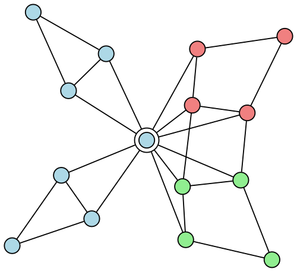
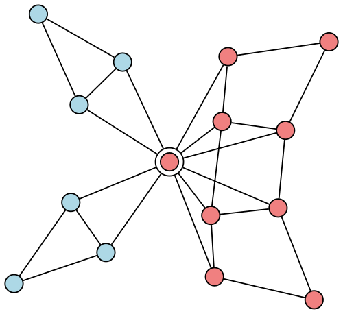
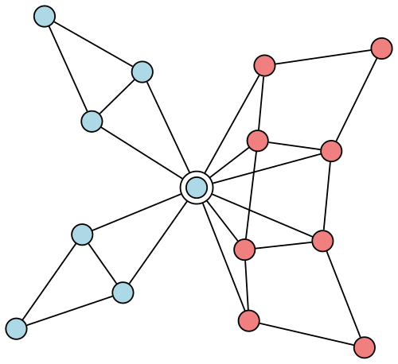
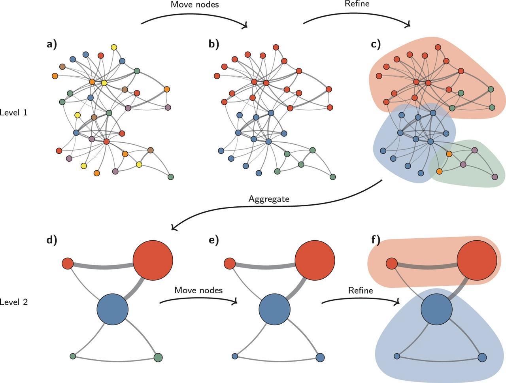

# Network Theory
The network theory is a part of graph theory. It defines networks as graphs where the vertices or edges possess attributes.  
Network theory analyses these networks over the symmetric relations or asymmetric relations between their (discrete) components.  

## Modularity
Modularity is a measure of the structure of networks or graphs which measures the strength of division of a network into modules (also called groups, clusters or communities).  
Networks with high modularity have dense connections between the nodes within modules but sparse connections between nodes in different modules.
https://en.wikipedia.org/wiki/Modularity_(networks)

## Louvain method
Louvain method is a greedy optimization method intended to extract non-overlapping communities from large networks created by Blondel et al. from the University of Louvain.  

### Modularity
The value to be optimized is modularity, defined as a value in the range $[-1,1]$ that measures the density of links inside communities compared to links between communities.

#### Modularity Algorithm
$$
{\displaystyle Q={\frac {1}{2m}}\sum _{i=1}^{N}\sum _{j=1}^{N}{\bigg [}A_{ij}-{\frac {k_{i}k_{j}}{2m}}{\bigg ]}\delta (c_{i},c_{j}),}
$$

- $A_{ij}$: the edge weight between nodes i and j.
⁠- $k_{i}, k_{j}$: the sum of the weights of the edges attached to nodes i and j, respectively.
- $m$: the sum of all of the edge weights in the graph.
- $N$: the total number of nodes in the graph.
⁠- $c_{i}, c_{j}$: the communities to which the nodes $i$ and $j$ belong.
- $\delta$: Kronecker delta function. $1$ if $c_i = c_j$ are the same cluster and $0$ otherwise.

Based on the above equation, the modularity of a community $c$ can be calculated as follows.
$$
{\displaystyle {\begin{aligned}Q_{c}&={\dfrac {1}{2m}}\sum _{i}\sum _{j}A_{ij}\mathbf {1} \left\{c_{i}=c_{j}=c\right\}-\left(\sum _{i}{\dfrac {k_{i}}{2m}}\mathbf {1} \left\{c_{i}=c\right\}\right)^{2}\\&={\frac {\Sigma _{in}}{2m}}-\left({\frac {\Sigma _{tot}}{2m}}\right)^{2} \end{aligned}}}
$$
- $\Sigma _{in}$: the sum of edge weights between nodes within the community $c$ (each edge is considered twice).
- $\Sigma _{tot}$: the sum of all edge weights for nodes within the community (including edges which link to other communities).
- $Q=\sum _{c}Q_{c}$

Note that $Q = \sum_c Q_c$ and $\delta =1$ only when $c_i$ and $c_j$ both belong to the community $c$ ($c_i = c_j = c$). Besides, due to Kronecker delta function, the very inside term is only calculated when $c_i = c_j = c$.

### The Louvain method algorithm
The Louvain method works by repeating two phases. 
1. Phase 1: nodes are sorted into communities based on how the modularity of the graph changes when a node moves communities. 
2. Phase 2: the graph is reinterpreted so that communities are seen as individual nodes.

  
    
   

1. Each node in the graph is randomly assigned to a singleton community.  
2. Nodes are assigned to communities based on their modularities.
3. Communities are reduced to a single node with weighted edges.

#### Phase 1
1. The Louvain method begins by considering each node $v$ in a graph to be its own community. (fist image)
2. For each node $v$, we consider how moving $v$ from its current community $C$ into a neighboring community $C'$ will affect the modularity of the graph partition. 
3. Select the community $C'$ with the greatest change in modularity, and if the change is positive, we move $v$ into $C$' otherwise we leave it where it is. (second image)

This continues until the modularity stops improving. Once this local maximum of modularity is hit, the first phase has ended. 

#### Phase 2
For each community in our graph's partition, the individual nodes making up that community are combined and the community itself becomes a node. The edges connecting distinct communities are used to weight the new edges connecting our aggregate nodes. (third image)

## Leiden algorithm
It was developed as a modification of the Louvain method. Like the Louvain method, the Leiden algorithm attempts to optimize modularity in extracting communities from networks.  

Broadly, the Leiden algorithm uses the same two primary phases as the Louvain algorithm. a local node moving step and a graph aggregation step. However, to address the issues with poorly-connected communities and the merging of smaller communities into larger communities (the resolution limit of modularity), the Leiden algorithm employs an intermediate refinement phase in which communities may be split to guarantee that all communities are well-connected.

### Problem of Louvain Algorithm (poorly connected)
  
  

Consider the result of a node-moving step which merges the communities denoted by red and green nodes into a single community as the two communities are highly connected.  
Notably, the center "bridge" node is now a member of the larger red community after node moving occurs (due to the greedy nature of the local node moving algorithm).  

In the Louvain method, such a merging would be followed immediately by the graph aggregation phase. However, this causes a disconnection between two different sections of the community represented by blue nodes. 

  

In the Leiden algorithm, the graph is instead refined as above. This refinement step ensures that the center "bridge" node is kept in the blue community to ensure that it remains intact and connected, despite the potential improvement in modularity from adding the center "bridge" node to the red community.

### Algorithm
  

#### Phase 1
The Leiden algorithm starts with a graph of disorganized nodes and sorts it by partitioning them to maximize modularity. - P

#### Phase 2
Then the algorithm refines this partition by first placing each node into its own individual community and then moving them from one community to another to maximize modularity. It does this iteratively until each node has been visited and moved, and each community has been refined - this creates partition. - P_refined
정제 단계를 시작할 때, 알고리즘은 1단계에서 묶였던 커뮤니티 구조를 그대로 쓰는 것이 아니라, 모든 노드를 다시 자기 자신만 속한 개별 커뮤니티(singleton community)에 할당합니다. 노드들을 다시 흩어놓고 모듈러리티를 계산하면, 기존에 속했던 커뮤니티가 내부적으로 잘 연결되지 않았을 경우 여러 개의 더 작은 커뮤니티로 쪼개질 수 있기 때문입니다. 즉, 대략적으로 잡은 커뮤니티 안의 노드들을 다시 낱개로 풀어서, 내부 연결 상태를 꼼꼼히 따져가며 더 견고한 구조로 재구성하는 과정입니다.

#### Phase 3
Then an aggregate networ is created by turning each community into a node. 
"P_refined" is used as the basis for the aggregate network while "P" is used to create its initial partition. Because we use the original partition "P" in this step, we must retain it so that it can be used in future iterations. 

These steps together form the first iteration of the algorithm. In subsequent iterations, the nodes of the aggregate network (which each represent a community) are once again placed into their own individual communities and then sorted according to modularity to form a new 
P_refined.
2번째 iteration부터는 이전 단계에서 정제된 그룹 P_refined 들이 새로운 '노드' 가 되어 Step 1부터 다시 시작합니다.

### Limitation
- 하드 파티션(Hard Partition): 노드는 오직 하나의 커뮤니티에만 속할 수 있습니다. 현실의 소셜 네트워크처럼 한 사람이 여러 그룹에 속하는 '중첩 커뮤니티' 구조는 반영하기 어렵습니다.
- 계산 복잡도: 루뱅보다 효율적이지만, 매우 거대한 그래프(massive graphs)에서는 처리 시간이 길어질 수 있습니다.

## Graph Collaborative Filtering
https://dl.acm.org/doi/epdf/10.1145/3331184.3331267