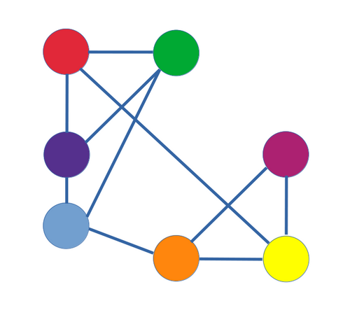
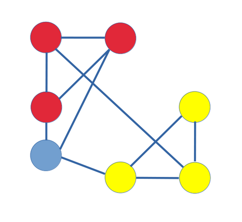
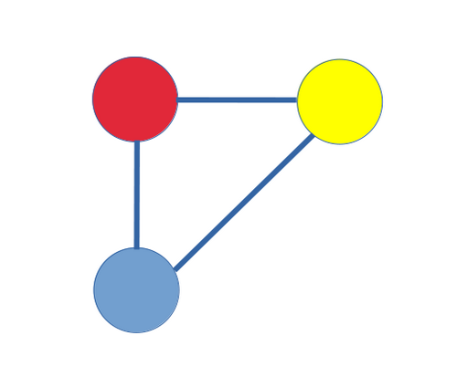

# Network Theory
The network theory is a part of graph theory. It defines networks as graphs where the vertices or edges possess attributes.  
Network theory analyses these networks over the symmetric relations or asymmetric relations between their (discrete) components.  

## Modularity
Modularity is a measure of the structure of networks or graphs which measures the strength of division of a network into modules (also called groups, clusters or communities).  
Networks with high modularity have dense connections between the nodes within modules but sparse connections between nodes in different modules.
https://en.wikipedia.org/wiki/Modularity_(networks)

## Louvain method
Louvain method is a greedy optimization method intended to extract non-overlapping communities from large networks created by Blondel et al. from the University of Louvain.  

### Modularity
The value to be optimized is modularity, defined as a value in the range $[-1,1]$ that measures the density of links inside communities compared to links between communities.

#### Modularity Algorithm
$$
{\displaystyle Q={\frac {1}{2m}}\sum _{i=1}^{N}\sum _{j=1}^{N}{\bigg [}A_{ij}-{\frac {k_{i}k_{j}}{2m}}{\bigg ]}\delta (c_{i},c_{j}),}
$$

- $A_{ij}$: the edge weight between nodes i and j.
⁠- $k_{i}, k_{j}$: the sum of the weights of the edges attached to nodes i and j, respectively.
- $m$: the sum of all of the edge weights in the graph.
- $N$: the total number of nodes in the graph.
⁠- $c_{i}, c_{j}$: the communities to which the nodes $i$ and $j$ belong.
- $\delta$: Kronecker delta function. $1$ if $c_i = c_j$ are the same cluster and $0$ otherwise.

Based on the above equation, the modularity of a community $c$ can be calculated as follows.
$$
{\displaystyle {\begin{aligned}Q_{c}&={\dfrac {1}{2m}}\sum _{i}\sum _{j}A_{ij}\mathbf {1} \left\{c_{i}=c_{j}=c\right\}-\left(\sum _{i}{\dfrac {k_{i}}{2m}}\mathbf {1} \left\{c_{i}=c\right\}\right)^{2}\\&={\frac {\Sigma _{in}}{2m}}-\left({\frac {\Sigma _{tot}}{2m}}\right)^{2} \end{aligned}}}
$$
- $\Sigma _{in}$: the sum of edge weights between nodes within the community $c$ (each edge is considered twice).
- $\Sigma _{tot}$: the sum of all edge weights for nodes within the community (including edges which link to other communities).
- $Q=\sum _{c}Q_{c}$

Note that $Q = \sum_c Q_c$ and $\delta =1$ only when $c_i$ and $c_j$ both belong to the community $c$ ($c_i = c_j = c$). Besides, due to Kronecker delta function, the very inside term is only calculated when $c_i = c_j = c$.

### The Louvain method algorithm
The Louvain method works by repeating two phases. 
1. Phase 1: nodes are sorted into communities based on how the modularity of the graph changes when a node moves communities. 
2. Phase 2: the graph is reinterpreted so that communities are seen as individual nodes.

  
    
   

1. Each node in the graph is randomly assigned to a singleton community.  
2. Nodes are assigned to communities based on their modularities.
3. Communities are reduced to a single node with weighted edges.

#### Phase 1
1. The Louvain method begins by considering each node $v$ in a graph to be its own community. (fist image)
2. For each node $v$, we consider how moving $v$ from its current community $C$ into a neighboring community $C'$ will affect the modularity of the graph partition. 
3. Select the community $C'$ with the greatest change in modularity, and if the change is positive, we move $v$ into $C$' otherwise we leave it where it is. (second image)

This continues until the modularity stops improving. Once this local maximum of modularity is hit, the first phase has ended. 

#### Phase 2
For each community in our graph's partition, the individual nodes making up that community are combined and the community itself becomes a node. The edges connecting distinct communities are used to weight the new edges connecting our aggregate nodes. (third image)

## Leiden algorithm
https://en.wikipedia.org/wiki/Leiden_algorithm#Modularity

## Graph Collaborative Filtering
https://dl.acm.org/doi/epdf/10.1145/3331184.3331267