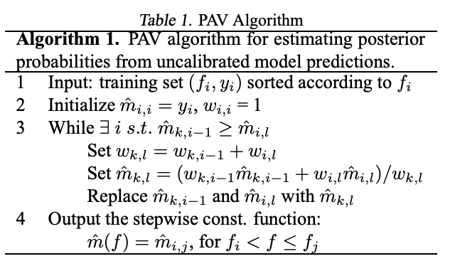

# Calibration
## Definition
Calibration is the degree to which the probabilities predicted by a classification model match the true frequencies of the target classes in a dataset.  
(모형의 예측값이, 실제 확률을 반영하는 것. 예를 들어, X 의 Y1 에 대한 모형의 출력이 0.8이 나왔을 때, 80 % 확률로 Y1 일 것라는 의미를 갖도록 만드는 것입니다.)  
For example, if we make a lot of predictions with a perfectly calibrated binary classification model, and then consider only those for which the model predicted a 70% probability of the positive class, then the model should be correct 70% of the time.  
Similarly, if we only consider the examples for which our model predicted a 10% probability of the positive class, the ground truth will turn out to indeed be positive in one-tenth of the cases.  
A well-calibrated model produces predictions that are closely aligned with the actual outcomes on aggregate.

Calibration cannot be evaluated with a single prediction.
You need many predictions to see whether actual accuracy matches predicted confidence.

### Example of Calibration (Ranking Model)
어떤 랭킹 모델이 사용자에게 보여줄 동영상 3개의 '클릭 확률(예측 점수 $s$)'을 다음과 같이 예측했다고 가정해 봅시다.

*   **동영상 A (게임 카테고리, 피처 $x_1$):** 예측 점수 $s = 0.8$ (1위)
*   **동영상 B (게임 카테고리, 피처 $x_1$):** 예측 점수 $s = 0.5$ (2위)
*   **동영상 C (뷰티 카테고리, 피처 $x_2$):** 예측 점수 $s = 0.8$ (공동 1위)

**문제점:** 랭킹 모델은 '동영상 A가 B보다 클릭될 확률이 높다(0.8 > 0.5)'는 **순위는 아주 잘 맞췄습니다**. 하지만 실제 과거 데이터를 까보니, 랭킹 모델이 0.8점이라고 예측한 게임 동영상의 **실제 클릭 확률(Ground Truth)**은 80%가 아니라 **고작 10%**였습니다. 반면, 뷰티 동영상은 똑같이 0.8점을 받았어도 실제 클릭 확률이 **30%**였습니다. 
만약 이 절대값(0.8)을 그대로 믿고 광고주가 입찰에 참여하면 실제 효율(10~30%)보다 훨씬 큰 돈을 쓰게 되어 큰 손해를 봅니다.

이 절대값의 오차를 고치기 위해, 순위를 고려하지 않고 무작정 실제 정답률에 맞춰 점수를 깎는 단순 후처리를 한다고 가정해 보겠습니다.
*   동영상 A 점수 조정: 0.8 $\rightarrow$ 실제 정답률인 **0.1**로 변경
*   동영상 B 점수 조정: 0.5 $\rightarrow$ (어떤 오차로 인해) **0.15**로 변경
*   **결과:** A가 B보다 순위가 높았는데($s_A > s_B$), 보정 후에는 B가 A보다 점수가 높아지는($s'_A < s'_B$) **치명적인 순위 역전(Distortion)**이 발생하여 추천 시스템이 망가집니다.

이제 논문에서 제안한 **단조 보정기(UMNN)**를 후처리 전담 모델로 투입합니다. 이 모델은 예측 점수 $s$뿐만 아니라 카테고리 같은 피처 $x$를 함께 입력받아 가장 똑똑하게 점수를 변환합니다.

*   **동영상 A ($s=0.8$, $x_1$=게임) 입력:** $\rightarrow$ UMNN이 게임 피처에 맞는 변환 곡선을 그려 보정 점수 **$s' = 0.10$** 출력
*   **동영상 B ($s=0.5$, $x_1$=게임) 입력:** $\rightarrow$ UMNN이 '단조 증가' 규칙(기울기 무조건 양수 강제)을 지키며 점수를 깎아 보정 점수 **$s' = 0.05$** 출력 
    *(💡 결과 1: 보정 후에도 $0.10 > 0.05$이므로 A와 B의 원래 순위가 완벽히 유지됨)*
*   **동영상 C ($s=0.8$, $x_2$=뷰티) 입력:** $\rightarrow$ 원래 점수는 A와 똑같은 0.8이었지만, 피처 $x$가 '뷰티'이므로 UMNN이 게임과 완전히 다른 맞춤형 변환 곡선을 적용하여 보정 점수 **$s' = 0.30$** 출력
    *(💡 결과 2: 같은 예측값이더라도 피처($x$)에 따라 실제 우도에 가장 가까운 서로 다른 값으로 유연하게 매핑됨)*

---

**결론적으로,**
사후 처리 전에는 광고주가 80% 확률인 줄 알고 과도한 입찰을 할 뻔했지만, UMC 모델이 후처리를 해준 덕분에 **① 동영상 간의 노출 순위는 전혀 망가뜨리지 않으면서도**, **② 실제 클릭 확률인 10%와 30%라는 정확한 절대값(Ground Truth)을 하위 시스템(광고 입찰 등)에 전달**할 수 있게 된 것입니다. 이것이 바로 본 논문이 고도화된 인경신경망(UMNN)을 이용해 달성하고자 하는 캘리브레이션의 완벽한 예시입니다.

## Binning
Binning is a data pre-processing technique used to reduce the effects of minor observation errors. The original data values which fall into a given small interval, a bin, are replaced by a value representative of that interval, often a central value (mean or median).  

<b> Uniform Binning </b>  
Splitting the interval into $n$ bins of equal width. It is great if you would like to equally assess the calibration throughout the entire interval, but it does not take into account that there might be some bins in which no or few samples will fall, making these bins statistically less significant than those in which plenty of data is contained.

<b> Quantile Binning </b>  
Generating $n$ bins by splitting the entire samples into $n$ quantiles. It guarantees that all the bins that you create are of similar size.  

## Accuracy vs Confidence vs Calibration 
- Accuracy measures the percentage of correct predictions made by the model. 
  - "How many predictions were correct"
- Confidence is the model’s average predicted probability. (in the bin)
  - "How strongly the model believed its predictions" 
- Calibration measures the alignment between the predicted probabilities and the actual likelihood of the predicted events. In other words, calibration is the comparison of measurement values delivered by a device under test(model) with those of a calibration standard of known accuracy.
  - "Whether accuracy = confidence" 

## Expected Calibration Error (ECE) vs Maximum Calibration Error(MCE)
$$
\mathrm{ECE} = \sum_{i=0}^{M} \frac{|B_i|}{N} \left| \,\overline{y}(B_i) - \overline{p}(B_i)\, \right|
$$
- $\overline{y}(B_i)$: the fraction of true positives inside the bin.
- $\overline{p}(B_i)$: mean predicted scores inside the bin.
- $|B_i|$: the number of samples inside the bin.
- $n$: the number of total samples.
- $M$: the number of bins.

ECE is the weighted average of the distance of the calibration curve of your model to the diagonal.

$$
\mathrm{MCE} = \max_{i \in (1,\ldots,M)} \left|\, \overline{y}(B_i) - \overline{p}(B_i)\, \right|
$$
MCE is the maximum distance between the calibration curve of the model and the diagonal.

## Scoring Rules
ECE and MCE cannot be used as a metric to be minimised in the training process of a classifier. This is because it could cause the model to output trivial, useless scores, such as giving a score of 0.5 to each of the samples on a balanced data set. 

Thus, in order to train a model it is more useful to consider proper scoring rules, which are calculated at the sample level rather than by binning the scores. The advantage of score rules is that their value depends both on how well the model is calibrated and how good it is at distinguishing classes, so obtaining low values for a proper scoring rule means that a model is good at discriminating and is also well-calibrated.  

Unfortunately, due to this very same nature, proper scoring rules might not be sufficient to evaluate if a model is calibrated, so the best thing to do is to combine them with ECE and MCE.

### Brier Score
$$
{\displaystyle BS={\frac {1}{N}}\sum \limits _{t=1}^{N}(f_{t}-o_{t})^{2}\,\!}
$$
- $f_{t}$ is the probability that was forecast at instance $t$
- $o_{t}$ is the actual outcome of the event at instance $t$
Check the differences between ECE.  

| Metric    | Compares                                  | Meaning                   |
| --------- | ----------------------------------------- | ------------------------- |
| **ECE**   | probability vs probability (bin accuracy) | Calibration only          |
| **Brier** | probability vs actual label (0/1)         | Calibration + Discrimination |

### Log-loss
$$
\mathrm{LL} = -\, y \log(\hat{p}) \;-\; (1 - y)\,\log(1 - \hat{p})
$$

### Example of Using Score Rules
| Prediction | True y | Brier Score         | Log-Loss             | ECE Meaning                          |
| ---------- | ------ | ------------------- | -------------------- | ------------------------------------ |
| **0.9**    | 1      | **0.01 (great)**    | **0.105 (great)**    | Good calibration if many 1s          |
| **0.9**    | 0      | **0.81 (very bad)** | **2.302 (very bad)** | Overconfident & wrong                |
| **0.5**    | 1      | **0.25 (medium bad)**       | **0.693 (medium bad)**       | Good calibration if balanced dataset |
| **0.5**    | 0      | **0.25 (medium bad)**       | **0.693 (medium bad)**       | Good calibration if balanced dataset |

## Calibration Methods
Calibration Methods are tools used to transform the scores generated by your models into (almost) real mathematical probabilities. 
### Platt Scaling
$$
P(y = 1 | f) = \frac{1}{1 + \exp(Af + B)}
$$
Platt Scaling is a logistic transformation of the classifier output $f(x)$, where $A$ and $B$ are two scalar parameters that are learned by the algorithm. 
Gradient descent is used to find $A$ and $B$ such that they are the solution to minimize the cross entropy loss of true (real) data and calibrated score(probability).
$$
\argmin_{A,B} \left\{ - \sum_{i} y_i \log(p_i) + (1 - y_i) \log(1 - p_i) \right\}, \quad
p_i = \frac{1}{1 + \exp(Af_i + B)}

$$

For example, check below table.
| Raw Score (f) | True Probability (P(y=1)) | Platt Output (\sigma(Af+B))             |
| ------------- | ------------------------- | --------------------------------------- |
| 0.3           | 0.10                      | $\sigma(A\cdot 0.3 + B) \approx 0.10$ |
| 1.2           | 0.40                      | $\sigma(A\cdot 1.2 + B) \approx 0.40$ |
| 2.0           | 0.70                      | $\sigma(A\cdot 2.0 + B) \approx 0.70$ |
| 3.0           | 0.90                      | $\sigma(A\cdot 3.0 + B) \approx 0.90$ |

### Isotonic Regression
Given a train set $(f_i, y_i)$, the Isotonic Regression problem is finding the isotonic function $\hat{m}$ such that stays as close as possible to the actual labels $y$.
$$
\hat{m} = \argmin_{z} \sum (y_i - z(f_i))^2
$$
- $z$: any candidate monotonic non-decreasing function(mapping scores → probabilities)
- $\hat{m}$: the optimal monotonic function that minimizes the squared error.

One method to find the optimum is using Pair-Adjacent Violators algorithm. PAV starts with each point as its own probability and repeatedly merges adjacent points until the calibration curve becomes monotonic and smooth.

   

- $\hat{m_{k,i-1}}$: the block starting at index $k$ and ending at $i−1$.
- $\hat{m_{i,l}}$: the block starting at index $i$ and ending at $l$.
- $\hat{w_{k,i-1}}$: the number of samples in the block $\hat{m_{k,i-1}}$.
- $\hat{w_{i,l}}$: the number of samples in the block $\hat{m_{i,l}}$.


```
initialize each sample as its own block
while there exist adjacent blocks (A,B) such that mean(A) > mean(B):
    merge A and B into a single block
```
See the following example.

<b> 1. the model scores and true labels </b>
| i | Score ( f_i ) | Label ( y_i ) |
| - | ------------- | ------------- |
| 1 | 0.10          | 0             |
| 2 | 0.20          | 1             |
| 3 | 0.30          | 0             |
| 4 | 0.40          | 1             |
| 5 | 0.50          | 1             |


<b> 2. Initial bins</b>  
| Bin | Indices | m̂ (mean) | w (weight) |
| --- | ------- | --------- | ---------- |
| B1  | [1–1]   | 0         | 1          |
| B2  | [2–2]   | 1         | 1          |
| B3  | [3–3]   | 0         | 1          |
| B4  | [4–4]   | 1         | 1          |
| B5  | [5–5]   | 1         | 1          |

<b> 3. PAV Applied </b>  
| Bin | Indices | m̂  | w |
| --- | ------- | --- | - |
| B1  | [1–1]   | 0   | 1 |
| B23 | [2–3]   | 0.5 | 2 |
| B4  | [4–4]   | 1   | 1 |
| B5  | [5–5]   | 1   | 1 |

$$
\hat{m} = \frac{1\cdot 1 + 1\cdot 0}{1+1} = 0.5 \\
w = 1 + 1 = 2
$$


<b> 4. Final Isotonic Regression result </b>
| Score Range | Estimated Probability |
| ----------- | --------------------- |
| 0.10        | 0                     |
| 0.20–0.30   | 0.5                   |
| 0.40–0.50   | 1.0                   |

$$
\hat{m}(f) =
\begin{cases}
0 & f = 0.10 \\
0.5 & 0.20 \le f \le 0.30 \\
1.0 & 0.40 \le f \le 0.50
\end{cases}
$$

### Beta calibration

### References
- https://www.cs.cornell.edu/~alexn/papers/calibration.icml05.crc.rev3.pdf
- https://www.abzu.ai/data-science/calibration-introduction-part-2/
- https://en.wikipedia.org/wiki/Isotonic_regression
- https://en.wikipedia.org/wiki/Platt_scaling


## Calibration in Recommendation
A classification algorithm is called calibrated if the predicted proportions of the various classes agree with the
actual proportions of data points in the available data. Analogously(Similarly), the goal of calibrated recommendations is to reflect the various interests of a user in the recommended list, and with their appropriate proportions.  


### Unconstrained Monotonic Calibration of Predictions in Deep Ranking Systems
랭킹 모델은 기본적으로 사용자에게 보여줄 아이템들의 '상대적인 순서(Relative order)'를 맞추는 데 최적화되어 있습니다. 그러다 보니 예측 점수의 상대적 크기는 맞더라도, 점수의 절대값 자체는 실제 일어날 확률(실제 우도)과 크게 어긋나는 경우가 많습니다. 하지만 광고 입찰이나 예상 수익 산출 같은 하위 작업(Downstream tasks)에서는 이 예측 점수가 실제 일어날 확률(예: 클릭률)과 정확히 일치해야 하므로, 랭킹 모델 학습이 끝난 이후에 별도의 검증용 데이터(Hold-out dataset)를 사용해 절대값을 교정하는 사후 처리가 필수적입니다.

이 논문에서는 예측값과 실제 값의 오차를 줄이되 Exponential Moving Average를 이용해 스무딩 하고, 이를 통해 실제값에 가깝게 캘리레이션 하도록 UMNN 신경망을 학습합니다. 그리고 이때 신경망의 예측값이 단조함수가 되어서 랭킹 변하지 않게 강제하기 위해서 도함수의 기울기가 항상 양수가 되도록 강제하는 테크닉이 들어갑니다. 조금 더 자세히 설명하면,정답과의 오차만 줄이려고 후처리를 강하게 하면, 랭킹 모델이 기껏 잘 맞춰놓은 아이템 간의 원래 순서가 뒤집히는 부작용(Distortion)이 발생할 수 있습니다. 따라서 캘리브레이션은 반드시 원래 예측값이 만들어낸 순위를 파괴하지 않아야 한다는 엄격한 전제 조건이 붙습니다. 

캘리브레이션 + 학습 부분 로직을 정리하면 아래와 같습니다.
1. 예측값과 실제 값의 오차를 줄이되 EMA로 스무딩: 연속적인 예측 확률을 구간별 방(그룹)으로 나누고, 그 안에서 '예측값 평균'과 '실제 정답 비율'의 오차(Squared differences)를 계산하여 줄여나갑니다. 이때 미니 배치의 크기가 작아 평균값이 요동치는 것을 막기 위해 지수 이동 평균(Exponential Moving Average) 기법을 사용해 과거의 값과 섞어 부드럽게(Smoothing) 업데이트합니다.
2. 실제값에 가깝게 예측하도록 UMNN 신경망 학습: 이렇게 계산된 오차(SCLoss)와 기존의 BCELoss를 결합한 최종 Loss를 역전파하여 UMNN 내부의 신경망 파라미터를 학습(업데이트)시킵니다. 이를 통해 랭킹 모델의 원래 점수가 실제 클릭 확률(실제 우도)에 훨씬 더 가까운 절대값으로 교정됩니다.
3. 도함수 기울기 양수 강제를 통한 단조 함수 생성 (랭킹 보존): 보정을 하느라 원래 모델이 잘 맞춰놓은 '상대적 순위'가 뒤집히는 것을 막기 위해, 신경망이 출력하는 도함수(기울기)에 활성화 함수(ELU)를 적용하여 무조건 0보다 큰 양수가 되도록 강제합니다. 기울기가 항상 양수인 함수를 적분하여 우상향하는 '단조 증가 함수(Monotonic function)'를 만듦으로써, 예측값이 변하더라도 원래의 랭킹 순서는 절대 변하지 않도록(Avoiding Distortion) 강력한 안전장치를 걸어둔 것입니다.

결과적으로, "순위를 절대 망가뜨리지 않는 안전한 선(단조성 강제) 안에서, 신경망을 이용해 가장 유연하게 오차를 스무딩하며 실제 확률값에 맞춰나가는 과정"이 이 논문(UMC 프레임워크)이 제안하는 핵심 솔루션입니다.


### References 
- Calibrated Recommendations: https://dl.acm.org/doi/pdf/10.1145/3240323.3240372
- Lirank: https://arxiv.org/pdf/2402.06859
- Deep Ensemble Shape Calibration: Multi-Field Post-hoc
Calibration in Online Advertising: https://arxiv.org/pdf/2401.09507
- Beyond Binary Preference: Leveraging Bayesian Approaches for Joint
Optimization of Ranking and Calibration: https://dl.acm.org/doi/pdf/10.1145/3637528.3671577
- A Self-boosted Framework for Calibrated Ranking: https://arxiv.org/pdf/2406.08010
- Unconstrained Monotonic Calibration of Predictions in Deep Ranking
Systems: https://dl.acm.org/doi/pdf/10.1145/3726302.3730105
- Unconstrained Monotonic Neural Networks: https://proceedings.neurips.cc/paper_files/paper/2019/file/2a084e55c87b1ebcdaad1f62fdbbac8e-Paper.pdf

## Expected Calibration Error (ECE)
머신 러닝 모델, 특히 확률을 출력하는 분류 모델의 신뢰도(calibration)를 평가하기 위한 지표입니다. ECE는 정확도(acc)와 신뢰도(conf)의 절대 차이에 대한 가중 평균을 구함으로써, 모델의 추정 "확률"이 실제(관측된) 확률과 얼마나 잘 일치하는지 측정합니다.

1. 확률 예측을 구간으로 나누기(Binning): 예측 확률들을 여러 개의 구간(bins)으로 나눕니다. 예를 들어, [0.0, 0.1), [0.1, 0.2), ..., [0.9, 1.0)와 같은 구간으로 나눌 수 있습니다.
2. 각 구간의 평균 확률과 정확도 계산: 각 구간에서 모델이 예측한 확률의 평균값(즉, bin의 평균 신뢰도)과 실제로 맞힌 예측의 비율(즉, bin의 정확도)을 계산합니다.
3. 각 구간의 Calibration Error 계산: 각 구간에 대해 신뢰도와 정확도의 차이를 계산합니다. 이를 각 bin의 calibration error라고 합니다.
4. 구간별 Calibration Error의 가중 평균 계산: 각 구간의 calibration error에 그 구간 내 샘플의 비율을 가중치로 곱한 후, 모든 구간에 대해 이를 합산합니다. 이 값이 Expected Calibration Error (ECE)가 됩니다.


$$ECE = \sum_{m=1}^{M} \frac{|B_m|}{n} \left| \text{acc}(B_m) - \text{conf}(B_m) \right|$$
- $M$: 구간(bin)의 개수
- $|B_m|$: 구간 $B_m$에 속한 샘플의 개수
- $n$: 전체 샘플의 개수
- $\text{acc}(B_m)$: 구간 $B_m$의 정확도(Accuracy)
- $\text{conf}(B_m)$: 구간 $B_m$의 평균 신뢰도(Confidence)