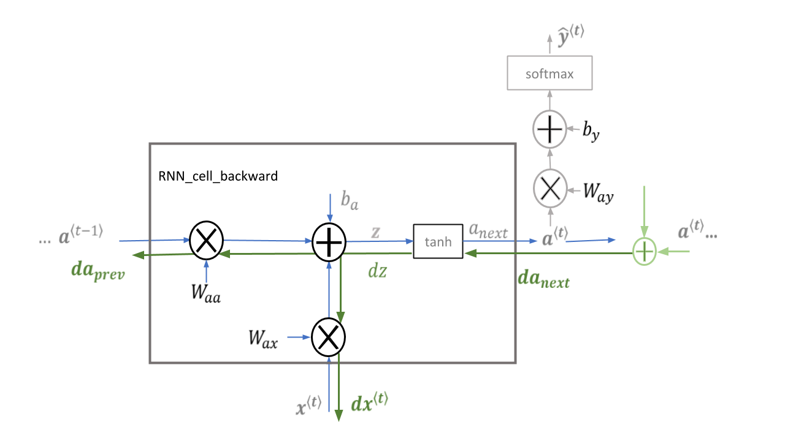

# Recurrent Neural Networks (RNN)
## Sequence Models
Sequence modeling trains neural network on chronologically ordered data to capture patterns and make predictions over time. More specifically, sequence models like recurrent neural networks process inputs as sequences, with each data point conditioned on those preceding it. The model iterates through data points, maintaining an encoded representation of the sequence history at each step. This sequential processing allows the model to learn complex time-based patterns like trends, seasonality, and long-range dependencies in data. The sequence model is trained to make predictions by estimating the probability distribution over next values, given the sequence of past context. This modeling of ordered data as interdependent steps enables the model to develop a sense of continuity and dynamics within data. By absorbing implicit rules about events unfolding over time, sequence models can gain limited foresight to make informed predictions about what may follow based on sequenced history. This time-based conditioning provides valuable context for inference compared to assessing data points independently. With extensive training over representative sequences, models can become skilled at leveraging the past to anticipate the future.

Sequence modeling is crucial to understand data that unfolds over time. Unlike static data, temporal sequences have complex time-based patterns like trends, cycles, and lagged effects. By processing data as interdependent sequenced steps, models can learn these nuanced time dynamics rather than viewing data points in isolation. This time-based conditioning enables models to make more contextual and accurate predictions and decisions — understanding how the past leads to the future. Sequence modeling has unlocked advancements in speech, text, video, forecasting, anomaly detection, and more.  

### Notation for Sequence Models - One Hot Encoding
The one-hot vector is a notation for describing training set(both $x,y$) for sequence data. It is a method for converting categorical variables into a binary format. It creates new columns for each category where $1$ means the category is present and $0$ means it is not. The primary purpose of One Hot Encoding is to ensure that categorical data can be effectively used in machine learning models. For example, in natural language processing, $(1 \times N)$ matrix (vector) used to distinguish each word in a vocabulary from every other word in the vocabulary. The vector consists of $0$ in all cells with the exception of a single $1$ in a cell used uniquely to identify the word. 

$$
\textbf{Label Encoding} \\
\begin{array}{|c|c|c|}
\hline
\textbf{Food Name} & \textbf{Categorical \#} & \textbf{Calories} \\
\hline
\text{Apple} & 1 & 95 \\
\text{Chicken} & 2 & 231 \\
\text{Broccoli} & 3 & 50 \\
\hline
\end{array} \\[5pt]

\textbf{One Hot Encoding} \\
\begin{array}{|c|c|c|c|}
\hline
\textbf{Apple} & \textbf{Chicken} & \textbf{Broccoli} & \textbf{Calories} \\
\hline
1 & 0 & 0 & 95 \\
0 & 1 & 0 & 231 \\
0 & 0 & 1 & 50 \\
\hline
\end{array}
$$


## Basics of RNN
In artificial neural networks, recurrent neural networks (RNNs) are designed for processing sequential data, such as text, speech, and time series, where the order of elements is important. Since sequential data are stored in one hot vectors, we need to build a network that can learn the mapping from $x$ to $y$.  

There are several reasons why standard network are not used for sequential data.
 - Inputs, outputs can be different lengths in different examples.
- Doesn’t share features learned across different positions of text. For example, from the input data, if the word "Harry" appeared in earlier position, $x^{<1>}$, this gives a sign that "Harry" is a person's name. So it would be nice if the network figured out that "Harry" in other later position is also could be person's name.
- Also you can reduce computational cost by reducding the number of parameters in the model.

This is because, Unlike feedforward neural networks, which process inputs independently, RNNs utilize recurrent connections, where the output of a neuron at one time step is fed back as input to the network at the next time step. This enables RNNs to capture temporal dependencies and patterns within sequences.

### Architecture of RNN

RNNs share similarities in input and output structures with other deep learning architectures but differ significantly in how information flows from input to output. Unlike traditional deep neural networks where each dense layer has distinct weight matrices. RNNs use shared weights across time steps, allowing them to remember information over sequences. So from the image above, weights $U,W,V$ are all same paramters shared across all time steps.  
At each time step, RNNs process units($h$) with a fixed activation function. These units have an internal hidden state that acts as memory that retains information from previous time steps. This memory allows the network to store past knowledge and adapt based on new inputs. So when making prediction for $y^{<k>}$ in RNN, it gets information from not only $x^{<k>}$ but also information from previous time steps $x^{<1>} \sim x^{<k-1>}$.

## Forward propagaion of RNN

From the above picture describing the forward propagation of RNN, let's see how the forward propagation works in first layer of RNN. Note that instead of using parameters notation $W,V,U$, we use notation like $W_{aa}$ for parameters to make it more clear.
$$
a^{\langle 0 \rangle} = \vec{0} (\text{zero vector}) \\[5pt]
a^{\langle 1 \rangle} = g_1(W_{aa} a^{\langle 0 \rangle} + W_{ax} x^{\langle 1 \rangle} + b_a) \quad (g_1 = \text{tanh or ReLU}) \\[5pt]
\hat{y}^{\langle 1 \rangle} = g_2(W_{ya} a^{\langle 1 \rangle} + b_y)
\quad (g_2 = \text{sigmoid, activation depends on type of output}) 
$$
More generally, 
$$
a^{\langle t \rangle} = g(W_{aa} a^{\langle t-1 \rangle} + W_{ax} x^{\langle t \rangle} + b_a) \\[5pt]
\hat{y}^{\langle t \rangle} = g(W_{ya} a^{\langle t \rangle} + b_y)
$$
1. Compute the hidden state with tanh activation: $a^{\langle t \rangle} = \tanh(W_{aa} a^{\langle t-1 \rangle} + W_{ax} x^{\langle t \rangle} + b_a)$.
2. Using your new hidden state $a^{\langle t \rangle}$, compute the prediction $\hat{y}^{\langle t \rangle} = g(W_{ya} a^{\langle t \rangle} + b_y)$. $g$ is softmax function.
3. Store $(a^{\langle t \rangle}, a^{\langle t-1 \rangle}, x^{\langle t \rangle}, parameters)$ in cache.
4. Return $a^{\langle t \rangle}$ , $y^{\langle t \rangle}$ and cache. (cache will be used in backpropagtaion)

Note that a set of weights(parameters) uses for each time steps are shared. First, parameter $W_{ax}$ goverens the connection between $x$ and $a$ (hidden layer) on every time step, secondly, the horizontal activation connection is governend by $W_{aa}$ on every time step. Lastly, $W_{ya}$ goverens the connection between output and hidden layer on every time step.  
The notation convention behind is that for $W_{ax}$, the second index $x$ indicates that $W_{ax}$ will be multipied by some $x$ quantity and the first index $a$ indicates that $W_{ax}$ is used to compute output $a$ quantity. 
$$a \leftarrow W_{ax} x^{\langle 1 \rangle}$$

We can simplified the below RNN notation that first introduced above. 

Suppose $a \in \mathbb{R}^{100}$ and $x \in \mathbb{R}^{10000}$, therefore $W_{aa} \in \mathbb{R}^{(100 \times 100)}$ and $W_{ax} \in \mathbb{R}^{(100 \times 10000)}$.
$$
a^{\langle t \rangle} = g(W_{aa} a^{\langle t-1 \rangle} + W_{ax} x^{\langle t \rangle} + b_a) \\
= g \left( W_a \begin{bmatrix} a^{\langle t-1 \rangle}, x^{\langle t \rangle} \end{bmatrix} + b_a \right)
$$
Let's understand the the simplified notation of $a^{\langle t \rangle}$ above. First, by putting two matrices $W_{aa}$ and $W_{ax}$ side by side horizontally. 
$$W_a = \left[ W_{aa} \, \big| \, W_{ax} \right] \in \mathbb{R}^{(100 \times 10100)}$$ 
Secondly, similarly, take two vector $a$ and $x$ and stack together.
$$
\left[ a^{\langle t-1 \rangle},\ x^{\langle t \rangle} \right]
= \left[\begin{array}{c} a^{\langle t-1 \rangle} \\ - \\ x^{\langle t \rangle}\end{array} \right] \in \mathbb{R}^{(10100)}
$$
To sum up, we can interprete as below.
$$
W_a \begin{bmatrix} a^{\langle t-1 \rangle}, x^{\langle t \rangle} \end{bmatrix} = \left[ W_{aa} \, \big| \, W_{ax} \right] \times \left[\begin{array}{c} a^{\langle t-1 \rangle} \\ - \\ x^{\langle t \rangle}\end{array} \right]
$$ 


## Back propagation of RNN (Backpropagation Through Time, BPTT)


$$
\begin{align}
\displaystyle a^{\langle t \rangle} &= \tanh(W_{ax} x^{\langle t \rangle} + W_{aa} a^{\langle t-1 \rangle} + b_{a})\tag{-} \\[8pt]
\displaystyle \frac{\partial \tanh(x)} {\partial x} &= 1 - \tanh^2(x) \tag{-} \\[8pt]
\displaystyle {dtanh} &= da_{next} * ( 1 - \tanh^2(W_{ax}x^{\langle t \rangle}+W_{aa} a^{\langle t-1 \rangle} + b_{a})) \tag{0} \\[8pt]
\displaystyle  {dW_{ax}} &= dtanh \cdot x^{\langle t \rangle T}\tag{1} \\[8pt]
\displaystyle dW_{aa} &= dtanh \cdot a^{\langle t-1 \rangle T}\tag{2} \\[8pt]
\displaystyle db_a& = \sum_{batch}dtanh\tag{3} \\[8pt]
\displaystyle dx^{\langle t \rangle} &= { W_{ax}}^T \cdot dtanh\tag{4} \\[8pt]
\displaystyle da_{prev} &= { W_{aa}}^T \cdot dtanh\tag{5}
\end{align}
$$

Note that $da_{next}$ is $\frac{\partial{J}}{\partial a^{\langle t \rangle}}$ and it includes loss from previous stages(horizontal loss) and loss from current stage output logic(vertical loss). So you need to understand the calculation not only from top to bottom in the same time step, but also from right to left(horizontal loss), going backward in time steps. This special backprogation is called Backpropagation Through Time, BPTT.  

The loss function for each time step can be calculated as below, using cross-entropy loss.(it can be other loss function of course)
$$
\ell_{t} = \mathcal{L}^{\langle t \rangle}(\hat{y}^{\langle t \rangle}, y^{\langle t \rangle}) = - y^{(t)} \log \hat{y}^{\langle t \rangle} - (1 - y^{(t)}) \log (1 - \hat{y}^{\langle t \rangle}) \\[5pt]
\mathcal{L}(\hat{y}, y) = \sum_{t=1}^{T_y} \mathcal{L}^{\langle t \rangle}(\hat{y}^{\langle t \rangle}, y^{\langle t \rangle})
$$
Just like backpropagation of standard neural network, take the derivatives with respect to all the parameters using gradient descent algorithm to the opposite direcions to all the forward propagation. 

### Vertical and Horizontal Loss in RNN

Let's say that $S_t$ represents the hidden state (memory) at time $t$, $X_t$ iss the input at time $t$ and $Y_t$ is the output at time $t$. $W_s, W_x, W_y$ are weight matrices for hidden states, inputs and outputs, respectively.
Each time step($t = 1 \sim 3$), both vertical and horizontal loss can be calcualated as below. 

<b>Time Step 3</b>
$$
\displaystyle
da_{next} = \frac{\partial \mathcal{L}}{\partial s_{3}}
= \underbrace{%
\color{#268bd2}{\frac{\partial \ell_{3}}{\partial s_{3}}}%
}_{\text{only vertical}}
$$
<b>Time Step 2</b>
$$
\displaystyle
da_{next} = \frac{\partial \mathcal{L}}{\partial s_2}
=
\underbrace{\color{#268bd2}{\frac{\partial \ell_2}{\partial s_2}}}_{\text{vertical}}
\;+\;
\underbrace{\frac{\partial \ell_{3}}{\partial s_3}\,\frac{\partial \mathcal{s_3}}{\partial s_2}}_{\text{horizontal via }s_3}
$$

<b>Time Step 1</b>
$$
da_{next} = \displaystyle
\frac{\partial \mathcal{L}}{\partial s_{1}}
=
\underbrace{%
\color{#268bd2}{\frac{\partial \ell_{1}}{\partial s_{1}}}%
}_{\text{vertical}}
\;+\;
\underbrace{%
\frac{\partial \ell_{2}}{\partial s_{2}}\;\frac{\partial \mathcal{s_2}}{\partial s_1}
}_{\text{horizontal via } s_{2}}
\;+\;
\underbrace{%
\frac{\partial \ell_{3}}{\partial s_{3}}\frac{\partial \mathcal{s_3}}{\partial s_2} \frac{\partial \mathcal{s_2}}{\partial s_1}
}_{\text{horizontal via } s_{3}}
$$

## Types of RNNs

1. One-to-One RNN
This is the simplest type of neural network architecture where there is a single input and a single output. It is used for straightforward classification tasks such as binary classification where no sequential data is involved. (standard NN and no need to be RNN)

2. One-to-Many RNN
In a One-to-Many RNN the network processes a single input to produce multiple outputs over time. This is useful in tasks where one input triggers a sequence of predictions (outputs). For example music generation.

3. Many-to-One RNN
The Many-to-One RNN receives a sequence of inputs and generates a single output. This type is useful when the overall context of the input sequence is needed to make one prediction. In sentiment analysis the model receives a sequence of words (like a sentence) and produces a single output like positive, negative or neutral.

4. Many-to-Many RNN
The Many-to-Many RNN type processes a sequence of inputs and generates a sequence of outputs. In language translation task a sequence of words in one language is given as input and a corresponding sequence in another language is generated as output.

## Language Model
A language model is a model of the human brain's ability to produce natural language. Language models are useful for a variety of tasks, including speech recognition, machine translation, natural language generation and so on. Given sentence, language model tells you what is the probability of a sentence of that particular sentence. In other words, The chance that the next sentence you read somewhere out there in the world will be a particular sentence.  
For example, a speech recognition system picks the sentence is using language modeling by calculating the probability the candidate sentences.
$$
\begin{aligned}
P(\text{The apple and pair salad}) &= 3.2 \times 10^{-13} \\
P(\text{The apple and pear salad}) &= 5.7 \times 10^{-10} \\
\end{aligned}
$$
With these probabilities, the second sentence is more likely to be the sentence.
$$
\begin{aligned}
P(\text{sentence}) &= P(y^{\langle 1 \rangle}, y^{\langle 2 \rangle}, \ldots, y^{\langle T_y \rangle})
\end{aligned}
$$
More specifically, what a language model does is that it estimates the particular probability of the sequence of words($y^{<T_k>}$).

### Language Model with LLM(Large Language Model)
Large language models (LLMs), currently their most advanced form, are predominantly based on transformers trained on larger datasets (frequently using texts scraped from the public internet). They have superseded recurrent neural network-based models, which had previously superseded the purely statistical models, such as the word n-gram language model.

A large language model (LLM) is a language model trained with self-supervised machine learning on a vast amount of text, designed for natural language processing tasks, especially language generation. The largest and most capable LLMs are generative pretrained transformers (GPTs), which are largely used in generative chatbots such as ChatGPT, Gemini or Claude.

### Language Model with RNN
But we will focus on Language Model using RNN in this page.

#### Tokenization and Vectorization
To build a RNN model for NLP, you need to tokenize the input sentences from large training set corpus.  
Tokenization means that forming a vocabulary and map each of the words from the input sentences to one-hot vectors on indices in the vocabulary. It involves dividing a string or text into a list of smaller units known as tokens. Note that token is words or sub-words in the context, so a word is a token in a sentence.  
Vectorization is to define a good numerical measure to characterize these texts.

See below exmaple that applying tokenization and vectorization to input sentenc.
```
Texts: 'The mouse ran up the clock' and 'The mouse ran down'

Tokenization:
['the', 'mouse', 'ran', 'up', 'clock']
['the', 'mouse', 'ran', 'down']

Vectorization:
Index assigned for every token: {'the': 7, 'mouse': 2, 'ran': 4, 'up': 10,
  'clock': 0, 'the mouse': 9, 'mouse ran': 3, 'ran up': 6, 'up the': 11, 'the
clock': 8, 'down': 1, 'ran down': 5}

One-hot encoding: 
'The mouse ran up the clock' = [1, 0, 1, 1, 1, 0, 1, 1, 1, 1, 1, 1]
```
When you formed a vocabulary form top 10,000 common words and if there is a word that not in your vocabulary, you can use <UNK> unknown token to replace that word. Also you can add extra token <EOS> that stands for end of the sentence.

##### Types of Tokenization
###### Word Tokenization
Word tokenization is the most commonly used method where text is divided into individual words. It works well for languages with clear word boundaries, like English. For example "Machine learning is fascinating" becomes,

```md
# Input before tokenization
["Machine Learning is fascinating"]

# Output when tokenized by word
["Machine", "learning", "is", "fascinating"]
```
###### Character Tokenization
In Character Tokenization, the textual data is split and converted to a sequence of individual characters. This is beneficial for tasks that require a detailed analysis, such as spelling correction or for tasks with unclear boundaries. It can also be useful for modelling character-level language. For example,

```md
# Input before tokenization
["You are helpful"]

# Output when tokenized by characters
["Y", "o", "u", " ", "a", "r", "e", " ", "h", "e", "l", "p", "f", "u", "l"]
```

###### Sub-word Tokenization
This strikes a balance between word and character tokenization by breaking down text into units that are larger than a single character but smaller than a full word. This is useful when dealing with morphologically rich languages or rare words. For example,
```md
["Time", "table"] 
["Rain", "coat"] 
["Grace", "fully"] 
["Run", "way"] 
```

Sub-word tokenization helps to handle out-of-vocabulary words in NLP tasks and for languages that form words by combining smaller units.

###### Sentence Tokenization
Sentence tokenization is also a common technique used to make a division of paragraphs or large set of sentences into separated sentences as tokens. This is useful for tasks requiring individual sentence analysis or processing. For example,
```md
# Input before tokenization
["Artificial Intelligence is an emerging technology. Machine learning is fascinating. Computer Vision handles images. "]

# Output when tokenized by sentences
["Artificial Intelligence is an emerging technology.", "Machine learning is fascinating.", "Computer Vision handles images."]
```

######  N-gram Tokenization
N-gram tokenization splits words into fixed-sized chunks (size = $n$) of data. For example,
```md
# Input before tokenization
["Machine learning is powerful"]
# Output when tokenized by bigrams ($n=2$)
[('Machine', 'learning'), ('learning', 'is'), ('is', 'powerful')]
```
#### Build RNN in NLP

Let's say there's an input sentence "Cats average 15 hours of sleep a day. <EOS>" So there is 9 words = 9 tokens, including <EOS>.
At time 0, you compute activation $a^{<1>}$, as a function of an input $x^{<1>}$, which is just zero vector. What activation $a^{<1>}$ does is to make softmax prediction to figure out what is the probability of the first word $\hat{y}^{<1>}$.  
So in this step, softmax is trying to predict what is the chance of the first word is "a"($P("a")$) and the chance of first word is "aaron" ($P("aaron")$) ... $P("cats")$ ... all the way to $P("<EOS>")$.  
Then RNN forward to the next step and job of activation $a^{<1>}$ is to predict what is the second word, but now you give activation $a^{<1>}$ correct first word $y^{<1>}$, which is "cats". Note that you can see that $x^{<2>} = y^{<1>}$. The output of second step is again predicted by softmax, what is the chance of the word is "aaron" ($P("aaron")$) ... $P("cats")$ ... all the way to $P("<EOS>")$, given what had come previously($P(-| "cats")$). Then you go to next step and do the same task, but to predict what is the third word given the previous two words, ("cats, averages"). So $x^{<3>} = y^{<2>}$ and the output is the probability of any words in the vocabulary given the previous two words ($P(-| "cats averages")$). You repeat until time step $9$, hopefully predict that there's high chance of "<EOS>".   
So each step of RNN, you look at the sets of preceeding words and predict the distribution of the next word. So RNN learns one word at a time from left to right.  
Next is to train this network using loss function.
$$
\begin{aligned}
\mathcal{L}(\hat{y}^{\langle t \rangle}, y^{\langle t \rangle}) &= - \sum_i y_i^{\langle t \rangle} \log \hat{y}_i^{\langle t \rangle} \\
\mathcal{L} &= \sum_t \mathcal{L}^{\langle t \rangle}(\hat{y}^{\langle t \rangle}, y^{\langle t \rangle})
\end{aligned}
$$
At a certain time $t$, $y^{<t>}$ is the true word and $\hat{y}^{<t>}$ is the softmax prediction word, apply softmax loss function (cross-entropy loss function). The overall loss is the sum over all time steps of the loss associated with the individual predictions($y_i$). 

If you train this RNN with large data sets, what RNN will be able to do is, given any initial set of words, such as "cat average 15 hours of", it can predict what is the chance of the next word.
Also when there is a sentence with three words ($y^{<1>}$, $y^{<2>}$, $y^{<3>}$), the chance of this entire sentence will be, multiply of three probabilities. 
$$
\begin{aligned}
P(y^{\langle 1 \rangle}, y^{\langle 2 \rangle}, y^{\langle 3 \rangle}) 
&= P(y^{\langle 1 \rangle}) \, P(y^{\langle 2 \rangle} \mid y^{\langle 1 \rangle}) \, P(y^{\langle 3 \rangle} \mid y^{\langle 1 \rangle}, y^{\langle 2 \rangle})
\end{aligned}
$$

#### Sampling Novel Sequences

Using RNN Language model, you can generate a randomly chosen sentence. The network is trained using the structure at the top, which is the sequence model we learned. But when sample to generate novel sequences, what you do is slightly differnet.  
From the first time step, you will have the output vector of softmax probability over possible words same as general sequence model. This output is a vector that gives you what is the chance of the first word is "a"($P("a")$) and the chance of first word is "aaron" ($P("aaron")$) ... $P("cats")$ ... all the way to $P("<EOS>")$.  Then the difference is that you take this vector and randomly sample according to the softmax distribution so that you can get the first word. (from above pictrue "the")  
Next step, unlike the general sequence model that use true $y^{<t>}$ as input, use the sampled word from previous time step $\hat{y}^{<t>}$ as an input to the time step. Since the input is "the" from the picture the output is the chance of whatever the second word is given the first word is "the", $P( - | "the" )$. Then again you sample a word from the softmax distribution output vector and use it to the input to next time step. Keep going until reach the last time step. You can tell the sequence ended when the <EOS> token is generated or just by limiting the time step.


### Character-Level Language Model
You can build a language model not only word-level but character-level too. In character-level RNN, the vocabulary is just alphabets(with digits, punctuation and so on). In character-level RNNs, the behavior is the same as word-level RNN. 
During training, we still use the true character $y^{<t-1>}$ as input to time step $t$ until the last time step.

Both models use use the same RNN architecture (or LSTM/GRU). They use teacher forcing during training — meaning they feed the true token (word or character) from the previous timestep as input to the next timestep. During inference (sampling), they use the predicted token $\hat{y}^{<t>}$ as the next input.

Good thing about character-level model is that you don't have to worry about UNK token. But disadvantage is that when longer sequences, it is not as good as word-level language model at capturing long-range dependencies between the early parts of the sentence and the later parts of sentence. There are more tokens than word-level model in the sentence. For example, if the sentence is composed of 10 or 20 words, but the number of characters will be much more. Also character-level model is computationally more expensive than word-level model.

## Vanishing Gradients with RNNs
Think of a case when language have very long term dependency as below. This is the case that the word from very early can affect what needs to come much later in the sentence.
```
The cat, which ~~~~~, was full.
The cat, which ~~~~~, were full.
```
Basic RNN is not very good at capturing this kind of very long-term dependencies. This is because of the vaninshing gradient problem from very deep neural network.
Putting simply, the gradient from output layer would have a hard time propagating back to affect the weights of the earlier layers. This problem occurs in RNN network too. So in practice it is difficult for the RNN network to memorize the earlier context of the sentence(plural noun or single noun) to use in the later sequence.  
So because of vanishing gradient problem, basic RNN has many local influences (output is mainly influenced by close input values). Difficult for error to backpropagate all the way to the beginning of the sequence and therfore to modify how the neural network is doing the computations earlier in the sequence.

One thing to note is that there could be also exploding gradient problem. But it turns out that exploding gradient problem is much easier to deal with because the parameters jus blow up and cause numerical overflow(NaN(Not a Number)) in computation. One solution to exploding gradient problem is applying gradient clipping, which is when loooking at the gradient and if it is bigger that some threshold, rescale it so that it is not too big. So it is clipped to some maximum value. But vanishing gradient problem much harder to solve.

## Gated Reccurent Unit (GRU)
Gated Reccurent Unit is modification of hidden layer in RNN to work better at capturing long-range connections and help out with the vanishing gradient problem.  
The core idea behind GRUs is to use gating mechanisms to selectively update the hidden state at each time step allowing them to remember important information while discarding irrelevant details. GRUs aim to simplify the LSTM architecture by merging some of its components and focusing on just two main gates: the update gate and the reset gate.

### Simplified GRU
Remind you that from previous RNN, $c^{<t>}$ is memory cell which provides memory to remember the previous context. In GRU memory cell is same as output activation, $a^{<t>}$.
$$
a^{\langle t \rangle} = g(W_{aa} a^{\langle t-1 \rangle} + W_{ax} x^{\langle t \rangle} + b_a) = g \left( W_a \begin{bmatrix} a^{\langle t-1 \rangle}, x^{\langle t \rangle} \end{bmatrix} + b_a \right)
$$
Below is the architecture of simplified version of GRU.
$$
\begin{aligned}
\tilde{c}^{\langle t \rangle} &= \phi \left( W_c \left[ c^{\langle t-1 \rangle},\ x^{\langle t \rangle} \right] + b_c \right) \\
\Gamma_u &= \sigma \left( W_u \left[ c^{\langle t-1 \rangle},\ x^{\langle t \rangle} \right] + b_u \right) \\
c^{\langle t \rangle} &= \Gamma_u\odot \tilde{c}^{\langle t \rangle} + \left(1 - \Gamma_u \right) \odot c^{\langle t-1 \rangle} \\
\hat{y}^{\langle t \rangle} &= \mathcal{S}(W_{yc} c^{\langle t \rangle} + b_y) \\
\end{aligned} \\[5pt]

x_{t}: \text{input vector of GRU} \\
c_{t}: \text{output vector from GRU, memory cell} \\
{\hat {c}}_{t}: \text{candidate activation vector of GRU} \\
\Gamma_u: \text{update vector} \\
W_c, W_u, b_c, b_u: \text{parameter matrices and vector} \\
{\displaystyle \odot }: \text{element-wise producet} \\ 
\sigma: \text{sigmoid function} \\
\phi: \text{hyperbolic tangent}
\mathcal{S}: \text{softmax}
$$

- $\Gamma_u$ - Update gate
  - The update gate controls how much of the new information $x^{<t>}$ should be used to update the activation unit.
  - Since it uses sigmoid function, for the most possible range of input range, the output of sigmoid function is either very very close to $0$ or $1$. So for intuition, you can think of $\Gamma_u^{\langle t \rangle}$ to be either $0$ or $1$.
- ${\hat {c}}^{<t>}$ - Candidate activation unit
  - This is the potential new activation unit calculated based on the current input and the previous activation unit.
- $c^{<t>}$ - Activation unit
  - The final activation unit is a weighted average of the previous activation unit $c^{<t-1>}$ and the candidate hidden state ${\hat {c}}^{<t>}$ based on the update gate $\Gamma_u^{\langle t \rangle}$. 
  - If the update gate $\Gamma_u^{\langle t \rangle}$ is close to $1$, activation value is equal to candidate activation value and this incates updating the bit. If the update gate is close to $0$, it means don't updating and hang on to the old value.


### Full GRU
$$
\begin{aligned}
\tilde{c}^{\langle t \rangle} &= \phi\left( W_c \left[ \Gamma_r * c^{\langle t-1 \rangle},\ x^{\langle t \rangle} \right] + b_c \right) \\
\Gamma_u &= \sigma \left( W_u \left[ c^{\langle t-1 \rangle},\ x^{\langle t \rangle} \right] + b_u \right) \\
\Gamma_r &= \sigma \left( W_r \left[ c^{\langle t-1 \rangle},\ x^{\langle t \rangle} \right] + b_r \right) \\
c^{\langle t \rangle} &= \Gamma_u * \tilde{c}^{\langle t \rangle} + (1 - \Gamma_u) * c^{\langle t-1 \rangle}
\end{aligned} \\[5pt]

x_{t}: \text{input vector of GRU} \\
c_{t}: \text{output vector from GRU, memory cell} \\
{\hat {c}}_{t}: \text{candidate activation vector of GRU} \\
\Gamma_u: \text{update vector} \\
\Gamma_r: \text{reset vector}
W_c, W_u, b_c, b_u: \text{parameter matrices and vector} \\
{\displaystyle \odot }: \text{element-wise producet} \\ 
\sigma: \text{sigmoid function} \\
\phi: \text{hyperbolic tangent}
$$
The full GRU is simplified GRU with 'reset gate' $\Gamma_r^{\langle t \rangle}$. The reset gate is also applied to candidate activation unit $\tilde{c}^{\langle t \rangle}$. The reset gate determines how much of the previous activation unit $c^{<t>}$ should be forgotten.

## Long Short Term Memory Unit (LSTM)
The other way to deal with the very long range connection is LSTM, which is even powerful than GRU.
LSTMs can capture long-term dependencies in sequential data making them ideal for tasks like language translation, speech recognition and time series forecasting. 
$$
\begin{aligned}
\tilde{c}^{\langle t \rangle} &= \phi \left( W_c \left[ a^{\langle t-1 \rangle},\ x^{\langle t \rangle} \right] + b_c \right) \\
\Gamma_u &= \sigma \left( W_u \left[ a^{\langle t-1 \rangle},\ x^{\langle t \rangle} \right] + b_u \right) \\
\Gamma_f &= \sigma \left( W_f \left[ a^{\langle t-1 \rangle},\ x^{\langle t \rangle} \right] + b_f \right) \\
\Gamma_o &= \sigma \left( W_o \left[ a^{\langle t-1 \rangle},\ x^{\langle t \rangle} \right] + b_o \right) \\
c^{\langle t \rangle} &= \Gamma_u * \tilde{c}^{\langle t \rangle} + \Gamma_f * c^{\langle t-1 \rangle} \\
a^{\langle t \rangle} &= \Gamma_o * c^{\langle t \rangle} \\
\hat{y}^{\langle t \rangle} &= \mathcal{S}(W_{ya} a^{\langle t \rangle} + b_y)
\end{aligned}
$$

LSTM architectures involves the memory cell which is controlled by three gates:
 - Input gate($\Gamma_u$): Controls what information is added to the memory cell (activation unit).
 - Forget gate($\Gamma_f$): Determines what information is removed from the memory cell.
 - Output gate($\Gamma_o$): Controls what information is output from the memory cell.

This architecture allows LSTM networks to selectively retain or discard information as it flows through the network which allows them to learn long-term dependencies. The network has a hidden state which is like its short-term memory. This memory is updated using the current input, the previous hidden state and the current state of the memory cell.

One technical deatil is that since LSTM uses elementwise operations between gates and memory cell, $k$-th element of $c^{\langle t \rangle}$ only affects the $k$-th element of the corresponding gates, $\Gamma_u, \Gamma_f, \Gamma_o$. So not every element of $k$-dimensional $c^{\langle t \rangle}$ can affect all elements of the gates.

Note that while GRU memory cell is same as output activation, $a^{<t>} = c^{<t>}$, LSTM has seperated activation output and memory cell.

### GRU vs LSTM
- GRU
  - Simplified version of complicated LSTM.
  - Simple and easy to build a much bigger model.
  - Computationally runs faster and scalable to build bigger models.
- LSTM
  - More powerful.
  - More flexible. (3 gates)
  - Historically proven.

## Bidirectional RNN (BRNN)
Bidirectional recurrent neural networks (BRNN) connect two hidden layers of opposite directions to the same output. With this form of generative deep learning, the output layer can get information from past (backwards) and future (forward) states simultaneously.


As you can see from the picture, forward propagation partially from left to right and partially from right to left. The disadvantage is that you need entire sequence of the data before making prediction. So when speech recognition, you have to wait to finish speech to process speech recognition. (Need more complex bidirectional RNN for real time speech recognition)

## Deep RNN
For learning very complex functions, it is useful to stack multiple RNN layers to build deeper version of RNN network.

As from the picture, you can build network combined with RNN and FCNN. It shows 3 layers of RNN followed by FCNN.