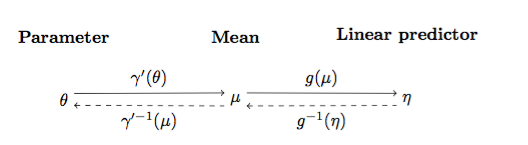
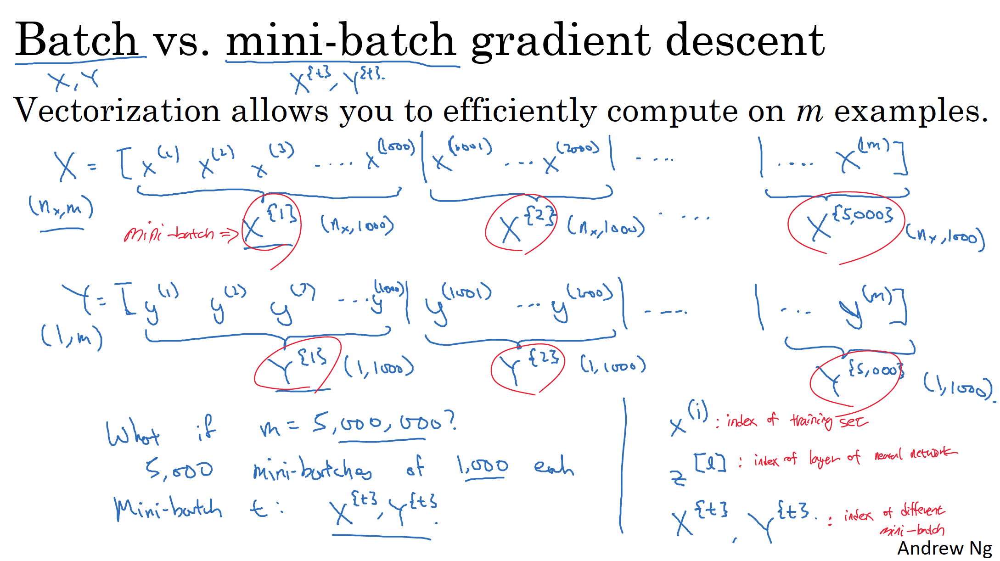
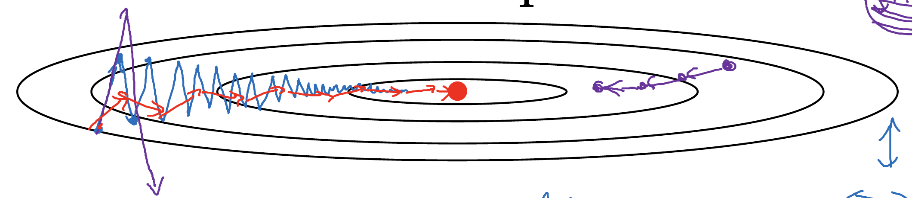
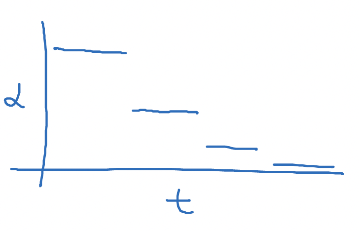
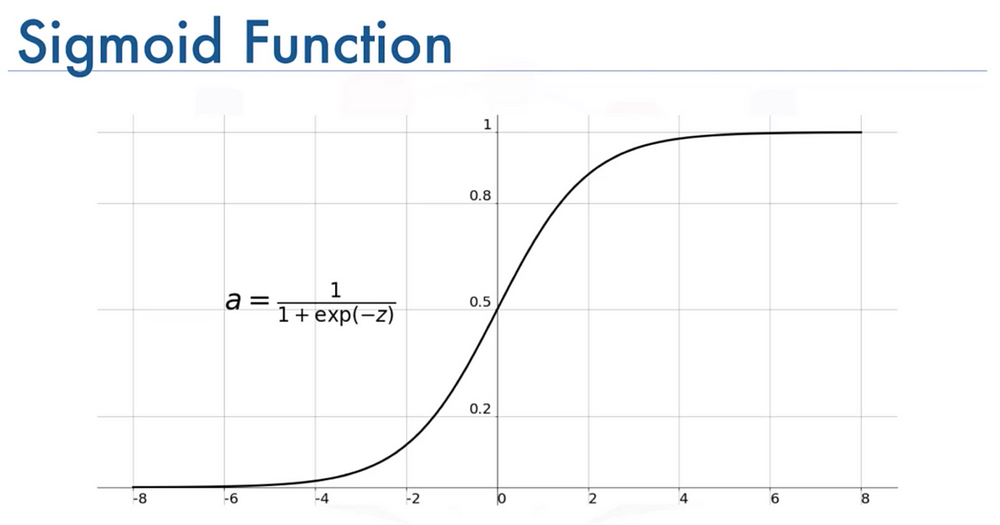
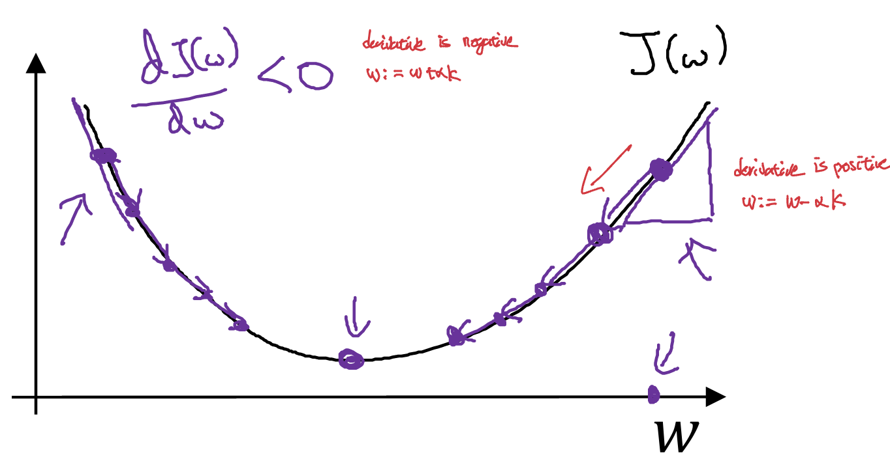

# Generalized Linear Models (GLM)
## Basics
A generalized linear model is a flexible generalization of ordinary linear regression. The GLM generalizes linear regression by allowing the linear model to be related to the response variable via a link function and by allowing the magnitude of the variance of each measurement to be a function of its predicted value.  
In a generalized linear model, each outcome $y$ of the dependent variables is assumed to be generated from a particular distribution in an exponential family, a large class of probability distributions that includes the normal, Bernoulli, binomial, Poisson and gamma distributions, among others.  

## Exponential Family
An exponential family is a parametric(finite number of parameters) set of probability distributions of a certain form.   
This special form is chosen for mathematical convenience, including the enabling of the user to calculate expectations, covariances using differentiation based on some useful algebraic properties, as well as forgenerality, as exponential familiesare in a sense very natural sets ofdistributions to consider. 
$$
{\displaystyle \ f_{X}\!\left(x\ {\big |}\ \theta \right)=h(x)\ \exp {\bigl [}\ \eta (\theta )\cdot T(x)-A(\theta )\ {\bigr ]}\ }
$$

- sufficient statistic $T(x)$
- naturla parameter $\eta$
- log-partition function $A(\eta)$ : logarithm of a normalization factor, without which ${\displaystyle \ f_{X}\!\left(x\ {\big |}\ \theta \right)}$ would not be a probability distribution:  
$A(\eta) = \log \left( \int_{X} h(x) \exp(\eta(\theta) \cdot T(x)) \, dx \right)$
- canonical response function(distribution's mean as a function of the natural parameter) : $g(\eta) = \mathbb{E}[T(y);\eta]$  
(the canonical response function for the
Gaussian family is just the identify function; and the canonical response function for the Bernoulli is the logistic function)  
- canonical link function: $g^{-1}$

### Link Function and Response Function

$$
\eta = g\left(\gamma'(\theta)\right) \\
\theta = \gamma'^{-1}\left(g^{-1}(\eta)\right)
$$
 - $\gamma'$ is known function.
 - $g$ is link function.

#### Canonical
$g$ is canonical link function if the function connects $\eta$, $\theta$ and $\mu$.
$$
\gamma'^{-1} \circ g^{-1} = \left(g \circ \gamma'\right)^{-1} = I \\
$$
Same as,
$$
\eta = \theta
$$

## 3 Assumptions
GLM consists of three elements below.
1. A particular distribution for modeling $Y$ from among those which are considered exponential families of probability distributions.  
2. A linear predictor $\eta = X\beta$.  
3. A link function $g$ such that $\mathbb{E}(Y \mid X) = \mu = g^{-1}(\eta)$.

### Bernoulli Distribution as GLM
$$
\begin{align*}
p(y; \phi) &= \phi^y (1 - \phi)^{1 - y} \\
&= \exp\left(y \log \phi + (1 - y) \log (1 - \phi)\right) \\
&= \exp\left(\left(\log\left(\frac{\phi}{1 - \phi}\right)\right) y + \log(1 - \phi)\right).
\end{align*}
$$  
$$
\begin{align*}
\eta &= \log\left(\frac{\phi}{1 - \phi}\right) \\ 
T(y) &= y \\
a(\eta) &= -\log(1 - \phi) \\
        &= \log(1 + e^{\eta}) \\
b(y) &= 1 \\
\end{align*}
$$

### Gausian Distribution as GLM
$$
\begin{align*}
p(y; \mu) &= \frac{1}{\sqrt{2\pi}} \exp\left( -\frac{1}{2} (y - \mu)^2 \right) \\
&= \frac{1}{\sqrt{2\pi}} \exp\left( -\frac{1}{2} y^2 \right) \cdot \exp\left( \mu y - \frac{1}{2} \mu^2 \right)
\end{align*}
$$  
$$
\begin{align*}
\eta &= \mu \\
T(y) &= y \\
a(\eta) &= \frac{\mu^2}{2} \\
       &= \frac{\eta^2}{2} \\
b(y) &= \left(\frac{1}{\sqrt{2\pi}}\right) \exp\left(-\frac{y^2}{2}\right).
\end{align*}
$$

## Linear Regression
### Basic
In Machine Learning, linear regression is a type of supervised machine learning algorithm that computes the linear relationship between the dependent variable and one or more independent features by fitting a linear equation to observed data.   
 - Simple Linear Regression: Only one independent variable($x$).  
 (only one $x$ and one $y$ variable.)
 - Multiple Linear Regression: Relationship between two or more variables($x$) and a response($y$) by fitting a linear equation to observed data.  
 (one $y$ and more than one $x$ variables. e.g.,$y = \beta_0 + \beta_1 x_1 + \cdots + \beta_p x_p + \epsilon$)
 - Univariate Linear Regression : Target variable depends on only one independent variable.  
 (one $x$ and one $y$) 
 - Multivariate Linear Regression : More than one predictor and more than one response.  
(more than one $x$ and more than one $y$ variable.)  
 $\mathbf{Y} = \mathbf{X}\mathbf{B} + \mathbf{\Xi}$  
$$
\begin{pmatrix}
y_{11} \ y_{12} \ \cdots \ y_{1p} \\
y_{21} \ y_{22} \ \cdots \ y_{2p} \\
y_{31} \ y_{32} \ \cdots \ y_{3p} \\
\vdots \ \vdots \ \ddots \ \vdots \\
y_{n1} \ y_{n2} \ \cdots \ y_{np}
\end{pmatrix}
=
\begin{pmatrix}
1 \ x_{11} \ x_{12} \ \cdots \ x_{1q} \\
1 \ x_{21} \ x_{22} \ \cdots \ x_{2q} \\
1 \ x_{31} \ x_{32} \ \cdots \ x_{3q} \\
\vdots \ \vdots \ \vdots \ \ddots \ \vdots \\
1 \ x_{n1} \ x_{n2} \ \cdots \ x_{nq}
\end{pmatrix}
\begin{pmatrix}
\beta_{01} \ \beta_{02} \ \cdots \ \beta_{0p} \\
\beta_{11} \ \beta_{12} \ \cdots \ \beta_{1p} \\
\beta_{21} \ \beta_{22} \ \cdots \ \beta_{2p} \\
\vdots \ \vdots \ \ddots \ \vdots \\
\beta_{q1} \ \beta_{q2} \ \cdots \ \beta_{qp}  
\end{pmatrix} + 
\begin{pmatrix}
\epsilon_{11} \ \epsilon_{12} \ \cdots \ \epsilon_{1p} \\
\epsilon_{21} \ \epsilon_{22} \ \cdots \ \epsilon_{2p} \\
\epsilon_{31} \ \epsilon_{32} \ \cdots \ \epsilon_{3p} \\
\vdots \ \vdots \ \ddots \ \vdots \\
\epsilon_{n1} \ \epsilon_{n2} \ \cdots \ \epsilon_{np}
\end{pmatrix}
$$

### Margin
### Loss Function(Cost Function = Objective Function)
In mathematical optimization and decision theory, a loss function or cost function (sometimes also called an error function) is a function that maps an event or values of one or more variables onto a real number intuitively representing some "cost" associated with the event.  
An optimization problem seeks to minimize a loss function.  
such as,  
$$
J(\theta) = \frac{1}{2} \sum_{i=1}^{m} \left( h_\theta(x^{(i)}) - y^{(i)} \right)^2.
$$  
An objective function is either a loss function or its opposite (in specific domains, variously called a reward function, a profit function, a utility function, a fitness function, etc.), in which case it is to be maximized.    
It is a function that measures, for each value of the $\theta$, how close the $h_\theta(x^{(i)})$ are to the corresponding $y^{(i)}$.  
In other word, choose $\theta$ so as to minimize $J(\theta)$.  

#### Probabilistic Interpretation (Maximum Likelihood)
Why least-squre cost function is reasonable choice when faced regression problem?  
Consider hypothesis of regression problem, when $ \epsilon$ is IID(Independently and Identically Distributed) according to Gaussian distribution with mean zero and some variance $\sigma^2$.  
$y^{(i)} = \theta^T x^{(i)} + \epsilon^{(i)}, \ \epsilon^{(i)} \sim \ \mathcal{N}(0, \sigma^2)$   
Since $\epsilon^{(i)} \sim \ \mathcal{N}(0, \sigma^2)$, $
p(\epsilon^{(i)}) = \frac{1}{\sqrt{2\pi}\sigma} \exp\left(-\frac{(\epsilon^{(i)})^2}{2\sigma^2}\right)$  
Which means it can be interpreted as the distribution of $y^{(i)}$ given $x^{(i)}$ parameterized by $\theta$ as $y^{(i)} \mid x^{(i)}; \theta \sim \mathcal{N}(\theta^T x^{(i)}, \sigma^2)$.  
Which is:  
$$
p(y^{(i)} | x^{(i)}; \theta) = \frac{1}{\sqrt{2\pi}\sigma} \exp\left(-\frac{\left(y^{(i)} - \theta^T x^{(i)}\right)^2}{2\sigma^2}\right).
$$  
Note that we should not condition on $\theta$
$p(y^{(i)} | x^{(i)}; \theta)$, since $\theta$ is not a random variable. (Remeber that Gaussian distribution is a type of continuous probability distribution for a real-valued random variable)  
Given $X$ (which is design matrix with all elements are $x^{(i)}$) and $\theta$, the distribution of $y^{(i)}$ is $p(\vec{y} | X; \theta)$ (function of $y^{(i)}$).  
We can view this as function of $\theta$ instead of $y^{(i)}$, and this is call likelihood.  
$L(\theta) = L(\theta; X, \vec{y}) = p(\vec{y} | X; \theta).$  
$$
L(\theta) = \prod_{i=1}^{m} p(y^{(i)} \mid x^{(i)}; \theta) = \prod_{i=1}^{m} \frac{1}{\sqrt{2\pi\sigma}} \exp \left( -\frac{\left( y^{(i)} - \theta^T x^{(i)} \right)^2}{2\sigma^2} \right) \\
$$  
Now, given this probabilistic model relating the $y^{(i)}s$ and the $x^{(i)}s$, reasonable way of choosing best guess of parameter $\theta$ in the principal of maximum likelihood is that choose $\theta$ so as to make the data as high probability as possible.  
I.e., Choose $\theta$ to maximize $L(\theta)$.  
Instead of maximizing $L(\theta)$, we can maximiae log liklihood $log(\theta)$.  
$$
\ell(\theta) = \log L(\theta) \\
= \log \prod_{i=1}^{m} \frac{1}{\sqrt{2\pi\sigma}} \exp \left( -\frac{\left( y^{(i)} - \theta^T x^{(i)} \right)^2}{2\sigma^2} \right) \\
= \sum_{i=1}^{m} \log \frac{1}{\sqrt{2\pi\sigma}} \exp \left( -\frac{\left( y^{(i)} - \theta^T x^{(i)} \right)^2}{2\sigma^2} \right) \\
= m \log \frac{1}{\sqrt{2\pi\sigma}} - \frac{1}{2\sigma^2} \sum_{i=1}^{m} \left( y^{(i)} - \theta^T x^{(i)} \right)^2.
$$  
Above derivation, we can find the fact that maximizing $log(\theta)$ is same as minimizing 
$\sum_{i=1}^{m} \left( y^{(i)} - \theta^T x^{(i)} \right)^2$, which is original loss function $J(\theta)$.

#### Loss Function vs Cost Function vs Objective Function
Loss function is usually a function defined on a data point, prediction and label, and measures the penalty. While cost function is a sum of loss functions over your training set plus some model complexity penalty (regularization). Also, objective function is the most general term for any function that you optimize during training.  
Therefore, A loss function is a part of a cost function which is a type of an objective function.

## Optimization Algorithms
### Direction of Gradient
If the gradient of a function is non-zero at a point $p$, the direction of the gradient is the direction in which the function increases most quickly from $p$.

### Gradient Descent
The idea is to take repeated steps in the opposite direction of the gradient (or approximate gradient) of the function(loss function) at the current point, because this is the direction of steepest descent.  
$$
\theta_j := \theta_j - \alpha \frac{\partial}{\partial \theta_j} J(\theta).
$$
#### Relation with Loss Function
To minimize cost function $J(\theta)$, let’s start with some “initial guess” for $\theta$, and that repeatedly changes $\theta$ to make $J(\theta)$ smaller, until hopefully we converge to a value of
$\theta$ that minimizes $J(\theta)$.

#### Batch, Stochastic and Mini-Batch Gradient Descent
- Batch: update parameters (theta) after looking at every example in the entire training set on every iteration. 
Repeat until convergence {  
$$
\theta_j := \theta_j + \alpha \sum_{i=1}^{m} \left( y^{(i)} - h_\theta \left( x^{(i)} \right) \right) x_j^{(i)} \quad (\text{for every } j).
$$  
}

- Stochastic: update the parameters (theta) according to the gradient of the error with respect to that single training example only.  
$$
\theta_j := \theta_j + \alpha \left( y^{(i)} - h_\theta \left( x^{(i)} \right) \right) x_j^{(i)} \quad (\text{for every } j).
$$

- Mini-batch: a compromise between batch and stochastic gradient descent. The training dataset is split into smaller subsets, called mini-batches. Then, calculate gradients on each mini-batch and update the model parameters until convergence. When $B$ is the size of mini batch, 
$$
J_{\text{mb}} = \frac{1}{B} \sum_{i=1}^{B} \mathcal{L}^{(i)}
$$

#### Mini Batch

As you can see from above note, when $m=5000000$, you can split whole $m$ into $1000$ each and have $5000$ mini batches.  
Each batch can be expressed as $X^{\{t\}}, Y^{\{t\}}$.

When gradient descent on mini batch, you run $1$ step of gradient descent using $X^{\{t\}}, Y^{\{t\}}$.

##### Choosing Mini Batch Size
When mini batch size is $m$, it is same as batch gradient descent, while if size is $1$, it is same as stochastic gradient descent. In practice, you choose in between(mini batch).  
If you use stochastic gradient descent, you will lose speedup from vectorization and if you use batch gradient descent, each iteration is too long, by using mini batch with choosing appropriate batch size, you can have two advantages. First, you can take advantage of vectorization. Second, you can make progress without processing entire training set.

Typical batch size is $64, 128, 256, 512, \cdots$. Make sure to fit in your CPU/GPU memory.

### Why Gradient Descent goes to steepest part?
Because Gradient is the steepest ascent(or descent).

#### Why Graidnt is same as steepest ascent(descent?)
Formally, for a function $mathcal{L}(\theta)$, the directional derivative in a unit direction $u$ is,
$$
D_u \mathcal{L}(\theta) = \nabla \mathcal{L}(\theta)^\top u
$$
It measures how fast $mathcal{L}$ changes if you move in direction $u$.

Now, among all possible directions $u$(when $||u||=1$), which one gives the largest decrease in $mathcal{L}$?
The answer is the opposite of gradient.
This is because the maximum of $- \nabla \mathcal{L}(\theta)^\top u$ occurs when $u$ aligns exactly opposite to $\nabla \mathcal{L}(\theta)$.  
Geometrically, it’s where the cosine of the angle between $u$ and $\nabla \mathcal{L}(\theta)$ is $-1$.

https://en.wikipedia.org/wiki/Dot_product

https://math.stackexchange.com/questions/223252/why-is-gradient-the-direction-of-steepest-ascent

##### Directional derivative
https://en.wikipedia.org/wiki/Directional_derivative

#### Least Mean Square Algorithm (LMS)
LMS algorithm is a stochastic gradient descent method that iteratively updates filter coefficients to minimize the mean square error between the desired and actual signals.  
When error is
$\left( y^{(i)} - h_\theta \left( x^{(i)} \right) \right)$, the magnitude of the update is proportional to the error term.
$$
\theta_j := \theta_j + \alpha \left( y^{(i)} - h_\theta \left( x^{(i)} \right) \right) x_j^{(i)}.
$$
##### Relation with Gradient Descent
$$
\frac{\partial}{\partial \theta_j} J(\theta) = \frac{\partial}{\partial \theta_j} \frac{1}{2} \left( h_\theta(x) - y \right)^2
= 2 \cdot \frac{1}{2} \left( h_\theta(x) - y \right) \cdot \frac{\partial}{\partial \theta_j} \left( h_\theta(x) - y \right)
= \left( h_\theta(x) - y \right) \cdot \frac{\partial}{\partial \theta_j} \left( \sum_{i=0}^{n} \theta_i x_i - y \right)
= \left( h_\theta(x) - y \right) x_j.
$$  

### Exponentially Weighted (Moving) Averages
Exponential moving average(EMA) is a rule of thumb technique for smoothing time series data using the exponential window function. (window function is a mathematical function that is zero-valued outside of some chosen interval)  
$$
V_t \;=\; \beta\,V_{t-1} \;+\; (1-\beta)\,\Theta_t
$$
The raw data sequence is often represented by $\Theta_t$ beginning at time $\{ t=0 \}$, and the output of the exponential smoothing algorithm is commonly written as $V_t$, which may be regarded as a best estimate of what the next value of $\Theta$ will be.

#### Mean Lag ($E[k]$) vs Effective Widnow($N_{\mathrm{eff}}$) in EMA 
$V_t$ can be calcuated as below
$$
V_t \;=\; \beta\,V_{t-1} \;+\; (1-\beta)\,\theta_t,
\qquad 0 < \beta < 1. \\[6pt]
V_t \;=\; (1-\beta)\sum_{k=0}^{\infty} \beta^{k}\,\theta_{t-k}.
$$

Hence the weight assigned to the sample that occurred $k$ time-steps ago is,
$$
(1-\beta)\,\beta^{k}
$$

A lag is simply how many steps back in time you look from the present observation. So the average lag of a data point, measured with the same exponential weights the EMA uses can be expressed as below.
$$
\mathbb{E}[K]
\;=\;
\sum_{k=0}^{\infty} k\,(1-\beta)\,\beta^{k}
$$
It is derived by the expectation (mean) of a discrete random variable, when $p(k) is the probability.
$$
\mathbb{E}[K]
\;=\;
\sum_{k} (\text{value }k)\,p(k)
\;=\;
\sum_{k} k\,p(k)
$$

This can be expressed in simpler form. Let's follow the mathmatic derivation below.
$$
S(\beta)
=\sum_{k=0}^{\infty}\beta^{k}
=\frac{1}{1-\beta} \\[6pt]

\frac{dS}{d\beta}
=\sum_{k=0}^{\infty} k\,\beta^{k-1}
=\frac{1}{(1-\beta)^{2}} \\[6pt]

\sum_{k=0}^{\infty} k\,\beta^{k}
\;=\;
\beta\,\frac{dS}{d\beta}
\;=\;
\frac{\beta}{(1-\beta)^{2}} \\[6pt]

\mathbb{E}[K]
\;=\;
(1-\beta)\sum_{k=0}^{\infty} k\,\beta^{k}
\;=\;
(1-\beta)\,\frac{\beta}{(1-\beta)^{2}}
\;=\;
\boxed{\dfrac{\beta}{1-\beta}}
$$

Therefore, $E[k]$ is the average lag you would get if you drew one sample at random, with probability proportional to its weight.  
For example, if $\beta = 0.9$, $E[k] = 9$.
E[K]=9. This tells that, on average, the “weight-picked” sample comes from ~9 steps in the past. When $\beta = 0.98$, $E[k] = 49$. This tells that, on average, the “weight-picked” sample comes from ~49 steps in the past.

Simply speaking, $E[k]$ indicates "On average, how many steps back does the bulk of the weight sit?".

Lastly, let's add $1$ to the $E[k]$ to convert average lag into average window size. We add $1$ because The mean lag $E[k]$ excludes the present sample ($k=0$) contributes zero to the mean, so practitioners often add 1 to include “today” and obtain a window-length scale.
$$
N_{\mathrm{eff}}
\;=\;
\mathbb{E}[K] + 1
\;=\;
\frac{\beta}{1-\beta}+1
\;\approx\;
\frac{1}{1-\beta}.
$$
Therefore, $E[k]$ (Centre of mass) tells where the weighted average lag sits. (A point.)
However, $N_{\mathrm{eff}}$ (Effective window length) tells how many recent samples you need before the older ones are practically negligible. In other words, “about how many of the most-recent samples carry most of the weight” in an exponential moving average, (A width.)

#### Bias Correction in EMA
Bias correction is generally a method used to adjust estimates that are systematically different from the true values.  
This is particularly important in scenarios where initial conditions or limited data can skew the results. One common case is in exponentially weighted moving averages, where the initial values can heavily influence the early part of the sequence, leading to inaccurate approximations.

$$
v_t \;=\; \beta\,v_{t-1} \;+\; (1-\beta)\,\theta_t,
\\[6pt]
\frac{v_t}{\,1-\beta^{\,t}}
$$

Instead of directly using the computed values $v_t$​, they are divided by a correction factor of $(1-\beta^{\,t})$, where $\beta$ is the weighting factor and $t$ is the iteration number.  
This scaling factor adjusts the initial values upwards, compensating for the initial bias. As $t$ increases, the denominator approaches $1$, reducing the impact of the correction over time.

### Gradient Descent with Momentum

When gradient descent, you might osciliate on every iteration as blue line in the image. You want to slow down up-and-down learning (vertical axis) while you want faster learning on horizontal axis.  
So this is where momentum jumped in. Momentum is a concept from physics where an object’s motion depends not only on the current force but also on its previous velocity.  
In the context of gradient optimization, it refers to a method that smoothens the optimization trajectory by adding a term that helps the optimizer remember the past gradients.

On every iteration $t$,
$$
\begin{aligned}
v_{\!dW} &\;=\; \beta\,v_{\!dW} \;+\;(1-\beta)\,\Delta W, \\
v_{\!db} &\;=\; \beta\,v_{\!db} \;+\;(1-\beta)\,\Delta b,
\end{aligned}
$$

$$
\begin{aligned}
W &\;:=\; W \;-\;\alpha\,v_{\!dW},\\
b &\;:=\; b \;-\;\alpha\,v_{\!db}
\end{aligned}
$$

$\beta$ is momentum factor that controls how much of the past gradients are remembered in the current update. A momentum factor value close to 1 means the optimizer will have more inertia while a value closer to 0 means less reliance on past gradients.  
So you can also think $v_{\!dW}$ and $\beta\,v_{\!db}$ terms as previous velocity, while $(1-\beta)\,\Delta W$ $(1-\beta)\,\Delta b$ as acceleration.  
Since $\beta$ controlls the EMA, if $\beta = 0.9$ (which is the most common case), it is averaging last 10 datapoints.  
Additionally, you don't usually use bias correction in momentum, because in practice, after just $10$ iteration, there is no bias estimate.

How can momentum slow-down the vertical osciliation while moving horizontally? Since derivatives'osciliate up and down on every iteration, the average of these gradients in vertical direction is close to $0$. On horizontal direction, however, all the derivatives are directing to the same direction. So the average in horizontal direction is still big. 

### Root Mean Square Propagation (RMSProps)
When $W_1$ is vertical axis and $W_2$ is horizontal axis, RMSProps does,

On every iteration $t$,
$$
S_{dW_1} \;=\; \beta_{2}\,S_{dW_1} \;+\; (1-\beta_{2})\,(\mathrm{d}W_1)^{2} \\
S_{dW_2} \;=\; \beta_{2}\,S_{dW_2} \;+\; (1-\beta_{2})\,(\mathrm{d}W_2)^{2} \\[10pt]

W _1\;:=\; W_1 \;-\; 
\alpha\,\frac{\mathrm{d}W_1}{\sqrt{\,S_{dW_1}+\varepsilon\,}}, \quad
W _2\;:=\; W_2 \;-\; 
\alpha\,\frac{\mathrm{d}W_2}{\sqrt{\,S_{dW_2}+\varepsilon\,}}
$$
$\epsilon$: to prevent $0$.  
$\beta_2$ is decay rate which determines how quickly the moving average of squared gradients decays.  

Let's say during the learning, the osciliation of $W_1$ axis(vertical) is large and osciliation of $W_2$ is small.  
Then, $\mathrm{d}W_1^{2}$ is also big and so is $S_{dW_1}$. However, $\mathrm{d}W_2^{2}$ and $S_{dW_2}$ will be small.  

Now when updating each parameter $W_1$ and $W_2$, each parameters is being updated using the scaled factor. Which meants that if the vertical direction ($\mathrm{d}W_1$) is large, it will be divided by relatively large factor ($S_{dW_1}$),
while horizontal direction is divided by the smaller factor ($S_{dW_2}$).  
So the updates of each parameters are appropriately scaled for each parameter and reduce the osciliation during learning.

### Adaptive Moment Estimation Optimization Algorithm (ADAM)
Adam optimizer combines the momentum and RMSprop techniques to provide a more balanced and efficient optimization process.

On every iteration $t$,
$$
\textbf{1. Update the first-moment estimates (momentum, \(\beta_1\))} \\
v_{dW_1} \;=\; \beta_{1}\,v_{dW_1} \;+\;(1-\beta_{1})\,\Delta W_1,
\qquad
v_{dW_2} \;=\; \beta_{1}\,v_{dW_2} \;+\;(1-\beta_{1})\,\Delta W_2 \\[10pt]

\textbf{2. Update the second-moment estimates (RMSProp, \(\beta_2\))} \\
S_{dW_1} \;=\; \beta_{2}\,S_{dW_1} \;+\;(1-\beta_{2})\,(\Delta W_1)^{2},
\qquad
S_{dW_2} \;=\; \beta_{2}\,S_{dW_2} \;+\;(1-\beta_{2})\,(\Delta W_2)^{2} \\[10pt]

\textbf{3. Bias correction} \\
V^{\text{corr}}_{dW_1} \;=\; \frac{v_{dW_1}}{1-\beta_{1}^{\,t}},
\qquad
V^{\text{corr}}_{dW_2} \;=\; \frac{v_{dW_2}}{1-\beta_{1}^{\,t}},
\\
S^{\text{corr}}_{dW_1} \;=\; \frac{S_{dW_1}}{1-\beta_{2}^{\,t}},
\qquad
S^{\text{corr}}_{dW_2} \;=\; \frac{S_{dW_2}}{1-\beta_{2}^{\,t}} \\[10pt]

\textbf{4. Parameter update} \\
W_1
\;:=\;
W_1
\;-\;
\alpha\,
\frac{v^{\text{corr}}_{dW_1}}
{\sqrt{S^{\text{corr}}_{dW_1}+\varepsilon}},
\qquad
W_2
\;:=\;
b
\;-\;
\alpha\,
\frac{v^{\text{corr}}_{db}}
{\sqrt{S^{\text{corr}}_{db}+\varepsilon}}
$$
$\alpha$: The learning rate or step size. (needs to be tuned)  
$\beta_1, \beta_2$​: Decay rates for the moving averages of the gradient and squared gradient. (0.9 for $\beta_1$ and 0.999 for $\beta_2$ in general)  
$\epsilon$: A small positive constant used to avoid division by zero when computing the final update. ($10^{-8}$ in general)  

### Learning Rate Decay
Throughout the training phase, learning rate decay entails gradually lowering the learning rate.  
Learning rate decay is used to gradually adjust the learning rate, usually by lowering it, to facilitate the optimization algorithm's more rapid convergence to a better solution.  
In machine learning, the learning rate determines how much the model changes based on the mistakes it makes. If it's too high, the model might miss the best fit; too low, and it's too slow. Learning rate decay starts with a higher learning rate, letting the model learn fast. As training progresses, the rate gradually decreases, making the model adjustments more precise. 
$$
\alpha_1
\;=\;
\frac{1}{\,1 + \text{decay\_rate}\;\times\;\text{epoch\_num}\,} \alpha_{0}
$$
Where $\alpha_{0}$ is initail learning rate. So if $\alpha_{0}$ is $0.2$,
$$
\begin{array}{c|c}
\textbf{Epoch} & \boldsymbol{\alpha} \\ \hline
0 & 0.2 \\
1 & 0.1 \\
2 & 0.067 \\
3 & 0.05 \\
4 & 0.04 \\
\vdots & \vdots \\
i & \alpha_i
\end{array}
$$

Other learning rate decay oehtes are,
$$
\alpha \;=\; 0.95^{\,\text{epoch\_num}}\;\alpha_{0} \\[6pt]
\alpha
\;=\;
\frac{k}{\sqrt{\text{epoch\_num}}}\;\alpha_{0} \\[6pt]
\alpha
\;=\;
\frac{k}{\sqrt{t}}\;\alpha_{0},
$$
Or using discrete stair case like below pic.

### Normal Equation
### Jacobian with Matrix
Given a training set let's define the design matrix $X$ which contains the training examples’ input values in its rows:  
$$
X = \begin{bmatrix}
(x^{(1)})^T \\
(x^{(2)})^T \\
\vdots \\
(x^{(m)})^T
\end{bmatrix}.
$$
And let $\vec{y}$ be the $m$-dimensional vector containing all the target values from the training set:  
$$
\vec{y} = 
\begin{bmatrix}
y^{(1)} \\
y^{(2)} \\
\vdots \\
y^{(m)}
\end{bmatrix}.
$$
Since $(x^{(1)})^T\theta = h_\theta(x^{(1)}) - y^{(1)}$, we can verify,  
$$
X\theta - \vec{y} = 
\begin{bmatrix}
(x^{(1)})^T\theta \\
\vdots \\
(x^{(m)})^T\theta
\end{bmatrix}
- 
\begin{bmatrix}
y^{(1)} \\
\vdots \\
y^{(m)}
\end{bmatrix}
= 
\begin{bmatrix}
h_\theta(x^{(1)}) - y^{(1)} \\
\vdots \\
h_\theta(x^{(m)}) - y^{(m)}
\end{bmatrix}.
$$
Using the fact that $z^T z = \sum_i z_i^2$ for vector $z$,  
$$
\frac{1}{2} (X \theta - \vec{y})^T (X \theta - \vec{y}) = \frac{1}{2} \sum_{i=1}^m (h_\theta(x^{(i)}) - y^{(i)})^2 = J(\theta)
$$
To minimize, $J(\theta)$, let's find derivatives with respect to $\theta$ using Normal Equation,  
$$
\nabla_\theta J(\theta) = \nabla_\theta \frac{1}{2} (X \theta - \vec{y})^T (X \theta - \vec{y}) = \Vert X \theta - \vec{y} \Vert_2^2 \\ = X^T X \theta - X^T \vec{y}
$$
To minimize $J(\theta)$, we set its derivatives to zero, and obtain the
normal equations:
$$
X^T X \theta =  X^T \vec{y} \\
 \theta = X^T X \theta - X^T \vec{y}
$$

## Locally Weighted Linear Regression (LWR)
Rather than learning a fixed set of parameters as is done in ordinary linear regression, parameters $\theta$ are computed individually for each query point $x$.
$
J(\theta) = \sum_{i=1}^{m} w^{(i)} \left( \theta^T x^{(i)} - y^{(i)} \right)^2
$  
When original linear regression:  
 - fit $\theta$ to minimize $\sum_{i=1}^{m} \left( \theta^T x^{(i)} - y^{(i)} \right)^2$
 - predict with $ \theta^T x^{(i)}$.  

LWR:
 - fit $\theta$ to minimize $\sum_{i=1}^{m} w^{(i)} \left( \theta^T x^{(i)} - y^{(i)} \right)^2$
 - predict with $ \theta^T x^{(i)}$.  

### Weight
Weight $w^{(i)}s$ are non negative value. A standard choice the weight is  
$
w^{(i)} = \exp \left( -\frac{\left(x^{(i)} - x\right)^2}{2\tau^2} \right)
$  

## Logistic Regression
### Basics
Logistic regression is a supervised machine learning algorithm used for classification tasks, where the goal is to predict the probability that an instance belongs to a given class or not.   
Logistic regression is a statistical algorithm which analyze the relationship between two data factors. 

Mathmatically, the goal of Logistic Regression is to learn parameters $w \in \mathbb{R}^n, b \in \mathbb{R}$ to make $\hat{y}$ good estimate of the chance(probability) of $y=1$.   
So Given $x \in \mathbb{R}^n$, we want $\hat{y} = P(y = 1 \mid x)$, with $0 \;\le\; \hat{y} \;\le\; 1$.  
Using the parameters $w,b$ and sigmoid function to yield the output
$\hat{y} \;=\; \sigma\!\bigl(w^\top x + b\bigr)$.  
(Note that we use sigmoid function to make $\hat{y}$ between 0 and 1)

### Logistic Function (Sigmoid Function)

when $h_{\theta}(x)$ is hypothesis, and $\theta^{T} x = \theta_{0} + \sum_{j=1}^{n} \theta_{j} x_{j}$,  
$$
h_{\theta}(x) = g(\theta^{T} x) = \frac{1}{1 + e^{-\theta^{T} x}},
$$  
It is also useful to check derivative of sigmoid function which is:  
$$
g'(z) = \frac{d}{dz} \left(\frac{1}{1 + e^{-z}}\right) \\
= \frac{1}{(1 + e^{-z})^2} \left(e^{-z}\right) \\
= \frac{1}{(1 + e^{-z})} \cdot \left(1 - \frac{1}{(1 + e^{-z})}\right) \\
= g(z)(1 - g(z)).
$$

#### Cost(Loss) Function of Sigmoid Function
Recall the logistic function that $\hat{y} = \sigma\bigl(w^\top x + b\bigr)$, Where $\sigma(z) = \frac{1}{1 + e^{-z}}$. And we want $\hat{y} \approx y$.  
So we need cost(loss) function to measure how well algorithm is performing using loss($\mathcal{L}(\hat{y}, y)$).  
We don't define loss function as squared error loss as below.  
$$
\mathcal{L}(\hat{y}, y) = \tfrac{1}{2}\,(y - \hat{y})^2.
$$
This is because this loss function might not convex so the gradient descent may not find the global optimum. In other word, $\mathcal{L}(\hat{y}, y)$ might have multiple regions of curvature (with some regions being concave) instead of being a single “bowl-shaped” (convex) function.  
Therefore, we use cross-entropy loss function as following.
$$
\mathcal{L}(\hat{y}, y) 
= - \Bigl[\, y \,\log\bigl(\hat{y}\bigr) 
   \;+\; \bigl(1 - y\bigr)\,\log\bigl(1 - \hat{y}\bigr) \Bigr]
$$
Let's see why this binary cross-entropy is convex function. This function could be simplified when $y \,\in\, \{0,1\}$.
$$
\mathcal{L}(\hat{y}, y) = \log\bigl(\hat{y}\bigr), \text{ when } y=1
$$
Since $\hat{y} = \sigma\bigl(w^\top x + b\bigr)$, we can rewrite this expression as below, putting $(w^\top x + b\bigr) = z$.
$$
\mathcal{L}'(z) 
= \frac{d}{dz}\,\log\Bigl(1+e^{-z}\Bigr)
= \frac{1}{\Bigl(1+e^{-z}\Bigr)}\cdot\Bigl(-e^{-z}\Bigr)
= -\,\frac{e^{-z}}{\Bigl(1+e^{-z}\Bigr)} \\
$$
Since $\sigma(z) = \frac{1}{\Bigl(1+e^{-z}\Bigr)}$, we can conclude that 
$$
\mathcal{L}'(z) = -\Bigl(1-\sigma(z)\Bigr)
= -\,\sigma\Bigl(-z\Bigr)
$$
Now let's check second derivative. 
$$
\mathcal{L}''(z)
= \frac{d}{dz}\Bigl[-\,\sigma\Bigl(-z\Bigr)\Bigr]
= \sigma\Bigl(-z\Bigr)\,\Bigl(1-\sigma\Bigl(-z\Bigr)\Bigr)
$$
Since $0 < \sigma(z) < 1 $, 
$$
\mathcal{L}''(z) = \sigma\Bigl(-z\Bigr)\,\Bigl(1-\sigma\Bigl(-z\Bigr)\Bigr)  \ge 0
$$
Therefore we can conclude that the function $\mathcal{L}''(z)$ is convex.
Now, Let's get back to loss and how the loss is calcuated when ground truth $y=1$ and $y=0$.  
When $y=1$, 
$$
\mathcal{L}\bigl(\hat{y}, 1\bigr)
= -\Bigl[\,1 \cdot \log\bigl(\hat{y}\bigr) + 0 \cdot \log\bigl(1 - \hat{y}\bigr)\Bigr]
= -\log\Bigl(\hat{y}\Bigr)
$$
If $\hat{y}$ is close to 1, the loss $\log(\hat{y})$ is also close to 0. So it reflects a correct prediction that the model’s $y$ agrees with $\hat{y}$.  
If $\hat{y}$ is close to 0, the loss $\log(\hat{y})$ is a large positive number. It indicates the large loss and poor prediction.
Therefore when $y=1$, $\hat{y}$ should be very close to 1, so that the loss can be near to 0.

When $y=0$,
$$
\mathcal{L}\bigl(\hat{y}, 0\bigr)
= -\Bigl[\,0 \cdot \log\bigl(\hat{y}\bigr) + 1 \cdot \log\bigl(1 - \hat{y}\bigr)\Bigr]
= -\log\Bigl(1 - \hat{y}\Bigr).
$$
If $\hat{y}$ is close to 1, the loss $-\log\Bigl(1 - \hat{y}\Bigr)$ iis a large positive number. 
If $\hat{y}$ is close to 0, the loss $\log(\hat{y})$ is also close to 0.
Therefore when $y=0$, $\hat{y}$ should be very close to 0, so that the loss can be minimized.

#### Loss Function vs Cost Function
Loss function is for single training example and Cost function is for entire training example. Cost function use jacobian $J$ as follow.
$$
J(w,b)
= \frac{1}{m}\sum_{i=1}^m \mathcal{L}\bigl(\hat{y}^{(i)}, y^{(i)}\bigr)
= -\frac{1}{m}\sum_{i=1}^m 
\Bigl[
\,y^{(i)} \log\!\bigl(\hat{y}^{(i)}\bigr)
\;+\;
\bigl(1-y^{(i)}\bigr)\,\log\!\bigl(1-\hat{y}^{(i)}\bigr)
\Bigr].
$$

### Gradient Descent of Logistic Regression
We want to find $w, b$ that minimize $J(w, b)$.
$$
J(w,b)
= \frac{1}{m} \sum_{i=1}^m \mathcal{L}\bigl(\hat{y}^{(i)}, y^{(i)}\bigr)
= -\,\frac{1}{m}\sum_{i=1}^m \Bigl[\,y^{(i)} \log\bigl(\hat{y}^{(i)}\bigr)
\;+\;\bigl(1 - y^{(i)}\bigr)\,\log\bigl(1 - \hat{y}^{(i)}\bigr)\Bigr].
$$
That means, we want to find the global optimum in convex function. That's where gradient descent shows up. The goal of gradient descent is to minimize the cost function, or the error between predicted($\hat{y}$) and actual $y$.  

#### Concept of Gradient Descent

The starting point is just an arbitrary point for us to evaluate the performance. From that starting point, we will find the derivative(= slope), and from there, we can use a tangent line to observe the steepness of the slope.  The slope will inform the updates to the parameters(the weights and bias).  
The slope at the starting point will be steeper, but as new parameters are generated, the steepness should gradually reduce until it reaches the lowest point on the curve, known as the point of convergence.
$$
\text{Repeat:}
\quad
w \;:=\; w \;-\; \alpha\,\frac{dJ(w)}{dw},
$$
It is important to consider derivative as slope of the point. So if the slope $\frac{dJ(w)}{dw}$ is positive, point $w$ is moved to left. On the contrary, if the slope is negative in ceratin point, according to the above expression, $w$ will be moved to the right. So the sequence converges to the global minimum eventually.

#### Math of Gradient Descent in Logistic Regression
Let's see an simple logistic regression example.
$$
z = w^\top x + b = w_1\,x_1 + w_2\,x_2 + b \\
\hat{y} = a = \sigma(z) \\
\mathcal{L}(a, y)
   = -\Bigl[y \,\log(a) + \bigl(1 - y\bigr)\,\log(1 - a)]
$$
Where $\sigma$ is sigmoid function.
Let's see how the calculation works in gradient descent. First we need to find $\frac{d\mathcal{L}}{dz}$.  
Using chain rule, $\frac{d\mathcal{L}}{da} \;\cdot\;\frac{da}{dz}$, each term is as below. 
$$
\frac{d\mathcal{L}}{da}
= -\frac{y}{a} + \frac{1-y}{1-a}
= \frac{-y(1-a) + a(1-y)}{a(1-a)} = \frac{a - y}{a\,(1 - a)},
\quad
\frac{da}{dz}
= a\,(1 - a)
$$
Combining both term together we get,
$$
\frac{d\mathcal{L}}{dz}
= \Bigl(\frac{a - y}{a\,(1 - a)}\Bigr)\,\cdot\,\bigl(a\,(1 - a)\bigr)
= a - y
$$
Using $\frac{d\mathcal{L}}{dz}$, we can do gradient descent w.r.t $w$ and $b$.  
$$
\frac{\partial L}{\partial w_1} = \frac{d\mathcal{L}}{dz} \cdot \frac{d\mathcal{z}}{dw_1} =  (a-y) \cdot x_1, \quad
\frac{\partial L}{\partial w_2} = \frac{d\mathcal{L}}{dz} \cdot \frac{d\mathcal{z}}{dw_2} =  (a-y) \cdot x_2
$$
When $w=[w_1, w_2]$ and $x=[x_1,x_2]$,
$$
\frac{\partial L}{\partial w} = \frac{d\mathcal{L}}{dz} \cdot \frac{d\mathcal{z}}{dw} =  (a-y) \cdot x, \quad
$$
$$
\frac{\partial L}{\partial b} = \frac{d\mathcal{L}}{dz} \cdot \frac{d\mathcal{z}}{db} =  (a-y) \cdot 1
$$

Using above derivative, we can update parameters.
$$
\begin{aligned}
w &:= w \;-\;\alpha\,dw \quad (w_1 &:= w_1 \;-\;\alpha\,dw_1,\quad
w_2 &:= w_2 \;-\;\alpha\,dw_2) \\
b &:= b \;-\;\alpha\,db.
\end{aligned}
$$
Where $\alpha$ is learning rate.

##### Applying Vectorization
$$
\frac{d\mathcal{L}}{dZ}
= \bigl[\;\ \frac{d\mathcal{L}}{dz_1},\;\frac{d\mathcal{L}}{dz_2},\;\dots,\;\frac{d\mathcal{L}}{dz_m}\bigr]
\quad\in\;\mathbb{R}^{1\times m}, \\[3pt]
A = \bigl[a^{(1)},\;a^{(2)},\;\dots,\;a^{(m)}\bigr] \\[3pt]
Y = \bigl[y^{(1)},\;y^{(2)},\;\dots,\;y^{(m)}\bigr]
$$
Using above vector we can calculate using vectorizatioin as below.
$$
\frac{d\mathcal{L}}{dZ} = (A - Y)
= \bigl[a^{(1)} - y^{(1)},\;a^{(2)} - y^{(2)},\;\dots,\;a^{(m)} - y^{(m)}\bigr]
$$
You can see that it is vector of the result from each iteration, not aggregated value. This is because these values are "per-example loss gradients" that are needed for computing gradients w.r.t. paramters $w$ and $b$.  
Since what we are interested in are gradients of these parametres for optimization(gradient descent) and $z$ is just intermediate value that is used for calculating these gradients of parameters.  So keep all of these so we can reuse them in vectorized computation.  
(Note that vectorization technique is used for computing efficiently in $w$ case.)
Let's see how parameters $w,b$ are vectorized in the gradient descent algorithm.
$$
\frac{\partial L}{\partial b} = \frac{1}{m}\,\sum_{i=1}^m \frac{d\mathcal{L}}{dz^{(i)}} = 
\frac{1}{m}\,\mathrm{np.\,sum}(\frac{d\mathcal{L}}{dZ})
\\[5pt]
\frac{\partial L}{\partial w} = \frac{\partial \mathcal{L}}{\partial w} = \frac{1}{m} \sum_{i=1}^{m} x^{(i)} \cdot \frac{\partial \mathcal{L}}{\partial z^{(i)}}
 = \\[3pt]
 \frac{1}{m} \, X \,(\frac{d\mathcal{L}}{dZ})^{T}
\;=\;
\frac{1}{m}
\begin{pmatrix}
x_1^{(1)} & \dots & x_1^{(m)} \\
\vdots    & \ddots & \vdots \\
x_n^{(1)} & \dots & x_n^{(m)}
\end{pmatrix}
\begin{pmatrix}
\frac{d\mathcal{L}}{dz^{(i)}}\\
\vdots \\
\frac{d\mathcal{L}}{dz^{(m)}}
\end{pmatrix}
$$
Since parameters $w$ and $b$ is shared across all samples. So when differentiating, we use the average of the gradients over all samples.

Let's see when calculating the cost function among all $m$ examples, the cost to minimize is:
$$
J(w,b) = \frac{1}{m}\sum_{i=1}^m \mathcal{L}\bigl(\hat{y}^{(i)},\,y^{(i)}\bigr).
$$

You should note that when vectorizing the gradient computation, you’re essentially summing (or averaging) the contributions from all $m$ training examples. For example, if you’re looking at the input feature $x_1$, the vectorized operation will compute the average of $x_1$ across all $m$ examples when updating the corresponding weight.  

This averaging is what stabilizes the update during gradient descent, ensuring that a single example (or a small group of examples) doesn’t dominate the gradient, and it also helps the algorithm converge more smoothly.

### Bernoulli Distribution
The discrete probability distribution of a random variable which takes the value 1 with probability $p$ and the value 0 with probability $ q=1-p$.  
$$
f(k; p) =
\begin{cases} 
p & \text{if } k = 1, \\
q = 1 - p & \text{if } k = 0.
\end{cases}
$$

### Binary Classification Model in Logistic Regression (label: 1,0)
When assuming,  
$$
P(y = 1 \mid x; \theta) = h_\theta(x) \\
P(y = 0 \mid x; \theta) = 1 - h_\theta(x) \\
=  \\
p(y \mid x; \theta) = \left( h_\theta(x) \right)^y \left( 1 - h_\theta(x) \right)^{1-y}
$$   
Likelihood of the parameter is,  
$$
L(\theta) = p(\vec{y} \mid X; \theta) = \prod_{i=1}^{m} p(y^{(i)} \mid x^{(i)}; \theta) \\
= \prod_{i=1}^{m} \left( h_{\theta}(x^{(i)}) \right)^{y^{(i)}} \left( 1 - h_{\theta}(x^{(i)}) \right)^{1 - y^{(i)}}.
$$  
Log likelihood of the parameter is (for convience),  
$$
\ell(\theta) = \log L(\theta) = \sum_{i=1}^{m} \left[ y^{(i)} \log h_{\theta}(x^{(i)}) + (1 - y^{(i)}) \log \left( 1 - h_{\theta}(x^{(i)}) \right) \right].
$$  
In order to maximize the likelihood, use gradient ascent method similar to linear regression problem.(the positive
rather than negative sign in the update formula, since we’re maximizing, rather than minimizing)  
So the update will be:  
$$
\theta := \theta + \alpha \nabla_{\theta} \ell(\theta)
$$  
Taking derivatives to log likelihood is:  
$$
\frac{\partial}{\partial \theta_j} \ell(\theta) = \sum_{i=1}^{m} \left( \frac{y^{(i)}}{g(\theta^T x^{(i)})} - \frac{(1-y^{(i)})}{1 - g(\theta^T x^{(i)})} \right) \cdot \frac{\partial}{\partial \theta_j} g(\theta^T x^{(i)}) \\
= \sum_{i=1}^{m} \left( \frac{y^{(i)}}{g(\theta^T x^{(i)})} - \frac{(1-y^{(i)})}{1 - g(\theta^T x^{(i)})} \right) g(\theta^T x^{(i)}) \left( 1 - g(\theta^T x^{(i)}) \right) \cdot x_j^{(i)} \\
= \sum_{i=1}^{m} \left( y^{(i)}(1 - g(\theta^T x^{(i)})) - (1-y)g(\theta^T x^{(i)}) \right) \cdot x_j^{(i)} \\
= \sum_{i=1}^{m} \left( y^{(i)} - h_{\theta}(x^{(i)}) \right) \cdot x_j^{(i)}.
$$  
Therefore stochastic gradient ascent rule is:  
$$
\theta_j := \theta_j + \alpha \left( y^{(i)} - h_{\theta}(x^{(i)}) \right) x_j^{(i)}
$$  

### Why Logistic Regression linear model?
Logistic regression is considered a generalized linear model because the outcome always depends on the sum of the inputs and parameters. ($\theta^T x = \theta_{0} x_{0} + \theta_{1} x_{1} \cdots \theta_{m} x_{m}$)  
In other words, the output cannot depend on the product (or quotient, etc.) of its parameters.(example of non linear: $ \theta_{1} x_{1} \times  \theta_{2} x_{2} ...$)  

### Binary Classification Model using Logistic Regression (label: 1,-1)
#### Margin of Binary Classification 
In binary Classification problems, it is often convenient to use a hypothesis class of the form $h_{\theta}(x) = \theta^T x$ and when presented with a new example $x$, we classify it
as positive or negative depending on the sign of $\theta^T x$.  
$$
\text{sign}(h_{\theta}(x)) = \text{sign}(\theta^T x) \quad \text{where} \quad \text{sign}(t) =
\begin{cases} 
1 & \text{if } t > 0 \\
0 & \text{if } t = 0 \\
-1 & \text{if } t < 0.
\end{cases}
$$
Where we say that $y = 1$ if the example is a member of the
positive class and $y = −1$ if the example is a member of the negative class, $y \in \{-1, +1\}$.  
Then, the hypothesis $h_{\theta}(x)$ with parameter
vector $\theta$ classifies a particular example ($X$, $y$) correctly if,  
$$
\text{sign}(\theta^T x) = y \quad \text{or equivalently} \quad y\theta^T x > 0.
$$  
$y\theta^Tx$ is called margin.  

#### Loss Function for Binary Classification
Choose some loss function so that
for our training data, makes the margin $y^{(i)}\theta^Tx^{(i)}$
very large for each training example.  
When $\varphi$ is loss function with zero-one range and $z$ is $y\theta^Tx$ :  
$$
\varphi_{zo}(z) = \varphi_{zo}(y\theta^Tx) = 
\begin{cases} 
1 & \text{if } z \leq 0, \\
0 & \text{if } z > 0.
\end{cases}
$$
For any particular loss function, the empirical risk that we minimize is then:  
$$
J(\theta) = \frac{1}{m} \sum_{i=1}^{m} \varphi\left(y^{(i)}\theta^T x^{(i)}\right).
$$
Through this jacobian, we can penalize those $\theta$ for which
$y^{(i)}\theta^Tx^{(i)} < 0$ frequently in the training data(loss increases by 1 for each data), and record no loss for $y^{(i)}\theta^Tx^{(i)} > 0$ for each training examples.  
Choosing $\theta$ to minimize the average logistic loss will
yield a $\theta$ for which $y^{(i)}\theta^Tx^{(i)} > 0$ for most (or even all!) of the training examples.  

#### Types of Loss Functions
 - logisitc loss: $\varphi_{\text{logistic}}(z) = \log(1 + e^{-z})$  
 - hinge loss: $\varphi_{\text{hinge}}(z) = [1 - z]_+ = \max\{1 - z, 0\}$  
 - exponential loss: $\varphi_{\exp}(z) = e^{-z}$  

#### Probabilistic intrepretation
When hypothesis as,  
$$
h_\theta(x) = g(\theta^T x) = \frac{1}{1 + e^{-\theta^T x}},
$$
Using logistic loss function, loss is,  
$$
\varphi_{\text{logistic}}(yx^T\theta) = \log\left(1 + \exp(-yx^T\theta)\right)
$$
And Choose $\theta$ that minimizes $J(\theta)$ which is logistic regression risk is,  
$$
J(\theta) = \frac{1}{m} \sum_{i=1}^{m} \varphi_{\text{logistic}}(y^{(i)}\theta^T x^{(i)}) = \frac{1}{m} \sum_{i=1}^{m} \log \left( 1 + \exp(-y^{(i)}\theta^T x^{(i)}) \right).
$$
The likelihood of the training data is,   
$$
L(\theta) = \prod_{i=1}^{m} p(Y = y^{(i)} \mid x^{(i)}; \theta) = \prod_{i=1}^{m} h_\theta(y^{(i)} x^{(i)})
$$  
So the log-likelihood is,  
$$
\ell(\theta) = \sum_{i=1}^{m} \log h_\theta(y^{(i)} x^{(i)}) = - \sum_{i=1}^{m} \log \left( 1 + e^{-y^{(i)} \theta^T x^{(i)}} \right) = -m J(\theta)
$$
That is, maximum likelihood in the logistic model $L(\theta)$ is the same as minimizing the average logistic loss $J(\theta)$, and we arrive at logistic regression again.

### Gradient Descent in Logistic Regression
Consider gradient-descent-based procedures for performing the minimization of logistic loss.  
With that in mind, the derivatives of the logistic loss is,  
$$
\begin{align*}
\frac{d}{dz} \varphi_{\text{logistic}}(z) &= \varphi_{\text{logistic}}'(z) = \frac{1}{1 + e^{-z}} \cdot \frac{d}{dz} e^{-z} = -\frac{e^{-z}}{1 + e^{-z}} = -\frac{1}{1 + e^{z}} = -g(-z), \\
\end{align*}
$$
when $z = y \theta^T x$ and $g(x)$ is hypothesis, 
$$
\begin{align*}
\frac{\partial}{\partial \theta_k} \varphi_{\text{logistic}}(y\theta^Tx) &= -g(-y\theta^Tx) \frac{\partial}{\partial \theta_k} (y\theta^Tx) = -g(-y\theta^Tx) yx_k.
\end{align*}
$$
Thus, a stochastic gradient procedure for minimization of $J(\theta)$  iteratively performs the following for every iteraion.  
 1. choose $i \in \{1, \cdots, m\}$ uniformly at random.
 2. perform gradient update rule:  
 $\theta^{(t+1)} = \theta^{(t)} - \alpha_t \cdot \nabla_{\theta} \varphi_{\text{logistic}}(y^{(i)} x^{(i)T} \theta^{(t)})$  
 $\theta^{(t+1)} = \theta^{(t)} + \alpha_t g(-y^{(i)} x^{(i)T} \theta^{(t)}) y^{(i)} x^{(i)} = \theta^{(t)} + \alpha_t h_{\theta(t)}(-y^{(i)} x^{(i)}) y^{(i)} x^{(i)}$  

This update is intuitive:
If our current hypothesis $h_{\theta(t)}$ assigns probability close to 1 for the incorrect label $y(i)$, then we try to reduce the loss by moving $\theta$ in the direction of $y(i)x(i)$.  
Conversely, if our current hypothesis $h_{\theta(t)}$ assigns probability close to 0 for the incorrect label $y(i)$, the update
essentially does nothing.

### Linearly Seperable datset in Logistic Regression
Remember that Maximum Likelihood is finding the parameter values that maximize the likelihood of observing the data.   
If a dataset is completely linearly separable, i.e. $\forall i \in \{1, \dots, m \}, \ y^{(i)} \theta^T x^{(i)} > 0$ and $y \in \{1,-1\}$
then, by multiplying a larger positive scalar, there will always be a new $\theta$ that makes $\ell (\theta)$ even bigger (which means make cost function $J(\theta)$ smaller),
which prevents the algorithm from converging.  
However, if the dataset is not linearly separable, $\theta$ cannot be generated
in such way while minimizing $\ell (\theta)$.  

#### Linearly Seperable
A set of data points can be separated into distinct classes using a straight line or hyperplane.

### Newton's Method
A root-finding algorithm which produces successively better approximations to the roots (or zeroes) of a real-valued function.  
It starts with a real-valued function $f$, its derivative $f′$, and an initial guess $x_0$ for a root of $f$.  
If $f$ satisfies certain assumptions and the initial guess is close, then
$$
x_1 = x_0 - \frac{f(x_0)}{f'(x_0)}
$$
$x_1$ is a better approximation of the root than $x_0$. The process is repeated as,  
$$
x_{n+1} = x_{n} - \frac{f(x_{n})}{f'(x_{n})}
$$
## Softmax Regression
The softmax function takes as input a vector $z$ of $K$ real numbers, and normalizes it into a probability distribution consisting of $K$ probabilities proportional to the exponentials of the input numbers.  
That is, prior to applying softmax, some vector components could be negative, or greater than one; and might not sum to 1; but after applying softmax, each component will be in the interval $(0,1)$.  
Formally, the standard (unit) softmax function $\sigma$:  
$$
\sigma: \mathbb{R}^K \rightarrow (0, 1)^K, \text{ where } K \geq 1,
$$  
$$
\text{vector } \mathbf{z} = (z_1, \dots, z_K) \in \mathbb{R}^K
$$
$$
\sigma(\mathbf{z}) \in (0,1)^K \text{ with } \sigma(\mathbf{z})_i = \frac{e^{z_i}}{\sum_{j=1}^K e^{z_j}}.
$$
The softmax applies the standard exponential function to each element 
$z_{i}$ of the input vector $z$ (consisting of $K$), and normalizes these values by dividing by the sum of all these exponentials.  
The normalization ensures that the sum of the components of the output vector $\sigma(z)$ is 1. 
### Multinomial Distribution
The multinomial distribution is a generalization of the binomial distribution.  
For $n$ independent trials each of which leads to a success for exactly one of $k$ categories, with each category having a given fixed success probability, the multinomial distribution gives the probability of any particular combination of numbers of successes for the various categories.  
Mathematically, if we have $k$ possible mutually exclusive outcomes, $x_i$ indicates the number of times outcome number $i$ is observed over the $n$ independent trials, with corresponding probabilities $p_1, \cdots, p_k$, Probability Mass Function(PMF) of multinomial distribution is:  
(어떤 시행애서 $k$ 가지의 값이 나타날 수 있고, 그 값들이 나타날 확률이 각각 $p_1, \cdots, p_k$ 라고 할 때 $n$번의 독립 시행에서 $i$ 번째의 값이 $x_i$ 번 나타날 확률)
$$
f(x_1, \dots, x_k; n, p_1, \dots, p_k) = \Pr(X_1 = x_1 \text{ and } \dots \text{ and } X_k = x_k) = \\ 
\begin{cases} 
\frac{n!}{x_1! \cdots x_k!} p_1^{x_1} \times \cdots \times p_k^{x_k}, & \text{when } \sum_{i=1}^k x_i = n \\
0, & \text{otherwise}
\end{cases}
$$

#### Applying Multinomial Distribution
In our model, we have one trial($n=1$) and the number of times outcome number $i$ is one.($x_k=1$). So the modified distribution is:  
$$
\frac{1!}{1! \cdots 1!} p_1^{x_1} \times \cdots \times p_k^{x_k} = \\
p_1^{x_1} \times \cdots \times p_k^{x_k} = \\
\prod_{i}^{k} P_{i}^{y_{i}}
$$

### Multinomial Distribution as GLM
When $\phi_i \cdots \phi_k$ specifying the probability of each of the outcomes:
$$
\phi_i = p(y = i; \phi), \quad \text{and} \quad p(y = k; \phi) = 1 - \sum_{i=1}^{k-1} \phi_i
$$  
To express the multinomial as an exponential family distribution, define $T(y) \in \mathbb{R}^{k-1}$ as follow:  
$$
\begin{align*}
T(1) &= \begin{pmatrix} 1 \\ 0 \\ 0 \\ \vdots \\ 0 \end{pmatrix}, \quad 
T(2) = \begin{pmatrix} 0 \\ 1 \\ 0 \\ \vdots \\ 0 \end{pmatrix}, \quad  \dots, \quad
T(k-1) = \begin{pmatrix} 0 \\ 0 \\ 0 \\ \vdots \\ 1 \end{pmatrix}, \quad 
T(k) = \begin{pmatrix} 0 \\ 0 \\ 0 \\ \vdots \\ 0 \end{pmatrix},
\end{align*}
$$  
In this case, $T(y)$ !=  $y$ and $T(y)_i$ is $i$-th element of the vector $T(Y)$.  
Also, $\left(T(y)\right)_i = \mathbf{1}\{y = i\}$ and $\mathbb{E}\left[(T(y))_i\right] = P(y = i) = \phi_i$.  
$$
\begin{aligned}
p(y;\boldsymbol{\phi}) &= \phi_1^{1\{y=1\}} \phi_2^{1\{y=2\}} \cdots \phi_k^{1\{y=k\}} \\
&= \phi_1^{1\{y=1\}} \phi_2^{1\{y=2\}} \cdots \phi_i^{1\{y=i\}} \cdots \phi_k^{1-\sum_{i=1}^{k-1} 1\{y=i\}} \\
&= \phi_1^{(T(y))_1} \phi_2^{(T(y))_2} \cdots \phi_k^{1-\sum_{i=1}^{k-1} (T(y))_i} \\
&= \exp\left((T(y))_1 \log(\phi_1) + (T(y))_2 \log(\phi_2) + \cdots + \left(1 - \sum_{i=1}^{k-1} (T(y))_i\right) \log(\phi_k)\right) \\
&= \exp\left((T(y))_1 \log(\phi_1/\phi_k) + (T(y))_2 \log(\phi_2/\phi_k) + \cdots + (T(y))_{k-1} \log(\phi_{k-1}/\phi_k) + \log(\phi_k)\right) \\
&= b(y) \exp(\boldsymbol{\eta}^T T(y) - a(\boldsymbol{\eta}))
\end{aligned}
$$
and,  
$$
\begin{aligned}
\text{where} \quad \boldsymbol{\eta} &= 
\begin{bmatrix}
\log(\phi_1/\phi_k) \\
\log(\phi_2/\phi_k) \\
\vdots \\
\log(\phi_{k-1}/\phi_k)
\end{bmatrix}, \\
a(\boldsymbol{\eta}) &= -\log(\phi_k), \\
b(y) &= 1.
\end{aligned}
$$ 
From Above, we can find the link function is $\eta_i = \log\left(\frac{\phi_i}{\phi_k}\right)
$, and response function is $e^{\eta_i} = \frac{\phi_i}{\phi_k}$.  
Using response function, 
$$
e^{\eta_i} = \frac{\phi_i}{\phi_k} \\
\phi_k e^{\eta_i} = \phi_i \\
\phi_k \sum_{i=1}^{k} e^{\eta_i} = \sum_{i=1}^{k} \phi_i = 1 \\
\phi_k = \frac{1}{\sum_{i=1}^{k} e^{\eta_i}} \\
$$
Thus, 
$$
\phi_i = \frac{e^{\eta_i}}{\sum_{j=1}^{k} e^{\eta_j}}
$$  
The function mapping from the $\eta$ to $\phi$ is called softmax function.  
Using Assumption 3, we have $\eta_i = \theta_i^T x$, the model assumes that the conditional distribution of $y$ given $x$ is:  
$$
\begin{align*}
p(y = i \mid x; \theta) &= \phi_i \\
&= \frac{e^{\eta_i}}{\sum_{j=1}^{k} e^{\eta_j}} \\
&= \frac{e^{\theta_i^T x}}{\sum_{j=1}^{k} e^{\theta_j^T x}}
\end{align*}
$$  
When applying this model to classification problems where $y \in \{1, \dots, k\}$, the hypothesis $h_{\theta}(x)$ is:  
$$
\begin{align*}
h_{\theta}(x) &= \mathbb{E}[T(y) \mid x; \theta] \\
&= \mathbb{E} \left[ \begin{pmatrix} 
1\{y=1\} \\ 
1\{y=2\} \\ 
\vdots \\ 
1\{y=k-1\} 
\end{pmatrix} \mid x; \theta \right] \\
&= \begin{pmatrix} 
\phi_1 \\ 
\phi_2 \\ 
\vdots \\ 
\phi_{k-1} 
\end{pmatrix} \\
&= \begin{pmatrix} 
\frac{\exp(\theta_1^T x)}{\sum_{j=1}^{k} \exp(\theta_j^T x)} \\ 
\frac{\exp(\theta_2^T x)}{\sum_{j=1}^{k} \exp(\theta_j^T x)} \\ 
\vdots \\ 
\frac{\exp(\theta_{k-1}^T x)}{\sum_{j=1}^{k} \exp(\theta_j^T x)} 
\end{pmatrix}.
\end{align*}
$$  
In other words, our hypothesis will output the estimated probability $p(y = i \mid x; \theta)$ for every value of $\{1, \cdots, k\}$.  
Similar to logistic regression, we can learn the parameter $\theta$ by optaining the maximum likelihood estimate of the parameters by maximizing log-likelihood function:  
$$
\ell(\theta) = \sum_{i=1}^{m} \log p(y^{(i)}|x^{(i)}; \theta) \\
= \sum_{i=1}^{m} \log \prod_{l=1}^{k} \left( \frac{e^{\theta_l^T x^{(i)}}}{\sum_{j=1}^{k} e^{\theta_j^T x^{(i)}}} \right)^{1\{y^{(i)}=l\}}
$$
Like logisstic regression, maximum likelihood estimate can be obtained by using method gradient ascent or Newton’s method.