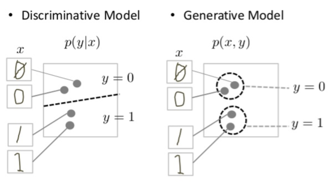

# Generative Learning Algorithms (GLA)
## Basics (Discriminative Models vs Generative Models)
A generative model for images might capture correlations like "things that look like boats are probably going to appear near things that look like water" and "eyes are unlikely to appear on foreheads." These are very complicated distributions.  
In contrast, a discriminative model might learn the difference between "sailboat" or "not sailboat" by just looking for a few tell-tale patterns. It could ignore many of the correlations that the generative model must get right.  
Discriminative models try to draw boundaries in the data space, while generative models try to model how data is placed throughout the space. For example, the following diagram shows discriminative and generative models of handwritten digits:
  
The discriminative model tries to tell the difference between handwritten 0's and 1's by drawing a line in the data space. If it gets the line right, it can distinguish 0's from 1's without ever having to model exactly where the instances are placed in the data space on either side of the line.

In contrast, the generative model tries to produce convincing 1's and 0's by generating digits that fall close to their real counterparts in the data space. It has to model the distribution throughout the data space.

### Generative Learning Models (GLA)
 - Generative model is a model of the conditional probability of the observable $X$, given a target $y$, symbolically, $P(Y \mid X=x)$
 - Generative model is a statistical model of the joint probability distribution $P(X, Y)$ on a given observable variable $X$ and target variable $Y$. A generative model can be used to "generate" random instances (outcomes) of an observation $x$.
 - Generative model includes the distribution of the data itself, and tells you how likely a given example is. e.g., models that predict the next word in a sequence are typically generative models (usually much simpler than GANs) because they can assign a probability to a sequence of words.
 - For example, Naive Bayes classifier, GAN and Gaussian Discriminant Analysis(GDA).   
### Discriminative Learning Models (DLA)
 - Discriminative model is a model of the conditional probability of the target $Y$, given an observation $x$, symbolically, $P(Y \mid X=x)$.
 - Discriminative model is a model of the conditional probability $P(Y\mid X=x)$ of the target $Y$, given an observation $x$. It can be used to "discriminate" the value of the target variable $Y$, given an observation $x$.
 - Discriminative model ignores the question of whether a given instance is likely, and just tells you how likely a label is to apply to the instance.
 - For example, Logistic Regression and Decision Tree

### Bayes' Rule (Theorem)
$$
P(A \mid B) = \frac{P(B \mid A) \, P(A)}{P(B)}, \ \ \text{when } P(B) \neq 0
$$
Also,  
$$
P(X) = P(X \mid Y = 1)P(Y = 1) + P(X \mid Y = 0)P(Y = 0)
$$
#### Applying Bayes' Rule to Conditional Probability
$$
p(\theta \mid x, y) = \frac{p(x, y, \theta)}{p(x, y)} =
\frac{p(y \mid x, \theta) p(x, \theta)}{p(x, y)} = \frac{p(y \mid x, \theta) p(\theta \mid x) p(x)}{p(x, y)}
$$
check how conditional probability represented, $p(\theta \mid x, y) = \frac{p(x, y, \theta)}{p(x, y)} $.

## Multivariate Normal Distribution
A generalization of the one-dimensional (univariate) normal distribution to higher dimensions.  
GDA is parameterized by a mean vector $\mu \in \mathbb{R}^{n}$ and a covariance matrix $\sum \in \mathbb{R}^{n}$  where $\sum \geq 0$ is symmetric and positive semi-definite. Also written $\mathcal{N}(\mu, \Sigma)$.  
The density of GDA:  
$$
p(x; \mu, \Sigma) = \frac{1}{(2 \pi)^{n/2} |\Sigma|^{1/2}} \exp \left( -\frac{1}{2} (x - \mu)^T \Sigma^{-1} (x - \mu) \right).
$$  
For a random variable $X$ which is $m$-dimensional $X \in \mathbb{R}^m$,  distributed $\mathcal{N}(\mu, \Sigma)$, the mean $\mu$:  
$$
\mathbb{E}[X] = \int x \, p(x; \mu, \Sigma) \, dx = \mu \\
\text{Cov}(X) = \sum
$$
The covariance of a vector-valued random variable $Z$ is defined as  
$$
\text{Cov}(Z) = \mathbb{E}[(Z - \mathbb{E}[Z])(Z - \mathbb{E}[Z])^T]
$$
Also same as,  
$$
\text{Cov}(Z) = \mathbb{E}[ZZ^T] - (\mathbb{E}[Z])(\mathbb{E}[Z])^T.
$$

The multivariate normal distribution is often used to describe, at least approximately, any set of (possibly) correlated real-valued random variables, each of which clusters around a mean value.

1 차원의 정규 분포를 다차원으로 확장 시킨 개념으로 평균값을 중심으로 군집화 되어 있는'상관 관계있는' 랜덤 변수 집합을 설명할때 사용한다.

## Gaussian Discriminant Analysis (GDA)
Gaussian Discriminant Analysis (GDA) is a supervised learning algorithm used for classification tasks in machine learning.  
GDA works by assuming that the data(input features $x$ are
continuous-valued random variables) in each class follows a Gaussian distribution, and then estimating the mean and covariance matrix for each class. It then uses Bayes’ theorem to compute the probability that a new data point belongs to each class, and chooses the class with the highest probability as the predicted class.  
The model is:  
$$
\begin{align*}
y &\sim \text{Bernoulli}(\phi) \\
x \mid y = 0 &\sim \mathcal{N}(\mu_0, \Sigma) \\
x \mid y = 1 &\sim \mathcal{N}(\mu_1, \Sigma)
\end{align*}
$$
The distribution of GDA model is:  
$$
\begin{align*}
p(y) &= \phi^y (1 - \phi)^{1 - y} \\
p(x \mid y = 0) &= \frac{1}{(2\pi)^{n/2} |\Sigma|^{1/2}} \exp\left(-\frac{1}{2} (x - \mu_0)^T \Sigma^{-1} (x - \mu_0)\right) \\
p(x \mid y = 1) &= \frac{1}{(2\pi)^{n/2} |\Sigma|^{1/2}} \exp\left(-\frac{1}{2} (x - \mu_1)^T \Sigma^{-1} (x - \mu_1)\right)
\end{align*}
$$
Note that there are two mean vectore $\mu_0$ and $\mu_1$.  
Log likelihood is:  
$$
\begin{align*}
\ell(\phi, \mu_0, \mu_1, \Sigma) &= \log \prod_{i=1}^{m} p(x^{(i)}, y^{(i)}; \phi, \mu_0, \mu_1, \Sigma) \\
&= \log \prod_{i=1}^{m} p(x^{(i)} \mid y^{(i)}; \mu_0, \mu_1, \Sigma) p(y^{(i)}; \phi).
\end{align*}
$$
By maximizing $\ell$ with respect to the parameters($ \phi, \mu_0, \mu_1, \Sigma$), we find the maximum likelihood estimate of the parameters to be:  
$$
\begin{align*}
\phi &= \frac{1}{m} \sum_{i=1}^{m} \mathbb{1}\{y^{(i)} = 1\} \\
\mu_0 &= \frac{\sum_{i=1}^{m} \mathbb{1}\{y^{(i)} = 0\} x^{(i)}}{\sum_{i=1}^{m} \mathbb{1}\{y^{(i)} = 0\}} \\
\mu_1 &= \frac{\sum_{i=1}^{m} \mathbb{1}\{y^{(i)} = 1\} x^{(i)}}{\sum_{i=1}^{m} \mathbb{1}\{y^{(i)} = 1\}} \\
\Sigma &= \frac{1}{m} \sum_{i=1}^{m} (x^{(i)} - \mu_{y^{(i)}})(x^{(i)} - \mu_{y^{(i)}})^T.
\end{align*}
$$

### Relationship between GDA and Logistic Regression
The GDA model has an interesting relationship to logistic regression.  
If we view the quantity $p(y = 1 \mid x; \phi, \Sigma, \mu_0, \mu_1)$ as a function of $x$, we’ll find that it can be expressed in the form:  
$$
p(y = 1 \mid x; \phi, \mu_0, \mu_1, \Sigma) = \frac{1}{1 + \exp\left(-(\theta^T x + \theta_0)\right)}
$$
where $\theta$ is some appropriate function of $\phi, \mu_0, \mu_1, \Sigma$.  This is exactly the form that logistic regression(discriminative learning algorithm) used to model $p(y=1 \mid x)$.  
Let's see the relationship between GDA and logistic regression,  
$$
\begin{align*}
p(y = 1 \mid x) &= \frac{p(x \mid y = 1)p(y = 1)}{p(x \mid y = 1)p(y = 1) + p(x \mid y = 0)p(y = 0)} \\
&= \frac{\exp\left\{-\frac{1}{2} (x - \mu_1)^T \Sigma^{-1} (x - \mu_1)\right\} \phi}{\exp\left\{-\frac{1}{2} (x - \mu_1)^T \Sigma^{-1} (x - \mu_1)\right\} \phi + \exp\left\{-\frac{1}{2} (x - \mu_0)^T \Sigma^{-1} (x - \mu_0)\right\} (1 - \phi)} \\
&= \frac{1}{1 + \exp\left\{\frac{1}{2} (x - \mu_1)^T \Sigma^{-1} (x - \mu_1) - \frac{1}{2} (x - \mu_0)^T \Sigma^{-1} (x - \mu_0) - \ln\left(\frac{1 - \phi}{\phi}\right)\right\}} \\
&= \frac{1}{1 + \exp\left\{-\left[(\Sigma^{-1} (\mu_1 - \mu_0))^T x + \frac{1}{2} (\mu_0 + \mu_1)^T \Sigma^{-1} (\mu_0 - \mu_1) - \ln\left(\frac{1 - \phi}{\phi}\right)\right]\right\}} \\
\theta &= \Sigma^{-1} (\mu_1 - \mu_0) \\
\theta_0 &= \frac{1}{2} (\mu_0 + \mu_1)^T \Sigma^{-1} (\mu_0 - \mu_1) - \ln\left(\frac{1 - \phi}{\phi}\right)
\end{align*}
$$
#### GDA vs Logistic Regression
If $p(x \mid y)$ is multivariate gaussian (with shared $\Sigma$),
then $p(y \mid x)$ necessarily follows a logistic function.  
The converse, however is not true; i.e., $p(y \mid x)$ being a logistic function does not imply $p(x \mid y)$ is multivariate gaussian. This shows that GDA makes stronger modeling assumptions about the data than does logistic regression.  
It turns out that when these modeling assumptions are correct, then GDA will find better fits to the data, and is a better model. Specifically, when $p(x \mid y)$ is indeed gaussian (with shared $\Sigma$), then GDA is asymptotically efficient. Informally, this means that in the limit of very large training sets (large $m$), there is no algorithm that is strictly better than GDA (in terms of, say, how accurately estimating $p(y \mid x)$.  
More generally, even for small training set sizes, we would generally expect GDA to better.  
In short, 
 - GDA makes stronger modeling assumptions, and is more
data efficient (i.e., requires less training data to learn “well”) when the modeling assumptions are correct or at least approximately correct.  
 - Logisticregression makes weaker assumptions, and is significantly more robust to deviations from modeling assumptions.

## Naive Bayes
나이브 베이지안(Naive Bayesian) 알고리즘은 베이즈 정리를 이용한 확률적 기계학습 알고리즘이다. 사전 확률에 기반을 두고 사후 확률을 추론하는 확률적 예측을 하는데, 이 때 모든 사건이 독립사건이라는 순진한(naive) 가정을 하고 있기 때문에 나이브 베이지안이라는 이름을 가지게 되었다.  
Naive Bayes classifiers are a family of linear "probabilistic classifiers" which assumes that the features are conditionally independent, given the target class.
Abstractly, Naive Bayes is a conditional probability model and it assigns probabilities ${\displaystyle p(C_{k}\mid x_{1},\ldots ,x_{n})}$ for each of the $K$ possible outcomes or classes ${\displaystyle C_{k}}$ given a problem instance to be classified, represented by a vector ${\displaystyle \mathbf {x} =(x_{1},\ldots ,x_{n})}$ encoding some $n$ independent variables(feature).  
Using Bayes' theorem, the conditional probability can be decomposed as,
$$
p(C_k \mid \mathbf{x}) = \frac{p(C_k) \, p(\mathbf{x} \mid C_k)}{p(\mathbf{x})}
$$
which can be recognized as,
$$
\text{posterior} = \frac{\text{prior} \times \text{likelihood}}{\text{evidence}}
$$
In the model, the numerator is equivalent to the joint probability model, 
$$
p(C_k, x_1, \dots, x_n) = p(x_1, \dots, x_n, C_k) \\
= p(x_1 \mid x_2, \dots, x_n, C_k) \, p(x_2, \dots, x_n, C_k) \\
= p(x_1 \mid x_2, \dots, x_n, C_k) \, p(x_2 \mid x_3, \dots, x_n, C_k) \, p(x_3, \dots, x_n, C_k) \\
= \dots \\
= p(x_1 \mid x_2, \dots, x_n, C_k) \, p(x_2 \mid x_3, \dots, x_n, C_k) \cdots p(x_{n-1} \mid x_n, C_k) \, p(x_n \mid C_k) \, p(C_k)
$$
Now the "naive" conditional independence assumptions come into play: assume that all features in ${\displaystyle \mathbf {x} }$ are mutually independent, conditional on the category ${\displaystyle C_{k}}$. In other words, that the $x_i$ is conditionally independent given $C_k$.  
Under this assumption,
$$
p(x_i \mid x_{i+1}, \dots, x_n, C_k) = p(x_i \mid C_k).
$$
For instance, if $y = 1$ means spam email., “buy” is word $2087$ and “price” is word $39831$. Then assuming that if $y = 1$ (that a particular piece of email is spam), then knowledge
of $x_{2087}$ (knowledge of whether “buy” appears in the message) will have no
effect on your beliefs about the value of $x_{39831}$ (whether “price” appears in the message).
More formally, this can be written $p(x_{2087}|y)$ = $p(x_{2087}|y, x_{39831})$.

Thus, the joint model can be expressed as when since the denominator ${\displaystyle p(\mathbf {x} )}$ is omitted.
$$
p(C_k \mid x_1, \dots, x_n) = \frac{p(C_k)p(x_1, \ldots, x_n \mid C_k)}{p(x)} = \frac{p(C_k, x_1, \ldots, x_n)}{p(x)} \\
= \frac{p(C_k) \, p(x_1 \mid C_k) \, p(x_2 \mid C_k) \, p(x_3 \mid C_k) \, \dots}{p(x)} \\
= \frac{p(C_k)}{p(x)} \prod_{i=1}^{n} p(x_i \mid C_k),
$$

## Laplace Smoothing
In statistics, Laplace Smoothing is a technique used to smooth count data, eliminating issues caused by certain values having 0 occurrences.  
Given a set of observation counts ${\displaystyle \mathbf {x} =\langle x_{1},x_{2},\ldots ,x_{d}\rangle }$ from a ${\displaystyle d}$-dimensional multinomial distribution with ${\displaystyle N}$ trials, a "smoothed" version of the counts gives the estimator,  
$$
\hat{\theta}_i = \frac{x_i + \alpha}{N + \alpha d} \quad (i = 1, \dots, d),
$$

## Multi-Variate Bernoulli Event Model vs Multinomial Event Model
#### Multinoulli Distribution (Multi-Variate Bernoulli Distribution)
벡터 가 k*1 차원의 이산 확률 변수 (벡터)이고, one-hot encoding과 같은 방식으로 하나의 원소만 1, 다른 k-1개의 원소는 0일 때 확률 분포를 정의한다.  
If $x$ be a $k \times 1$ discrete random vector. Let the support(support of a random variable is the set of values that the random variable can take) of $x$ be the set of $k \times 1$ vectors having one entry equal to 1 and all other entries equal to 0.  
$$
R_X = \left\{ x \in \{0,1\}^K : \sum_{j=1}^K x_j = 1 \right\}
$$
If $p_k$ is the possibility of $x_i$, $p_1, p_2, ... p_k$ are positive numbers such that,
$$
\sum_{j=1}^k p_j = 1
$$
We say that $X$ has a Multinoulli distribution with probabilities $p_{1}$, ..., $p_{K}$ if its joint probability mass function is, 
$$
p_X(x_1, \dots, x_K) = 
\begin{cases} 
    \prod_{j=1}^K p_j^{x_j} & \text{if } (x_1, \dots, x_K) \in R_X \\
    0 & \text{otherwise} 
\end{cases}
$$
Which can be also expressed as below:
$$
\prod_{j=1}^{K} p_j^{x_j} = p_1^{x_1} \cdots p_{i-1}^{x_{i-1}} \cdot p_i^{x_i} \cdot p_{i+1}^{x_{i+1}} \cdots p_K^{x_K} \\
= p_1^0 \cdots p_{i-1}^0 \cdot p_i^1 \cdot p_{i+1}^0 \cdots p_K^0 \\
= 1 \cdots 1 \cdot p_i \cdot 1 \cdots 1 \\
= p_i.
$$
#### Multinomial Distribution
Multinomial distribution is a generalization of the binomial distribution. It models the probability of counts for each side of a $k$-sided dice rolled $n$ times.
$$
f(x_1, \dots, x_k; n, p_1, \dots, p_k) = \Pr(X_1 = x_1 \text{ and } \dots \text{ and } X_k = x_k) \\
= \begin{cases}
    \dfrac{n!}{x_1! \cdots x_k!} p_1^{x_1} \cdots p_k^{x_k}, & \text{when } \sum_{i=1}^{k} x_i = n, \\
    0, & \text{otherwise}.
\end{cases}
$$
When $k=2 \text{ and } n=1$, the multinomial distribution is the Bernoulli distribution. When $k=2 \text{ and } n \geq 1$, it is the binomial distribution.  
When $k \geq 2 \text{ and } n=1$, it is the categorical distribution. 

## Naive Bayes Classifier (for classification problem)
Naive Bayes Classifier is a generative learning model that model $p(x|y)$. To do so, we have to use strong assumption Naive Bayes(NB) Assumption.  
Recall that Bayes' Theorem is,  
$$
P(A \mid B) = \frac{P(B \mid A) \, P(A)}{P(B)}, \ \ \text{when } P(B) \neq 0
$$
Recall that Naive Bayes assumption is, 
$$
p(x_i \mid x_{i+1}, \dots, x_n, C_k) = p(x_i \mid C_k).
$$

Using above assumption, the model is parameterized by $\phi_{j|y=1}$,$\phi_{j|y=0}$ and $\phi_y$.
$$
\phi_{j|y=1} = p(x_j = 1 \mid y = 1) = \frac{\sum_{i=1}^m \mathbb{1}\{x_j^{(i)} = 1 \land y^{(i)} = 1\}}{\sum_{i=1}^m \mathbb{1}\{y^{(i)} = 1\}} \\[10pt]
\phi_{j|y=0} = p(x_j = 1 \mid y = 0) =  \frac{\sum_{i=1}^m \mathbb{1}\{x_j^{(i)} = 1 \land y^{(i)} = 0\}}{\sum_{i=1}^m \mathbb{1}\{y^{(i)} = 0\}} \\[10pt]
\phi_y = \frac{\sum_{i=1}^m \mathbb{1}\{y^{(i)} = 1\}}{m}
$$

For example, consider below messages and we want to classify  whether the message is spam or not depending on words in the messages.

| Index | Message                | Spam   |
|-------|------------------------| -------|
| 1     | me free lottery        |  Spam  |
| 2     | free get free you      |  Spam  |
| 3     | you free scholarship   |        |
| 4     | free to contact me     |        |
| 5     | you won award          |        |
| 6     | you ticket lottery     |  Spam  |

$x_j$ is the word in the message and $y$ is label that indicating the message is spam($y=1$) or not($y=0$).  
$\phi_{j|y=1}$ stands for the probability of the word appears in the spam message, $\phi_{j|y=0}$ is the probability of the word appears in the non spam message and $\phi_y$ is the probability of the message is spam.  
Let's think of word 'you' in this example($x_j = \text{you}$).  
Then $\phi_{j|y=1}$ can be achieved by "# of times 'you' appears in spam mail" / "# of words  in the spam mail". Similarly, $\phi_{j|y=0}$  is "# of times 'you' appear in non spam mail" / "# of words in the nom spam mail".  
So for the word 'you' in this example, $\phi_{j|y=1} = \frac{2}{10} = 0.2$ and $\phi_{j|y=0} = \frac{2}{10} = 0.2$.  
So, Model fitting in Naive Bayes Classifier is doing same task through all the other words besides 'you' and get the each $\phi_{j|y=1}$ and $\phi_{j|y=0}$ of words.

When Prediction, you have to predict whether given input message($x$) is spam($y=1$) or not($y=0$). In order to do so, you have to calculate both the probability of the input message is spam and not and compare and find the bigger probability.    
The probability of the input message is spam,  
$$
\begin{align*}
p(y = 1 | x) &= \frac{p(x | y = 1)p(y = 1)}{p(x)} \\
             &= \frac{\left( \prod_{j=1}^n p(x_j | y = 1) \right) p(y = 1)}{\left( \prod_{j=1}^n p(x_j | y = 1) \right) p(y = 1) + \left( \prod_{j=1}^n p(x_j | y = 0) \right) p(y = 0)}.
\end{align*}
$$
The probability of the input message is not spam,  
$$
\begin{align*}
p(y = 0 | x) &= \frac{p(x | y = 0)p(y = 0)}{p(x)} \\
             &= \frac{\left( \prod_{j=1}^n p(x_j | y = 0) \right) p(y = 0)}{\left( \prod_{j=1}^n p(x_j | y = 1) \right) p(y = 1) + \left( \prod_{j=1}^n p(x_j | y = 0) \right) p(y = 0)}.
\end{align*}
$$

Let's use model from above example again and assume the predcition of message "you free lottery" ($=x$).  
The probability of this message is spam can be calculated by($=p(y = 1 | x)$) multiplying the probability of each words. (NB assumption.)  
$$
\text{Spam : } \prod_{j=1}^n p(x_j | y = 1) = \phi_{j|y=1} = \phi_{j(you)|y=1} \times \phi_{j(free)|y=1} \times \phi_{j(lottery)|y=1} \\

\text{Non-Spam : } \prod_{j=1}^n p(x_j | y = 0) = \phi_{j|y=0} = \phi_{j(you)|y=0} \times \phi_{j(free)|y=0} \times \phi_{j(lottery)|y=0}
$$
Since, $p(x) = \frac{1}{6} = 0.1666$ and $p(y=0)=p(y=1)=\frac{3}{6}=0.5$ from the example, find the probabilities of message "you free lottery". 
$$
p(y = 1 | x) = \frac{\frac{2}{10} \times \frac{3}{10} \times \frac{2}{10} \times \frac{3}{6}}{ \frac{1}{6}} = 0.36
$$  
$$
p(y = 0 | x) = \frac{\frac{2}{10} \times \frac{2}{10} \times \frac{0}{10} \times \frac{3}{6}}{\frac{1}{6}} = 0
$$ 

Since $p(y = 1 | x) > p(y = 0 | x)$, we can predict that message "you free lottery"(=$x$) would be classified as spam. 

