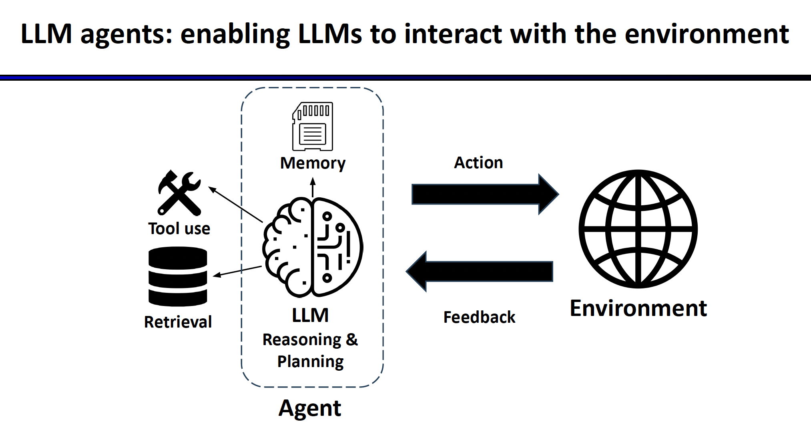
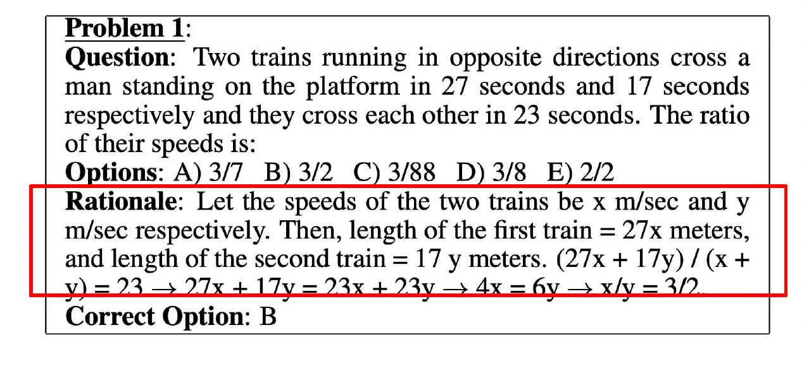
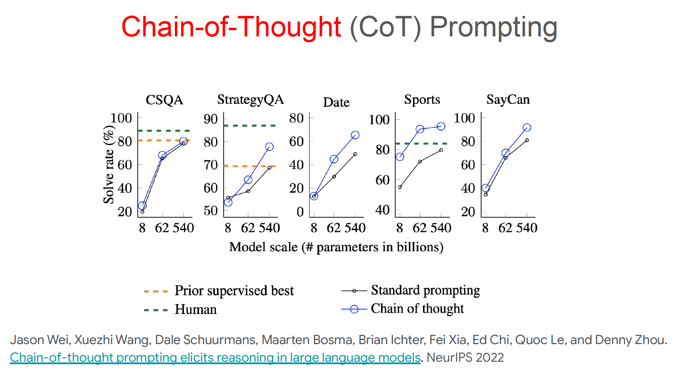
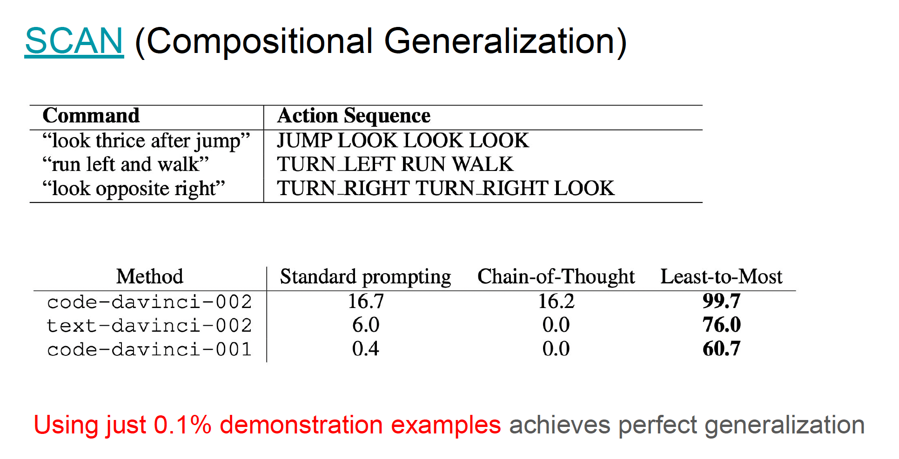
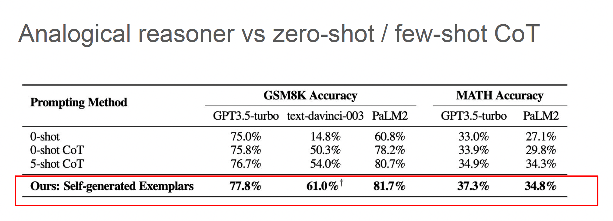
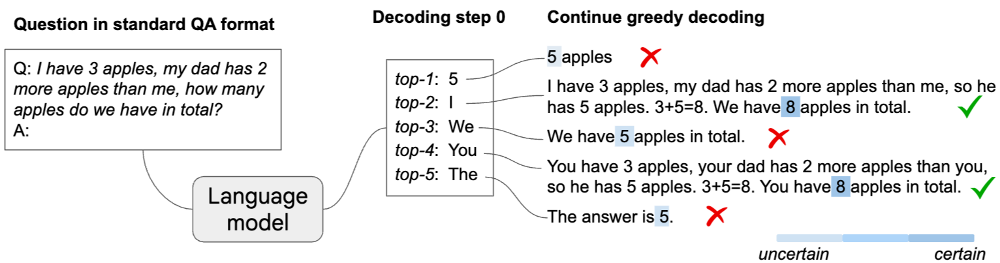
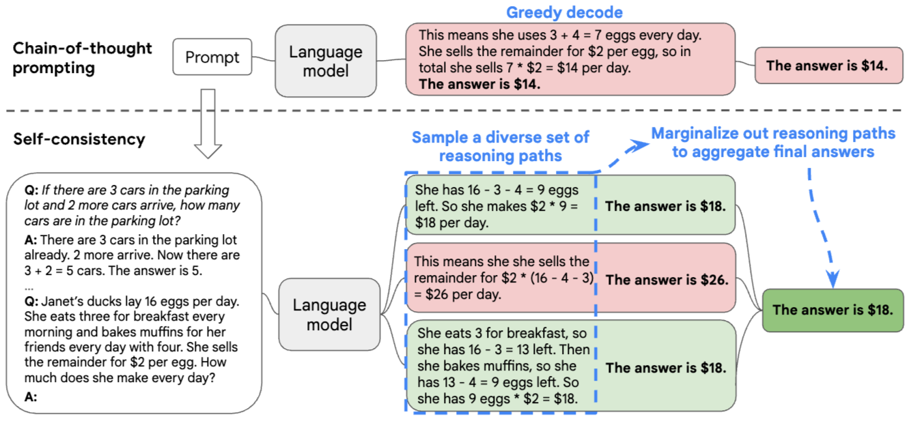

# CS294/194-196 LLM Agent: 1.LLM Reasoning

    
LLM Agents: enabling LLMs to interact with the environment. Agent use LLM as the key brain.
LLM agents interact with complex and diverse environment, obtain grounding through interactions and update their memory.
Multi-agenet collaboration: Solve even more complex tasks by division of labor and interaction with other agents.

## Memory in LLM Agent
Language agents use several types of memory to store and maintain information for interacting with the world.

## Why need LLM agent framework?
Leveraging external tools and retrieving from external knowledge expand LLM’s capabilities.
Agent workflow that facilitates complex tasks
- Task decomposition
- Allocation of subtasks to specialized modules
- Division of labor for project collaboration
- Multi-agent generation inspires better responses

## Application of LLM Agents
- Code generation (Cursor, Copilot)
- Personal assistant (GPT, Gemini)
- Robot (Figure AI, Tesla Optimus)

## Challenges for LLM Agents 
1. Reasoning and planning: LLM agents tend to make mistakes when performing complex tasks end-to-end
2. Learning from environment feedback: LLM agents are not yet efficient at recovering from mistakes for long-horizon tasks.
3. Multi-agent learning, theory of mind
4. Safety and privacy: LLMs are susceptible to adversarial attacks, can emit harmful messages and leak private data
5. Human-agent interaction, ethics: How to effectively control the LLM agent behavior, and design the interaction mode between
humans and LLM agents.

## What is Large Language Models (LLMs)
LLM is a "Transformer" model trained to predict the next word. LLMs are probabilistic models of generating next tokens.
(Trained with many sentences - all texts from the internet)
Training LLMs = Trainining parrots to mimic human languages.

## What is missing in ML? 
AL/ML is failed to learn from just a few examples like humans do. They need a lot of training data and process to learn. This is becauese AL/ML can't <b>"Reasoning"</b>. 

## Reasoning in LLM
### Few-shot prompting
### Chain-of-Thought (CoT) Prompting 
    
    

Derive the Final Answer through "Intermediate Steps". 
DeepMind pioneered using natural language rationale to solve math problems by “... derive the final answer through a series of small
steps”. Trained a sequence-to-sequence model from scratch.  
Following the work by Ling et al 2017, Cobbe et al 2021 in OpenAI built a much larger math word problem dataset (GSM8K) with natural language rationales and used it to finetune GPT3.

Regardless of training, fine-tuning, or prompting, when provided with examples that include intermediate steps, LLMs will respond with intermediate steps
- https://aclanthology.org/P17-1015.pdf  
- https://arxiv.org/abs/2110.14168
- https://arxiv.org/abs/2201.11903

### Least-to-Most Prompting
    

In addition to intermediae steps, It is also helpful to add reasoning
strategies in demonstration examples.
Least-to-Most prompting (LtM) takes Chain-of-Thought Prompting (CoT) a step further by first breaking a problem into sub problems then solving each one.

For example, 
```
Elsa has 3 apples. Anna has 2 more apples than Elsa. How many
apples do they have together?

Let's break down this problem: 1. How many apples does Anna
have? 2. How many apples do Elsa and Anna have together?

>> 1. Anna has 2 more apples than Elsa. So Anna has 2 + 3 = 5 apples.
2. Anna has 5 apples. Elsa and Anna have 3 + 5 = 8 apples together.
The answer is 8.
```
- https://arxiv.org/abs/2205.10625

### Why Intermediate steps helpful?
- Constant-depth transformers can solve any inherently
serial problem as long as it generates sufficiently long intermediate reasoning steps.
- Transformers which directly generate final answers
either requires a huge depth to solve or cannot solve at all.

"Our experiments suggest that turning on CoT drastically improves the expressiveness of low-depth transformers on problems which are hard to be parallel computed, i.e., those inherently
serial problems. ... inherently serial problems, transformers can only express the groundtruth function by using CoT."
- https://openreview.net/forum?id=3EWTEy9MTM

### Analogical Reasoners
Analogical reasoning adaptively generates relevant
examples and knowledge, rather than just using a fix set of examples.
In other words, Triggering step by step reasoning without using demonstration examples.
```
What is the area of the square with the four vertices at (-2, 2), (2, -2), (-2, -6), and (-6,-2)? Recall a related problem, and then solve this one.

>> In this problem, we have four points: (-2, 2), (2, -2), (-2, -6), and (-6, -2). Let's choose (-2, 2)
and (2, -2) to find the distance d between them: d = √((2-(-2))^2 + (-2-2)^2) = √(4^2 + (-4)^2) = √(16 + 16) = √32. We know that the distance between two opposite sides of a square is equal. So, the length of each side of the square is √32. To find the area of the square, we square the length of one side: Area = (√32)^2 = 32.
```
    

- https://arxiv.org/abs/2310.01714

### Chain-of-Thought Reasoning without Prompting
    

Pre-trained LLMs, without further finetuning, has been ready for step-by-step reasoning, but we need a non-greedy decoding strategy to derive it. When a "step-by-step reasoning path" is present, LLMs have much higher confidence in decoding the final answer.  
즉, LLM은 원래부터 여러 디코딩 경로를 “머리 속으로” 가지고 있는데, greedy로 하나만 타면 놓치게 되고 나머지 경로들에는 CoT가 숨어 있다.

LLM의 첫 번째 토큰 후보를 Top-K로 뽑지만 보통 greedy decoding에서는 top-1만 선택해서 나머지는 버린다. 여기서는 top-K 각각을 “첫 토큰”으로 삼아 독립적으로 디코딩을 끝까지 수행한다. 그리고  각각의 K 경로마다 t번째에서 1,2등 토큰의 확률의 잔차를 측정하고 높을 수록 해당 경로의 확신(confidence)이 높다고 판단, 가장 높은 확신을 가진 경로를 고른다.
$$
\Delta_{k, \text{answer}} = \frac{1}{|\text{answer}|} \sum_{x_t \in \text{answer}} p(x_t^1 | x_{<t}) - p(x_t^2 | x_{<t})
$$
- https://arxiv.org/pdf/2402.10200

### Self-Consistency
    

Self-consistency leverages the intuition that a complex reasoning problem typically admits multiple different ways of thinking leading to its unique correct answer. Samples a diverse set of reasoning paths instead of only taking the greedy one, and then selects the most consistent answer by marginalizing out the sampled reasoning paths.  
Simply speaking, <b>"Sample your answer multiple times and then choose the most frequent answer as the output."</b>
$$
\arg\max \mathbb{P}(\text{final answer} \mid \text{problem})
= \sum_{\text{reasoning path}} \mathbb{P}(\text{reasoning path}, \text{final answer} \mid \text{problem})
$$
Note that those reasoning path are sampled.

“sample-and-marginalize” decoding procedure: we first sample from the language model’s decoder to generate a diverse set of reasoning paths; each reasoning path might lead to a different final answer, so we determine the optimal answer by marginalizing out the sampled reasoning paths to find the most consistent answer in the final answer set. Such an approach is analogous to the human experience that if multiple different ways of thinking lead to the same answer, one has greater confidence that the final answer is correct. (Replace "CoT-Decoding".)
- https://arxiv.org/pdf/2203.11171

## Limitation of LLM Reasoning
### Easily Distracted by Irrelevant Context
As humans may be easily distracted by irrelevant context, adding irrelevant contexts to GSM8K leads to 20+ points performance drop.
```
[Prompt] Lucy has $65 in the bank. She made a $15 deposit and then
followed by a $4 withdrawal. "Maria's monthly rent is $10." What is Lucy’s bank balance?

[Response] Lucy's bank balance is $65 + $15 - $4 - $10 = $66. The
answer is $66.
```


However,Instructing LLMs to ggnore irrelevant context can take some performance back.
```
[Prompt] Lucy has $65 in the bank. She made a $15 deposit and then
followed by a $4 withdrawal. Maria's monthly rent is $10. What is Lucy’s bank balance? Ignore irrelevant context

[Response] Lucy has $65 in the bank. After making a $15 deposit and
then a $4 withdrawal, her bank balance is $76. "Maria's monthly rent is not relevant to this question", so it can be ignored. The answer is $76.
```
- https://arxiv.org/abs/2302.00093


### Cannot Self-Correct Reasoning Yet
While allowing LLMs to review their generated responses can help correct inaccurate answers, it may also risk changing correct answers into incorrect ones.

<b>incorrect -> correct</b>

```
[Prompt] Christina is planning a birthday party and needs .75 gift bags per invited guest, because 1/4 of attendees don't show up. She invited 16 friends. Gift bags are $2 each. How much will she spend?

>> ... 0.75 * 12 = 9 gift bags … Christina will spend a total of 2 * 9 = $8 ... (Wrong)

[Prompt] Review your previous answer and find problems with your answer.

>> Upon reviewing my previous answer, I recognize a mistake. I incorrectly stated that Christina needs 0.75 gift bags per invited guest. The given information states that 1/4 of the attendees won't show up ... Based on the problems you found, improve your answer.
... 16 * (3/4) = 12 gift bags ... Christina will spend 12 * $2 = $24  (Correct)
```

<b>correct -> incorrect</b>

```
[Prompt] Terry eats 2 yogurts a day. They are currently on sale at 4 yogurts for $5.00. How much does he spend on yogurt over 30 days?

>> ... So, Terry spends $75 on yogurt over 30 days. (Correct)

[Prompt] Review your previous answer and find problems with your answer.

>> Upon reviewing my previous answer, I realized that I made a mistake in calculating Terry's spending on yogurt over 30 days. I incorrectly stated that Terry spends $2.50 per day for 30 days...
Based on the problems you found, improve your answer.
... the final answer is Terry spends $37.5 on yogurt over 30 days. (Wrong)
```
- https://arxiv.org/abs/2310.01798  

### Oracle feedback needed for LLM to self-correct
Oracle Lets LLMs self correct only when the answer is wrong. For example,sSelf-debug naturally leverage unit tests as oracle.

### Premise(Statement) Order
LLMs are surprisingly brittle to the ordering of the premises, despite the fact that such ordering does not alter the underlying task. In particular, we observe that LLMs achieve the best performance when the premise order aligns with the context required in "intermediate reasoning steps".  
In other words, the model knows how to solve sequentialy and they couldn't go back and forth.
- https://arxiv.org/pdf/2402.08939