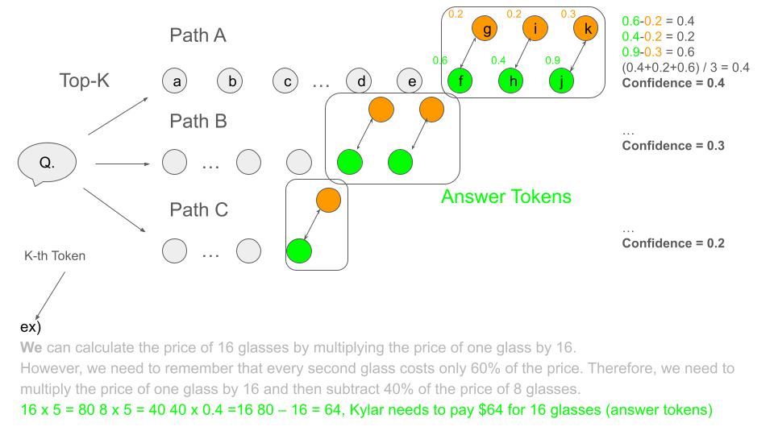

# CS294/194-196 LLM Agent: 1.LLM Reasoning Appendix
## Self-Consistency Sampling 
Sampling scheme. To sample diverse reasoning paths, we followed similar settings to those suggested in Radford et al. (2019); Holtzman et al. (2020) for open-text generation. In particular, for UL2-20B and LaMDA-137B we applied temperature sampling with T = 0.5 and truncated at the top-k (k = 40) tokens with the highest probability, for PaLM-540B we applied T = 0.7, k = 40, and for GPT-3 we use T = 0.7 without top-k truncation.

즉, 매 토큰 예측마다 아래가 반복적으로 적용되는 것같아요.
(self-consistency) logit 출력 -> temperature 적용 -> top-k truncation -> 확률분포 생성 (softmax) -> 샘플링!
이때 추론(logit 생성)은 1번만 하면 됨
(greedy) logit 출력 -> 확률분포 생성 (softmax) -> top 1 선택

## Chain-of-Thought Reasoning without Prompting
1.LM이 첫 번째 토큰을 생성할 때, softmax 확률이 높은 상위 top-k 토큰을 선택  
2.각 path는 greedy로 끝까지 디코딩.  
3.각 path의 최종 answer token을 생성할 때 path 마다 top-1 토큰과 top-2 토큰의 확률 차이 를 계산해서 path confidence를 만듬.  
e.g.,  모든 path가 3번째 단계에서 answer token을 만든 다고 가정, answer token은 하나라고 가정. -> A의 confidence가 높당!  
4.최종적으로 confidence 가 가장 높은 path A의 answer를 선택함.  

    

answer이 lm의 최종 output이 아니라 모델의 output에 answer과 추론이 섞여있음. 그래서 output에서  "answer span"에 해당하는 부분만 뽑아서 각 토큰 별 1,2등의 잔차를 계산한다가 정확한 설명일 것 같습니다.
```
 "... Computing (confidence) requires identifying the answer spans in a model's response...."(신뢰도를 계산하려면 응답 내에서 "답변(answer span)"을 식별해야 합니다.)
```
그리고 추출하는 방법 중 하나로  "So the answer is "  라는 프롬프트를 모델의 출력에 추가하여 이후의 연속 토큰을 answer 로 간주하는 방법등 이 소개되었습니다.