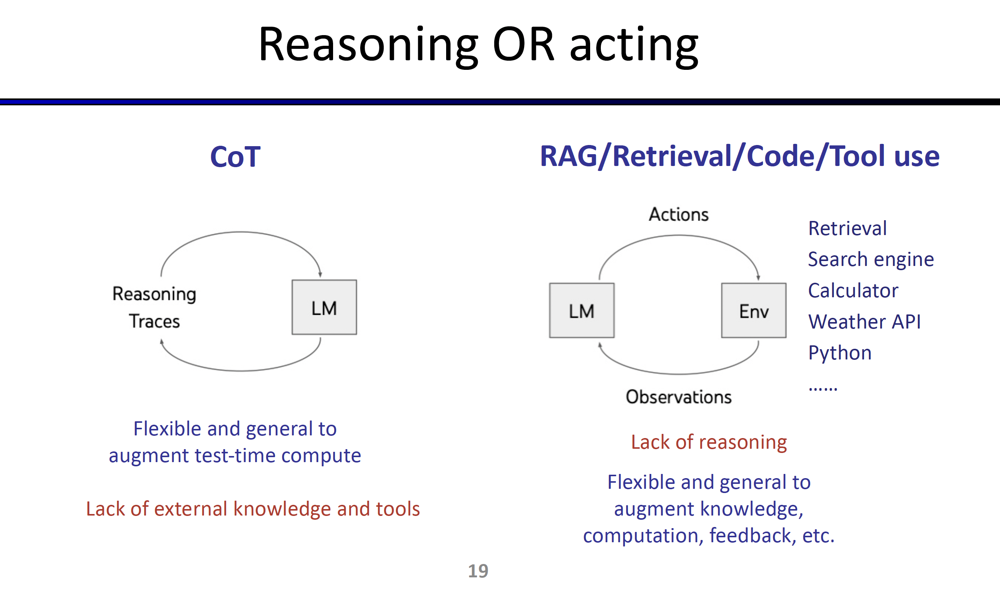
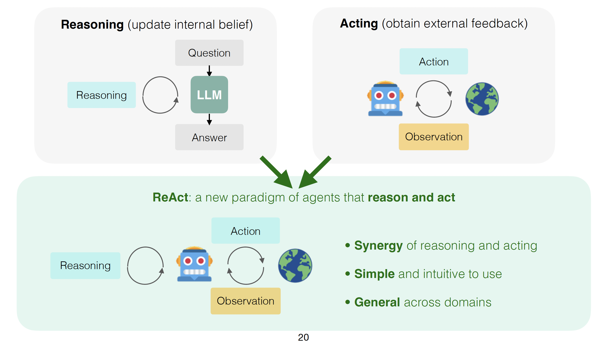
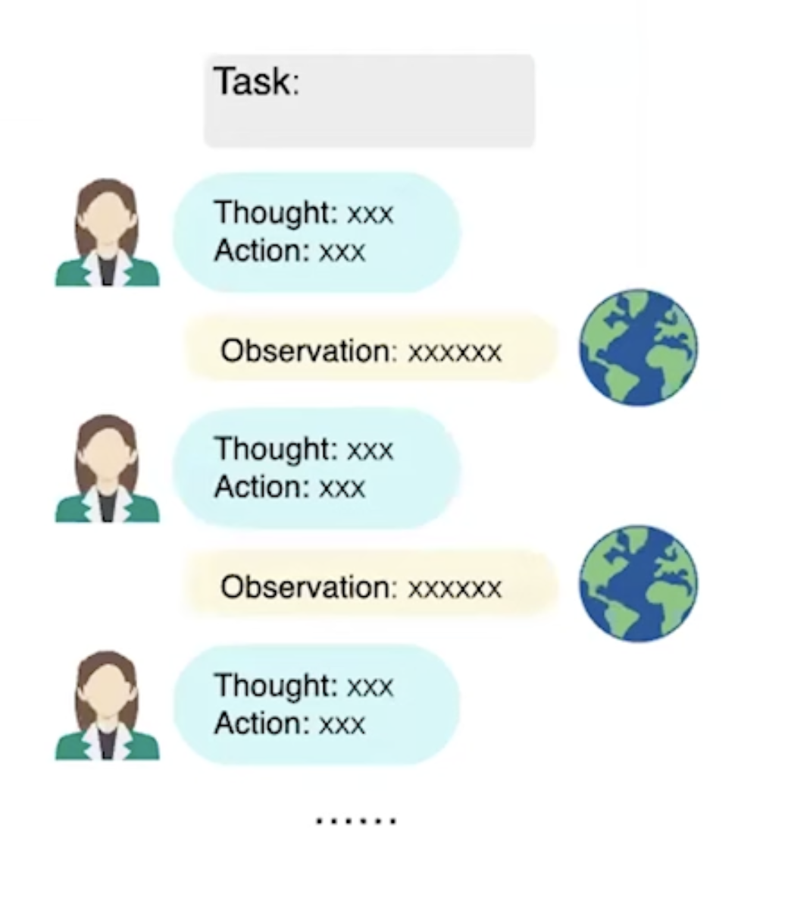
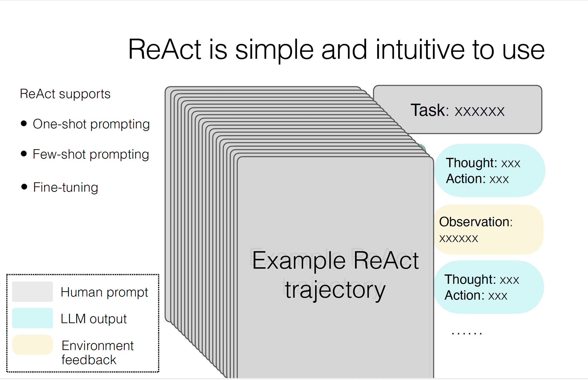
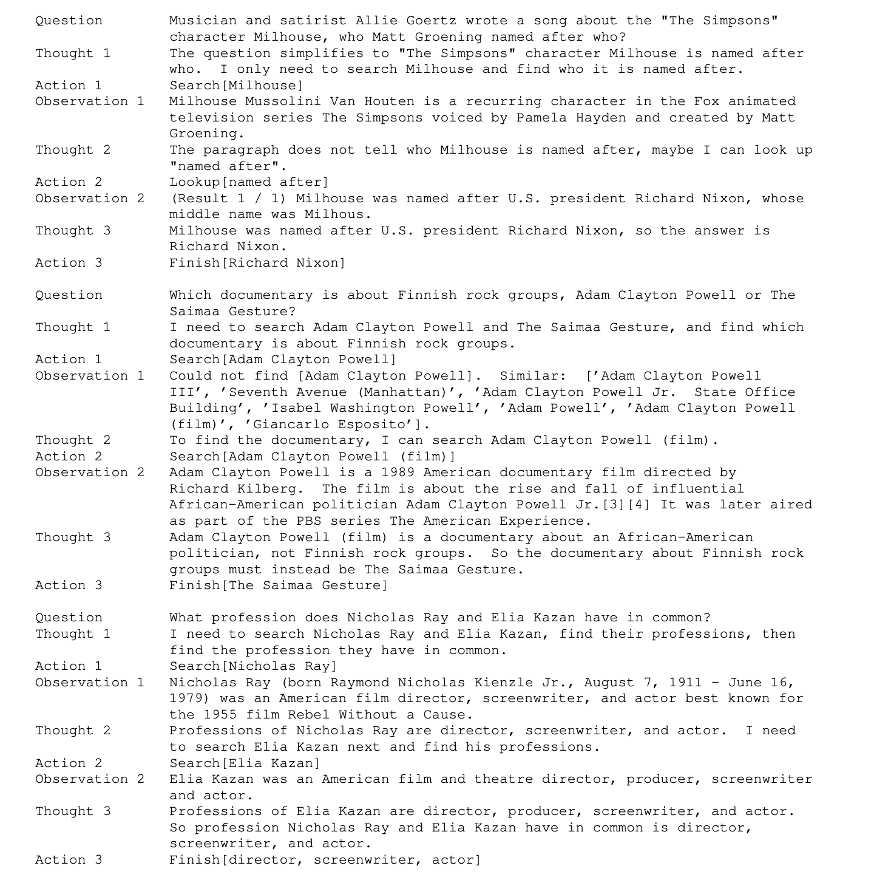
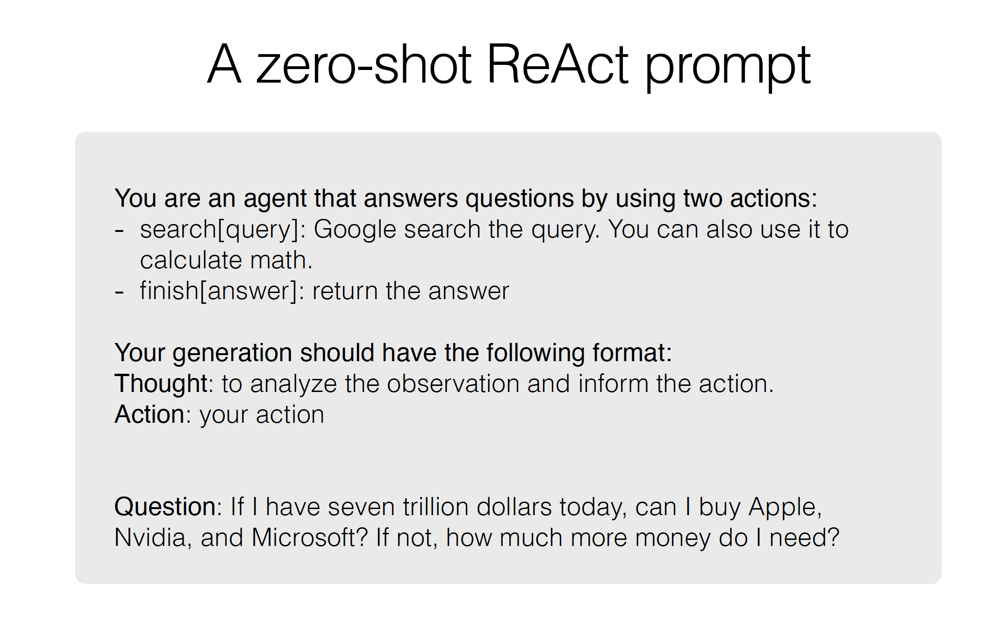
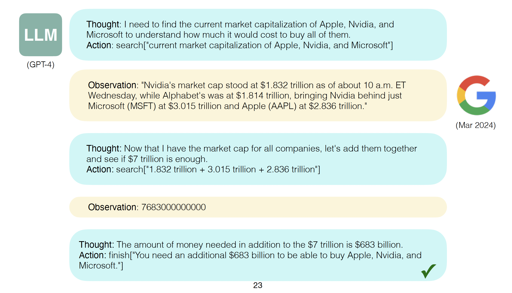
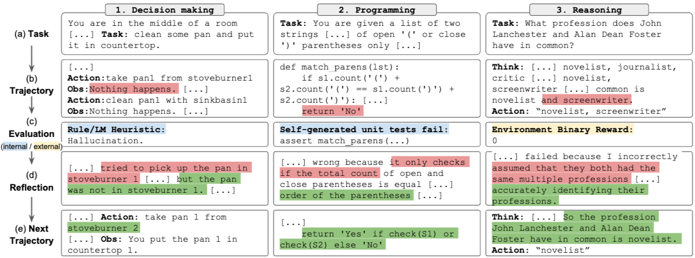
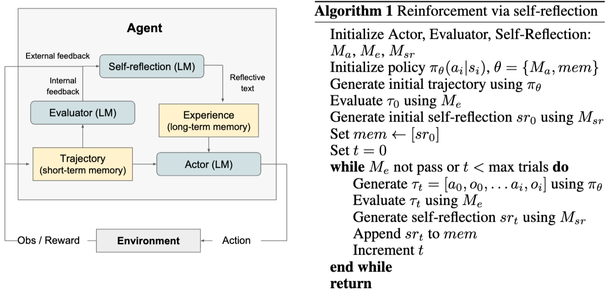
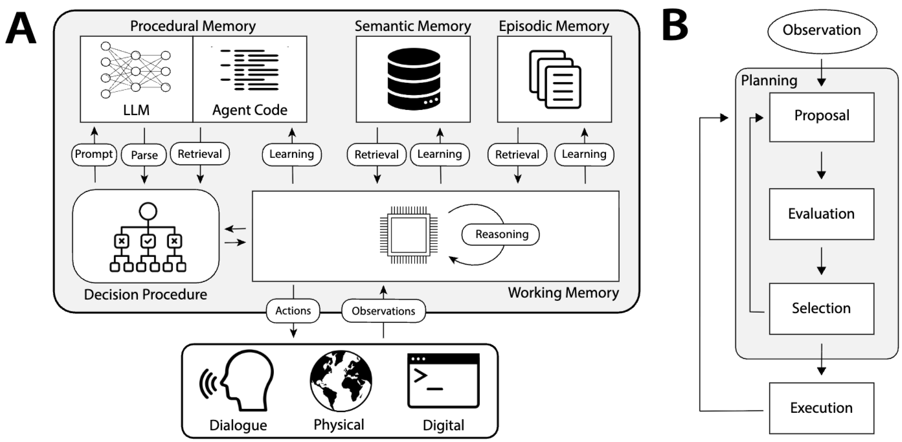

# CS294/194-196 LLM Agent: 2.LLM Agent History
## LLM Agent
LLM Agent is an “agent” by defining “intelligent” and “environment” - “intelligent” system that interacts with some “environment”.

## Advancement of LLM Agent 
<b> Level 1: Text agent </b>  
Uses text action and observation.  
Examples: ELIZA, LSTM-DQN

<b> Level 2: LLM agent </b>  
Uses LLM to act.  
Examples: SayCan, Language Planner

<b> Level 3: Reasoning agent </b>  
Uses LLM to reason to act.  
Examples: ReAct, AutoGPT

## Reasoning or Acting
    

<b> Reasoning </b> 
Flexible and general to augment to test-time compute(inference).  
But Lack of external knowledge and tools

<b> Acting </b>  
Flexible and general to augment knowledge, computation, feedback, etc.  
But Lack of external knowledge and tools

## ReAct(Reason + Act) LLM Agent 
    

ReAct is a general paradigm that combines reasoning and acting with LLMs. ReAct prompts LLMs to generate verbal reasoning traces and actions for a task. This allows the system to perform dynamic reasoning to create, maintain, and adjust plans for acting while also enabling interaction to external environments (e.g., Wikipedia) to incorporate additional information into the reasoning.  
A basic loop with the following steps:
1. reason and plan actions to take
2. take actions using tools (regular software functions)
3. observe the effects of the tools and re-plan or react as appropriate

  

The key concept of ReAct is simple: augment the agent’s action space to $\hat{A} = A \cup L$, where L is the space of language. An action $\hat{\text{a}_t} \in L$ in the language space refers to as a thought or a reasoning trace. The "Thought" does not affect the external environment, thus leading to no observation feedback.
Instead, a thought $\text{a}_t$ aims to compose useful information by reasoning over the current context $\text{c}_t$, and update the context $\text{c}_{t+1} = (\hat{\text{a}_t}, \text{c}_t)$ to support future reasoning or acting.

Simply speaking, setup where a frozen large language model and prompted with few-shot in-context examples, ReAct prompts LLMs to generate both verbal reasoning traces and actions pertaining to a task in an interleaved manner, which allows the model to perform dynamic reasoning to create, maintain, and adjust high-level plans for acting (reason to act), while also interact with the external environments (e.g. Wikipedia) to incorporate additional information into reasoning (act to reason).  
결론적으로, 행동 공간을 '실제 행동'에 '언어적 생각'을 추가하여 확장했다는 것은, LLM에게 외부 환경과의 상호작용과 내부적인 전략 수립 및 기억 유지라는 두 가지 필수적인 지능적 행위를 교차적으로(interleaved manner) 수행할 수 있는 능력을 부여했음.

<b> "The reasoning is an internal action for agents." </b>

### ReAct Prompt
    

Above shows the simple ReAct prompt. Given task, wrtie "how you think" and "what to do" to solve the task along with the observations until you solve the task.

    

The previous simple prompt picture is one example and you can use this example as one-shot prompting. Then LLM will learn form the exmple and follow the same trajectory from the example. With more examples, you can do few-shot prompting and more you are doing basically fine-tuning the LLM.

    

The above show real trajectory example prompt used for ReAct from the paper.

#### Zero-shot Prompt example
 
    

### ReAct vs CoT
<b> Hallucination of CoT </b>  
Hallucination is a serious problem for CoT, resulting in much higher false positive rate than
ReAct (14% vs. 6%) in success mode, and make up its major failure mode (56%). In contrast, the
problem solving trajectory of ReActis more grounded, fact-driven, and trustworthy, thanks to the
access of an external knowledge base.

<b> Better Reasoning of CoT </b>  
While interleaving reasoning, action and observation steps improves ReAct’s groundedness and trustworthiness, such a structural constraint also reduces its flexibility in formulating reasoning steps, leading to more reasoning error rate than CoT.  
There is one frequent error pattern specific to ReAct, in which the model repetitively generates the previous thoughts and actions, and we categorize it as part of “reasoning error” as the model fails to reason about what the proper next action to take and jump out of the loop. (The author suspect that this could be due to the sub-optimal greedy decoding procedure, and future work using better decoding such as beam search might help address this issue.)

<b> Combination of CoT and ReAct </b>  
The best prompting method on HotpotQA and Fever are ReAct → CoT-SC and CoT-SC → ReAct respectively.

## Long-term Memory of LLM Agent 
LLM Agent has short term memory which is the context window. However, short term memory has limitation as above image shows.

### Reflextion
    

Reflextion model is uilizing three distinct models: an Actor which generates text and actions, an Evaluator model that scores the outputs produced by Actor model and a Self-Reflection model which generates verbal reinforcement cues to assist the Actor in self-improvement.

Core components of the Reflexion process are the notion of short-term and long-term memory. At inference time, the Actor conditions its decisions on short and long-term memory, similar to the way that humans remember fine-grain recent details while also recalling distilled important experiences from long-term memory.

    

In the RL setup, the trajectory history serves as the short-term memory while outputs from the Self-Reflection model are stored in long-term memory. These two memory components work together to provide context that is specific but also influenced by lessons
learned over several trials, which is a key advantage of Reflexion agents over other LLM action choice works.

### Cognitive architectures for language agents (CoALA)
  

<b> Short Term Memory </b>  
Working memory maintains active and readily available information as symbolic variables for the current decision cycle. This includes perceptual inputs, active knowledge (generated by reasoning or retrieved from long-term memory), and other core information carried over from the previous decision cycle (e.g., agent’s active goals).

<b> Long Term Memory </b>  
1. Episodic Memory: Episodic memory stores experience from earlier decision cycles. This can consist of training input-output pairs, history event flows, game trajectories from previous episodes, or other representations of the agent’s experiences. 

2. Semantic Memory: Semantic memory stores an agent’s knowledge about the world and itself.

3. Procedural Memory: It stores procedures that implement actions (reasoning, retrieval, grounding, and learning procedures), and procedures that implement decision-making itself.

## Future of LLM Agent
- Training: Train LLM for agents to establish synergy. Agents generate training examples for LLM.
- Interface: Agent-computer interface(ACI) to better solve tasks (without changing the agent).
- Robustness & Human: 
  - Autonomous tasks (e.g. coding with unit test) ~ “Can I solve it one time out of 1000 times?”
  - Human-in-the-loop tasks (e.g. customer service) ~“Would I fail it one time out of 1000 times?”
- Benchmark: It is important to build benchmark that related to real-world elements.

### References
- https://arxiv.org/pdf/2210.03629 (ReAct)
- https://arxiv.org/pdf/2303.11366 (Reflextion)
- https://arxiv.org/pdf/2309.02427 (CoALA)