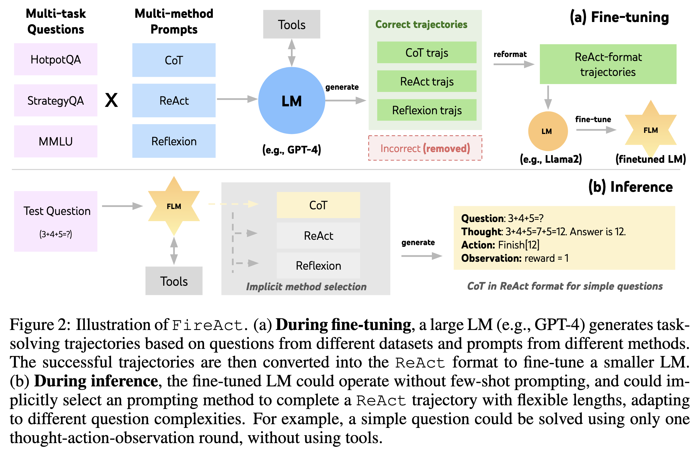
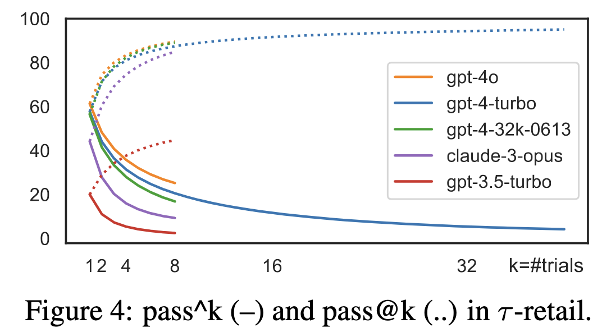

# Supplement: Future of LLM agents
## FireAct: Training LLM for agents
https://arxiv.org/abs/2310.05915

GPT-4 같은 강력한 LLM을 사용해 다양한 방법(ReAct, CoT, Reflexion 등)과 여러 작업에서 성공적인 행동 궤적을 생성합니다. 이 데이터를 ReAct 포맷으로 통일해서 미세조정 데이터로 활용
React-format trajectories: Thought-Action-Observation 형식: GPT-4는 문제를 풀기 위해 Thought → Action → Observation 형태의 궤적을 생성한다.
Smaller LM을 이 데이터로 Fine-tuning: 정제된 ReAct 포맷 데이터를 이용해 작은 모델(Llama2 등)을 미세조정한 모델 → FLM(Fine-tuned LM)

    


성공적인 trajectory는 Correct trajectories(초록색)로 수집
실패한 trajectory는 제거(빨간 박스)
여러 방 식의 궤적(CoT, ReAct, Reflexion)을 하나의 통일된 표준 형태로 변환한다.
```
ReAct-format trajectory: Thought → Action → Observation
```

즉, FireAct는 “큰 LLM으로부터 다양한 성공 사례를 끌어모아 작은 LLM에게 학습시키는 과정”이다.
FLM은 이미 다양한 문제 해결 방식을 학습했기 때문에 “프롬프트에 예시를 넣어줄 필요 없음”.
문제 난이도에 따라 적절한 방식(CoT, ReAct, Reflexion)을 암묵적으로 선택

## Human-computer Interface (HCI)
에이전트를 최적화 하는 대신, 환경을 최적화 해보자. 인간도 좋은 도구가 주어진다면 문제를 풀기 더욱 쉽다. (text editor vs IDE)

e.g.,) agent가 OS에서 파일을 찾는 문제

- No Search: ``ls/cd/grep`` 만 사용	단순	매우 비효율적, 사람이 직접 탐색하는 수준
- Iterative Search: 검색 결과를 next로 하나씩 열람	search는 됨	결과 많으면 비효율적, 반복 행동 필요
- Summarized Search: 검색 결과 전체를 한 번에 요약, 필요 시 쿼리 리파인 유도	가장 효율적, 즉시 정답에 접근	없음 (개선된 인터페이스)

## τ-bench: A Benchmark for Tool-Agent-User Interaction in Real-World Domains
https://arxiv.org/pdf/2406.12045

시뮬레이션된 사용자(User)와 에이전트(Agent) 상호작용
사용자(또는 사용자 의도)는 LLM 기반 시뮬레이터로 생성되며, 에이전트는 자연어 대화와 함께 API 호출을 통해 작업을 수행한다.

대표적인 테스트 도메인으로 두 가지를 제시:
- 소매(Retail): 주문·반품·재고 처리
- 항공(Airline): 항공편 예약·변경 정책 준수

### 평가 방법
대화가 끝난 후, 에이전트가 API를 통해 조작한 데이터베이스 상태를 사전에 정의된 목표 상태 (goal state)와 비교해 성공 여부를 판단.
에이전트의 일관성을 보기 위해 pass^k라는 새로운 지표를 도입한다.(pass^k: 같은 과제를 k번 반복했을 때 모두 성공해야 통과로 간주)
높은 k에서의 성공률이 낮으면 “일관성 부족”으로 평가됨.

    

- pass@k: k번 중 한번이라도 성공
- pass^k: k번 모두 성공