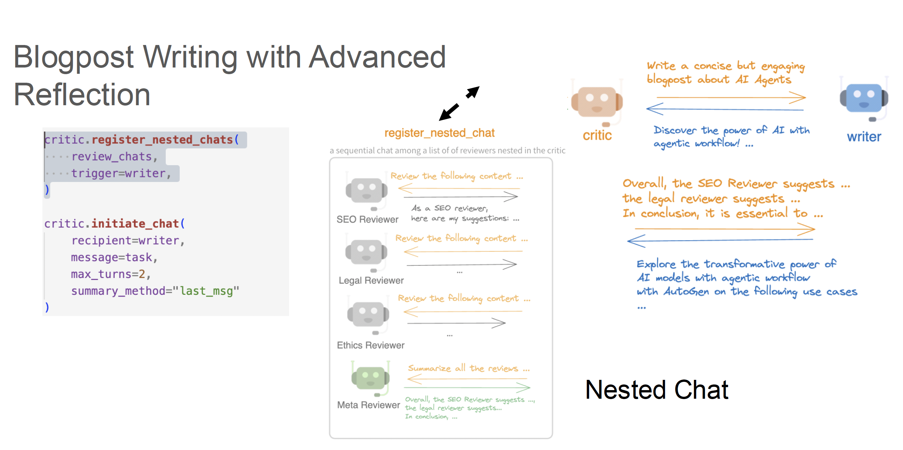
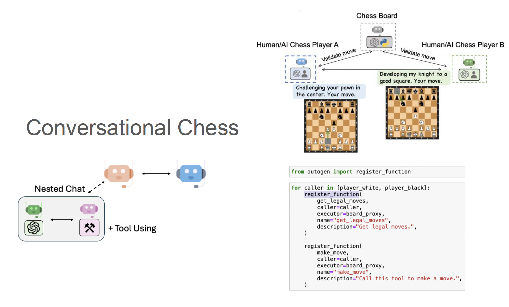
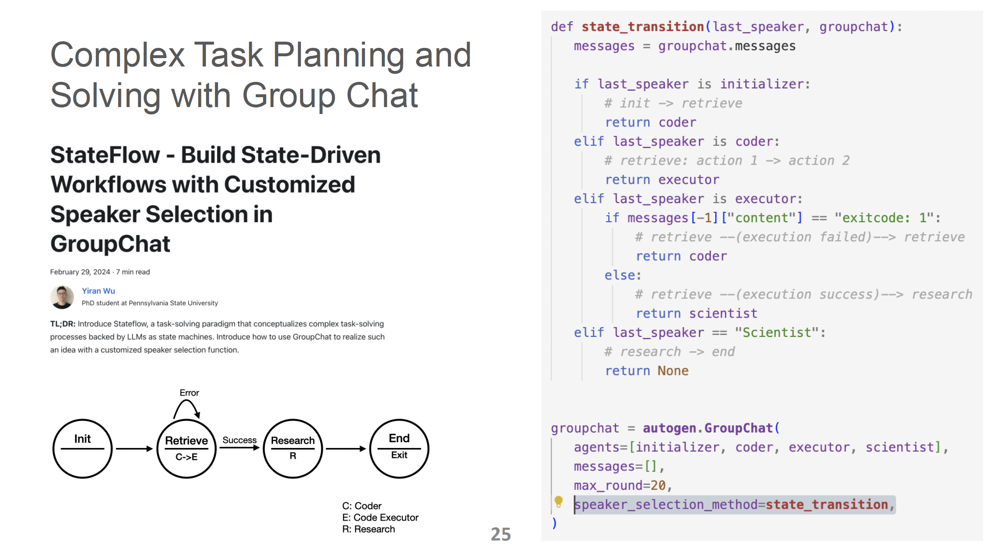
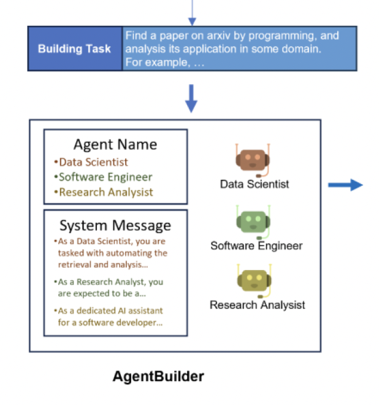
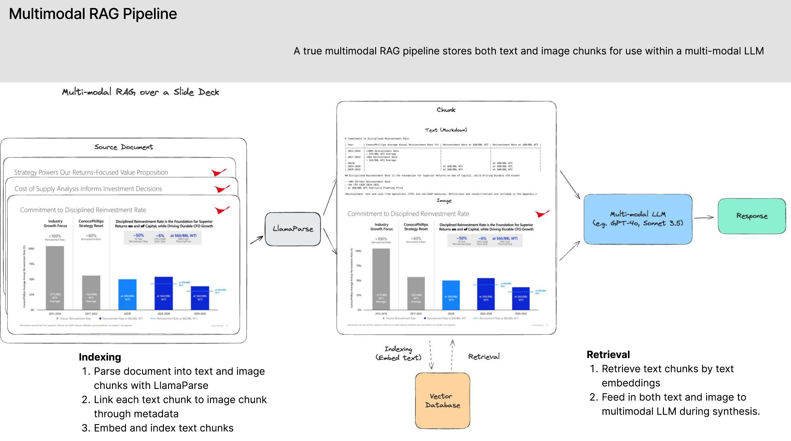

# CS294/194-196 LLM Agent: 3. Agentic AI Frameworks/AutoGen & Multimodal Assistant

## AI Frameworks / AutoGen
### Future of AI Application (& Examples)
미래의 AI 애플리케이션은 단순히 텍스트나 이미지를 생성하는 '생성형(Generative)' 단계를 넘어, 인간을 대신해 복잡한 작업을 수행하는 "에이전트형(Agentic)" 으로 진화하고 있습니다. 이는 단일 모델 중심에서 여러 에이전트와 도구가 결합된 복합 AI 시스템(Compound AI Systems) 으로의 패러다임 전환을 의미합니다.

주요 예시: 개인 비서, 자율 로봇, 게임 에이전트를 비롯하여 자동 과학 발견을 수행하는 과학 에이전트, 웹 탐색을 자동화하는 웹 에이전트, 스스로 소프트웨어를 구축하는 소프트웨어 에이전트 등

### Agentic Programming
#### 정의(Definition)
에이전트형 프로그래밍은 AI 에이전트가 인간의 개입을 최소화하면서 독립적으로 복잡한 워크플로우를 실행하도록 설계하는 방식

#### 주요 측면(Aspects)
- 복잡한 작업 처리 및 응답 품질 향상:
  - 자연스러운 반복을 통한 개선(Improve over natural iteration): 에이전트 간의 상호작용과 피드백과정을 통해 결과물의 품질을 높임.
  - 분할 정복(Divide & Conquer): 복잡한 과제를 작은 단위로 쪼개어 각 에이전트에게 할당 -> 품질과 정확도를 높임.
  - 그라운딩 및 검증(Grounding & Validation): 외부 지식이나 도구를 활용하여 모델의 태생적 한계를 극복하고 결과의 신뢰성을 확보합니다.
- 이해, 유지보수, 확장 용이성 (Easy to understand, maintain, extend):
  - 모듈식 구성(Modular composition): 각 에이전트를 독립적인 모듈로 설계하여 시스템 확장 및 디버깅이 쉬움.
  - 자연스러운 인간 참여(Natural human participation): 인간이 시스템의 특정 에이전트 역할을 대신하거나 대화에 개입하기가 매우 수월. (이것도 테스트, 디버깅 목적인 듯)
  - 신속하고 창의적인 실험(Fast & creative experimentation): 다양한 에이전트 구성을 빠르게 시도하며 최적의 솔루션을 탐색할 수 있다.

#### 이점(Benefits)
1. 유용한 인터페이스: 에이전트들이 자연어로 소통함.
2. 강력한 능력: 최소한의 감독으로 작동함.
3. 유용한 아키텍처: 직관적인 프로그래밍 패러다임.

### Desiderata (에이전트 프레임워크의 필요조건)
효과적인 에이전트 시스템 구축을 위해 프레임워크는 다음을 지원해야 합니다:
- 직관적이고 통합된 에이전트 추상화: 모델, 툴, 유저를 하나의 AI 시스템 내에서 통합.
- 유연한 멀티 에이전트 오케스트레이션: 정적/동적 워크플로우, 자연어/프로그래밍어, 컨텍스트 공유/아이솔레이션, 협업/경쟁, 중앙화/탈중앙화, 간섭/자동화 등 다양한 상호작용 패턴을 지원해야 함.
- 에이전트 설계 패턴: 대화(Conversation), 프롬프팅/리즈닝, 도구, 계획 수립(Planning), 다모델 지원, 멀티모달리티 지원
- 다양한 애플리케이션 요구사항 지원: 산업별로 상이한 워크플로우를 커스텀하게 구성할 수 있어야함.

### Types of AI Frameworks
- AutoGen: 멀티 에이전트 "대화(Conversation)" 기반 프로그래밍 -> 포괄적(Comprehensive) & 유연한 AI 에이전트 서비스 설계 가능
- LangGraph: 그래프 기반의 제어 흐름을 제공
- CrewAI: 고정된 고수준의 에이전트-태스크 워크플로우

### Autogen
AutoGen은 에이전트형 AI를 위한 프로그래밍 프레임워크로, "대화(Conversation)"를 중심요소로 사용하여 AI 에이전트의 설계를 단순화 하였습니다.

- Define Agents(에이전트 정의): AutoGen의 에이전트는 대화가 가능(Conversable)하며, LLM, 도구, 인간 또는 이들의 조합으로 자유롭게 맞춤 설정(Customizable)할 수 있습니다.
- 대화형 프로그래밍 (Conversation Programming): 에이전트 간의 대화 패턴(순차, 중첩, 그룹)을 정의하여 복잡한 로직 처리함.

#### 사용처(Usage)
##### 1. Blogpost Writing with Reflection (리플렉션을 통한 블로그 글쓰기)
"Two-Agent Reflection" 패턴의 기본 구조를 보여줍니다. 글을 작성하는 Writer 에이전트와 작성된 글을 비평하는 Critic 에이전트로 구성됩니다. 작동 방식: Writer가 초안을 작성하면 Critic이 이를 검토하고 개선안을 제안합니다. 예를 들어, "특정 사례를 추가하면 더 좋아질 것 같다"는 피드백을 주면 Writer가 이를 반영해 글을 수정하며, 이 과정을 통해 결과물의 품질이 향상됩니다.

##### 2. Blogpost Writing with Advanced Reflection (심화된 리플렉션을 통한 블로그 글쓰기)
    

위의 단순한 1:1 비평을 넘어선 "중첩 대화(Nested Chat)" 패턴을 설명합니다. Critic 에이전트 내부적으로 더 복잡한 검토 과정을 숨기고 있습니다. Critic이 호출되면 내부적으로 SEO 검토자, 법률 검토자, 윤리 검토자 등 여러 전문 에이전트와 순차적인 대화를 수행합니다.

그리고 마지막의 Meta Reviewer가 모든 전문 분야의 피드백을 요약하여 Writer에게 전달함으로써, 외부 에이전트(Writer) 입장에서는 단일 비평가와 대화하는 것처럼 보이지만 실제로는 전문가 팀의 종합 검토를 받는 효과를 얻습니다.

##### 3. Conversational Chess (대화형 체스 게임)
    

에이전트 간의 대화에 "도구 사용(Tool Use)"을 결합한 사례입니다. LLM은 체스 규칙을 완벽히 지키지 못하는 경우가 많으므로, 이를 보완하기 위해 Chess Board라는 도구 기반 에이전트를 도입합니다. 이 에이전트는 인간 또는 AI 플레이어가 수를 두면get_legal_moves나 make_move 같은 파이썬 함수를 실행하여 해당 수가 유효한지 검증합니다. 즉, 에이전트들이 실제 물리적인 규칙이나 도구의 제약을 엄격히 준수하게 만듭니다.

##### 4. Complex Task Planning and Solving with Group Chat (그룹 대화를 통한 복잡한 작업 기획)
에이전트들이 자율적으로 협업하는 '그룹 대화(Group Chat)' 패턴입니다. 여기서 관리자(Manager)의 역할은 전체 대화 흐름을 모니터링하며, 현재 상황에서 다음에 발언할 가장 적절한 에이전트(예: Alice, Bob, User Proxy 중 하나)를 결정하는 것입니다. 작업의 진행 상황에 따라 동적으로 워크플로우를 결정할 수 있어 유연성이 높습니다.

<b>프로세스</b>
  1. 다음 발언자 선택
  2. 선택된 에이전트에게 응답 요청
  3. 생성된 응답을 그룹 내 모든 에이전트에게 브로드캐스트

##### 5. StateFlow - Build State-Driven Workflows (상태 기반 워크플로우)
    

그룹 대화에 엄격한 제어 로직을 결합한 'StateFlow' 패러다임을 보여줍니다. 복잡한 작업 수행 과정을 "상태 머신(State Machine)"으로 개념화하여, LLM이 미리 정의된 상태 전이(state transfer) 규칙에 따라 움직이게 합니다. 예를 들어, Retrieve 단계에서 에러가 발생하면 다시 코드를 수정하는 단계로 돌아가고, 성공하면 Research 단계로 넘어가는 식의 흐름을 state_transition 함수로 직접 제어합니다. 이를 통해 LLM의 자율성과 프로그램의 제어 가능성(Controllability) 사이의 균형을 맞추어 시스템의 신뢰도를 높입니다

### SCIAgent
AutoGen 프레임워크를 기반 과학 연구용 멀티 에이전트 리즈닝 에이저트로, 과학적 발견을 자동화하기 위해 지식 그래프와 멀티 에이전트 시스템을 결합하여 가설 수립 및 검증을 수행

### Agent-E
AutoGen 프레임워크를 기반으로 구축된 혁신적인 자율형 웹 에이전트, 계층적 에이전트 팀을 구성하여 복잡한 웹 환경에서 항공권 예약이나 클리닉 양식 작성 등의 작업을 자동화

### AutoBuild
    

어떤 에이전트가 필요한지 일일이 설계하고 코딩할 필요 없이, 자동으로 멀티 에이전트 시스템을 구축(Build) 해주는 프레임워크.
AutoBuild는 AutoGen 프레임워크 내에서 복잡한 작업을 위한 멀티 에이전트 시스템을 자동으로 구축해주는 핵심 기능.

어댑티브 빌드(Adaptive Build): 작업을 여러 단계의 하위 작업(Subtask)으로 쪼개고, 각 단계마다 필요한 에이전트 팀을 동적으로 구성하거나 기존 에이전트 라이브러리에서 최적의 에이전트를 선택하여 투입  

빌드 매니저(LLM)는 사용자가 입력한 작업 요구사항을 분석하여 어떤 전문가들이 필요한지 결정합니다. 이때 각 에이전트에게 이름과 함께 매우 상세한 "시스템 메시지(System Message)"를 생성해 주는데, 이 메시지가 바로 에이전트의 페르소나가 됩니다.
e.g., 시스템 메시지를 통한 역할 주입 - 빌드 매니저는 단순히 "너는 데이터 분석가야"라고 말하는 수준을 넘어, 에이전트가 어떤 기술(Python, BeautifulSoup 등)을 사용해야 하는지, 그룹 채팅에서 어떻게 소통해야 하는지, 그리고 어떤 상황에서 작업을 종료(TERMINATE)해야 하는지까지 포함된 상세 지침을 작성하여 주입합니다.

1. 작업 정의: 사용자가 해결하고자 하는 작업에 대한 일반적인 설명과 예시를 제공합니다.
2. 에이전트 생성(build()): LLM 기반의 '빌드 매니저'가 작업을 분석하여 필요한 에이전트의 이름, 사용하는 모델, 그리고 상세한 시스템 메시지(역할 정의)를 자동으로 작성합니다.
예를 들어, "arXiv에서 논문을 찾아 분석하라"는 작업을 주면, 시스템은 자동으로 '데이터 스크래퍼', '소프트웨어 엔지니어', '연구 분석가' 등의 역할을 가진 에이전트들을 생성합니다.
3. 협업 구조 완성: 생성된 에이전트들을 그룹 채팅(Group Chat) 형태로 묶어 서로 대화하며 문제를 해결할 수 있는 환경을 구축합니다.
4. 실행 및 결과 도출: 구축된 에이전트 팀이 실행 작업(Execution Task)을 전달받아 협업을 시작합니다.

## Multimodal Assistant
LlamaIndex는 개발자가 프로토타입에서 운영 단계까지 기업용 데이터를 기반으로 "컨텍스트 증강 LLM 애플리케이션(Context-augmented LLM apps)" 을 구축할 수 있도록 지원하는 툴킷입니다.

### Retrieve (검색)
데이터 품질은 모든 운영용 LLM 앱의 필수 구성 요소이며, "Garbage in, Garbage out" 원칙이 적용됩니다.

#### Basic RAG (기본 RAG)
- 특징: 단순 텍스트 분할(Text Splitting), Top-K 검색, 상태 저장 안 함(Stateless).
- 한계: 복잡한 문서 구조를 무시하며, 쿼리 이해도가 낮아 할루시네이션(환각)을 유발하고 의사결정 강화에 한계가 있습니다.

#### High-Quality Multi-Modal RAG
- Advanced Parsing (LlamaParse): 표, 차트, 이미지, 불규칙한 레이아웃이 포함된 복잡한 PDF를 AI 기반으로 파싱하여 데이터 무결성을 유지합니다.
- Advanced Indexing: LlamaParse로 읽어들인 데이터를 똑똑하게 저장하기 위한 방식이 Advanced Indexing입니다. 텍스트, 표, 이미지 등 이질적인 데이터를 계층적으로 인덱싱하고, 각 요소의 요약본을 만들어 참조(Reference)하는 방식으로 재귀적 검색(Recursive Retrieval)을 수행합니다. 아래 방법론을 통해 텍스트, 수치 데이터가 담긴 표, 시각적 다이어그램 등 서로 다른 형태의 데이터를 하나의 논리적인 계층 구조 안에서 효과적으로 관리할 수 있습니다.
  - 요약본 기반 참조 (Summary-based References): 표(Table)나 이미지(Image) 자체는 텍스트 임베딩 모델이 의미를 완벽히 파악하기 어렵기 때문에 각 요소에서 "하나 이상의 텍스트 표현(요약본)"을 추출하여 이를 벡터 데이터베이스에 인덱싱합니다. 이 요약본들은 실제 원본 데이터(Source Chunk)를 가리키는 '노드(Node)' 역할을 합니다.
  - 재귀적 검색 (Recursive Retrieval): 사용자가 질문을 던지면 시스템은 먼저 인덱싱된 '요약본 노드'를 검색합니다. 관련 있는 요약본이 찾아지면, 시스템은 해당 노드가 참조하고 있는 원본 표나 고해상도 이미지, 또는 더 큰 텍스트 청크를 재귀적으로 추적하여 가져옵니다.

##### Multi-Modal RAG Pipeline
    

LlamaParse -> Advanced Indexing으로 검색된 데이터를 답변으로 만드는 과정도 진화했습니다. 문서를 텍스트와 이미지 청크로 파싱한 뒤 메타데이터로 연결합니다. 텍스트 임베딩으로 관련 청크를 검색한 후, 생성 시 멀티모달 LLM(GPT-4o, Claude 3.5 Sonnet 등)에 텍스트와 이미지를 동시에 입력하여 시각적 데이터에 기반한 답변을 얻습니다.
조금 더 자세히 보면, 문서 내의 멀티 모달리티 데이터(이미지, 차트 등) 를 생성 단계에서 직접 활용하는 방법으로, 아래 기법을 활용해서 LLM이 텍스트 설명뿐만 아니라 이미지 속의 시각적 정보(예: 차트의 추세, 도식의 구조)를 직접 분석하여 훨씬 더 정확하고 풍부한 답변을 생성하도록 합니다.

- 메타데이터 연결 (Metadata Linking): 문서를 파싱할 때 텍스트 청크와 관련 이미지 청크를 분리하되, 메타데이터를 통해 서로를 연결합니다. 예를 들어, 특정 기술을 설명하는 텍스트와 그 구조를 보여주는 다이어그램을 한 쌍으로 묶어두는 방식입니다.
- 검색 및 합성 (Retrieval & Synthesis):
  - 검색: 사용자의 질문과 가장 유사한 텍스트 청크를 임베딩 검색을 통해 찾아냅니다.
  - 합성: 검색된 텍스트와 연결된 이미지 청크를 함께 추출하여 GPT-4o나 Claude 3.5 Sonnet과 같은 멀티모달 LLM에 입력합니다

### Report Generation (보고서 생성)
단순 챗봇 응답을 넘어 텍스트와 이미지가 섞인 형태의 종합 보고서를 자동 생성합니다. 이는 단순 답변보다 시간 절약 및 역량 강화 측면에서 훨씬 높은 투자 대비 효과(ROI)를 제공합니다.

### Agentic Reasoning over Complex Input (복잡한 입력에 대한 에이전트적 추론)
단순한 검색을 넘어 LLM이 스스로 판단하고 계획하여 어려운 과제를 해결하는 핵심 능력.

#### Agentic RAG: 에이전트적 추론이 데이터 검색(Retrieval) 영역에 적용된 구체적인 형태
모든 데이터 인터페이스를 '도구(Tool)'로 간주하고, 에이전트 추론 루프(순차적, DAG, 트리 구조 등)를 통해 복잡한 과제를 해결합니다. 즉, 기본적인 RAG에서는 검색 과정이 고정된 파이프라인(질문 → 검색 → 답변)을 따르지만, 에이전트 RAG에서는 "데이터 검색 인터페이스 자체를 하나의 '도구'" 로 간주합니다. 따라서 에이전트는 벡터 데이터베이스 검색뿐만 아니라 SQL 쿼리 실행, 웹 검색, API 호출 등 다양한 도구 중 현재 질문을 해결하는 데 가장 적합한 것을 스스로 선택합니다. 

#### Unconstrained vs. Constrained Flow: 추론의 방식과 자율성
- Constrained (제약된 흐름): 라우터 기반으로 인간이 흐름을 정의하여 신뢰성이 높지만 표현력은 제한적입니다.
- Unconstrained (제약 없는 흐름): React, LLM Compiler 등을 사용하여 에이전트가 스스로 계획을 세우며 표현력이 높지만, 무한 루프 위험과 높은 비용이 발생할 수 있습니다.

#### Agentic Orchestration Foundations (LlamaIndex Workflows)
LlamaIndex는 에이전트 오케스트레이션 프레임워크가 갖춰야 할 필수 속성으로 다음 6가지를 정의합니다.
- 이벤트 기반 (Event-Driven): 각 단계를 입력 이벤트를 수신하고 출력 이벤트를 내보내는 모델로 설계하여, 복잡한 비동기 로직을 효과적으로 관리합니다.
- 코드 우선 (Code-first): 오케스트레이션 로직을 파이썬 코드로 직접 작성합니다. 이는 읽기 쉽고 확장성이 뛰어나며, 개발자에게 친숙한 환경을 제공합니다,.
- 구성 가능성 (Composable): 세분화된 작은 워크플로우들을 결합하여 더 높은 수준의 복잡한 시스템을 구축할 수 있습니다.
- 유연성 (Flexible): LLM 호출뿐만 아니라 일반 파이썬 코드를 사용하여 로직을 자유롭게 작성할 수 있습니다,.
- 디버깅 및 관찰 가능성 (Debuggable & Observable): 시스템의 상태를 관찰하고 각 단계를 추적할 수 있어, 추론 과정에서 발생하는 오류를 쉽게 찾아낼 수 있습니다.
- 프로덕션 배포 용이성: 주피터 노트북에서 작성한 코드를 실제 운영 환경의 서비스로 쉽게 전환할 수 있습니다.

#### Compare to graph-based approaches
기존 그래프 방식(Query Pipelines)은 복잡한 워크플로우에서 읽기 어렵고 비파이썬적(Non-Pythonic)이었으나, 워크플로우는 더 높은 가독성과 유지보수성을 제공합니다.

#### Benefits & Risks
장점: 고난도 연구 과제 수행, 다단계 질문 처리 가능.
단점: LLM의 신뢰성 문제 및 도구 오용 위험이 있어 인간의 개입이 필수적으로 요구됩니다.

### Deployment (배포)

#### 운영 환경을 위한 5대 필수 요구사항
에이전트 워크플로우를 최종 사용자에게 서비스하기 위해서는 다음과 같은 조건이 충족되어야 합니다.

- 캡슐화 및 재사용성 (Encapsulation and re-use): 각 에이전트의 기능을 독립적인 서비스로 캡슐화하여 관리해야 합니다.
- 표준화된 통신 인터페이스: 에이전트 상호 간, 그리고 클라이언트와의 원활한 소통을 위해 중앙 메시징 레이어와 같은 표준화된 통신 규약이 필요합니다.
- 확장성 (Scalability): 수많은 사용자 요청과 다양한 에이전트의 증가를 동시에 수용할 수 있는 구조여야 합니다.
- 인간 개입 서비스 (Human-in-the-loop): 에이전트가 판단하기 어려운 상황에서 사용자에게 승인을 받거나 추가 정보를 요청하는 기능이 필수적입니다.
- 디버깅 및 관찰 가능성 (Debugging and observability): 개발자가 시스템의 상태를 모니터링하고 오류를 추적할 수 있는 도구가 뒷받침되어야 합니다.

#### llama-deploy
에이전트 워크플로우를 마이크로서비스로 배포하며, 중앙 메시지 큐를 통해 서비스 간 통신을 관리합니다. Docker-compose 및 Kubernetes를 통한 쉬운 배포를 지원합니다.

