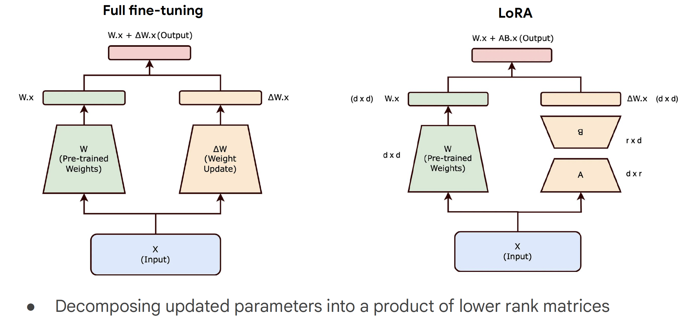

# CS294/194-196 LLM Agent: 4. Enterprise GenAI Trends & AI Agents

## Key Trends in Generative AI
- 컴퓨팅 패러다임의 변화: 최근 몇 년간 머신러닝(ML)은 컴퓨터로 가능한 일에 대한 인간의 기대를 완전히 바꾸어 놓았습니다. 우리가 실행하고자 하는 계산의 종류와 이를 구동하는 하드웨어가 극적으로 변화하고 있습니다.
- 규모의 경제(Scaling Laws): 계산량, 데이터, 모델 크기를 늘릴수록 더 나은 결과가 도출된다는 점이 지난 10년간 입증되었습니다. 이미지 분류(ImageNet), 음성 인식(LibriSpeech) 등에서 인간 수준을 넘어서는 비약적인 성능 향상이 있었습니다.
- 파운데이션 모델의 구조: 현대 AI의 근간은 트랜스포머(Transformer) 아키텍처, 자기회귀(Autoregressive) 훈련, 그리고 조 단위 토큰의 대규모 데이터 결합에 있습니다. 모델은 '마스킹' 기법을 통해 다음 토큰을 예측하는 방식을 학습하며 방대한 지식을 습득합니다
- 유용한 에이전트로의 진화: 단순히 사전 학습된 모델을 넘어 실제 비즈니스에 유용한 에이전트를 만들기 위해 지도 미세 조정(SFT)과 인간 피드백 기반 강화학습(RLHF) 등의 사후 학습 과정이 필수적입니다.
  - SFT: Effective, but requires lots of training data sets.
  - RLHF: Practical 

## Enterprise Trends

### Trend 1- The obvious: AI is moving so much faster
- 도입 속도의 가속화: 과거에는 AI 모델 하나를 배포하는 데 수개월에서 수년이 걸렸으나, 이제는 사전 학습된 베이스 모델 덕분에 며칠 만에 애플리케이션 구축이 가능해졌습니다.
- 개발의 민주화: AI 전문가나 데이터 과학자뿐만 아니라, 일반 개발자나 심지어 학생들도 대규모 언어 모델을 사용하여 AI 애플리케이션을 구축할 수 있게 되었습니다.

과거에는 collect data -> process data -> feed into algorithm 과정을 거쳐서 AI 개발을 해야 했으나 지금은 pretrained 된 모델에 파인튜닝, 프롬프팅 기법을 더해 누구나 AI 개발을 할 수 있게 되었다. 

### Trend 2- Technical Trends
- 단일 일반화 모델: 특정 작업마다 별개의 모델을 만들던 방식에서, 수백만 가지 작업을 일반화하여 수행할 수 있는 단일 모델(Pathways) 체제로 진화하고 있습니다.
- 멀티모달 통합: 서로 다른 모달리티 모델이 하나로 합쳐져 모든 형태의 데이터를 이해하고 생성하는 방향으로 가고 있습니다.
- 희소 모델(Sparse Models): 추론 시 모든 노드를 실행하는 밀집 모델과 달리, 필요한 경로만 실행하는 효율적인 희소 모델로 전환되어 지연 시간과 비용을 줄이고 있습니다. (<-> Dense Models)

### Trend 3- It is the choice of the platform that matters
모델 성능이 상향 평준화되면서 특정 모델 자체보다 이를 관리하는 플랫폼의 선택이 중요해졌습니다.

### Trend 4- Cost of API calls is approaching 0
모델 효율성 개선과 하드웨어 발전으로 인해 토큰당 비용이 급격히 하락하고 있습니다.

### Trend 5- Search
LLM과 검색의 결합: 모델은 과거 데이터에 고정되어 있고(Stale data), 환각(Hallucination)을 일으키며, 출처를 명확히 밝히지 못하는 한계가 있습니다. 이를 해결하기 위해 실시간 정보와 기업 내부 문서를 검색하여 답변의 근거로 삼는 검색 기술이 LLM과 통합되는 것이 강력한 트렌드로 자리 잡았습니다.

### Trend 6- Enterprise Search/Assistant
많은 기업이 투자를 통해 얻은 가장 큰 가치는 내부 직원의 생산성을 높이는 어시스턴트 구축에 있습니다. 기업 고유 지식을 검색하고 업무를 보조하는 도구가 엔터프라이즈 AI의 핵심 활용 사례가 되었습니다.

## Augmentation tools to enhance capabilities of foundation models
- 미세 조정(Fine Tuning): 특정 데이터에 맞춰 모델 가중치를 업데이트하여 성능을 최적화합니다.
- 지식 증류(Distillation): 거대 모델(Teacher)의 지식을 작고 빠른 모델(Student)로 전이시켜 비용과 성능의 균형을 맞춥니다.
- 그라운딩(Grounding/RAG): 신뢰할 수 있는 외부 데이터(웹 콘텐츠, 비공개 문서 등)를 검색하여 답변의 근거로 활용함으로써 사실 관계를 명확히 하고 환각을 최소화합니다.
- 함수 호출(Function Calling):LLM이 단순히 텍스트를 생성하는 수준을 넘어, 실시간 API, 데이터베이스, 외부 시스템과 상호작용하여 실제 행동(예: 항공권 예약, 재고 확인)을 취할 수 있게 합니다.

## Key Components of Customizations and Agent Builder

### Fine Tuning 
사전 학습된 모델(Pre-trained model)에 특정 데이터셋이나 작업을 추가하여 모델의 가중치를 업데이트하는 과정입니다. 엔터프라이즈 환경에서 범용적인 베이스 모델을 특정 비즈니스 사례나 도메인에 최적화하기 위해 사용됩니다.

- SFT (Supervised Fine-Tuning): 전문가가 작성한 '프롬프트-응답' 쌍으로 구성된 대규모 데이터셋(수만 개 이상)을 통해 학습합니다. 매우 효과적이지만 고품질 데이터를 확보하는 비용이 큽니다.
- RLHF (Reinforcement Learning from Human Feedback): 모델이 생성한 여러 옵션에 대해 사람이 선호도를 표시(thumbs up/down)하여 보상 모델을 만들고, 이를 통해 모델을 최적화합니다. SFT보다 전문가의 시간을 절약하면서도 실질적인 성능 향상을 이끌어낼 수 있습니다.
- Full Fine-Tuning: 모델의 모든 파라미터를 업데이트하는 방식으로, 매우 높은 성능을 제공하지만 엄청난 계산 자원과 비용이 발생하여 엔터프라이즈 실무에서는 점차 드물게 사용되는 추세입니다.

#### Conventional Fine Tuning
사전 학습된 모델의 체크포인트(예: BERT, PaLM)를 가져와 새로운 데이터셋에 대해 지도 학습(Supervised Learning)을 수행하며, 이 과정에서 모델의 모든 가중치(Weights)를 업데이트합니다.

#### Conventional Prompt Tuning 
백본 모델을 직접 수정하지 않고 입력값의 변화를 통해 모델을 적응시키는 방식입니다. 백본 모델의 가중치는 완전히 고정(Freeze)시킨 채, 입력 프롬프트 앞에 학습 가능한 '소프트 프롬프트(Soft Prompt)' 라고 불리는 벡터(보통 1~100개의 토큰)를 추가하여 이 부분만 최적화합니다.

이론적으로는 효율적이지만, 실제 현장에서는 단순히 몇 개의 예시를 넣는 '프롬프트 디자인'이 훨씬 간편하고 실용적이기 때문에 프롬프트 튜닝은 생각보다 널리 사용되지 않는 경향이 있습니다.

#### Parameter-Efficient Fine Tuning (PEFT)
모델의 모든 파라미터를 업데이트하는 대신, 극히 일부의 파라미터만 학습하거나 모델 상단에 작은 레이어를 추가하여 조정하는 방식입니다.

- 장점 (Pros)
  - 자원 최적화: 훨씬 적은 계산 능력과 메모리로도 학습이 가능하며 저장 공간을 획기적으로 줄여줍니다.
  - 파괴적 망각(Catastrophic Forgetting) 방지: 기존의 지식을 유지하면서 새로운 작업을 학습할 수 있도록 도와줍니다.
  - 데이터 효율성: 데이터가 부족한 환경에서도 풀 파이닝 튜닝보다 나은 일반화 성능을 보일 수 있습니다.
- 단점 (Cons)
  - 성능 차이: 자원이 풍부한 환경에서는 여전히 전체 파인튜닝이 PEFT보다 더 높은 성능을 보이는 경우가 많습니다.
  - 행렬 분해 손실: LoRA와 같은 기술 사용 시 행렬 분해 과정에서 약간의 정보 손실이 발생할 수 있으나, LLM의 과잉 매개변수화(Over-parameterized) 특성 덕분에 그 영향은 미미합니다.

#### Low-Rank Adaptation(LoRA)
사전 학습된 모델의 가중치는 고정(frozen)한 상태에서, 업데이트할 가중치 행렬을 두 개의 낮은 순위(Low-rank) 행렬의 곱으로 분해( $ΔW=BA$)하여 학습하는 기술입니다.
    
Updates the matrices A and B to track changes in the pretrained weights by using smaller matrices of rank r. Once LoRA training is complete, smaller weights are merged into a new weight matrix, without needing to modify the original weights of the pretrained model.

### Distillation
거대하고 성능이 뛰어난 교사(Teacher) 모델의 지식을 상대적으로 작고 효율적인 학생(Student) 모델로 전이하는 과정입니다.

- 목적: 높은 성능을 유지하면서도 추론 비용과 지연 시간(Latency)을 획기적으로 줄이기 위함입니다.
- 작동 방식: 학생 모델은 실제 정답(Hard Label)뿐만 아니라 교사 모델이 출력하는 확률 분포(Soft Label)를 학습합니다. 이때 온도(Temperature = Randomness)를 높여 확률 분포를 부드럽게 만들면 클래스 간의 유사성 정보를 더 잘 습득할 수 있습니다.
- 이점: 사람이 일일이 라벨링할 필요 없이 교사 모델이 생성한 라벨을 활용하므로 데이터 구축 비용이 절감됩니다.

### Grounding
LLM은 학습 시점 이후의 정보가 없고(Frozen in past), 자신 있게 거짓말을 하는 환각(Hallucination) 현상이 있으며, 출처를 명시하지 못하는 한계가 있습니다.

- Pre-hoc: 답변 생성 전 검색 결과를 통해 프롬프트를 보강합니다.
- Post-hoc: 답변 생성 후 검색 결과와 비교하여 답변의 정확성을 검증하고 출처(Citation)를 표기합니다.

#### RAG (Retrieval Augmented Generation)
질문이 들어오면 먼저 검색 엔진이나 벡터 데이터베이스에서 관련 정보(비공개 문서, 최신 웹 정보 등)를 Retrieve 하고, 이 정보를 프롬프트에 Augment하여 답변을 Generate 하게 합니다.

### Function Calling
LLM의 한계: 모델은 추론과 지식 요약에는 뛰어나나, 항공권 예약이나 재고 확인과 같은 실제 세계의 행동(Action)을 직접 수행할 수 없습니다.

- 작동 원리: 개발자가 도구(Tool)나 함수(Function)를 정의하여 모델에 제공하면, 모델은 사용자 요청을 분석하여 자신이 직접 해결할 수 없는 일임을 인지하고 적절한 함수와 그에 필요한 파라미터를 선택하여 호출을 요청합니다.
- 활용 사례
  - 실시간 정보 조회: BigQuery 데이터 조회, 주식 정보 확인.
  - 자율적 워크플로우: 고객 지원 시스템의 티켓 생성, CRM 레코드 검색, Google Drive 문서 읽기/쓰기.
- 의의: 모델을 단순한 '채팅 로봇'에서 외부 시스템과 상호작용하며 문제를 해결하는 유능한 에이전트로 진화시키는 핵심 도구입니다.

## References
- https://www.ibm.com/think/topics/lora
- https://towardsdatascience.com/understanding-lora-low-rank-adaptation-for-finetuning-large-models-936bce1a07c6/
- https://www.youtube.com/live/Sy1psHS3w3I
