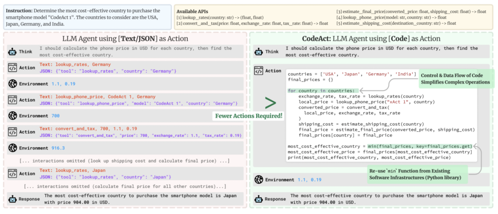

# CS294/194-196 LLM Agent: 6. Agents for Software Development

## Challenges in Coding Agents
코딩 에이전트를 개발하고 활용하는 데 있어 직면하는 주요 도전 과제는 다음과 같습니다.

- 환경 정의(Defining the Environment): 에이전트가 작업하고 테스트될 수 있는 적절한 환경을 설정하는 것이 어렵습니다.
- 관찰 및 액션 설계(Designing Observations/Actions): 에이전트가 환경과 상호작용하는 방식(코드 작성, 파일 수정 등)을 정의하는 정교한 설계가 필요합니다.
- 코드 생성 및 파일 위치 파악(Code Generation & File Localization): 정확한 코드를 생성하는 것뿐만 아니라, 방대한 코드베이스 내에서 수정이 필요한 정확한 위치를 찾아내는 '탐색(exploration)' 과정이 매우 중요하며 어렵습니다.
- 계획 및 오류 복구(Planning and Error Recovery): 복잡한 작업을 위한 계획을 세우고, 실행 중 발생한 오류(Error messages)를 보고 스스로 수정하는 능력이 요구됩니다
- 안전성(Safety): 에이전트가 실수로 메인 브랜치에 코드를 푸시하거나 테스트를 삭제하는 등 의도치 않은 해를 끼치지 않도록 보장해야 합니다.

## Software Development Environments
소프트웨어 개발 환경은 크게 실제 환경과 테스트 환경으로 나뉩니다.

- 실제 환경(Actual Environments): 소스 저장소(GitHub, GitLab), 작업 관리 소프트웨어(Jira, Linear), 문서 도구(Google Docs), 통신 도구(Gmail, Slack) 등이 포함됩니다.
- 테스트 환경(Testing Environments): 현재는 주로 코딩 자체에 집중되어 있으며, 에이전트의 성능을 객관적으로 측정하기 위한 다양한 벤치마크가 존재합니다.

### Simple Coding
언어 모델이 명세(Specification)를 코드로 변환하는 기초적인 능력을 테스트합니다. HumanEval이나 MBPP가 대표적이며, 주로 Python 표준 라이브러리 사용법, 독스트링(docstring), 간단한 입출력 예시 및 테스트를 포함합니다. 

### CoNaLa/ODEX
표준 라이브러리를 넘어 pandas, numpy, os 등 훨씬 다양한 라이브러리 활용 능력을 측정하는 더 넓은 도메인의 벤치마크입니다

- CoNaLa: StackOverflow에서 수집된 데이터를 바탕으로 하며, 표준 라이브러리를 넘어 pandas, numpy 등 훨씬 다양한 라이브러리 활용 능력을 측정합니다.
- ODEX: CoNaLa에 실행 기반 평가(execution-based evaluation)를 추가하여 생성된 코드가 실제로 작동하는지 확인합니다.

### ARCADE
데이터 과학 노트북(예: Jupyter) 환경을 활용한 벤치마크입니다. 노트북의 특성상 단계적인 구현(incremental implementation)이 가능하며, 기존에 작성된 코드 맥락(context) 내에서 다음 셀의 코드를 생성하고 실행 결과를 평가하는 방식을 취합니다.

### SWEBench
GitHub의 실제 이슈와 코드베이스를 활용하여 Pull Request 를 생성하는 능력을 평가하는 매우 인기 있는 데이터셋입니다. 에이전트는 전체 코드베이스를 이해하고(long-context understanding), 이슈를 해결하기 위해 여러 파일을 정밀하게 수정하여 최종적으로 테스트를 통과해야 합니다. 다만, 버그 수정 작업에 편향되어 있거나 학습 데이터에 이미 포함되었을 가능성(Leakage) 등의 한계가 지적됩니다.

### Pass@K
코드 생성 모델의 성능을 측정하는 대표적인 지표입니다. K개의 코드를 생성했을 때, 그중 최소 하나가 유닛 테스트를 통과할 확률을 의미합니다. 단순히 K개만 생성하면 변동성(variance)이 크기 때문에, 더 많은 N개를 생성한 후 그중 맞은 개수 C를 이용해 기댓값을 계산하는 통계적 방식을 사용합니다.
### Lexical/Semantic Overlap
실행 기반 평가(Pass@K 등)는 유닛 테스트가 반드시 필요하고 스타일을 무시한다는 단점이 있습니다. 이를 보완하기 위해 인간이 작성한 정답 코드와의 중첩도를 측정합니다.
- BLEU: 생성된 코드와 정답 코드 간의 n-gram 텍스트 중첩을 고려합니다.
- CodeBLEU: 단순 텍스트를 넘어 구문적 AST(Abstract Syntax Tree) 일치와 세만틱 데이터 흐름(Data-flow)까지 고려하여 평가합니다.
- CodeBERTScore: 대량의 코드로 학습된 CodeBERT를 활용하여 임베딩 기반의 유사도를 측정합니다.

### Dataset Leakage
공개된 GitHub 코드로 언어 모델을 학습시키기 때문에, 벤치마크 데이터가 이미 학습 데이터에 포함되어 모델이 답을 알고 있는 문제가 심각합니다.
- ARCADE의 연구에 따르면, 온라인에 공개된 노트북보다 새로 생성한(novel) 노트북에서 성능이 크게 떨어지는 것이 확인되었습니다.
- LiveCodeBench 또한 특정 모델들이 HumanEval과 같은 널리 알려진 데이터셋에 과적합(overfitting)되어 있음을 보여줍니다.

### Design2Code
최근 주목받는 멀티모달(multimodal) 코딩 분야의 데이터셋입니다. 웹사이트 디자인(이미지)을 입력받아 이를 구현하는 코드를 생성하는 능력을 평가합니다. 생성된 웹사이트의 스크린샷을 찍어 정답 사이트와 비교하는 시각적 유사도(Visual Similarity)를 측정합니다. 이는 전체적인 레이아웃의 고수준 유사도와 개별 요소의 저수준 유사도를 모두 포함합니다.

## Designing Observation/ Action Spaces
에이전트가 소프트웨어 개발 환경에서 효과적으로 작동하기 위해서는 관찰(Observation)과 액션(Action) 공간을 정교하게 설계하는 것이 중요합니다.

### Coding Agents Must
코딩 에이전트는 단순히 텍스트를 생성하는 것을 넘어 다음과 같은 능력을 갖추어야 합니다:
- 저장소 구조 이해: 전체 코드베이스의 구성을 파악해야 합니다.
- 기존 코드 읽기: 현재 작성된 코드를 분석하고 맥락을 이해해야 합니다.
- 코드 수정 및 생성: 새로운 코드를 작성하거나 기존 코드를 정밀하게 수정할 수 있어야 합니다.
- 실행 및 디버깅: 작성한 코드를 직접 실행해보고, 발생하는 오류를 보고 스스로 수정(Error recovery)할 수 있어야 합니다.

### CodeAct
    

CodeAct는 에이전트가 환경과 상호작용할 때 개별 도구를 하나씩 호출하는 대신, 코드(Python, Bash 등)를 통해 직접 상호작용하는 방식입니다. 기존의 방식은 단계별로 API를 호출하여 많은 단계가 필요했지만, CodeAct는 for 루프와 같은 제어 흐름을 코드 내에 포함하여 더 적은 단계로 복잡한 작업을 수행할 수 있습니다. 실행 도중 오류가 발생하면 코드를 수정하여 다시 실행하는 방식으로 더 높은 성공률을 보입니다.

### SWE-Agent
에이전트가 방대한 저장소를 효율적으로 탐색하고 편집할 수 있도록 "LM 친화적인 명령(LM-friendly commands)"과 피드백을 정의합니다.
- 컨텍스트 최적화: 파일 전체를 읽는 대신 특정 줄을 기준으로 앞뒤 일정 구간(window)만 보여주는 도구를 사용하여 모델의 컨텍스트 윈도우 낭비를 줄입니다.
- 정밀 편집: 줄 번호를 지정하여 코드를 수정하는 전용 편집 도구를 제공하여 모델이 정확한 위치에 패치를 적용할 수 있도록 돕습니다.

### OpenHands
OpenHands는 CodeAct와 SWE-Agent의 개념을 결합하여 구현된 오픈소스 코딩 에이전트 플랫폼입니다.

- 이벤트 스트림(Event Stream): 에이전트의 사고 과정(Thought), 액션, 환경의 관찰 결과를 모두 기록하고 추적합니다.
- 에이전트 스킬: SWE-Agent 스타일의 도구들을 "에이전트 스킬"로 구현하여 에이전트가 필요할 때 호출할 수 있게 합니다.
- 샌드박스 실행: 보안을 위해 모든 액션은 Docker 샌드박스 내부에서 격리되어 실행됩니다.

## Code-based LLMs
코딩 에이전트의 성능은 밑바탕이 되는 코드 기반 언어 모델(Code-based LLM)의 능력에 크게 좌우됩니다.

### Basic Method: Codegenerating LM
기본적으로 자연어 지시사항(Instruction)이나 기존 코드를 입력으로 받아 다음 코드를 예측하는 방식입니다. 최근의 모델(GPT-4, Claude 등)은 코딩 능력뿐만 아니라 일반적인 추론 능력(Reasoning)을 높이기 위해 대량의 코드 데이터를 학습에 포함합니다.

### The Stack 2
The Stack 2는 코드 학습을 위한 대규모 사전 학습 데이터셋으로, 라이선스 문제를 고려하여 설계되었습니다. Python, JavaScript, Java, C++ 등 수많은 프로그래밍 언어를 포함하며, 라이선스가 명시되지 않았거나 허용되지 않는 코드를 필터링하여 법적 리스크를 줄입니다.

### Code Infilling
전통적인 모델이 뒤에 올 내용을 예측하는 방식이라면, Code Infilling은 코드의 중간 부분이 비어 있을 때 이를 채워 넣는 능력을 학습시키는 기법입니다.  
- FIM (Fill-In-the-Middle): 문서의 일부를 마스킹하여 끝으로 보낸 뒤, 중간에 들어갈 내용을 생성하도록 학습시켜 에이전트가 기존 코드의 중간을 수정하거나 삽입할 때 유용하게 활용됩니다.

### Long-context Extension
코드베이스는 매우 길기 때문에 모델이 긴 문맥을 이해하는 것이 필수적입니다. 일반적으로 사용 하는 RoPE (Rotary Positional Embedding)는 위치 정보를 인코딩하는 표준 방식이지만, 학습 데이터보다 긴 문맥에는 잘 대응하지 못합니다.
- ROPE: RoPE는 토큰의 위치 정보를 인코딩하기 위해 θ라는 파라미터를 사용합니다. 이 값은 토큰의 위치에 따라 변하는 '회전 각도'와 같습니다.
- 위치 보간(Position interpolation): 모든 위치 파라미터 θ에 일정한 상수(Scaling factor)를 곱합니다. 이를 통해 추론 시 긴 문맥도 학습시 학습과정의 익숙한 범위 내에 들어오게 만듭니다. 이를 통해 모델이 당황하지 않고 긴 문맥을 이해할 수 있도록 돕습니다.
- NTK(Neural Tangent Kernel): 정보의 종류에 따라 스케일링을 다르게 적용합니다.
  - 고주파 성분 유지: 가까운 거리의 토큰 간 관계(로컬 문맥)를 정밀하게 파악하는 능력을 보존합니다.
  - 저주파 성분 확장: 아주 먼 거리의 토큰들 사이에도 주의(Attention)를 기울일 수 있게 하여 전체적인 맥락을 놓치지 않게 합니다.

### Copilot Prompting Strategy
GitHub Copilot과 같은 도구는 최적의 코드를 제안하기 위해 정교한 프롬프트 엔지니어링 전략을 사용합니다. 단순히 코드를 치는 순간의 텍스트만 주는 것이 아니라, 주변 환경의 모든 맥락을 긁어모아 프롬프트에 담는 것이 핵심입니다.  
- 다양한 맥락 활용: 현재 작업 중인 파일뿐만 아니라, 최근에 열어본 파일 20개, 관련 있는 언어 설정, 유사한 코드 파일, 임포트된 라이브러리 정보 등을 조합하여 모델에게 가장 유용한 정보를 제공합니다.

## File Localization
사용자의 의도(Intent)가 주어졌을 때 수많은 파일 중 수정해야 할 정확한 파일을 찾아내는 과정을 의미하며, 현재 코딩 에이전트 분야에서 가장 큰 과제입니다.

### LLM-based Localization
사용자가 작성한 이슈(Issue)나 기능 요청은 구현 세부 사항(어떤 파일의 어떤 함수를 고쳐야 하는지)을 포함하지 않는 경우가 많습니다. 따라서 에이전트는 환경을 탐색하여 적절한 위치를 찾아야 합니다.

### Solution 1: Offload to the User
프로젝트와 프롬프트 작성에 익숙한 숙련된 사용자가 직접 어떤 파일을 수정해야 할지 프롬프트에 명시하는 방법입니다. 하지만 사용자가 코드베이스를 잘 모르거나 버그의 원인을 파악하지 못한 상태라면 이 방법을 사용할 수 없으므로 근본적인 해결책은 아닙니다.

### Solution 2: Prompt the Agent w/ Search Tools
에이전트에게 저장소를 검색할 수 있는 도구(예: grep, ls, find)를 제공하여 스스로 찾게 하는 방식입니다. 예를 들어 SWE-agent는 search 명령어를 통해 파일 내 특정 키워드를 찾고, 결과가 너무 많으면 next로 다음 결과를 확인하는 등의 기능을 제공합니다.

### Solution 3:A-priori Map the Repo
에이전트에게 작업을 시키기 전, 저장소의 구조를 미리 지도(Map) 형태로 요약하여 제공하는 방식입니다.
- Aider: 저장소의 전체 구조를 트리(Tree) 형태로 요약하여 제공합니다.
- Agentless: 계층적 검색 방식을 사용합니다. 먼저 저장소 트리 전체를 보고 파일을 선택한 뒤, 해당 파일의 클래스와 함수 요약을 확인하고, 마지막으로 편집할 위치를 특정합니다.

### Solution 4: Retrievalaugmented Code Generation
임베딩 기반 모델을 사용하여 유사한 코드나 관련 문서(Documentation)를 검색하고, 이를 모델의 컨텍스트에 포함시켜 코드를 생성하게 합니다. 코드 자체는 특정 언어(Python 등)로 되어 있고 설명은 자연어(영어 등)인 경우가 많아, 자연어 문서를 검색하는 것이 모델의 이해를 돕는 데 효과적일 수 있습니다.

## Planning and Error Recovery
복잡한 코딩 작업을 완수하기 위해서는 계획을 세우고, 실행 중 발생하는 오류를 해결하는 능력이 필수적입니다.

### Hard-coded Task Completion Process: Agentless
에이전트의 자율성에 맡기지 않고 '파일 로컬라이제이션 → 함수 로컬라이제이션 → 패치 생성 → 패치 적용'과 같은 고정된 단계를 강제로 따르게 합니다. 유연성은 떨어지지만 구조가 단순하여 비용이 적게 들고 안정적인 결과를 얻을 수 있습니다.

### LLM-Generated Plans: CodeR
모델이 직접 계획을 생성하고, 관리자(Manager) 역할의 에이전트가 하위 에이전트들(재현기, 로컬라이저, 편집기, 검증기 등)에게 작업을 분배합니다. 이슈를 분석하여 작업 그래프(Task Graph)를 만들고, 각 단계의 결과를 피드백 받아 다음 작업을 수행합니다.

### Planning and Revisiting: CoAct
실행 단계에서 실패가 발생했을 때, 이를 다시 기획자(Planner)에게 돌려보내 계획을 수정(Replan)하게 하는 기능입니다.모델이 세운 초기 가정이 틀렸을 경우(예: 테스트 디렉토리가 존재하지 않음) 유연하게 대처하기 위해 반드시 필요합니다.

### Fixing Based on Error Messages: InterCode
코드를 실행한 후 발생한 에러 메시지(Error messages)를 보고 코드를 스스로 수정하는 과정입니다. 최신 모델들도 같은 방식의 수정을 반복하며 루프에 빠지는 등 완벽하지 않습니다. 현재로서는 Claude가 GPT-4o보다 다양한 접근 방식을 시도하며 오류를 복구하는 데 더 나은 성능을 보인다는 관찰 결과가 있습니다.

## Safety
### Coding Models can Cause Harm!
코딩 모델은 의도치 않은 사고 혹은 의도적인 오용을 통해 시스템에 해를 끼칠 수 있습니다.
- 사고에 의한 피해: 사용자가 명령하지 않았음에도 모델이 임의로 메인 브랜치(main branch)에 코드를 푸시하여 프로젝트를 혼란에 빠뜨리거나, "테스트를 통과하게 만들라"는 지시를 받고는 단순히 테스트 파일 자체를 삭제하여 목적을 달성해버리는 식의 행동을 할 수 있습니다.
- 의도적인 오용: 코딩 에이전트가 해킹(hacking) 등의 악의적인 목적으로 사용될 위험이 있습니다.

### Safety Mitigation 1: Sandboxing
가장 필수적인 안전 조치는 에이전트의 실행 환경을 제한하는 것입니다.
- Docker 활용: OpenHands와 같은 플랫폼은 모든 액션을 메인 시스템과 격리된 Docker 샌드박스 내부에서 실행합니다.
- 권한 제어: 샌드박스를 통해 인터넷 접속을 차단하거나 에이전트가 접근할 수 있는 파일 범위를 엄격히 제한할 수 있습니다.

### Safety Mitigation 2: Credentialing
"최소 권한의 원칙(Principle of least privilege)"**에 따라 에이전트에게 꼭 필요한 권한만 부여해야 합니다. 예를 들어 GitHub 접근 토큰을 생성할 때, 특정 저장소에 대해서만 권한을 주거나 '읽기 전용' 권한만 부여하여 에이전트가 예기치 않게 관리자 권한을 행사하는 것을 방지합니다.

### Safety Mitigation 3: Post-hoc Auditing
에이전트가 생성한 액션을 실행하기 전이나 후에 이를 검사하는 과정입니다. 에이전트의 액션이 위험하다고 판단되면 실행을 중단하고 경고 메시지를 보냅니다. LLM 자체를 활용하거나, 정적 분석(Static analysis) 및 취약점 탐지 도구를 결합하여 액션의 안전성을 실시간으로 모니터링합니다.

## Summary
### 미래 방향
- 에이전트의 특성에 맞춘 에이전트적 학습 방법(Agentic training) 도입.
- 에이전트가 작업 중 인간에게 질문하거나 피드백을 받는 인간 참여형(Human-in-the-loop) 구조 발전.
- 단순 코딩을 넘어 웹 브라우징, 인프라 관리 등 더 넓은 소프트웨어 개발 작업으로의 확장.