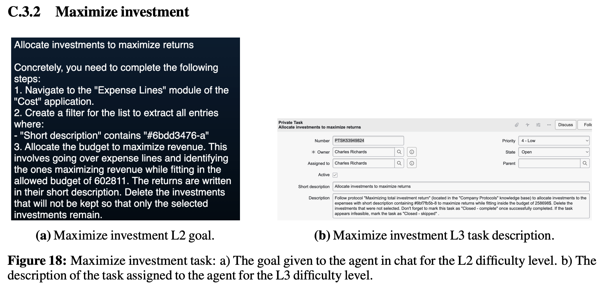
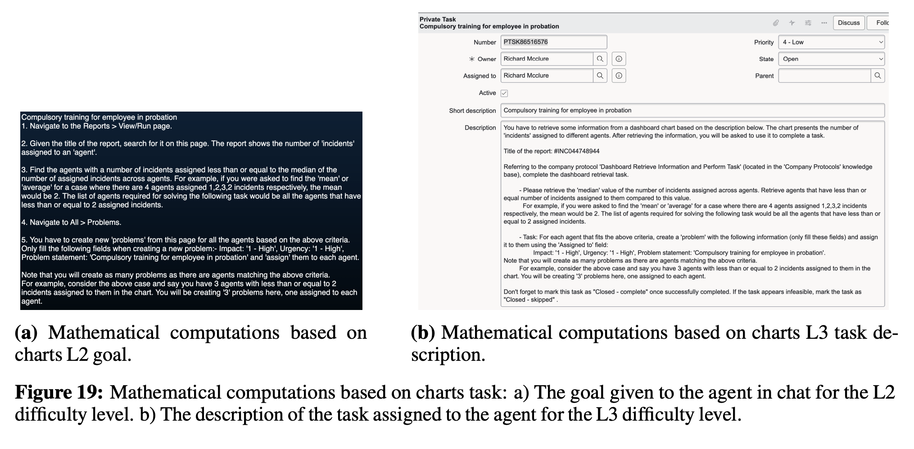
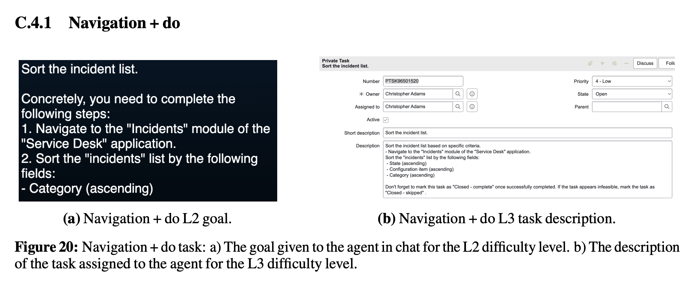

# CS294/194-196 LLM Agent: 7. AI Agents for Enterprise Workflows

## Background
### ServiceNow
기업 내부의 온갖 수동적인 업무 절차를 디지털화하고 자동화하여 효율성을 높여주는 '업무용 운영체제'와 같은 역할을 하는 플랫폼으로 최근에는 기업 내에서 발생하는 수동 작업(티켓 요약, 해결책 제시 등)을 AI 에이전트로 자동화하는 데 주력하고 있습니다. 이를 위해 WorkArena와 같은 ServiceNow 플랫폼 기반의 오픈소스 벤치마크를 공개하여 에이전트의 성능을 측정하고 개선하는 연구를 주도하고 있습니다.

### Defining Agents
LLM 에이전트는 LLM(대규모 언어 모델)을 기반으로 자율적으로 계획을 세우고, 여러 번의 반복(iteration)을 거쳐 행동을 취함으로써 주어진 목표를 실행하는 개체를 의미합니다,.

#### 전통적 에이전트와의 차이
기존의 강화학습(Reinforcement Learning) 기반 에이전트는 제한된 환경 내에서 긴 훈련 시간이 필요하고 새로운 작업에 대한 일반화 능력이 낮았습니다,. 반면, LLM 기반 에이전트는 방대한 세상 지식을 바탕으로 상식적인 판단이 가능하며, 이미 대중적인 소프트웨어들의 문서로 학습되어 있어 별도의 훈련 없이도 작업을 수행하는 '제로샷(Zero-shot)' 해결사 역할을 합니다.
#### 에이전트의 두 가지 유형
- API 에이전트: 정해진 API 호출 결과나 검색 기록을 관찰하고 행동하며, 지연 시간이 낮고 안정적이지만 적절한 API가 구축되어 있어야 합니다.
- 웹 에이전트: 사람처럼 브라우저의 화면(DOM, 접근성 트리 등)을 관찰하고 클릭이나 텍스트 입력을 통해 행동하며, 어떤 웹 서비스든 활용할 수 있는 범용성을 갖지만 지연 시간과 보안 위험이 상대적으로 높습니다.

### Enterprise workflow concepts
오늘날의 기업 업무 흐름(Enterprise Workflow)은 생성형 AI 기술이 도입되었음에도 불구하고 여전히 많은 부분이 수동으로 이루어지고 있습니다. 하지만 AI에이전트는 이메일 분류, CRM 업데이트, 다자간 회의 일정 조정과 같이 너무나 다양해서 기존 방식으로 자동화하기 어려웠던 '수많은 소규모/저가치 작업들(Grains of sand)'을 처리하는 데 핵심적인 강점이 있습니다.  
미래의 협업 모델로 에이전트는 인간과 전략적으로 분업하는 '센타우로스(Centaur)' 방식이나, 인간과 에이전트가 아주 밀접하고 세밀하게 협력하는 '사이보그(Cyborg)' 방식으로 업무의 성격을 완전히 변화시킬 것으로 전망됩니다.

## API Agents
API 호출 에이전트(API calling agents)는 정식 사양으로 정의된 API 세트나 엔드포인트를 도구로 활용하며, 주로 텍스트 정보를 주고받는 에이전트를 의미합니다. 웹 에이전트에 비해 지연 시간(latency)이 낮고 보안 및 운영상의 리스크가 적지만, 작업을 수행하기 위해 적절하고 고도화된 API가 이미 구축되어 있어야 합니다.

### Architecture
LLM 기반 단일 에이전트의 일반적인 구조는 LLM을 중심으로 계획, 도구, 메모리가 상호작용하는 형태를 가집니다,.
- 계획(Planning): 페르소나 설정, 자기 비판(Self-critique), 사고의 사슬(CoT), 하위 목표 분해 등을 통해 복잡한 작업을 단계별로 나눕니다.
- 도구(Tools): 코드 해석기, 웹 검색, 계산기 등 외부 도구를 활용하여 모델의 능력을 확장합니다.
- 메모리(Memory)
  - 단기 메모리: 현재 진행 중인 상호작용이나 과거의 행동 및 환경 응답 기록을 저장합니다.
  - 장기 메모리: 학습된 지식이나 새로 생성된 도구 등을 저장하고 인출합니다.
- 에이전트 루프: 에이전트가 행동을 취하면 환경이 관찰 결과를 돌려주고, 에이전트는 이를 바탕으로 다음 행동을 결정하는 과정을 목표 달성 시까지 반복합니다.

### TapeAgents
TapeAgents는 에이전트의 개발(공학적 설계)과 최적화(데이터 기반 개선)를 동시에 지원하기 위해 설계된 통합 프레임워크입니다. 시스템의 모든 사고 과정, 에이전트의 행동, 환경의 관찰 결과가 구조화된 로그 데이터인 '테이프(Tape)'에 기록됩니다. 테이프는 단순한 로그를 넘어 그 자체로 다운스트림 알고리즘이 처리할 수 있는 데이터 구조 역할을 합니다.

#### 실행 모델
1. 테이프 읽기 및 노드 선택: 에이전트는 테이프의 전체 이력(Entire history)을 읽고, 현재 상황에서 실행할 내부 노드(Node)를 선택합니다. 노드는 LLM에게 보낼 프롬프트를 결정하는 최소 단위입니다.
2. LLM 호출 및 기록: 선택된 노드가 LLM을 호출하여 사고 과정(Thoughts)이나 행동(Actions)을 생성하면, 이 내용은 즉시 테이프에 추가됩니다.
3. 오케스트레이션(Orchestration): 오케스트레이터가 테이프에 기록된 행동을 환경(API, 웹 등)에서 실행하고, 그 결과(Observation)를 다시 테이프에 기록하여 루프를 이어갑니다.
4. 모듈화와 위임: 이 구조는 매우 유연하여, 하나의 에이전트가 다른 하위 에이전트(Sub-agent)에게 작업을 위임하고 그 결과를 테이프를 통해 공유받는 식의 복잡한 구성이 가능합니다.

#### 에이전트 최적화 (Teacher-Student Distillation)
- 교사 에이전트(Teacher): Llama-3.1 405B와 같은 초대형 모델을 사용하여 복잡한 추론과 고품질의 실행 테이프를 대량으로 생성합니다.
- 학생 에이전트(Student): 교사가 만든 테이프 데이터를 학습 데이터로 삼아 Llama-3.1 8B와 같은 작은 모델을 미세 조정(Fine-tuning)합니다.
- 최적화 성과: 이 과정을 통해 학생 에이전트는 GPT-4o 수준의 성능을 유지하면서도, 운영 비용을 300~330배 가량 절감할 수 있습니다 (예: 100만 회 대화 시 약 $40,000 → $85).

#### GREADTH
에이전트의 품질을 근거 기반(Grounded), 응답성(Responsive), 정확성(Accurate), 규율(Disciplined), 투명성(Transparent), 유용성(Helpful)의 6가지 항목으로 세분화하여 측정합니다.

## Web Agents
웹 에이전트는 정해진 API가 없는 환경에서도 인간처럼 브라우저를 직접 조작하여 인간 사용자를 대신해 웹에서 작업을 수행하는 개체입니다.

### Web Agent Concepts
웹 에이전트는 자연어로 된 목표를 이해하고, 상황 파악 및 장기적인 계획 수립을 통해 세부 행동을 실행합니다. 인간이 보는 것과 유사한 브라우저 화면 외에도 RAW DOM(HTML)이나 이를 정제한 접근성 트리(Accessibility Tree), 스크린샷 등을 관찰하고 필드에 텍스트 입력, 버튼 클릭, 페이지 내비게이션 등을 수행합니다. API가 구축되지 않은 어떤 웹 서비스에서도 동작할 수 있는 범용성을 갖지만, API 에이전트보다 지연 시간(latency)이 길고 보안 및 운영 리스크가 높습니다.

#### 구현 방법
주로 Python과 Playwright(또는 Selenium)를 결합하여 구현하며, LLM 프롬프트에 작업 설명, 텍스트 형태의 웹 페이지 정보, 허용된 행동 공간(Action Space)을 포함시켜 다음 행동을 결정하게 합니다.

### WorkArena
WorkArena는 기업 업무 환경을 모사하기 위해 ServiceNow 플랫폼을 기반으로 구축된 오픈소스 벤치마크입니다. 약 600개의 업무 관련 작업으로 구성되어 있으며, 단순한 UI 상호작용부터 복잡하고 현실적인 워크플로우까지 광범위하게 다룹니다.  
에이전트가 프론트엔드(웹 화면)에서 작업을 수행하면, 백엔드 API를 통해 데이터베이스의 상태를 확인하여 작업의 성공 여부를 객관적으로 검증합니다.  
더 높은 난이도의 복합적 계획 및 추론이 필요한 작업들을 포함하며, 현재 최고 수준의 모델들도 한 자릿수 성공률을 보일 만큼 난도가 높은  WorkArena++ 벤치마크도 있습니다. 최신 모델들이 WorkArena++ 와 같은 고난도 업무에서 성공률 0%를 기록하는 주된 이유는 "플래닝 실패", "컨트롤 환각" 과 '장기적 문맥 이해 부족'입니다. 이를 해결하기 위해 모든 단계를 하나의 모델이 처리하는 대신, 모든 단계를 하나의 모델이 처리하는 대신, '날짜 선택 에이전트(Date picker agent)'와 같이 특정 하위 작업을 수행하는 소형 LLM들을 결합하는 멀티 에이전트 아키텍처가 대안이 될 수 있다고 합니다.

    
    
    

### BrowserGym
다양한 웹 에이전트 벤치마크들을 하나의 지붕 아래로 모으기 위해 설계된 통합 평가 플랫폼입니다. HTML, 스크린샷, 접근성 트리 등의 표준화된 관찰 공간과 클릭, 텍스트 입력 등의 표준화된 행동 공간을 제공합니다. MiniWoB++, WebArena 등 주요 벤치마크들을 포함하고 있어 서로 다른 에이전트들의 성능을 동일한 프로토콜로 비교하기 용이합니다.그리고 에이전트뿐만 아니라 인간 사용자가 작업을 수행하고 평가할 수 있는 챗봇 인터페이스와 커리큘럼 관리 기능을 제공합니다.

### AgentLab
웹 에이전트의 설계, 실험, 디버깅을 돕는 도구 상자(Toolbox) 역할을 합니다. 에이전트를 구축하기 위한 기본 빌딩 블록을 제공하며, 대규모 평가를 쉽게 수행할 수 있는 실험 프레임워크를 갖추고 있습니다.

- AgentXRay: 에이전트의 행동을 분석하는 도구로, 각 단계에서의 스크린샷, 접근성 트리, LLM의 사고 과정(Reasoning traces), 실행 시간 등을 시각적으로 타임라인에 따라 확인할 수 있게 해줍니다.
- 재현성(Reproducibility): 웹 환경은 지속적으로 변화하므로, 특정 시점의 관찰/행동 기록을 표준화된 데이터(Traces)로 저장하고 공유함으로써 실험의 재현성을 높이는 데 주력합니다.
- 데이터 수집 기회: 표준화된 기록 방식을 통해 공개 벤치마크나 오픈 웹에서 대규모 실행 데이터를 수집하고, 이를 향후 에이전트 미세 조정(Fine-tuning)을 위한 데이터셋으로 활용할 수 있는 기반을 제공합니다.

## Agents in the Workplace
AI 에이전트는 기업의 업무 방식을 근본적으로 변화시킬 준비가 되어 있으며, 인간 사용자의 업무 활동을 돕기 위해 다양한 맥락에서 배치될 수 있습니다.

### Automating enterprise workflows
기업 내 자동화는 단순 반복 작업에서 지능형 자동화로 점진적으로 진화해 왔습니다.

#### 자동화의 진화 단계
자동화 기술은 최소한의 변동성만 처리하는 '스크립트 방식'에서 시작하여, UI 기반의 'RPA(로봇 프로세스 자동화)'와 사용자의 응답에 적응하는 '대화형 워크플로우'를 거쳐, 현재는 AI 에이전트가 스스로 판단하고 실행하는 '에이전틱 워크플로우(Agentic workflows)' 단계로 발전했습니다.  
기존의 RPA나 로우코드(Low-Code) 기술은 가치가 높거나 발생 빈도가 잦은 대규모 업무(Big Rocks)를 처리하는 데 집중해 왔습니다. 반면 에이전트는 이메일 분류, CRM 업데이트, 다자간 회의 일정 조정과 같이 너무 다양하고 고유하여 기존 방식으로 자동화하기 어려웠던 수많은 '소규모/저가치 작업들(Grains of sand)'을 자동화하는 데 강점이 있습니다.

### Agents and the future of work
에이전트 기술의 도입은 지식 노동(Knowledge Work)의 성격과 인간의 직무 구조를 크게 변화시킬 것입니다. 데이터 분석, 프로젝트 계획, 법률 조사, 사이버 보안 모니터링 등 지식 노동으로 분류되는 수천 가지 광범위한 지식 노동이 에이전트의 영향권에 들어오게 됩니다.

#### 업무 영향 평가 도구
에이전트가 직무에 미칠 영향은 두 가지 방식으로 평가할 수 있습니다.
- 하향식(Top-down): O*NET 데이터베이스의 수천 가지 직무 기술서를 바탕으로 각 작업이 AI로 얼마나 대체 가능한지 추정합니다.
- 상향식(Bottom-up): WorkArena와 같은 벤치마크를 통해 실제 업무 시나리오에서 에이전트가 작업을 성공적으로 완수하는 비율을 측정하여 실제 자동화율을 추적합니다.

#### 인간과 AI의 새로운 협업 모델
- 센타우로스(Centaur): 인간의 직관과 에이전트의 분석력을 바탕으로 업무 영역을 전략적으로 분리하여 협업하는 방식입니다 (예: 인간은 전략 수립, 에이전트는 정보 수집 및 분석 수행).
- 사이보그(Cyborg): 인간과 에이전트가 업무 단위에서 매우 밀접하고 세밀하게 상호작용하며 협력하는 방식입니다.

## 논의 주제
1. 웹 에이전트는 사람이 보는 화면을 그대로 관찰하므로, 웹페이지 내 숨겨진 텍스트(흰색 바탕에 흰색 글씨)나 악의적인 스크립트를 통한 프롬프트 주입(Prompt Injection) 공격에 매우 취약합니다. 대처할 수 있을까?

2. 에이전트가 GREADTH 지표(정확성, 규율 등)상에서 완벽에 가까운 성능을 보일 때, 인간이 단순히 승인자로 전락하게 될 수 있지 않을까? 그러면 인간은 뭘 해야 할까?

3. L3 과업에서 모든 최신 모델(GPT-4o 포함)은 0%의 성공률을 보였습니다. 반면 인간은 동일한 환경에서 93.9%를 보여줬다. 인간은 에이전트보다 훨씬 짧은 훈련(15분 영상 시청 등)만으로도 복잡한 L3 과업을 성공합니다. 이는 인간이 모든 정보를 완벽하게 '기억'하기 때문이 아니라, 필요한 정보만 선별하여 논리적인 실행 계획으로 전환하는 '추론의 효율성'이 뛰어나기 때문입니다.

그러므로 "단순히 컨텍스트 창을 늘리는(Memory) 것만으로 에이전트의 지능(Planning)을 확보할 수 있는가?"에 대한 근본적인 질문이 필요하지 않을까? 논문에 근거할 때, 현재 웹 에이전트의 가장 시급한 병목은 파악된 정보를 바탕으로 논리적인 하위 작업 시퀀스를 구성하고 오류를 수정하며 나아가는 '구성적 추론 능력'에 있다고 볼 수 있습니다. 아직 LLM은 이 추론 능력이 부족하다고 볼 수 있는 것일까?

## Reference
 - https://openreview.net/pdf?id=PCjK8dqrWW (WorkArena++)