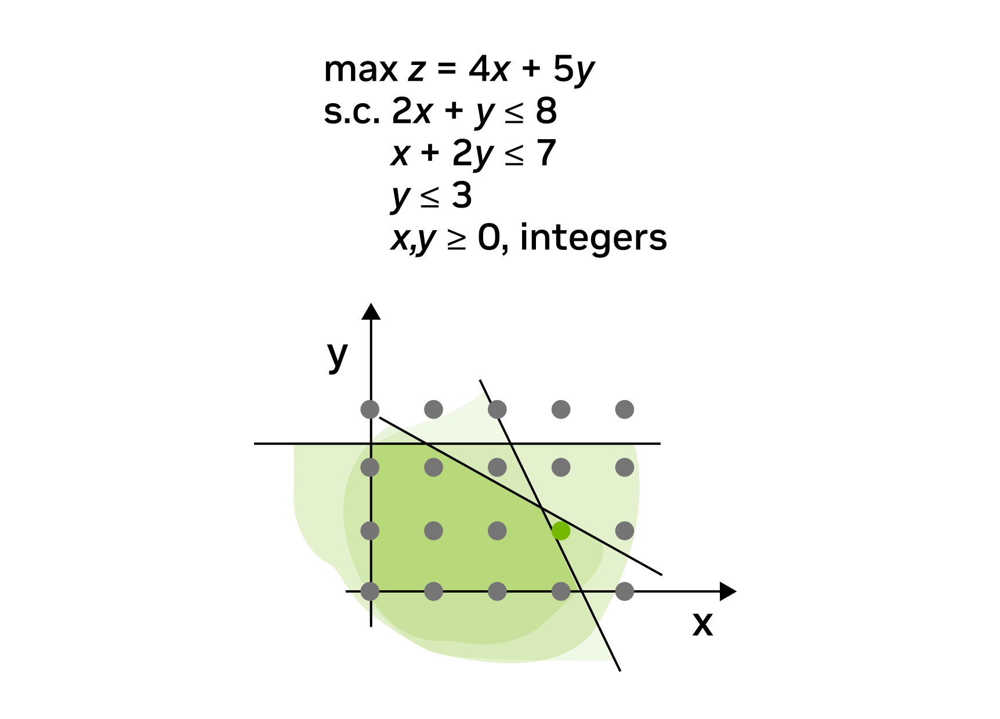

# Ring vs Semi-Ring
- Ring: “음수까지 있는 완전한 대수 구조”
- Semi-Ring: “음수가 없는 구조”

Ring = Semiring + Additive Inverses

## Ring
A ring is a set R equipped with two binary operations + (addition) and ⋅ (multiplication) satisfying the following three sets of axioms, called the ring axioms.

1. R is an abelian group under addition, meaning that,
$(a + b) + c = a + (b + c)$ for all a, b, c in R (that is, + is associative).  
$a + b = b + a$ for all a, b in R (that is, + is commutative).
There is an element 0 in R such that a + 0 = a for all a in R (that is, 0 is an additive identity).  
For each a in R there exists −a in R such that a + (−a) = 0 (that is, −a is the additive inverse of a).

2. R is a monoid under multiplication, meaning that,
(a · b) · c = a · (b · c) for all a, b, c in R (that is, ⋅ is associative).

There is an element 1 in R such that a · 1 = a and 1 · a = a for all a in R (that is, 1 is a multiplicative identity).
3. Multiplication is distributive with respect to addition, meaning that:
a · (b + c) = (a · b) + (a · c) for all a, b, c in R (left distributivity).
(b + c) · a = (b · a) + (c · a) for all a, b, c in R (right distributivity).

## Semi-Ring
Ring without additive inverse (For each a in R there exists −a in R such that a + (−a) = 0 (that is, −a is the additive inverse of a).

# Extreme Point Theorem
$$
\max \; c^\top x
\quad \text{s.t. } x \in \Omega \\[5pt]
\Omega = \{\, x \in \mathbb{R}^n \mid Ax \le b,\; x \ge 0 \,\}
$$
$\Omega$ (Feasible Region) 가 비어 있지 않고(bound되지 않았더라도) 최적해가 존재한다면, 적어도 하나의 최적해는 $\Omega$ 의 극점(extreme point, 꼭짓점) 에서 달성된다.

# Abelian group
https://en.wikipedia.org/wiki/Abelian_group#:~:text=In%20mathematics%2C%20an%20abelian%20group,the%20group%20operation%20is%20commutative.

# Ring homomorphism
https://en.wikipedia.org/wiki/Ring_homomorphism

# Mixed Integer Programming
Mixed integer programming (MIP) is a mathematical optimization technique that solves problems involving a mix of continuous variables (which can have any value, including decimals and fractions), discrete variables (which must be countable whole numbers), and binary variables (which can only take values 0 or 1).

    
Abvoe is an example of a mixed integer programming (MIP) model and its solution space: $x$ and $y$ are the decision variables, and $z$ is the objective function. 
The inequalities form the constraint boundaries, represented as lines. Blue dots indicate feasible (valid) solutions that satisfy all constraints, while the green dot marks an optimal solution that maximizes the objective.

# Fourier Transform
The Fourier transform (FT) is an integral transform that takes a function as input, and outputs another function that describes the extent to which various frequencies are present in the original function. The output of the transform is a complex valued function of frequency.
$$
{\displaystyle {\widehat {f}}(\xi )=\int _{-\infty }^{\infty }f(x)\ e^{-i2\pi \xi x}\,dx,\quad \forall \xi \in \mathbb {R} .}    
$$

https://en.wikipedia.org/wiki/Fourier_transform