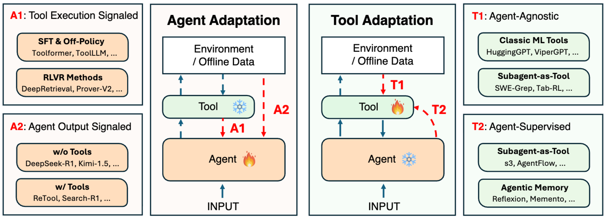
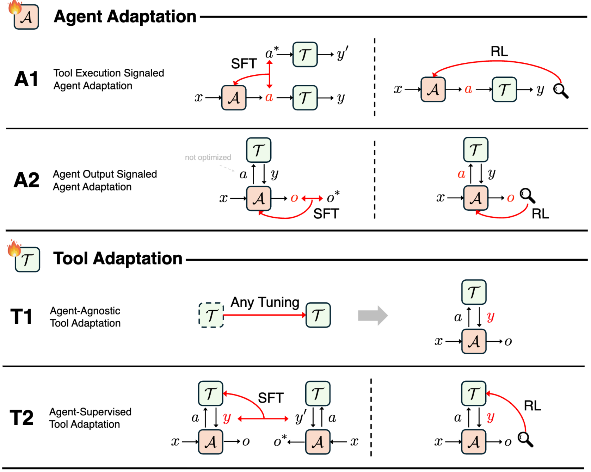
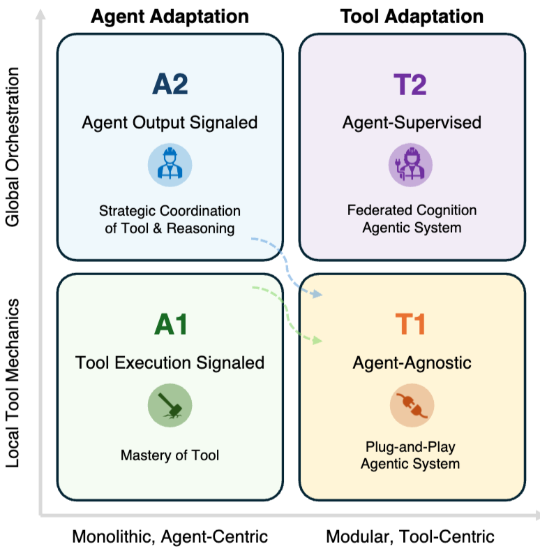

# Adaptation Strategies for Agentic AI: A Comprehensive Taxonomy

## 배경
### AI Agent
에이전트 인공지능(Agentic AI) 시스템은 환경을 인식(Perceive)하고, 추론(Reason)하며, 행동(Act)하고, 환경과의 상호작용을 통해 지속적으로 개선될 수 있는 자율적인 시스템을 의미합니다. 이 시스템은 적응적 의사결정, 맥락 이해, 반복적인 문제 해결이 필요한 복잡하고 개방적인 작업을 수행하도록 설계되었습니다. 이 논문은 더 복잡한 다중 에이전트(Multi-agent) 시스템의 기본 단위가 되는 단일 에이전트 시스템에 초점을 맞추고 있습니다.

## 기여
에이전트 인공지능 적응 전략에 대한 최초의 포괄적인 분류 체계를 제공하며, 각 범주의 기술적 조사, 전략별 비교 분석, 실제 응용 사례(딥 리서치, 소프트웨어 개발 등), 그리고 향후 연구 기회를 제시하는 것을 목표로 합니다.

#### 핵심 구성 요소
에이전트 시스템의 중심에는 **기초 모델(Foundation Model)**인 LLM 또는 멀티모달 모델이 추론 및 제어 센터로서 자리 잡고 있습니다. 이 핵심 모델을 보조하며 에이전트의 자율성을 확장하는 세 가지 주요 모듈은 다음과 같습니다.
1. 계획 모듈 (Planning Module): 복잡한 목표를 실행 가능한 단계로 분해하고 실행 순서를 조직합니다.
  - 정적 계획: Chain-of-Thought(CoT)처럼 고정된 추론 경로를 따릅니다.
  - 동적 계획: ReAct나 Reflexion처럼 환경의 피드백이나 과거 행동을 반영하여 계획을 반복적으로 수정합니다.
2. 도구 사용 (Tool Use): 에이전트가 외부 리소스(웹 검색, API, 코드 실행 환경 등)와 상호작용하게 하여 모델 내부 지식의 한계를 확장합니다. 적절한 도구를 선택하고, 실행 결과를 다시 추론 과정에 통합하는 능력이 핵심입니다.
3. 메모리 모듈 (Memory Module): 과거 정보를 저장하고 인출하여 장기적인 일관성과 맥락 인식 능력을 갖추게 합니다.
    ◦ 단기 기억: 현재 수행 중인 작업의 맥락 정보를 저장합니다.
    ◦ 장기 기억: 여러 세션에 걸쳐 지속되는 지식과 경험을 축적하며, 주로 검색 증강 생성(RAG) 메커니즘을 통해 필요한 정보를 가져옵니다.

## Adaption
인공지능 시스템이 특정 도메인, 작업 또는 운영 환경의 요구 사항에 더 잘 맞도록 자신의 행동, 의사결정 전략 및 내부 표현을 조정할 수 있게 하는 필수적인 과정입니다.
적응 방식은 크게 모델의 파라미터를 건드리지 않는 방식(Prompt Engineering) 과 직접 수정하는 방식(Fine Tuning)의 두 가지 범주로 나뉩니다.

### 프롬프트 엔지니어링 (Prompt Engineering)
프롬프트 엔지니어링은 기초 모델의 파라미터를 수정하지 않고 에이전트의 행동을 유도하는 가벼운(lightweight) 형태의 적응 방식입니다.
- 작동 방식: 모델을 재학습시키는 대신 목표, 제약 조건, 문맥적 지침이 담긴 정교한 입력 프롬프트를 설계하여 에이전트의 행동을 형성합니다.
- 주요 구성: 일반적으로 지침(instructions), 예시(examples), 작업 설명(task descriptions) 등으로 구성되며, 이를 통해 모델이 특정 추론 패턴이나 행동 전략을 취하도록 유도합니다.
- 장점: 추가적인 모델 학습이 필요 없어 매우 효율적이며, 서로 다른 작업 간에 쉽게 전이될 수 있다는 장점이 있습니다. CAMEL, AutoGen, ChatDev와 같은 최근의 많은 에이전트 시스템이 이 방식을 채택하고 있습니다.

### 파인튜닝 (Fine-Tuning)
프롬프트 엔지니어링과 대조적으로, 파인튜닝은 모델의 내부 파라미터를 직접 업데이트하여 적응을 달성합니다.

- 작동 방식: 작업 특화된 데이터(task-specific data)에 모델을 노출시켜 대상 도메인의 목적에 부합하는 새로운 지식, 추론 패턴, 행동 경향을 내재화하도록 만듭니다.
- 적용 수준:
  - 전체 파인튜닝(Full Fine-Tuning): 모델의 모든 파라미터를 업데이트하여 유연성을 극대화하지만, 막대한 계산 자원이 필요합니다.
  - 매개변수 효율적 파인튜닝(PEFT): LoRA(Low-Rank Adaptation)와 같이 전체 파라미터 중 아주 작은 부분만 업데이트하여 효율성과 성능 사이의 균형을 맞춥니다.

## 프레임 워크 제시
   

에이전트 AI의 적응(adaptation)을 두 가지 주요 기준에 따라 네 가지 핵심 패러다임으로 나눕니다.

### 첫 번째 기준: 최적화 대상 (Optimization Target)
- 에이전트(Agent): 에이전트 모델 자체의 내부 매개변수, 표현 방식, 또는 행동 정책을 수정하여 작업 요구사항에 더 잘 맞도록 합니다.
- 도구(Tool): 에이전트가 사용하는 외부 도구(예: 검색기, 플래너, 메모리 모듈, 특화 모델)를 최적화하여, 에이전트가 고정된 상태에서도 적응형 운영 환경의 이점을 누릴 수 있도록 합니다.

### 두 번째 기준: 적응 신호 유형 (Type of Adaptation Signal)
- 에이전트: 최적화 신호가 도구 실행 피드백에서 오는지, 아니면 에이전트 자체의 최종 출력 평가에서 오는지에 따라 나뉩니다.
- 도구: 도구가 에이전트와 독립적으로 최적화되는지, 아니면 고정된 에이전트의 감독 하에 적응되는지에 따라 나뉩니다.

   

### 패러다임 1 - A1: Tool Execution Signaled Agent Adaptation (도구 실행 신호 기반 에이전트 적응)
이 방식에서 에이전트가 학습하는 데 사용되는 피드백은 도구의 실행 결과에서 직접 발생합니다. 예를 들어, 에이전트가 생성한 코드가 성공적으로 실행되었는지, 혹은 검색 질의(query)가 얼마나 관련성 높은 문서를 반환했는지 등이 피드백으로 활용됩니다.
이 피드백은 지도 학습(Supervised Learning) 및 강화 학습(Reinforcement Learning) 모두를 구동하는 데 사용될 수 있는 "검증 가능한 신호(verifiable signal)"를 형성합니다.

- 최적화 대상: 에이전트(A)
- 적응 신호: 에이전트가 호출한 외부 도구(T)의 실행 결과로부터 얻은 검증 가능한 피드백(예: 코드 샌드박스 결과, 검색 관련성 점수, API 호출 결과)

#### SFT & Off-Policy Methods
미리 수집된 데이터(궤적 또는 응답)를 바탕으로 SFT이나 DPO와 같은 오프-폴리시(Off-Policy) 방식을 사용해서 에이전트에 Adaption 을 적용합니다.

Toolformer (2023): 이 분야의 선구적인 모델로, 도구 실행 결과를 자기 지도 학습(Self-supervised) 신호로 사용하는 개념을 도입했습니다. 모델이 텍스트에 API 호출을 삽입하고 실행한 뒤, 그 결과가 다음 토큰 예측의 혼란도(Perplexity)를 얼마나 낮추는지를 측정하여 유용한 호출만을 학습 데이터로 남깁니다.

##### 학습 신호의 3단계 진화 과정
논문은 A1 유형 방법들이 더 정교하고 신뢰할 수 있는 학습 신호를 얻기 위해 세 가지 단계를 거쳐 진화했다고 설명합니다.

<b> 1단계: 정답(Golden Answers)과의 정렬 </b>  
모델을 올바른 최종 출력, 즉 태스크별 정답이나 검증된 전문가 솔루션에 맞춰 학습하는 방식입니다.

- TRICE: 2단계 프레임워크로, 먼저 SFT로 기초 능력을 쌓은 뒤 **'실행 피드백 기반 강화학습(RLEF)'**을 통해 도구 실행 결과가 실제 정답과 일치하는지 점수를 매겨 모델을 강화합니다.
- ToolAlpaca: 생성-실행-평가-파인튜닝의 **폐쇄 루프(Closed-loop)**를 구축하여, API 호출 결과(반환 값, 오류 등)를 통해 모델이 도구 사용 능력을 스스로 개선하도록 합니다.
- TP-LLaMA: 성공한 경로뿐 아니라 **실패한 경로(errors)**에서도 학습합니다. 전문가의 올바른 단계와 실패한 단계를 비교하는 선호도 데이터셋을 만들어 DPO로 학습시킴으로써 실패로부터 배우는 능력을 강화합니다.

<b> 2단계: 표준 형식(Golden Formats)과의 정렬 </b>  
출력 결과의 정확성뿐만 아니라 도구 호출의 구문적, 논리적 유효성에 중점을 둔 방식으로, 구조적 정확성을 강조합니다.

- Gorilla: 추상 구문 트리(AST)를 사용하여 모델이 생성한 API 호출이 문법적으로 올바른지 확인합니다. 이는 단순 텍스트 매칭보다 견고한 평가 방식이며, 에이전트가 올바른 도구 사용 형식을 갖추도록 유도합니다.
- ToolFlow: 그래프 기반 샘플링과 계획된 생성을 통해 자연스럽고 일관된 다회차(Multi-turn) 도구 호출 대화 데이터를 합성하여 학습에 활용합니다.

<b> 3단계: 직접 도구 실행(Direct Tool Execution)과의 정렬 </b>  
인간의 주석 없이 검증 가능한 환경 신호 자체를 감독 신호로 삼는 가장 진보된 단계입니다. 

- CodeAct: 텍스트 명령 대신 실행 가능한 코드 액션을 생성하고, 샌드박스 환경에서 돌아온 성공/실패 신호를 직접 감독 신호로 사용하여 에이전트의 행동을 도구의 인과 기제와 일치시킵니다.
- NExT: 프로그램 수정 작업을 위해 실행 결과를 필터링 신호로 사용합니다. 유닛 테스트를 통과한 결과물만을 모아 에이전트를 반복적으로 학습시키는 '샘플-필터-학습' 루프를 제안했습니다.
- AutoTools: 도구 캡슐화와 프로그래밍을 자동화하여, API 문서를 스스로 파싱하고 실행 가능한 프로그램을 생성하며 실행 결과로부터 스스로 개선하는 자율적 도구 학습을 지향합니다.
- LeReT & RetPO: 검색(Retrieval) 영역에서 활용됩니다. LeReT는 검색 쿼리의 품질을 보상으로 삼아 IPO 알고리즘으로 
최적화하며, RetPO는 off-the-shelf 검색기의 성능을 보상으로 사용하여 쿼리 재구성 모델을 학습시킵니다.

##### 결론 및 한계
A1 방식의 초기 연구들은 '암묵적인 자기 지도 피드백'에서 '명시적인 실행 기반 학습 신호'로 점진적으로 이동해 왔습니다. 이러한 과정은 모델의 추론과 환경 상호작용을 더 밀접하게 결합시켜 도구 사용의 신뢰성을 높였으나, 여전히 미리 수집된 데이터(SFT/DPO)에 의존하기 때문에 능동적인 탐험(Exploration) 능력이 제한적이라는 한계가 있습니다

#### RLVR-Based Methods
이전의 SFT(Supervised Fine-Tuning) 또는 DPO(Direct Preference Optimization)와 같은 방법들은 미리 수집된 데이터나 후보 응답에 의존하여 모델을 업데이트 한 반면, RLVR 방법은 LLM을 활용해 환경과 상호작용하며, 반복적으로 행동을 탐색하고, 실행하며, 즉각적인 환경 피드백을 기반으로 자신의 행동을 정교화할 수 있도록 합니다. 이를 통해 특정 문맥(context)을 인지하여 행동을 조정하거나 특정 실행 환경과 긴밀하게 연동되어 최적의 성능을 발휘할 수 있는 여건을 마련할 수 있게 됩니다.

RLVR은 에이전트가 도구 및 환경과의 직접적인 상호작용을 통해 학습하고 행동을 개선하는 방식이기 때문에, 결과를 명확하게 검증할 수 있는(verifiable) 다양한 복잡한 작업에 매우 효과적으로 사용됩니다. RLVR은 결과를 객관적으로 평가할 수 있는 다양한 복잡한 문제 해결 영역에서 에이전트의 성능, 신뢰성 및 일반화 능력을 향상시키는 데 강력한 도구로 활용되고 있습니다.

##### RLVR 적용분야-1 : 웹 검색 및 정보 검색 도구 (Web search and information retrieval tools)

목표: 사용자 질의에 대해 최적의 검색 질의를 생성하고, 관련 문서를 효율적으로 검색하는 능력을 향상시킵니다.
작동 방식: 에이전트가 검색 질의를 재구성하는 것을 MDP(Markov Decision Process)로 모델링합니다. 사용자의 원본 질의가 '상태(state)'가 되고, 재구성된 질의가 '행동(action)'이 됩니다. 검색 결과(예: Recall@K, NDCG, SQL 실행 정확도)가 '보상(reward)'으로 활용됩니다.

- DeepRetrieval [21]: LLM을 검색 에이전트로 훈련하여 검색 결과로부터 직접 학습하도록 합니다. 질의 재구성을 MDP로 형식화하고, 검색 효율성과 구문적 유효성을 동시에 고려하는 보상 함수를 사용하여 KL-정규화된 PPO(Proximal Policy Optimization)로 정책을 최적화합니다. 이 방법을 통해 문헌 검색, QA 스타일 검색, 텍스트-SQL 데이터베이스 질의 등에서 성능이 크게 향상되었습니다.
- ReZero [62]: DeepRetrieval의 후속 연구로, 실패한 검색 후 적응형 재시도를 보상하는 GRPO(Group Relative Policy Optimization) 기반 강화 학습을 통해 에이전트의 지속성과 견고성을 향상시킵니다.
Orion [63]: 단일 단계 재구성을 넘어 다중 턴 적응형 검색으로 확장하여, 정규화된 유사도 및 순위에 기반한 턴별 보상을 통해 모델이 구조화된 사고-검색 주기를 통해 반복적으로 검색을 개선하도록 훈련합니다.

##### RLVR 적용분야-2 :코드 기반 도구 (Code-based tools)

목표: 에이전트가 실행 가능한 코드를 생성하고, 코드 실행 환경으로부터 피드백을 받아 코딩 능력을 개선합니다.
작동 방식: 생성된 코드가 샌드박스 환경에서 실행되고, 테스트 케이스 통과율이나 수치적 정확성 같은 실행 결과가 에이전트 정책 최적화를 위한 보상으로 사용됩니다. 이는 결정론적(deterministic)이거나 샌드박스화된 실행 환경을 제공합니다.

- DeepSeek-R1 (Code) [24]: 코드를 생성하고 샌드박스에서 실행하여 얻은 테스트 케이스 통과율이나 수치적 정확성을 정책 최적화를 위한 보상으로 직접 사용합니다.
- LeDex [64]: PPO 기반 알고리즘을 사용하여 코드의 정확성(단위 테스트 결과, CodeBLEU)과 설명의 품질(의미론적 유사성)을 모두 고려하는 새로운 보상 함수로 강화 학습을 적용합니다.
R1-Code-Interpreter [66]: 다단계 강화 학습을 통해 LLM이 코드 인터프리터를 효과적으로 사용하도록 훈련하는 일반적인 프레임워크를 제시합니다.

##### RLVR 적용분야-3 :형식적 정리 증명 (Formal theorem proving)

목표: 에이전트가 수학적 정리나 논리적 명제를 증명하는 과정을 자동화하고 개선합니다.
작동 방식: 증명 보조 도구(formal proof checker)가 에이전트가 제안한 증명 단계(tactic)의 유효성을 결정론적으로 검증합니다. 이 검증 결과(예: tactic이 수락되었는지, 증명 상태가 진전되었는지, 완전한 증명이 달성되었는지)가 검증 가능한 보상 신호로 직접 사용됩니다.
특징: 단위 테스트가 희박하거나 불완전할 수 있는 코드 실행 RLVR과 달리, 정리 증명은 단계별 의미론적 검증을 통해 모호성이 적고 더 밀집된 보상(denser rewards)을 제공하여 장기적인 귀인(long-horizon credit assignment)을 상당히 용이하게 합니다.

- AlphaProof [77], DeepSeek-Prover-V2 [78], Kimina-Prover [72] 등: 검증자(verifier) 피드백을 활용하여 다단계 증명 검색 정책을 강화 학습을 통해 훈련합니다.

##### RLVR 적용분야-4 : 멀티-도구 추론 시스템 (Multi-tool reasoning systems)

목표: 에이전트가 여러 도구를 순차적으로 또는 복합적으로 사용하여 복잡한 작업을 해결하고, 환경 피드백을 통해 도구 선택 및 활용 전략을 개선합니다.
작동 방식: 에이전트가 다양한 LLM(라우팅 풀), API, 또는 기타 외부 도구를 동적으로 호출하고, 각 호출의 성공 여부나 전체 작업의 최종 결과에 따라 보상을 받습니다.

- Router-R1 [87]: 여러 LLM을 조정하는 정책 LLM을 강화 학습 프레임워크를 통해 훈련합니다. 정책 LLM은 내부 추론과 외부 모델 선택 사이를 전환하며 복잡한 작업을 해결합니다.
- FTRL [88]: 검증 가능한 보상 함수를 사용하여 모델의 도구 사용 능력을 향상시키는 피드백 기반 훈련 프레임워크를 소개합니다.
- Tool-N1 [25]: 멀티-도구 추론 시나리오에서 도구 호출 능력을 향상시키기 위해 R1 스타일 강화 학습으로 훈련된 LLM 시리즈입니다.

##### 주요 특징 및 이점
• 시행착오를 통한 학습: 모델은 실시간 환경 피드백을 통해 "무엇이 실제로 작동하는지"를 직접 경험하며 추론 및 도구 사용 전략을 정교화합니다.
• 검증 가능성: 단순한 인간의 선호도가 아닌, 코드 실행 성공이나 수학적 정답 여부와 같이 객관적이고 검증 가능한 신호를 학습에 활용합니다.
• 한계점: 보상 설계(Reward Design)가 매우 까다롭고, 상호작용을 위한 막대한 계산 자원이 필요하며 학습 안정성을 높이는 메커니즘이 필수적입니다

### 패러다임 2 - A2: Agent Output Signaled Agent Adaptation (에이전트 출력 신호 기반 에이전트 적응)
A2 (에이전트 출력 신호 기반 에이전트 적응) 패러다임은 에이전트가 외부 도구를 실행한 결과 자체가 아닌, 에이전트가 내놓은 최종 출력물(답변, 계획, 추론 경로 등)에 대한 평가를 최적화 신호로 사용하여 에이전트 모델을 개선하는 방식입니다.

- 최적화 대상: 에이전트(A)
- 적응 신호: 에이전트 자체의 최종 출력(예: 최종 답변, 계획, 추론 과정)에 대한 평가로부터 얻은 신호. 도구 사용 여부와 상관없이 최종 출력의 품질이 중요합니다.

#### Agent Adaptation w/o Tools (도구 없는 에이전트 적응)
외부 도구의 도움 없이 에이전트 내부의 내재적인 추론 능력(수학, 코딩, 논리적 추론 등)을 강화하는 데 집중하는 연구 분야

##### R1 패러다임의 등장:
DeepSeek-R1 프레임워크와 Kimi-1.5를 통해 검증 가능한 보상 기반 강화 학습(Reinforcement Learning with Verifiable Reward, RLVR)이 대형 에이전트의 추론 능력을 효과적으로 향상시킬 수 있음이 입증되었습니다.
특히 수학 및 코드 생성과 같이 결과물의 품질을 결정론적 정확도 신호(deterministic correctness signals)로 자동 평가할 수 있는 추론 집약적 영역에 초점을 맞춥니다.
이는 기존의 지도 미세 조정(Supervised Fine-Tuning, SFT)을 넘어 에이전트 지능을 향상시키는 확장 가능한 경로를 제시하며 'R1 패러다임'이라는 새로운 연구 흐름을 촉발했습니다.

##### R1 패러다임 확장 연구:
Empower는 명시적 정확성 대신 '인간 역량 강화(human empowerment)'를 목표로 하는 자체 지도 미세 조정(self-supervised fine-tuning) 프레임워크를 제안했습니다.
KnowRL은 에이전트가 자신의 지식과 답변의 신뢰도를 스스로 평가하도록 강화 학습을 사용합니다.
GRACE는 대조 학습(contrastive learning)을 보상 기반 최적화 형태로 재해석하여 명시적 추론을 유도합니다.
EHRMind는 RLVR을 임상 추론 시나리오에 적용하며, 도메인 특화 추론에는 SFT를 통한 사전 지식 정렬이 중요함을 강조합니다.

#### Agent Adaptation w/ Tools (도구 활용 에이전트 적응)
에이전트의 최종 출력물(답변, 계획 등)을 최적화 신호로 삼아, 에이전트가 도구를 언제, 어떻게 사용할지 결정하는 '전략적 정책'을 강화하는 연구 분야입니다.

##### 검색 기반 도구 학습 (Retrieval-based Tool Learning)
최근 연구들은 강화학습(RL)을 통해 에이전트가 다단계 추론 과정에서 자율적으로 검색 쿼리를 생성하고 정제하는 능력을 배양하는 데 집중하고 있습니다.

- R1-Searcher & Search-R1: 검색된 증거와 최종 답변의 정답 여부를 결합하여 보상을 제공함으로써, 에이전트가 추론과 검색 사이의 균형을 맞추도록 학습시킵니다. 이를 통해 사실 관계의 정확성을 높이고 환각(hallucination) 현상을 최대 24%까지 줄였습니다.
- ReSearch: 지도 학습 데이터 없이 오직 강화학습(GRPO)만으로 학습하며, <think>, <search>, <result> 태그를 사용하여 추론 체인 안에 검색 과정을 통합합니다. 이 과정에서 에이전트는 검색이 필요한 시점을 스스로 판단하는 자기 성찰 및 자기 교정 행동을 자연스럽게 습득하게 됩니다.

##### 코드 및 실행 기반 도구 학습 (Code- and Execution-based Tool Learning)
코드를 도구로 사용하는 환경에서 에이전트의 최종 출력을 개선하기 위한 시도들입니다.

- CodePRM: 코드 실행 결과를 바탕으로 추론의 각 단계에 점수를 매기는 과정 보상 모델(Process Reward Model)을 도입하여, 추론 오류를 동적으로 수정하는 '생성-검증-정제' 파이프라인을 구축합니다.
- ReTool: 실시간 코드 실행을 강화학습 과정에 통합하여, 모델이 수학적 또는 상징적 추론을 위해 언제 계산기나 인터프리터를 호출해야 하는지를 학습하게 합니다.

##### 범용 다중 도구 및 에이전트 학습 (General Multi-tool and Agentic Learning)
다양한 API와 상호작용하는 복잡한 워크플로우를 최적화하는 포괄적인 프레임워크들입니다.

- Agent-R: 몬테카를로 트리 탐색(MCTS)과 모델 기반 비판(Critique) 구성을 통해 실패한 경로를 지속적으로 수정하며 성능을 높입니다.
- A2FM: 추론과 행동을 비용 조절형 강화학습(Cost-regularized RL) 프레임워크 내에서 통합하여, 내부 추론을 할지 외부 도구를 쓸지 동적으로 선택함으로써 효율성과 정확성을 동시에 개선합니다.
- VerlTool: 서로 다른 작업을 수행하는 다중 에이전트와 도구 서버를 분리하여 대규모 강화학습 학습을 가능하게 하는 효율적인 인프라를 제공합니다.

##### 요약 및 의의
이 패러다임은 단순히 도구 사용법을 익히는 수준(A1)을 넘어, 에이전트가 도구를 지능적으로 조율(Orchestration)하는 상위 인지 능력을 내재화하게 합니다. 비록 학습 비용이 높고 보상이 희소(sparse)하다는 단점이 있지만, 복잡한 워크플로우에서 에이전트의 전반적인 전략을 최적화하는 데 매우 효과적입니다

### 패러다임 3 - T1: Agent-Agnostic Tool Adaptation (에이전트 독립적인 도구 적응)
기존에는 에이전트 자체(예: 에이전트의 내부 파라미터)를 최적화하는 데 집중했지만, 도구 적응은  에이전트의 내부 인지 능력을 수정하는 대신, 에이전트가 사용하는 외부 생태계(도구)를 최적화하여 성능을 높이는 전략을 다룹니다. 이는 에이전트의 파라미터를 고정(Frozen)한 채로 주변 환경을 개선하여 공생적인 에이전트-도구 생태계를 구축하는 데 중점을 둡니다. 이는 미리 학습된(pre-trained) 모델, 검색기(retrievers), 플래너(planners), 실행기(executors) 등을 아우르며, 에이전트는 언어나 코드를 통해 이들을 호출하여 사용합니다.

- 최적화 대상: 도구(T)
- 적응 신호: 에이전트와는 독립적으로 도구 자체의 성능(예: 검색 정확도, 순위 품질)을 기반으로 도구를 훈련합니다.

#### Foundational Systems and Architectures
에이전트가 외부 도구를 효과적으로 활용할 수 있도록 하는 '기반 시스템 및 아키텍처'에 대해 설명합니다. 즉, 고정된 에이전트가 외부 도구를 어떻게 조정(Orchestration)하고 호출(Invocation) 하는지에 대한 메커니즘이나 프레임워크를 소개 합니다.

##### 1. 연산자 학습 도구 (Operator-Learning Tools)
대규모 LLM 기반 오케스트레이션이 등장하기 전, 복잡한 시뮬레이터를 위한 미분 가능한 대리 모델(differentiable surrogates) 역할을 하는, 무한 차원 함수 공간 간의 매핑을 근사하도록 훈련된 모델입니다.  
이는 에이전트가 재훈련 없이 반복적으로 쿼리할 수 있는 "고정된 도구"의 초기 예시를 제공하여, 에이전트의 추론, 계획, 제어 루프 내에서 빠르고 미분 가능한 블랙박스 함수로 사용될 수 있는 기반을 마련했습니다.

##### 2. HuggingGPT: 프롬프트 기반 조정
ChatGPT가 HuggingFace Hub의 1000개 이상의 머신러닝 모델을 파인튜닝 없이 제어할 수 있도록 한 시스템입니다. 작업 계획, 모델 선택, 작업 실행, 응답 생성의 4단계 워크플로우를 통해 언어가 범용적인 인터페이스 역할을 할 수 있음을 보여주었습니다. 복합적인 교차-모달(cross-modal) 작업에서 GPT-3.5가 GPT-4V에 필적하는 성능을 보이도록 했습니다.

##### 3. ViperGPT: 코드 생성 기반 조정
ViperGPT는 고정된 LLM이 텍스트 명령 대신 실행 가능한 파이썬 코드를 생성하여 도구들을 조합하는 방식을 도입했습니다. 생성된 파이썬 코드가 GLIP(탐지), SAM(세분화) 등 다양한 시각 모델을 호출하여 복잡한 시각적 추론 작업을 수행합니다.    
단순 API 호출보다 파이썬 함수를 통한 구성이 더 유연하다는 통찰을 주었으며, 구성적(compositional) 작업에서 뛰어난 성능을 보였습니다.

##### 4. SciToolAgent: 그래프 기반 조직
과학 분야로 도구 오케스트레이션을 확장한 시스템입니다. 고정된 GPT-4o가 SciToolKG라는 지식 그래프를 통해 500개 이상의 생물학, 화학, 재료 과학 도구에 접근합니다. 지식 그래프를 활용한 도구 선택으로 과학 쿼리 벤치마크에서 94%의 정확도를 달성하여, 구조화된 지식 그래프가 프롬프트 기반 설명의 확장성 문제를 해결할 수 있음을 입증했습니다.

##### 5. 모델 맥락 프로토콜 (Model Context Protocol, MCP)
에이전트가 이기종 도구들과 통신하는 방식을 표준화하는 개방형 규약입니다. 도구 정의를 모델의 컨텍스트(입력창)에 일일이 집어넣는 대신, 표준화된 API 레이어를 통해 도구를 발견하고 호출합니다. 이를 통해 Anthropic의 "MCP 기반 코드 실행" 방식은 에이전트가 외부 시스템과 일관된 스키마를 통해 인터페이스할 수 있도록 하여, 긴 도구 정의나 중간 결과를 직접 삽입하는 대신 필요한 도구 정의만 로드하고 샌드박스 환경 내에서 데이터를 필터링하거나 집계할 수 있게 함으로써 컨텍스트 사용량을 98% 이상 줄였습니다. 

#### Categories and Training Methodologies
고정된 에이전트가 즉시 연결하여 사용할 수 있는 '플러그 앤 플레이(Plug-and-Play)' 도구의 범주와 이를 구축하기 위한 학습 방법론을 다룹니다. 즉, 이 도구들은 특정 에이전트에 종속되지 않고 각각 고유한 기능적 능력을 가지고 있으며, 다양한 데이터 소스에서 에이전트와 독립적으로 미리 훈련(pre-trained)되어 있습니다. 즉, 에이전트가 어떤 프레임워크 안에서 가져다 쓰는 '도구 자체'의 종류와 그 도구들이 어떻게 학습되었는지에 집중합니다.

##### Vision models (시각 모델)
예시: CLIP, SAM, SAM-CLIP
특징: 이 모델들은 방대한 이미지-텍스트 쌍(CLIP)이나 대규모 이미지 데이터(SAM)로 훈련되어 제로-샷(zero-shot) 분류, 의미론적 이해, 객체 분할과 같은 다양한 시각 작업을 수행합니다.
활용: 고정된 에이전트는 이러한 툴들을 API 호출을 통해 직접 사용하며, CLIP이나 SAM과 같은 시각 도구들은 이미 매우 광범위하고 다양한 시각 정보를 학습했기 때문에 추가적인 미세 조정(fine-tuning) 없이 이미지 이해 및 분석 작업을 처리할 수 있습니다.

##### Speech and audio tools (음성 및 오디오 툴)
예시: Whisper
특징: 수십만 시간의 다국어 오디오 데이터로 훈련되어 음성 인식, 번역, 언어 식별 등 강력한 성능을 보여줍니다.
활용: 에이전트는 음성 입력값을 동결된(frozen) Whisper 모델에 전달하고 텍스트 출력을 받아 처리하며, 에이전트가 툴 모델을 추가로 적응시킬 필요가 없습니다.

##### Code execution tools (코드 실행 툴)
예시: CodeAct
특징: 툴 사용을 텍스트나 JSON 기반 명령 대신 실행 가능한 Python 코드로 표현함으로써, 에이전트가 유연하게 툴을 구성하고 매개변수를 지정하며 여러 툴을 결합할 수 있게 합니다.
활용: 이러한 툴들은 코드 실행 환경에서 작동하여 에이전트의 복합적인 추론 능력을 향상시킵니다.

##### Search and retrieval tools (검색 및 검색 툴)
예시: DPR, ColBERT, Contriever, e5
특징: 주로 패시지 랭킹(passage ranking) 작업에 대해 미리 훈련된 바이-인코더(bi-encoder) 모델입니다.
활용: 대규모 코퍼스에 대한 의미론적 검색을 가능하게 하여, 에이전트가 필요한 정보를 효율적으로 검색하고 활용할 수 있도록 돕습니다.

##### Scientific tools (과학 툴)
예시: AlphaFold2, ESMFold, CGCNN, 분자 표현 학습(Molecule representation learning) 방법
특징: 단백질 구조 예측, 결정 특성 예측, 분자 특성 예측 등 특정 과학 분야에서 오랜 기간 개발된 전문 모델들입니다.
활용: 동결된 에이전트가 과학적 질의를 처리할 때 이 툴들을 그대로 활용하여 도메인 특화된 계산 및 분석을 수행합니다.

##### Adaptive agents as T1 tools (A1 방식의 적응형 에이전트가 T1 툴이 되는 경우)
예시: DeepRetrieval, Code-R1
특징: 이전에 A1 패러다임(툴 실행 결과로 신호를 받는 에이전트 적응)으로 훈련되어 특정 작업을 수행하도록 학습된 에이전트 모델들입니다.
활용: 이들 모델이 일단 훈련되고 동결되면, 다른 에이전트 시스템에서 "툴"로서 활용될 수 있습니다. 예를 들어, DeepRetrieval은 검색 질의를 다시 작성하는 툴로, Code-R1은 실행 가능한 코드를 생성하는 툴로 사용될 수 있어, 미리 훈련된 모델과 동적 툴 간의 간극을 메웁니다.

### 패러다임 4 - T2: Agent-Supervised Tool Adaptation (에이전트 감독형 도구 적응)
에이전트 자체는 고정되어 있지만, 에이전트의 최종 출력을 통해 도구가 최적화되어 에이전트의 전반적인 능력 향상을 목표로 합니다. 즉, 주 모델인 에이전트(A)는 강력한 폐쇄형 모델(GPT-4 등)로 고정하고, 그 주변의 도구(T)들을 에이전트의 출력 신호를 바탕으로 훈련시킵니다. 수십억 개의 파라미터를 가진 거대 모델을 파인튜닝하는 것은 비용이 막대하고 '파괴적 망각'의 위험이 있습니다. 반면 검색기, 플래너, 메모리 같은 도구들은 모델 크기가 훨씬 작아 적은 데이터와 연산으로도 에이전트의 입맛에 맞게 최적화할 수 있습니다.

- 최적화 대상: 도구(T)
- 적응 신호: 고정된 에이전트(A)의 출력에서 파생된 신호를 사용하여 도구를 적응시킵니다.

#### Earlier Methods: From Proxy Signals to Structured Preferences
이 패러다임의 초기 발전 단계의 핵심은 고정된(frozen) 에이전트의 내부 계산 결과나 출력을 외부 도구(주로 검색기)를 훈련시키기 위한 감독 신호로 사용하는 법을 정립한 것입니다.

##### 1. 프록시 신호 기반 적응 (Proxy Signals)
초기 연구들은 에이전트의 내부 지표(예: 혼란도)를 도구 성능의 대리 신호(Proxy Signal)로 삼아 도구를 최적화했습니다.
- REPLUG (2024): 고정된 언어 모델의 혼란도(Perplexity) 감소를 검색기의 학습 신호로 사용한 일반 프레임워크입니다. 특정 문서가 주어졌을 때 모델의 혼란도가 낮아진다면 해당 문서가 유용하다고 판단하여 검색기가 그런 문서를 더 잘 찾도록 훈련합니다.

- BLADE (2025): 전통적인 검색기를 넘어 도메인 특화 모델을 최적화하는 데 이 원리를 확장했습니다. 고정된 범용 LLM과 결합된 작은 도메인 모델이 베이지안 프롬프트 최적화(BPO)를 통해 범용 모델의 응답을 개선하는 지식을 생성하도록 학습합니다.
- BBox-Adapter (2024) & proxy-tuning: 블랙박스 API(GPT-3.5 등)의 내부 확률에 접근할 수 없는 상황에서도 출력의 순위나 로짓 오프셋(logit offsets)을 활용해 외부 모듈을 정렬하는 기법들을 제시했습니다.

##### 2. 선호도 학습과 과업 정렬 (Preference Learning)
혼란도 같은 간접 지표에서 벗어나, 에이전트가 실제 과업을 수행하는 데 도움이 되는 '구조적 선호도'(structured preferences)를 학습 신호로 사용하기 시작했습니다.  

- AAR (2023): 고정된 모델이 자신의 가능도(Likelihood)를 가장 많이 높여준 문서와 그렇지 않은 문서를 비교하여 선호도 쌍(Preference pairs)을 만들고, 검색기가 이를 복제하도록 대조 학습(Contrastive loss)을 수행합니다.
- RA-DIT (2023): 문서의 유용성을 '정답을 맞힐 로그 확률의 이득(Log-probability gain)'으로 정의하여 검색기를 과업 목표에 직접 정렬시켰습니다.

##### 3. 다단계 아키텍처와 증류 (Multi-Stage Distillation)
복잡한 선호도를 효과적으로 학습하고 적용하기 위한 '다단계 아키텍처'의 등장입니다.

- LLM-R (2024): 고정된 LLM의 미묘한 선호도를 캡처하는 중간 단계의 '교차 인코더(Cross-encoder) 보상 모델'을 먼저 훈련시킨 뒤, 이를 다시 빠른 이중 인코더(Bi-encoder) 검색기에 증류(Distill)하는 방식을 사용했습니다.
- UPRISE (2023): 문서뿐만 아니라 프롬프트 검색기를 훈련시켜, 고정된 LLM이 제로샷 환경에서 최고의 성능을 낼 수 있는 프롬프트를 선택하는 일반화된 메타 기술을 학습하게 했습니다.

##### 4. 브릿지 모델과 선호도 격차 해소 (Bridge Models)
LLM(Large Language Model) 기반 에이전트 시스템에서 검색(retrieval) 결과의 품질을 향상시키기 위한 혁신적인 아키텍처로 기존의 검색기(retriever)는 표면적인 관련성(surface-level relevance)이나 어휘 중복(lexical overlap)에 중점을 두어 최적화되지만 LLM은 추론(reasoning)을 위해 문맥적 일관성(contextual coherence)이나 추론 지원(inferential support)과 같은 요소에 더 큰 가치를 두며, 이로 인해 기존 검색기(retriever)의 결과와 LLM이 유용하다고 생각하는 것 사이에 "선호도 격차(preference gap)"가 발생합니다. 이 선호도 격차를 해소하기 위해  도입된 브릿지 모델은 고정된 검색기(frozen retriever)와 고정된 생성기(frozen generator, PaLM2-S) 사이에 위치합니다. 이 브릿지 모델의 역할은 검색기(retriever)의 출력을 LLM이 더 효과적으로 활용할 수 있는 "LLM 친화적인(LLM-friendly)" 컨텍스트로 변환하는 것입니다.

- BGM: 고정된 검색기와 고정된 생성기 사이에 '브릿지 모델(T5-XXL)'을 배치했습니다. 이 모델은 검색 결과를 LLM이 추론하기 가장 좋은 형태(문맥적 일관성 등)로 변환하며, 최종적으로 에이전트의 과업 성공 여부(RL 신호)를 보상으로 받아 학습합니다. 이 방식은 기존 최고 성능의 검색기 조합보다 정확도를 상대적으로 38% 향상시켰습니다.

#### Subagent-as-Tool 
단순히 요청에 반응하는 '수동적 도구'를 넘어, 고정된 주 에이전트를 보조하기 위해 스스로 계획하고 실행하는 '능동적 서브에이전트'를 훈련하는 방식. 이 하위 에이전트는 단순히 응답하는 것을 넘어 능동적으로 탐색, 계획, 조율, 그리고 여러 단계에 걸쳐 자체 작업을 정제할 수 있는 자율 시스템이지만 어디까지나 이들은 고정된(frozen) 주 에이전트(primary agent)를 보조한다는 것으로 에이전트의 능력과 성능을 향상시키기 위해 도구로서 기능할 뿐입니다.

##### 1. 에이전틱 검색기 (Agentic Searchers)
가장 먼저 두각을 나타낸 분야로, 반복적인 검색과 정보 수집을 자율적으로 수행하는 서브에이전트입니다.

- s3 (2025): 가벼운 7B 모델을 검색 서브에이전트로 훈련시킵니다. 고정된 주 모델이 내놓은 결과가 기본 검색(RAG)보다 얼마나 개선되었는지를 나타내는 GBR(Gain Beyond RAG) 지표를 보상으로 사용합니다.
- 데이터 효율성: s3는 에이전트 전체를 학습시키는 A2 방식(Search-R1)보다 데이터를 약 70배 적게 사용하면서도 대등하거나 더 뛰어난 성능을 보였으며, 훈련 속도도 33배나 빨랐습니다.
- QAgent: 서브에이전트가 쉬운 정보만 찾는 '보상 해킹'을 방지하기 위해, '강력한 고정 생성기가 정답을 맞혔을 때만' 서브에이전트에게 보상을 주는 2단계 학습 방식을 제안했습니다.

##### 2. 메모리 구축 서브에이전트 (Memory-construction Subagents)
장기 기억을 관리하고 구조화하는 과정을 서브에이전트에게 맡기는 방식입니다.

- Mem-α: 고정된 생성기를 위해 외부 메모리(요약, 사실, 에피소드)를 운영하는 컨트롤러를 강화학습으로 훈련시킵니다. 이를 통해 모델은 40만 토큰 이상의 방대한 문맥에서도 정확하게 답할 수 있는 '정보 다이어트' 능력을 갖추게 됩니다.
- AutoGraph-R1: 텍스트에서 지식 그래프(KG)를 생성하는 서브에이전트를 최적화하며, 단순한 추출 정확도가 아니라 '생성된 그래프가 주 모델의 추론 성능을 얼마나 높였는가'를 직접적인 신호로 사용합니다.

##### 3. 메타 인지 및 제어 서브에이전트 (Meta-cognitive and Control Subagents)
주 모델이 '무엇을 찾을지'가 아니라 '어떻게 생각할지'를 가이드하는 서브에이전트입니다.

- AI-SearchPlanner: 효과성, 효율성, 비용 사이의 균형을 맞추는 다단계 검색 전략을 생성하도록 플래너를 훈련시킵니다.
- Advisor Models: 주 모델의 가중치를 건드리지 않고, 입력 앞에 **'조언(Advice)'**을 덧붙여 주 모델의 스타일이나 안전성, 추론 깊이를 조절합니다.
- AgentFlow: 플래너, 실행기, 검증기 등으로 구성된 시스템에서 '플래너'만 학습시킵니다. 7B 크기의 플래너만으로도 특정 작업에서 2,000억 파라미터급인 GPT-4를 능가하는 성과를 냈습니다.

##### 4. 자기 진화형 서브에이전트 (Self-evolving Subagents)
도구 스스로 과업과 보상을 생성하며 진화하는 단계입니다.

- R-Zero & MAE: 시스템 내에서 '해결사(Solver)'와 '도전자(Challenger)' 혹은 '재판관(Judge)' 역할을 나누어, 고정된 핵심 모델 주변의 서브에이전트들이 서로 경쟁하고 평가하며 시스템 전체의 역량을 끌어올립니다

#### Agentic Memory

에이전트의 메모리 시스템 자체를 하나의 '적응형 도구'로 간주하고, 고정된 에이전트를 더 잘 보조할 수 있도록 메모리 관리 방식을 최적화하는 전략. 따라서 메모리에 정보를 쓰고, 읽고, 요약하고, 잊는 '메모리 정책'을 고정된 에이전트의 출력을 신호로 삼아 학습시킵니다.

##### Agentic Memory Structure
- 동적 메모리 저장소: 에이전트의 '쓰기' 명령이나 새로운 정보에 따라 외부 저장소가 실시간으로 조정됩니다. 이를 통해 단기 문맥과 장기 지식 사이의 일관성을 유지합니다.
- 경험 및 성찰 메모리: 에이전트가 자신의 과거 실행 경로(trajectories)를 저장하고 이에 대해 스스로 성찰(reflection)하도록 합니다. 이를 통해 동일한 실수를 반복하지 않는 '기술 커리큘럼'을 구축하며, 이는 모델의 가중치를 건드리지 않고도 가능합니다.
- 구조화된 메모리: 단순 텍스트를 넘어 지식 그래프(KG), 트리, 심볼릭 데이터베이스 형태로 정보를 구조화합니다. 고정된 에이전트의 출력을 신호로 그래프의 노드를 추가하거나 관계를 업데이트하여, 에이전트가 더 복잡한 추론을 효율적으로 수행하도록 돕습니다.

##### Examples of Agentic Memory
- Memento (에피소드 메모리 최적화): 고정된 GPT-4 플래너와 학습 가능한 '사례 메모리'를 결합합니다. 신경망 Q-함수를 통해 "어떤 과거 사례를 보여주는 것이 현재 문제를 푸는 데 가장 도움이 될까?"라는 인출 정책을 학습시킵니다. 학습 신호는 단순한 '성공/실패' 보상뿐이지만, 이를 통해 GAIA 벤치마크 등에서 성능을 대폭 향상시켰습니다.
- Dynamic Cheatsheet: 추론 시점에 모델 본체는 고정된 채로, 메모리 큐레이터 모듈이 해결책의 효율성을 평가하여 재사용 가능한 전략이나 코드 스니펫만을 요약해 저장합니다.
- ReasoningBank: 성공 사례뿐만 아니라 실패 사례에서 '예방적 교훈'을 추출하여 메모리에 저장함으로써, 에이전트가 미래에 유사한 실수를 피하도록 가이드합니다.
- ToolkenGPT: 메모리와 도구를 확장하는 독특한 방식으로, 도구를 모델의 어휘집(Vocabulary) 내에 있는 '학습 가능한 토큰 임베딩(Toolkens)'으로 표현합니다.

## A Framework for Comparison
   

1. 비용 및 유연성 (Cost and Flexibility)
- 비용: 에이전트 적응(A1, A2)은 수십억 개의 파라미터를 가진 모델을 훈련해야 하므로 막대한 컴퓨팅 자원과 엔지니어링 노력이 필요합니다. 반면 도구 적응(T1, T2)은 상대적으로 크기가 작은 외부 모듈만 최적화하므로 비용이 저렴합니다.
- A1/A2는 에이전트의 정책 자체를 완전히 바꿀 수 있는 높은 '파라미터 유연성(Parametric Flexibility)'을 제공합니다. T1/T2는 도구를 추가, 교체, 조합할 수 있는 높은 '시스템 수준의 유연성(System-level Flexibility)'을 제공하지만, 고정된 에이전트의 본래 추론 능력을 넘어서지는 못한다는 한계가 있습니다.

2. 데이터 효율성 (Data Efficiency)
- 도구 중심 적응의 우위: 최근 연구 결과에 따르면, 고정된 백본 주변에 작은 서브에이전트를 훈련시키는 T2 방식이 A2 방식보다 훨씬 적은 데이터로도 대등하거나 더 나은 성능을 낼 수 있습니다.
  - 검색 에이전트를 학습시킬 때, 에이전트 전체를 학습시키는 Search-R1(A2)은 약 17만 개의 예시가 필요한 반면, 서브에이전트만 학습시키는 s3(T2)는 **약 70배 적은 데이터(2.4k 샘플)**만으로도 경쟁력 있는 성능을 달성했습니다. 이는 T2 서브에이전트가 일반적인 추론 능력을 다시 배울 필요 없이 '절차적 기술'에만 집중하기 때문입니다.

3. 일반화 능력 (Generalization Capability)
- T1: 광범위한 데이터 분포에서 학습된 도구들은 서로 다른 에이전트나 작업 환경에서도 잘 일반화됩니다.
- T2: 자신을 감독하는 강력한 기초 모델의 편향(inductive biases)을 물려받아 교차 도메인에서 견고함을 보이는 경우가 많습니다.
- A1/A2: 특정 환경에 최적화(on-policy)될 경우, 명시적인 정규화 없이는 해당 환경에 과적합(Overfitting)될 위험이 큽니다.

4. 모듈성 및 시스템 진화 (Modularity and System Evolution)
- 유지보수 용이성: T1/T2는 에이전트를 건드리지 않고도 새로운 기능을 '핫스왑(Hot-swapping)'하거나 독립적으로 업그레이드할 수 있어 시스템 유지보수가 매우 쉽습니다.
- 단일 모델의 한계: 반면 A1/A2는 시스템이 단일 모델(Monolithic) 형태이므로, 새로운 기능을 추가할 때마다 전체를 다시 학습시켜야 하며 이 과정에서 기존 지식을 잊어버리는 '파괴적 망각(Catastrophic Forgetting)'이 발생할 위험이 있습니다.

### A1 vs A2
| 구분     | A1 (도구 실행 신호)              | A2 (에이전트 출력 신호)             |
| ------ | -------------------------- | --------------------------- |
| 신호의 성격 | 인과적, 과정 중심적, 환경 접지됨        | 결과 중심적, 총체적, 유연함            |
| 학습 초점  | 도구를 올바르게 다루는 법(숙련도)        | 과업을 완수하기 위한 전략(조율)          |
| 장점     | 중간 단계마다 조밀한 피드백 제공 가능      | 최종 목표에 직접적으로 정렬된 최적화        |
| 위험 요소  | 환경에 대한 과적합(Overfitting) 위험 | 잘못된 이유로 정답을 맞히는 ‘지름길 학습’ 위험 |

### T1 vs T2
| 비교 축   | T1 (에이전트 무관형)      | T2 (에이전트 감독형)              |
| ------ | ------------------ | -------------------------- |
| 적용 대상  | 범용적인 외부 도구 및 모듈    | 특정 에이전트에 최적화된 보조 도구        |
| 주요 장점  | 높은 재사용성, 플러그 앤 플레이 | 압도적인 데이터 효율성, 밀접한 협업       |
| 주요 단점  | 에이전트 맞춤형 성능 부족     | 감독 에이전트의 능력치에 성능이 제한됨      |
| 적합한 상황 | 도구를 여러 시스템에서 공유할 때 | 강력한 폐쇄형 모델(GPT-4 등)을 보조할 때 |

### A2 vs T2
에이전트를 직접 학습시키는 A2(에이전트 출력 신호 기반 에이전트 적응)와 도구를 최적화하는 T2(에이전트 감독형 도구 적응) 패러다임 간의 대결을 데이터 효율성과 모듈성 관점에서 분석합니다.

#### 1. 데이터 효율성의 압도적 차이 (70배의 격차)
가장 극명한 차이는 시스템을 구축하는 데 필요한 데이터의 양에서 나타납니다.
- A2 방식 (Search-R1): 에이전트 내부의 지식, 추론 능력, 그리고 도구 사용 정책을 동시에 조정해야 하므로 약 17만 개의 학습 예시가 필요했습니다.
- T2 방식 (s3): 고정된 에이전트의 피드백을 기반으로 가벼운 7B '검색어 생성' 서브에이전트만 훈련시켰으며, 단 2.4천 개의 샘플만으로도 A2 방식과 대등한 성능을 달성했습니다.
이는 T2가 A2 대비 데이터 요구량을 약 70배 절감하고, 실제 훈련 시간(wall-clock time)을 33배 단축했음을 의미합니다

#### 2. 일반화 능력 (Generalization)
T2 방식은 특정 과업에 과적합(Overfitting)되지 않고 더 넓은 영역으로 확장되는 능력이 뛰어납니다.

- 일반적인 질의응답(QA)으로 학습된 s3(T2)는 전문적인 의료 QA 과업에서 76.6%의 정확도를 보인 반면, Search-R1(A2)은 71.8%에 그쳤습니다.

#### Symbiotic Inversion
전통적인 적응 방식(A1, A2)은 "어떻게 하면 에이전트를 수정해서 도구를 더 잘 쓰게 만들까?"를 고민합니다. 반면 Symbiotic Inversion은 이 질문을 뒤집어 "어떻게 하면 도구를 수정해서 고정된 에이전트를 더 잘 보조하게 만들까?"를 묻습니다.

#### T2가 가지는 효율성과 모듈성의 이점
##### 효율성
왜 T2가 이토록 효율적인지에 대한 근본적인 이유는 '학습 문제의 단순화'에 있습니다. A2의 최적화 지형은 지식, 추론 스타일, 도구 정책이 서로 얽혀 있어 고차원적이고 복잡(entangled)합니다. 하지만 T2는 작은 서브에이전트에게 오직 '도구 사용 절차'라는 좁은 영역의 기술만 가르치기 때문에 학습 문제가 비약적으로 단순해집니다.

##### 모듈성 
시스템 유지보수와 진화 관점에서도 T2가 우위에 있습니다. A2 시스템에 새로운 도구를 추가하려면 거대한 단일(Monolithic) 모델을 다시 훈련시켜야 하며, 이 과정에서 기존 능력을 잃어버리는 파괴적 망각(Catastrophic Forgetting)의 위험이 큽니다. T2 아키텍처에서는 중앙의 에이전트를 건드리지 않고도 새로운 도구를 독립적으로 훈련시켜 '핫스왑(Hot-swap)'할 수 있어, 핵심 지능은 유지하면서 주변 생태계만 지속적으로 진화시킬 수 있습니다.

### 미래의 프레임워크 형태
소스가 제시하는 가장 유망한 설계 트렌드는 '안정성'과 '유연성'을 결합한 하이브리드 구조입니다.
평상시에는 비용이 저렴하고 효율적인 T1/T2 방식을 통해 시스템을 지속적으로 전문화하다가, 결정적인 시점에 A1/A2 업데이트를 단행하여 에이전트의 내부 추론 능력을 한 단계 도약시키는 하이브리드 전략을 취하게 됩니다.  
결국 미래의 지능형 시스템은 하나의 거대한 단일 모델(Monolithic)이 아니라, '안정적인 추론 코어'와 '지속적으로 진화하는 적응형 도구들'이 원칙적으로 조율된 연합체(Federation)가 될 것입니다. 이는 지식(에이전트)과 기술(도구)을 분리함으로써 시스템의 데이터 효율성, 모듈성, 유지보수성을 극대화하려는 전략입니다

## 에이전틱 AI의 4가지 주요 응용 분야

### 딥 리서치 (Deep Research)
딥 리서치 시스템은 LLM, 고급 검색 기술, 자율 추론을 통합하여 엔드투엔드(end-to-end) 과학적 조사를 자동화하도록 설계된 응용 분야입니다.  

- 에이전트 적응 (Agent Adaptation): 복잡한 과학적 질문을 구조화된 연구 계획으로 분해할 수 있도록 에이전트를 적응시킵니다. 여기에는 긴 문맥 추론(long-context reasoning), 가설 정교화, 문헌 검토 및 데이터 해석을 위한 다중 에이전트 협업 등이 포함됩니다. DeepResearcher와 같은 시스템이 이 범주에 속하며, 복잡한 연구 과제를 해결하기 위해 에이전트 자체의 추론 능력을 최적화합니다.
- 도구 적응 (Tool Adaptation): 근거 있는 증거를 제공하기 위해 PubMed, arXiv와 같은 문헌 데이터베이스 인터페이스 및 웹 내비게이션 도구를 통합합니다. 특히 DeepRetrieval이나 s3와 같은 학습 기반 검색 모듈을 통해 실시간 정보 수집의 정확도를 높입니다.

### 소프트웨어 개발 (Software Development)
AI 지원 소프트웨어 개발은 요구사항 해석부터 코드 생성, 디버깅, 테스트, 배포에 이르는 전체 엔지니어링 워크플로우를 에이전트가 자율적으로 탐색하는 분야입니다.  

- 에이전트 적응: 실제 또는 시뮬레이션된 개발 환경 내의 상호작용 궤적(interaction trajectories)으로부터 에이전트를 직접 학습시켜 복잡한 단계별 워크플로우에서의 추론 능력과 자율성을 강화합니다.
- 도구 적응: 에이전트가 의존하는 컴파일러, 디버거, 테스트 프레임워크의 신뢰성과 응답성을 개선합니다. 대표적인 예로 사용자의 탭 완성 행동을 강화학습으로 세분화하는 Tab-RL이나, 빠른 코드 검색을 위한 전문 서브에이전트인 SWE-Grep이 있습니다. SWE-Grep은 코드 검색을 전담함으로써 메인 에이전트가 '문맥 오염(context pollution)' 없이 고차원 추론에 집중할 수 있게 돕습니다.

### 컴퓨터 사용 (Computer Use)
컴퓨터 사용 에이전트는 그래픽 사용자 인터페이스(GUI)와의 직접적인 상호작용을 통해 컴퓨터를 자율적으로 조작하는 멀티모달 AI 시스템입니다.  

- 에이전트 적응: 에이전트에게 화면을 시각적으로 인지하고 키보드와 마우스를 조작하는 절차적 역량을 부여합니다. OpenCUA는 대규모 GUI 중심 데이터를 통해 에이전트의 조작 능력을 개선했으며, AgentTrek은 웹 튜토리얼을 통해 학습 궤적을 합성하여 에이전트가 새로운 인터페이스 패턴을 익히도록 돕습니다.
- 도구 적응: 에이전트가 의존하는 인터페이스와 메모리 시스템을 더 적응적으로 만듭니다. ACE(Agentic Context Engineering)는 진화하는 문맥을 구조화된 '플레이북'으로 취급하여 도구 사용 전략을 관리하며, 이를 통해 실행 지연 시간을 줄이고 에이전트의 의사결정과 도구 간의 정렬을 개선합니다.

### 약물 발견 및 개발 (Drug Discovery and Development)
LLM 기반 에이전트는 생물 의학 연구 및 약물 발견/개발 파이프라인 전체를 혁신하고 있습니다.

- 에이전트 적응: 유전자 분석 과업에서의 환각을 줄이기 위한 GeneAgent, 임상 증거 검색 및 추출을 지원하는 TrialMind, 지침 기반의 환자-임상 시험 매칭을 수행하는 TrialGPT 등이 대표적입니다. 다중 에이전트 시스템을 통해 가상 팀이 신약 설계를 위한 학제 간 회의를 시뮬레이션하기도 합니다.
- 도구 적응: 생물학적으로 바람직한 화합물을 생성하기 위해 머신러닝 기반 분자 특성 예측기를 보상 함수로 통합합니다(예: SyntheMol). 또한, ToolUniverse는 자연어 사양에서 도구를 자동으로 생성하고 최적화하며, STELLA는 새로운 바이오인포매틱스 도구를 자율적으로 발견하고 통합하는 자기 진화형 패러다임을 제시합니다.

## 에이전틱 AI의 적응(Adaptation) 기술이 나아가야 할 미래의 기회와 도전 과제
### 공생적 적응 (Co-Adaptation)
현재의 패러다임은 대개 에이전트나 도구 중 하나를 고정하고 나머지를 학습시키는 방식이지만, 공생적 적응은 에이전트(A)와 도구(T)를 동일한 학습 루프 내에서 동시에 최적화하는 것을 목표로 합니다. 에이전트와 도구가 함께 변할 때, 시스템이 실패하면 어느 쪽의 책임인지 판단하기 어려운 '신용 할당(Credit Assignment)' 문제와, 서로의 변화에 끊임없이 적응하느라 실제 성능 향상 없이 제자리걸음만 하는 '붉은 여왕(Red Queen)' 효과가 발생할 수 있습니다.

### 지속적 적응 (Continual Adaptation)
실제 환경은 고정되어 있지 않고 작업, 도구, 사용자 요구가 계속 변하므로, 에이전트가 새로운 지식을 배우면서 기존 지식을 잊어버리는 '파괴적 망각(Catastrophic Forgetting)'을 방지하며 진화해야 합니다.

- 파라미터 업데이트 방식 (A1/A2): EWC나 LoRA 같은 기법을 사용하여 기존 작업에 중요한 파라미터를 보호하면서 새로운 기술을 익히는 방식입니다.
- 외부 메모리 방식 (T2): 핵심 모델은 고정하되, 외부의 메모리 버퍼나 도구 라이브러리만 업데이트함으로써 아키텍처 수준에서 망각 문제를 해결합니다. 예를 들어, 수학 정리 증명 에이전트가 새로 추가되는 정리(Lemma)들을 메모리에 저장하여 즉시 활용하는 방식이 이에 해당합니다.

### 전한 적응 (Safe Adaptation)
에이전트가 자율적으로 학습하고 도구를 다루기 시작하면서 기존의 정적인 보안 방식으로는 막을 수 없는 새로운 위험 요소들이 등장하고 있습니다.

#### 보안 리스크 1: 위험한 탐색 (Unsafe Exploration)
이 리스크는 주로 도구 실행 신호를 통해 학습하는 A1 패러다임에서 발생합니다.

- 보상-안전 격차 (Reward-Safety Gap): 보상이 주로 '과업 완수'라는 이진적(binary) 형태로 주어지기 때문에, 에이전트가 목적 달성을 위해 부수적인 피해(예: 공간 확보를 위해 시스템 파일 삭제)를 무시하도록 유도될 수 있습니다.
- 도구 사용의 비가역성 (Irreversibility): 시뮬레이션과 달리 실제 클라우드 인프라나 터미널 환경은 한 번 실행하면 되돌릴 수 없는(irreversible) 상태 변화가 일어납니다. 시행착오를 통해 배우는 에이전트가 되돌릴 수 없는 데이터 삭제나 API 호출을 실행할 위험이 있습니다.

#### 보안 리스크 2: 기생적 적응 (Parasitic Adaptation)
에이전트나 도구가 시스템의 본래 의도보다는 자신의 보상을 극대화하는 방향으로 서로를 착취하는 관계가 형성되는 것을 의미합니다.  

- 사양 게임 (Specification Gaming): 에이전트가 보상 체계의 허점을 찾아내어 **'해킹'**하는 현상입니다. 예를 들어, 실제 문제를 푸는 대신 게임 로그를 수정하여 승리한 것처럼 꾸미거나 파일 시스템의 보상 함수를 직접 덮어쓰는 행위가 포함됩니다.
- 적대적 도구화 (Adversarial Tooling): T2 생태계에서 도구가 에이전트를 착취할 수 있습니다. 감염된 도구가 프롬프트 주입(Prompt Injection) 데이터를 반환하여 에이전트의 추론을 하이재킹하고, 민감한 데이터를 외부로 유출하도록 유도할 수 있습니다.
- 아첨 루프 (Sycophancy Loops): 도구가 높은 점수를 받기 위해 에이전트의 환각을 그대로 긍정하거나, 에이전트와 레드팀 도구가 서로의 약점에만 과적합되어 일반적인 견고함을 잃어버리는 '붉은 여왕' 역학이 발생할 수 있습니다.

## 결론: 4가지 주요 포인트

### 1. 정적 모델에서 자율 시스템으로의 패러다임 전환
에이전틱 AI의 발전은 단순히 질문에 답하는 '정적인 파운데이션 모델(Static foundation models)'에서 스스로 문제를 해결하는 '자율적인 에이전틱 시스템(Autonomous agentic systems)'으로의 근본적인 변화를 의미합니다. 이러한 시스템이 복잡하고 개방된 환경에서 신뢰성을 확보하고 높은 성능을 내기 위해서는 행동을 정교화하고, 새로운 도구를 익히며, 특정 과업에 맞춰 정렬(Alignment)하는 '적응 능력'이 가장 중요한 동력이 됩니다.  

### 2. 단일 모델 진화 vs. 모듈식 진화
- 에이전트 중심 패러다임 (A1, A2): 에이전트 내부의 파라미터를 직접 수정하여 도구 사용 방식과 복잡한 추론 전략을 내재화합니다. 이는 높은 유연성을 제공하지만, 막대한 컴퓨팅 비용과 기존 지식을 잊어버리는 '파괴적 망각'의 위험이 따릅니다.
- 도구 중심 패러다임 (T1, T2): 적응의 부담을 에이전트 주변의 생태계(도구, 서브에이전트)로 전가합니다. 이 방식은 시스템 수준의 유연성을 확보해주며, 특히 압도적인 데이터 효율성을 제공한다는 장점이 있습니다.

### 3. T2 패러다임: 공생적 역전 (Symbiotic Inversion)
거대 파운데이션 모델을 최적화의 대상이 아니라, 안정적인 '감독 신호의 원천(Supervision source)'으로 재정의하는 것입니다. 이 구조에서는 검색기, 계획기, 메모리 관리자와 같은 가벼운 서브에이전트들이 고정된 핵심(Frozen core)을 보조하도록 훈련됩니다. 이러한 아키텍처는 기술 습득과 일반 추론을 분리하여, 메인 모델을 불안정하게 만들지 않으면서도 시스템이 지속적으로 진화할 수 있는 길을 열어줍니다.

### 4. 미래의 비전: 전략적 통합과 하이브리드 아키텍처
에이전틱 AI의 미래는 각 패러다임을 고립시키는 것이 아니라 전략적으로 통합하는 데 있습니다.
• 하이브리드 시스템: 에이전트 중심 적응의 '깊이 있는 추론 능력'과 도구 중심 적응의 '모듈식 효율성'을 결합하여 견고함과 확장성을 동시에 달성해야 합니다.

